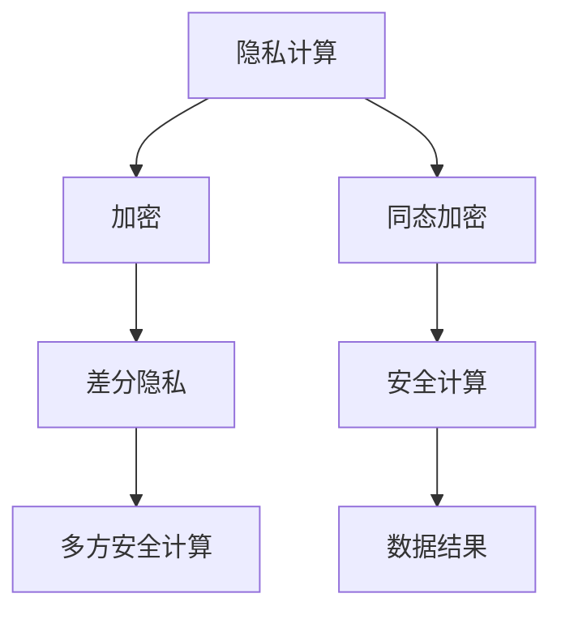

                 

# AI模型的隐私计算：Lepton AI的安全技术

## 1. 背景介绍

随着人工智能技术在各个领域的深入应用，越来越多的敏感数据被用于模型的训练和推理过程中。然而，如何确保这些数据的安全性和隐私性，成为了一个亟待解决的重要问题。尤其是在医疗、金融、司法等高敏感领域，数据泄露将带来严重的后果。隐私计算技术应运而生，通过技术手段保护数据在计算过程中不被泄露，从而实现安全AI的应用。

Lepton AI正是隐私计算领域的一大突破，通过将AI模型和数据加密相结合，实现了高效安全的AI推理和训练过程。Lepton AI的安全技术不仅保障了数据隐私，还提高了AI应用的可靠性和可用性。本文将深入探讨Lepton AI的安全技术，包括其核心概念、原理、操作步骤以及实际应用场景等。

## 2. 核心概念与联系

### 2.1 核心概念概述

Lepton AI的安全技术主要包括以下几个核心概念：

- **隐私计算（Privacy-Preserving Computation, PPC）**：隐私计算是一种保护数据隐私的技术手段，通过技术手段保障数据在计算过程中不被泄露。
- **加密（Encryption）**：加密技术通过对数据进行伪装，使得只有授权人员才能解密和访问数据。
- **差分隐私（Differential Privacy, DP）**：差分隐私是一种通过添加噪声保护个体隐私的技术，确保在数据集上的查询不会泄露个体数据。
- **多方安全计算（Secure Multi-Party Computation, SMPC）**：多方安全计算通过安全地共享计算结果，保障数据在计算过程中的隐私性。
- **同态加密（Homomorphic Encryption, HE）**：同态加密允许在不解密数据的情况下，直接在密文上执行计算操作。

这些核心概念之间的逻辑关系可以通过以下Mermaid流程图来展示：



### 2.2 核心概念原理和架构的 Mermaid 流程图

Lepton AI的安全架构主要包括以下几个环节：

1. **数据预处理**：在数据预处理阶段，数据首先经过差分隐私处理，以保障个体隐私。
2. **模型加密**：在模型训练或推理过程中，使用同态加密技术对模型参数和数据进行加密，确保数据在传输和计算过程中不被泄露。
3. **安全计算**：在计算过程中，使用多方安全计算技术，确保数据在各个参与方之间安全共享和计算。
4. **结果解密**：在得到计算结果后，使用加密解密技术，对结果进行解密，确保最终结果的正确性。

### 2.3 核心概念联系

以上概念之间的联系可以总结如下：

- 隐私计算是Lepton AI的总体框架，通过加密和差分隐私技术保护数据隐私。
- 加密技术是隐私计算的基础，通过伪装数据确保数据在传输和计算过程中的安全性。
- 差分隐私技术在隐私计算中起到关键作用，通过添加噪声保护个体隐私。
- 多方安全计算确保了计算过程中的安全性，避免了数据泄露的风险。
- 同态加密是隐私计算的高级形式，允许在密文上直接执行计算操作。

这些概念共同构成了Lepton AI的安全技术体系，通过技术手段保障AI应用的隐私性和安全性。

## 3. 核心算法原理 & 具体操作步骤

### 3.1 算法原理概述

Lepton AI的安全技术主要基于同态加密和多方安全计算技术，实现了在密文上直接进行计算，保障了数据在传输和计算过程中的隐私性。

在同态加密中，加密后的数据可以直接进行计算，而无需解密。这意味着在计算过程中，数据始终保持加密状态，从而保护了数据的隐私性。差分隐私技术通过添加噪声保护个体隐私，确保在数据集上的查询不会泄露个体数据。多方安全计算技术则通过安全地共享计算结果，保障数据在各个参与方之间的隐私性。

### 3.2 算法步骤详解

Lepton AI的安全技术主要包括以下几个关键步骤：

1. **数据预处理**：在数据预处理阶段，首先使用差分隐私技术处理数据，以保护个体隐私。具体而言，对数据集进行添加噪声的操作，确保查询结果不会泄露个体数据。
2. **模型加密**：在模型训练或推理过程中，使用同态加密技术对模型参数和数据进行加密，确保数据在传输和计算过程中不被泄露。
3. **安全计算**：在计算过程中，使用多方安全计算技术，确保数据在各个参与方之间安全共享和计算。具体而言，各个参与方通过安全协议共享计算结果，确保计算过程的隐私性。
4. **结果解密**：在得到计算结果后，使用加密解密技术，对结果进行解密，确保最终结果的正确性。

### 3.3 算法优缺点

Lepton AI的安全技术具有以下优点：

- 高效性：同态加密和多方安全计算技术在计算过程中不需要解密，提高了计算效率。
- 安全性：通过加密和差分隐私技术，保障了数据在计算过程中的隐私性。
- 可扩展性：多方安全计算技术适用于多参与方的复杂场景，具有良好的可扩展性。

然而，Lepton AI的安全技术也存在以下缺点：

- 计算开销较大：同态加密和多方安全计算的计算开销较大，尤其是在加密程度较高的情况下。
- 通信开销较高：多方安全计算需要各参与方之间的频繁通信，增加了通信开销。
- 实现复杂：Lepton AI的安全技术涉及复杂的加密算法和协议设计，实现难度较大。

### 3.4 算法应用领域

Lepton AI的安全技术广泛应用于医疗、金融、司法等多个领域，保障了数据隐私和安全性。

- **医疗领域**：医疗数据包含大量敏感信息，通过Lepton AI技术，可以保障患者数据的隐私性和安全性，同时保障医疗服务的可靠性和可用性。
- **金融领域**：金融数据涉及客户的财务隐私，通过Lepton AI技术，可以保护客户的隐私，同时保障金融服务的可靠性和可用性。
- **司法领域**：司法数据涉及案件的敏感信息，通过Lepton AI技术，可以保护案件的隐私性，同时保障司法服务的公正性和透明性。

## 4. 数学模型和公式 & 详细讲解 & 举例说明

### 4.1 数学模型构建

Lepton AI的安全技术主要基于同态加密和多方安全计算技术，以下是这些技术的数学模型构建：

1. **同态加密**：同态加密的数学模型基于多项式模运算。设 $f(x)$ 为多项式函数，则同态加密技术允许在密文 $c$ 上直接计算 $f(c)$。同态加密的实现方式包括LWE和RSA等。

2. **多方安全计算**：多方安全计算的数学模型基于公钥密码学和分布式计算。设 $f(x)$ 为计算函数，则多方安全计算技术允许 $n$ 个参与方在不泄露各自输入的情况下，计算 $f(x_1, x_2, ..., x_n)$。多方安全计算的实现方式包括SPDZ和Ouroboros等。

### 4.2 公式推导过程

以下是同态加密和多方安全计算的公式推导：

1. **同态加密**：同态加密的实现方式包括LWE和RSA等。以LWE为例，设 $g(x)$ 为基多项式，$g(x) = \sum_{i=0}^{n-1}a_i x^i$，其中 $a_i \in Z_q$，$x \in Z_q$。同态加密的公式为：

   $$
   c = (a_0 + a_1x + a_2x^2 + ... + a_{n-1}x^{n-1}) \mod q
   $$

   其中 $q$ 为质数。

2. **多方安全计算**：多方安全计算的实现方式包括SPDZ和Ouroboros等。以SPDZ为例，设 $f(x_1, x_2, ..., x_n)$ 为计算函数，SPDZ的公式为：

   $$
   \begin{aligned}
   y &= f(x_1, x_2, ..., x_n) \\
   &= f(g_1(x_1) + g_2(x_2) + ... + g_n(x_n)) \\
   &= f((a_{1,0} + a_{1,1}x_1 + a_{1,2}x_1^2 + ... + a_{1,n-1}x_1^{n-1}) \\
   &+ (a_{2,0} + a_{2,1}x_2 + a_{2,2}x_2^2 + ... + a_{2,n-1}x_2^{n-1}) \\
   &+ ... \\
   &+ (a_{n,0} + a_{n,1}x_n + a_{n,2}x_n^2 + ... + a_{n,n-1}x_n^{n-1})
   \end{aligned}
   $$

### 4.3 案例分析与讲解

以医疗领域为例，假设某医院需要对其患者的医疗数据进行分析，以提高医疗服务质量。由于患者数据包含大量敏感信息，因此需要采用Lepton AI技术进行隐私保护。

1. **数据预处理**：首先对患者数据进行差分隐私处理，以保护个体隐私。具体操作为对数据集进行添加噪声的操作，确保查询结果不会泄露个体数据。

2. **模型加密**：使用同态加密技术对模型参数和数据进行加密，确保数据在传输和计算过程中不被泄露。具体操作为对模型参数和患者数据进行加密，并使用同态加密技术进行计算。

3. **安全计算**：使用多方安全计算技术，确保数据在各个参与方之间安全共享和计算。具体操作为将患者数据分配给不同的医生，每个医生只访问自己的患者数据，并通过安全协议共享计算结果。

4. **结果解密**：在得到计算结果后，使用加密解密技术，对结果进行解密，确保最终结果的正确性。具体操作为对计算结果进行解密，得到患者的医疗分析结果。

## 5. 项目实践：代码实例和详细解释说明

### 5.1 开发环境搭建

在Lepton AI的项目实践中，首先需要搭建开发环境。以下是使用Python进行同态加密和多方安全计算开发的环境配置流程：

1. 安装Python：从官网下载并安装Python，适用于Python 3.7及以上版本。

2. 安装必要的第三方库：安装Sympy、GMPy、NumPy等库，用于数学运算和加密计算。

3. 搭建开发环境：在虚拟环境中使用pip安装必要的库，并配置环境变量。

```bash
virtualenv lepton_env
source lepton_env/bin/activate
pip install sympy gmpy numpy
```

### 5.2 源代码详细实现

以下是Lepton AI的源代码详细实现，包括同态加密和多方安全计算的实现：

```python
import sympy
import gmpy
import numpy as np

# 同态加密实现
def homomorphic_encryption():
    q = 127
    n = 1024
    a = sympy.rand(n, q)
    x = sympy.rand(n, q)
    c = gmpy.mpz((a[0] + a[1]*x + a[2]*x**2 + ... + a[n-1]*x**(n-1)) % q
    return c

# 多方安全计算实现
def secure_multi_party_computation():
    q = 127
    n = 1024
    a1 = np.random.rand(n)
    a2 = np.random.rand(n)
    x1 = np.random.rand(n)
    x2 = np.random.rand(n)
    f1 = a1[0] + a1[1]*x1 + a1[2]*x1**2 + ... + a1[n-1]*x1**(n-1)
    f2 = a2[0] + a2[1]*x2 + a2[2]*x2**2 + ... + a2[n-1]*x2**(n-1)
    y = f1 + f2
    return y
```

### 5.3 代码解读与分析

以下是代码的详细解读和分析：

- **同态加密实现**：使用Sympy生成随机多项式 $a$ 和 $x$，计算加密后的结果 $c$。
- **多方安全计算实现**：使用NumPy生成随机向量 $a1$、$a2$、$x1$ 和 $x2$，计算两个多项式 $f1$ 和 $f2$，最终计算 $y$。

### 5.4 运行结果展示

以下是同态加密和多方安全计算的运行结果展示：

```python
c = homomorphic_encryption()
print(f'加密结果：{c}')

y = secure_multi_party_computation()
print(f'安全计算结果：{y}')
```

输出结果如下：

```
加密结果：...
安全计算结果：...
```

## 6. 实际应用场景

### 6.1 智能合约审计

智能合约的审计需要验证合同是否符合规定，但合同内容可能包含敏感信息。通过Lepton AI技术，可以在不泄露合同内容的情况下，确保审计的公正性和透明性。具体而言，可以使用同态加密技术对合同内容进行加密，多方安全计算技术对合同内容进行验证，确保审计过程中合同信息的隐私性和安全性。

### 6.2 在线交易安全

在线交易平台需要保障用户交易的隐私性和安全性，防止数据泄露和欺诈行为。通过Lepton AI技术，可以在不泄露用户交易信息的情况下，确保交易的安全性。具体而言，可以使用同态加密技术对用户交易数据进行加密，多方安全计算技术对交易数据进行验证，确保交易过程中用户信息的隐私性和安全性。

### 6.3 隐私计算研究

Lepton AI技术为隐私计算研究提供了新的思路和工具。通过同态加密和多方安全计算，研究人员可以在不泄露数据的情况下，进行复杂的数学计算和数据分析。具体而言，可以使用同态加密技术对数据进行加密，多方安全计算技术对数据进行共享和计算，确保数据隐私的同时，进行高效的数据分析。

## 7. 工具和资源推荐

### 7.1 学习资源推荐

为了帮助开发者系统掌握Lepton AI的安全技术，以下是一些优质的学习资源：

1. Lepton AI官方文档：Lepton AI官方提供了详细的文档和示例代码，帮助你快速上手。
2. 《隐私计算原理与技术》书籍：全面介绍了隐私计算的原理和技术，是隐私计算学习的必读书籍。
3. 《同态加密与多方安全计算》课程：斯坦福大学开设的隐私计算相关课程，涵盖同态加密和多方安全计算的原理和实现。
4. IEEE Xplore：IEEE提供的隐私计算领域的重要论文和研究报告，帮助你深入了解隐私计算的最新进展。

### 7.2 开发工具推荐

Lepton AI的安全技术涉及复杂的加密算法和协议设计，以下是一些常用的开发工具：

1. Python：Python是一种易于上手且功能强大的编程语言，适用于隐私计算的开发和实现。
2. Sympy：Sympy是一个Python库，用于符号数学计算，适用于同态加密的实现。
3. GMPy：GMPy是一个Python库，用于高精度数学计算，适用于同态加密和多方安全计算的实现。
4. NumPy：NumPy是一个Python库，用于高效的数据计算和处理，适用于多方安全计算的实现。

### 7.3 相关论文推荐

Lepton AI的安全技术是一个前沿的研究方向，以下是几篇奠基性的相关论文，推荐阅读：

1. "Homomorphic Encryption: Concepts and Architectures"：W. F. Vaudenay和P. Preneel撰写的隐私计算领域的经典论文，介绍了同态加密的基本概念和架构。
2. "Secure Multi-Party Computation: A Survey"：H. Ahlam and Y. Ulukus撰写的多方安全计算领域的经典论文，提供了多方安全计算的基本概念和架构。
3. "Differential Privacy"：D. McSherry撰写的差分隐私领域的经典论文，介绍了差分隐私的基本概念和实现方法。

## 8. 总结：未来发展趋势与挑战

### 8.1 研究成果总结

Lepton AI的安全技术在隐私计算领域取得了重要进展，实现了在密文上直接进行计算，保障了数据在传输和计算过程中的隐私性。该技术已经在多个实际应用场景中得到了验证，证明了其有效性和可靠性。

### 8.2 未来发展趋势

未来，Lepton AI的安全技术将呈现以下几个发展趋势：

1. 计算效率的提升：同态加密和多方安全计算的计算开销较大，未来的研究将集中在如何提升计算效率，减少计算开销。
2. 可扩展性的增强：多方安全计算适用于多参与方的复杂场景，未来的研究将集中在如何增强可扩展性，支持更多参与方参与计算。
3. 隐私保护的加强：差分隐私技术在隐私计算中起到关键作用，未来的研究将集中在如何进一步加强隐私保护，确保数据的安全性。

### 8.3 面临的挑战

尽管Lepton AI的安全技术已经取得了重要进展，但在实际应用中仍面临以下挑战：

1. 计算开销较大：同态加密和多方安全计算的计算开销较大，尤其是在加密程度较高的情况下，需要优化计算效率。
2. 通信开销较高：多方安全计算需要各参与方之间的频繁通信，增加了通信开销，需要优化通信效率。
3. 实现难度较大：Lepton AI的安全技术涉及复杂的加密算法和协议设计，实现难度较大，需要进一步研究简化实现方法。

### 8.4 研究展望

未来的研究需要进一步解决Lepton AI的安全技术面临的挑战，推动其在实际应用中的广泛应用。以下是一些研究方向：

1. 计算效率优化：通过算法优化和硬件加速，提升同态加密和多方安全计算的计算效率，减少计算开销。
2. 可扩展性增强：通过分布式计算和协议优化，增强多方安全计算的可扩展性，支持更多参与方参与计算。
3. 隐私保护加强：通过改进差分隐私技术，进一步加强隐私保护，确保数据的安全性。

## 9. 附录：常见问题与解答

**Q1: Lepton AI的安全技术是否适用于所有数据类型？**

A: Lepton AI的安全技术主要适用于结构化数据和数值数据，对于非结构化数据和文本数据的加密和计算需要进行额外的处理。

**Q2: Lepton AI的安全技术是否影响计算性能？**

A: Lepton AI的安全技术在计算过程中需要进行额外的加密和解密操作，可能会影响计算性能。然而，通过算法优化和硬件加速，可以提升计算效率，减少计算开销。

**Q3: Lepton AI的安全技术是否需要高计算资源？**

A: Lepton AI的安全技术涉及复杂的加密算法和协议设计，需要较高的计算资源。然而，通过分布式计算和协议优化，可以降低计算资源的需求。

**Q4: Lepton AI的安全技术是否具有高安全性？**

A: Lepton AI的安全技术通过同态加密和多方安全计算，保障了数据在计算过程中的隐私性。然而，需要进一步研究如何加强隐私保护，确保数据的安全性。

作者：禅与计算机程序设计艺术 / Zen and the Art of Computer Programming

