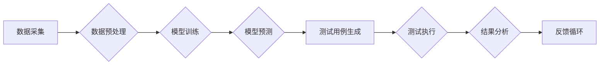

> AI, 软件测试, 自动化测试, 机器学习, 深度学习, 软件质量

## 1. 背景介绍

在当今软件开发日益快速迭代的时代，软件质量和可靠性已成为至关重要的竞争优势。传统的软件测试方法，例如人工测试和基于规则的自动化测试，在面对复杂、庞大的软件系统时，往往难以满足需求。 

随着人工智能（AI）技术的飞速发展，AI辅助软件测试逐渐成为软件开发领域的新兴趋势。AI技术能够分析软件代码、识别潜在缺陷、自动生成测试用例，并根据测试结果进行分析和优化，从而显著提高软件测试的效率、准确性和覆盖率。

## 2. 核心概念与联系

**2.1 AI辅助软件测试的概念**

AI辅助软件测试是指利用人工智能技术辅助软件测试过程，提高测试效率、准确性和覆盖率。它涵盖了以下几个核心概念：

* **机器学习（ML）：**  通过训练模型，从历史测试数据中学习软件缺陷的模式，并预测新的缺陷。
* **深度学习（DL）：**  利用多层神经网络，对复杂软件系统进行更深入的分析，识别更隐蔽的缺陷。
* **自然语言处理（NLP）：**  理解和分析软件代码、测试用例和测试报告中的自然语言文本，提取关键信息，辅助测试用例设计和缺陷分析。
* **自动化测试：**  利用AI技术自动生成测试用例、执行测试用例和分析测试结果，减少人工干预。

**2.2 AI辅助软件测试的架构**

AI辅助软件测试的架构通常包括以下几个模块：



* **数据采集:** 收集软件代码、测试用例、缺陷报告等相关数据。
* **数据预处理:** 对收集到的数据进行清洗、转换和格式化，以便于模型训练。
* **模型训练:** 利用机器学习或深度学习算法，训练模型以识别软件缺陷的模式。
* **模型预测:** 将训练好的模型应用于新的软件代码或测试用例，预测潜在的缺陷。
* **测试用例生成:** 根据模型预测结果，自动生成测试用例。
* **测试执行:** 自动执行生成的测试用例，并收集测试结果。
* **结果分析:** 分析测试结果，识别缺陷并提供修复建议。
* **反馈循环:** 将测试结果反馈到模型训练环节，不断优化模型性能。

## 3. 核心算法原理 & 具体操作步骤

### 3.1  算法原理概述

AI辅助软件测试的核心算法主要包括：

* **监督学习:** 利用标记好的训练数据，训练模型识别软件缺陷。
* **无监督学习:**  从未标记的数据中发现软件缺陷的模式。
* **强化学习:**  通过奖励和惩罚机制，训练模型优化测试策略。

### 3.2  算法步骤详解

**3.2.1 监督学习算法**

1. **数据收集:** 收集软件代码、测试用例和缺陷报告等数据。
2. **数据预处理:** 清洗、转换和格式化数据，并标记缺陷信息。
3. **模型选择:** 选择合适的监督学习算法，例如支持向量机（SVM）、决策树或神经网络。
4. **模型训练:** 利用标记好的数据训练模型，学习软件缺陷的模式。
5. **模型评估:** 使用测试数据评估模型的性能，例如准确率、召回率和F1-score。
6. **模型部署:** 将训练好的模型部署到测试系统中，用于预测新的缺陷。

**3.2.2 无监督学习算法**

1. **数据收集:** 收集软件代码和测试用例数据。
2. **数据预处理:** 清洗、转换和格式化数据。
3. **异常检测:** 利用无监督学习算法，例如k-means聚类或异常值检测，识别软件代码中的异常行为或潜在缺陷。
4. **缺陷分析:** 分析异常行为或潜在缺陷，并提供修复建议。

**3.2.3 强化学习算法**

1. **环境搭建:** 建立软件测试环境，定义奖励和惩罚机制。
2. **代理训练:** 利用强化学习算法，训练代理智能体，学习优化测试策略。
3. **测试执行:** 代理智能体根据学习到的策略，自动生成测试用例和执行测试。
4. **结果反馈:** 将测试结果反馈到代理智能体，更新其策略。

### 3.3  算法优缺点

**监督学习:**

* **优点:** 准确率高，可以识别多种类型的缺陷。
* **缺点:** 需要大量的标记数据，训练成本高。

**无监督学习:**

* **优点:** 不需要标记数据，可以发现新的缺陷模式。
* **缺点:** 准确率相对较低，需要人工辅助分析结果。

**强化学习:**

* **优点:** 可以学习优化测试策略，提高测试效率。
* **缺点:** 训练复杂，需要大量的测试数据和时间。

### 3.4  算法应用领域

AI辅助软件测试的算法可以应用于以下领域：

* **代码缺陷检测:** 识别代码中的语法错误、逻辑错误和潜在安全漏洞。
* **测试用例生成:** 自动生成测试用例，覆盖软件功能的各个方面。
* **缺陷优先级排序:** 根据缺陷的严重程度和影响范围，对缺陷进行优先级排序。
* **测试结果分析:** 分析测试结果，识别缺陷趋势和潜在问题。

## 4. 数学模型和公式 & 详细讲解 & 举例说明

### 4.1  数学模型构建

在AI辅助软件测试中，常用的数学模型包括：

* **支持向量机（SVM）：** 用于分类问题，例如识别缺陷代码和正常代码。
* **决策树:** 用于分类和回归问题，例如预测缺陷的严重程度。
* **神经网络:** 用于复杂模式识别，例如识别软件缺陷的隐蔽模式。

### 4.2  公式推导过程

**4.2.1 支持向量机（SVM）**

SVM的目标是找到一个最佳的分隔超平面，将不同类别的样本分开。

**公式:**

$$
w^T x + b = 0
$$

其中：

* $w$ 是权重向量
* $x$ 是样本特征向量
* $b$ 是偏置项

**4.2.2 决策树**

决策树是一种树形结构，用于分类或回归问题。

**公式:**

决策树的构建过程涉及信息增益、基尼不纯度等指标，用于选择最优的特征和分裂点。

### 4.3  案例分析与讲解

**4.3.1 代码缺陷检测案例**

利用SVM算法，可以训练一个模型，识别代码中的缺陷代码和正常代码。

* **训练数据:** 收集大量代码样本，并标记缺陷信息。
* **模型训练:** 利用SVM算法训练模型，学习缺陷代码和正常代码的特征。
* **模型评估:** 使用测试数据评估模型的性能，例如准确率、召回率和F1-score。
* **模型部署:** 将训练好的模型部署到代码审查工具中，自动识别代码中的缺陷。

## 5. 项目实践：代码实例和详细解释说明

### 5.1  开发环境搭建

* **操作系统:** Ubuntu 20.04 LTS
* **编程语言:** Python 3.8
* **深度学习框架:** TensorFlow 2.0
* **其他工具:** Git, Jupyter Notebook

### 5.2  源代码详细实现

```python
import tensorflow as tf

# 定义模型结构
model = tf.keras.models.Sequential([
    tf.keras.layers.Dense(128, activation='relu', input_shape=(1024,)),
    tf.keras.layers.Dense(64, activation='relu'),
    tf.keras.layers.Dense(1, activation='sigmoid')
])

# 编译模型
model.compile(optimizer='adam',
              loss='binary_crossentropy',
              metrics=['accuracy'])

# 训练模型
model.fit(x_train, y_train, epochs=10, batch_size=32)

# 评估模型
loss, accuracy = model.evaluate(x_test, y_test)
print('Loss:', loss)
print('Accuracy:', accuracy)
```

### 5.3  代码解读与分析

* **模型结构:** 该代码定义了一个简单的多层感知机（MLP）模型，包含三个全连接层和一个输出层。
* **激活函数:** 使用ReLU激活函数，可以提高模型的表达能力。
* **损失函数:** 使用二元交叉熵损失函数，适合二分类问题。
* **优化器:** 使用Adam优化器，可以快速收敛。
* **训练过程:** 使用训练数据训练模型，并设置训练轮数和批处理大小。
* **评估过程:** 使用测试数据评估模型的性能，并打印损失和准确率。

### 5.4  运行结果展示

训练完成后，可以将模型部署到实际应用场景中，例如代码审查工具中，自动识别代码中的缺陷。

## 6. 实际应用场景

AI辅助软件测试已在各个行业得到广泛应用，例如：

* **金融行业:** 自动化检测金融软件中的安全漏洞和欺诈行为。
* **医疗行业:** 自动化测试医疗软件，确保其准确性和可靠性。
* **制造业:** 自动化测试工业控制系统，提高生产效率和安全性。

### 6.4  未来应用展望

未来，AI辅助软件测试将朝着以下方向发展：

* **更智能的测试策略:** 利用强化学习算法，学习优化测试策略，提高测试效率和覆盖率。
* **更精准的缺陷预测:** 利用深度学习算法，识别更隐蔽的缺陷模式，提高缺陷预测的准确率。
* **更全面的测试覆盖:** 利用自然语言处理技术，理解软件需求文档和测试用例，自动生成更全面的测试用例。

## 7. 工具和资源推荐

### 7.1  学习资源推荐

* **书籍:**
    * 《AI辅助软件测试》
    * 《机器学习实战》
    * 《深度学习》
* **在线课程:**
    * Coursera: 机器学习
    * Udacity: 深度学习
    * edX: 软件测试

### 7.2  开发工具推荐

* **TensorFlow:** 深度学习框架
* **PyTorch:** 深度学习框架
* **Keras:** 深度学习 API
* **Scikit-learn:** 机器学习库

### 7.3  相关论文推荐

* **论文:**
    * 《AI-Powered Software Testing: A Survey》
    * 《Deep Learning for Software Defect Prediction》
    * 《Automated Test Case Generation Using Reinforcement Learning》

## 8. 总结：未来发展趋势与挑战

### 8.1  研究成果总结

AI辅助软件测试已取得了显著成果，例如提高了测试效率、准确性和覆盖率。

### 8.2  未来发展趋势

未来，AI辅助软件测试将朝着更智能、更精准、更全面的方向发展。

### 8.3  面临的挑战

AI辅助软件测试还面临一些挑战，例如：

* **数据获取和标注:** 需要大量的标记数据来训练AI模型。
* **模型解释性和可信度:** AI模型的决策过程往往难以解释，需要提高模型的可信度。
* **技术标准和规范:** 需要制定相应的技术标准和规范，推动AI辅助软件测试的规范化发展。

### 8.4  研究展望

未来，需要进一步研究以下问题：

* 如何更有效地获取和标注软件测试数据。
* 如何提高AI模型的解释性和可信度。
* 如何将AI辅助软件测试与其他软件开发流程更好地融合。

## 9. 附录：常见问题与解答

**9.1  AI辅助软件测试是否会取代人工测试？**

AI辅助软件测试可以提高测试效率和准确率，但不会完全取代人工测试。人工测试仍然需要在一些情况下发挥作用，例如：

* 测试复杂、难以量化的软件功能。
* 需要对测试