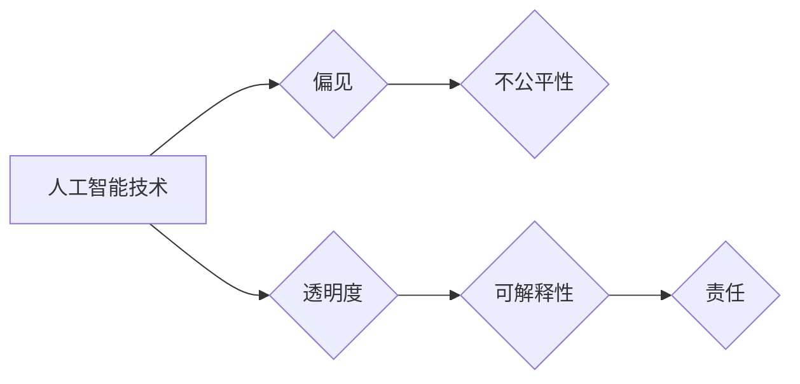

> 人工智能，伦理问题，偏见，公平性，透明度，可解释性，责任

## 1. 背景介绍

人工智能（AI）技术近年来取得了飞速发展，在各个领域都展现出巨大的潜力。从自动驾驶汽车到医疗诊断，从个性化推荐到金融风险评估，AI正在深刻地改变着我们的生活。然而，随着AI技术的不断进步，其带来的伦理问题也日益凸显。

Andrej Karpathy，一位享誉全球的人工智能专家，曾多次强调AI伦理的重要性。他认为，AI技术的发展必须与伦理道德相结合，才能真正造福人类。

## 2. 核心概念与联系

**2.1 核心概念**

* **人工智能（AI）：** 指能够模拟人类智能行为的计算机系统。
* **伦理问题：** 指与道德规范、价值观和社会责任相关的议题。
* **偏见：** 指AI系统在训练数据中学习到的不公平或歧视性的模式。
* **公平性：** 指AI系统对所有用户提供平等和公正的服务。
* **透明度：** 指AI系统的决策过程能够被人类理解和解释。
* **可解释性：** 指AI系统能够为其决策提供清晰的理由和依据。
* **责任：** 指AI系统开发、部署和使用过程中，各方应承担的义务和责任。

**2.2 核心概念联系**

AI伦理问题涉及到多个核心概念之间的相互关联。例如，AI系统的偏见问题可能导致不公平的结果，而缺乏透明度和可解释性则难以追究责任。

**Mermaid 流程图**



## 3. 核心算法原理 & 具体操作步骤

**3.1 算法原理概述**

深度学习是AI领域最热门的技术之一，其核心算法是多层神经网络。神经网络通过模仿人类大脑的结构和功能，学习数据中的模式和规律。

**3.2 算法步骤详解**

1. **数据预处理：** 将原始数据转换为模型可以理解的格式。
2. **网络结构设计：** 根据任务需求设计神经网络的层数、节点数和激活函数等参数。
3. **模型训练：** 使用训练数据训练神经网络，调整网络参数，使模型能够准确预测输出。
4. **模型评估：** 使用测试数据评估模型的性能，例如准确率、召回率等指标。
5. **模型部署：** 将训练好的模型部署到实际应用场景中。

**3.3 算法优缺点**

**优点：**

* 能够学习复杂的数据模式。
* 性能优于传统机器学习算法。
* 应用范围广泛。

**缺点：**

* 训练数据量大，计算资源消耗高。
* 训练过程黑盒化，难以解释模型决策。
* 容易受到训练数据中的偏见影响。

**3.4 算法应用领域**

* **图像识别：** 人脸识别、物体检测、图像分类等。
* **自然语言处理：** 机器翻译、文本摘要、情感分析等。
* **语音识别：** 语音转文本、语音助手等。
* **医疗诊断：** 疾病预测、影像分析等。

## 4. 数学模型和公式 & 详细讲解 & 举例说明

**4.1 数学模型构建**

深度学习模型通常使用神经网络来表示，神经网络由多个层组成，每一层包含多个神经元。每个神经元接收来自上一层的输入信号，并通过激活函数进行处理，输出到下一层。

**4.2 公式推导过程**

神经网络的训练过程是通过优化模型参数来实现的。常用的优化算法是梯度下降法，其核心公式如下：

$$
\theta = \theta - \alpha \nabla J(\theta)
$$

其中：

* $\theta$ 是模型参数。
* $\alpha$ 是学习率。
* $\nabla J(\theta)$ 是损失函数 $J(\theta)$ 的梯度。

**4.3 案例分析与讲解**

假设我们训练一个图像分类模型，目标是识别猫和狗的图片。

* 损失函数 $J(\theta)$ 可以选择交叉熵损失函数，用于衡量模型预测结果与真实标签之间的差异。
* 梯度下降法会计算损失函数的梯度，并根据梯度更新模型参数，使损失函数逐渐减小。
* 通过反复迭代，模型最终能够准确地识别猫和狗的图片。

## 5. 项目实践：代码实例和详细解释说明

**5.1 开发环境搭建**

* 操作系统：Ubuntu 20.04
* Python 版本：3.8
* 深度学习框架：TensorFlow 2.0

**5.2 源代码详细实现**

```python
import tensorflow as tf

# 定义模型结构
model = tf.keras.models.Sequential([
    tf.keras.layers.Conv2D(32, (3, 3), activation='relu', input_shape=(28, 28, 1)),
    tf.keras.layers.MaxPooling2D((2, 2)),
    tf.keras.layers.Conv2D(64, (3, 3), activation='relu'),
    tf.keras.layers.MaxPooling2D((2, 2)),
    tf.keras.layers.Flatten(),
    tf.keras.layers.Dense(10, activation='softmax')
])

# 编译模型
model.compile(optimizer='adam',
              loss='sparse_categorical_crossentropy',
              metrics=['accuracy'])

# 训练模型
model.fit(x_train, y_train, epochs=10)

# 评估模型
loss, accuracy = model.evaluate(x_test, y_test)
print('Test loss:', loss)
print('Test accuracy:', accuracy)
```

**5.3 代码解读与分析**

* 代码定义了一个简单的卷积神经网络模型，用于识别手写数字。
* 模型使用Adam优化器，交叉熵损失函数，并使用准确率作为评估指标。
* 模型训练了10个epochs，并使用测试数据评估模型性能。

**5.4 运行结果展示**

运行代码后，会输出模型在测试数据上的损失值和准确率。

## 6. 实际应用场景

**6.1 自动驾驶汽车**

AI技术在自动驾驶汽车中扮演着至关重要的角色，例如：

* **环境感知：** 利用摄像头、雷达和激光雷达等传感器，感知周围环境。
* **路径规划：** 根据环境信息，规划行驶路线。
* **决策控制：** 根据规划路线，控制车辆的加速、减速和转向。

**6.2 医疗诊断**

AI技术可以辅助医生进行疾病诊断，例如：

* **影像分析：** 分析X光片、CT扫描和MRI图像，识别病变。
* **疾病预测：** 根据患者的病史、症状和基因信息，预测疾病风险。
* **个性化治疗：** 根据患者的个体特征，制定个性化的治疗方案。

**6.3 金融风险评估**

AI技术可以帮助金融机构评估风险，例如：

* **欺诈检测：** 识别信用卡欺诈和网络钓鱼攻击。
* **信用评分：** 根据客户的信用历史和财务状况，评估其信用风险。
* **投资决策：** 分析市场数据，预测股票价格走势。

**6.4 未来应用展望**

AI技术的应用场景还在不断扩展，未来将应用于更多领域，例如：

* **教育：** 个性化学习、智能辅导。
* **娱乐：** 智能游戏、虚拟现实。
* **制造业：** 智能机器人、工业自动化。

## 7. 工具和资源推荐

**7.1 学习资源推荐**

* **课程：**
    * Andrew Ng 的机器学习课程
    * DeepLearning.AI 的深度学习课程
* **书籍：**
    * 深度学习
    * 人工智能：一种现代方法
* **网站：**
    * TensorFlow 官网
    * PyTorch 官网
    * Kaggle

**7.2 开发工具推荐**

* **Python：** 广泛用于AI开发的编程语言。
* **TensorFlow：** 开源深度学习框架。
* **PyTorch：** 开源深度学习框架。
* **Jupyter Notebook：** 用于代码编写和可视化分析的工具。

**7.3 相关论文推荐**

* **ImageNet Classification with Deep Convolutional Neural Networks**
* **Attention Is All You Need**
* **BERT: Pre-training of Deep Bidirectional Transformers for Language Understanding**

## 8. 总结：未来发展趋势与挑战

**8.1 研究成果总结**

近年来，AI技术取得了显著进展，在多个领域取得了突破性成果。例如，图像识别、自然语言处理和语音识别等领域都取得了大幅度的提升。

**8.2 未来发展趋势**

* **模型规模和复杂度提升：** 未来AI模型将更加庞大，更加复杂，能够处理更复杂的任务。
* **跨模态学习：** AI模型将能够处理多种数据类型，例如文本、图像、音频和视频。
* **边缘计算：** AI模型将部署到边缘设备，实现更快速的响应和更低的延迟。
* **可解释性增强：** 研究人员将致力于提高AI模型的可解释性，使人类能够更好地理解模型的决策过程。

**8.3 面临的挑战**

* **数据偏见：** AI模型容易受到训练数据中的偏见影响，导致不公平的结果。
* **隐私保护：** AI模型的训练和应用可能涉及到用户的隐私数据，需要采取措施保护用户隐私。
* **安全风险：** AI模型可能被恶意攻击，导致安全漏洞。
* **伦理问题：** AI技术的应用可能引发伦理问题，需要进行深入的探讨和研究。

**8.4 研究展望**

未来，AI研究将继续朝着更安全、更可靠、更公平的方向发展。研究人员将致力于解决AI技术面临的挑战，并探索AI技术的更多应用场景。

## 9. 附录：常见问题与解答

**9.1 如何解决AI模型的偏见问题？**

* 使用更公平、更代表性的训练数据。
* 在训练过程中加入公平性约束。
* 开发可解释的AI模型，以便更好地理解模型的决策过程。

**9.2 如何保护用户隐私？**

* 使用匿名化技术，保护用户的身份信息。
* 采用联邦学习等隐私保护技术，避免将用户数据集中存储。
* 明确告知用户数据的使用目的和方式。

**9.3 如何确保AI系统的安全？**

* 对AI模型进行安全评估，识别潜在的漏洞。
* 使用安全技术，防止恶意攻击。
* 建立完善的安全管理体系。


作者：禅与计算机程序设计艺术 / Zen and the Art of Computer Programming 
<end_of_turn>