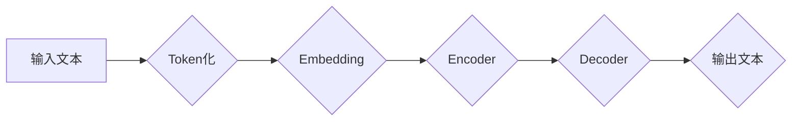

> ChatGPT,文本生成,Transformer,GPT模型,自然语言处理,深度学习

## 1. 背景介绍

近年来，人工智能技术取得了飞速发展，其中自然语言处理（NLP）领域取得了突破性进展。ChatGPT作为一款基于Transformer架构的强大语言模型，能够生成逼真、流畅的文本，引发了广泛的关注和讨论。本文将深入探讨ChatGPT的文本生成步骤，从核心概念到算法原理，再到实际应用场景，全面解析其工作机制。

## 2. 核心概念与联系

ChatGPT的核心是Transformer模型，它是一种专门设计用于处理序列数据的深度学习架构。与传统的循环神经网络（RNN）相比，Transformer具有以下优势：

* **并行计算能力强:** Transformer可以并行处理输入序列中的所有元素，大大提高了训练速度。
* **长距离依赖关系处理能力强:** Transformer通过自注意力机制，能够有效捕捉长距离依赖关系，生成更连贯的文本。

**Mermaid 流程图:**



**核心概念解释:**

* **Token化:** 将输入文本分割成一个个独立的单位（token），例如单词或子词。
* **Embedding:** 将每个token映射到一个低维向量空间，表示其语义信息。
* **Encoder:** 对输入序列进行编码，提取其语义特征。
* **Decoder:** 根据编码后的信息，生成目标文本序列。

## 3. 核心算法原理 & 具体操作步骤

### 3.1  算法原理概述

ChatGPT的文本生成基于Transformer模型的解码器部分，其核心是自回归语言模型（Autoregressive Language Model）。自回归模型的特点是根据之前生成的文本预测下一个token。

### 3.2  算法步骤详解

1. **输入文本预处理:** 将输入文本进行token化和embedding操作。
2. **编码阶段:** 将token化的输入序列输入到Encoder中，提取其语义特征。
3. **解码阶段:** 将编码后的信息输入到Decoder中，并使用自注意力机制和前馈神经网络进行处理。
4. **预测下一个token:** Decoder在每个时间步都会预测下一个token的概率分布，并根据概率分布选择最可能的token。
5. **生成文本:** 将预测的token串联起来，即可得到生成的文本。

### 3.3  算法优缺点

**优点:**

* 生成文本流畅自然，语法结构正确。
* 可以处理长距离依赖关系，生成更连贯的文本。
* 训练速度快，并行计算能力强。

**缺点:**

* 可能会生成一些不符合逻辑或重复性的文本。
* 缺乏对真实世界知识的理解，生成的文本可能存在偏差或错误。
* 训练数据对模型性能有很大影响，需要大量高质量的数据进行训练。

### 3.4  算法应用领域

ChatGPT的文本生成能力在多个领域都有广泛的应用，例如：

* **聊天机器人:** 开发更智能、更自然的聊天机器人。
* **文本摘要:** 自动生成文本摘要，提高阅读效率。
* **机器翻译:** 实现更准确、更流畅的机器翻译。
* **内容创作:** 辅助创作小说、诗歌、剧本等创意内容。

## 4. 数学模型和公式 & 详细讲解 & 举例说明

### 4.1  数学模型构建

ChatGPT的文本生成基于Transformer模型，其核心是自注意力机制和多头注意力机制。

**自注意力机制:**

自注意力机制能够捕捉序列中不同元素之间的关系，并赋予每个元素不同的权重。其计算公式如下：

$$
Attention(Q, K, V) = softmax(\frac{QK^T}{\sqrt{d_k}})V
$$

其中：

* $Q$：查询矩阵
* $K$：键矩阵
* $V$：值矩阵
* $d_k$：键向量的维度
* $softmax$：softmax函数

**多头注意力机制:**

多头注意力机制将自注意力机制应用于多个不同的子空间，并将其结果进行融合，从而提高模型的表达能力。

### 4.2  公式推导过程

自注意力机制的公式推导过程如下：

1. 将输入序列 $X$ 映射到查询矩阵 $Q$、键矩阵 $K$ 和值矩阵 $V$。
2. 计算每个元素 $q_i$ 与所有元素 $k_j$ 之间的相似度，并使用softmax函数将其归一化，得到注意力权重 $a_{ij}$。
3. 将注意力权重与值矩阵 $V$ 进行加权求和，得到每个元素 $q_i$ 的输出 $o_i$。

### 4.3  案例分析与讲解

假设我们有一个输入序列 $X = [“我”， “爱”， “学习”]，$ 则其对应的查询矩阵 $Q$、键矩阵 $K$ 和值矩阵 $V$ 为：

$$
Q = \begin{bmatrix}
q_1 & q_2 & q_3
\end{bmatrix}
$$

$$
K = \begin{bmatrix}
k_1 & k_2 & k_3
\end{bmatrix}
$$

$$
V = \begin{bmatrix}
v_1 & v_2 & v_3
\end{bmatrix}
$$

其中 $q_i$、$k_i$ 和 $v_i$ 分别表示每个单词的查询向量、键向量和值向量。

通过计算 $Q$ 和 $K$ 的点积，并使用softmax函数归一化，我们可以得到每个单词之间的注意力权重。然后，将注意力权重与 $V$ 进行加权求和，即可得到每个单词的输出。

## 5. 项目实践：代码实例和详细解释说明

### 5.1  开发环境搭建

ChatGPT的开发环境需要安装Python、PyTorch或TensorFlow等深度学习框架，以及一些必要的库，例如transformers、numpy等。

### 5.2  源代码详细实现

ChatGPT的源代码主要由Encoder、Decoder和训练脚本组成。

**Encoder:**

```python
class Encoder(nn.Module):
    def __init__(self, d_model, nhead, num_layers):
        super(Encoder, self).__init__()
        self.layers = nn.ModuleList([
            nn.TransformerEncoderLayer(d_model, nhead)
            for _ in range(num_layers)
        ])

    def forward(self, src, src_mask):
        for layer in self.layers:
            src = layer(src, src_mask)
        return src
```

**Decoder:**

```python
class Decoder(nn.Module):
    def __init__(self, d_model, nhead, num_layers):
        super(Decoder, self).__init__()
        self.layers = nn.ModuleList([
            nn.TransformerDecoderLayer(d_model, nhead)
            for _ in range(num_layers)
        ])

    def forward(self, tgt, memory, tgt_mask, memory_mask):
        for layer in self.layers:
            tgt = layer(tgt, memory, tgt_mask, memory_mask)
        return tgt
```

**训练脚本:**

```python
# 训练脚本
# ...
```

### 5.3  代码解读与分析

* Encoder负责对输入序列进行编码，提取其语义特征。
* Decoder负责根据编码后的信息生成目标文本序列。
* 训练脚本负责加载数据、定义模型、设置训练参数，并进行模型训练和评估。

### 5.4  运行结果展示

训练完成后，可以使用ChatGPT生成文本。例如，输入“今天天气怎么样？”，ChatGPT可能会生成“今天天气晴朗”。

## 6. 实际应用场景

ChatGPT在多个领域都有实际应用场景，例如：

### 6.1  聊天机器人

ChatGPT可以用于开发更智能、更自然的聊天机器人，例如客服机器人、陪伴机器人等。

### 6.2  文本摘要

ChatGPT可以自动生成文本摘要，例如新闻摘要、会议纪要等，提高阅读效率。

### 6.3  机器翻译

ChatGPT可以实现更准确、更流畅的机器翻译，例如将英文翻译成中文。

### 6.4  未来应用展望

ChatGPT的文本生成能力在未来将有更广泛的应用，例如：

* **个性化教育:** 根据学生的学习情况，生成个性化的学习内容。
* **创意写作:** 辅助创作小说、诗歌、剧本等创意内容。
* **代码生成:** 根据自然语言描述，自动生成代码。

## 7. 工具和资源推荐

### 7.1  学习资源推荐

* **论文:**
    * Vaswani, A., Shazeer, N., Parmar, N., Uszkoreit, J., Jones, L., Gomez, A. N., ... & Polosukhin, I. (2017). Attention is all you need. In Advances in neural information processing systems (pp. 5998-6008).
* **博客:**
    * https://huggingface.co/blog/transformer-xl
    * https://jalammar.github.io/illustrated-transformer/

### 7.2  开发工具推荐

* **transformers:** https://huggingface.co/transformers/
* **PyTorch:** https://pytorch.org/
* **TensorFlow:** https://www.tensorflow.org/

### 7.3  相关论文推荐

* **BERT:** Devlin, J., Chang, M. W., Lee, K., & Toutanova, K. (2018). Bert: Pre-training of deep bidirectional transformers for language understanding. arXiv preprint arXiv:1810.04805.
* **GPT-3:** Brown, T. B., Mann, B., Ryder, N., Subbiah, M., Kaplan, J., Dhariwal, P., ... & Amodei, D. (2020). Language models are few-shot learners. arXiv preprint arXiv:2005.14165.

## 8. 总结：未来发展趋势与挑战

### 8.1  研究成果总结

ChatGPT的文本生成能力取得了显著的进展，能够生成逼真、流畅的文本，并在多个领域都有实际应用。

### 8.2  未来发展趋势

未来，ChatGPT的文本生成能力将继续提升，例如：

* **更强大的模型:** 开发更大规模、更复杂的模型，提高文本生成质量。
* **更丰富的应用场景:** 将ChatGPT应用于更多领域，例如教育、医疗、法律等。
* **更安全的模型:** 研究如何防止ChatGPT生成有害或不准确的文本。

### 8.3  面临的挑战

ChatGPT的文本生成也面临一些挑战，例如：

* **数据偏见:** 训练数据可能存在偏见，导致生成的文本也存在偏见。
* **缺乏常识:** ChatGPT缺乏对真实世界常识的理解，生成的文本可能不符合逻辑。
* **可解释性:** ChatGPT的决策过程难以解释，难以理解其生成的文本背后的逻辑。

### 8.4  研究展望

未来研究将重点关注解决以上挑战，例如：

* **开发更公平、更安全的训练数据。**
* **增强模型的常识推理能力。**
* **提高模型的可解释性。**

## 9. 附录：常见问题与解答

**常见问题:**

* ChatGPT的训练数据是什么？
* ChatGPT的模型参数有多少？
* 如何使用ChatGPT进行文本生成？

**解答:**

* ChatGPT的训练数据包括大量的文本数据，例如书籍、文章、代码等。
* ChatGPT的模型参数数量巨大，具体数量取决于模型的规模。
* 使用ChatGPT进行文本生成需要使用相应的API或工具，例如HuggingFace Transformers。


作者：禅与计算机程序设计艺术 / Zen and the Art of Computer Programming 
<end_of_turn>