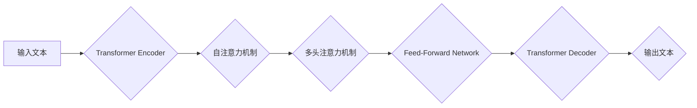

> GPT-4, 大语言模型, 
> 强化学习, 
> 迁移学习, 
> 算法原理, 
> 应用场景, 
> 未来发展

## 1. 背景介绍

近年来，人工智能领域取得了令人瞩目的进展，其中大语言模型（LLM）作为人工智能发展的重要方向之一，展现出强大的潜力。从 GPT-3 到 GPT-4，OpenAI 持续推动着 LLMs 的发展，每一次迭代都带来令人惊叹的突破。GPT-4 作为最新一代的 LLM，其能力和潜力再次刷新了人们对人工智能的认知。

GPT-4 并非仅仅是 GPT-3 的升级版，它在架构、训练数据、算法以及应用场景等方面都进行了重大革新。本文将深入探讨 GPT-4 的核心概念、算法原理、应用场景以及未来发展趋势，帮助读者全面了解这一里程碑式的技术。

## 2. 核心概念与联系

GPT-4 属于基于 Transformer 架构的生成式预训练语言模型。其核心概念包括：

* **Transformer 架构:** Transformer 架构是一种新型的神经网络架构，能够有效处理序列数据，例如文本。它通过自注意力机制（Self-Attention）和多头注意力机制（Multi-Head Attention）来捕捉文本中的长距离依赖关系，从而实现更准确的文本理解和生成。

* **预训练:** GPT-4 在海量文本数据上进行预训练，学习了语言的语法、语义和知识。预训练使得 GPT-4 能够在后续的特定任务上进行微调，快速达到较高的性能。

* **生成式模型:** GPT-4 是一种生成式模型，能够根据输入的文本提示生成新的文本。它可以用于多种文本生成任务，例如文本摘要、机器翻译、对话系统等。

**Mermaid 流程图:**



## 3. 核心算法原理 & 具体操作步骤

### 3.1  算法原理概述

GPT-4 的核心算法原理是基于 Transformer 架构的解码器网络。解码器网络接收编码器输出的隐藏状态作为输入，并通过自注意力机制和多头注意力机制来捕捉文本中的上下文信息。然后，解码器网络通过 Feed-Forward Network 进行非线性变换，最终生成新的文本。

### 3.2  算法步骤详解

1. **输入处理:** 将输入文本转换为词嵌入向量，每个词都对应一个向量表示。

2. **编码器:** 将词嵌入向量输入到 Transformer Encoder 中，通过多层 Transformer 块进行编码，最终得到隐藏状态向量。

3. **解码器:** 将隐藏状态向量输入到 Transformer Decoder 中，通过多层 Transformer 块进行解码，并生成新的文本词。

4. **输出生成:** 将解码器输出的词嵌入向量转换为文本，并进行后处理，例如去除非法字符和标点符号。

### 3.3  算法优缺点

**优点:**

* **强大的文本生成能力:** GPT-4 能够生成高质量、流畅的文本，并能够适应不同的文本风格和任务。
* **长距离依赖关系处理能力:** Transformer 架构能够有效捕捉文本中的长距离依赖关系，使得 GPT-4 能够理解和生成更复杂的文本。
* **可迁移性:** GPT-4 可以通过微调在不同的任务上进行应用，例如文本摘要、机器翻译、对话系统等。

**缺点:**

* **训练成本高:** GPT-4 的训练需要大量的计算资源和时间。
* **数据依赖性:** GPT-4 的性能取决于训练数据的质量和数量。
* **潜在的偏差:** GPT-4 可能会继承训练数据中的偏差，导致生成文本存在偏见。

### 3.4  算法应用领域

GPT-4 的应用领域非常广泛，包括：

* **自然语言处理:** 文本摘要、机器翻译、问答系统、情感分析等。
* **对话系统:** 创建更自然、更智能的聊天机器人。
* **内容创作:** 生成新闻报道、小说、诗歌等。
* **代码生成:** 自动生成代码，提高开发效率。
* **教育:** 提供个性化的学习体验，辅助教学。

## 4. 数学模型和公式 & 详细讲解 & 举例说明

### 4.1  数学模型构建

GPT-4 的数学模型构建基于 Transformer 架构，主要包括以下几个部分：

* **词嵌入层:** 将每个词转换为向量表示，例如 Word2Vec 或 GloVe。

* **多头注意力层:** 捕捉文本中的上下文信息，计算每个词与其他词之间的注意力权重。

* **Feed-Forward Network:** 对每个词的隐藏状态进行非线性变换。

* **输出层:** 将隐藏状态向量转换为概率分布，预测下一个词。

### 4.2  公式推导过程

**多头注意力机制公式:**

$$
Attention(Q, K, V) = softmax(\frac{QK^T}{\sqrt{d_k}})V
$$

其中：

* $Q$：查询矩阵
* $K$：键矩阵
* $V$：值矩阵
* $d_k$：键向量的维度
* $softmax$：softmax 函数

**Feed-Forward Network 公式:**

$$
FFN(x) = \sigma(W_1 x + b_1)W_2 + b_2
$$

其中：

* $x$：输入向量
* $W_1$、$W_2$：权重矩阵
* $b_1$、$b_2$：偏置向量
* $\sigma$：激活函数

### 4.3  案例分析与讲解

假设我们想要使用 GPT-4 生成一段关于人工智能的文本。

**输入提示:**

> 人工智能的发展趋势

**GPT-4 生成文本:**

> 人工智能的发展趋势日新月异，其应用领域不断拓展。从语音识别到图像生成，从自动驾驶到医疗诊断，人工智能正在改变着我们的生活。未来，人工智能将更加智能化、个性化和融合化，为人类社会带来更多机遇和挑战。

## 5. 项目实践：代码实例和详细解释说明

### 5.1  开发环境搭建

为了使用 GPT-4，需要搭建相应的开发环境。OpenAI 提供了 API 接口，可以通过 Python 等编程语言进行调用。

### 5.2  源代码详细实现

```python
import openai

# 设置 API 密钥
openai.api_key = "YOUR_API_KEY"

# 生成文本
response = openai.Completion.create(
    engine="text-davinci-003",
    prompt="人工智能的发展趋势",
    max_tokens=100,
    temperature=0.7
)

# 打印生成文本
print(response.choices[0].text)
```

### 5.3  代码解读与分析

* `openai.api_key = "YOUR_API_KEY"`：设置 OpenAI API 密钥。

* `openai.Completion.create()`：调用 OpenAI 的文本生成 API。

* `engine="text-davinci-003"`：指定使用的 GPT 模型。

* `prompt="人工智能的发展趋势"`：设置文本生成提示。

* `max_tokens=100`：限制生成的文本长度。

* `temperature=0.7`：控制文本生成的随机性。

### 5.4  运行结果展示

运行上述代码，将输出一段关于人工智能发展趋势的文本。

## 6. 实际应用场景

GPT-4 在各个领域都有着广泛的应用场景：

### 6.1  教育领域

* **个性化学习:** 根据学生的学习进度和能力，提供个性化的学习内容和练习。
* **智能辅导:** 为学生提供实时解答和指导，帮助他们理解学习内容。
* **自动批改作业:** 自动批改学生的作业，节省教师的时间和精力。

### 6.2  医疗领域

* **疾病诊断:** 分析患者的病历和症状，辅助医生进行疾病诊断。
* **药物研发:** 预测药物的疗效和副作用，加速药物研发过程。
* **患者咨询:** 为患者提供医疗信息和咨询服务，提高患者的健康水平。

### 6.3  商业领域

* **客户服务:** 创建智能客服机器人，为客户提供24小时服务。
* **市场营销:** 分析客户数据，进行精准营销。
* **内容创作:** 自动生成广告文案、产品描述等。

### 6.4  未来应用展望

随着 GPT-4 的不断发展和完善，其应用场景将更加广泛，例如：

* **虚拟助手:** 创建更加智能、人性化的虚拟助手，帮助人们完成各种任务。
* **创意写作:** 辅助人类进行创意写作，例如小说、剧本、诗歌等。
* **科学研究:** 帮助科学家进行数据分析和模型构建，加速科学研究进程。

## 7. 工具和资源推荐

### 7.1  学习资源推荐

* **OpenAI 官方文档:** https://platform.openai.com/docs/
* **Hugging Face Transformers:** https://huggingface.co/transformers/
* **DeepLearning.AI:** https://www.deeplearning.ai/

### 7.2  开发工具推荐

* **Python:** https://www.python.org/
* **Jupyter Notebook:** https://jupyter.org/

### 7.3  相关论文推荐

* **Attention Is All You Need:** https://arxiv.org/abs/1706.03762
* **Language Models are Few-Shot Learners:** https://arxiv.org/abs/2005.14165

## 8. 总结：未来发展趋势与挑战

### 8.1  研究成果总结

GPT-4 的出现标志着 LLMs 的发展迈上了一个新的台阶。其强大的文本生成能力、长距离依赖关系处理能力以及可迁移性，为人工智能的应用带来了无限可能。

### 8.2  未来发展趋势

未来，LLMs 将朝着以下方向发展：

* **模型规模更大:** 模型参数量将继续增加，从而提升模型的性能和能力。
* **多模态学习:** LLMs 将能够处理多种数据类型，例如文本、图像、音频等。
* **更强的推理能力:** LLMs 将能够进行更复杂的推理和决策。
* **更注重伦理和安全:** LLMs 的开发和应用将更加注重伦理和安全问题。

### 8.3  面临的挑战

LLMs 发展也面临着一些挑战：

* **数据获取和标注:** 训练高质量的 LLMs 需要大量的文本数据和标注，这仍然是一个难题。
* **计算资源:** 训练大型 LLMs 需要大量的计算资源，这对于资源有限的机构来说是一个挑战。
* **伦理和安全:** LLMs 可能被用于生成虚假信息、进行恶意攻击等，需要加强伦理和安全方面的研究和监管。

### 8.4  研究展望

未来，我们将继续致力于 LLMs 的研究和发展，探索其在各个领域的应用，并积极应对其带来的挑战，推动人工智能技术向更安全、更可持续的方向发展。

## 9. 附录：常见问题与解答

**Q1: GPT-4 和 GPT-3 的区别是什么？**

**A1:** GPT-4 是 GPT-3 的升级版，其模型规模更大、训练数据更多、算法更先进，因此其性能和能力都得到了显著提升。

**Q2: 如何使用 GPT-4？**

**A2:** OpenAI 提供了 API 接口，可以通过 Python 等编程语言进行调用。

**Q3: GPT-4 是否可以理解中文？**

**A3:** GPT-4 经过训练可以理解和生成多种语言，包括中文。

**Q4: GPT-4 的应用场景有哪些？**

**A4:** GPT-4 的应用场景非常广泛，包括教育、医疗、商业等各个领域。

**Q5: GPT-4 的伦理问题有哪些？**

**A5:** GPT-4 可能会被用于生成虚假信息、进行恶意攻击等，需要加强伦理和安全方面的研究和监管。


作者：禅与计算机程序设计艺术 / Zen and