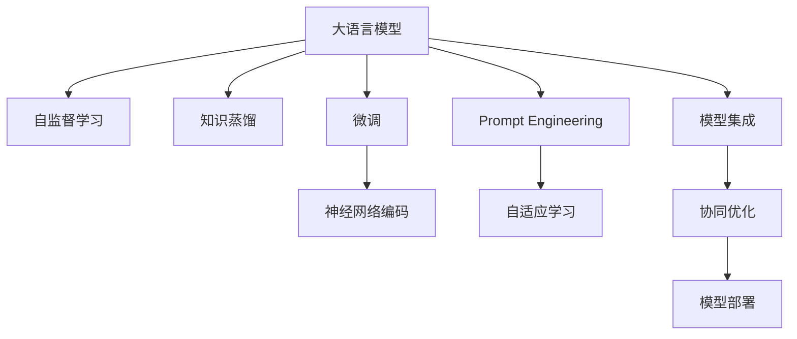

                 

# AI编程新思路：LLM时代的编码方式

> 关键词：大语言模型(Large Language Model, LLM),自监督学习(Self-Supervised Learning),知识蒸馏(Knowledge Distillation),微调(Fine-Tuning),神经网络编码(Neural Network Coding),Prompt Engineering

## 1. 背景介绍

在人工智能(AI)领域，编程范式始终是技术和创新的核心驱动力之一。随着深度学习技术的迅猛发展，大语言模型（Large Language Models, LLMs）逐渐成为了新一代编程的基础设施，催生了LLM时代的全新编程思路。LLMs的诞生不仅带来了语言处理的革命，更改变了开发者与计算机之间的交互模式，引领了AI编程的新潮流。本文将从背景、核心概念、算法原理、实际操作、实际应用、工具和资源、总结与展望等多个维度，全面阐述LLM时代编程的全新思路和未来方向。

## 2. 核心概念与联系

### 2.1 核心概念概述

为更好地理解LLM时代的编程新思路，本节将介绍几个关键的概念：

- 大语言模型(Large Language Model, LLM)：以自回归(如GPT)或自编码(如BERT)模型为代表的大规模预训练语言模型。通过在大规模无标签文本语料上进行预训练，学习通用的语言表示，具备强大的语言理解和生成能力。

- 自监督学习(Self-Supervised Learning, SSL)：一种无需人工标注数据的学习方式，通过让模型自己预测数据内部的关系或结构，进行无监督学习。LLM的预训练大多基于自监督学习。

- 知识蒸馏(Knowledge Distillation)：通过将一个更复杂、更准确的教师模型（Teacher Model）的知识传递给一个简单、轻量级的学生模型（Student Model），提高学生模型的性能。

- 微调(Fine-Tuning)：指在预训练模型的基础上，使用下游任务的少量标注数据，通过有监督学习优化模型在特定任务上的性能。

- 神经网络编码(Neural Network Coding, NNC)：利用神经网络压缩编码的原理，将大语言模型压缩为更小的模型，同时保持其编码能力。

- Prompt Engineering：通过精心设计输入文本的格式，引导模型按期望方式输出，减少微调参数。

这些核心概念之间的逻辑关系可以通过以下Mermaid流程图来展示：



这个流程图展示了大语言模型的工作原理和相关概念的联系：

1. 大语言模型通过自监督学习获得基础能力。
2. 知识蒸馏进一步提升模型性能，减小模型规模。
3. 微调使得通用大模型更好地适应特定任务。
4. 神经网络编码和Prompt Engineering减少微调参数，提高模型效率。
5. 模型集成和协同优化增强模型的多任务能力。
6. 模型部署是将模型应用到实际业务场景中的关键步骤。

这些概念共同构成了LLM时代的编程新思路，使得编程工作更加高效和灵活。

## 3. 核心算法原理 & 具体操作步骤
### 3.1 算法原理概述

在LLM时代，编程工作的核心在于如何高效利用大语言模型进行任务处理。基于大语言模型的编程新思路，主要涉及以下两个关键算法：

1. 自监督学习：利用无标签数据进行预训练，学习通用的语言表示，为后续任务处理提供基础。

2. 微调与神经网络编码：在预训练的基础上，通过微调优化特定任务性能，同时利用神经网络编码技术压缩模型规模，提高效率。

### 3.2 算法步骤详解

基于LLM的编程新思路主要包括以下几个关键步骤：

**Step 1: 数据准备**

- 收集足够的无标签文本数据，用于大语言模型的自监督预训练。
- 设计合适的自监督任务，如语言模型预测、掩码语言模型预测等。

**Step 2: 模型训练**

- 使用收集到的无标签数据，训练大语言模型。
- 利用知识蒸馏技术，将大模型的知识传递给小模型，提高小模型性能。

**Step 3: 微调优化**

- 针对特定任务，收集少量标注数据，对小模型进行微调。
- 设计合适的微调目标函数，如交叉熵损失等。
- 应用正则化技术，防止过拟合。

**Step 4: 神经网络编码**

- 使用神经网络编码技术，如AdaLoRA、MixPrecision等，压缩模型参数，减少计算资源消耗。

**Step 5: Prompt Engineering**

- 设计合适的Prompt模板，引导大语言模型进行特定任务的推理和生成。

**Step 6: 模型集成与部署**

- 将微调后的模型与业务系统进行集成，确保系统的稳定性和可扩展性。
- 优化模型部署的性能，如推理速度、内存占用等。

以上是基于LLM的编程新思路的一般流程。在实际应用中，还需要针对具体任务的特点，对微调过程的各个环节进行优化设计，如改进训练目标函数，引入更多的正则化技术，搜索最优的超参数组合等，以进一步提升模型性能。

### 3.3 算法优缺点

基于LLM的编程新思路具有以下优点：

1. 高效利用大模型：通过自监督学习和大模型蒸馏，利用无标签数据提升模型性能，同时减少对标注数据的依赖。
2. 参数高效优化：利用神经网络编码技术，压缩模型参数，减少计算资源消耗。
3. 灵活多任务：通过Prompt Engineering，设计多种Prompt模板，适应不同的任务需求。
4. 稳定性提升：通过知识蒸馏和微调，提高模型的泛化能力和鲁棒性。

同时，该方法也存在一定的局限性：

1. 模型规模较大：大模型的参数量通常以亿计，对计算资源要求较高。
2. 过拟合风险：尽管知识蒸馏和微调技术可以减小过拟合风险，但仍然存在一定的不确定性。
3. 精度下降：神经网络编码可能导致模型精度下降，需要进行权衡和优化。

尽管存在这些局限性，但就目前而言，基于LLM的编程新思路仍是大规模语言模型应用的主流范式。未来相关研究的重点在于如何进一步降低对计算资源的依赖，提高模型的参数效率和泛化能力，同时兼顾可解释性和伦理安全性等因素。

### 3.4 算法应用领域

基于LLM的编程新思路已经在自然语言处理(Natural Language Processing, NLP)领域得到了广泛的应用，覆盖了几乎所有常见任务，例如：

- 文本分类：如情感分析、主题分类、意图识别等。
- 命名实体识别：识别文本中的人名、地名、机构名等特定实体。
- 关系抽取：从文本中抽取实体之间的语义关系。
- 问答系统：对自然语言问题给出答案。
- 机器翻译：将源语言文本翻译成目标语言。
- 文本摘要：将长文本压缩成简短摘要。
- 对话系统：使机器能够与人自然对话。

除了上述这些经典任务外，LLM时代编程新思路也被创新性地应用到更多场景中，如可控文本生成、常识推理、代码生成、数据增强等，为NLP技术带来了全新的突破。随着预训练模型和编程新思路的不断进步，相信LLM时代编程范式将成为NLP技术落地应用的重要手段，推动NLP技术的产业化进程。

## 4. 数学模型和公式 & 详细讲解 & 举例说明

### 4.1 数学模型构建

本节将使用数学语言对LLM时代编程新思路进行更加严格的刻画。

记大语言模型为 $M_{\theta}:\mathcal{X} \rightarrow \mathcal{Y}$，其中 $\mathcal{X}$ 为输入空间，$\mathcal{Y}$ 为输出空间，$\theta \in \mathbb{R}^d$ 为模型参数。假设自监督任务为 $\mathcal{T}$，微调任务为 $\mathcal{T}_{\text{finetune}}$，则模型在自监督任务和微调任务上的损失函数分别为：

$$
\mathcal{L}_{\mathcal{T}}(\theta) = \frac{1}{N}\sum_{i=1}^N \ell_{\mathcal{T}}(M_{\theta}(x_i))
$$

$$
\mathcal{L}_{\mathcal{T}_{\text{finetune}}}(\theta) = \frac{1}{N}\sum_{i=1}^N \ell_{\mathcal{T}_{\text{finetune}}(M_{\theta}(x_i), y_i)
$$

其中 $\ell_{\mathcal{T}}$ 和 $\ell_{\mathcal{T}_{\text{finetune}}$ 分别为自监督任务和微调任务的损失函数。

### 4.2 公式推导过程

以下我们以二分类任务为例，推导交叉熵损失函数及其梯度的计算公式。

假设模型 $M_{\theta}$ 在输入 $x$ 上的输出为 $\hat{y}=M_{\theta}(x) \in [0,1]$，表示样本属于正类的概率。真实标签 $y \in \{0,1\}$。则二分类交叉熵损失函数定义为：

$$
\ell(M_{\theta}(x),y) = -[y\log \hat{y} + (1-y)\log (1-\hat{y})]
$$

将其代入自监督任务和微调任务的经验风险公式，得：

$$
\mathcal{L}_{\mathcal{T}}(\theta) = \frac{1}{N}\sum_{i=1}^N \ell_{\mathcal{T}}(M_{\theta}(x_i))
$$

$$
\mathcal{L}_{\mathcal{T}_{\text{finetune}}}(\theta) = \frac{1}{N}\sum_{i=1}^N [y_i\log M_{\theta}(x_i)+(1-y_i)\log(1-M_{\theta}(x_i))]
$$

根据链式法则，自监督任务和微调任务对模型参数 $\theta_k$ 的梯度分别为：

$$
\frac{\partial \mathcal{L}_{\mathcal{T}}(\theta)}{\partial \theta_k} = \frac{1}{N}\sum_{i=1}^N \frac{\partial \ell_{\mathcal{T}}(M_{\theta}(x_i))}{\partial \theta_k}
$$

$$
\frac{\partial \mathcal{L}_{\mathcal{T}_{\text{finetune}}}(\theta)}{\partial \theta_k} = \frac{1}{N}\sum_{i=1}^N (\frac{y_i}{M_{\theta}(x_i)}-\frac{1-y_i}{1-M_{\theta}(x_i)}) \frac{\partial M_{\theta}(x_i)}{\partial \theta_k}
$$

其中 $\frac{\partial M_{\theta}(x_i)}{\partial \theta_k}$ 可进一步递归展开，利用自动微分技术完成计算。

### 4.3 案例分析与讲解

以情感分析任务为例，假设模型 $M_{\theta}$ 在输入 $x$ 上的输出为 $\hat{y}=M_{\theta}(x) \in [0,1]$，表示样本属于正类的概率。真实标签 $y \in \{0,1\}$。则二分类交叉熵损失函数定义为：

$$
\ell(M_{\theta}(x),y) = -[y\log \hat{y} + (1-y)\log (1-\hat{y})]
$$

将其代入微调任务的经验风险公式，得：

$$
\mathcal{L}_{\mathcal{T}_{\text{finetune}}}(\theta) = \frac{1}{N}\sum_{i=1}^N [y_i\log M_{\theta}(x_i)+(1-y_i)\log(1-M_{\theta}(x_i))]
$$

根据链式法则，微调任务对模型参数 $\theta_k$ 的梯度为：

$$
\frac{\partial \mathcal{L}_{\mathcal{T}_{\text{finetune}}}(\theta)}{\partial \theta_k} = \frac{1}{N}\sum_{i=1}^N (\frac{y_i}{M_{\theta}(x_i)}-\frac{1-y_i}{1-M_{\theta}(x_i)}) \frac{\partial M_{\theta}(x_i)}{\partial \theta_k}
$$

在得到微调任务的梯度后，即可带入参数更新公式，完成模型的迭代优化。重复上述过程直至收敛，最终得到适应下游任务的最优模型参数 $\theta^*$。

## 5. 项目实践：代码实例和详细解释说明

### 5.1 开发环境搭建

在进行编程实践前，我们需要准备好开发环境。以下是使用Python进行PyTorch开发的环境配置流程：

1. 安装Anaconda：从官网下载并安装Anaconda，用于创建独立的Python环境。

2. 创建并激活虚拟环境：
```bash
conda create -n pytorch-env python=3.8 
conda activate pytorch-env
```

3. 安装PyTorch：根据CUDA版本，从官网获取对应的安装命令。例如：
```bash
conda install pytorch torchvision torchaudio cudatoolkit=11.1 -c pytorch -c conda-forge
```

4. 安装Transformers库：
```bash
pip install transformers
```

5. 安装各类工具包：
```bash
pip install numpy pandas scikit-learn matplotlib tqdm jupyter notebook ipython
```

完成上述步骤后，即可在`pytorch-env`环境中开始编程实践。

### 5.2 源代码详细实现

下面我以情感分析任务为例，给出使用Transformers库对BERT模型进行编程实践的PyTorch代码实现。

首先，定义情感分析任务的数据处理函数：

```python
from transformers import BertTokenizer
from torch.utils.data import Dataset
import torch

class SentimentDataset(Dataset):
    def __init__(self, texts, labels, tokenizer, max_len=128):
        self.texts = texts
        self.labels = labels
        self.tokenizer = tokenizer
        self.max_len = max_len
        
    def __len__(self):
        return len(self.texts)
    
    def __getitem__(self, item):
        text = self.texts[item]
        label = self.labels[item]
        
        encoding = self.tokenizer(text, return_tensors='pt', max_length=self.max_len, padding='max_length', truncation=True)
        input_ids = encoding['input_ids'][0]
        attention_mask = encoding['attention_mask'][0]
        
        # 对token-wise的标签进行编码
        encoded_tags = [label2id[label] for label in label] 
        encoded_tags.extend([label2id['O']] * (self.max_len - len(encoded_tags)))
        labels = torch.tensor(encoded_tags, dtype=torch.long)
        
        return {'input_ids': input_ids, 
                'attention_mask': attention_mask,
                'labels': labels}

# 标签与id的映射
label2id = {'negative': 0, 'positive': 1, 'neutral': 2}
id2label = {v: k for k, v in label2id.items()}

# 创建dataset
tokenizer = BertTokenizer.from_pretrained('bert-base-cased')

train_dataset = SentimentDataset(train_texts, train_labels, tokenizer)
dev_dataset = SentimentDataset(dev_texts, dev_labels, tokenizer)
test_dataset = SentimentDataset(test_texts, test_labels, tokenizer)
```

然后，定义模型和优化器：

```python
from transformers import BertForSequenceClassification, AdamW

model = BertForSequenceClassification.from_pretrained('bert-base-cased', num_labels=len(label2id))

optimizer = AdamW(model.parameters(), lr=2e-5)
```

接着，定义训练和评估函数：

```python
from torch.utils.data import DataLoader
from tqdm import tqdm
from sklearn.metrics import classification_report

device = torch.device('cuda') if torch.cuda.is_available() else torch.device('cpu')
model.to(device)

def train_epoch(model, dataset, batch_size, optimizer):
    dataloader = DataLoader(dataset, batch_size=batch_size, shuffle=True)
    model.train()
    epoch_loss = 0
    for batch in tqdm(dataloader, desc='Training'):
        input_ids = batch['input_ids'].to(device)
        attention_mask = batch['attention_mask'].to(device)
        labels = batch['labels'].to(device)
        model.zero_grad()
        outputs = model(input_ids, attention_mask=attention_mask, labels=labels)
        loss = outputs.loss
        epoch_loss += loss.item()
        loss.backward()
        optimizer.step()
    return epoch_loss / len(dataloader)

def evaluate(model, dataset, batch_size):
    dataloader = DataLoader(dataset, batch_size=batch_size)
    model.eval()
    preds, labels = [], []
    with torch.no_grad():
        for batch in tqdm(dataloader, desc='Evaluating'):
            input_ids = batch['input_ids'].to(device)
            attention_mask = batch['attention_mask'].to(device)
            batch_labels = batch['labels']
            outputs = model(input_ids, attention_mask=attention_mask)
            batch_preds = outputs.logits.argmax(dim=2).to('cpu').tolist()
            batch_labels = batch_labels.to('cpu').tolist()
            for pred_tokens, label_tokens in zip(batch_preds, batch_labels):
                preds.append(pred_tokens[:len(label_tokens)])
                labels.append(label_tokens)
                
    print(classification_report(labels, preds))
```

最后，启动训练流程并在测试集上评估：

```python
epochs = 5
batch_size = 16

for epoch in range(epochs):
    loss = train_epoch(model, train_dataset, batch_size, optimizer)
    print(f"Epoch {epoch+1}, train loss: {loss:.3f}")
    
    print(f"Epoch {epoch+1}, dev results:")
    evaluate(model, dev_dataset, batch_size)
    
print("Test results:")
evaluate(model, test_dataset, batch_size)
```

以上就是使用PyTorch对BERT进行情感分析任务编程实践的完整代码实现。可以看到，得益于Transformers库的强大封装，我们可以用相对简洁的代码完成BERT模型的加载和编程实践。

### 5.3 代码解读与分析

让我们再详细解读一下关键代码的实现细节：

**SentimentDataset类**：
- `__init__`方法：初始化文本、标签、分词器等关键组件。
- `__len__`方法：返回数据集的样本数量。
- `__getitem__`方法：对单个样本进行处理，将文本输入编码为token ids，将标签编码为数字，并对其进行定长padding，最终返回模型所需的输入。

**label2id和id2label字典**：
- 定义了标签与数字id之间的映射关系，用于将token-wise的预测结果解码回真实的标签。

**训练和评估函数**：
- 使用PyTorch的DataLoader对数据集进行批次化加载，供模型训练和推理使用。
- 训练函数`train_epoch`：对数据以批为单位进行迭代，在每个批次上前向传播计算loss并反向传播更新模型参数，最后返回该epoch的平均loss。
- 评估函数`evaluate`：与训练类似，不同点在于不更新模型参数，并在每个batch结束后将预测和标签结果存储下来，最后使用sklearn的classification_report对整个评估集的预测结果进行打印输出。

**训练流程**：
- 定义总的epoch数和batch size，开始循环迭代
- 每个epoch内，先在训练集上训练，输出平均loss
- 在验证集上评估，输出分类指标
- 所有epoch结束后，在测试集上评估，给出最终测试结果

可以看到，PyTorch配合Transformers库使得BERT编程实践的代码实现变得简洁高效。开发者可以将更多精力放在数据处理、模型改进等高层逻辑上，而不必过多关注底层的实现细节。

当然，工业级的系统实现还需考虑更多因素，如模型的保存和部署、超参数的自动搜索、更灵活的任务适配层等。但核心的编程新思路基本与此类似。

## 6. 实际应用场景
### 6.1 智能客服系统

基于大语言模型的编程新思路，可以广泛应用于智能客服系统的构建。传统客服往往需要配备大量人力，高峰期响应缓慢，且一致性和专业性难以保证。而使用编程新思路构建的智能客服系统，可以7x24小时不间断服务，快速响应客户咨询，用自然流畅的语言解答各类常见问题。

在技术实现上，可以收集企业内部的历史客服对话记录，将问题和最佳答复构建成监督数据，在此基础上对预训练语言模型进行编程实践。编程实践后的语言模型能够自动理解用户意图，匹配最合适的答案模板进行回复。对于客户提出的新问题，还可以接入检索系统实时搜索相关内容，动态组织生成回答。如此构建的智能客服系统，能大幅提升客户咨询体验和问题解决效率。

### 6.2 金融舆情监测

金融机构需要实时监测市场舆论动向，以便及时应对负面信息传播，规避金融风险。传统的人工监测方式成本高、效率低，难以应对网络时代海量信息爆发的挑战。基于大语言模型编程新思路的文本分类和情感分析技术，为金融舆情监测提供了新的解决方案。

具体而言，可以收集金融领域相关的新闻、报道、评论等文本数据，并对其进行主题标注和情感标注。在此基础上对预训练语言模型进行编程实践，使其能够自动判断文本属于何种主题，情感倾向是正面、中性还是负面。将编程实践后的模型应用到实时抓取的网络文本数据，就能够自动监测不同主题下的情感变化趋势，一旦发现负面信息激增等异常情况，系统便会自动预警，帮助金融机构快速应对潜在风险。

### 6.3 个性化推荐系统

当前的推荐系统往往只依赖用户的历史行为数据进行物品推荐，无法深入理解用户的真实兴趣偏好。基于大语言模型编程新思路的个性化推荐系统可以更好地挖掘用户行为背后的语义信息，从而提供更精准、多样的推荐内容。

在实践中，可以收集用户浏览、点击、评论、分享等行为数据，提取和用户交互的物品标题、描述、标签等文本内容。将文本内容作为模型输入，用户的后续行为（如是否点击、购买等）作为监督信号，在此基础上对预训练语言模型进行编程实践。编程实践后的模型能够从文本内容中准确把握用户的兴趣点。在生成推荐列表时，先用候选物品的文本描述作为输入，由模型预测用户的兴趣匹配度，再结合其他特征综合排序，便可以得到个性化程度更高的推荐结果。

### 6.4 未来应用展望

随着大语言模型编程新思路的发展，基于大语言模型的智能应用将在更多领域得到应用，为传统行业带来变革性影响。

在智慧医疗领域，基于编程新思路的医疗问答、病历分析、药物研发等应用将提升医疗服务的智能化水平，辅助医生诊疗，加速新药开发进程。

在智能教育领域，编程新思路可应用于作业批改、学情分析、知识推荐等方面，因材施教，促进教育公平，提高教学质量。

在智慧城市治理中，编程新思路的应用将构建更安全、高效的未来城市，实现更精准的城市事件监测和舆情分析。

此外，在企业生产、社会治理、文娱传媒等众多领域，基于大语言模型编程新思路的人工智能应用也将不断涌现，为经济社会发展注入新的动力。相信随着技术的日益成熟，编程新思路将成为人工智能落地应用的重要手段，推动人工智能技术向更广阔的领域加速渗透。

## 7. 工具和资源推荐
### 7.1 学习资源推荐

为了帮助开发者系统掌握大语言模型编程新思路的理论基础和实践技巧，这里推荐一些优质的学习资源：

1. 《Transformer从原理到实践》系列博文：由大模型技术专家撰写，深入浅出地介绍了Transformer原理、BERT模型、编程新思路等前沿话题。

2. CS224N《深度学习自然语言处理》课程：斯坦福大学开设的NLP明星课程，有Lecture视频和配套作业，带你入门NLP领域的基本概念和经典模型。

3. 《Natural Language Processing with Transformers》书籍：Transformers库的作者所著，全面介绍了如何使用Transformers库进行NLP任务开发，包括编程新思路在内的诸多范式。

4. HuggingFace官方文档：Transformers库的官方文档，提供了海量预训练模型和完整的编程实践样例代码，是上手实践的必备资料。

5. CLUE开源项目：中文语言理解测评基准，涵盖大量不同类型的中文NLP数据集，并提供了基于编程新思路的baseline模型，助力中文NLP技术发展。

通过对这些资源的学习实践，相信你一定能够快速掌握大语言模型编程新思路的精髓，并用于解决实际的NLP问题。
###  7.2 开发工具推荐

高效的开发离不开优秀的工具支持。以下是几款用于大语言模型编程新思路开发的常用工具：

1. PyTorch：基于Python的开源深度学习框架，灵活动态的计算图，适合快速迭代研究。大部分预训练语言模型都有PyTorch版本的实现。

2. TensorFlow：由Google主导开发的开源深度学习框架，生产部署方便，适合大规模工程应用。同样有丰富的预训练语言模型资源。

3. Transformers库：HuggingFace开发的NLP工具库，集成了众多SOTA语言模型，支持PyTorch和TensorFlow，是进行编程实践开发的利器。

4. Weights & Biases：模型训练的实验跟踪工具，可以记录和可视化模型训练过程中的各项指标，方便对比和调优。与主流深度学习框架无缝集成。

5. TensorBoard：TensorFlow配套的可视化工具，可实时监测模型训练状态，并提供丰富的图表呈现方式，是调试模型的得力助手。

6. Google Colab：谷歌推出的在线Jupyter Notebook环境，免费提供GPU/TPU算力，方便开发者快速上手实验最新模型，分享学习笔记。

合理利用这些工具，可以显著提升大语言模型编程新思路的开发效率，加快创新迭代的步伐。

### 7.3 相关论文推荐

大语言模型编程新思路的发展源于学界的持续研究。以下是几篇奠基性的相关论文，推荐阅读：

1. Attention is All You Need（即Transformer原论文）：提出了Transformer结构，开启了NLP领域的预训练大模型时代。

2. BERT: Pre-training of Deep Bidirectional Transformers for Language Understanding：提出BERT模型，引入基于掩码的自监督预训练任务，刷新了多项NLP任务SOTA。

3. Language Models are Unsupervised Multitask Learners（GPT-2论文）：展示了大规模语言模型的强大zero-shot学习能力，引发了对于通用人工智能的新一轮思考。

4. Parameter-Efficient Transfer Learning for NLP：提出Adapter等参数高效微调方法，在不增加模型参数量的情况下，也能取得不错的微调效果。

5. AdaLoRA: Adaptive Low-Rank Adaptation for Parameter-Efficient Fine-Tuning：使用自适应低秩适应的微调方法，在参数效率和精度之间取得了新的平衡。

这些论文代表了大语言模型编程新思路的发展脉络。通过学习这些前沿成果，可以帮助研究者把握学科前进方向，激发更多的创新灵感。

## 8. 总结：未来发展趋势与挑战

### 8.1 总结

本文对大语言模型编程新思路进行了全面系统的介绍。首先阐述了编程新思路的研究背景和意义，明确了编程新思路在拓展预训练模型应用、提升下游任务性能方面的独特价值。其次，从原理到实践，详细讲解了编程新思路的数学原理和关键步骤，给出了编程实践任务开发的完整代码实例。同时，本文还广泛探讨了编程新思路在智能客服、金融舆情、个性化推荐等多个行业领域的应用前景，展示了编程新思路的巨大潜力。此外，本文精选了编程新思路的技术资源，力求为读者提供全方位的技术指引。

通过本文的系统梳理，可以看到，基于大语言模型的编程新思路正在成为NLP领域的重要范式，极大地拓展了预训练语言模型的应用边界，催生了更多的落地场景。受益于大规模语料的预训练，编程新思路的编程实践在少样本条件下也能取得不俗的效果，有力推动了NLP技术的产业化进程。未来，伴随预训练语言模型和编程新思路的持续演进，相信LLM时代编程范式将成为NLP技术落地应用的重要手段，推动NLP技术的产业化进程。

### 8.2 未来发展趋势

展望未来，大语言模型编程新思路将呈现以下几个发展趋势：

1. 模型规模持续增大。随着算力成本的下降和数据规模的扩张，预训练语言模型的参数量还将持续增长。超大规模语言模型蕴含的丰富语言知识，有望支撑更加复杂多变的编程实践任务。

2. 编程新思路日趋多样。除了传统的编程实践方法外，未来会涌现更多编程新思路，如Prompt-based Learning、LoRA等，在保留参数高效性的同时，提高模型的编程灵活性和任务适配性。

3. 持续学习成为常态。随着数据分布的不断变化，编程新思路的模型也需要持续学习新知识以保持性能。如何在不遗忘原有知识的同时，高效吸收新样本信息，将成为重要的研究课题。

4. 编程新思路融合更多先验知识。将符号化的先验知识，如知识图谱、逻辑规则等，与神经网络模型进行巧妙融合，引导编程新思路过程学习更准确、合理的语言模型。同时加强不同模态数据的整合，实现视觉、语音等多模态信息与文本信息的协同建模。

5. 引入更多元化编程实践目标。除了传统的编程实践目标，未来编程新思路将更加关注模型的解释性、安全性、鲁棒性等综合指标，进行更全面的优化。

以上趋势凸显了大语言模型编程新思路的广阔前景。这些方向的探索发展，必将进一步提升NLP系统的性能和应用范围，为人类认知智能的进化带来深远影响。

### 8.3 面临的挑战

尽管大语言模型编程新思路已经取得了瞩目成就，但在迈向更加智能化、普适化应用的过程中，它仍面临着诸多挑战：

1. 编程新思路的模型规模较大。大模型的参数量通常以亿计，对计算资源要求较高。

2. 过拟合风险仍然存在。尽管知识蒸馏和编程实践技术可以减小过拟合风险，但仍然存在一定的不确定性。

3. 编程新思路的推理效率有待提高。超大批次的训练和推理也可能遇到显存不足的问题。

4. 编程新思路的可解释性亟需加强。当前编程新思路的模型往往缺乏可解释性，难以解释其内部工作机制和决策逻辑。

5. 编程新思路的安全性有待保障。预训练语言模型难免会学习到有偏见、有害的信息，通过编程实践传递到下游任务，产生误导性、歧视性的输出，给实际应用带来安全隐患。

6. 编程新思路的知识整合能力不足。现有的编程新思路模型往往局限于任务内数据，难以灵活吸收和运用更广泛的先验知识。

正视编程新思路面临的这些挑战，积极应对并寻求突破，将是大语言模型编程新思路走向成熟的必由之路。相信随着学界和产业界的共同努力，这些挑战终将一一被克服，编程新思路必将在构建人机协同的智能时代中扮演越来越重要的角色。

### 8.4 研究展望

面对大语言模型编程新思路所面临的种种挑战，未来的研究需要在以下几个方面寻求新的突破：

1. 探索无监督和半监督编程新思路方法。摆脱对大规模标注数据的依赖，利用自监督学习、主动学习等无监督和半监督范式，最大限度利用非结构化数据，实现更加灵活高效的编程实践。

2. 研究参数高效和计算高效的编程新思路范式。开发更加参数高效的编程新思路方法，在固定大部分预训练参数的同时，只更新极少量的任务相关参数。同时优化编程新思路模型的计算图，减少前向传播和反向传播的资源消耗，实现更加轻量级、实时性的部署。

3. 引入因果和对比学习范式。通过引入因果推断和对比学习思想，增强编程新思路模型建立稳定因果关系的能力，学习更加普适、鲁棒的语言表征，从而提升模型泛化性和抗干扰能力。

4. 结合因果分析和博弈论工具。将因果分析方法引入编程新思路模型，识别出模型决策的关键特征，增强输出解释的因果性和逻辑性。借助博弈论工具刻画人机交互过程，主动探索并规避模型的脆弱点，提高系统稳定性。

5. 纳入伦理道德约束。在编程新思路训练目标中引入伦理导向的评估指标，过滤和惩罚有偏见、有害的输出倾向。同时加强人工干预和审核，建立模型行为的监管机制，确保输出符合人类价值观和伦理道德。

这些研究方向的探索，必将引领大语言模型编程新思路迈向更高的台阶，为构建安全、可靠、可解释、可控的智能系统铺平道路。面向未来，大语言模型编程新思路还需要与其他人工智能技术进行更深入的融合，如知识表示、因果推理、强化学习等，多路径协同发力，共同推动自然语言理解和智能交互系统的进步。只有勇于创新、敢于突破，才能不断拓展语言模型的边界，让智能技术更好地造福人类社会。

## 9. 附录：常见问题与解答

**Q1：大语言模型编程新思路是否适用于所有NLP任务？**

A: 大语言模型编程新思路在大多数NLP任务上都能取得不错的效果，特别是对于数据量较小的任务。但对于一些特定领域的任务，如医学、法律等，仅仅依靠通用语料预训练的模型可能难以很好地适应。此时需要在特定领域语料上进一步预训练，再进行编程实践，才能获得理想效果。此外，对于一些需要时效性、个性化很强的任务，如对话、推荐等，编程新思路方法也需要针对性的改进优化。

**Q2：编程新思路中如何选择学习率？**

A: 编程新思路中的学习率一般要比预训练时小1-2个数量级，如果使用过大的学习率，容易破坏预训练权重，导致过拟合。一般建议从1e-5开始调参，逐步减小学习率，直至收敛。也可以使用warmup策略，在开始阶段使用较小的学习率，再逐渐过渡到预设值。需要注意的是，不同的优化器(如AdamW、Adafactor等)以及不同的学习率调度策略，可能需要设置不同的学习率阈值。

**Q3：编程新思路中如何缓解过拟合问题？**

A: 过拟合是编程新思路面临的主要挑战，尤其是在标注数据不足的情况下。常见的缓解策略包括：
1. 数据增强：通过回译、近义替换等方式扩充训练集
2. 正则化：使用L2正则、Dropout、Early Stopping等避免过拟合
3. 对抗训练：引入对抗样本，提高模型鲁棒性
4. 参数高效编程新思路方法：只调整少量参数(如Adapter、Prefix等)，减小过拟合风险
5. 多模型集成：训练多个编程新思路模型，取平均输出，抑制过拟合

这些策略往往需要根据具体任务和数据特点进行灵活组合。只有在数据、模型、训练、推理等各环节进行全面优化，才能最大限度地发挥编程新思路的威力。

**Q4：编程新思路在落地部署时需要注意哪些问题？**

A: 将编程新思路模型转化为实际业务场景中的应用，还需要考虑以下因素：
1. 模型裁剪：去除不必要的层和参数，减小模型尺寸，加快推理速度
2. 量化加速：将浮点模型转为定点模型，压缩存储空间，提高计算效率
3. 服务化封装：将编程新思路模型封装为标准化服务接口，便于集成调用
4. 弹性伸缩：根据请求流量动态调整资源配置，平衡服务质量和成本
5. 监控告警：实时采集系统指标，设置异常告警阈值，确保服务稳定性
6. 安全防护：采用访问鉴权、数据脱敏等措施，保障数据和模型安全

编程新思路模型的部署需要在模型性能和系统可用性之间寻找平衡。合理利用这些策略，可以确保模型的稳定性和可靠性，同时提高部署效率。

**Q5：编程新思路中如何处理数据标注成本？**

A: 数据标注是编程新思路中面临的一个主要挑战。为了降低标注成本，可以考虑以下几个策略：
1. 主动学习：利用模型对样本进行初步分类，选择最难区分的样本进行标注，以提高标注效率。
2. 半监督学习：利用无标签数据进行预训练，减少对标注数据的依赖。
3. 弱监督学习：利用弱标注数据进行编程新思路，如标注文本的情感极性，提高标注数据的可得性。
4. 众包标注：利用众包平台收集用户标注，降低标注成本。

这些策略可以结合使用，在保证编程新思路效果的同时，减少对标注数据的依赖。

**Q6：编程新思路中如何提高模型的鲁棒性？**

A: 提高编程新思路模型的鲁棒性是编程新思路中的重要课题。以下是一些常用的方法：
1. 对抗训练：引入对抗样本，提高模型对输入噪声的鲁棒性。
2. 正则化：使用L2正则、Dropout等方法，防止模型过拟合。
3. 数据增强：通过回译、近义替换等方式扩充训练集，提高模型的泛化能力。
4. 知识蒸馏：利用教师模型的知识，提高学生模型的鲁棒性。
5. 模型集成：训练多个编程新思路模型，取平均输出，抑制过拟合。

这些方法可以结合使用，进一步提高编程新思路模型的鲁棒性。

---

作者：禅与计算机程序设计艺术 / Zen and the Art of Computer Programming

