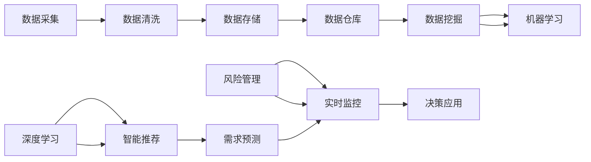

                 

## 1. 背景介绍

### 1.1 问题由来

随着互联网和电商行业的高速发展，电商平台的运营面临越来越复杂的数据挑战。传统的电商运营决策大多依赖人工直觉和经验，难以适应海量数据和动态变化的市场环境。近年来，基于大数据和人工智能技术的智能决策系统逐渐被引入电商平台，旨在通过数据驱动的智能分析，提升运营效率和决策质量。

具体而言，智能决策系统主要通过以下方式赋能电商平台：

1. **需求预测**：利用用户行为数据和市场趋势，预测未来的销售趋势，指导库存管理和营销策略。
2. **个性化推荐**：基于用户历史行为数据，推荐商品和服务，提升用户体验和转化率。
3. **供应链优化**：通过分析供应商、物流和库存数据，优化供应链流程，降低成本，提高效率。
4. **风险管理**：识别和防范金融风险、市场风险，保障平台安全和稳定运营。

### 1.2 问题核心关键点

智能决策系统的核心在于其能够高效处理和分析海量数据，从中提取有价值的信息，并转化为具体的业务决策。智能决策通常包括数据采集、数据清洗、数据建模、模型训练、模型评估和决策应用等环节。其关键点包括：

1. **数据质量**：数据采集、清洗和预处理的准确性和完整性，直接影响决策模型的准确性。
2. **模型选择**：根据具体业务场景和需求，选择合适的算法和模型，并合理设计模型参数。
3. **训练和优化**：通过大量历史数据训练模型，并使用优化算法提升模型性能。
4. **部署和监控**：将训练好的模型部署到实际环境中，并持续监控模型表现，及时调整。
5. **业务融合**：将模型输出与实际业务流程结合，转化为具体决策和行动。

### 1.3 问题研究意义

智能决策系统在电商平台的广泛应用，对于提升运营效率、优化用户体验、降低成本具有重要意义。通过智能决策，电商平台可以实现：

1. **实时响应**：基于实时数据，快速调整运营策略，应对市场变化。
2. **精准营销**：个性化推荐和需求预测，提升用户满意度和转化率。
3. **资源优化**：优化库存、物流和人力资源配置，提高整体运营效率。
4. **风险防范**：及时识别和防范风险，保障平台稳定运营。

## 2. 核心概念与联系

### 2.1 核心概念概述

智能决策系统依赖于大数据和人工智能技术，通过对海量数据的分析和挖掘，提取有价值的商业洞察，辅助决策者进行决策。主要涉及以下关键概念：

- **大数据**：指海量、高速、多样化的数据，是智能决策的基础。
- **数据仓库**：用于集中管理和存储企业内部的各种数据。
- **数据挖掘**：从数据中提取有价值的信息和知识，辅助决策。
- **机器学习**：通过算法学习数据规律，预测未来趋势。
- **深度学习**：使用神经网络等技术，处理非结构化数据，提升决策精度。
- **智能推荐**：基于用户行为数据，推荐商品和服务。
- **需求预测**：通过数据分析，预测未来的需求趋势。
- **风险管理**：识别和防范各种风险，保障平台安全。

### 2.2 核心概念原理和架构的 Mermaid 流程图



这个流程图展示了智能决策系统的基本架构和关键流程。数据采集和清洗之后，存储于数据仓库中，再通过数据挖掘和机器学习、深度学习等技术，生成智能推荐、需求预测和风险管理的模型。最终，这些模型输出的决策信息通过实时监控系统，转化为具体的运营决策。

## 3. 核心算法原理 & 具体操作步骤

### 3.1 算法原理概述

智能决策系统依赖于数据挖掘和机器学习算法，其中核心原理包括：

- **数据清洗和预处理**：通过数据清洗和预处理，提高数据质量和一致性，为后续分析奠定基础。
- **特征工程**：选择和构建有效特征，提升模型的预测能力。
- **模型选择和训练**：根据具体业务需求和数据特点，选择适合的算法和模型，并使用历史数据进行训练。
- **模型评估和优化**：通过交叉验证等方法，评估模型性能，并进行参数调优。
- **实时监控和调整**：实时监控模型表现，根据环境变化及时调整模型参数和策略。

### 3.2 算法步骤详解

智能决策系统的核心算法步骤包括：

1. **数据采集和清洗**：
   - 收集电商平台的各类数据，包括用户行为、交易记录、库存信息、物流数据等。
   - 清洗数据，去除噪声和异常值，确保数据的准确性和完整性。

2. **特征工程**：
   - 选择和构建有效特征，如用户年龄、性别、消费行为、购买历史等。
   - 使用归一化、编码等技术，提升特征质量。

3. **模型选择和训练**：
   - 根据具体业务需求，选择合适的算法和模型，如回归、分类、聚类、神经网络等。
   - 使用历史数据训练模型，调整模型参数，提高预测精度。

4. **模型评估和优化**：
   - 使用交叉验证等方法，评估模型性能。
   - 根据评估结果，进行参数调优，提升模型效果。

5. **实时监控和调整**：
   - 将训练好的模型部署到实际环境中，进行实时监控。
   - 根据实时数据和模型输出，及时调整策略，优化决策效果。

### 3.3 算法优缺点

智能决策系统具有以下优点：

- **高效性**：通过自动化分析，快速生成决策支持信息，提高运营效率。
- **准确性**：基于数据驱动的分析，减少人为错误和偏见，提升决策精度。
- **灵活性**：支持多种算法和模型，适用于不同的业务场景和需求。
- **可扩展性**：可以随着数据规模的增加，不断扩展模型和系统能力。

同时，智能决策系统也存在一些缺点：

- **数据质量要求高**：对数据采集和清洗的准确性和完整性要求高，数据质量不佳会影响系统效果。
- **模型复杂度高**：复杂算法和模型的训练和优化成本高，需要大量计算资源。
- **可解释性不足**：部分模型（如深度学习）的决策过程难以解释，缺乏透明性。
- **依赖环境变化**：模型需要根据环境变化进行定期更新和调整，复杂度较高。

### 3.4 算法应用领域

智能决策系统在电商平台的多个领域都有广泛应用，包括：

1. **个性化推荐**：基于用户行为数据，推荐商品和服务，提升用户体验和转化率。
2. **需求预测**：通过分析用户行为和市场趋势，预测未来的销售趋势，指导库存管理和营销策略。
3. **供应链优化**：通过分析供应商、物流和库存数据，优化供应链流程，降低成本，提高效率。
4. **风险管理**：识别和防范金融风险、市场风险，保障平台安全和稳定运营。
5. **用户分析**：分析用户行为和偏好，进行细分和细分策略制定。
6. **市场趋势分析**：分析市场变化和趋势，制定相应的业务策略。

## 4. 数学模型和公式 & 详细讲解 & 举例说明

### 4.1 数学模型构建

智能决策系统中的核心数学模型包括回归模型、分类模型、聚类模型等。以线性回归模型为例，其数学表达式为：

$$
y = \beta_0 + \sum_{i=1}^n \beta_i x_i + \epsilon
$$

其中 $y$ 为预测值，$\beta_0$ 为截距，$\beta_i$ 为特征系数，$x_i$ 为特征向量，$\epsilon$ 为误差项。

### 4.2 公式推导过程

线性回归模型的推导过程如下：

假设有一组训练数据 $(x_1, y_1), (x_2, y_2), ..., (x_n, y_n)$，其中 $x_i$ 为输入特征向量，$y_i$ 为对应的目标值。线性回归模型的目标是最小化预测值与真实值之间的平方误差，即：

$$
\min_{\beta_0, \beta_i} \sum_{i=1}^n (y_i - (\beta_0 + \sum_{j=1}^n \beta_j x_{ij}))^2
$$

通过对该目标函数求导并设置导数为0，可以得到回归系数 $\beta_0$ 和 $\beta_i$ 的计算公式：

$$
\beta_0 = \frac{\sum_{i=1}^n y_i - \sum_{i=1}^n \sum_{j=1}^n \beta_j x_{ij}}{\sum_{i=1}^n \sum_{j=1}^n x_{ij}^2 - 2 \sum_{i=1}^n \sum_{j=1}^n \beta_j x_{ij} + \sum_{i=1}^n \beta_i^2}
$$

$$
\beta_i = \frac{\sum_{i=1}^n y_i x_{ij} - \sum_{i=1}^n \sum_{j=1}^n \beta_j x_{ij}^2}{\sum_{i=1}^n \sum_{j=1}^n x_{ij}^2 - 2 \sum_{i=1}^n \sum_{j=1}^n \beta_j x_{ij} + \sum_{i=1}^n \beta_i^2}
$$

### 4.3 案例分析与讲解

假设某电商平台有一组用户购买历史数据，每个用户记录包括购买金额、购买时间、用户ID等特征。目标是预测用户未来的购买金额。

1. **数据采集和清洗**：
   - 收集用户购买历史数据，去除重复和异常数据。

2. **特征工程**：
   - 选择购买金额、购买时间、用户ID等特征，并进行归一化处理。
   - 设计特征变量，如购买频率、购买金额变化率等。

3. **模型选择和训练**：
   - 选择线性回归模型，使用历史数据进行训练。
   - 使用交叉验证评估模型性能，进行参数调优。

4. **模型评估和优化**：
   - 使用测试数据验证模型效果，计算MAE、RMSE等指标。
   - 根据评估结果，调整模型参数，提升预测精度。

5. **实时监控和调整**：
   - 将训练好的模型部署到实际环境中，进行实时监控。
   - 根据实时数据和模型输出，及时调整策略，优化决策效果。

## 5. 项目实践：代码实例和详细解释说明

### 5.1 开发环境搭建

智能决策系统的开发环境搭建主要包括以下步骤：

1. **安装Python**：
   - 从官网下载并安装Python 3.x版本，建议使用虚拟环境（如Anaconda）管理依赖。

2. **安装相关库**：
   - 安装NumPy、Pandas、Scikit-learn等常用库，用于数据处理和模型训练。
   - 安装TensorFlow或PyTorch等深度学习框架，用于构建复杂模型。
   - 安装Jupyter Notebook或Google Colab等环境，方便进行交互式开发。

### 5.2 源代码详细实现

以线性回归模型为例，展示智能决策系统的代码实现：

```python
import numpy as np
from sklearn.linear_model import LinearRegression
from sklearn.model_selection import train_test_split

# 数据集
X = np.array([[1, 2, 3], [4, 5, 6], [7, 8, 9]])
y = np.array([1, 2, 3])

# 划分训练集和测试集
X_train, X_test, y_train, y_test = train_test_split(X, y, test_size=0.2, random_state=42)

# 训练模型
model = LinearRegression()
model.fit(X_train, y_train)

# 预测
y_pred = model.predict(X_test)

# 评估
print('R^2:', model.score(X_test, y_test))
```

### 5.3 代码解读与分析

上述代码展示了线性回归模型的基本实现过程。具体步骤如下：

1. **数据准备**：使用NumPy库创建输入特征矩阵X和目标值向量y。
2. **模型训练**：使用Scikit-learn库的LinearRegression模型进行训练，计算回归系数。
3. **模型预测**：使用训练好的模型进行预测，得到测试集上的预测值。
4. **模型评估**：使用R^2分数评估模型预测效果。

## 6. 实际应用场景

### 6.1 智能推荐

智能推荐系统通过分析用户历史行为数据，推荐商品和服务，提升用户体验和转化率。以协同过滤推荐为例，其核心算法步骤如下：

1. **用户行为记录**：收集用户浏览、购买、评分等行为数据。
2. **特征构建**：选择用户ID、商品ID、评分等特征，构建用户-商品评分矩阵。
3. **协同过滤**：根据用户历史行为，计算用户和商品的相似度，推荐用户感兴趣的商品。

### 6.2 需求预测

需求预测系统通过分析历史销售数据和市场趋势，预测未来的销售趋势，指导库存管理和营销策略。以时间序列预测为例，其核心算法步骤如下：

1. **数据收集**：收集历史销售数据，包括日期、销售额等。
2. **数据预处理**：进行数据清洗和归一化处理。
3. **时间序列模型**：使用ARIMA、LSTM等时间序列模型进行预测。
4. **模型评估**：使用MAE、RMSE等指标评估模型效果。
5. **策略制定**：根据预测结果，制定库存管理和营销策略。

### 6.3 供应链优化

供应链优化系统通过分析供应商、物流和库存数据，优化供应链流程，降低成本，提高效率。以供应链网络优化为例，其核心算法步骤如下：

1. **数据采集**：收集供应商、物流、库存等数据。
2. **数据预处理**：进行数据清洗和归一化处理。
3. **网络优化模型**：使用图论、优化算法等方法，构建供应链网络模型。
4. **模型评估**：使用优化指标评估供应链效率。
5. **策略调整**：根据评估结果，调整供应链策略，优化流程。

### 6.4 未来应用展望

未来，智能决策系统将在电商平台的更多领域得到广泛应用，进一步提升运营效率和用户体验。例如：

1. **实时动态定价**：基于实时市场数据和用户行为，动态调整商品价格。
2. **智能客服**：使用自然语言处理技术，实现自动客服，提升用户体验。
3. **市场细分**：通过用户行为数据分析，进行市场细分和差异化营销。
4. **风险预警**：实时监测市场风险，及时预警和应对。

## 7. 工具和资源推荐

### 7.1 学习资源推荐

1. **《Python数据科学手册》**：深入介绍Python在数据科学中的应用，适合初学者入门。
2. **Coursera《机器学习》**：斯坦福大学的经典课程，涵盖机器学习的基础和算法。
3. **Kaggle**：数据科学竞赛平台，提供丰富的数据集和比赛机会，适合实战练习。
4. **arXiv**：学术研究论文平台，提供最新的机器学习和智能决策研究成果。

### 7.2 开发工具推荐

1. **Jupyter Notebook**：交互式编程环境，适合数据探索和模型开发。
2. **TensorFlow**：开源深度学习框架，支持大规模模型训练和部署。
3. **PyTorch**：灵活高效的深度学习框架，适合快速原型开发。
4. **Scikit-learn**：常用的机器学习库，提供丰富的算法和模型。
5. **SciPy**：科学计算库，提供数据处理和统计分析工具。

### 7.3 相关论文推荐

1. **"Scalable Parallel Machine Learning"**：研究分布式机器学习算法，适用于大规模数据集。
2. **"Deep Learning for Natural Language Processing"**：介绍深度学习在自然语言处理中的应用，适合NLP领域的研究。
3. **"Reinforcement Learning for Supply Chain Management"**：研究强化学习在供应链优化中的应用，提供最新思路和方法。

## 8. 总结：未来发展趋势与挑战

### 8.1 研究成果总结

智能决策系统在电商平台的应用，已经在个性化推荐、需求预测、供应链优化等方面取得了显著效果。其核心算法和技术不断进步，推动了电商平台的智能化转型。

### 8.2 未来发展趋势

未来，智能决策系统将在以下几个方面取得更多进展：

1. **数据质量提升**：通过更高效的数据采集和清洗技术，提升数据质量和一致性。
2. **模型复杂化**：引入深度学习和强化学习等高级算法，提升预测和决策精度。
3. **实时化增强**：通过分布式计算和云平台，实现实时数据处理和模型训练。
4. **业务融合深化**：将智能决策与实际业务流程深度结合，提升决策的实用性和可操作性。

### 8.3 面临的挑战

智能决策系统在应用过程中仍面临一些挑战：

1. **数据隐私**：电商平台需要处理大量用户隐私数据，如何保护用户隐私是重要挑战。
2. **数据质量**：数据的准确性和一致性直接影响模型效果，需要持续监控和改进。
3. **模型鲁棒性**：模型需要应对复杂多变的市场环境，提高鲁棒性和抗干扰能力。
4. **计算资源**：大规模模型训练和实时推理需要大量计算资源，需要优化算法和硬件配置。
5. **业务集成**：将智能决策系统与实际业务流程深度结合，需要技术和管理上的协作。

### 8.4 研究展望

未来，智能决策系统需要在以下几个方面进行深入研究：

1. **隐私保护技术**：开发隐私保护算法，保护用户隐私数据安全。
2. **分布式计算**：研究分布式计算框架，提高数据处理和模型训练的效率。
3. **模型解释性**：开发可解释性模型，提升决策过程的透明性和可信度。
4. **自动化调优**：研究自动化调优技术，提高模型训练和调优的效率。
5. **跨领域融合**：将智能决策系统与其他AI技术进行融合，提升整体智能化水平。

## 9. 附录：常见问题与解答

**Q1: 智能决策系统对数据质量要求有多高？**

A: 智能决策系统对数据质量的要求非常高，数据采集、清洗和预处理环节的准确性和完整性直接影响模型的预测能力。数据质量不佳可能导致模型性能下降，甚至失效。

**Q2: 如何选择和构建有效的特征？**

A: 选择和构建有效特征是智能决策系统的关键步骤。需要根据具体业务需求，选择与预测目标相关的特征。同时，需要进行特征工程，如归一化、编码等处理，提高特征质量。

**Q3: 如何评估模型效果？**

A: 模型效果的评估通常使用交叉验证、均方误差、R^2分数等指标。可以通过数据集划分训练集和测试集，使用测试集进行模型评估，并根据评估结果调整模型参数。

**Q4: 如何处理数据隐私问题？**

A: 数据隐私保护是智能决策系统应用中的重要问题。可以通过数据脱敏、差分隐私等技术保护用户隐私，同时确保模型的预测精度。

**Q5: 如何优化模型性能？**

A: 模型性能的优化通常包括算法选择、参数调优、正则化等技术。可以使用交叉验证等方法评估模型性能，并进行参数调优，提升预测精度。

---

作者：禅与计算机程序设计艺术 / Zen and the Art of Computer Programming

