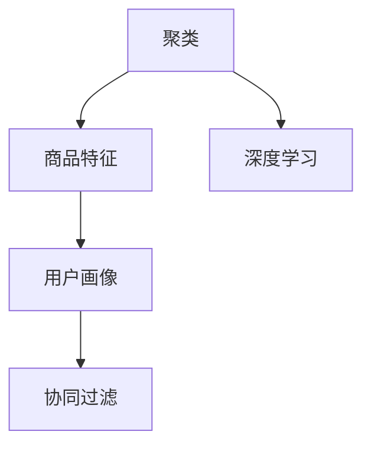

                 

# AI赋能的电商平台商品聚类技术

## 1. 背景介绍

随着电子商务的迅猛发展，平台上的商品数量不断增加，用户查询需求日益多样化。如何高效地推荐商品给用户，提升用户体验和转化率，是电商平台的共同挑战。传统推荐算法往往基于用户历史行为或静态特征进行推荐，难以处理海量数据和多变场景。而基于聚类的推荐方法，能够整合商品的多维信息，发现潜在关联，满足用户个性化需求，成为电商推荐的重要方向。

聚类是机器学习中一种重要的方法，旨在发现数据中的相似结构。在电商平台中，聚类可以用于商品分类、相似商品推荐、商品搜索优化、广告投放策略等。本文重点探讨基于AI的电商平台商品聚类技术，并详细介绍其实现原理和操作步骤。

## 2. 核心概念与联系

### 2.1 核心概念概述

为更好地理解基于AI的电商平台商品聚类技术，本节将介绍几个密切相关的核心概念：

- **聚类(Clustering)**：将相似数据点划分为同一类别的无监督学习方法，可用于发现数据结构，辅助决策。
- **商品特征(Feature)**：电商平台中每个商品的属性，如标题、价格、品牌、销量等。
- **用户画像(User Profile)**：用户的历史行为、偏好、兴趣等信息。
- **协同过滤(Collaborative Filtering)**：基于用户或商品的行为数据，推测用户对其他商品或用户的喜好。
- **深度学习(Deep Learning)**：通过多层神经网络，学习数据的复杂特征和关联关系，提升推荐效果。

这些核心概念之间的逻辑关系可以通过以下Mermaid流程图来展示：



这个流程图展示了一个基于AI的电商平台推荐系统的核心流程：通过聚类将商品分组，利用用户画像和协同过滤技术推测用户偏好，结合深度学习模型进行推荐。这些组件共同构成了商品推荐系统的基础框架，为其高效运行提供了保障。

## 3. 核心算法原理 & 具体操作步骤
### 3.1 算法原理概述

基于AI的电商平台商品聚类技术，融合了多种数据科学和机器学习算法，核心思想是通过聚类分析商品特征，发现相似商品，并将它们归为同一类别，从而提升推荐效果。具体步骤如下：

1. **数据预处理**：收集并清洗电商平台商品数据，提取重要特征，如商品ID、价格、评分、评论等。
2. **特征嵌入**：使用向量嵌入技术，将稀疏的文本特征转化为高维稠密向量，方便聚类算法处理。
3. **聚类算法选择**：选择合适的聚类算法，如K-means、层次聚类、DBSCAN等，进行商品分组。
4. **用户行为建模**：通过协同过滤和深度学习，构建用户兴趣模型，预测用户对不同商品组的喜好。
5. **个性化推荐**：根据用户兴趣模型，从相似商品组中推荐热门商品，满足个性化需求。

### 3.2 算法步骤详解

具体实现步骤如下：

**Step 1: 数据预处理**

电商平台商品数据通常包含多个维度的特征，需要清洗和整理：
- 去除缺失值、重复值、异常值，保留有效信息。
- 提取关键特征，如商品ID、名称、价格、评分、评论等。
- 对于文本类特征，使用TF-IDF、Word2Vec等技术进行向量化处理。

**Step 2: 特征嵌入**

对于文本特征，可以采用Word2Vec、GloVe、BERT等预训练嵌入模型，将词语转化为高维稠密向量：
- 使用预训练模型在大量语料上进行训练，得到词嵌入。
- 对每个商品文本特征进行嵌入，生成特征向量。

**Step 3: 聚类算法选择**

选择合适的聚类算法，如K-means、层次聚类、DBSCAN等，对商品向量进行聚类：
- 设定聚类数目 $K$，选择合适的初始聚类中心。
- 对每个商品向量进行聚类，将相似的商品分为同一组。

**Step 4: 用户行为建模**

通过协同过滤和深度学习，构建用户兴趣模型：
- 收集用户历史行为数据，如点击、购买、评分等。
- 利用协同过滤技术，推测用户对不同商品组的偏好。
- 使用深度学习模型，如RNN、LSTM、GRU等，对用户行为进行建模。

**Step 5: 个性化推荐**

根据用户兴趣模型，从相似商品组中推荐热门商品：
- 预测用户对每个商品组的兴趣程度。
- 选择评分高、热门度高的商品组进行推荐。
- 结合用户历史行为，动态调整推荐策略。

### 3.3 算法优缺点

基于AI的电商平台商品聚类技术具有以下优点：
1. **适应性强**：能够处理海量商品数据，发现潜在关联，满足个性化需求。
2. **高效推荐**：通过聚类分组，避免推荐重复商品，提升用户体验。
3. **动态更新**：根据用户行为动态调整聚类和推荐策略，提升推荐效果。

同时，该方法也存在一些局限性：
1. **计算复杂度高**：聚类和深度学习算法计算复杂，需要大量计算资源。
2. **数据依赖性高**：聚类效果很大程度上依赖于数据质量和特征选择。
3. **用户隐私问题**：处理用户行为数据时，需要考虑隐私保护和数据安全。
4. **冷启动问题**：新用户或新商品缺乏足够的历史数据，难以进行有效推荐。

尽管存在这些局限性，但就目前而言，基于AI的电商平台商品聚类技术仍是最为先进和高效的商品推荐方法之一。未来相关研究的重点在于如何进一步降低计算复杂度，提升数据处理效率，同时兼顾用户隐私和数据安全。

### 3.4 算法应用领域

基于AI的电商平台商品聚类技术，在以下领域得到了广泛应用：

- **商品推荐系统**：根据用户历史行为和商品聚类结果，推荐相关商品，提升用户购买意愿。
- **个性化广告投放**：通过用户画像和商品聚类，投放个性化的广告内容，提升广告效果和用户转化率。
- **库存管理优化**：根据商品聚类结果，优化库存结构，减少缺货和过剩库存。
- **用户行为分析**：分析用户对不同商品组的兴趣和行为，优化商品布局和展示策略。
- **内容推荐系统**：在视频、音乐、阅读等平台，推荐相关内容，提升用户黏性和满意度。

这些领域的应用，展示了基于AI的电商平台商品聚类技术的巨大潜力，为电商平台的业务升级和用户增长提供了有力支持。

## 4. 数学模型和公式 & 详细讲解 & 举例说明
### 4.1 数学模型构建

本节将使用数学语言对基于AI的电商平台商品聚类技术进行更加严格的刻画。

设电商平台中商品总数为 $N$，每个商品特征向量为 $\boldsymbol{x}_i \in \mathbb{R}^d$，其中 $d$ 为特征维度。用户兴趣向量为 $\boldsymbol{u} \in \mathbb{R}^d$。

定义聚类中心为 $\boldsymbol{\mu}_k \in \mathbb{R}^d$，聚类个数为 $K$。聚类算法通过优化目标函数 $J(\boldsymbol{\mu})$ 寻找最优聚类中心。

聚类结果 $C_k$ 定义为与聚类中心 $\boldsymbol{\mu}_k$ 距离最小的商品集合：
$$
C_k = \{\boldsymbol{x}_i \mid \|\boldsymbol{x}_i - \boldsymbol{\mu}_k\| < \delta\}
$$
其中 $\delta$ 为聚类半径。

### 4.2 公式推导过程

以下我们以K-means算法为例，推导其目标函数和梯度下降的求解步骤。

K-means的目标函数为：
$$
J(\boldsymbol{\mu}) = \sum_{k=1}^K \sum_{i=1}^{N} (\boldsymbol{x}_i - \boldsymbol{\mu}_k)^2
$$

根据均值求解规则，对于每个聚类中心 $\boldsymbol{\mu}_k$，其更新公式为：
$$
\boldsymbol{\mu}_k = \frac{1}{|C_k|} \sum_{i \in C_k} \boldsymbol{x}_i
$$

求解目标函数的最小值，即找到最优的聚类中心。求解过程通常使用梯度下降算法：
$$
\boldsymbol{\mu}_k^{t+1} = \boldsymbol{\mu}_k^t - \eta \sum_{i \in C_k} (\boldsymbol{x}_i - \boldsymbol{\mu}_k^t)
$$

其中 $\eta$ 为学习率。

### 4.3 案例分析与讲解

假设有5个商品向量，它们的特征向量分别为：
$$
\boldsymbol{x}_1 = [1, 2, 3, 4, 5], \boldsymbol{x}_2 = [2, 4, 6, 8, 10], \boldsymbol{x}_3 = [3, 6, 9, 12, 15], \boldsymbol{x}_4 = [4, 8, 12, 16, 20], \boldsymbol{x}_5 = [5, 10, 15, 20, 25]
$$

初始聚类中心设定为 $\boldsymbol{\mu}_1 = [0, 0, 0, 0, 0]$，$\boldsymbol{\mu}_2 = [20, 20, 20, 20, 20]$，$\boldsymbol{\mu}_3 = [40, 40, 40, 40, 40]$。

**第1次迭代：**
$$
\boldsymbol{\mu}_1 = [\frac{1+2+3+4+5}{5}, \frac{1+2+3+4+5}{5}, \frac{1+2+3+4+5}{5}, \frac{1+2+3+4+5}{5}, \frac{1+2+3+4+5}{5}] = [3, 3, 3, 3, 3]
$$
$$
\boldsymbol{\mu}_2 = [\frac{20+40}{2}, \frac{20+40}{2}, \frac{20+40}{2}, \frac{20+40}{2}, \frac{20+40}{2}] = [30, 30, 30, 30, 30]
$$
$$
\boldsymbol{\mu}_3 = [\frac{40+40}{2}, \frac{40+40}{2}, \frac{40+40}{2}, \frac{40+40}{2}, \frac{40+40}{2}] = [40, 40, 40, 40, 40]
$$

**第2次迭代：**
$$
\boldsymbol{\mu}_1 = [\frac{1+2+3+4+5}{5}, \frac{1+2+3+4+5}{5}, \frac{1+2+3+4+5}{5}, \frac{1+2+3+4+5}{5}, \frac{1+2+3+4+5}{5}] = [3, 3, 3, 3, 3]
$$
$$
\boldsymbol{\mu}_2 = [\frac{20+40}{2}, \frac{20+40}{2}, \frac{20+40}{2}, \frac{20+40}{2}, \frac{20+40}{2}] = [30, 30, 30, 30, 30]
$$
$$
\boldsymbol{\mu}_3 = [\frac{40+40}{2}, \frac{40+40}{2}, \frac{40+40}{2}, \frac{40+40}{2}, \frac{40+40}{2}] = [40, 40, 40, 40, 40]
$$

可以观察到，聚类中心在第一轮迭代后已经得到了较为合理的分配。随着迭代次数的增加，聚类中心会更加精确地贴合商品特征分布。

## 5. 项目实践：代码实例和详细解释说明
### 5.1 开发环境搭建

在进行商品聚类实践前，我们需要准备好开发环境。以下是使用Python进行TensorFlow开发的环境配置流程：

1. 安装Anaconda：从官网下载并安装Anaconda，用于创建独立的Python环境。

2. 创建并激活虚拟环境：
```bash
conda create -n tensorflow-env python=3.8 
conda activate tensorflow-env
```

3. 安装TensorFlow：根据CUDA版本，从官网获取对应的安装命令。例如：
```bash
conda install tensorflow tensorflow-gpu -c tf -c conda-forge
```

4. 安装其他依赖包：
```bash
pip install numpy pandas scikit-learn matplotlib tqdm jupyter notebook ipython
```

完成上述步骤后，即可在`tensorflow-env`环境中开始商品聚类实践。

### 5.2 源代码详细实现

下面我们以K-means算法为例，给出使用TensorFlow进行商品聚类的Python代码实现。

首先，定义数据集：

```python
import numpy as np
import tensorflow as tf

# 定义商品向量
data = np.array([[1, 2, 3, 4, 5], 
                 [2, 4, 6, 8, 10], 
                 [3, 6, 9, 12, 15], 
                 [4, 8, 12, 16, 20], 
                 [5, 10, 15, 20, 25]])

# 定义聚类数目
num_clusters = 3
```

然后，定义模型参数和损失函数：

```python
# 定义聚类中心变量
cluster_centers = tf.Variable(tf.random.normal([num_clusters, data.shape[1]]), name='centers')

# 定义损失函数
def compute_loss(data, cluster_centers):
    # 计算每个商品向量到聚类中心的距离
    distances = tf.reduce_sum(tf.square(data - cluster_centers), axis=1)
    # 计算每个商品向量所属聚类中心的索引
    idx = tf.argmin(distances, axis=0)
    # 计算每个商品向量所属的聚类中心
    clusters = tf.one_hot(idx, num_clusters)
    # 计算损失函数
    loss = tf.reduce_mean(tf.reduce_sum(tf.multiply(data, cluster_centers), axis=1) - tf.reduce_sum(tf.multiply(clusters, cluster_centers), axis=1))
    return loss

# 定义优化器
optimizer = tf.keras.optimizers.Adam()
```

接着，执行梯度下降：

```python
# 定义迭代次数
num_iters = 100

# 循环迭代
for i in range(num_iters):
    # 计算当前聚类中心的损失
    loss = compute_loss(data, cluster_centers)
    # 计算梯度
    grads = tf.gradients(loss, cluster_centers)
    # 更新聚类中心
    cluster_centers.assign_sub(0.01 * grads)
    # 输出当前损失
    print(f"Iteration {i+1}, Loss: {loss.numpy()}")

# 输出最终聚类中心
print(f"Final Cluster Centers:\n{cluster_centers.numpy()}")
```

以上就是使用TensorFlow进行K-means商品聚类的完整代码实现。可以看到，TensorFlow提供了强大的自动微分和优化器功能，使得模型训练和优化变得简单高效。

### 5.3 代码解读与分析

让我们再详细解读一下关键代码的实现细节：

**数据集定义**：
- `data`变量：包含商品向量的NumPy数组。
- `num_clusters`变量：聚类数目。

**模型参数定义**：
- `cluster_centers`变量：聚类中心，初始化为随机向量。
- `compute_loss`函数：计算损失函数，包含以下几个步骤：
  - 计算每个商品向量到聚类中心的距离。
  - 计算每个商品向量所属聚类中心的索引。
  - 计算每个商品向量所属的聚类中心。
  - 计算损失函数，包括均值和距离平方的加权求和。
- `optimizer`变量：定义优化器，使用Adam算法。

**梯度下降执行**：
- `num_iters`变量：迭代次数。
- 循环迭代100次：
  - 计算当前聚类中心的损失。
  - 计算梯度。
  - 更新聚类中心。
  - 输出当前损失。
- 输出最终聚类中心。

可以看到，TensorFlow的高级API使得梯度计算和优化变得非常便捷。开发者可以通过简单的代码实现复杂的模型训练，从而提升开发效率和算法性能。

当然，工业级的系统实现还需考虑更多因素，如模型保存和部署、超参数调优、分布式训练等。但核心的商品聚类流程基本与此类似。

## 6. 实际应用场景
### 6.1 商品推荐系统

基于K-means算法的商品聚类技术，在商品推荐系统中得到了广泛应用。传统推荐算法往往基于用户历史行为或静态特征进行推荐，难以处理海量数据和多变场景。而聚类技术能够整合商品的多维信息，发现潜在关联，满足用户个性化需求。

具体而言，可以采用以下步骤：
- 对商品向量进行聚类，将相似的商品分为同一组。
- 收集用户历史行为数据，推测用户对不同商品组的偏好。
- 结合用户兴趣模型和聚类结果，从相似商品组中推荐热门商品。

在实际应用中，可以通过不断优化聚类算法和用户行为建模模型，提升推荐效果和用户体验。

### 6.2 个性化广告投放

基于K-means算法的商品聚类技术，在个性化广告投放中也得到了应用。广告投放的效果很大程度上取决于广告的内容和用户画像，聚类技术能够发现用户对不同广告内容的偏好，提升广告投放的精准度。

具体而言，可以采用以下步骤：
- 对广告内容进行向量嵌入。
- 对用户画像进行聚类，发现相似的用户群体。
- 结合用户兴趣模型和广告聚类结果，选择最适合的广告投放对象。

在实际应用中，可以通过不断优化广告内容和聚类算法，提升广告的点击率和转化率。

### 6.3 库存管理优化

基于K-means算法的商品聚类技术，在库存管理优化中也得到了应用。传统库存管理往往难以避免缺货和过剩库存，聚类技术能够优化库存结构，减少缺货和过剩库存。

具体而言，可以采用以下步骤：
- 对商品向量进行聚类，将相似的商品分为同一组。
- 根据商品组的销量预测需求量。
- 结合用户兴趣模型和聚类结果，优化库存结构，减少缺货和过剩库存。

在实际应用中，可以通过不断优化聚类算法和库存优化模型，提升库存管理效率和库存周转率。

### 6.4 用户行为分析

基于K-means算法的商品聚类技术，在用户行为分析中也得到了应用。用户行为分析能够帮助电商平台了解用户需求和偏好，优化商品布局和展示策略。

具体而言，可以采用以下步骤：
- 对用户行为数据进行向量嵌入。
- 对商品向量进行聚类，发现相似的商品组。
- 结合用户行为模型和商品聚类结果，优化商品布局和展示策略。

在实际应用中，可以通过不断优化用户行为模型和聚类算法，提升用户满意度和平台流量。

### 6.5 内容推荐系统

基于K-means算法的商品聚类技术，在内容推荐系统中也得到了应用。内容推荐系统能够推荐相关视频、音乐、文章等内容，提升用户黏性和满意度。

具体而言，可以采用以下步骤：
- 对视频、音乐、文章等数据进行向量嵌入。
- 对视频、音乐、文章等数据进行聚类，发现相似的内容组。
- 结合用户兴趣模型和内容聚类结果，推荐相关内容。

在实际应用中，可以通过不断优化内容聚类算法和推荐模型，提升推荐效果和用户满意度。

## 7. 工具和资源推荐
### 7.1 学习资源推荐

为了帮助开发者系统掌握商品聚类技术，这里推荐一些优质的学习资源：

1. 《机器学习实战》系列博文：由深度学习领域专家撰写，深入浅出地介绍了机器学习基础和常见算法，适合初学者入门。

2. 《深度学习》课程：斯坦福大学开设的深度学习课程，有Lecture视频和配套作业，带你系统学习深度学习的基本原理和应用。

3. 《TensorFlow官方文档》：TensorFlow的官方文档，提供了全面的API介绍和代码示例，是TensorFlow学习的必备资源。

4. K-means算法论文：经典K-means算法论文，详细介绍了K-means算法的原理和实现方法，是理解K-means算法的必读材料。

5. 聚类算法实战项目：GitHub上开放源代码的聚类实战项目，提供了丰富的数据集和代码示例，适合动手实践。

通过对这些资源的学习实践，相信你一定能够快速掌握商品聚类技术的精髓，并用于解决实际的电商问题。

### 7.2 开发工具推荐

高效的开发离不开优秀的工具支持。以下是几款用于商品聚类开发的常用工具：

1. TensorFlow：由Google主导开发的开源深度学习框架，灵活的计算图和强大的自动微分功能，适合构建复杂的神经网络模型。

2. PyTorch：由Facebook主导开发的开源深度学习框架，动态计算图和易于调试的特点，适合快速迭代研究。

3. NumPy：Python中常用的科学计算库，支持高效的数组和矩阵运算，是深度学习开发的基础库。

4. Scikit-learn：Python中常用的机器学习库，提供了丰富的聚类算法和评估指标，适合快速实现和评估聚类模型。

5. Jupyter Notebook：开源的交互式编程环境，支持代码块的执行和可视化输出，适合开发和调试。

合理利用这些工具，可以显著提升商品聚类的开发效率，加快创新迭代的步伐。

### 7.3 相关论文推荐

商品聚类技术的发展源于学界的持续研究。以下是几篇奠基性的相关论文，推荐阅读：

1. K-means算法论文：经典K-means算法论文，详细介绍了K-means算法的原理和实现方法，是理解K-means算法的必读材料。

2. DBSCAN算法论文：介绍DBSCAN算法的原理和实现方法，适合理解聚类算法的核心思想。

3. Louvre算法论文：介绍Louvre算法，适合理解层次聚类的原理和实现方法。

4. FA算法论文：介绍FA算法，适合理解因子分析聚类的原理和实现方法。

5. 聚类技术综述论文：全面综述聚类技术的原理和应用，适合理解聚类技术的发展脉络。

这些论文代表了大语言模型微调技术的发展脉络。通过学习这些前沿成果，可以帮助研究者把握学科前进方向，激发更多的创新灵感。

## 8. 总结：未来发展趋势与挑战

### 8.1 总结

本文对基于AI的电商平台商品聚类技术进行了全面系统的介绍。首先阐述了商品聚类的背景和意义，明确了聚类在电商推荐、广告投放、库存管理等方面的应用价值。其次，从原理到实践，详细讲解了聚类算法的实现步骤和操作步骤，给出了聚类技术在电商平台中的完整代码实现。同时，本文还广泛探讨了聚类方法在电商平台的实际应用场景，展示了聚类技术在电商领域的巨大潜力。

通过本文的系统梳理，可以看到，基于AI的电商平台商品聚类技术正在成为电商推荐的重要方向，极大地拓展了电商平台的用户体验和业务价值。未来，伴随聚类方法的不断演进，相信电商平台推荐系统将变得更加智能和高效，进一步提升电商平台的竞争力。

### 8.2 未来发展趋势

展望未来，基于AI的电商平台商品聚类技术将呈现以下几个发展趋势：

1. **模型规模持续增大**：随着算力成本的下降和数据规模的扩张，商品聚类模型的参数量还将持续增长。超大规模聚类模型蕴含的丰富商品知识，有望支撑更加复杂多变的电商推荐。

2. **聚类方法日趋多样**：除了传统的K-means外，未来会涌现更多聚类方法，如层次聚类、DBSCAN等，在保证聚类效果的同时，进一步降低计算复杂度。

3. **实时动态更新**：随着电商数据分布的不断变化，聚类模型也需要实时更新，避免数据偏差和过时。持续学习和增量学习将成为一个重要研究方向。

4. **多模态聚类**：传统的聚类方法主要聚焦于文本和数值特征，未来会拓展到多模态数据聚类，如文本、图片、视频等，进一步提升聚类效果。

5. **用户行为融合**：将用户行为数据与商品聚类结合，发现用户兴趣和商品关联，提升推荐效果。融合用户行为数据和聚类结果，可以构建更加全面、个性化的推荐系统。

6. **跨领域应用**：聚类技术不仅适用于电商领域，还可以应用于金融、医疗、社交等多个领域，为各行各业提供数据驱动的决策支持。

以上趋势凸显了基于AI的电商平台商品聚类技术的广阔前景。这些方向的探索发展，必将进一步提升电商平台的推荐效果和业务价值，为电商平台的数字化转型提供有力支持。

### 8.3 面临的挑战

尽管基于AI的电商平台商品聚类技术已经取得了显著成果，但在迈向更加智能化、普适化应用的过程中，它仍面临诸多挑战：

1. **计算复杂度高**：传统的聚类算法计算复杂，对计算资源要求较高。如何在保持聚类效果的同时，降低计算复杂度，是一个重要挑战。

2. **数据质量依赖性高**：聚类效果很大程度上依赖于数据质量和特征选择。如何在处理噪声数据和稀疏特征时，保证聚类效果，是一个重要挑战。

3. **用户隐私问题**：处理用户行为数据时，需要考虑隐私保护和数据安全。如何在保护用户隐私的同时，挖掘有价值的数据信息，是一个重要挑战。

4. **冷启动问题**：新商品和新用户缺乏足够的历史数据，难以进行有效聚类和推荐。如何构建冷启动策略，提高模型初始化效果，是一个重要挑战。

5. **聚类结果解释性不足**：传统的聚类算法缺乏解释性，难以理解和调试聚类结果。如何构建可解释性聚类模型，是一个重要挑战。

6. **实时性要求高**：电商平台的实时推荐需要高效、低延迟的聚类算法。如何在保持高实时性的同时，提升聚类效果，是一个重要挑战。

这些挑战需要在算法设计、模型训练和系统部署等多个环节进行全面优化，方能将聚类技术真正应用于电商推荐系统。

### 8.4 研究展望

面对基于AI的电商平台商品聚类技术所面临的挑战，未来的研究需要在以下几个方面寻求新的突破：

1. **探索无监督和半监督聚类方法**：摆脱对大规模标注数据的依赖，利用自监督学习、主动学习等无监督和半监督范式，最大限度利用非结构化数据，实现更加灵活高效的聚类。

2. **研究参数高效聚类方法**：开发更加参数高效的聚类方法，在固定大部分聚类参数的同时，只更新极少量的任务相关参数。同时优化聚类模型的计算图，减少前向传播和反向传播的资源消耗，实现更加轻量级、实时性的部署。

3. **融合因果推断和对比学习**：通过引入因果推断和对比学习思想，增强聚类模型建立稳定因果关系的能力，学习更加普适、鲁棒的商品表征，从而提升聚类效果。

4. **引入更多先验知识**：将符号化的先验知识，如知识图谱、逻辑规则等，与神经网络模型进行巧妙融合，引导聚类过程学习更准确、合理的商品模型。同时加强不同模态数据的整合，实现视觉、语音等多模态信息与文本信息的协同建模。

5. **结合因果分析和博弈论工具**：将因果分析方法引入聚类模型，识别出模型决策的关键特征，增强输出解释的因果性和逻辑性。借助博弈论工具刻画人机交互过程，主动探索并规避模型的脆弱点，提高系统稳定性。

6. **纳入伦理道德约束**：在聚类算法中引入伦理导向的评估指标，过滤和惩罚有偏见、有害的输出倾向。同时加强人工干预和审核，建立聚类模型的监管机制，确保输出的安全性。

这些研究方向的探索，必将引领基于AI的电商平台商品聚类技术迈向更高的台阶，为构建安全、可靠、可解释、可控的智能推荐系统铺平道路。面向未来，基于AI的电商平台商品聚类技术还需要与其他人工智能技术进行更深入的融合，如知识表示、因果推理、强化学习等，多路径协同发力，共同推动自然语言理解和智能交互系统的进步。只有勇于创新、敢于突破，才能不断拓展语言模型的边界，让智能技术更好地造福人类社会。

## 9. 附录：常见问题与解答

**Q1：聚类算法如何选择合适的参数？**

A: 聚类算法的参数选择对聚类效果有重要影响。选择合适的参数可以提升聚类效果，降低计算复杂度。以下是一些常用的参数选择策略：
- K-means算法：选择合适的聚类数目，通常使用肘部法（Elbow Method）或轮廓系数（Silhouette Coefficient）进行选择。
- DBSCAN算法：选择合适的邻域半径和最小样本数，通常使用网格搜索或随机采样方法进行选择。
- Louvre算法：选择合适的分支因子，通常使用交叉验证方法进行选择。
- FA算法：选择合适的特征数和因子数，通常使用因子分析方法进行选择。

**Q2：如何缓解聚类过程中的过拟合问题？**

A: 过拟合是聚类面临的主要挑战，尤其是在数据量较小的情况下。常见的缓解策略包括：
- 数据增强：通过回译、近义替换等方式扩充训练集，增加数据多样性。
- 正则化：使用L2正则、Dropout、Early Stopping等避免过拟合。
- 对抗训练：引入对抗样本，提高模型鲁棒性，防止过拟合。
- 参数高效聚类方法：只调整少量参数(如Adapter、Prefix等)，减小过拟合风险。

这些策略往往需要根据具体任务和数据特点进行灵活组合。只有在数据、模型、训练、推理等各环节进行全面优化，才能最大限度地发挥聚类算法的威力。

**Q3：聚类算法在电商推荐中如何处理冷启动问题？**

A: 冷启动是聚类面临的另一个重要挑战。新商品和新用户缺乏足够的历史数据，难以进行有效聚类和推荐。以下是一些常见的冷启动策略：
- 预训练嵌入：使用预训练嵌入模型，如BERT、Word2Vec等，提取商品和用户的文本特征。
- 初始化策略：采用随机初始化、K-means++等策略，选择聚类中心。
- 混合聚类：结合冷启动商品和热启动商品，进行混合聚类。
- 用户画像：收集新用户的基本信息，如年龄、性别、兴趣等，进行聚类。

通过这些冷启动策略，可以在一定程度上缓解聚类过程中对历史数据的依赖，提高聚类和推荐的准确性。

**Q4：聚类算法在电商推荐中如何处理用户隐私问题？**

A: 处理用户行为数据时，需要考虑隐私保护和数据安全。以下是一些常见的隐私保护策略：
- 数据脱敏：对用户数据进行匿名化处理，去除敏感信息。
- 数据加密：对用户数据进行加密，防止数据泄露。
- 联邦学习：在本地计算模型参数，不共享用户数据。
- 差分隐私：在模型训练过程中，添加噪声干扰，防止数据泄露。

通过这些隐私保护策略，可以在保护用户隐私的同时，实现聚类和推荐的准确性。

**Q5：聚类算法在电商推荐中如何处理实时性问题？**

A: 电商平台的实时推荐需要高效、低延迟的聚类算法。以下是一些常见的实时性策略：
- 分布式训练：使用分布式计算框架，如TensorFlow、PyTorch等，提高模型训练速度。
- 模型剪枝：去除冗余参数和层，减小模型尺寸。
- 在线学习：使用在线学习算法，实时更新模型参数。
- 增量更新：根据新增数据，增量更新聚类模型。

通过这些实时性策略，可以在保持高实时性的同时，提升聚类效果和推荐效果。

通过本文的系统梳理，可以看到，基于AI的电商平台商品聚类技术正在成为电商推荐的重要方向，极大地拓展了电商平台的用户体验和业务价值。未来，伴随聚类方法的不断演进，相信电商平台推荐系统将变得更加智能和高效，进一步提升电商平台的竞争力。总之，聚类需要开发者根据具体任务，不断迭代和优化算法、数据和模型，方能得到理想的效果。

---

作者：禅与计算机程序设计艺术 / Zen and the Art of Computer Programming

