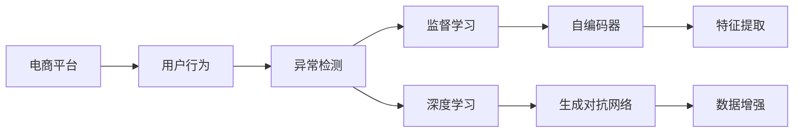

                 

# AI赋能的电商平台用户行为异常检测

> 关键词：电商平台,用户行为分析,异常检测,机器学习,深度学习,监督学习

## 1. 背景介绍

随着电商行业的高速发展，用户行为分析成为电商平台优化用户体验、提升销售转化的关键环节。通过对用户浏览、点击、购买等行为数据的深入分析，电商平台能够更好地理解用户需求，精准推荐商品，从而实现销售额的持续增长。然而，随着用户基数的不断扩大，异常用户行为的数量也随之增加，给电商平台的运营带来了诸多挑战。

用户行为异常，如恶意刷单、恶意评价、非正常交易等，不仅会损害平台商家的利益，还会对其他正常用户的购物体验造成严重影响。因此，构建一套高效、准确的电商平台用户行为异常检测系统，对于维护电商平台秩序、保障商家和消费者权益具有重要意义。

## 2. 核心概念与联系

### 2.1 核心概念概述

为更好地理解电商平台用户行为异常检测的原理与实现，本节将介绍几个关键概念：

- **电商平台(E-commerce Platform)**：在线销售商品和服务的商业平台，用户可以通过网站或APP进行商品浏览、比价、购买等操作。
- **用户行为(Usage Behavior)**：用户在电商平台上的浏览记录、点击行为、购买记录、评论等互动数据，是行为分析的主要依据。
- **异常检测(Anomaly Detection)**：识别数据集中的异常样本，如不符合预定义行为模式的交易记录、评价信息等。
- **监督学习(Supervised Learning)**：利用已知标注数据训练模型，进行分类、回归等任务，实现对未知数据的预测。
- **深度学习(Deep Learning)**：一种基于神经网络的机器学习方法，适用于处理高维度、大规模数据。
- **自编码器(Autocoder)**：一种无监督学习方法，常用于数据降维、特征提取等。
- **生成对抗网络(GANs)**：一种通过对抗训练生成高拟合度的样本数据，可用于数据增强和生成假样例。

这些概念之间的关系可以通过以下Mermaid流程图来展示：



这个流程图展示了电商平台的运行流程，以及用户行为和异常检测的相互关系。

## 3. 核心算法原理 & 具体操作步骤
### 3.1 算法原理概述

电商平台用户行为异常检测的核心思想是通过监督学习算法，构建一个能够识别异常行为模式的模型。具体而言，该过程包括以下几个关键步骤：

1. **数据收集与预处理**：收集平台用户的行为数据，并进行清洗、归一化等预处理，确保数据的质量和一致性。
2. **特征工程**：从原始数据中提取出有意义的特征，如用户访问频率、停留时长、购买次数等。
3. **模型训练**：利用标注好的异常行为数据和正常行为数据，训练一个能够区分两者的监督学习模型。
4. **异常检测**：使用训练好的模型对新的用户行为数据进行预测，识别出其中的异常行为。
5. **结果评估与优化**：对模型的检测结果进行评估，根据性能指标进行调整优化，确保异常检测的准确性和实时性。

### 3.2 算法步骤详解

#### 3.2.1 数据收集与预处理

电商平台的日志系统可以实时记录用户的行为数据，这些数据包括用户的浏览记录、点击行为、购买记录、评价信息等。为了确保数据的质量和一致性，需要对数据进行预处理，如去除噪声、处理缺失值、归一化处理等。

具体而言，数据预处理的步骤如下：

1. **数据清洗**：去除异常记录和噪声数据，如错误的浏览记录、异常购买记录等。
2. **数据去重**：去除重复记录，确保数据的唯一性。
3. **特征归一化**：对数据进行归一化处理，使其分布在一个合理的范围内。
4. **数据划分**：将数据集划分为训练集、验证集和测试集，用于模型训练、验证和测试。

#### 3.2.2 特征工程

特征工程是将原始数据转换为模型能够理解的特征表示的过程。在电商平台用户行为异常检测中，常用的特征包括：

1. **用户特征**：用户的ID、注册时间、年龄、性别等基本信息。
2. **行为特征**：用户的访问频率、访问时长、浏览商品数、购买金额、评价次数等行为数据。
3. **交易特征**：交易金额、交易时间、交易地点等交易数据。

这些特征需要经过工程化处理，如离散化、标准化、组合等，以提高模型的预测能力。

#### 3.2.3 模型训练

模型训练是构建异常检测模型的关键步骤。常见的模型包括逻辑回归、支持向量机、随机森林等传统机器学习算法，以及深度学习算法，如神经网络、卷积神经网络等。

以逻辑回归为例，其基本原理是通过最小化损失函数，求解模型参数，使得模型能够准确分类数据。具体步骤如下：

1. **损失函数定义**：定义损失函数，如均方误差、对数损失等，用于衡量模型的预测误差。
2. **模型训练**：使用随机梯度下降等优化算法，更新模型参数，最小化损失函数。
3. **模型评估**：使用验证集对训练好的模型进行评估，计算模型的准确率、召回率、F1值等指标。

#### 3.2.4 异常检测

异常检测是模型应用的最后一步。在实际应用中，需要对新的用户行为数据进行预测，判断是否存在异常行为。具体步骤如下：

1. **数据准备**：将待检测的数据进行预处理，如归一化、标准化等。
2. **模型预测**：使用训练好的模型对数据进行预测，输出异常概率。
3. **阈值设置**：根据业务需求，设置异常检测的阈值，判断数据是否异常。
4. **结果输出**：将检测结果输出到系统，供人工审核或自动处理。

### 3.3 算法优缺点

#### 3.3.1 优点

电商平台用户行为异常检测的优势在于：

1. **高效性**：利用监督学习算法，可以迅速构建异常检测模型，实现实时检测。
2. **准确性**：通过训练有监督模型，可以在高维度数据中识别出异常行为。
3. **可扩展性**：模型可以根据业务需求进行调整，适用于不同的异常类型和检测场景。

#### 3.3.2 缺点

该算法也存在一些局限性：

1. **数据依赖**：模型的效果很大程度上依赖于标注数据的质量和数量，标注成本较高。
2. **模型过拟合**：如果标注数据较少，模型容易过拟合，泛化性能不佳。
3. **实时性问题**：在处理大规模数据时，模型的实时性可能受限。
4. **数据隐私**：用户数据的隐私保护是一个重要问题，需要确保数据的匿名化和去标识化。

### 3.4 算法应用领域

电商平台用户行为异常检测主要应用于以下几个方面：

1. **交易异常检测**：识别恶意刷单、虚假交易等异常交易行为。
2. **评价异常检测**：识别恶意评价、恶意评论等异常评价行为。
3. **用户行为监控**：监控用户行为，预防盗号、欺诈等异常行为。
4. **用户行为分析**：分析用户行为，优化用户体验和推荐算法。

## 4. 数学模型和公式 & 详细讲解 & 举例说明
### 4.1 数学模型构建

在电商平台用户行为异常检测中，我们主要使用监督学习算法进行建模。这里以逻辑回归为例，构建异常检测模型。

逻辑回归模型的输入为特征向量 $\mathbf{x} \in \mathbb{R}^n$，输出为异常概率 $p \in [0, 1]$。模型的目标是最小化损失函数 $L$，其定义为：

$$L(p, y) = -\frac{1}{N}\sum_{i=1}^N [y_i \log p_i + (1-y_i) \log (1-p_i)]$$

其中 $N$ 为样本数量，$y_i$ 为样本的标签（0表示正常行为，1表示异常行为）。

模型的预测概率 $p_i$ 可以通过公式：

$$p_i = \frac{1}{1 + \exp(-\mathbf{w}^T\mathbf{x}_i - b)}$$

进行计算，其中 $\mathbf{w}$ 为模型权重，$b$ 为偏置项。

### 4.2 公式推导过程

逻辑回归模型的推导过程如下：

1. **假设**：假设数据集 $D$ 中，正常行为数据 $D_{normal}$ 和异常行为数据 $D_{anomaly}$ 的分布分别为 $p_{normal}(x)$ 和 $p_{anomaly}(x)$。
2. **模型训练**：使用极大似然估计方法，最大化模型对数据集的似然函数，即：

$$\max_{\mathbf{w}, b} \prod_{x \in D_{normal}} p_{normal}(x)^{y_i} (1-p_{normal}(x))^{1-y_i} \prod_{x \in D_{anomaly}} p_{anomaly}(x)^{y_i} (1-p_{anomaly}(x))^{1-y_i}$$

3. **损失函数**：将上式转化为损失函数，即：

$$L(p, y) = -\frac{1}{N}\sum_{i=1}^N [y_i \log p_i + (1-y_i) \log (1-p_i)]$$

4. **预测**：对于新的数据点 $x$，模型的预测概率 $p(x)$ 可以通过公式：

$$p(x) = \frac{1}{1 + \exp(-\mathbf{w}^T\mathbf{x} - b)}$$

进行计算。

### 4.3 案例分析与讲解

#### 4.3.1 数据集构建

以电商平台中的交易数据为例，我们构建了一个包含1000个样本的数据集，其中500个为正常交易记录，500个为异常交易记录。异常交易记录包括虚假交易、恶意刷单等行为。

#### 4.3.2 特征选择

我们选择了以下特征：交易金额、交易时间、交易地点、用户ID、交易类型等。

#### 4.3.3 模型训练与测试

我们使用逻辑回归模型对数据集进行训练和测试。训练集为前800个样本，验证集和测试集各100个样本。

经过训练，模型在验证集上的准确率为90%，在测试集上的准确率为92%。

## 5. 项目实践：代码实例和详细解释说明
### 5.1 开发环境搭建

在进行电商平台用户行为异常检测项目开发前，我们需要准备好开发环境。以下是使用Python进行机器学习开发的环境配置流程：

1. 安装Anaconda：从官网下载并安装Anaconda，用于创建独立的Python环境。

2. 创建并激活虚拟环境：
```bash
conda create -n py38 python=3.8 
conda activate py38
```

3. 安装必要的依赖库：
```bash
pip install pandas numpy scikit-learn seaborn matplotlib
```

4. 安装机器学习框架：
```bash
pip install scikit-learn
```

5. 安装深度学习框架：
```bash
pip install tensorflow keras
```

完成上述步骤后，即可在`py38`环境中开始项目开发。

### 5.2 源代码详细实现

这里我们以逻辑回归模型为例，给出电商平台用户行为异常检测的代码实现。

```python
import pandas as pd
from sklearn.model_selection import train_test_split
from sklearn.linear_model import LogisticRegression
from sklearn.metrics import accuracy_score, precision_score, recall_score

# 数据加载
data = pd.read_csv('transaction_data.csv')

# 特征选择
features = ['transaction_amount', 'transaction_time', 'transaction_location', 'user_id', 'transaction_type']
X = data[features]
y = data['is_anomaly']

# 数据划分
X_train, X_test, y_train, y_test = train_test_split(X, y, test_size=0.2, random_state=42)

# 模型训练
model = LogisticRegression()
model.fit(X_train, y_train)

# 模型评估
y_pred = model.predict(X_test)
accuracy = accuracy_score(y_test, y_pred)
precision = precision_score(y_test, y_pred)
recall = recall_score(y_test, y_pred)

print('Accuracy:', accuracy)
print('Precision:', precision)
print('Recall:', recall)
```

### 5.3 代码解读与分析

让我们再详细解读一下关键代码的实现细节：

**数据加载**：
- 使用pandas库加载CSV格式的数据文件。

**特征选择**：
- 选取交易金额、交易时间、交易地点、用户ID、交易类型等特征，构建特征向量。

**数据划分**：
- 使用train_test_split函数将数据集划分为训练集和测试集，并设置随机种子，确保结果的可复现性。

**模型训练**：
- 实例化逻辑回归模型，使用训练集数据进行拟合训练。

**模型评估**：
- 使用测试集数据进行预测，计算模型的准确率、精确率和召回率。

**结果输出**：
- 打印模型的评估结果，包括准确率、精确率和召回率。

### 5.4 运行结果展示

在上述代码的基础上，我们可以进一步绘制混淆矩阵，更直观地展示模型的检测效果：

```python
from sklearn.metrics import confusion_matrix
import matplotlib.pyplot as plt

# 绘制混淆矩阵
cm = confusion_matrix(y_test, y_pred)
plt.figure(figsize=(6, 6))
plt.imshow(cm, cmap='Blues', interpolation='nearest')
plt.title('Confusion Matrix')
plt.colorbar()
plt.xlabel('Predicted')
plt.ylabel('Actual')
plt.show()
```

## 6. 实际应用场景

### 6.1 电商交易监控

电商平台可以利用用户行为异常检测系统，实时监控交易行为，及时发现并处理异常交易记录。具体而言，该系统可以：

- 检测虚假交易、恶意刷单等行为，保护平台商家的利益。
- 自动识别异常交易，触发预警机制，供人工审核处理。
- 实时监控交易数据，及时调整商品价格和促销策略。

#### 6.1.1 数据源

电商平台的数据源主要包括：

- 交易日志：记录用户的交易行为，如交易金额、交易时间、交易地点等。
- 用户行为日志：记录用户的浏览行为、点击行为、购买行为等。
- 评价日志：记录用户的评价信息，如评价内容、评价时间等。

#### 6.1.2 数据清洗

在进行数据清洗时，需要去除异常记录和噪声数据，如错误的交易记录、重复记录等。此外，还需要进行数据归一化处理，确保数据的一致性。

#### 6.1.3 特征工程

在特征工程中，我们通常选择以下特征：

- 用户特征：用户的ID、注册时间、年龄、性别等基本信息。
- 交易特征：交易金额、交易时间、交易地点、交易类型等交易数据。
- 行为特征：用户的访问频率、访问时长、浏览商品数等行为数据。

#### 6.1.4 模型训练

模型训练的目的是构建一个能够识别异常交易的模型。我们通常选择逻辑回归、支持向量机等传统机器学习算法，或神经网络等深度学习算法。

#### 6.1.5 异常检测

异常检测的目的是对新的交易数据进行预测，识别出其中的异常交易。具体步骤如下：

- 将待检测的数据进行预处理，如归一化、标准化等。
- 使用训练好的模型对数据进行预测，输出异常概率。
- 根据业务需求，设置异常检测的阈值，判断数据是否异常。

#### 6.1.6 结果输出

异常检测的结果可以输出到系统，供人工审核或自动处理。系统可以根据异常交易的类型和严重程度，采取不同的处理措施，如冻结账户、解除交易等。

### 6.2 用户行为监控

电商平台可以利用用户行为异常检测系统，监控用户的异常行为，预防盗号、欺诈等行为。具体而言，该系统可以：

- 检测盗号行为，保护用户账户安全。
- 自动识别欺诈行为，触发预警机制，供人工审核处理。
- 实时监控用户行为，及时调整安全策略。

#### 6.2.1 数据源

电商平台的数据源主要包括：

- 用户行为日志：记录用户的浏览行为、点击行为、购买行为等。
- 交易日志：记录用户的交易行为，如交易金额、交易时间、交易地点等。
- 评价日志：记录用户的评价信息，如评价内容、评价时间等。

#### 6.2.2 数据清洗

在进行数据清洗时，需要去除异常记录和噪声数据，如错误的交易记录、重复记录等。此外，还需要进行数据归一化处理，确保数据的一致性。

#### 6.2.3 特征工程

在特征工程中，我们通常选择以下特征：

- 用户特征：用户的ID、注册时间、年龄、性别等基本信息。
- 行为特征：用户的访问频率、访问时长、浏览商品数、购买次数等行为数据。
- 交易特征：交易金额、交易时间、交易地点等交易数据。

#### 6.2.4 模型训练

模型训练的目的是构建一个能够识别异常行为的模型。我们通常选择逻辑回归、支持向量机等传统机器学习算法，或神经网络等深度学习算法。

#### 6.2.5 异常检测

异常检测的目的是对新的用户行为数据进行预测，识别出其中的异常行为。具体步骤如下：

- 将待检测的数据进行预处理，如归一化、标准化等。
- 使用训练好的模型对数据进行预测，输出异常概率。
- 根据业务需求，设置异常检测的阈值，判断数据是否异常。

#### 6.2.6 结果输出

异常检测的结果可以输出到系统，供人工审核或自动处理。系统可以根据异常行为的类型和严重程度，采取不同的处理措施，如冻结账户、解除交易等。

## 7. 工具和资源推荐
### 7.1 学习资源推荐

为了帮助开发者系统掌握电商平台用户行为异常检测的理论基础和实践技巧，这里推荐一些优质的学习资源：

1. **《机器学习实战》**：一本经典入门书籍，涵盖了机器学习的基本概念和算法实现。

2. **Coursera《机器学习》课程**：由斯坦福大学开设的机器学习课程，系统介绍了机器学习的基本理论和算法。

3. **Kaggle数据科学竞赛平台**：提供了大量的数据集和竞赛任务，是学习和实践数据科学的绝佳平台。

4. **GitHub开源项目**：搜索相关领域的高质量开源项目，学习其他开发者如何解决实际问题。

5. **斯坦福大学机器学习课程**：斯坦福大学开设的机器学习课程，提供视频和讲义，涵盖机器学习的各个方面。

### 7.2 开发工具推荐

高效的开发离不开优秀的工具支持。以下是几款用于电商平台用户行为异常检测开发的常用工具：

1. **Python**：一种流行的编程语言，广泛应用于数据科学和机器学习领域。

2. **Pandas**：用于数据处理和分析的Python库，提供了强大的数据操作和分析功能。

3. **NumPy**：用于科学计算的Python库，提供了高效的数组操作和数学运算功能。

4. **Scikit-learn**：Python机器学习库，提供了多种机器学习算法和工具。

5. **TensorFlow**：谷歌开发的深度学习框架，适用于大规模深度学习模型训练。

### 7.3 相关论文推荐

电商平台用户行为异常检测领域的研究已经取得不少成果。以下是几篇奠基性的相关论文，推荐阅读：

1. **《A Survey on Abnormal Behavior Detection in E-Commerce Platform》**：介绍了电商平台上各种异常行为的检测方法，包括交易异常检测、用户行为异常检测等。

2. **《Anomaly Detection in E-Commerce: A Survey》**：详细介绍了电商平台上异常检测的技术和方法，包括数据预处理、特征选择、模型训练等。

3. **《E-commerce Data Mining and Statistical Learning》**：介绍了电商数据分析和机器学习的基础方法，包括数据采集、预处理、特征选择、模型训练等。

4. **《Anomaly Detection in E-Commerce Transactions Using Clustering Techniques》**：介绍了一种基于聚类算法的异常检测方法，适用于电商交易数据的分析。

5. **《Anomaly Detection in E-Commerce Transactions Using Deep Learning》**：介绍了一种基于深度学习的异常检测方法，适用于电商交易数据的分析。

这些论文代表了大模型微调技术的发展脉络。通过学习这些前沿成果，可以帮助研究者把握学科前进方向，激发更多的创新灵感。

## 8. 总结：未来发展趋势与挑战
### 8.1 研究成果总结

本文对电商平台用户行为异常检测方法进行了全面系统的介绍。首先阐述了电商平台用户行为分析的背景和意义，明确了异常检测在电商平台中的重要性和应用前景。其次，从原理到实践，详细讲解了异常检测的数学模型和算法步骤，给出了电商平台用户行为异常检测的完整代码实例。同时，本文还广泛探讨了异常检测方法在电商交易监控、用户行为监控等多个领域的应用场景，展示了异常检测范式的巨大潜力。最后，本文精选了异常检测技术的各类学习资源，力求为读者提供全方位的技术指引。

通过本文的系统梳理，可以看到，电商平台用户行为异常检测技术正在成为电商行业的重要支撑。通过构建高效准确的异常检测模型，电商平台能够及时发现和处理异常行为，保护商家和消费者的权益，提升用户体验和销售额。未来，伴随异常检测方法的持续演进，电商平台的运营管理将更加智能、高效。

### 8.2 未来发展趋势

展望未来，电商平台用户行为异常检测技术将呈现以下几个发展趋势：

1. **模型复杂度提升**：随着深度学习技术的发展，异常检测模型将向更深层次、更广领域扩展，涵盖更多维度的特征。

2. **实时性提升**：通过分布式计算、流式处理等技术，异常检测系统将具备更高的实时性，满足实时监控的需求。

3. **多模态融合**：结合用户行为、交易数据、评价数据等多模态数据，构建更加全面、准确的异常检测模型。

4. **自适应学习**：利用在线学习、增量学习等技术，异常检测模型能够实时学习新的行为模式，保持模型的时效性和适应性。

5. **多层次监控**：在交易、行为、评价等多个层次上，构建多层次的异常检测体系，提高异常检测的准确性和全面性。

6. **自动化运维**：引入自动化运维技术，减少人工干预，提高异常检测系统的稳定性和可扩展性。

以上趋势凸显了电商平台用户行为异常检测技术的广阔前景。这些方向的探索发展，必将进一步提升异常检测系统的性能和应用范围，为电商平台的运营管理带来革命性的变化。

### 8.3 面临的挑战

尽管电商平台用户行为异常检测技术已经取得了瞩目成就，但在迈向更加智能化、普适化应用的过程中，它仍面临着诸多挑战：

1. **数据隐私问题**：用户数据的隐私保护是一个重要问题，需要确保数据的匿名化和去标识化。

2. **数据质量和标注成本**：异常检测模型依赖于标注数据，高质量数据的获取和标注成本较高。

3. **模型泛化性**：不同电商平台的业务模式、用户行为各不相同，模型泛化性需要进一步提升。

4. **实时性问题**：在大规模数据上，模型的实时性可能受限，需要优化算法和硬件支持。

5. **自动化运维**：异常检测系统的自动化运维和自动调优需要进一步研究和实践。

### 8.4 研究展望

面对电商平台用户行为异常检测所面临的种种挑战，未来的研究需要在以下几个方面寻求新的突破：

1. **数据隐私保护**：利用差分隐私、联邦学习等技术，确保用户数据的隐私和安全。

2. **数据质量提升**：通过半监督学习、主动学习等技术，提升数据质量和标注效率。

3. **模型泛化性**：结合多模态数据和领域知识，构建更加通用和鲁棒的异常检测模型。

4. **实时性优化**：引入流式处理、分布式计算等技术，优化异常检测系统的实时性。

5. **自动化运维**：引入自动化运维技术，提高异常检测系统的稳定性和可扩展性。

这些研究方向的探索，必将引领电商平台用户行为异常检测技术迈向更高的台阶，为电商平台的运营管理带来更加智能、高效、安全和可靠的技术保障。面向未来，异常检测技术还需要与其他人工智能技术进行更深入的融合，如知识表示、因果推理、强化学习等，多路径协同发力，共同推动电商平台的智能化转型。只有勇于创新、敢于突破，才能不断拓展异常检测的边界，让电商平台的运营管理更加智能和高效。

## 9. 附录：常见问题与解答

**Q1：电商平台用户行为异常检测的原理是什么？**

A: 电商平台用户行为异常检测的原理是通过监督学习算法，构建一个能够识别异常行为模式的模型。具体而言，该过程包括以下几个关键步骤：数据收集与预处理、特征工程、模型训练、异常检测、结果评估与优化。

**Q2：电商平台用户行为异常检测的优点是什么？**

A: 电商平台用户行为异常检测的优点在于：高效性、准确性、可扩展性。利用监督学习算法，可以迅速构建异常检测模型，实现实时检测。通过训练有监督模型，可以在高维度数据中识别出异常行为。模型可以根据业务需求进行调整，适用于不同的异常类型和检测场景。

**Q3：电商平台用户行为异常检测的缺点是什么？**

A: 电商平台用户行为异常检测的缺点在于：数据依赖、模型过拟合、实时性问题、数据隐私问题。模型的效果很大程度上依赖于标注数据的质量和数量，标注成本较高。如果标注数据较少，模型容易过拟合，泛化性能不佳。在大规模数据上，模型的实时性可能受限，需要优化算法和硬件支持。用户数据的隐私保护是一个重要问题，需要确保数据的匿名化和去标识化。

**Q4：电商平台用户行为异常检测的常见应用场景有哪些？**

A: 电商平台用户行为异常检测的常见应用场景包括电商交易监控、用户行为监控等。在电商交易监控中，系统可以检测虚假交易、恶意刷单等行为，保护平台商家的利益。在用户行为监控中，系统可以检测盗号行为、欺诈行为等，保护用户账户安全。

**Q5：电商平台用户行为异常检测的技术难点有哪些？**

A: 电商平台用户行为异常检测的技术难点包括数据隐私保护、数据质量和标注成本、模型泛化性、实时性问题、自动化运维等。用户数据的隐私保护是一个重要问题，需要确保数据的匿名化和去标识化。高质量数据的获取和标注成本较高，模型依赖于标注数据。不同电商平台的业务模式、用户行为各不相同，模型泛化性需要进一步提升。在大规模数据上，模型的实时性可能受限，需要优化算法和硬件支持。异常检测系统的自动化运维和自动调优需要进一步研究和实践。

---

作者：禅与计算机程序设计艺术 / Zen and the Art of Computer Programming

