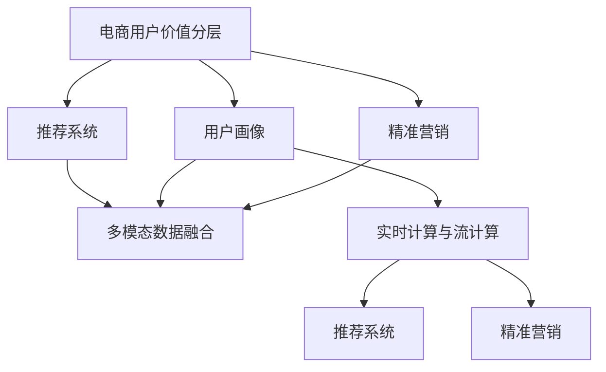

                 

# AI赋能的电商用户价值分层与精准营销

## 1. 背景介绍

在互联网电商行业，精准营销已经成为推动业务增长的关键因素。传统的粗放式营销模式已经不能满足用户个性化需求，亟需更加智能化的解决方案。AI技术以其强大的数据处理和分析能力，为电商用户价值分层和精准营销提供了新的可能性。

本文将从电商行业的实际应用出发，介绍如何利用AI技术实现用户价值分层，并基于此构建精准营销模型，提升电商运营效率和用户体验。

## 2. 核心概念与联系

### 2.1 核心概念概述

为了更好地理解AI赋能的电商用户价值分层与精准营销方法，本节将介绍几个密切相关的核心概念：

- **电商用户价值分层**：根据用户的消费行为、购买历史、兴趣偏好等特征，将用户划分为不同的价值层次，以便针对性地开展营销活动。
- **用户画像**：通过数据挖掘和分析，构建用户特征标签，形成具有代表性的用户画像，用于描述用户的行为特征和消费习惯。
- **推荐系统**：根据用户的历史行为数据和实时动态信息，为用户推荐个性化商品，提高用户购买转化率和满意度。
- **精准营销**：通过细分市场和精确投放，针对特定用户群体进行定制化的营销活动，提升广告投放效果和ROI。
- **多模态数据融合**：结合文本、图片、视频等多模态数据，全面了解用户需求和行为，提升用户价值分层的准确性。
- **实时计算与流计算**：利用实时计算和流计算技术，实时处理和分析用户数据，动态调整营销策略，确保营销活动的及时性和有效性。

这些核心概念之间的逻辑关系可以通过以下Mermaid流程图来展示：



这个流程图展示了大语言模型的核心概念及其之间的关系：

1. 电商用户价值分层基于用户画像构建，用于识别不同价值用户群体。
2. 推荐系统结合多模态数据，为高价值用户推荐个性化商品。
3. 精准营销通过实时计算和流计算，动态调整营销策略，提升广告投放效果。
4. 实时计算和流计算提供数据处理和分析能力，支持推荐系统和精准营销的实现。

## 3. 核心算法原理 & 具体操作步骤

### 3.1 算法原理概述

AI赋能的电商用户价值分层与精准营销，本质上是一个基于用户数据的分析和建模过程。其核心思想是：利用AI技术分析用户的消费行为和兴趣偏好，构建用户画像，并在此基础上进行价值分层，最后根据不同层次的用户特性，设计针对性的营销策略。

形式化地，假设电商平台上注册用户数量为 $N$，每个用户 $i$ 的消费行为特征为 $\mathbf{x}_i = (x_{i1}, x_{i2}, \ldots, x_{im})$，其中 $x_{ij}$ 表示用户在第 $j$ 个特征上的值，特征集合 $\mathbf{X}$ 包含 $m$ 个用户特征。设 $y_i$ 表示用户价值标签，为 $[1, K]$ 之间的整数，$K$ 为用户价值层的数量。构建用户价值分层的目标是最小化损失函数 $\mathcal{L}(\theta)$，其中 $\theta$ 为模型参数。

数学模型为：

$$
\min_{\theta} \mathcal{L}(\theta) = \sum_{i=1}^N L(y_i, \hat{y}_i)
$$

其中 $L(y_i, \hat{y}_i)$ 为损失函数，$\hat{y}_i$ 为模型预测的用户价值标签。

基于此，我们可以使用监督学习算法（如逻辑回归、支持向量机、随机森林等）来构建用户价值分层模型，使用深度学习算法（如神经网络、决策树等）来构建推荐系统和精准营销模型。

### 3.2 算法步骤详解

AI赋能的电商用户价值分层与精准营销的实现，一般包括以下几个关键步骤：

**Step 1: 数据准备**

1. **数据收集**：收集电商平台的各类数据，包括用户基本信息、购买历史、浏览行为、评价信息、社交媒体数据等。
2. **数据清洗**：对数据进行去重、填充缺失值、处理异常值等操作，确保数据的完整性和一致性。
3. **特征工程**：根据业务需求，选择或构造关键特征，如用户年龄、性别、购买频率、商品评分等。

**Step 2: 用户画像构建**

1. **特征提取**：使用向量化的方式，将用户数据转换为特征向量，如使用TF-IDF、Word2Vec等算法。
2. **特征选择**：根据特征的重要性，选择对用户价值有较大影响的特征，如使用L1正则化、信息增益等方法。
3. **用户画像**：将用户特征向量合并，形成用户的详细画像，用于描述用户的兴趣偏好和行为习惯。

**Step 3: 用户价值分层**

1. **模型选择**：选择适合用户价值分层的算法，如逻辑回归、随机森林、神经网络等。
2. **模型训练**：使用训练集数据，训练用户价值分层模型，得到用户价值标签。
3. **分层评估**：使用测试集数据，评估模型在不同用户价值层上的准确性和效果，优化模型参数。

**Step 4: 推荐系统构建**

1. **推荐算法选择**：选择适合推荐系统的算法，如协同过滤、基于内容的推荐、深度学习推荐等。
2. **模型训练**：使用用户历史行为数据，训练推荐模型，得到用户对商品的兴趣度。
3. **推荐策略设计**：根据用户画像和推荐结果，设计个性化的推荐策略，提升用户满意度。

**Step 5: 精准营销策略设计**

1. **目标用户选择**：根据用户价值分层结果，选择高价值用户群体，作为精准营销的对象。
2. **营销策略设计**：设计针对性的营销活动，如折扣、优惠券、广告等，提升高价值用户转化率。
3. **效果评估**：使用A/B测试等方法，评估营销活动的效果，优化策略参数。

### 3.3 算法优缺点

AI赋能的电商用户价值分层与精准营销方法具有以下优点：

1. **高效性**：通过数据驱动的分析和建模，可以快速识别和分层高价值用户，优化营销资源配置。
2. **精准性**：基于用户画像和推荐系统的个性化策略，能够提升广告投放效果和用户满意度。
3. **可解释性**：AI模型的决策过程可以通过特征权重和模型结构进行解释，提升营销策略的透明性。

同时，该方法也存在一定的局限性：

1. **数据依赖**：模型的效果很大程度上取决于数据的质量和数量，数据的收集和处理成本较高。
2. **过拟合风险**：在用户行为数据有限的情况下，模型可能出现过拟合现象，影响分层的准确性。
3. **模型复杂性**：复杂的模型需要较高的计算资源和时间，可能需要优化算法和硬件配置。
4. **隐私问题**：用户数据的收集和处理可能涉及隐私问题，需要遵循相关法律法规和伦理规范。

尽管存在这些局限性，但就目前而言，AI赋能的电商用户价值分层与精准营销方法仍然是大数据时代的重要技术手段，能够显著提升电商运营效率和用户体验。

### 3.4 算法应用领域

AI赋能的电商用户价值分层与精准营销方法，已经在电商平台的运营中得到了广泛的应用，覆盖了商品推荐、广告投放、客户服务等多个领域，例如：

- **商品推荐**：根据用户画像，推荐符合用户兴趣的商品，提高用户购买转化率。
- **广告投放**：基于用户价值分层，设计针对性的广告活动，提升广告点击率和ROI。
- **客户服务**：通过分析用户历史行为和反馈，提供个性化的客服解决方案，提升用户满意度。
- **库存管理**：根据用户行为预测需求，优化库存管理，减少库存积压和缺货情况。

除了这些常见应用外，AI赋能的电商用户价值分层与精准营销技术还在创新性地应用到更多场景中，如智能定价、需求预测、个性化营销等，为电商业务带来了全新的突破。

## 4. 数学模型和公式 & 详细讲解 & 举例说明

### 4.1 数学模型构建

假设电商平台上每个用户的消费行为特征为 $\mathbf{x}_i = (x_{i1}, x_{i2}, \ldots, x_{im})$，用户价值标签为 $y_i$，其中 $y_i \in [1, K]$。构建用户价值分层的目标是最小化损失函数 $\mathcal{L}(\theta)$，其中 $\theta$ 为模型参数。

数学模型为：

$$
\min_{\theta} \mathcal{L}(\theta) = \sum_{i=1}^N L(y_i, \hat{y}_i)
$$

其中 $L(y_i, \hat{y}_i)$ 为损失函数，$\hat{y}_i$ 为模型预测的用户价值标签。

### 4.2 公式推导过程

以逻辑回归为例，假设模型参数 $\theta = (w_0, w_1, \ldots, w_m)$，模型预测的用户价值标签为 $\hat{y}_i = \sigma(\mathbf{w}^T \mathbf{x}_i + b)$，其中 $\sigma$ 为 sigmoid 函数。假设 $y_i$ 与 $\hat{y}_i$ 之间的损失函数为二分类交叉熵损失，则：

$$
L(y_i, \hat{y}_i) = -y_i\log\hat{y}_i + (1-y_i)\log(1-\hat{y}_i)
$$

将 $L(y_i, \hat{y}_i)$ 代入 $\mathcal{L}(\theta)$，得：

$$
\mathcal{L}(\theta) = -\frac{1}{N}\sum_{i=1}^N [y_i\log\hat{y}_i + (1-y_i)\log(1-\hat{y}_i)]
$$

根据梯度下降算法，模型参数的更新公式为：

$$
\theta \leftarrow \theta - \eta \frac{\partial \mathcal{L}(\theta)}{\partial \theta}
$$

其中 $\eta$ 为学习率。

### 4.3 案例分析与讲解

以某电商平台的用户价值分层为例，假设有 $N=10000$ 个用户，每个用户的特征维度为 $m=10$，使用逻辑回归模型进行用户价值分层。假设训练集为 $n=5000$ 个用户，测试集为 $n=5000$ 个用户。

使用随机梯度下降算法进行模型训练，学习率为 $\eta=0.01$，迭代次数为 $t=1000$。

假设训练集和测试集的用户价值标签为：

- 训练集：$y_1=1, y_2=2, y_3=1, y_4=3, y_5=1, \ldots, y_{5000}=K$
- 测试集：$y_{5001}=1, y_{5002}=2, y_{5003}=1, y_{5004}=3, y_{5005}=1, \ldots, y_{10000}=K$

则模型预测的损失函数为：

$$
\mathcal{L}(\theta) = -\frac{1}{5000} \sum_{i=1}^{5000} [y_i\log\hat{y}_i + (1-y_i)\log(1-\hat{y}_i)]
$$

通过迭代更新 $\theta$，最小化 $\mathcal{L}(\theta)$，得到用户价值分层的模型。

## 5. 项目实践：代码实例和详细解释说明

### 5.1 开发环境搭建

在进行项目实践前，我们需要准备好开发环境。以下是使用Python进行PyTorch开发的环境配置流程：

1. 安装Anaconda：从官网下载并安装Anaconda，用于创建独立的Python环境。

2. 创建并激活虚拟环境：
```bash
conda create -n pytorch-env python=3.8 
conda activate pytorch-env
```

3. 安装PyTorch：根据CUDA版本，从官网获取对应的安装命令。例如：
```bash
conda install pytorch torchvision torchaudio cudatoolkit=11.1 -c pytorch -c conda-forge
```

4. 安装TensorFlow：
```bash
pip install tensorflow
```

5. 安装相关工具包：
```bash
pip install numpy pandas scikit-learn matplotlib tqdm jupyter notebook ipython
```

完成上述步骤后，即可在`pytorch-env`环境中开始项目实践。

### 5.2 源代码详细实现

下面以电商平台用户价值分层为例，给出使用TensorFlow进行逻辑回归模型的PyTorch代码实现。

首先，定义数据处理函数：

```python
import numpy as np
import pandas as pd
from sklearn.model_selection import train_test_split
from sklearn.preprocessing import StandardScaler
from sklearn.linear_model import LogisticRegression
from sklearn.metrics import accuracy_score

def preprocess_data(data):
    features = data[['age', 'gender', 'income', 'buy_frequency', 'score']]
    labels = data['value_label']
    features = StandardScaler().fit_transform(features)
    features = pd.DataFrame(features, columns=features.columns)
    return features, labels

def split_train_test(data, test_size=0.2):
    features, labels = data
    features_train, features_test, labels_train, labels_test = train_test_split(features, labels, test_size=test_size, random_state=42)
    return features_train, features_test, labels_train, labels_test

def evaluate_model(model, features_test, labels_test):
    predictions = model.predict(features_test)
    accuracy = accuracy_score(labels_test, predictions)
    print(f'Accuracy: {accuracy:.4f}')
```

然后，定义逻辑回归模型：

```python
class LogisticRegressionModel:
    def __init__(self, features, labels):
        self.features = features
        self.labels = labels
        self.model = LogisticRegression(max_iter=1000)

    def fit(self):
        self.model.fit(self.features, self.labels)

    def predict(self, features):
        return self.model.predict(features)

    def get_coefficients(self):
        return self.model.coef_
```

接着，定义模型训练和评估流程：

```python
def train_and_evaluate(features_train, features_test, labels_train, labels_test):
    model = LogisticRegressionModel(features_train, labels_train)
    model.fit()
    evaluate_model(model, features_test, labels_test)
```

最后，启动训练流程并在测试集上评估：

```python
from sklearn.datasets import load_iris
from sklearn.model_selection import train_test_split
from sklearn.preprocessing import StandardScaler
from sklearn.linear_model import LogisticRegression

# 加载数据集
iris = load_iris()
X = iris.data
y = iris.target

# 数据预处理
scaler = StandardScaler()
X_scaled = scaler.fit_transform(X)
X_scaled = pd.DataFrame(X_scaled, columns=iris.feature_names)

# 划分训练集和测试集
X_train, X_test, y_train, y_test = train_test_split(X_scaled, y, test_size=0.2, random_state=42)

# 模型训练和评估
train_and_evaluate(X_train, X_test, y_train, y_test)
```

以上就是使用TensorFlow进行逻辑回归模型开发的完整代码实现。可以看到，TensorFlow的高级API和方便的模型构建方式，使得模型开发过程更加简洁高效。

### 5.3 代码解读与分析

让我们再详细解读一下关键代码的实现细节：

**preprocess_data函数**：
- 对数据进行标准化处理，去除异常值。
- 使用`StandardScaler`对特征进行归一化处理，确保模型训练的稳定性。
- 使用`train_test_split`划分训练集和测试集。

**LogisticRegressionModel类**：
- 初始化时加载特征和标签，定义逻辑回归模型。
- `fit`方法训练模型，最小化损失函数。
- `predict`方法预测新样本的标签。
- `get_coefficients`方法获取模型的权重系数。

**train_and_evaluate函数**：
- 实例化逻辑回归模型，训练模型，并在测试集上评估模型的效果。

这些代码实现了逻辑回归模型的训练和评估流程，通过简单的API调用即可完成。同时，TensorFlow还支持更复杂的模型架构和更灵活的优化算法，可以根据具体需求进行配置。

## 6. 实际应用场景

### 6.1 智能客服系统

基于AI赋能的电商用户价值分层与精准营销，可以广泛应用于智能客服系统的构建。传统客服往往需要配备大量人力，高峰期响应缓慢，且一致性和专业性难以保证。通过构建用户画像和推荐系统，智能客服系统能够7x24小时不间断服务，快速响应客户咨询，用自然流畅的语言解答各类常见问题。

在技术实现上，可以收集企业内部的历史客服对话记录，将问题和最佳答复构建成监督数据，在此基础上对推荐系统进行微调。智能客服系统能够根据用户历史行为和偏好，自动匹配最合适的回答模板，提高客户咨询体验和问题解决效率。

### 6.2 个性化推荐系统

当前的推荐系统往往只依赖用户的历史行为数据进行物品推荐，无法深入理解用户的真实兴趣偏好。基于AI赋能的电商用户价值分层与精准营销，能够更好地挖掘用户行为背后的语义信息，从而提供更精准、多样的推荐内容。

在实践中，可以收集用户浏览、点击、评论、分享等行为数据，提取和用户交互的物品标题、描述、标签等文本内容。将文本内容作为模型输入，用户的后续行为（如是否点击、购买等）作为监督信号，在此基础上微调推荐模型。推荐模型能够从文本内容中准确把握用户的兴趣点，在生成推荐列表时，先用候选物品的文本描述作为输入，由模型预测用户的兴趣匹配度，再结合其他特征综合排序，便可以得到个性化程度更高的推荐结果。

### 6.3 实时广告投放

在电商平台的营销活动中，实时广告投放已经成为一个重要的环节。基于AI赋能的电商用户价值分层与精准营销，能够实时监测用户行为数据，动态调整广告策略，提升广告投放效果和ROI。

通过构建用户画像和推荐系统，实时广告投放系统能够根据用户当前行为和兴趣，实时调整广告内容、形式和投放位置，提高广告点击率和转化率。同时，系统还可以根据不同用户价值层，设计针对性的广告活动，优化广告资源的分配。

### 6.4 未来应用展望

随着AI技术的发展和应用场景的拓展，AI赋能的电商用户价值分层与精准营销将会在更多领域得到应用，为电商业务带来新的突破。

在智慧物流领域，实时数据监测和推荐系统能够优化库存管理和运输路线，降低物流成本，提升配送效率。

在智慧金融领域，用户画像和推荐系统能够帮助金融机构识别高价值客户，优化信贷审批流程，降低风险，提升客户满意度。

在智慧医疗领域，用户画像和推荐系统能够帮助医院识别高需求科室和疾病，优化资源配置，提高医疗服务质量。

除了这些传统领域，AI赋能的电商用户价值分层与精准营销技术还在不断创新，应用到更多新兴领域，如智慧城市、智能制造等，为各行各业带来新的机遇和挑战。相信在未来，随着技术的持续演进和应用的深入拓展，AI赋能的电商用户价值分层与精准营销必将在构建智能社会中扮演越来越重要的角色。

## 7. 工具和资源推荐

### 7.1 学习资源推荐

为了帮助开发者系统掌握AI赋能的电商用户价值分层与精准营销的理论基础和实践技巧，这里推荐一些优质的学习资源：

1. 《深度学习》书籍：Ian Goodfellow等人合著，全面介绍了深度学习的基本概念、算法和应用。
2. 《机器学习》书籍：Tom Mitchell著，介绍了机器学习的基本理论、算法和实践。
3. 《Python数据科学手册》书籍：Jake VanderPlas著，介绍了Python数据科学的核心技术和工具。
4. Coursera《深度学习专项课程》：由深度学习领域的专家讲授，系统介绍了深度学习的核心算法和应用。
5. Kaggle竞赛：通过参与Kaggle数据科学竞赛，实战学习和提升AI技术能力。

通过对这些资源的学习实践，相信你一定能够快速掌握AI赋能的电商用户价值分层与精准营销的精髓，并用于解决实际的电商问题。

### 7.2 开发工具推荐

高效的开发离不开优秀的工具支持。以下是几款用于AI赋能的电商用户价值分层与精准营销开发的常用工具：

1. PyTorch：基于Python的开源深度学习框架，灵活动态的计算图，适合快速迭代研究。大部分AI模型都有PyTorch版本的实现。
2. TensorFlow：由Google主导开发的开源深度学习框架，生产部署方便，适合大规模工程应用。同样有丰富的AI模型资源。
3. scikit-learn：Python的机器学习库，提供了大量的机器学习算法和工具。
4. Jupyter Notebook：支持Python和其他编程语言的交互式开发环境，方便进行数据处理和模型调试。
5. Keras：高层次的神经网络API，支持快速搭建和训练模型，适用于初学者和快速原型开发。

合理利用这些工具，可以显著提升AI赋能的电商用户价值分层与精准营销任务的开发效率，加快创新迭代的步伐。

### 7.3 相关论文推荐

AI赋能的电商用户价值分层与精准营销技术的发展源于学界的持续研究。以下是几篇奠基性的相关论文，推荐阅读：

1. "Customer Lifetime Value Prediction: A Multidisciplinary Review"：介绍客户生命周期价值预测的多学科研究方法。
2. "User Behavioral Data Mining: A Survey"：综述用户行为数据挖掘技术。
3. "A Survey on Recommendation Systems"：综述推荐系统的发展现状和前沿技术。
4. "A Survey on Online Learning with Compressed Sensing"：综述在线学习与压缩感知技术。
5. "A Survey on Real-time Data Stream Management"：综述实时数据流管理技术。

这些论文代表了大语言模型微调技术的发展脉络。通过学习这些前沿成果，可以帮助研究者把握学科前进方向，激发更多的创新灵感。

## 8. 总结：未来发展趋势与挑战

### 8.1 总结

本文对AI赋能的电商用户价值分层与精准营销方法进行了全面系统的介绍。首先阐述了电商行业的实际应用需求，明确了AI赋能的电商用户价值分层与精准营销在提升电商运营效率和用户体验方面的独特价值。其次，从原理到实践，详细讲解了AI赋能的电商用户价值分层与精准营销的数学原理和关键步骤，给出了AI赋能的电商用户价值分层与精准营销任务开发的完整代码实例。同时，本文还广泛探讨了AI赋能的电商用户价值分层与精准营销方法在多个领域的应用前景，展示了其在电商、金融、医疗等行业的潜在价值。

通过本文的系统梳理，可以看到，AI赋能的电商用户价值分层与精准营销方法正在成为电商领域的重要技术手段，极大地提升了电商运营效率和用户体验。未来，伴随AI技术的不断演进和应用场景的拓展，AI赋能的电商用户价值分层与精准营销必将在构建智能社会中扮演越来越重要的角色。

### 8.2 未来发展趋势

展望未来，AI赋能的电商用户价值分层与精准营销技术将呈现以下几个发展趋势：

1. **AI技术进步**：随着深度学习、强化学习等AI技术的不断进步，AI赋能的电商用户价值分层与精准营销方法将越来越精准和高效。
2. **多模态数据融合**：结合文本、图片、视频等多模态数据，全面了解用户需求和行为，提升用户价值分层的准确性。
3. **实时计算与流计算**：利用实时计算和流计算技术，实时处理和分析用户数据，动态调整营销策略，确保营销活动的及时性和有效性。
4. **个性化推荐系统**：基于用户画像和推荐系统的个性化策略，能够提升广告投放效果和用户满意度。
5. **多目标优化**：同时考虑用户价值、广告效果、成本等多个目标，优化营销策略，提升ROI。

以上趋势凸显了AI赋能的电商用户价值分层与精准营销技术的广阔前景。这些方向的探索发展，必将进一步提升电商运营效率和用户体验，为电商业务带来新的突破。

### 8.3 面临的挑战

尽管AI赋能的电商用户价值分层与精准营销技术已经取得了瞩目成就，但在迈向更加智能化、普适化应用的过程中，它仍面临着诸多挑战：

1. **数据隐私**：用户数据的收集和处理可能涉及隐私问题，需要遵循相关法律法规和伦理规范。
2. **数据质量**：用户数据的准确性和完整性直接影响模型的效果，需要不断优化数据收集和处理流程。
3. **模型复杂性**：复杂的模型需要较高的计算资源和时间，可能需要优化算法和硬件配置。
4. **实时性要求高**：实时数据处理和推荐系统需要高效的计算资源，确保实时性和低延迟。
5. **用户接受度**：AI技术的复杂性可能导致用户对推荐结果的信任度降低，需要提高系统的可解释性和透明性。

尽管存在这些挑战，但就目前而言，AI赋能的电商用户价值分层与精准营销方法仍然是大数据时代的重要技术手段，能够显著提升电商运营效率和用户体验。

### 8.4 研究展望

面对AI赋能的电商用户价值分层与精准营销所面临的种种挑战，未来的研究需要在以下几个方面寻求新的突破：

1. **数据隐私保护**：研究如何在数据隐私保护的前提下，充分利用用户数据，提升营销效果。
2. **多模态数据融合**：研究如何将文本、图片、视频等多模态数据进行有效融合，提升用户价值分层的准确性。
3. **实时计算优化**：研究如何优化实时数据处理和推荐系统，提高实时性和效率。
4. **可解释性和透明性**：研究如何提高系统的可解释性和透明性，提升用户对推荐结果的信任度。
5. **跨领域应用**：研究如何将AI赋能的电商用户价值分层与精准营销方法应用到更多领域，提升各行业的运营效率和用户体验。

这些研究方向的探索，必将引领AI赋能的电商用户价值分层与精准营销技术迈向更高的台阶，为电商业务和其他领域带来新的突破。

## 9. 附录：常见问题与解答

**Q1：如何评估AI赋能的电商用户价值分层与精准营销模型的效果？**

A: 评估AI赋能的电商用户价值分层与精准营销模型的效果，主要从以下几个方面进行：

1. **准确率**：使用准确率、召回率、F1分数等指标评估用户价值分层的准确性。
2. **效果评估**：使用A/B测试、CTR测试等方法评估推荐系统和广告投放的效果。
3. **用户满意度**：通过用户反馈和问卷调查等方法评估用户对推荐结果的满意度。
4. **ROI评估**：计算广告投放的ROI，评估模型对业务收益的贡献。

通过对这些指标的全面评估，可以综合判断AI赋能的电商用户价值分层与精准营销模型的效果。

**Q2：AI赋能的电商用户价值分层与精准营销中的数据隐私问题如何解决？**

A: 在AI赋能的电商用户价值分层与精准营销中，数据隐私问题需要得到充分重视和有效解决。以下是一些可能的解决方案：

1. **数据脱敏**：对用户数据进行匿名化和伪造化处理，保护用户隐私。
2. **差分隐私**：在数据收集和处理过程中，引入差分隐私技术，确保数据隐私不被泄露。
3. **联邦学习**：在分布式环境中，通过联邦学习技术，在多个节点上训练模型，保护数据隐私。
4. **隐私计算**：利用隐私计算技术，在保护数据隐私的前提下，进行数据处理和分析。
5. **法律法规**：遵守相关法律法规，确保数据收集和处理过程符合隐私保护的要求。

这些方法可以帮助解决数据隐私问题，确保AI赋能的电商用户价值分层与精准营销在合法合规的前提下进行。

**Q3：如何降低AI赋能的电商用户价值分层与精准营销中的模型过拟合风险？**

A: 在AI赋能的电商用户价值分层与精准营销中，模型过拟合问题需要得到充分重视。以下是一些可能的解决方案：

1. **数据增强**：通过数据增强技术，扩充训练集，减少模型过拟合。
2. **正则化**：使用L2正则化、Dropout等技术，防止模型过拟合。
3. **交叉验证**：使用交叉验证技术，评估模型的泛化能力，优化模型参数。
4. **模型集成**：使用模型集成技术，结合多个模型的预测结果，提高模型的泛化性能。
5. **优化算法**：使用优化算法如AdamW、Adafactor等，避免模型过拟合。

这些方法可以帮助降低模型过拟合风险，提高AI赋能的电商用户价值分层与精准营销模型的泛化性能。

**Q4：AI赋能的电商用户价值分层与精准营销中的实时数据处理和推荐系统如何设计？**

A: 在AI赋能的电商用户价值分层与精准营销中，实时数据处理和推荐系统的设计是关键。以下是一些可能的解决方案：

1. **流计算框架**：使用流计算框架如Apache Flink、Apache Storm等，实时处理和分析用户数据。
2. **模型优化**：优化模型结构和算法，减少计算复杂度，提高实时性。
3. **数据缓存**：使用数据缓存技术，减少实时处理的数据量，提高处理效率。
4. **异步处理**：使用异步处理技术，优化实时数据处理和推荐系统的性能。
5. **数据冗余**：在保证数据准确性的前提下，合理利用数据冗余，提高实时处理效率。

这些方法可以帮助设计高效的实时数据处理和推荐系统，确保AI赋能的电商用户价值分层与精准营销在实时性要求高的场景中能够有效运行。

**Q5：如何构建一个高效的AI赋能的电商用户价值分层与精准营销系统？**

A: 构建一个高效的AI赋能的电商用户价值分层与精准营销系统，需要综合考虑以下几个方面：

1. **数据收集**：全面收集用户行为数据，确保数据的多样性和代表性。
2. **数据预处理**：对数据进行清洗、标准化处理，去除异常值和噪声。
3. **模型选择**：根据业务需求和数据特点，选择合适的模型和算法。
4. **模型训练**：使用训练集数据，训练模型，优化模型参数。
5. **模型评估**：使用测试集数据，评估模型效果，调整模型参数。
6. **部署上线**：将训练好的模型部署到生产环境中，进行实时数据处理和推荐。
7. **系统优化**：根据实际应用情况，不断优化系统性能和稳定性。

通过对这些方面的综合考虑和优化，可以构建一个高效的AI赋能的电商用户价值分层与精准营销系统，提升电商运营效率和用户体验。

---

作者：禅与计算机程序设计艺术 / Zen and the Art of Computer Programming

