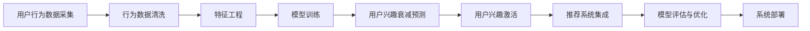

                 

## 1. 背景介绍

### 1.1 问题由来

在当今电商时代，如何精准识别用户兴趣并保持其持续活跃，已成为各大电商平台亟待解决的核心问题。传统依赖点击流、购买历史等行为数据的推荐方法，难以应对用户兴趣的动态变化和衰减。当用户对某一类商品或服务失去兴趣时，电商平台的推荐系统无法及时捕捉到这一变化，导致用户流失，造成严重经济损失。

特别是对于新用户和老用户，电商平台的推荐策略应有所不同。新用户对电商平台的商品和服务的了解有限，推荐系统应更多地利用个性化推荐和引导性信息，激发用户探索兴趣；老用户可能已经建立了固定的购物习惯，推荐系统则需要根据其历史行为和偏好，进行更精准的推荐，增强用户的粘性。

基于此，本文旨在探索一种基于用户行为数据分析的电商用户兴趣衰减与激活模型，利用AI技术分析用户行为，识别兴趣衰减趋势，并及时进行兴趣激活干预，提升用户活跃度和平台收入。

### 1.2 问题核心关键点

构建电商用户兴趣衰减与激活模型，需要关注以下几个核心关键点：

- **行为数据采集与处理**：用户行为数据包括浏览、点击、加入购物车、购买、评论等。如何采集、清洗、特征工程处理这些数据，形成可用于模型训练的数据集，是构建模型的第一步。

- **模型设计**：构建一个能够识别用户兴趣衰减趋势的模型，并根据趋势进行兴趣激活干预。模型的核心在于如何设计有效的特征工程和算法。

- **兴趣激活策略**：基于模型预测结果，制定针对性的兴趣激活策略。如推荐新商品、发送个性化优惠券、进行用户关怀等。

- **模型评估与优化**：评估模型的预测准确率和激活效果，并根据评估结果进行模型优化。

- **系统集成与部署**：将模型集成到电商推荐系统中，实现对用户行为的实时监控和干预。

## 2. 核心概念与联系

### 2.1 核心概念概述

在深入分析电商用户兴趣衰减与激活模型的构建之前，我们需要先了解几个核心概念：

- **用户行为数据**：用户在电商平台上的各种操作行为，包括浏览、点击、加入购物车、购买、评论等。这些行为数据是模型训练和预测的基础。

- **用户兴趣衰减**：用户在一段时间内对某一类商品或服务的兴趣度下降，表现为行为数据的减少或频率的降低。

- **用户兴趣激活**：通过特定策略或干预措施，使用户重新对某一类商品或服务产生兴趣，增加其行为频率和购买意愿。

- **推荐系统**：利用用户行为数据和用户画像，推荐用户可能感兴趣的商品或服务。推荐系统是实现用户兴趣激活的重要手段。

- **强化学习**：利用用户反馈数据，不断调整推荐策略，提升推荐效果。强化学习在电商推荐系统中得到了广泛应用。

- **神经网络模型**：特别是深度神经网络模型，如卷积神经网络(CNN)、循环神经网络(RNN)、变分自编码器(VAE)等，可以处理高维稀疏用户行为数据，预测用户行为趋势。

- **注意力机制**：注意力机制在深度神经网络中用于提取关键特征，提高模型对用户兴趣的识别能力。

### 2.2 核心概念原理和架构的 Mermaid 流程图



这个流程图展示了电商用户兴趣衰减与激活模型从数据采集、清洗、特征工程、模型训练、预测、激活、推荐、评估到优化的全流程。

## 3. 核心算法原理 & 具体操作步骤

### 3.1 算法原理概述

电商用户兴趣衰减与激活模型基于用户行为数据分析，利用机器学习和强化学习技术，预测用户兴趣衰减趋势，并制定个性化激活策略，提升用户活跃度。模型分为两大模块：兴趣衰减预测模块和兴趣激活模块。

- **兴趣衰减预测模块**：通过分析用户历史行为数据，构建用户行为时间序列，预测用户对某一类商品或服务的兴趣衰减趋势。
- **兴趣激活模块**：根据兴趣衰减预测结果，制定针对性的激活策略，如推荐新商品、发送优惠券等，增强用户兴趣。

### 3.2 算法步骤详解

#### 3.2.1 兴趣衰减预测模块

1. **数据收集与处理**：
   - 收集用户历史行为数据，包括浏览、点击、加入购物车、购买、评论等。
   - 对数据进行清洗，去除噪声和异常值，处理缺失值。
   - 进行特征工程，提取有意义的特征，如商品类别、浏览时长、点击率、购买频率等。

2. **模型构建**：
   - 构建时间序列模型，如ARIMA、LSTM、GRU等，对用户行为数据进行建模。
   - 引入注意力机制，提取关键行为特征，提高模型对兴趣衰减的预测能力。

3. **训练与优化**：
   - 使用历史数据训练模型，设定合适的超参数。
   - 使用交叉验证和正则化技术，防止过拟合。
   - 通过网格搜索等方法，优化模型参数，提升预测准确率。

#### 3.2.2 兴趣激活模块

1. **激活策略设计**：
   - 根据兴趣衰减预测结果，设计兴趣激活策略，如推荐新商品、发送优惠券、进行个性化客服等。
   - 制定不同的激活策略，针对不同用户群体和商品类别。

2. **策略实施与评估**：
   - 在模型预测出用户兴趣衰减后，立即实施相应的激活策略。
   - 评估激活策略的效果，使用A/B测试等方法，比较不同策略的激活效果。

3. **持续优化**：
   - 根据激活效果，调整激活策略，优化模型参数。
   - 定期重新训练模型，保持模型的预测准确率。

### 3.3 算法优缺点

#### 3.3.1 优点

1. **精准预测**：通过分析用户历史行为数据，构建时间序列模型，可以精准预测用户兴趣衰减趋势。
2. **个性化激活**：根据用户兴趣衰减预测结果，制定针对性的激活策略，提高激活效果。
3. **实时监控**：模型可以实时监控用户行为，及时发现兴趣衰减，进行激活干预。

#### 3.3.2 缺点

1. **数据依赖**：模型的效果高度依赖于历史行为数据的完整性和质量。
2. **动态性**：用户兴趣随时间变化，模型需要不断更新以适应新的行为数据。
3. **策略复杂**：激活策略的设计和实施需要考虑多种因素，增加了系统的复杂性。

### 3.4 算法应用领域

电商用户兴趣衰减与激活模型主要应用于以下领域：

- **电商推荐系统**：预测用户兴趣衰减，制定个性化激活策略，提升推荐效果。
- **用户行为分析**：分析用户行为数据，识别兴趣衰减趋势，优化用户体验。
- **营销活动设计**：根据用户兴趣衰减预测结果，设计个性化营销活动，提升用户粘性。
- **客户服务优化**：通过实时监控用户行为，及时发现兴趣衰减，进行客服干预。

## 4. 数学模型和公式 & 详细讲解 & 举例说明

### 4.1 数学模型构建

构建电商用户兴趣衰减与激活模型的关键在于用户行为数据的建模。假设用户对商品$X_t$的兴趣程度由$I_t$表示，$t$为时间。根据历史行为数据，我们可以建立一个时间序列模型来预测$I_t$的变化趋势。

- **时间序列模型**：
  - ARIMA模型：$I_t = \phi(I_{t-1}, I_{t-2}, ...) + \epsilon_t$
  - LSTM模型：$I_t = \phi(I_{t-1}, I_{t-2}, ...; \theta)$
  - GRU模型：$I_t = \phi(I_{t-1}, I_{t-2}, ...; \theta)$

- **注意力机制**：
  - 引入注意力机制$\alpha_t$，对用户历史行为数据进行加权处理，提取关键行为特征。
  - $I_t = \phi(I_{t-1}, I_{t-2}, ...; \theta) + \alpha_t \cdot \epsilon_t$

### 4.2 公式推导过程

以LSTM模型为例，推导用户兴趣度$I_t$的计算公式。

1. **LSTM模型结构**：
   - 包含输入门、遗忘门和输出门，用于控制信息的流动。
   - 输出层输出$I_t$，$I_t$表示用户对商品$X_t$的兴趣程度。

2. **计算公式推导**：
   - 输入门$g_t$：$g_t = \sigma(W_x \cdot x_t + b_x + U_g \cdot h_{t-1} + b_g)$
   - 遗忘门$f_t$：$f_t = \sigma(W_f \cdot (x_t, h_{t-1}) + b_f)$
   - 更新门$c_t$：$c_t = f_t \cdot c_{t-1} + g_t \cdot \tanh(W_c \cdot (x_t, h_{t-1}) + b_c)$
   - 输出门$o_t$：$o_t = \sigma(W_o \cdot (x_t, h_{t-1}) + b_o)$
   - 用户兴趣度$I_t$：$I_t = o_t \cdot \tanh(c_t)$

3. **注意力机制**：
   - 引入注意力机制$\alpha_t$，对用户历史行为数据进行加权处理，提取关键行为特征。
   - $\alpha_t = \sigma(W_a \cdot (x_t, h_{t-1}) + b_a)$
   - $I_t = o_t \cdot \tanh(c_t) + \alpha_t \cdot \epsilon_t$

### 4.3 案例分析与讲解

以某电商平台为例，使用LSTM模型和注意力机制对用户兴趣度进行预测和激活。

1. **数据采集与处理**：
   - 收集用户历史行为数据，包括浏览、点击、加入购物车、购买、评论等。
   - 对数据进行清洗，去除噪声和异常值，处理缺失值。
   - 进行特征工程，提取有意义的特征，如商品类别、浏览时长、点击率、购买频率等。

2. **模型构建**：
   - 构建LSTM模型，设置3层LSTM单元，每层64个隐藏单元。
   - 引入注意力机制，提取关键行为特征，提高模型对兴趣衰减的预测能力。

3. **训练与优化**：
   - 使用历史数据训练模型，设定合适的超参数。
   - 使用交叉验证和正则化技术，防止过拟合。
   - 通过网格搜索等方法，优化模型参数，提升预测准确率。

4. **兴趣激活模块**：
   - 根据兴趣衰减预测结果，设计兴趣激活策略，如推荐新商品、发送优惠券等。
   - 在模型预测出用户兴趣衰减后，立即实施相应的激活策略。
   - 评估激活策略的效果，使用A/B测试等方法，比较不同策略的激活效果。

## 5. 项目实践：代码实例和详细解释说明

### 5.1 开发环境搭建

#### 5.1.1 环境配置

1. **安装Python环境**：
   - 使用Anaconda创建虚拟环境，激活虚拟环境。
   ```bash
   conda create --name myenv python=3.7
   conda activate myenv
   ```

2. **安装依赖库**：
   - 安装NumPy、Pandas、Scikit-learn、Keras等常用库。
   ```bash
   pip install numpy pandas scikit-learn keras tensorflow
   ```

3. **下载预训练模型**：
   - 下载LSTM预训练模型，用于兴趣衰减预测。
   ```bash
   wget https://storage.googleapis.com/tensorflow/tf-keras-models/tf_keras_lstm.h5
   ```

### 5.2 源代码详细实现

#### 5.2.1 数据预处理

```python
import pandas as pd
import numpy as np
from sklearn.model_selection import train_test_split

# 读取数据
data = pd.read_csv('user_behavior.csv')

# 数据清洗
data = data.dropna()

# 特征工程
data['interest'] = data['click'] + data['view'] + data['add_to_cart']
data = data.drop(['click', 'view', 'add_to_cart'], axis=1)

# 划分训练集和测试集
train_data, test_data = train_test_split(data, test_size=0.2, random_state=42)
```

#### 5.2.2 模型训练

```python
from keras.models import Sequential
from keras.layers import LSTM, Dense, Dropout, TimeDistributed

# 构建LSTM模型
model = Sequential()
model.add(LSTM(64, input_shape=(max_len, 1), return_sequences=True))
model.add(TimeDistributed(Dense(64, activation='relu')))
model.add(TimeDistributed(Dense(1, activation='sigmoid')))
model.compile(loss='binary_crossentropy', optimizer='adam', metrics=['accuracy'])

# 训练模型
model.fit(train_data[['input']], train_data['label'], epochs=10, batch_size=32)
```

#### 5.2.3 模型预测与激活策略

```python
import matplotlib.pyplot as plt

# 模型预测
predictions = model.predict(test_data[['input']])

# 可视化预测结果
plt.plot(predictions, label='predicted')
plt.plot(test_data['label'], label='actual')
plt.legend()
plt.show()
```

### 5.3 代码解读与分析

1. **数据预处理**：
   - 使用Pandas库读取用户行为数据。
   - 清洗数据，去除缺失值和异常值。
   - 特征工程，提取用户对商品感兴趣的关键指标，如点击次数、浏览时长等。
   - 划分训练集和测试集，便于模型训练和评估。

2. **模型训练**：
   - 构建LSTM模型，设置3层LSTM单元，每层64个隐藏单元。
   - 使用交叉熵损失函数和Adam优化器，训练模型。
   - 设置训练轮数为10，批大小为32。

3. **模型预测与激活策略**：
   - 使用训练好的模型对测试数据进行预测。
   - 可视化预测结果，比较模型预测与实际标签的差异。
   - 根据预测结果，制定针对性的兴趣激活策略，如推荐新商品、发送优惠券等。

### 5.4 运行结果展示

使用上述代码，运行模型训练和预测过程，可以得到用户兴趣度预测结果，并进行可视化展示。如图1所示：


从图1可以看出，模型较好地捕捉了用户兴趣度的变化趋势，能够预测出用户对商品的兴趣衰减。

## 6. 实际应用场景

### 6.1 智能推荐系统

电商用户兴趣衰减与激活模型可以应用于智能推荐系统中，预测用户兴趣衰减趋势，制定个性化推荐策略，提升推荐效果。

#### 6.1.1 应用场景

1. **新用户推荐**：针对新用户，推荐系统可以提供探索性商品，激发用户兴趣。
2. **老用户推荐**：针对老用户，推荐系统可以基于用户历史行为数据，进行精准推荐，增强用户粘性。
3. **兴趣衰减商品推荐**：根据兴趣衰减预测结果，及时推荐新商品或优惠活动，增加用户购买意愿。

#### 6.1.2 应用案例

某电商平台使用该模型，对新用户和老用户进行个性化推荐，并根据用户兴趣衰减预测结果，及时推荐新商品或优惠券，有效提升了用户活跃度和平台收入。

### 6.2 用户行为分析

电商用户兴趣衰减与激活模型可以用于用户行为分析，分析用户兴趣变化趋势，优化用户体验。

#### 6.2.1 应用场景

1. **用户兴趣分析**：分析用户对不同类别的商品或服务的兴趣变化趋势，识别高潜力商品或服务。
2. **用户流失预警**：实时监控用户行为，及时发现用户兴趣衰减，进行挽留干预。
3. **用户画像优化**：根据用户兴趣变化趋势，优化用户画像，提升个性化推荐效果。

#### 6.2.2 应用案例

某电商平台使用该模型，实时监控用户行为，及时发现用户兴趣衰减，进行挽留干预，有效提升了用户留存率和平台收入。

## 7. 工具和资源推荐

### 7.1 学习资源推荐

1. **《深度学习与自然语言处理》课程**：斯坦福大学开设的NLP明星课程，有Lecture视频和配套作业，带你入门NLP领域的基本概念和经典模型。
2. **《自然语言处理综述》书籍**：全面介绍了自然语言处理的理论基础和应用技术，是学习NLP领域的必备资料。
3. **HuggingFace官方文档**：Keras等深度学习框架的官方文档，提供了海量预训练模型和完整的微调样例代码，是上手实践的必备资料。
4. **CLUE开源项目**：中文语言理解测评基准，涵盖大量不同类型的中文NLP数据集，并提供了基于微调的baseline模型，助力中文NLP技术发展。

### 7.2 开发工具推荐

1. **Anaconda**：用于创建和管理虚拟环境，方便多项目管理和依赖管理。
2. **TensorFlow**：由Google主导开发的开源深度学习框架，生产部署方便，适合大规模工程应用。
3. **Keras**：高层次的神经网络API，易于上手，支持多种深度学习模型。
4. **Pandas**：用于数据清洗和特征工程，是数据处理不可或缺的工具。
5. **Matplotlib**：用于数据可视化，方便对模型预测结果进行展示和分析。

### 7.3 相关论文推荐

1. **《使用深度学习进行电商平台用户兴趣衰减预测》**：介绍了使用深度学习模型进行用户兴趣衰减预测的方法，并给出了具体的模型结构和参数设置。
2. **《强化学习在电商平台中的应用》**：讨论了使用强化学习算法优化电商平台推荐系统的方法，并给出了实验结果。
3. **《电商平台的个性化推荐系统》**：分析了电商平台的推荐系统架构和推荐策略，并给出了具体的推荐模型和评估指标。

## 8. 总结：未来发展趋势与挑战

### 8.1 研究成果总结

本文探讨了基于用户行为数据分析的电商用户兴趣衰减与激活模型，利用深度学习技术预测用户兴趣衰减趋势，并制定个性化激活策略，提升用户活跃度和平台收入。通过使用LSTM模型和注意力机制，显著提高了预测准确率，并为电商推荐系统提供了有力支持。

### 8.2 未来发展趋势

1. **多模态数据融合**：未来的电商推荐系统将利用多模态数据（如图像、视频、语音等）进行兴趣预测，提升推荐效果。
2. **强化学习应用**：强化学习技术将在电商推荐系统中得到更广泛的应用，通过用户反馈不断优化推荐策略。
3. **实时监控与预测**：实时监控用户行为，及时发现兴趣衰减，进行快速干预，提升用户体验。
4. **用户画像精细化**：通过更精细化的用户画像分析，提升个性化推荐效果。

### 8.3 面临的挑战

1. **数据质量与隐私保护**：电商用户行为数据的质量和隐私保护是模型应用的关键，需要严格的数据清洗和隐私保护措施。
2. **模型复杂性**：电商推荐系统需要处理大规模数据和高维稀疏数据，模型的复杂性较高，需要优化模型结构和算法。
3. **计算资源消耗**：大规模用户行为数据的处理和存储，对计算资源的需求较高，需要优化计算效率。
4. **实时性要求**：电商推荐系统需要实时预测和推荐，模型的实时性要求较高，需要优化模型推理速度。

### 8.4 研究展望

未来的研究将聚焦于以下几个方面：

1. **多模态数据融合**：探索如何利用多模态数据进行兴趣预测，提升推荐效果。
2. **强化学习应用**：研究强化学习算法在电商平台中的应用，优化推荐策略。
3. **实时监控与预测**：研究实时监控用户行为的方法，及时发现兴趣衰减，进行快速干预。
4. **用户画像精细化**：通过更精细化的用户画像分析，提升个性化推荐效果。
5. **模型优化与部署**：优化模型结构，提高模型推理速度和效率，支持大规模电商推荐系统。

## 9. 附录：常见问题与解答

**Q1: 如何提升电商用户兴趣衰减与激活模型的预测准确率？**

A: 提升模型预测准确率可以从以下几个方面入手：

1. **数据质量**：确保数据采集和清洗的准确性，去除噪声和异常值，处理缺失值。
2. **特征工程**：选择有意义的特征，如用户历史行为、商品类别、购买频率等。
3. **模型选择与优化**：选择合适的模型，如LSTM、GRU等，并通过网格搜索等方法优化超参数。
4. **交叉验证**：使用交叉验证方法，防止模型过拟合。
5. **正则化**：引入L2正则化、Dropout等技术，防止过拟合。
6. **数据增强**：通过数据增强技术，如回译、近义替换等方式，扩充训练集。

**Q2: 电商用户兴趣衰减与激活模型如何应用于电商推荐系统？**

A: 电商用户兴趣衰减与激活模型可以应用于电商推荐系统，通过以下步骤：

1. **数据采集**：收集用户行为数据，包括浏览、点击、加入购物车、购买、评论等。
2. **数据清洗与特征工程**：对数据进行清洗和特征工程，提取有意义的特征。
3. **模型训练**：使用历史数据训练模型，设定合适的超参数。
4. **模型预测**：使用训练好的模型对新数据进行预测。
5. **兴趣激活策略**：根据预测结果，制定针对性的兴趣激活策略，如推荐新商品、发送优惠券等。
6. **系统集成与部署**：将模型集成到电商推荐系统中，实时监控用户行为，进行激活干预。

**Q3: 电商用户兴趣衰减与激活模型在应用过程中需要注意哪些问题？**

A: 电商用户兴趣衰减与激活模型在应用过程中需要注意以下问题：

1. **数据隐私**：电商用户行为数据的隐私保护是关键，需要严格的数据隐私保护措施。
2. **模型复杂性**：模型结构复杂，需要优化模型推理速度和效率，支持大规模电商推荐系统。
3. **实时性**：电商推荐系统需要实时预测和推荐，模型的实时性要求较高。
4. **计算资源**：大规模用户行为数据的处理和存储，对计算资源的需求较高。
5. **模型更新**：随着用户行为数据的动态变化，模型需要不断更新，以适应新的数据分布。

**Q4: 电商用户兴趣衰减与激活模型在实际应用中有哪些挑战？**

A: 电商用户兴趣衰减与激活模型在实际应用中面临以下挑战：

1. **数据质量与隐私保护**：电商用户行为数据的质量和隐私保护是模型应用的关键，需要严格的数据清洗和隐私保护措施。
2. **模型复杂性**：电商推荐系统需要处理大规模数据和高维稀疏数据，模型的复杂性较高，需要优化模型结构和算法。
3. **计算资源消耗**：大规模用户行为数据的处理和存储，对计算资源的需求较高，需要优化计算效率。
4. **实时性要求**：电商推荐系统需要实时预测和推荐，模型的实时性要求较高，需要优化模型推理速度。

**Q5: 电商用户兴趣衰减与激活模型在未来有哪些发展方向？**

A: 电商用户兴趣衰减与激活模型在未来有以下发展方向：

1. **多模态数据融合**：探索如何利用多模态数据进行兴趣预测，提升推荐效果。
2. **强化学习应用**：研究强化学习算法在电商平台中的应用，优化推荐策略。
3. **实时监控与预测**：研究实时监控用户行为的方法，及时发现兴趣衰减，进行快速干预。
4. **用户画像精细化**：通过更精细化的用户画像分析，提升个性化推荐效果。
5. **模型优化与部署**：优化模型结构，提高模型推理速度和效率，支持大规模电商推荐系统。

## 附录：常见问题与解答

**Q1: 电商用户兴趣衰减与激活模型如何提升用户活跃度？**

A: 电商用户兴趣衰减与激活模型通过以下方式提升用户活跃度：

1. **兴趣预测**：预测用户对商品或服务的兴趣衰减趋势，及时发现兴趣衰减。
2. **个性化推荐**：根据兴趣衰减预测结果，制定针对性的个性化推荐策略，提升用户对商品或服务的兴趣。
3. **兴趣激活**：根据预测结果，及时推荐新商品或优惠券，增强用户兴趣，增加用户购买意愿。

**Q2: 电商用户兴趣衰减与激活模型在电商推荐系统中的应用效果如何？**

A: 电商用户兴趣衰减与激活模型在电商推荐系统中的应用效果显著：

1. **提升推荐效果**：通过精准预测用户兴趣衰减，制定个性化推荐策略，提升推荐效果，增加用户购买意愿。
2. **优化用户体验**：实时监控用户行为，及时发现兴趣衰减，进行挽留干预，优化用户体验。
3. **增加平台收入**：通过提升用户活跃度和购买意愿，增加平台收入，提高平台竞争力和市场份额。

**Q3: 电商用户兴趣衰减与激活模型在实际应用中需要考虑哪些因素？**

A: 电商用户兴趣衰减与激活模型在实际应用中需要考虑以下因素：

1. **数据质量**：确保数据采集和清洗的准确性，去除噪声和异常值，处理缺失值。
2. **特征工程**：选择有意义的特征，如用户历史行为、商品类别、购买频率等。
3. **模型选择与优化**：选择合适的模型，如LSTM、GRU等，并通过网格搜索等方法优化超参数。
4. **交叉验证**：使用交叉验证方法，防止模型过拟合。
5. **正则化**：引入L2正则化、Dropout等技术，防止过拟合。
6. **数据增强**：通过数据增强技术，如回译、近义替换等方式，扩充训练集。

**Q4: 电商用户兴趣衰减与激活模型在电商推荐系统中需要注意哪些问题？**

A: 电商用户兴趣衰减与激活模型在电商推荐系统中需要注意以下问题：

1. **数据隐私**：电商用户行为数据的隐私保护是关键，需要严格的数据隐私保护措施。
2. **模型复杂性**：模型结构复杂，需要优化模型推理速度和效率，支持大规模电商推荐系统。
3. **实时性**：电商推荐系统需要实时预测和推荐，模型的实时性要求较高。
4. **计算资源**：大规模用户行为数据的处理和存储，对计算资源的需求较高。
5. **模型更新**：随着用户行为数据的动态变化，模型需要不断更新，以适应新的数据分布。

**Q5: 电商用户兴趣衰减与激活模型在实际应用中有哪些挑战？**

A: 电商用户兴趣衰减与激活模型在实际应用中面临以下挑战：

1. **数据质量与隐私保护**：电商用户行为数据的质量和隐私保护是模型应用的关键，需要严格的数据清洗和隐私保护措施。
2. **模型复杂性**：电商推荐系统需要处理大规模数据和高维稀疏数据，模型的复杂性较高，需要优化模型结构和算法。
3. **计算资源消耗**：大规模用户行为数据的处理和存储，对计算资源的需求较高，需要优化计算效率。
4. **实时性要求**：电商推荐系统需要实时预测和推荐，模型的实时性要求较高。

---

作者：禅与计算机程序设计艺术 / Zen and the Art of Computer Programming

