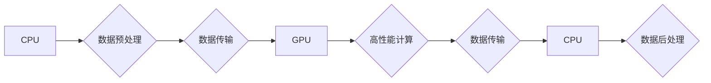

> GPU, 并行计算, CUDA, 深度学习, 高性能计算, 异构计算

## 1. 背景介绍

随着人工智能、大数据和高性能计算等领域的蓬勃发展，对计算能力的需求呈指数级增长。传统的CPU架构在处理海量数据和复杂计算任务时逐渐显露出瓶颈。为了应对这一挑战，GPU（图形处理单元）凭借其强大的并行计算能力，逐渐成为新兴计算范式的核心。

GPU最初被设计用于处理图形渲染，其架构特点是拥有大量并行处理单元（cores），能够同时执行大量简单的计算任务。这种并行计算能力使得GPU在科学计算、机器学习、图像处理等领域展现出巨大的潜力。

## 2. 核心概念与联系

**2.1 GPU架构特点**

GPU的核心架构特点是：

* **大量并行处理单元:** GPU拥有数千个甚至上万个小的处理单元，每个单元都能够独立执行简单的计算任务。
* **高带宽内存:** GPU拥有专门的内存，能够高速访问数据，支持高吞吐量的数据传输。
* **流式处理架构:** GPU采用流式处理架构，将数据分成多个流，并行处理每个流的数据。

**2.2 并行计算模型**

并行计算模型将一个大型计算任务分解成多个子任务，并将其分配到多个处理器上进行并行执行。常见的并行计算模型包括：

* **数据并行:** 将数据分成多个块，分别分配给不同的处理器进行处理。
* **任务并行:** 将计算任务分成多个子任务，分别分配给不同的处理器进行处理。
* **混合并行:** 将数据并行和任务并行结合起来，实现更灵活的并行计算。

**2.3 GPU与CPU协同工作**

GPU和CPU是两种不同的处理器，各自拥有不同的优势和特点。在实际应用中，GPU和CPU通常协同工作，发挥各自的优势。

* **CPU负责数据预处理和后处理:** CPU负责将数据加载到GPU内存中，以及从GPU内存中读取处理结果。
* **GPU负责高性能计算:** GPU负责执行大量并行计算任务，例如矩阵运算、卷积运算等。

**2.4 Mermaid 流程图**



## 3. 核心算法原理 & 具体操作步骤

**3.1 算法原理概述**

GPU加速算法的核心原理是利用GPU的并行计算能力，将传统的串行算法分解成多个并行子任务，并将其分配到GPU的多个处理单元上进行并行执行。

**3.2 算法步骤详解**

1. **数据划分:** 将输入数据划分为多个块，每个块分配给一个GPU处理单元进行处理。
2. **数据传输:** 将数据块从CPU内存传输到GPU内存中。
3. **并行计算:** 每个GPU处理单元对分配到的数据块进行计算，并生成中间结果。
4. **结果聚合:** 将各个GPU处理单元的中间结果聚合起来，得到最终结果。
5. **数据传输:** 将最终结果从GPU内存传输到CPU内存中。

**3.3 算法优缺点**

**优点:**

* **高并行度:** GPU能够同时执行大量并行计算任务，显著提高计算速度。
* **高吞吐量:** GPU拥有高带宽内存和高速数据传输机制，能够处理大量数据。
* **低延迟:** GPU的计算延迟较低，能够快速完成计算任务。

**缺点:**

* **编程复杂度:** GPU编程相对CPU编程复杂，需要掌握GPU编程模型和API。
* **内存限制:** GPU的内存容量相对CPU较小，需要合理分配内存空间。
* **开发成本:** GPU开发成本相对CPU较高，需要专门的硬件和软件支持。

**3.4 算法应用领域**

GPU加速算法广泛应用于以下领域:

* **科学计算:** 天体模拟、分子动力学、流体动力学等。
* **机器学习:** 深度学习、图像识别、自然语言处理等。
* **图形渲染:** 游戏、动画、电影特效等。
* **金融建模:** 风险管理、投资策略等。

## 4. 数学模型和公式 & 详细讲解 & 举例说明

**4.1 数学模型构建**

假设我们有一个包含N个数据点的向量x，需要将其与一个包含M个权重的向量w进行点积运算。

**4.2 公式推导过程**

点积运算的公式如下：

$$
y = x \cdot w = \sum_{i=0}^{N-1} x_i w_i
$$

其中：

* y是点积结果
* x是输入向量
* w是权重向量

**4.3 案例分析与讲解**

假设我们有一个包含100个数据点的向量x，以及一个包含10个权重的向量w。

使用CPU进行点积运算，需要执行100次乘法和加法运算。

使用GPU进行点积运算，可以将100个数据点分配到GPU的多个处理单元上进行并行计算。每个处理单元负责计算一部分数据点的点积，最终将所有处理单元的结果聚合起来得到最终结果。

由于GPU拥有大量的并行处理单元，因此可以显著缩短点积运算的时间。

## 5. 项目实践：代码实例和详细解释说明

**5.1 开发环境搭建**

* 安装CUDA Toolkit：CUDA Toolkit是NVIDIA为GPU开发提供的一套软件开发工具包。
* 安装cuDNN：cuDNN是NVIDIA为深度学习开发提供的一套库，可以加速深度学习算法的训练和推理。
* 安装Python和必要的库：例如NumPy、PyTorch等。

**5.2 源代码详细实现**

```python
import numpy as np

# 定义输入向量和权重向量
x = np.random.rand(100)
w = np.random.rand(10)

# 使用CUDA进行点积运算
def dot_product_gpu(x, w):
    # ... CUDA代码 ...

# 调用CUDA函数进行点积运算
y = dot_product_gpu(x, w)

# 打印结果
print(y)
```

**5.3 代码解读与分析**

* `dot_product_gpu`函数是使用CUDA进行点积运算的函数。
* 该函数需要使用CUDA编程模型编写，并使用cuDNN库加速计算。
* 具体实现细节取决于CUDA编程模型和cuDNN库的API。

**5.4 运行结果展示**

运行上述代码后，将输出点积运算的结果。

## 6. 实际应用场景

**6.1 深度学习**

GPU在深度学习领域发挥着至关重要的作用。深度学习模型通常包含大量的参数，需要进行大量的矩阵运算和卷积运算。GPU的并行计算能力能够显著加速深度学习模型的训练和推理过程。

**6.2 图像处理**

GPU能够快速处理图像数据，因此广泛应用于图像处理领域，例如图像识别、图像分割、图像增强等。

**6.3 科学计算**

GPU能够加速科学计算任务，例如天体模拟、分子动力学、流体动力学等。

**6.4 未来应用展望**

随着GPU技术的不断发展，其应用场景将更加广泛。例如：

* **异构计算:** 将CPU、GPU和其他类型的处理器结合起来，构建更加高效的计算系统。
* **边缘计算:** 将GPU部署到边缘设备上，实现更快速的本地计算和数据处理。
* **量子计算:** 将GPU与量子计算器结合起来，加速量子算法的开发和应用。

## 7. 工具和资源推荐

**7.1 学习资源推荐**

* CUDA官方文档：https://docs.nvidia.com/cuda/
* cuDNN官方文档：https://developer.nvidia.com/cudnn
* GPU编程教程：https://www.coursera.org/learn/gpu-programming

**7.2 开发工具推荐**

* NVIDIA Visual Profiler：用于分析GPU性能的工具。
* NVIDIA Nsight Systems：用于调试和分析GPU程序的工具。

**7.3 相关论文推荐**

* CUDA Programming Guide
* cuDNN: A GPU-Accelerated Library for Deep Learning

## 8. 总结：未来发展趋势与挑战

**8.1 研究成果总结**

GPU加速算法在各个领域取得了显著的成果，显著提高了计算效率，推动了人工智能、大数据等领域的快速发展。

**8.2 未来发展趋势**

* **异构计算:** 将GPU与其他类型的处理器结合起来，构建更加高效的计算系统。
* **边缘计算:** 将GPU部署到边缘设备上，实现更快速的本地计算和数据处理。
* **量子计算:** 将GPU与量子计算器结合起来，加速量子算法的开发和应用。

**8.3 面临的挑战**

* **编程复杂度:** GPU编程相对CPU编程复杂，需要掌握GPU编程模型和API。
* **内存限制:** GPU的内存容量相对CPU较小，需要合理分配内存空间。
* **开发成本:** GPU开发成本相对CPU较高，需要专门的硬件和软件支持。

**8.4 研究展望**

未来研究方向包括：

* 开发更加高效的GPU编程模型和工具。
* 探索GPU与其他计算模型的结合，构建更加强大的计算系统。
* 研究GPU在边缘计算、量子计算等领域的应用。

## 9. 附录：常见问题与解答

**9.1 如何选择合适的GPU？**

选择合适的GPU需要考虑以下因素：

* 计算需求：不同的计算任务对GPU性能要求不同。
* 内存容量：需要根据数据量选择合适的GPU内存容量。
* 功耗：需要考虑GPU的功耗和散热性能。

**9.2 如何优化GPU程序性能？**

优化GPU程序性能的方法包括：

* 减少数据传输：尽量减少数据从CPU到GPU和从GPU到CPU的传输。
* 提高内存利用率：合理分配内存空间，避免内存碎片。
* 优化算法：选择适合GPU的算法，并进行算法优化。


作者：禅与计算机程序设计艺术 / Zen and the Art of Computer Programming 
<end_of_turn>