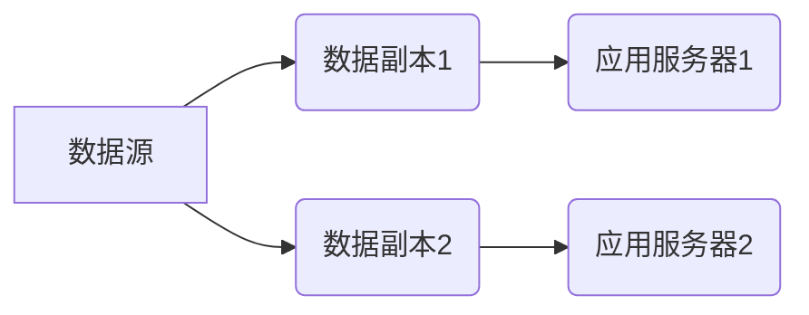
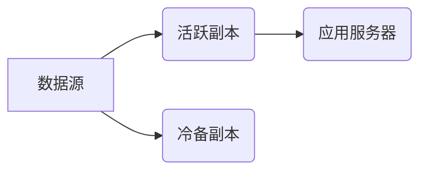

>  Hot-Hot冗余, Hot-Warm冗余, 冗余设计, 高可用性, 性能优化, 数据存储, 灾难恢复

## 1. 背景介绍

在当今以数据为中心的时代，高可用性和数据可靠性已成为企业数字化转型和业务连续性的关键保障。为了应对突发事件、硬件故障和系统负载波动，冗余设计成为确保系统稳定运行和数据安全的重要手段。

冗余设计主要分为两种类型：Hot-Hot冗余和Hot-Warm冗余。Hot-Hot冗余是指所有数据副本都处于活跃状态，随时可供访问和处理，而Hot-Warm冗余则将数据副本分为活跃副本和冷备副本，其中活跃副本用于读写操作，冷备副本则处于低功耗状态，仅在需要时进行激活。

本文将深入探讨Hot-Hot和Hot-Warm冗余的设计原理、优缺点以及适用场景，帮助读者更好地理解和选择合适的冗余策略。

## 2. 核心概念与联系

### 2.1  Hot-Hot冗余

Hot-Hot冗余，也称为“热备”，是指所有数据副本都处于活跃状态，并可随时进行读写操作。这种设计方式能够提供极高的可用性和性能，但同时也带来更高的成本和资源消耗。

**Hot-Hot冗余架构示意图:**



### 2.2  Hot-Warm冗余

Hot-Warm冗余，也称为“热冷备”，是指将数据副本分为活跃副本和冷备副本。活跃副本用于读写操作，而冷备副本则处于低功耗状态，仅在需要时进行激活。这种设计方式能够降低成本和资源消耗，但同时也牺牲了一定的可用性和性能。

**Hot-Warm冗余架构示意图:**



### 2.3  联系

Hot-Hot和Hot-Warm冗余都是为了提高系统可用性和数据可靠性而设计的。Hot-Hot冗余提供更高的可用性和性能，但成本更高；Hot-Warm冗余则降低了成本和资源消耗，但牺牲了一定的可用性和性能。选择哪种冗余策略取决于具体的应用场景和需求。

## 3. 核心算法原理 & 具体操作步骤

### 3.1  算法原理概述

Hot-Hot和Hot-Warm冗余的设计都依赖于数据复制和故障转移算法。

* **数据复制算法:** 用于将数据副本复制到多个节点，确保数据的一致性和可用性。常见的复制算法包括同步复制和异步复制。同步复制要求数据在所有节点上都一致，但性能较低；异步复制则允许数据在不同节点上存在短暂的不一致性，但性能较高。

* **故障转移算法:** 用于在节点故障时自动将数据转移到其他可用节点，确保系统持续运行。常见的故障转移算法包括主动-被动和主-从复制。主动-被动复制模式下，只有一个节点处于活动状态，其他节点处于备用状态，一旦主节点故障，备用节点会自动激活；主-从复制模式下，多个节点都处于活动状态，但只有主节点可以接受写操作，从节点则负责读操作和数据备份。

### 3.2  算法步骤详解

**Hot-Hot冗余算法步骤:**

1. 将数据复制到多个节点，每个节点都具有读写权限。
2. 应用服务器可以连接到任意节点进行读写操作。
3. 当一个节点发生故障时，其他节点会自动接管其数据和服务。

**Hot-Warm冗余算法步骤:**

1. 将数据复制到一个活跃副本和多个冷备副本。
2. 应用服务器连接到活跃副本进行读写操作。
3. 当活跃副本发生故障时，系统会自动激活一个冷备副本，并将其转换为活跃副本。

### 3.3  算法优缺点

**Hot-Hot冗余算法:**

* **优点:** 高可用性、高性能、快速故障转移。
* **缺点:** 成本高、资源消耗大。

**Hot-Warm冗余算法:**

* **优点:** 成本低、资源消耗小。
* **缺点:** 可用性较低、性能较低、故障转移时间较长。

### 3.4  算法应用领域

**Hot-Hot冗余算法:**

* 高可用性要求高的系统，例如金融交易系统、电商平台、在线游戏等。

**Hot-Warm冗余算法:**

* 可用性要求相对较低的系统，例如数据仓库、日志系统、备份系统等。

## 4. 数学模型和公式 & 详细讲解 & 举例说明

### 4.1  数学模型构建

**可用性模型:**

可用性 (A) 可以用以下公式表示:

$$A = 1 - P(F)$$

其中，P(F) 表示系统发生故障的概率。

**成本模型:**

成本 (C) 可以用以下公式表示:

$$C = C_H \times N_H + C_W \times N_W$$

其中，C_H 表示 Hot-Hot 冗余的成本，N_H 表示 Hot-Hot 冗余节点的数量；C_W 表示 Hot-Warm 冗余的成本，N_W 表示 Hot-Warm 冗余节点的数量。

### 4.2  公式推导过程

**可用性模型推导:**

假设系统由 N 个节点组成，每个节点的故障概率为 p。则系统发生故障的概率为:

$$P(F) = 1 - (1 - p)^N$$

因此，可用性为:

$$A = 1 - (1 - p)^N$$

**成本模型推导:**

成本模型的推导基于实际成本数据和节点数量。

### 4.3  案例分析与讲解

**案例:**

假设一个系统需要保证 99.99% 的可用性，并且 Hot-Hot 冗余的成本是 Hot-Warm 冗余的 2 倍。

**分析:**

根据可用性模型，我们可以计算出所需的节点数量。

根据成本模型，我们可以比较两种冗余策略的成本。

## 5. 项目实践：代码实例和详细解释说明

### 5.1  开发环境搭建

* 操作系统: Ubuntu 20.04
* 编程语言: Python 3.8
* 框架: Flask

### 5.2  源代码详细实现

```python
from flask import Flask, request, jsonify

app = Flask(__name__)

# 模拟数据存储
data = {}

@app.route('/data/<key>', methods=['GET', 'POST'])
def data_handler(key):
    if request.method == 'GET':
        return jsonify(data.get(key, None))
    elif request.method == 'POST':
        data[key] = request.json['value']
        return jsonify({'status': 'success'})

if __name__ == '__main__':
    app.run(debug=True)
```

### 5.3  代码解读与分析

* 该代码示例使用 Flask 框架构建了一个简单的 API，用于模拟数据存储和访问。
* 数据存储在内存中，模拟了数据副本的存储方式。
* GET 请求用于获取数据，POST 请求用于更新数据。

### 5.4  运行结果展示

* 启动服务后，可以通过浏览器访问 http://localhost:5000/data/key 来获取或更新数据。

## 6. 实际应用场景

### 6.1  数据库系统

* Hot-Hot冗余：用于高可用性数据库系统，例如金融交易系统、电商平台等。
* Hot-Warm冗余：用于数据仓库、日志系统等，可根据需求选择不同的冗余级别。

### 6.2  云计算平台

* Hot-Hot冗余：用于云计算平台的存储服务，确保数据的高可用性和可靠性。
* Hot-Warm冗余：用于云计算平台的备份和归档服务，降低成本和资源消耗。

### 6.3  物联网系统

* Hot-Hot冗余：用于物联网设备的实时数据采集和处理，确保数据传输的可靠性和及时性。
* Hot-Warm冗余：用于物联网设备的日志记录和数据分析，降低存储成本和资源消耗。

### 6.4  未来应用展望

随着云计算、大数据和人工智能等技术的快速发展，Hot-Hot和Hot-Warm冗余技术将得到更广泛的应用。未来，我们将看到更多创新性的冗余设计方案，以满足更加复杂和苛刻的应用需求。

## 7. 工具和资源推荐

### 7.1  学习资源推荐

* **书籍:**
    * 《分布式系统的设计与实现》
    * 《高可用性系统设计》
* **在线课程:**
    * Coursera: Distributed Systems
    * Udemy: High Availability Systems

### 7.2  开发工具推荐

* **数据库:** MySQL, PostgreSQL, MongoDB
* **云平台:** AWS, Azure, Google Cloud
* **容器化平台:** Docker, Kubernetes

### 7.3  相关论文推荐

* **Hot-Hot冗余:**
    * Paxos Made Live: An Engineering Perspective
    * Raft: In Search of an Understandable Consensus Algorithm
* **Hot-Warm冗余:**
    * The Case for Warm Standby
    * A Survey of Data Replication Techniques

## 8. 总结：未来发展趋势与挑战

### 8.1  研究成果总结

Hot-Hot和Hot-Warm冗余技术已经取得了显著的成果，为高可用性和数据可靠性提供了有效的保障。

### 8.2  未来发展趋势

* **自动化:** 冗余系统管理将更加自动化，减少人工干预。
* **智能化:** 冗余系统将更加智能化，能够根据实际情况动态调整冗余策略。
* **边缘计算:** 冗余技术将扩展到边缘计算场景，提高边缘计算系统的可靠性和可用性。

### 8.3  面临的挑战

* **成本:** Hot-Hot冗余的成本较高，需要寻找更经济的解决方案。
* **复杂性:** 冗余系统的设计和管理越来越复杂，需要更强大的工具和技术支持。
* **安全:** 冗余系统需要考虑安全问题，防止数据泄露和攻击。

### 8.4  研究展望

未来，我们将继续研究和探索新的冗余设计方案，以满足更加复杂和苛刻的应用需求。

## 9. 附录：常见问题与解答

### 9.1  常见问题

* Hot-Hot冗余和Hot-Warm冗余哪个更好？
* 如何选择合适的冗余策略？
* 如何评估冗余系统的性能和可靠性？

### 9.2  解答

* Hot-Hot冗余和Hot-Warm冗余各有优缺点，选择哪种策略取决于具体的应用场景和需求。
* 选择冗余策略时需要考虑可用性、性能、成本、复杂度等因素。
* 可以通过测试和监控来评估冗余系统的性能和可靠性。


作者：禅与计算机程序设计艺术 / Zen and the Art of Computer Programming 
<end_of_turn>