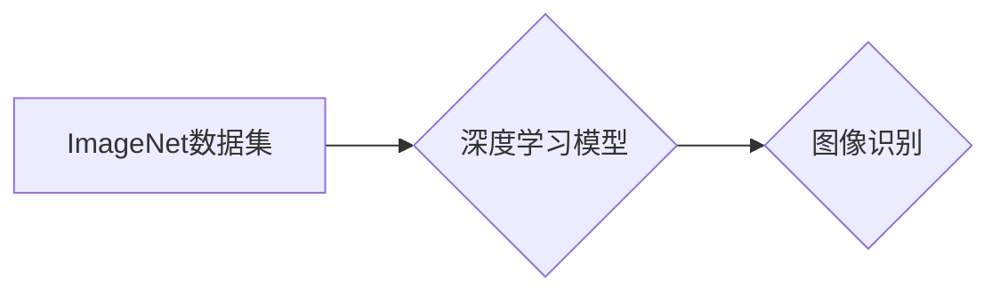

> ImageNet, 图像识别, 深度学习, 卷积神经网络, 计算机视觉, 大规模数据集, 算法创新

## 1. 背景介绍

图像识别作为计算机视觉领域的核心技术，在过去几十年中取得了显著进展。从早期基于规则和特征工程的方法，到如今深度学习的兴起，图像识别技术的演进经历了多个阶段。其中，ImageNet数据集和相关的挑战赛对深度学习在图像识别领域的应用起到了至关重要的推动作用。

ImageNet是一个由斯坦福大学和麻省理工学院共同创建的大规模图像识别数据集，包含超过1400万张图像，涵盖超过2万个类别。该数据集的规模和多样性为深度学习模型的训练提供了充足的数据支持，促进了深度学习算法的快速发展。

2010年，ImageNet首次举办了图像识别挑战赛（ImageNet Large Scale Visual Recognition Challenge，ILSVRC），吸引了来自世界各地的研究人员和工程师参与。该挑战赛的举办，不仅促进了图像识别算法的创新，也加速了深度学习技术的普及。

## 2. 核心概念与联系

### 2.1  深度学习

深度学习是一种机器学习的子领域，它利用多层神经网络来模拟人类大脑的学习过程。深度学习模型能够从海量数据中自动学习特征，并进行复杂的模式识别和预测。

### 2.2  卷积神经网络

卷积神经网络（Convolutional Neural Network，CNN）是一种专门用于处理图像数据的深度学习模型。CNN利用卷积操作和池化操作来提取图像特征，并通过全连接层进行分类或识别。

### 2.3  ImageNet数据集

ImageNet是一个包含大量图像和标签的大规模图像识别数据集。该数据集的规模和多样性为深度学习模型的训练提供了充足的数据支持。

**ImageNet与深度学习的关系**

ImageNet数据集为深度学习模型的训练提供了充足的数据支持，而深度学习模型，特别是卷积神经网络，能够有效地利用ImageNet中的图像特征进行图像识别。

**Mermaid 流程图**

## 3. 核心算法原理 & 具体操作步骤

### 3.1  算法原理概述

卷积神经网络（CNN）是一种专门用于处理图像数据的深度学习模型。CNN利用卷积操作和池化操作来提取图像特征，并通过全连接层进行分类或识别。

**卷积操作**

卷积操作是一种数学运算，它将一个滤波器（也称为卷积核）滑动在图像上，并计算滤波器与图像像素之间的乘积和。卷积操作能够提取图像中的局部特征，例如边缘、纹理和形状。

**池化操作**

池化操作是一种用于减少图像尺寸和特征数量的操作。常见的池化操作包括最大池化和平均池化。池化操作能够提高模型的鲁棒性，并减少计算量。

**全连接层**

全连接层将提取的特征进行分类或识别。全连接层中的每个神经元都与上一层的每个神经元连接。

### 3.2  算法步骤详解

1. **输入图像预处理:** 将输入图像调整到合适的尺寸，并进行归一化处理。

2. **卷积层:** 使用多个卷积核对图像进行卷积操作，提取图像特征。

3. **池化层:** 对卷积层的输出进行池化操作，减少特征数量和图像尺寸。

4. **重复步骤2和3:** 叠加多个卷积和池化层，提取更高级的特征。

5. **全连接层:** 将提取的特征输入到全连接层，进行分类或识别。

6. **输出结果:** 输出分类结果或识别结果。

### 3.3  算法优缺点

**优点:**

* 能够自动学习图像特征，无需人工特征工程。
* 能够处理高分辨率图像，并提取复杂特征。
* 在图像识别任务中取得了优异的性能。

**缺点:**

* 训练过程需要大量数据和计算资源。
* 模型结构设计较为复杂，需要专业知识。
* 对数据噪声和异常值较为敏感。

### 3.4  算法应用领域

* **图像分类:** 将图像分类到预定义的类别中。
* **目标检测:** 在图像中检测和识别目标物体。
* **图像分割:** 将图像分割成不同的区域。
* **图像生成:** 生成新的图像。
* **视频分析:** 分析视频内容，例如动作识别和事件检测。

## 4. 数学模型和公式 & 详细讲解 & 举例说明

### 4.1  数学模型构建

卷积神经网络的数学模型可以表示为一个多层神经网络，其中每一层都包含卷积层、池化层和全连接层。

**卷积层:**

卷积层的输出可以表示为：

$$
y_{i,j} = \sum_{m=0}^{M-1} \sum_{n=0}^{N-1} x_{i+m,j+n} * w_{m,n} + b
$$

其中：

* $y_{i,j}$ 是卷积层输出的第 $i$ 行第 $j$ 列元素。
* $x_{i+m,j+n}$ 是输入图像的第 $i+m$ 行第 $j+n$ 列元素。
* $w_{m,n}$ 是卷积核的第 $m$ 行第 $n$ 列元素。
* $b$ 是卷积层的偏置项。

**池化层:**

池化层的输出可以表示为：

$$
y_{i,j} = \max_{m=0}^{M-1} \max_{n=0}^{N-1} x_{i+m,j+n}
$$

其中：

* $y_{i,j}$ 是池化层输出的第 $i$ 行第 $j$ 列元素。
* $x_{i+m,j+n}$ 是池化层的输入元素。

**全连接层:**

全连接层的输出可以表示为：

$$
y_i = \sum_{j=0}^{J-1} x_j * w_{ij} + b_i
$$

其中：

* $y_i$ 是全连接层的第 $i$ 个输出元素。
* $x_j$ 是上一层的第 $j$ 个输入元素。
* $w_{ij}$ 是全连接层的第 $i$ 行第 $j$ 列权重。
* $b_i$ 是全连接层的第 $i$ 个偏置项。

### 4.2  公式推导过程

卷积神经网络的数学模型推导过程较为复杂，涉及到线性代数、微积分和概率论等多个数学分支。

### 4.3  案例分析与讲解

可以结合具体的卷积神经网络模型，例如AlexNet、VGGNet、ResNet等，进行案例分析和讲解。

## 5. 项目实践：代码实例和详细解释说明

### 5.1  开发环境搭建

使用Python语言和深度学习框架TensorFlow或PyTorch搭建开发环境。

### 5.2  源代码详细实现

使用TensorFlow或PyTorch框架实现一个简单的卷积神经网络模型，用于图像分类任务。

### 5.3  代码解读与分析

对代码进行详细解读和分析，解释每个代码块的功能和作用。

### 5.4  运行结果展示

使用训练好的模型对测试图像进行分类，并展示分类结果。

## 6. 实际应用场景

### 6.1  医疗图像分析

* **病灶检测:** 在医学影像中检测肿瘤、骨折等病灶。
* **疾病诊断:** 根据图像特征辅助医生诊断疾病。

### 6.2  自动驾驶

* **目标识别:** 识别道路上的车辆、行人、交通信号灯等目标。
* **场景理解:** 理解道路环境，例如道路类型、交通流量等。

### 6.3  安防监控

* **人脸识别:** 在监控视频中识别特定的人脸。
* **异常行为检测:** 检测异常行为，例如入侵、暴动等。

### 6.4  未来应用展望

* **更精准的图像识别:** 随着深度学习技术的不断发展，图像识别技术将更加精准和可靠。
* **更广泛的应用场景:** 图像识别技术将应用于更多领域，例如教育、娱乐、金融等。

## 7. 工具和资源推荐

### 7.1  学习资源推荐

* **书籍:**
    * 《深度学习》
    * 《计算机视觉：算法与应用》
* **在线课程:**
    * Coursera上的深度学习课程
    * Udacity上的计算机视觉课程

### 7.2  开发工具推荐

* **深度学习框架:** TensorFlow、PyTorch
* **图像处理库:** OpenCV、Pillow

### 7.3  相关论文推荐

* **ImageNet Classification with Deep Convolutional Neural Networks**
* **Deep Residual Learning for Image Recognition**

## 8. 总结：未来发展趋势与挑战

### 8.1  研究成果总结

ImageNet数据集和相关的挑战赛促进了深度学习在图像识别领域的应用，取得了显著成果。

### 8.2  未来发展趋势

* **模型更深更广:** 探索更深层次和更广阔的网络结构，提高模型的表达能力和泛化能力。
* **数据更丰富更多样:** 收集和构建更丰富、更多样化的图像数据集，提高模型的鲁棒性和适应性。
* **算法更智能更高效:** 研究更智能、更有效的算法，提高模型的训练效率和推理速度。

### 8.3  面临的挑战

* **数据标注问题:** 大规模图像数据集的标注工作非常耗时和费力。
* **计算资源限制:** 训练大型深度学习模型需要大量的计算资源。
* **模型可解释性问题:** 深度学习模型的决策过程难以解释，这限制了其在一些安全关键领域的应用。

### 8.4  研究展望

未来，图像识别技术将继续朝着更智能、更可靠、更普适的方向发展，并将应用于更多领域，为人类社会带来更多便利和福祉。

## 9. 附录：常见问题与解答

* **什么是ImageNet数据集？**

ImageNet是一个包含大量图像和标签的大规模图像识别数据集。

* **ImageNet数据集对深度学习有什么影响？**

ImageNet数据集为深度学习模型的训练提供了充足的数据支持，促进了深度学习算法的快速发展。

* **如何使用ImageNet数据集进行图像识别？**

可以使用深度学习框架TensorFlow或PyTorch，结合卷积神经网络模型，对ImageNet数据集进行训练和测试。

作者：禅与计算机程序设计艺术 / Zen and the Art of Computer Programming 
<end_of_turn>