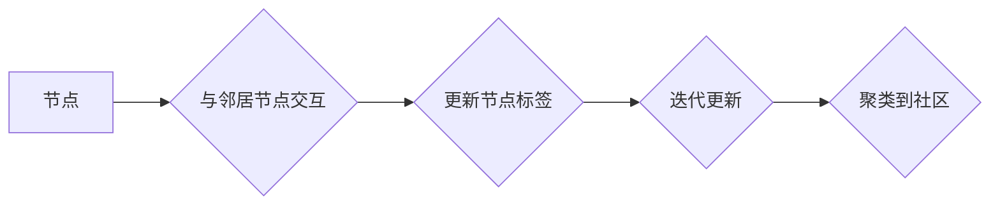

> 标签传播算法，社区发现，图算法，机器学习，网络分析

## 1. 背景介绍

在当今数据爆炸的时代，网络和社交平台的蓬勃发展使得大量结构化数据涌现。如何有效地挖掘这些数据中的隐藏结构和模式，成为了一个重要的研究课题。其中，社区发现作为一种重要的网络分析任务，旨在将网络节点按照相似性或关联性进行分组，从而揭示网络中的潜在社区结构。

标签传播算法作为一种简单高效的社区发现算法，近年来得到了广泛的应用。它基于节点标签的传播机制，通过迭代更新节点标签，最终将网络节点聚类到不同的社区中。由于其易于理解、实现和扩展的特点，标签传播算法在社交网络分析、推荐系统、信息传播模型等领域展现出巨大的应用潜力。

## 2. 核心概念与联系

### 2.1  网络图模型

在标签传播算法中，网络通常被表示为一个无向图模型，其中节点代表网络中的实体（例如用户、网页、文件等），边代表实体之间的关系（例如社交关系、引用关系、相似度等）。

### 2.2  标签传播机制

标签传播算法的核心思想是通过迭代更新节点标签，最终将网络节点聚类到不同的社区中。每个节点最初被赋予一个随机标签，然后通过与邻居节点的交互，节点的标签会逐渐传播和更新。

### 2.3  社区结构

社区结构是指网络中存在着一些紧密连接的子集，这些子集中的节点之间相互连接的概率比与其他子集节点的连接概率高。标签传播算法的目标是将网络节点聚类到不同的社区中，从而揭示网络中的社区结构。

**Mermaid 流程图**



## 3. 核心算法原理 & 具体操作步骤

### 3.1  算法原理概述

标签传播算法的基本原理是基于节点标签的传播机制。每个节点最初被赋予一个随机标签，然后通过与邻居节点的交互，节点的标签会逐渐传播和更新。

算法的迭代过程可以概括为以下步骤：

1.  **初始化：** 为每个节点赋予一个随机标签。
2.  **传播：** 每个节点根据邻居节点的标签进行投票，选择最常见的标签作为自己的新标签。
3.  **更新：** 将所有节点的标签更新完成。
4.  **迭代：** 重复步骤2和3，直到标签不再发生变化，或者达到预设的迭代次数。

### 3.2  算法步骤详解

1.  **初始化：** 对于一个包含N个节点的网络图，每个节点都随机分配一个标签，标签的范围通常为1到K，其中K是预设的社区数量。

2.  **传播：** 对于每个节点i，计算其邻居节点的标签频率，选择出现频率最高的标签作为节点i的新标签。

3.  **更新：** 将所有节点的标签更新完成。

4.  **迭代：** 重复步骤2和3，直到标签不再发生变化，或者达到预设的迭代次数。

### 3.3  算法优缺点

**优点：**

*   简单易懂，实现简单。
*   计算效率高，适合处理大型网络。
*   易于扩展，可以结合其他算法进行改进。

**缺点：**

*   对初始标签的设置敏感，不同的初始标签可能导致不同的社区结构。
*   难以处理动态变化的网络。
*   对社区结构的假设有一定的局限性。

### 3.4  算法应用领域

标签传播算法在以下领域得到了广泛的应用：

*   **社交网络分析：** 发现社交网络中的社区结构，例如兴趣小组、好友圈等。
*   **推荐系统：** 基于用户标签的相似性进行推荐，例如商品推荐、电影推荐等。
*   **信息传播模型：** 模拟信息在网络中的传播过程，例如谣言传播、病毒传播等。
*   **生物信息学：** 分析基因网络、蛋白质相互作用网络等。

## 4. 数学模型和公式 & 详细讲解 & 举例说明

### 4.1  数学模型构建

标签传播算法可以被建模为一个马尔可夫链，其中每个状态代表一个节点的标签。

设网络图包含N个节点，K个社区，每个节点i的标签为$l_i$，$l_i \in \{1, 2, ..., K\}$。

### 4.2  公式推导过程

标签传播算法的迭代更新过程可以用以下公式表示：

$$
l_i^{(t+1)} = argmax_{k \in \{1, 2, ..., K\}} \sum_{j \in N(i)} \delta(l_j^{(t)}, k)
$$

其中：

*   $l_i^{(t)}$ 表示节点i在第t次迭代的标签。
*   $N(i)$ 表示节点i的邻居节点集合。
*   $\delta(x, y)$ 是一个指示函数，当x等于y时取值为1，否则取值为0。

### 4.3  案例分析与讲解

假设一个网络图包含3个节点，每个节点初始标签为随机分配的1、2、3。

节点1的邻居节点为节点2和节点3，节点2的邻居节点为节点1和节点3，节点3的邻居节点为节点1和节点2。

根据公式，节点1在第一次迭代的标签更新过程如下：

*   节点1的邻居节点标签为2和3，标签频率为1/2。
*   节点1的新标签为2。

以此类推，可以计算出所有节点在每次迭代的标签更新过程，最终得到网络图的社区结构。

## 5. 项目实践：代码实例和详细解释说明

### 5.1  开发环境搭建

本项目使用Python语言进行开发，需要安装以下库：

*   NetworkX：用于构建和操作网络图。
*   matplotlib：用于可视化网络图。

### 5.2  源代码详细实现

```python
import networkx as nx
import matplotlib.pyplot as plt

# 创建网络图
G = nx.Graph()
G.add_edges_from([(1, 2), (1, 3), (2, 1), (2, 3), (3, 1), (3, 2)])

# 初始化标签
labels = [random.randint(1, 2) for _ in range(len(G.nodes))]

# 标签传播算法
def label_propagation(G, labels, iterations=100):
    for _ in range(iterations):
        new_labels = []
        for node in G.nodes:
            neighbors = G.neighbors(node)
            neighbor_labels = [labels[j] for j in neighbors]
            most_common_label = max(set(neighbor_labels), key=neighbor_labels.count)
            new_labels.append(most_common_label)
        labels = new_labels
    return labels

# 执行标签传播算法
labels = label_propagation(G, labels)

# 可视化网络图
nx.draw(G, with_labels=True, node_color=[labels[i] for i in range(len(G.nodes))])
plt.show()
```

### 5.3  代码解读与分析

*   代码首先创建了一个网络图，并为每个节点分配了一个随机标签。
*   然后，调用`label_propagation`函数执行标签传播算法，迭代更新节点标签。
*   最后，使用`matplotlib`库可视化网络图，节点颜色代表其所属的社区。

### 5.4  运行结果展示

运行代码后，会生成一个网络图的可视化结果，其中节点颜色代表其所属的社区。

## 6. 实际应用场景

### 6.1  社交网络分析

标签传播算法可以用于发现社交网络中的社区结构，例如兴趣小组、好友圈等。

### 6.2  推荐系统

标签传播算法可以用于基于用户标签的相似性进行推荐，例如商品推荐、电影推荐等。

### 6.3  信息传播模型

标签传播算法可以用于模拟信息在网络中的传播过程，例如谣言传播、病毒传播等。

### 6.4  未来应用展望

随着数据量的不断增长和网络结构的复杂化，标签传播算法在未来将有更广泛的应用前景。例如，可以结合其他算法进行改进，提高算法的精度和效率；可以应用于动态变化的网络，例如社交网络、舆情监测等。

## 7. 工具和资源推荐

### 7.1  学习资源推荐

*   **书籍：**
    *   《社群发现算法》
    *   《网络分析》
*   **在线课程：**
    *   Coursera：网络分析
    *   edX：社交网络分析

### 7.2  开发工具推荐

*   **NetworkX：** Python网络分析库
*   **Gephi：** 网络可视化工具
*   **igraph：** R语言网络分析库

### 7.3  相关论文推荐

*   **Label Propagation Algorithm for Community Detection**
*   **Community Detection in Social Networks: A Survey**

## 8. 总结：未来发展趋势与挑战

### 8.1  研究成果总结

标签传播算法是一种简单高效的社区发现算法，在社交网络分析、推荐系统等领域得到了广泛的应用。

### 8.2  未来发展趋势

未来，标签传播算法将朝着以下方向发展：

*   **提高算法精度和效率：** 通过结合其他算法进行改进，例如基于图结构的算法、基于机器学习的算法等。
*   **处理动态变化的网络：** 开发能够适应动态变化的网络结构的标签传播算法。
*   **扩展应用场景：** 将标签传播算法应用于更多领域，例如生物信息学、金融分析等。

### 8.3  面临的挑战

标签传播算法也面临一些挑战：

*   对初始标签的设置敏感，不同的初始标签可能导致不同的社区结构。
*   难以处理动态变化的网络。
*   对社区结构的假设有一定的局限性。

### 8.4  研究展望

未来，研究者将继续探索标签传播算法的改进方法，使其能够更好地应对复杂网络的挑战，并将其应用于更多领域。

## 9. 附录：常见问题与解答

### 9.1  如何设置初始标签？

初始标签的设置对算法结果有很大影响。常用的方法包括：

*   随机分配标签。
*   基于节点特征进行标签分配。
*   使用其他社区发现算法的结果作为初始标签。

### 9.2  如何选择迭代次数？

迭代次数的选择需要根据实际情况进行调整。一般来说，迭代次数过少会导致算法收敛不充分，迭代次数过多会导致计算时间过长。

### 9.3  如何评估算法效果？

常用的评估指标包括：

*   **模块度：** 衡量社区结构的紧密程度。
*   **覆盖率：** 衡量算法发现的社区与真实社区的重叠程度。
*   **纯度：** 衡量社区内节点的相似性。

作者：禅与计算机程序设计艺术 / Zen and the Art of Computer Programming


<end_of_turn>