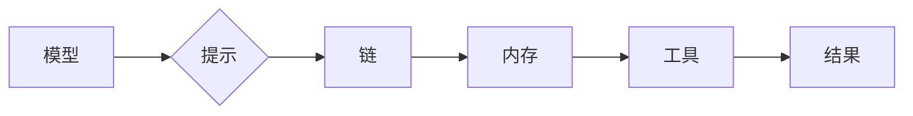

> LangChain, 语言模型, 应用开发, 框架, 聊天机器人, 数据处理, 知识图谱

## 1. 背景介绍

近年来，大型语言模型（LLM）的快速发展，如GPT-3、LaMDA等，为自然语言处理（NLP）领域带来了革命性的变革。这些模型展现出强大的文本生成、理解和翻译能力，为各种应用场景提供了无限可能。然而，直接使用LLM往往需要复杂的代码编写和数据处理，难以满足实际应用的需求。

为了解决这一问题，LangChain 应运而生。LangChain 是一款开源的框架，旨在简化LLM的应用开发，帮助开发者更轻松地构建基于LLM的应用程序。它提供了一套丰富的工具和模块，涵盖了从数据处理到模型调用、结果处理等各个环节，为开发者提供了完整的开发流程和解决方案。

## 2. 核心概念与联系

LangChain 的核心概念围绕着“链式调用”展开。它将不同的组件（模块）连接起来，形成一个完整的应用流程。这些组件包括：

* **模型（Model）：** 核心组件，负责执行实际的文本处理任务，例如生成文本、翻译语言、回答问题等。LangChain 支持多种主流LLM，例如OpenAI的GPT系列、HuggingFace的Transformers等。
* **提示（Prompt）：** 用于引导模型执行特定任务的文本输入。LangChain 提供了丰富的提示模板和生成工具，帮助开发者设计更有效的提示。
* **链（Chain）：** 将多个组件连接在一起，形成一个完整的应用流程。LangChain 提供了多种预定义的链类型，例如问答链、文本生成链、对话链等，开发者可以根据需求进行定制化配置。
* **内存（Memory）：** 用于存储和管理对话历史信息，帮助模型理解上下文并提供更精准的回复。LangChain 支持多种内存类型，例如文本内存、向量内存等。
* **工具（Tool）：** 用于扩展模型功能的外部工具，例如搜索引擎、数据库、API等。LangChain 提供了工具接口，方便开发者集成各种工具。

**LangChain 架构流程图:**



## 3. 核心算法原理 & 具体操作步骤

### 3.1  算法原理概述

LangChain 的核心算法原理是基于“链式调用”和“提示工程”的思想。

* **链式调用:** 将不同的组件连接起来，形成一个完整的应用流程，每个组件负责特定的任务，通过数据传递和状态更新实现协同工作。
* **提示工程:** 通过精心设计和优化提示文本，引导模型执行特定的任务，提高模型的准确性和效率。

### 3.2  算法步骤详解

1. **定义应用场景:** 首先明确应用场景，例如问答、文本生成、对话等。
2. **选择模型:** 根据应用场景选择合适的LLM模型。
3. **设计提示:** 设计有效的提示文本，引导模型执行特定任务。
4. **构建链:** 将模型、提示、内存和工具等组件连接起来，构建完整的应用流程。
5. **测试和优化:** 测试应用效果，根据实际情况优化提示、链结构和模型参数。

### 3.3  算法优缺点

**优点:**

* 简化应用开发流程，降低开发门槛。
* 提供丰富的组件和工具，满足多样化应用需求。
* 支持多种LLM模型，灵活选择。
* 易于定制和扩展，满足个性化需求。

**缺点:**

* 对模型选择和提示设计要求较高，需要一定的经验和技巧。
* 对于复杂应用场景，链结构可能变得复杂，需要进行仔细设计和优化。

### 3.4  算法应用领域

LangChain 的应用领域非常广泛，包括：

* **聊天机器人:** 开发智能聊天机器人，提供更自然、更人性化的对话体验。
* **文本生成:** 自动生成各种文本内容，例如文章、故事、代码等。
* **问答系统:** 开发问答系统，快速准确地回答用户问题。
* **数据分析:** 利用LLM的文本理解能力，对文本数据进行分析和挖掘。
* **教育培训:** 开发个性化学习平台，提供智能化的学习辅导和评估。

## 4. 数学模型和公式 & 详细讲解 & 举例说明

LangChain 的核心算法并非基于特定的数学模型，而是基于深度学习模型的训练和推理过程。LLM 模型的训练过程通常使用最大似然估计（MLE）或交叉熵损失函数（Cross-Entropy Loss）来优化模型参数。

**4.1  数学模型构建**

LLM 模型通常采用 Transformer 架构，其核心是自注意力机制（Self-Attention）。自注意力机制允许模型在处理文本序列时，关注不同位置的词语之间的关系，从而更好地理解上下文信息。

**4.2  公式推导过程**

自注意力机制的计算过程涉及到以下公式：

* **Scaled Dot-Product Attention:**

$$
Attention(Q, K, V) = \frac{exp(\frac{QK^T}{\sqrt{d_k}})}{softmax(QK^T/\sqrt{d_k})}V
$$

其中：

* $Q$：查询矩阵
* $K$：键矩阵
* $V$：值矩阵
* $d_k$：键向量的维度

**4.3  案例分析与讲解**

例如，在问答任务中，模型会将问题和上下文文本作为输入，通过自注意力机制计算每个词语之间的关系，从而找到与问题最相关的答案。

## 5. 项目实践：代码实例和详细解释说明

### 5.1  开发环境搭建

1. 安装 Python 3.7 或更高版本。
2. 安装 LangChain 库：`pip install langchain`
3. 安装其他依赖库，例如 OpenAI 库：`pip install openai`

### 5.2  源代码详细实现

```python
from langchain.llms import OpenAI
from langchain.chains import ConversationChain
from langchain.memory import ConversationBufferMemory

# 初始化 OpenAI 模型
llm = OpenAI(temperature=0.7)

# 初始化对话内存
memory = ConversationBufferMemory()

# 创建对话链
conversation = ConversationChain(
    llm=llm,
    memory=memory,
    prompt=f"你好，我是你的聊天机器人。请问有什么可以帮到您？"
)

# 与模型进行对话
while True:
    user_input = input("您:")
    response = conversation.run(user_input)
    print("机器人:", response)
```

### 5.3  代码解读与分析

* 首先，我们初始化 OpenAI 模型和对话内存。
* 然后，我们创建对话链，将模型、内存和提示文本连接起来。
* 最后，我们进入循环，不断接收用户输入，并通过对话链与模型进行交互，获取模型的回复。

### 5.4  运行结果展示

```
您: 你好
机器人: 你好，我是你的聊天机器人。请问有什么可以帮到您？
您: 你叫什么名字？
机器人: 我没有名字，你可以叫我聊天机器人。
您: 你能写诗吗？
机器人: 当然可以，你想写什么类型的诗？
```

## 6. 实际应用场景

### 6.1  聊天机器人

LangChain 可以用于构建各种类型的聊天机器人，例如客服机器人、陪伴机器人、游戏机器人等。

### 6.2  文本生成

LangChain 可以用于自动生成各种文本内容，例如文章、故事、代码、邮件等。

### 6.3  问答系统

LangChain 可以用于构建问答系统，快速准确地回答用户问题。

### 6.4  未来应用展望

LangChain 的应用场景还在不断扩展，未来可能会应用于更多领域，例如教育、医疗、法律等。

## 7. 工具和资源推荐

### 7.1  学习资源推荐

* LangChain 官方文档：https://python.langchain.com/en/latest/
* LangChain GitHub 仓库：https://github.com/langchain-org/langchain

### 7.2  开发工具推荐

* VS Code：https://code.visualstudio.com/
* PyCharm：https://www.jetbrains.com/pycharm/

### 7.3  相关论文推荐

* Attention Is All You Need：https://arxiv.org/abs/1706.03762

## 8. 总结：未来发展趋势与挑战

### 8.1  研究成果总结

LangChain 作为一款开源的LLM应用框架，为开发者提供了便捷的工具和资源，加速了LLM应用的普及和发展。

### 8.2  未来发展趋势

未来，LangChain 将会继续朝着以下方向发展：

* 更丰富的组件和工具，支持更多类型的应用场景。
* 更强大的模型支持，支持更先进的LLM模型。
* 更易于使用的界面和API，降低开发门槛。

### 8.3  面临的挑战

LangChain 也面临着一些挑战，例如：

* 模型性能的提升，需要不断探索新的模型架构和训练方法。
* 数据安全和隐私保护，需要开发更安全的模型和数据处理机制。
* 伦理问题，需要制定相应的规范和标准，确保LLM应用的负责任发展。

### 8.4  研究展望

未来，我们将继续致力于LangChain的开发和完善，推动LLM技术在更多领域得到应用，为人类社会带来更多价值。

## 9. 附录：常见问题与解答

**Q1: 如何选择合适的LLM模型？**

**A1:** 选择合适的LLM模型取决于具体的应用场景和需求。例如，对于文本生成任务，可以选择GPT-3系列模型；对于问答任务，可以选择BERT系列模型。

**Q2: 如何设计有效的提示文本？**

**A2:** 设计有效的提示文本需要考虑以下几个方面：

* 清晰明确：提示文本应该清晰地表达用户的意图。
* 具体详细：提示文本应该提供足够的上下文信息，帮助模型理解任务。
* 适当引导：提示文本可以引导模型生成特定类型的回复。

**Q3: 如何解决模型生成的回复不准确的问题？**

**A3:** 

* 优化提示文本
* 选择更合适的LLM模型
* 使用数据增强技术提高模型训练数据质量
* 使用模型评估指标进行模型性能评估和优化

作者：禅与计算机程序设计艺术 / Zen and the Art of Computer Programming


<end_of_turn>