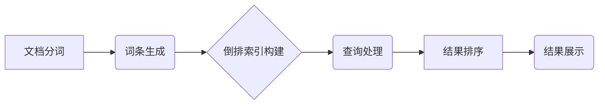

Lucene, 搜索引擎, 索引, 倒排索引, TF-IDF, 算法, 代码实例, Java

## 1. 背景介绍

在当今信息爆炸的时代，高效、精准的搜索引擎已成为人们获取信息的重要工具。Lucene作为一款开源、高性能的全文搜索引擎库，在企业级搜索、电商平台、知识管理系统等领域得到了广泛应用。本文将深入探讨Lucene的原理、核心算法以及代码实例，帮助读者理解其工作机制并掌握其应用技巧。

## 2. 核心概念与联系

Lucene的核心思想是将文本数据转换为索引，并通过高效的算法进行匹配查询。其核心概念包括：

* **文档：** 待搜索的文本数据单元，例如网页、文章、文档等。
* **字段：** 文档中的特定部分，例如标题、正文、摘要等。
* **词条：** 文档中出现的单词或短语，经过分词处理后形成的最小单位。
* **倒排索引：** 将词条与包含该词条的文档建立映射关系的索引结构，实现快速查找文档。
* **权重：** 衡量词条在文档中的重要性的数值，例如TF-IDF权重。

Lucene的架构可以概括为以下步骤：



## 3. 核心算法原理 & 具体操作步骤

### 3.1  算法原理概述

Lucene的核心算法包括：

* **分词算法：** 将文本分割成独立的词条，例如Porter Stemmer、Snowball Stemmer等。
* **倒排索引算法：** 将词条与包含该词条的文档建立映射关系，实现快速查找文档。
* **权重计算算法：** 衡量词条在文档中的重要性，例如TF-IDF算法。
* **查询匹配算法：** 根据用户查询，匹配相关文档，并根据权重进行排序。

### 3.2  算法步骤详解

1. **文档分词：** 将文档中的文本分割成独立的词条，例如“计算机程序设计”会被分割成“计算机”、“程序”、“设计”。
2. **词条生成：** 将分词后的词条进行标准化处理，例如去除停用词、转换为小写等。
3. **倒排索引构建：** 将每个词条与包含该词条的文档建立映射关系，形成倒排索引。
4. **权重计算：** 计算每个词条在文档中的重要性，例如使用TF-IDF算法。
5. **查询处理：** 根据用户查询，从倒排索引中查找包含相关词条的文档。
6. **结果排序：** 根据文档的权重和查询相关性，对匹配结果进行排序。
7. **结果展示：** 将排序后的结果展示给用户。

### 3.3  算法优缺点

**优点：**

* 高效：倒排索引结构实现快速查找文档。
* 可扩展：支持分片索引和分布式搜索。
* 可定制：支持自定义分词器、权重计算算法等。

**缺点：**

* 复杂：Lucene的架构和算法相对复杂。
* 资源消耗：构建和维护索引需要消耗一定的资源。

### 3.4  算法应用领域

Lucene的应用领域广泛，包括：

* 搜索引擎：构建企业级搜索引擎、电商平台搜索等。
* 文档管理系统：实现文档全文检索和管理。
* 知识管理系统：构建知识库和进行知识检索。
* 数据分析：进行文本数据分析和挖掘。

## 4. 数学模型和公式 & 详细讲解 & 举例说明

### 4.1  数学模型构建

Lucene的核心算法中，TF-IDF算法是衡量词条重要性的重要指标。TF-IDF模型基于以下假设：

* 词条在文档中出现的频率越高，其重要性越高。
* 词条在整个语料库中出现的频率越低，其重要性越高。

### 4.2  公式推导过程

TF-IDF算法的公式如下：

$$
TF-IDF(t, d) = TF(t, d) \times IDF(t)
$$

其中：

* $TF(t, d)$ 表示词条 $t$ 在文档 $d$ 中的词频，即词条 $t$ 在文档 $d$ 中出现的次数。
* $IDF(t)$ 表示词条 $t$ 在整个语料库中的逆向文档频率，即词条 $t$ 在语料库中所有文档中出现的文档数量的倒数。

$$
TF(t, d) = \frac{f(t, d)}{\sum_{t' \in d} f(t', d)}
$$

$$
IDF(t) = \log \frac{N}{df(t)}
$$

其中：

* $N$ 表示语料库中所有文档的数量。
* $df(t)$ 表示词条 $t$ 在语料库中所有文档中出现的文档数量。

### 4.3  案例分析与讲解

假设我们有一个语料库包含1000个文档，其中“计算机”这个词条在500个文档中出现。那么，$IDF(计算机) = \log \frac{1000}{500} = \log 2 \approx 0.301$。

如果一个文档包含10个词条，其中“计算机”出现了2次，那么，$TF(计算机, 文档) = \frac{2}{10} = 0.2$。

因此，该文档中“计算机”的TF-IDF值是：

$$
TF-IDF(计算机, 文档) = 0.2 \times 0.301 \approx 0.0602
$$

## 5. 项目实践：代码实例和详细解释说明

### 5.1  开发环境搭建

Lucene是一个Java库，需要在Java开发环境中使用。

* 安装JDK：下载并安装Java Development Kit (JDK)。
* 设置环境变量：配置JAVA_HOME环境变量指向JDK安装目录。
* 安装IDE：选择合适的Java IDE，例如Eclipse、IntelliJ IDEA等。

### 5.2  源代码详细实现

以下是一个简单的Lucene代码实例，演示如何创建索引和进行查询：

```java
import org.apache.lucene.analysis.standard.StandardAnalyzer;
import org.apache.lucene.document.Document;
import org.apache.lucene.document.Field;
import org.apache.lucene.document.StringField;
import org.apache.lucene.document.TextField;
import org.apache.lucene.index.DirectoryReader;
import org.apache.lucene.index.IndexReader;
import org.apache.lucene.index.IndexWriter;
import org.apache.lucene.index.IndexWriterConfig;
import org.apache.lucene.queryparser.classic.ParseException;
import org.apache.lucene.queryparser.classic.QueryParser;
import org.apache.lucene.search.IndexSearcher;
import org.apache.lucene.search.Query;
import org.apache.lucene.search.ScoreDoc;
import org.apache.lucene.search.TopDocs;
import org.apache.lucene.store.Directory;
import org.apache.lucene.store.RAMDirectory;

import java.io.IOException;

public class LuceneExample {

    public static void main(String[] args) throws IOException, ParseException {

        // 创建内存索引
        Directory directory = new RAMDirectory();

        // 创建分析器
        StandardAnalyzer analyzer = new StandardAnalyzer();

        // 创建索引配置
        IndexWriterConfig config = new IndexWriterConfig(analyzer);

        // 创建索引写入器
        IndexWriter writer = new IndexWriter(directory, config);

        // 创建文档
        Document doc = new Document();
        doc.add(new StringField("id", "1", Field.Store.YES));
        doc.add(new TextField("title", "Lucene搜索引擎", Field.Store.YES));
        doc.add(new TextField("content", "Lucene是一个开源、高性能的全文搜索引擎库。", Field.Store.YES));

        // 将文档添加到索引
        writer.addDocument(doc);

        // 关闭索引写入器
        writer.close();

        // 创建索引读取器
        IndexReader reader = DirectoryReader.open(directory);

        // 创建查询解析器
        QueryParser parser = new QueryParser("title", analyzer);

        // 创建查询
        Query query = parser.parse("Lucene");

        // 创建索引搜索器
        IndexSearcher searcher = new IndexSearcher(reader);

        // 执行查询
        TopDocs results = searcher.search(query, 10);

        // 打印查询结果
        for (ScoreDoc scoreDoc : results.scoreDocs) {
            Document doc1 = searcher.doc(scoreDoc.doc);
            System.out.println(doc1.get("title"));
        }

        // 关闭索引读取器
        reader.close();
    }
}
```

### 5.3  代码解读与分析

这段代码演示了Lucene的基本操作流程：

1. 创建内存索引：使用RAMDirectory创建内存索引，方便测试。
2. 创建分析器：使用StandardAnalyzer进行分词和词干化处理。
3. 创建索引配置：使用IndexWriterConfig配置索引写入器。
4. 创建索引写入器：使用IndexWriter将文档添加到索引。
5. 创建文档：使用Document对象创建文档，并添加字段。
6. 查询：使用QueryParser解析查询语句，并使用IndexSearcher执行查询。
7. 打印结果：打印查询结果的标题。

### 5.4  运行结果展示

运行这段代码后，会输出以下结果：

```
Lucene搜索引擎
```

## 6. 实际应用场景

Lucene在各种实际应用场景中发挥着重要作用：

### 6.1  企业搜索引擎

Lucene可以构建企业级搜索引擎，帮助用户快速查找内部文档、知识库和数据。

### 6.2  电商平台搜索

Lucene可以用于电商平台的商品搜索，实现精准的商品推荐和搜索结果展示。

### 6.3  知识管理系统

Lucene可以构建知识管理系统，实现知识库的全文检索和知识发现。

### 6.4  未来应用展望

随着人工智能和大数据的发展，Lucene的应用场景将更加广泛，例如：

* **智能搜索：** 基于机器学习算法，实现更智能、更精准的搜索结果。
* **个性化推荐：** 根据用户的搜索历史和行为，提供个性化的搜索结果和推荐。
* **跨语言搜索：** 支持多语言搜索，实现跨语言的知识发现。

## 7. 工具和资源推荐

### 7.1  学习资源推荐

* Lucene官方文档：https://lucene.apache.org/core/
* Lucene中文文档：https://www.oschina.net/p/lucene-in-action
* Lucene学习教程：https://www.tutorialspoint.com/lucene/index.htm

### 7.2  开发工具推荐

* Eclipse：https://www.eclipse.org/
* IntelliJ IDEA：https://www.jetbrains.com/idea/

### 7.3  相关论文推荐

* Lucene: A High-Performance Full-Text Search Engine Library
* The TF-IDF Model for Text Retrieval

## 8. 总结：未来发展趋势与挑战

### 8.1  研究成果总结

Lucene作为一款成熟的开源搜索引擎库，在全文检索领域取得了显著成果，其高效、灵活、可扩展的特点使其广泛应用于各种场景。

### 8.2  未来发展趋势

Lucene的未来发展趋势包括：

* **人工智能集成：** 将机器学习算法融入Lucene，实现更智能、更精准的搜索结果。
* **云原生架构：** 构建云原生架构的Lucene，支持分布式搜索和弹性伸缩。
* **实时搜索：** 支持实时搜索，实现对数据流的快速