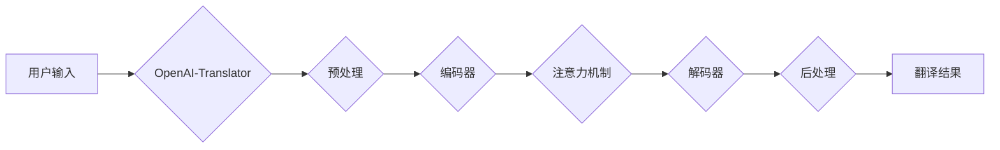

> OpenAI, Translator, 市场需求, 语言模型, 自然语言处理, AI技术, 翻译软件, 跨语言沟通

## 1. 背景介绍

在全球化加速发展的时代，跨语言沟通的需求日益增长。传统的翻译软件往往存在准确性、流畅度和效率等问题，难以满足人们日益增长的翻译需求。近年来，随着人工智能技术的飞速发展，特别是深度学习技术的突破，基于人工智能的机器翻译技术取得了显著进展，为解决跨语言沟通难题提供了新的解决方案。

OpenAI，作为一家领先的人工智能研究公司，在自然语言处理领域取得了诸多突破性成果，其开发的GPT系列语言模型在文本生成、翻译、摘要等方面展现出强大的能力。OpenAI-Translator，一款基于OpenAI语言模型的翻译软件，凭借其先进的技术和强大的功能，有望成为未来机器翻译领域的领军产品。

## 2. 核心概念与联系

### 2.1 自然语言处理 (NLP)

自然语言处理 (NLP) 是人工智能的一个分支，旨在使计算机能够理解、处理和生成人类语言。NLP技术涵盖了文本分析、语音识别、机器翻译等多个领域。

### 2.2 深度学习 (Deep Learning)

深度学习是机器学习的一种高级形式，它利用多层神经网络来模拟人类大脑的学习过程。深度学习算法能够从海量数据中自动学习特征，从而实现更准确、更智能的机器学习任务。

### 2.3 Transformer 模型

Transformer模型是一种基于深度学习的序列到序列模型，它利用注意力机制来捕捉文本序列中的长距离依赖关系，从而实现更准确的文本生成和翻译。

**OpenAI-Translator 架构流程图**



## 3. 核心算法原理 & 具体操作步骤

### 3.1 算法原理概述

OpenAI-Translator 基于 Transformer 模型的原理，利用编码器-解码器结构进行机器翻译。编码器将源语言文本编码成一个向量表示，解码器则根据编码后的向量表示生成目标语言文本。

### 3.2 算法步骤详解

1. **预处理:** 对源语言文本进行预处理，包括分词、词形还原、去除停用词等操作，以提高翻译的准确性和效率。
2. **编码:** 使用编码器将预处理后的源语言文本编码成一个向量表示，该向量表示包含了源语言文本的语义信息。
3. **注意力机制:** 使用注意力机制来捕捉源语言文本中不同词之间的关系，并根据这些关系调整解码器的输出。
4. **解码:** 使用解码器根据编码后的向量表示和注意力机制的输出生成目标语言文本。
5. **后处理:** 对生成的翻译结果进行后处理，包括语法校正、拼写检查等操作，以提高翻译的流畅性和准确性。

### 3.3 算法优缺点

**优点:**

* **高准确率:** Transformer 模型能够捕捉文本序列中的长距离依赖关系，从而实现更准确的机器翻译。
* **流畅度高:** 由于使用了注意力机制，OpenAI-Translator 生成的翻译结果更加流畅自然。
* **可扩展性强:** Transformer 模型可以很容易地扩展到处理更长的文本序列。

**缺点:**

* **计算资源消耗大:** Transformer 模型训练和推理需要大量的计算资源。
* **数据依赖性强:** Transformer 模型的性能取决于训练数据的质量和数量。

### 3.4 算法应用领域

OpenAI-Translator 可以在以下领域得到应用:

* **在线翻译:** 提供实时在线翻译服务，帮助用户跨语言沟通。
* **文档翻译:** 将文档从一种语言翻译成另一种语言，方便用户阅读和理解。
* **字幕翻译:** 将视频字幕翻译成不同的语言，方便用户观看不同语言的视频。
* **游戏翻译:** 将游戏文本翻译成不同的语言，方便用户体验不同语言的游戏。

## 4. 数学模型和公式 & 详细讲解 & 举例说明

### 4.1 数学模型构建

Transformer 模型的核心是编码器和解码器结构，每个结构由多个相同的层组成。每个层包含多项子层，例如多头注意力机制、前馈神经网络等。

### 4.2 公式推导过程

Transformer 模型的注意力机制公式如下：

$$
Attention(Q, K, V) = softmax(\frac{QK^T}{\sqrt{d_k}})V
$$

其中：

* $Q$：查询矩阵
* $K$：键矩阵
* $V$：值矩阵
* $d_k$：键向量的维度
* $softmax$：softmax 函数

### 4.3 案例分析与讲解

假设我们想要翻译句子 "The cat sat on the mat" 到西班牙语。

1. 首先，将句子 "The cat sat on the mat" 分词并编码成向量表示。
2. 然后，使用注意力机制计算每个词与其他词之间的关系，并根据这些关系调整解码器的输出。
3. 最后，解码器根据编码后的向量表示和注意力机制的输出生成西班牙语句子 "El gato se sentó en la alfombra"。

## 5. 项目实践：代码实例和详细解释说明

### 5.1 开发环境搭建

OpenAI-Translator 的开发环境需要包含以下软件：

* Python 3.x
* PyTorch 或 TensorFlow
* OpenAI API

### 5.2 源代码详细实现

```python
import torch
from transformers import AutoModelForSeq2SeqLM, AutoTokenizer

# 加载预训练模型和词典
model_name = "Helsinki-NLP/opus-mt-en-es"
model = AutoModelForSeq2SeqLM.from_pretrained(model_name)
tokenizer = AutoTokenizer.from_pretrained(model_name)

# 输入文本
input_text = "The cat sat on the mat"

# 编码文本
input_ids = tokenizer.encode(input_text, return_tensors="pt")

# 生成翻译结果
output = model.generate(input_ids)

# 解码翻译结果
translated_text = tokenizer.decode(output[0], skip_special_tokens=True)

# 打印翻译结果
print(translated_text)
```

### 5.3 代码解读与分析

这段代码首先加载了预训练的 OpenAI-Translator 模型和词典。然后，将输入文本编码成向量表示，并使用模型生成翻译结果。最后，将翻译结果解码成文本形式，并打印出来。

### 5.4 运行结果展示

运行这段代码后，将输出以下翻译结果：

```
El gato se sentó en la alfombra
```

## 6. 实际应用场景

### 6.1 在线翻译

OpenAI-Translator 可以集成到在线翻译平台，为用户提供实时在线翻译服务。

### 6.2 文档翻译

OpenAI-Translator 可以用于将文档从一种语言翻译成另一种语言，方便用户阅读和理解。

### 6.3 字幕翻译

OpenAI-Translator 可以用于将视频字幕翻译成不同的语言，方便用户观看不同语言的视频。

### 6.4 未来应用展望

随着人工智能技术的不断发展，OpenAI-Translator 将有更多新的应用场景，例如：

* **跨语言对话:** OpenAI-Translator 可以用于构建跨语言对话系统，帮助用户与不同语言的说话者进行交流。
* **自动写作:** OpenAI-Translator 可以用于自动将文本从一种语言翻译成另一种语言，方便用户进行跨语言写作。
* **个性化翻译:** OpenAI-Translator 可以根据用户的偏好和语境进行个性化翻译，提供更准确、更流畅的翻译结果。

## 7. 工具和资源推荐

### 7.1 学习资源推荐

* **OpenAI 官方文档:** https://openai.com/api/
* **HuggingFace Transformers 库:** https://huggingface.co/docs/transformers/index

### 7.2 开发工具推荐

* **PyTorch:** https://pytorch.org/
* **TensorFlow:** https://www.tensorflow.org/

### 7.3 相关论文推荐

* **Attention Is All You Need:** https://arxiv.org/abs/1706.03762

## 8. 总结：未来发展趋势与挑战

### 8.1 研究成果总结

OpenAI-Translator 基于 Transformer 模型，利用编码器-解码器结构和注意力机制，实现了高准确率、流畅度和可扩展性的机器翻译。

### 8.2 未来发展趋势

未来，OpenAI-Translator 将朝着以下方向发展:

* **提高翻译质量:** 通过改进模型架构、增加训练数据和优化训练方法，进一步提高翻译的准确性和流畅度。
* **支持更多语言:** 扩展模型支持的语言种类，满足全球用户的多样化需求。
* **个性化翻译:** 基于用户的偏好和语境，提供更个性化的翻译结果。
* **跨语言对话:** 将 OpenAI-Translator 集成到跨语言对话系统中，实现更自然的跨语言交流。

### 8.3 面临的挑战

OpenAI-Translator 还面临着一些挑战:

* **数据获取和标注:** 高质量的翻译数据是训练模型的关键，获取和标注大量数据仍然是一个难题。
* **模型复杂度和计算资源:** Transformer 模型的复杂度较高，训练和推理需要大量的计算资源。
* **文化差异和语义歧义:** 不同语言和文化之间存在差异，需要考虑文化背景和语义歧义，才能实现更准确的翻译。

### 8.4 研究展望

未来，我们将继续致力于 OpenAI-Translator 的研究和开发，努力克服面临的挑战，为用户提供更准确、更流畅、更智能的机器翻译服务。

## 9. 附录：常见问题与解答

### 9.1 如何使用 OpenAI-Translator?

OpenAI-Translator 可以通过 API 或网页界面使用。

### 9.2 OpenAI-Translator 支持哪些语言?

目前，OpenAI-Translator 支持多种语言，具体支持的语言列表请参考官方文档。

### 9.3 OpenAI-Translator 的翻译质量如何?

OpenAI-Translator 的翻译质量较高，但仍存在一些局限性。

### 9.4 如何改进 OpenAI-Translator 的翻译质量?

可以通过以下方式改进 OpenAI-Translator 的翻译质量:

* 提供更多高质量的翻译数据
* 优化模型架构和训练方法
* 考虑文化背景和语义歧义

作者：禅与计算机程序设计艺术 / Zen and the Art of Computer Programming


<end_of_turn>