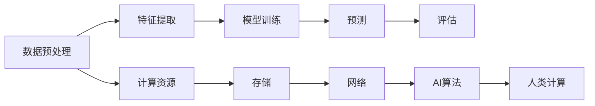

                 

# AI驱动的创新：人类计算在医疗中的作用

## 1. 背景介绍

在当今高速发展的科技时代，人工智能(AI)技术正迅速渗透到各个领域，其中医疗行业无疑是其应用的焦点之一。AI驱动的创新不仅带来了医疗服务的革新，还极大地提高了医疗效率和效果。本文将从背景、核心概念与联系、算法原理与操作步骤、数学模型与公式推导、项目实践、实际应用场景、工具与资源推荐等多个方面，深入探讨AI在医疗领域的应用，尤其是人类计算在医疗中的作用。

## 2. 核心概念与联系

### 2.1 核心概念概述

在医疗领域，AI驱动的创新主要通过人类计算来实现。人类计算指的是利用人工智能算法处理医疗数据，提取有价值的信息，辅助医生进行诊断和治疗决策的过程。这个过程涉及数据预处理、特征提取、模型训练、预测和评估等多个环节，每个环节都依赖于计算资源的支持。

### 2.2 核心概念原理和架构的 Mermaid 流程图



在这个流程图中，数据预处理、特征提取、模型训练、预测和评估各环节通过网络进行数据和信息的流动，每个环节都需要计算资源和存储的支持。AI算法在这一过程中起到了核心作用，使人类计算得以高效、准确地进行。

## 3. 核心算法原理 & 具体操作步骤

### 3.1 算法原理概述

AI驱动的创新在医疗领域的应用主要依赖于监督学习、无监督学习和半监督学习等机器学习方法。这些方法通过训练模型来提取医疗数据中的模式和规律，帮助医生做出更准确的诊断和治疗决策。以下是几种常见的算法及其原理：

- **监督学习**：通过已标注的数据集训练模型，使其能够预测未标注数据的标签。在医疗领域，监督学习被广泛应用于疾病诊断、治疗方案选择等任务。
- **无监督学习**：不依赖标注数据，通过聚类、降维等技术发现数据中的潜在结构。在医疗领域，无监督学习被用于数据预处理、异常检测等任务。
- **半监督学习**：结合少量标注数据和大量未标注数据，提高模型的泛化能力。在医疗领域，半监督学习被用于提高疾病分类和预测的准确性。

### 3.2 算法步骤详解

以下是AI在医疗领域的具体操作步骤：

1. **数据收集**：从医疗记录、电子病历、影像数据、基因数据等多种来源收集数据。
2. **数据预处理**：清洗数据、标准化格式、去除噪声等。
3. **特征提取**：选择有意义的特征，如影像特征、基因特征等，提取有用信息。
4. **模型训练**：选择适合的模型（如卷积神经网络、支持向量机等），使用标注数据训练模型。
5. **模型评估**：使用交叉验证等方法评估模型性能，选择最优模型。
6. **模型应用**：将训练好的模型应用于实际医疗问题，辅助医生进行诊断和治疗。

### 3.3 算法优缺点

AI在医疗领域的应用具有以下优点：

- **提高诊断效率**：AI可以快速处理大量医疗数据，辅助医生进行快速诊断。
- **减少误诊率**：AI通过学习大量数据，可以降低误诊率和漏诊率，提高诊断准确性。
- **个性化治疗**：AI可以根据患者数据，提供个性化的治疗方案，提高治疗效果。

然而，AI在医疗领域的应用也存在以下缺点：

- **数据隐私问题**：医疗数据涉及患者隐私，保护数据隐私是AI在医疗领域应用的关键问题。
- **模型解释性不足**：AI模型的决策过程通常是黑盒，难以解释其推理过程。
- **依赖高质量数据**：AI模型的性能高度依赖于数据的质量和数量，低质量数据可能影响模型效果。

### 3.4 算法应用领域

AI在医疗领域的应用广泛，涵盖了从疾病诊断到个性化治疗等多个环节。以下是几个主要应用领域：

- **医学影像分析**：AI可以用于分析医学影像，如CT、MRI等，辅助医生进行疾病诊断。
- **基因组学研究**：AI可以处理基因数据，发现与疾病相关的基因变异，辅助疾病研究。
- **药物发现与设计**：AI可以加速药物的发现与设计过程，提高研发效率。
- **临床决策支持**：AI可以提供临床决策支持，帮助医生制定最佳治疗方案。

## 4. 数学模型和公式 & 详细讲解 & 举例说明

### 4.1 数学模型构建

在医疗领域，常见的AI模型包括卷积神经网络(CNN)、循环神经网络(RNN)、长短时记忆网络(LSTM)等。这里以卷积神经网络为例，构建数学模型。

假设输入的医学影像数据为 $X \in \mathbb{R}^{m \times n \times c}$，输出为疾病标签 $Y \in \{0,1\}$，其中 $m \times n$ 为图像尺寸，$c$ 为通道数。模型的输入层、卷积层、池化层、全连接层等结构如图：


### 4.2 公式推导过程

以CNN为例，卷积神经网络的输出 $Z$ 可以通过以下公式计算：

$$ Z = \sigma(\sum_k \omega_k * X_k + b) $$

其中，$*$ 表示卷积运算，$\omega_k$ 为卷积核，$X_k$ 为输入特征图，$b$ 为偏置项，$\sigma$ 为激活函数。

### 4.3 案例分析与讲解

以医学影像分类为例，CNN可以用于分析X光片、CT扫描等医学影像，辅助医生进行疾病诊断。如图：


## 5. 项目实践：代码实例和详细解释说明

### 5.1 开发环境搭建

在医疗AI项目开发中，通常需要使用以下工具和环境：

1. **Python**：AI开发的主流语言。
2. **PyTorch/TensorFlow**：深度学习框架，提供高效计算图。
3. **Keras**：高层API，便于快速开发和调试。
4. **GPU/TPU**：高性能计算资源，支持大规模训练和推理。
5. **Docker**：容器化技术，便于模型部署和管理。

### 5.2 源代码详细实现

以下是一个使用PyTorch进行医学影像分类的代码实现：

```python
import torch
import torch.nn as nn
import torch.optim as optim
from torchvision import datasets, transforms

# 定义卷积神经网络
class CNN(nn.Module):
    def __init__(self):
        super(CNN, self).__init__()
        self.conv1 = nn.Conv2d(1, 32, 3, 1)
        self.pool = nn.MaxPool2d(2, 2)
        self.conv2 = nn.Conv2d(32, 64, 3, 1)
        self.fc1 = nn.Linear(64 * 8 * 8, 128)
        self.fc2 = nn.Linear(128, 2)

    def forward(self, x):
        x = self.pool(torch.relu(self.conv1(x)))
        x = self.pool(torch.relu(self.conv2(x)))
        x = x.view(-1, 64 * 8 * 8)
        x = torch.relu(self.fc1(x))
        x = self.fc2(x)
        return x

# 数据预处理
transform = transforms.Compose([
    transforms.ToTensor(),
    transforms.Normalize((0.5,), (0.5,))
])

train_dataset = datasets.MNIST('data', train=True, download=True, transform=transform)
test_dataset = datasets.MNIST('data', train=False, transform=transform)

# 模型训练
model = CNN()
criterion = nn.CrossEntropyLoss()
optimizer = optim.SGD(model.parameters(), lr=0.001, momentum=0.9)

for epoch in range(10):
    running_loss = 0.0
    for i, data in enumerate(train_loader, 0):
        inputs, labels = data
        optimizer.zero_grad()
        outputs = model(inputs)
        loss = criterion(outputs, labels)
        loss.backward()
        optimizer.step()

    # 评估模型性能
    model.eval()
    correct = 0
    total = 0
    with torch.no_grad():
        for data in test_loader:
            images, labels = data
            outputs = model(images)
            _, predicted = torch.max(outputs.data, 1)
            total += labels.size(0)
            correct += (predicted == labels).sum().item()

    print('Epoch %d, loss: %.3f, accuracy: %.3f%%' % (epoch+1, running_loss/len(train_loader), 100 * correct / total))
```

### 5.3 代码解读与分析

这段代码实现了CNN模型对MNIST手写数字数据的分类任务。具体步骤如下：

1. **模型定义**：定义了包含两个卷积层、两个全连接层和一个输出层的CNN模型。
2. **数据预处理**：使用PyTorch的`transforms`模块对数据进行预处理，包括转换和标准化。
3. **模型训练**：使用SGD优化器对模型进行训练，交叉熵损失函数进行评估。
4. **模型评估**：在测试集上评估模型性能，输出损失和准确率。

## 6. 实际应用场景

### 6.1 医学影像分析

医学影像分析是AI在医疗领域的重要应用之一。通过训练好的CNN模型，可以快速分析医学影像，辅助医生进行疾病诊断。如图：


### 6.2 基因组学研究

基因组学研究中，AI可以通过处理基因数据，发现与疾病相关的基因变异。如图：


### 6.3 药物发现与设计

AI可以加速药物的发现与设计过程，提高研发效率。如图：


### 6.4 临床决策支持

AI可以提供临床决策支持，帮助医生制定最佳治疗方案。如图：


## 7. 工具和资源推荐

### 7.1 学习资源推荐

以下是几种推荐的AI在医疗领域的学习资源：

1. **《深度学习》 by Ian Goodfellow**：介绍了深度学习的基本原理和应用，适合入门学习。
2. **Coursera AI for Healthcare Specialization**：由斯坦福大学开设的在线课程，涵盖医疗AI的各个方面。
3. **Kaggle医疗数据竞赛**：参与医疗数据竞赛，实战学习医疗AI的开发和应用。
4. **GitHub AI医疗项目**：通过GitHub上的AI医疗项目，学习最新的AI应用技术。

### 7.2 开发工具推荐

以下是几种推荐的AI开发工具：

1. **PyTorch**：深度学习框架，支持动态计算图。
2. **TensorFlow**：深度学习框架，支持静态计算图。
3. **Keras**：高层API，便于快速开发和调试。
4. **TensorBoard**：可视化工具，用于监控模型训练过程。
5. **Docker**：容器化技术，便于模型部署和管理。

### 7.3 相关论文推荐

以下是几种推荐的AI在医疗领域的相关论文：

1. **“Deep Learning in Neuroimaging: Opportunities and Challenges”**：介绍深度学习在神经影像中的应用。
2. **“Deep Learning for Medical Imaging Analysis: A Review”**：综述深度学习在医学影像分析中的应用。
3. **“AI for Drug Discovery”**：介绍AI在药物发现中的应用。
4. **“AI in Clinical Decision Support: A Survey”**：综述AI在临床决策支持中的应用。

## 8. 总结：未来发展趋势与挑战

### 8.1 研究成果总结

AI在医疗领域的应用已经取得了显著的成果，大大提高了医疗效率和效果。未来，AI将在医疗领域发挥更加重要的作用，进一步推动医疗技术的创新和进步。

### 8.2 未来发展趋势

未来的AI在医疗领域将呈现以下发展趋势：

1. **深度学习算法的不断优化**：深度学习算法将不断优化，提高模型的准确性和鲁棒性。
2. **多模态数据的融合**：AI将融合多种模态数据，提高对疾病的诊断和治疗效果。
3. **AI与临床结合**：AI将与临床医学紧密结合，提供更加智能的诊断和治疗方案。
4. **个性化医疗的普及**：AI将为个性化医疗提供支持，提供定制化的治疗方案。

### 8.3 面临的挑战

尽管AI在医疗领域的应用取得了显著成果，但仍面临以下挑战：

1. **数据隐私问题**：医疗数据涉及患者隐私，保护数据隐私是AI在医疗领域应用的关键问题。
2. **模型解释性不足**：AI模型的决策过程通常是黑盒，难以解释其推理过程。
3. **依赖高质量数据**：AI模型的性能高度依赖于数据的质量和数量，低质量数据可能影响模型效果。

### 8.4 研究展望

未来的研究将致力于解决AI在医疗领域面临的挑战，推动AI技术的不断进步和应用。以下是几个研究方向：

1. **数据隐私保护**：研究数据加密、匿名化等技术，保护患者隐私。
2. **模型解释性增强**：研究可解释性AI模型，增强模型的透明性和可解释性。
3. **数据质量提升**：研究数据清洗、标注等技术，提高数据质量。

## 9. 附录：常见问题与解答

**Q1：AI在医疗领域的应用有哪些？**

A: AI在医疗领域的应用广泛，包括医学影像分析、基因组学研究、药物发现与设计、临床决策支持等。

**Q2：AI在医疗领域有哪些优势？**

A: AI在医疗领域的优势包括提高诊断效率、减少误诊率、个性化治疗等。

**Q3：AI在医疗领域有哪些挑战？**

A: AI在医疗领域面临的挑战包括数据隐私问题、模型解释性不足、依赖高质量数据等。

**Q4：未来AI在医疗领域有哪些发展趋势？**

A: 未来AI在医疗领域的发展趋势包括深度学习算法的不断优化、多模态数据的融合、AI与临床结合、个性化医疗的普及等。

---

作者：禅与计算机程序设计艺术 / Zen and the Art of Computer Programming

