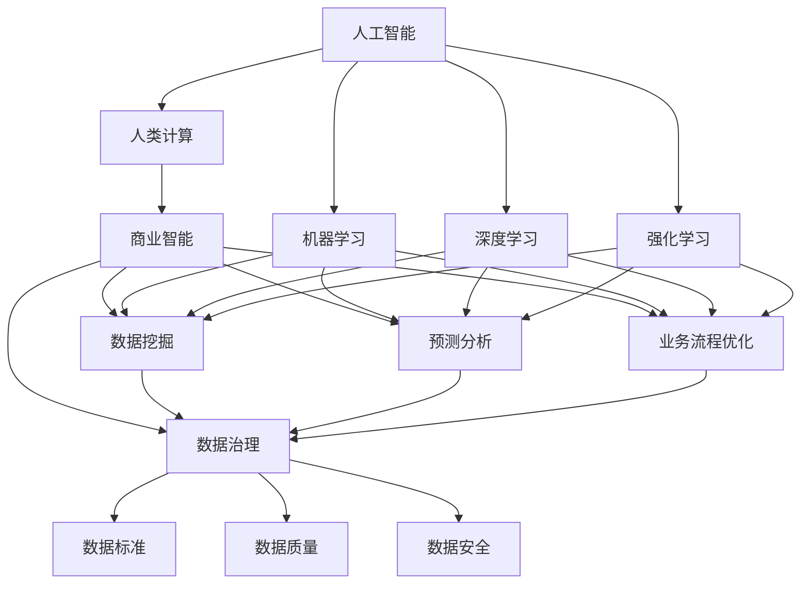

                 

# AI驱动的创新：人类计算在商业中的未来展望

> 关键词：AI,人类计算,商业创新,机器学习,深度学习,强化学习,商业智能,数字转型

## 1. 背景介绍

### 1.1 问题由来
随着技术的飞速发展，人工智能（AI）已经成为商业创新与转型的关键驱动力。AI技术不仅在产品开发、市场运营、客户服务等领域带来了革命性变革，也在数据处理、决策优化、资源配置等企业核心能力方面产生了深远影响。但与此同时，AI的广泛应用也引发了一系列新的挑战，包括道德伦理、隐私安全、技术偏见等问题。如何在充分利用AI技术的同时，平衡好技术创新与商业伦理，成为了新时代企业面临的重要课题。

### 1.2 问题核心关键点
面对这一挑战，AI与商业结合的核心关键点在于如何通过AI驱动的计算与分析，提升商业决策的科学性和精度，同时保障数据的合规性和伦理性。具体而言，包括以下几个方面：
1. 增强决策智能：利用AI进行数据挖掘、模式识别、预测分析，提升决策的科学性和效率。
2. 优化业务流程：通过自动化、智能化的业务流程改进，提升业务运行的效率和质量。
3. 实现精准营销：基于用户行为数据分析，进行个性化推荐和定制化营销，提升用户满意度和转化率。
4. 强化数据治理：保障数据的合规性和安全性，构建透明、可信的数据环境。
5. 深化伦理考量：在AI应用的各个环节，充分考虑隐私保护、公平性、可解释性等伦理问题，构建负责任的AI应用生态。

## 2. 核心概念与联系

### 2.1 核心概念概述

为更好地理解AI与商业的结合，本节将介绍几个密切相关的核心概念：

- **人工智能（AI）**：指通过计算机算法模拟人类智能的通用技术，包括机器学习（ML）、深度学习（DL）、强化学习（RL）等。AI技术通过数据分析、模式识别、自动化决策等方式，提升业务效率和决策质量。

- **人类计算（Human Computation）**：指利用人类的智能和知识，通过算法设计、数据处理、模型训练等方式，提升AI系统的性能和决策能力。人类计算强调人与AI的协同合作，共同完成复杂的计算任务。

- **商业智能（BI）**：指利用数据分析和AI技术，为商业决策提供科学依据。包括数据挖掘、预测分析、业务流程优化等，旨在提升企业的市场竞争力和运营效率。

- **深度学习（DL）**：一种基于神经网络模型的机器学习方法，通过多层次特征提取和分类，提升模型对复杂问题的解决能力。DL广泛应用于图像识别、自然语言处理、语音识别等领域。

- **强化学习（RL）**：通过智能体与环境交互，通过奖惩机制学习最优策略的机器学习方法。RL在自动驾驶、游戏智能、机器人控制等领域有广泛应用。

- **商业智能（BI）**：指利用数据分析和AI技术，为商业决策提供科学依据。包括数据挖掘、预测分析、业务流程优化等，旨在提升企业的市场竞争力和运营效率。

- **数据治理（Data Governance）**：指通过数据标准、数据质量管理、数据安全保护等手段，确保数据的一致性、完整性和安全性，为商业决策提供可靠的数据支撑。

这些核心概念之间的逻辑关系可以通过以下Mermaid流程图来展示：



这个流程图展示了大语言模型的核心概念及其之间的关系：

1. 人工智能通过机器学习、深度学习、强化学习等技术，进行数据处理和智能决策。
2. 人类计算通过算法设计、数据处理、模型训练等方式，提升人工智能的性能和决策能力。
3. 商业智能通过数据分析和AI技术，支持商业决策和业务优化。
4. 数据治理保障数据的一致性、完整性和安全性，为商业决策提供可靠的数据支撑。

这些概念共同构成了AI与商业结合的框架，使其能够在商业应用中发挥强大的智能化和决策优化能力。通过理解这些核心概念，我们可以更好地把握AI与商业结合的逻辑与方法。

## 3. 核心算法原理 & 具体操作步骤
### 3.1 算法原理概述

AI与商业结合的核心在于如何通过计算与分析，提升商业决策的科学性和精度。AI与商业结合的核心算法包括机器学习、深度学习、强化学习等。这些算法通过数据处理、模式识别、决策优化等方式，帮助企业在市场竞争中保持优势。

以机器学习为例，其核心思想是通过对历史数据的学习，发现数据中的模式和规律，用于预测未来趋势或优化业务流程。具体步骤如下：

1. **数据准备**：收集、清洗和处理原始数据，确保数据的完整性和准确性。
2. **模型选择**：根据具体问题选择适合的机器学习模型，如线性回归、决策树、随机森林等。
3. **模型训练**：利用历史数据训练模型，调整模型参数，使其能够准确预测新数据。
4. **模型评估**：使用测试数据评估模型性能，确保模型具有较高的预测准确性和泛化能力。
5. **模型应用**：将训练好的模型应用于实际业务场景，进行数据挖掘、预测分析和业务优化。

### 3.2 算法步骤详解

下面以机器学习为例，详细介绍其操作步骤：

**Step 1: 数据准备**
- 收集业务相关的历史数据，如销售记录、客户反馈、市场分析等。
- 对数据进行清洗和处理，去除缺失值、异常值和重复记录，确保数据的完整性和准确性。
- 根据问题需求，选择数据中相关的特征进行建模。

**Step 2: 模型选择**
- 根据具体问题，选择合适的机器学习算法。如回归问题可以选择线性回归、决策树等，分类问题可以选择逻辑回归、支持向量机等。
- 考虑算法的复杂度和可解释性，权衡模型性能和应用成本。

**Step 3: 模型训练**
- 划分训练集和测试集，确保模型在未见过的数据上也能有较好的预测效果。
- 使用训练集数据训练模型，调整模型参数，使其能够较好地拟合数据分布。
- 考虑过拟合和欠拟合问题，使用正则化、交叉验证等技术提升模型泛化能力。

**Step 4: 模型评估**
- 使用测试集数据评估模型性能，计算准确率、召回率、F1值等指标，确保模型具有较高的预测准确性。
- 进行模型调优，调整模型参数或选择不同的算法，提升模型性能。

**Step 5: 模型应用**
- 将训练好的模型应用于实际业务场景，进行数据挖掘、预测分析和业务优化。
- 实时采集新数据，更新模型参数，确保模型持续有效。
- 考虑数据隐私和安全问题，确保模型应用符合法律法规要求。

### 3.3 算法优缺点

AI与商业结合的机器学习算法具有以下优点：
1. 预测精度高：通过大量历史数据训练，机器学习算法能够准确预测未来趋势，辅助商业决策。
2. 模型泛化能力强：机器学习算法能够从数据中学习规律，具有较好的泛化能力，适用于多种业务场景。
3. 业务优化效果显著：通过数据分析和模型应用，机器学习能够优化业务流程，提升运营效率和客户满意度。

同时，这些算法也存在一定的局限性：
1. 数据依赖度高：机器学习需要大量高质量数据进行训练，数据不足或质量不高会影响模型性能。
2. 模型可解释性差：复杂的机器学习模型通常难以解释其决策过程，缺乏透明度和可解释性。
3. 算法复杂度高：机器学习模型的训练和调优过程复杂，需要较强的数据和计算资源。
4. 适应性不足：机器学习模型通常只能解决特定领域的问题，难以应对多变的业务需求。

尽管存在这些局限性，但机器学习在商业决策和业务优化中的重要性不言而喻，其高精度和泛化能力使其成为AI与商业结合的重要工具。未来，随着算法和技术的不断进步，机器学习将更加灵活和高效，为商业创新和转型提供更强大的支撑。

### 3.4 算法应用领域

机器学习与商业结合的应用领域非常广泛，涵盖了多个行业和业务环节：

- **零售行业**：通过消费者行为分析，进行商品推荐、库存管理和价格优化，提升销售转化率和客户满意度。
- **金融行业**：利用信用评分模型进行风险评估和欺诈检测，提升金融产品的安全性和合规性。
- **医疗行业**：基于病历数据分析，进行疾病预测和诊疗优化，提升医疗服务的质量和效率。
- **物流行业**：通过路线规划和资源配置优化，提升配送效率和运营成本，实现绿色物流。
- **制造行业**：利用预测维护模型进行设备故障预测和维护优化，提升生产线的稳定性和可靠性。
- **能源行业**：通过智能电网和能源管理系统，优化电力和能源资源的分配和利用，提升能源利用效率和环保水平。

以上领域只是冰山一角，随着机器学习技术的不断进步和应用场景的不断拓展，其在商业中的应用将更加广泛和深入。

## 4. 数学模型和公式 & 详细讲解  
### 4.1 数学模型构建

机器学习在商业中的数学模型构建主要围绕以下几个方面展开：

1. **数据表示**：将原始数据转化为模型能够处理的向量形式，如特征提取、标准化等。
2. **模型选择**：根据具体问题选择适合的机器学习模型，如线性回归、决策树、随机森林等。
3. **模型训练**：利用历史数据训练模型，调整模型参数，使其能够较好地拟合数据分布。
4. **模型评估**：使用测试数据评估模型性能，确保模型具有较高的预测准确性。
5. **模型应用**：将训练好的模型应用于实际业务场景，进行数据挖掘、预测分析和业务优化。

以线性回归为例，其数学模型构建过程如下：

假设模型为 $y = \theta_0 + \theta_1x_1 + \theta_2x_2 + ... + \theta_nx_n + \epsilon$，其中 $y$ 为目标变量，$x_i$ 为特征变量，$\theta_i$ 为模型参数，$\epsilon$ 为误差项。根据最小二乘法，模型的参数估计公式为：

$$
\hat{\theta} = \mathop{\arg\min}_{\theta} \sum_{i=1}^N (y_i - \hat{y}_i)^2
$$

其中，$\hat{y}_i = \theta_0 + \theta_1x_{i1} + \theta_2x_{i2} + ... + \theta_nx_{in}$。通过求解上述优化问题，可以确定模型参数 $\hat{\theta}$，进而实现对目标变量 $y$ 的预测。

### 4.2 公式推导过程

下面以线性回归为例，推导模型的参数估计公式。

假设模型为 $y = \theta_0 + \theta_1x_1 + \theta_2x_2 + ... + \theta_nx_n + \epsilon$，其中 $y$ 为目标变量，$x_i$ 为特征变量，$\theta_i$ 为模型参数，$\epsilon$ 为误差项。根据最小二乘法，模型的参数估计公式为：

$$
\hat{\theta} = \mathop{\arg\min}_{\theta} \sum_{i=1}^N (y_i - \hat{y}_i)^2
$$

将其展开并整理，得到：

$$
\hat{\theta} = (X^TX)^{-1}X^Ty
$$

其中 $X$ 为特征矩阵，$y$ 为目标向量。上述公式表示，通过求解最小二乘问题，可以确定模型参数 $\hat{\theta}$，进而实现对目标变量 $y$ 的预测。

### 4.3 案例分析与讲解

以一家电子商务平台的销售额预测为例，分析机器学习模型在实际业务中的应用：

**背景**：一家电子商务平台希望通过预测销售额，优化库存管理和价格策略，提升整体运营效率。平台收集了过去一年的销售数据，包括日期、销售额、促销活动、节假日等信息。

**数据准备**：
1. 收集过去一年的销售数据，包括日期、销售额、促销活动、节假日等信息。
2. 对数据进行清洗和处理，去除缺失值和异常值，确保数据的完整性和准确性。
3. 根据问题需求，选择日期、促销活动、节假日等特征进行建模。

**模型选择**：
1. 根据问题需求，选择线性回归模型进行销售额预测。
2. 考虑模型的复杂度和可解释性，选择线性回归模型。

**模型训练**：
1. 将数据划分为训练集和测试集，确保模型在未见过的数据上也能有较好的预测效果。
2. 使用训练集数据训练线性回归模型，调整模型参数，使其能够较好地拟合数据分布。
3. 使用正则化技术（如L2正则）防止模型过拟合。

**模型评估**：
1. 使用测试集数据评估模型性能，计算准确率、召回率、F1值等指标，确保模型具有较高的预测准确性。
2. 进行模型调优，调整模型参数或选择不同的算法，提升模型性能。

**模型应用**：
1. 将训练好的线性回归模型应用于实际业务场景，进行销售额预测。
2. 实时采集新数据，更新模型参数，确保模型持续有效。
3. 考虑数据隐私和安全问题，确保模型应用符合法律法规要求。

通过上述案例，可以看到机器学习在商业中的实际应用，通过数据分析和模型应用，帮助企业提升运营效率和决策质量。

## 5. 项目实践：代码实例和详细解释说明
### 5.1 开发环境搭建

在进行机器学习实践前，我们需要准备好开发环境。以下是使用Python进行Scikit-learn开发的环境配置流程：

1. 安装Anaconda：从官网下载并安装Anaconda，用于创建独立的Python环境。

2. 创建并激活虚拟环境：
```bash
conda create -n sklearn-env python=3.8 
conda activate sklearn-env
```

3. 安装Scikit-learn：从官网获取对应的安装命令。例如：
```bash
conda install scikit-learn 
```

4. 安装各类工具包：
```bash
pip install numpy pandas scikit-learn matplotlib tqdm jupyter notebook ipython
```

完成上述步骤后，即可在`sklearn-env`环境中开始机器学习实践。

### 5.2 源代码详细实现

下面我们以线性回归模型为例，给出使用Scikit-learn库对数据进行回归分析的Python代码实现。

首先，定义数据处理函数：

```python
import numpy as np
from sklearn.model_selection import train_test_split
from sklearn.linear_model import LinearRegression
from sklearn.metrics import mean_squared_error

def load_data():
    # 读取数据
    data = np.genfromtxt('sales_data.csv', delimiter=',')
    # 将日期转换为标准格式
    data[:,0] = pd.to_datetime(data[:,0], format='%Y-%m-%d')
    # 提取日期特征
    data['date'] = data['date'].map(lambda x: (x.hour, x.dayofyear, x.month))
    # 提取目标变量和特征变量
    y = data['sales']
    X = data[['date', 'promotion', 'holiday']]
    return y, X

def preprocess_data(y, X):
    # 将日期特征进行标准化
    X['date'] = (X['date'] - X['date'].mean()) / X['date'].std()
    # 去除异常值
    y = y[y > 0]
    X = X[y > 0]
    return y, X

def train_model(y, X, test_size=0.2):
    # 划分训练集和测试集
    y_train, y_test, X_train, X_test = train_test_split(y, X, test_size=test_size, random_state=42)
    # 建立线性回归模型
    model = LinearRegression()
    # 训练模型
    model.fit(X_train, y_train)
    return model

def evaluate_model(model, X_test, y_test):
    # 使用测试集数据评估模型性能
    y_pred = model.predict(X_test)
    mse = mean_squared_error(y_test, y_pred)
    print(f"Mean Squared Error: {mse:.2f}")
```

然后，定义训练和评估函数：

```python
def train_and_evaluate():
    # 加载数据
    y, X = load_data()
    # 数据预处理
    y, X = preprocess_data(y, X)
    # 模型训练
    model = train_model(y, X)
    # 模型评估
    evaluate_model(model, X_test, y_test)
```

最后，启动训练流程：

```python
train_and_evaluate()
```

以上就是使用Scikit-learn库进行线性回归模型训练的完整代码实现。可以看到，Scikit-learn提供了丰富的机器学习算法和工具，使得模型训练和评估过程变得简洁高效。

### 5.3 代码解读与分析

让我们再详细解读一下关键代码的实现细节：

**load_data函数**：
- 读取数据：使用numpy的genfromtxt函数从CSV文件中读取数据。
- 数据预处理：将日期转换为标准格式，提取日期特征，准备特征变量和目标变量。

**preprocess_data函数**：
- 数据标准化：使用Pandas库将日期特征进行标准化处理。
- 异常值处理：去除目标变量和特征变量中的异常值。

**train_model函数**：
- 数据划分：使用train_test_split函数将数据划分为训练集和测试集。
- 模型建立：使用LinearRegression类建立线性回归模型。
- 模型训练：使用fit方法训练模型，调整模型参数。

**evaluate_model函数**：
- 模型评估：使用测试集数据评估模型性能，计算均方误差（MSE）。

**train_and_evaluate函数**：
- 数据加载：调用load_data函数加载数据。
- 数据预处理：调用preprocess_data函数对数据进行标准化和异常值处理。
- 模型训练：调用train_model函数训练模型。
- 模型评估：调用evaluate_model函数评估模型性能。

通过上述代码，我们可以看到机器学习模型在商业中的实际应用，通过数据处理和模型训练，帮助企业进行预测分析和业务优化。

## 6. 实际应用场景
### 6.1 智能客服系统

基于机器学习技术的智能客服系统，可以大幅提升客户服务效率和质量。传统客服系统依赖人工客服，难以实现全天候服务，且响应速度慢、质量不稳定。而通过机器学习模型进行智能客服训练，系统可以自动理解客户咨询，快速给出标准回复，甚至进行情感分析，生成个性化回复。

在技术实现上，可以收集企业内部的历史客服对话记录，将问题和最佳答复构建成监督数据，在此基础上对机器学习模型进行训练。训练后的模型能够自动理解用户意图，匹配最合适的答案模板进行回复。对于复杂问题，还可以接入检索系统实时搜索相关内容，动态生成回答。如此构建的智能客服系统，能大幅提升客户咨询体验和问题解决效率。

### 6.2 金融舆情监测

金融机构需要实时监测市场舆论动向，以便及时应对负面信息传播，规避金融风险。传统的人工监测方式成本高、效率低，难以应对网络时代海量信息爆发的挑战。基于机器学习技术的文本分类和情感分析技术，为金融舆情监测提供了新的解决方案。

具体而言，可以收集金融领域相关的新闻、报道、评论等文本数据，并对其进行主题标注和情感标注。在此基础上对机器学习模型进行训练，使其能够自动判断文本属于何种主题，情感倾向是正面、中性还是负面。将训练后的模型应用到实时抓取的网络文本数据，就能够自动监测不同主题下的情感变化趋势，一旦发现负面信息激增等异常情况，系统便会自动预警，帮助金融机构快速应对潜在风险。

### 6.3 个性化推荐系统

当前的推荐系统往往只依赖用户的历史行为数据进行物品推荐，无法深入理解用户的真实兴趣偏好。基于机器学习技术的个性化推荐系统，可以更好地挖掘用户行为背后的语义信息，从而提供更精准、多样的推荐内容。

在实践中，可以收集用户浏览、点击、评论、分享等行为数据，提取和用户交互的物品标题、描述、标签等文本内容。将文本内容作为模型输入，用户的后续行为（如是否点击、购买等）作为监督信号，在此基础上训练机器学习模型。训练后的模型能够从文本内容中准确把握用户的兴趣点。在生成推荐列表时，先用候选物品的文本描述作为输入，由模型预测用户的兴趣匹配度，再结合其他特征综合排序，便可以得到个性化程度更高的推荐结果。

### 6.4 未来应用展望

随着机器学习技术的不断发展，基于机器学习范式将在更多领域得到应用，为传统行业带来变革性影响。

在智慧医疗领域，基于机器学习的医疗问答、病历分析、药物研发等应用将提升医疗服务的智能化水平，辅助医生诊疗，加速新药开发进程。

在智能教育领域，基于机器学习的作业批改、学情分析、知识推荐等方面，因材施教，促进教育公平，提高教学质量。

在智慧城市治理中，基于机器学习的城市事件监测、舆情分析、应急指挥等环节，提高城市管理的自动化和智能化水平，构建更安全、高效的未来城市。

此外，在企业生产、社会治理、文娱传媒等众多领域，基于机器学习的人工智能应用也将不断涌现，为经济社会发展注入新的动力。相信随着技术的日益成熟，机器学习技术将成为企业创新和转型的重要驱动力，推动人工智能技术在更多领域大放异彩。

## 7. 工具和资源推荐
### 7.1 学习资源推荐

为了帮助开发者系统掌握机器学习与商业结合的理论基础和实践技巧，这里推荐一些优质的学习资源：

1. 《机器学习》（周志华著）：国内经典的机器学习入门教材，系统讲解了机器学习的基本概念、算法和应用。

2. 《深度学习》（Ian Goodfellow等著）：深度学习领域的经典教材，介绍了深度神经网络的结构和优化方法。

3. Coursera《机器学习》课程：由斯坦福大学Andrew Ng教授主讲，涵盖机器学习的基本概念、算法和应用，适合初学者学习。

4. edX《深度学习基础》课程：由MIT教授Tom Mitchell主讲，介绍深度神经网络的基本概念和应用。

5. Udacity《机器学习工程师纳米学位》：面向实战的机器学习课程，通过项目实战提升编程和建模能力。

通过对这些资源的学习实践，相信你一定能够快速掌握机器学习与商业结合的精髓，并用于解决实际的商业问题。

### 7.2 开发工具推荐

高效的开发离不开优秀的工具支持。以下是几款用于机器学习与商业结合开发的常用工具：

1. Python：面向科学计算的高级编程语言，拥有丰富的第三方库和框架，适合机器学习研究。

2. R语言：面向数据分析和统计的编程语言，拥有丰富的统计分析库，适合机器学习研究。

3. Scikit-learn：Python机器学习库，提供了丰富的机器学习算法和工具，适合快速迭代研究。

4. TensorFlow：由Google主导开发的开源深度学习框架，生产部署方便，适合大规模工程应用。

5. PyTorch：由Facebook主导开发的开源深度学习框架，灵活高效，适合科研和工程应用。

6. Weights & Biases：模型训练的实验跟踪工具，可以记录和可视化模型训练过程中的各项指标，方便对比和调优。与主流深度学习框架无缝集成。

7. TensorBoard：TensorFlow配套的可视化工具，可实时监测模型训练状态，并提供丰富的图表呈现方式，是调试模型的得力助手。

8. H2O.ai：面向商业用户和数据科学家的开源机器学习平台，提供了简单易用的API和丰富的算法库。

合理利用这些工具，可以显著提升机器学习与商业结合的开发效率，加快创新迭代的步伐。

### 7.3 相关论文推荐

机器学习与商业结合的研究源于学界的持续研究。以下是几篇奠基性的相关论文，推荐阅读：

1. "A Survey on Machine Learning Techniques for Business Intelligence"（IEEE Transactions on Systems, Man, and Cybernetics, Part B: Cybernetics, 2018）：系统回顾了机器学习在商业智能领域的应用，包括数据挖掘、预测分析、业务优化等。

2. "Deep Learning in Industry: A Case Study on Media and Advertising"（IEEE Data Science Journal, 2017）：介绍了深度学习在媒体和广告领域的实际应用，展示了其带来的商业价值。

3. "Machine Learning in Business: A Comprehensive Review"（IEEE Transactions on Neural Networks and Learning Systems, 2019）：系统回顾了机器学习在商业领域的应用，包括金融、零售、医疗等。

4. "Machine Learning in Smart City: A Survey"（IEEE Internet of Things Journal, 2020）：介绍了机器学习在智慧城市中的应用，包括交通管理、环境监测、公共安全等。

5. "Recommender Systems: A Survey and Taxonomy"（ACM Transactions on Intelligent Systems and Technology, 2015）：系统回顾了推荐系统的发展历程和应用现状，展示了其在个性化推荐、商品推荐等领域的广泛应用。

这些论文代表了大语言模型微调技术的发展脉络。通过学习这些前沿成果，可以帮助研究者把握学科前进方向，激发更多的创新灵感。

## 8. 总结：未来发展趋势与挑战

### 8.1 总结

本文对机器学习与商业结合的理论基础和实践技巧进行了全面系统的介绍。首先阐述了机器学习在商业中的重要地位和应用前景，明确了机器学习在提升商业决策科学性和优化业务流程中的核心作用。其次，从原理到实践，详细讲解了机器学习在商业中的应用流程和数学模型，给出了机器学习模型在实际业务中的完整代码实例。同时，本文还广泛探讨了机器学习在智能客服、金融舆情、个性化推荐等多个领域的应用前景，展示了机器学习在商业创新和转型中的巨大潜力。此外，本文精选了机器学习技术的各类学习资源，力求为读者提供全方位的技术指引。

通过本文的系统梳理，可以看到，机器学习在商业中的重要性不言而喻，其高精度和泛化能力使其成为商业创新和转型的重要工具。未来，随着算法和技术的不断进步，机器学习将更加灵活和高效，为商业创新和转型提供更强大的支撑。

### 8.2 未来发展趋势

展望未来，机器学习与商业结合的技术将呈现以下几个发展趋势：

1. 技术融合加速：随着AI技术的不断进步，机器学习将与更多前沿技术融合，如自然语言处理、计算机视觉、语音识别等，提升商业应用的能力和效果。

2. 数据驱动决策：在数字化转型背景下，数据将成为企业决策的重要依据。机器学习通过数据分析和模式识别，将为商业决策提供更加科学和准确的支持。

3. 模型个性化定制：随着企业对个性化需求的多样化，机器学习模型将根据不同业务需求进行个性化定制，提升模型性能和应用效果。

4. 实时化应用：在实时数据流和大数据环境下，机器学习模型将实现实时化应用，提升业务响应速度和运营效率。

5. 边缘计算集成：随着边缘计算技术的发展，机器学习模型将更多地集成在边缘设备中，提升数据处理速度和实时性。

6. 跨领域应用拓展：机器学习将更多地应用于不同领域，如医疗、金融、制造等，为企业提供更加广泛的应用场景。

以上趋势凸显了机器学习与商业结合技术的广阔前景。这些方向的探索发展，必将进一步提升商业智能的水平，为企业的创新和转型提供更强大的技术支撑。

### 8.3 面临的挑战

尽管机器学习与商业结合技术已经取得了瞩目成就，但在迈向更加智能化、普适化应用的过程中，它仍面临着诸多挑战：

1. 数据质量瓶颈：高质量、多样化的数据是机器学习模型训练的基础。在实际应用中，数据获取、清洗和标注的成本高、难度大，成为制约模型性能的瓶颈。

2. 模型鲁棒性不足：机器学习模型面对异常数据和噪声数据的鲁棒性较差，容易出现过拟合和欠拟合问题。

3. 模型可解释性不足：复杂的机器学习模型通常难以解释其决策过程，缺乏透明度和可解释性。

4. 技术复杂度高：机器学习模型的训练和调优过程复杂，需要较强的数据和计算资源。

5. 业务适配难度大：机器学习模型需要与具体的业务场景相结合，模型适配难度大。

6. 伦理道德问题：在数据获取、模型训练、结果应用等各个环节，机器学习面临诸多伦理道德问题，如隐私保护、公平性、可解释性等。

尽管存在这些挑战，但机器学习在商业中的重要性不言而喻，其高精度和泛化能力使其成为商业创新和转型的重要工具。未来，随着算法和技术的不断进步，这些挑战将逐步得到解决，机器学习与商业结合技术必将迎来更加广泛的应用和发展。

### 8.4 研究展望

面对机器学习与商业结合技术面临的挑战，未来的研究需要在以下几个方面寻求新的突破：

1. 探索无监督和半监督学习技术。摆脱对大规模标注数据的依赖，利用自监督学习、主动学习等无监督和半监督范式，最大限度利用非结构化数据，实现更加灵活高效的机器学习应用。

2. 研究模型解释和可解释性技术。开发更加可解释的机器学习模型，通过特征重要性、决策树、LIME等方法，提高模型的透明性和可解释性。

3. 融合多源数据和多种技术。通过集成多种数据源和技术，构建更全面、准确的知识图谱和业务模型，提升机器学习模型的决策能力。

4. 优化模型训练和调优技术。通过自适应学习率、正则化技术、元学习等方法，优化机器学习模型的训练和调优过程，提升模型性能和泛化能力。

5. 强化业务适配和优化。开发面向特定业务场景的机器学习模型，进行业务适配和优化，提升模型的应用效果和用户满意度。

6. 构建伦理道德约束机制。在模型训练目标中引入伦理导向的评估指标，过滤和惩罚有偏见、有害的输出倾向，构建负责任的AI应用生态。

这些研究方向的探索，必将引领机器学习与商业结合技术迈向更高的台阶，为商业创新和转型提供更强大的技术支撑。面向未来，机器学习技术还需要与其他人工智能技术进行更深入的融合，如知识表示、因果推理、强化学习等，多路径协同发力，共同推动商业智能的发展。只有勇于创新、敢于突破，才能不断拓展机器学习在商业中的应用边界，让机器学习更好地为商业决策提供科学依据和决策支持。

## 9. 附录：常见问题与解答

**Q1：机器学习与商业结合的核心优势是什么？**

A: 机器学习与商业结合的核心优势在于其能够通过数据分析和智能决策，提升商业决策的科学性和效率。具体而言，包括以下几个方面：

1. 提升决策质量：通过数据挖掘和模式识别，机器学习能够从海量数据中发现规律和趋势，辅助商业决策。

2. 优化业务流程：通过自动化和智能化业务流程改进，机器学习能够提升业务运行的效率和质量。

3. 实现精准营销：通过个性化推荐和定制化营销，机器学习能够提升用户满意度和转化率。

4. 强化数据治理：通过数据标准和数据质量管理，保障数据的可靠性和安全性，提升数据治理水平。

5. 深化伦理考量：在数据获取、模型训练、结果应用等各个环节，机器学习能够充分考虑隐私保护、公平性、可解释性等伦理问题，构建负责任的AI应用生态。

通过机器学习与商业结合，企业能够更科学、高效、透明地进行决策和运营，提升竞争力和市场份额。

**Q2：机器学习模型在商业中的应用有哪些？**

A: 机器学习模型在商业中的应用非常广泛，涵盖多个行业和业务环节：

1. **零售行业**：通过消费者行为分析，进行商品推荐、库存管理和价格优化，提升销售转化率和客户满意度。

2. **金融行业**：利用信用评分模型进行风险评估和欺诈检测，提升金融产品的安全性和合规性。

3. **医疗行业**：基于病历数据分析，进行疾病预测和诊疗优化，提升医疗服务的质量和效率。

4. **物流行业**：通过路线规划和资源配置优化，提升配送效率和运营成本，实现绿色物流。

5. **制造行业**：利用预测维护模型进行设备故障预测和维护优化，提升生产线的稳定性和可靠性。

6. **能源行业**：通过智能电网和能源管理系统，优化电力和能源资源的分配和利用，提升能源利用效率和环保水平。

以上领域只是冰山一角，随着机器学习技术的不断进步和应用场景的不断拓展，其在商业中的应用将更加广泛和深入。

**Q3：机器学习模型在商业应用中需要注意哪些问题？**

A: 机器学习模型在商业应用中需要注意以下几个问题：

1. 数据质量：高质量、多样化的数据是机器学习模型训练的基础。在实际应用中，数据获取、清洗和标注的成本高、难度大，需要确保数据的一致性和准确性。

2. 模型鲁棒性：机器学习模型面对异常数据和噪声数据的鲁棒性较差，容易出现过拟合和欠拟合问题，需要设计合理的正则化和交叉验证等技术。

3. 模型可解释性：复杂的机器学习模型通常难以解释其决策过程，缺乏透明度和可解释性，需要开发可解释的模型和方法，提高模型的透明性和可解释性。

4. 技术复杂度：机器学习模型的训练和调优过程复杂，需要较强的数据和计算资源，需要合理选择算法和工具，提升开发效率。

5. 业务适配难度：机器学习模型需要与具体的业务场景相结合，模型适配难度大，需要考虑模型的应用场景和业务需求。

6. 伦理道德问题：在数据获取、模型训练、结果应用等各个环节，机器学习面临诸多伦理道德问题，如隐私保护、公平性、可解释性等，需要建立伦理道德约束机制，构建负责任的AI应用生态。

通过合理应对这些问题，机器学习模型在商业中的应用将更加高效和可靠。

**Q4：机器学习模型在商业应用中如何避免过拟合？**

A: 机器学习模型在商业应用中避免过拟合的方法包括：

1. 数据增强：通过回译、近义替换等方式扩充训练集，提高模型的泛化能力。

2. 正则化：使用L2正则、Dropout、Early Stopping等技术，防止模型过度拟合训练集。

3. 对抗训练：引入对抗样本，提高模型鲁棒性，防止模型对训练集的过度拟合。

4. 参数高效微调：使用参数高效微调技术，在固定大部分预训练参数的情况下，只更新极少量的任务相关参数，提高模型的泛化能力。

5. 多模型集成：训练多个机器学习模型，取平均输出，抑制过拟合。

6. 合理选择模型：根据具体问题选择适当的机器学习模型，避免过度复杂和过度拟合。

通过上述方法，可以最大程度地避免机器学习模型在商业应用中的过拟合问题，提升模型的泛化能力和应用效果。

---

作者：禅与计算机程序设计艺术 / Zen and the Art of Computer Programming

