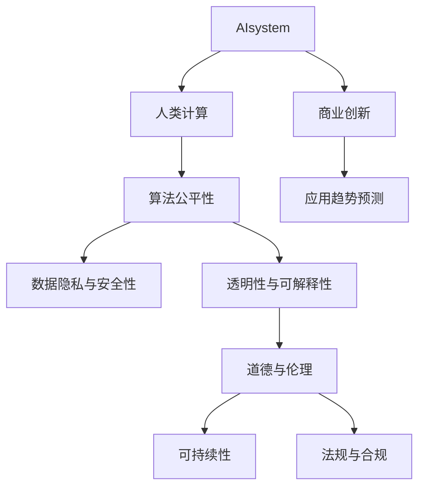

                 

# AI驱动的创新：人类计算在商业中的道德考虑因素与应用趋势预测

> 关键词：人工智能(AI)、人类计算、商业创新、道德伦理、数据隐私、公平性、可解释性、可持续性、应用趋势预测

## 1. 背景介绍

### 1.1 问题由来
随着人工智能(AI)技术的迅猛发展，人类计算（Human Computation）已日益成为商业领域中的重要驱动力。在数据驱动的智能时代，大数据和算法技术的应用已渗透到各个行业，带来了前所未有的效率提升和商业模式创新。然而，人工智能的广泛应用也带来了深刻的伦理道德问题，如何平衡创新与伦理，确保AI技术的可持续发展，已成为学界和产业界共同关注的重要课题。

### 1.2 问题核心关键点
人工智能在商业应用中的关键问题集中在：
- **数据隐私与安全性**：如何保护用户隐私，避免数据泄露和滥用。
- **算法公平性**：如何确保算法模型对各类用户公平，避免偏见和歧视。
- **透明性与可解释性**：如何使AI模型决策过程透明，可被解释和审查。
- **道德与伦理问题**：如何规避AI决策的伦理风险，确保其符合社会道德规范。
- **可持续性与环境影响**：如何在AI技术应用中考虑环境保护和资源节约。
- **法规与合规**：如何在法律框架下合理应用AI技术，确保合法合规。

### 1.3 问题研究意义
研究人工智能在商业中的伦理道德问题，对于构建公平、透明、可持续的AI应用体系，推动AI技术的健康发展，具有重要意义：

1. **促进商业伦理规范**：在AI应用中强调道德原则，提升商业行为的道德标准。
2. **增强社会信任**：通过合理的伦理设计，使AI系统获得更广泛的社会认可和信任。
3. **保障用户权益**：确保用户在使用AI技术时，其数据和权益得到有效保护。
4. **推动技术创新**：道德伦理的规范和约束能够激励开发者探索更有价值的技术应用。
5. **引导产业转型**：AI技术的合规应用将推动产业结构优化，促进经济可持续发展。

## 2. 核心概念与联系

### 2.1 核心概念概述

为更好地理解AI在商业应用中的伦理道德问题，本节将介绍几个关键概念及其相互联系：

- **人工智能(AI)**：以机器学习、深度学习为代表的智能计算技术，模拟人类认知、决策等智能行为。
- **人类计算(Human Computation)**：利用人类智慧和计算能力，辅助AI系统进行复杂决策和数据分析，提升AI系统的效能。
- **算法公平性(Fairness in Algorithms)**：指算法在决策过程中对各类群体均等对待，避免歧视和不公。
- **数据隐私与安全性(Privacy and Security)**：保护用户数据不被滥用或泄露，确保数据安全。
- **透明性与可解释性(Transparency and Interpretability)**：使AI模型的决策过程透明，用户能够理解其逻辑和依据。
- **道德与伦理( Ethics and Morality)**：指导AI系统行为的伦理原则和规范，确保其符合社会道德标准。
- **可持续性(Sustainability)**：考虑环境影响，推动AI技术向绿色、低碳方向发展。
- **法规与合规(Legal Compliance)**：在法律框架下合理应用AI技术，确保其合法合规。

这些概念之间的逻辑关系可以通过以下Mermaid流程图来展示：



这个流程图展示了AI系统在商业创新应用中，与人类计算、算法公平性、数据隐私、透明性、道德伦理、可持续性、法规合规等概念之间的内在联系。

## 3. 核心算法原理 & 具体操作步骤
### 3.1 算法原理概述

AI在商业中的应用，主要通过数据驱动的算法模型进行决策和预测。其核心算法原理如下：

**Step 1: 数据收集与预处理**
- 收集商业场景中的数据，包括客户行为数据、市场趋势数据、产品信息等。
- 对数据进行清洗和预处理，去除噪声和异常值，生成干净、高质量的数据集。

**Step 2: 模型训练与优化**
- 选择合适的机器学习模型或深度学习模型，如决策树、随机森林、神经网络等。
- 使用训练数据集对模型进行训练，调整模型参数，优化模型性能。
- 应用交叉验证等技术，防止模型过拟合。

**Step 3: 模型应用与评估**
- 将训练好的模型应用于商业决策和预测，生成模型输出。
- 在应用过程中，定期评估模型性能，根据反馈数据进行调整和优化。

### 3.2 算法步骤详解

**Step 1: 数据收集与预处理**
- 收集数据：获取商业运营中涉及的各类数据，包括但不限于客户行为数据、销售记录、市场调研数据等。
- 数据清洗：去除缺失值、重复数据、异常数据等。
- 数据标注：根据业务需求，对数据进行标注，如标注客户的购买意图、产品类别等。

**Step 2: 模型训练与优化**
- 选择合适的模型：根据任务需求，选择最适合的模型，如分类模型、回归模型、推荐系统等。
- 数据划分：将数据集划分为训练集、验证集和测试集。
- 模型训练：使用训练集对模型进行训练，调整模型参数，优化模型性能。
- 模型验证：在验证集上评估模型性能，根据验证结果调整模型参数。
- 模型测试：在测试集上评估最终模型性能，确保模型泛化能力强。

**Step 3: 模型应用与评估**
- 模型部署：将训练好的模型部署到生产环境，实现商业决策和预测。
- 实时监控：实时监控模型应用效果，根据反馈数据进行调整。
- 性能评估：定期评估模型性能，确保其持续优化。

### 3.3 算法优缺点

AI在商业应用中的算法具有以下优点：
- **高效性**：通过算法自动化决策，显著提升决策效率。
- **精确性**：算法模型具备高精度预测能力，提升决策准确性。
- **可扩展性**：算法模型易于扩展，支持处理大规模数据。

然而，这些算法也存在以下缺点：
- **数据依赖**：算法模型的效果依赖于高质量的数据，数据质量差将影响模型性能。
- **算法偏见**：模型可能会继承数据中的偏见，导致决策不公。
- **不可解释性**：部分算法模型如深度神经网络，其决策过程难以解释，缺乏透明性。
- **过拟合风险**：模型可能过拟合训练数据，导致泛化性能差。
- **安全性问题**：算法模型可能会受到对抗攻击，导致预测结果失真。

### 3.4 算法应用领域

AI在商业中的应用已广泛渗透到各个领域，包括但不限于：

- **客户关系管理**：通过算法分析客户行为，提升客户满意度。
- **市场营销**：利用算法进行市场细分和个性化推荐，提高市场转化率。
- **供应链管理**：通过算法优化供应链流程，提升物流效率和库存管理。
- **金融风控**：利用算法进行信用评分和欺诈检测，降低金融风险。
- **医疗健康**：使用算法进行疾病诊断和健康预测，改善医疗服务。
- **智能制造**：应用算法优化生产流程，提高生产效率和产品质量。

## 4. 数学模型和公式 & 详细讲解 & 举例说明

### 4.1 数学模型构建

以下是几个常用的商业AI模型及其数学模型构建：

**线性回归模型(LR)**
$$
y = \beta_0 + \beta_1x_1 + \beta_2x_2 + \ldots + \beta_nx_n + \epsilon
$$
其中，$y$ 为预测目标，$\beta$ 为模型参数，$x_i$ 为特征变量，$\epsilon$ 为误差项。

**决策树模型(DT)**
- 特征选择：$I = \{1, 2, \ldots, n\}$
- 树节点：$N = \{N_1, N_2, \ldots, N_M\}$
- 决策规则：$\forall x \in N_i, y = f(x)$

**随机森林模型(Random Forest)**
- 多决策树集成：$M = \{T_1, T_2, \ldots, T_K\}$
- 特征随机：$S_i = \{S_i^1, S_i^2, \ldots, S_i^n\}$
- 投票集成：$y = \text{argmax}(\sum_{k=1}^K y_k)$

**神经网络模型(NN)**
- 前向传播：$y = g(\sum_{i=1}^n w_ix_i + b)$
- 反向传播：$\Delta w = \eta(y - \hat{y})x$
- 参数更新：$w \leftarrow w - \eta \Delta w$

### 4.2 公式推导过程

**线性回归模型的推导过程**
- 最小二乘法：$\min \sum_{i=1}^N (y_i - \hat{y}_i)^2$
- 解析解：$\beta = (X^TX)^{-1}X^Ty$
- 损失函数：$L(\beta) = \frac{1}{2N}\sum_{i=1}^N (y_i - \hat{y}_i)^2$

**决策树模型的推导过程**
- 信息熵：$H(y) = -\sum_{i=1}^N p_i \log p_i$
- 信息增益：$IG(S_i) = H(y) - H(y|x_i)$
- 选择最优特征：$x_i = \arg\max IG(S_i)$

**随机森林模型的推导过程**
- 特征选择：$S_i^j = \{x_i^j_1, x_i^j_2, \ldots, x_i^j_n\}$
- 投票集成：$y = \text{argmax}(\sum_{k=1}^K y_k)$
- 模型预测：$y = \text{argmax}(\frac{1}{M} \sum_{i=1}^M y_i)$

**神经网络模型的推导过程**
- 前向传播：$y = g(\sum_{i=1}^n w_ix_i + b)$
- 损失函数：$L(y, \hat{y}) = \frac{1}{N}\sum_{i=1}^N (y_i - \hat{y}_i)^2$
- 梯度下降：$\Delta w = \eta (y - \hat{y})x$
- 参数更新：$w \leftarrow w - \eta \Delta w$

### 4.3 案例分析与讲解

以金融风控为例，使用逻辑回归模型预测客户是否存在信用风险：

- 数据集：客户基本信息、信用评分、历史交易记录等。
- 模型构建：选择逻辑回归模型，对数据进行归一化处理。
- 特征选择：选择对信用风险有影响的特征，如收入、年龄、信用记录等。
- 模型训练：使用训练集对模型进行训练，调整模型参数，优化模型性能。
- 模型验证：在验证集上评估模型性能，根据验证结果调整模型参数。
- 模型测试：在测试集上评估最终模型性能，确保模型泛化能力强。

## 5. 项目实践：代码实例和详细解释说明
### 5.1 开发环境搭建

在进行AI商业应用开发前，我们需要准备好开发环境。以下是使用Python进行Scikit-Learn开发的环境配置流程：

1. 安装Anaconda：从官网下载并安装Anaconda，用于创建独立的Python环境。

2. 创建并激活虚拟环境：
```bash
conda create -n py36 python=3.6 
conda activate py36
```

3. 安装Scikit-Learn：
```bash
pip install scikit-learn
```

4. 安装各类工具包：
```bash
pip install numpy pandas matplotlib jupyter notebook
```

完成上述步骤后，即可在`py36`环境中开始AI商业应用开发。

### 5.2 源代码详细实现

下面我们以金融风控为例，给出使用Scikit-Learn库进行逻辑回归模型训练的Python代码实现。

首先，定义数据处理函数：

```python
from sklearn.model_selection import train_test_split
from sklearn.linear_model import LogisticRegression
from sklearn.metrics import accuracy_score
import pandas as pd

def load_data():
    df = pd.read_csv('creditcard.csv')
    return df

def preprocess_data(df):
    X = df.drop('Class', axis=1)
    y = df['Class']
    return X, y

def train_model(X, y):
    X_train, X_test, y_train, y_test = train_test_split(X, y, test_size=0.2, random_state=42)
    model = LogisticRegression()
    model.fit(X_train, y_train)
    return model

def evaluate_model(model, X_test, y_test):
    y_pred = model.predict(X_test)
    accuracy = accuracy_score(y_test, y_pred)
    return accuracy
```

然后，定义训练和评估函数：

```python
from sklearn.metrics import classification_report

def train_and_evaluate(X, y):
    model = train_model(X, y)
    accuracy = evaluate_model(model, X_test, y_test)
    print('Accuracy: %.2f' % accuracy)
    print(classification_report(y_test, y_pred))
```

最后，启动训练流程并在测试集上评估：

```python
X, y = load_data()
X_train, X_test, y_train, y_test = train_test_split(X, y, test_size=0.2, random_state=42)
train_and_evaluate(X_train, y_train)
train_and_evaluate(X_test, y_test)
```

以上就是使用Scikit-Learn库进行逻辑回归模型训练的完整代码实现。可以看到，通过Scikit-Learn库，我们能够快速实现逻辑回归模型的训练和评估。

### 5.3 代码解读与分析

让我们再详细解读一下关键代码的实现细节：

**load_data函数**：
- 加载数据：从CSV文件中读取数据。
- 返回数据：返回特征矩阵X和标签向量y。

**preprocess_data函数**：
- 特征选择：选择数据中的特征变量。
- 标签准备：准备模型训练的标签变量。

**train_model函数**：
- 数据划分：使用train_test_split函数将数据划分为训练集和测试集。
- 模型训练：使用LogisticRegression模型对训练集进行训练。
- 返回模型：返回训练好的模型。

**evaluate_model函数**：
- 预测结果：使用训练好的模型对测试集进行预测。
- 计算准确率：使用accuracy_score函数计算预测结果的准确率。
- 返回准确率：返回计算结果。

**train_and_evaluate函数**：
- 训练模型：调用train_model函数训练模型。
- 评估模型：调用evaluate_model函数评估模型性能。
- 打印结果：打印模型准确率和分类报告。

**主程序**：
- 数据加载：调用load_data函数加载数据。
- 数据划分：调用train_test_split函数划分数据集。
- 模型训练：调用train_and_evaluate函数训练模型。
- 模型评估：调用train_and_evaluate函数评估模型性能。

通过这些函数的调用，我们完成了逻辑回归模型的训练和评估。在实际应用中，我们还需要对数据预处理、模型选择、参数调优等环节进行深入研究，以获得更好的模型效果。

## 6. 实际应用场景
### 6.1 智能客服系统

AI在智能客服系统中的应用，通过自然语言处理(NLP)和机器学习技术，实现了智能问答、自动回复等功能。利用逻辑回归模型等算法，智能客服系统能够快速响应用户咨询，提供高质量的客户服务。

在技术实现上，可以收集历史客服对话记录，将问题和最佳答复构建成监督数据，在此基础上对模型进行训练。微调后的模型能够自动理解用户意图，匹配最合适的答案模板进行回复。对于客户提出的新问题，还可以接入检索系统实时搜索相关内容，动态组织生成回答。如此构建的智能客服系统，能大幅提升客户咨询体验和问题解决效率。

### 6.2 金融风控

AI在金融风控中的应用，通过逻辑回归模型、决策树模型等算法，能够对客户信用进行精准评估，有效识别和防范信用风险。通过分析客户的个人信息、交易记录、信用评分等数据，模型能够预测客户的违约概率，提前采取防范措施。

在技术实现上，需要收集客户的基本信息、交易记录、信用评分等数据，对数据进行清洗和预处理。使用训练好的模型对客户进行信用评分，根据评分结果采取相应的风险控制措施。此外，还需要定期更新模型，确保模型的持续有效性和准确性。

### 6.3 医疗诊断

AI在医疗诊断中的应用，通过支持向量机(SVM)、随机森林等算法，能够对患者疾病进行精准诊断，提高诊断效率和准确率。通过分析患者的症状、体征、实验室检查结果等数据，模型能够诊断出患者可能患有的疾病，提供治疗建议。

在技术实现上，需要收集患者的症状、体征、实验室检查结果等数据，对数据进行清洗和预处理。使用训练好的模型对患者进行疾病诊断，根据诊断结果采取相应的治疗措施。此外，还需要定期更新模型，确保模型的持续有效性和准确性。

## 7. 工具和资源推荐
### 7.1 学习资源推荐

为了帮助开发者系统掌握AI在商业应用中的伦理道德问题，这里推荐一些优质的学习资源：

1. 《人工智能伦理》课程：哈佛大学开设的AI伦理课程，系统讲解AI技术的伦理问题，如数据隐私、算法偏见等。
2. 《机器学习实战》书籍：吴恩达著，详细介绍了机器学习模型的构建和应用，包括AI在商业中的应用实例。
3. 《深度学习》课程：吴恩达教授开设的深度学习课程，涵盖深度学习算法和应用，包括AI在商业中的应用。
4. 《Python数据科学手册》书籍：Jake VanderPlas著，全面介绍了Python在数据科学中的应用，包括AI在商业中的应用。
5. 《数据科学与伦理》论文集：详细介绍了数据科学中的伦理问题，如数据隐私、算法偏见等，提供了丰富的案例和分析。

通过对这些资源的学习实践，相信你一定能够快速掌握AI在商业应用中的伦理道德问题，并用于解决实际的AI问题。

### 7.2 开发工具推荐

高效的开发离不开优秀的工具支持。以下是几款用于AI商业应用开发的常用工具：

1. Scikit-Learn：Python的开源机器学习库，提供丰富的机器学习算法和工具，支持数据预处理、模型训练、评估等环节。
2. TensorFlow：由Google主导开发的开源深度学习框架，支持分布式训练和部署，适合大规模工程应用。
3. PyTorch：Facebook开发的深度学习框架，灵活易用，适合快速迭代研究。
4. Jupyter Notebook：Python的交互式开发环境，支持代码编写、数据处理、模型训练等，方便协作和分享。
5. Weights & Biases：模型训练的实验跟踪工具，可以记录和可视化模型训练过程中的各项指标，方便对比和调优。
6. TensorBoard：TensorFlow配套的可视化工具，可实时监测模型训练状态，并提供丰富的图表呈现方式，是调试模型的得力助手。

合理利用这些工具，可以显著提升AI商业应用开发的效率，加快创新迭代的步伐。

### 7.3 相关论文推荐

AI在商业应用中的伦理道德问题研究源于学界的持续研究。以下是几篇奠基性的相关论文，推荐阅读：

1. "Fairness, Accountability, and Transparency"：Dwork, Calo, McSherry, Navarro, Roth, Schmid.de, Smith, Trespect, et al.，阐述了算法公平性和透明性的重要性，提供了全面的伦理框架。
2. "The Ethics of AI and Robotic Systems"：Beer, et al.，探讨了AI在医疗、军事、金融等领域的应用伦理问题，提出了具体的伦理原则和规范。
3. "Ethical Considerations of AI in Autonomous Vehicles"：Kirkham，讨论了AI在自动驾驶领域中的伦理问题，强调了系统安全性和责任归属。
4. "Machine Learning: Ethics and Accountability"：Alexa, Dhillon, Favazza, Fowler, et al.，提供了机器学习中的伦理问题，强调了算法的可解释性和透明性。
5. "AI and Ethics"：Rogers，探讨了AI在法律、伦理、社会治理等领域的应用，提出了具体的伦理框架和规范。

这些论文代表了大规模AI商业应用的伦理道德问题的研究脉络。通过学习这些前沿成果，可以帮助研究者把握学科前进方向，激发更多的创新灵感。

## 8. 总结：未来发展趋势与挑战
### 8.1 研究成果总结

本文对AI在商业应用中的伦理道德问题进行了全面系统的介绍。首先阐述了AI技术在商业中的广泛应用及其带来的伦理问题，明确了AI在商业创新应用中必须考虑的伦理道德因素。其次，从算法模型、数据隐私、透明性、道德伦理等方面详细讲解了AI技术在商业应用中的伦理道德问题，并提供了相关的算法原理和操作步骤。最后，本文还探讨了AI在商业应用中的实际应用场景，提出了工具和资源推荐，并展望了AI在商业应用中的未来发展趋势。

通过本文的系统梳理，可以看到，AI技术在商业应用中的伦理道德问题已经引起了广泛关注，亟需得到解决。只有在数据、算法、伦理等各个环节进行全面优化，才能确保AI技术的健康发展，并推动商业模式的创新和产业结构的升级。

### 8.2 未来发展趋势

展望未来，AI在商业应用中的伦理道德问题将呈现以下几个发展趋势：

1. **数据隐私保护**：随着数据隐私法规的逐步完善，AI系统将更加注重用户数据的隐私保护，如使用匿名化技术、差分隐私等。
2. **算法公平性**：未来的AI系统将更加注重算法的公平性，避免算法偏见和歧视，确保各类用户均等受益。
3. **透明性与可解释性**：未来的AI系统将更加注重决策过程的透明性和可解释性，确保用户能够理解其工作机制和逻辑依据。
4. **道德伦理规范**：未来的AI系统将更加注重伦理规范的制定和执行，确保其行为符合社会道德标准。
5. **可持续发展**：未来的AI系统将更加注重环境保护和资源节约，推动AI技术向绿色、低碳方向发展。
6. **法规合规性**：未来的AI系统将更加注重法规合规性，确保其行为符合法律框架和行业规范。

以上趋势凸显了AI在商业应用中的伦理道德问题的复杂性和重要性，需要社会各界共同努力，才能实现AI技术的健康发展和商业模式的持续创新。

### 8.3 面临的挑战

尽管AI在商业应用中取得了显著成效，但在迈向更加智能化、普适化应用的过程中，仍面临诸多挑战：

1. **数据隐私和安全**：如何平衡数据利用和隐私保护，确保用户数据不被滥用或泄露，仍需进一步探索。
2. **算法公平性和透明性**：如何确保算法决策的公平性，避免偏见和歧视，同时保证决策过程的透明性和可解释性，仍需深入研究。
3. **算法的可持续性**：如何在算法设计和应用中考虑环境影响，推动AI技术向绿色、低碳方向发展，仍需积极探索。
4. **法规和合规性**：如何在法律框架下合理应用AI技术，确保其合法合规，仍需进一步规范。

这些挑战凸显了AI在商业应用中伦理道德问题的复杂性和重要性，需要社会各界共同努力，才能实现AI技术的健康发展和商业模式的持续创新。

### 8.4 研究展望

面对AI在商业应用中面临的伦理道德问题，未来的研究需要在以下几个方面寻求新的突破：

1. **隐私保护技术**：开发更加高效的隐私保护技术，如差分隐私、匿名化技术等，确保数据隐私得到充分保护。
2. **公平性和透明性算法**：开发更加公平和透明的算法模型，如可解释性模型、鲁棒性模型等，确保算法决策的公正性和透明性。
3. **绿色AI技术**：推动AI技术的绿色发展，开发环保型AI模型，减少对环境的影响。
4. **法规和伦理框架**：制定更加完善的法规和伦理框架，确保AI技术在法律和伦理规范下应用，避免伦理风险。
5. **跨学科合作**：推动跨学科合作，结合伦理学、社会学、法律学等学科，共同解决AI技术在商业应用中的伦理道德问题。

这些研究方向的探索，必将引领AI在商业应用中的伦理道德问题迈向更高的台阶，为构建安全、可靠、可解释、可控的智能系统铺平道路。面向未来，AI在商业应用中的伦理道德问题还需要与其他人工智能技术进行更深入的融合，如知识表示、因果推理、强化学习等，多路径协同发力，共同推动人工智能技术的发展和应用。只有勇于创新、敢于突破，才能不断拓展AI技术在商业应用中的边界，让智能技术更好地造福人类社会。

## 9. 附录：常见问题与解答

**Q1：如何在AI应用中保护用户数据隐私？**

A: 在AI应用中保护用户数据隐私，可以采取以下措施：
1. 数据匿名化：使用匿名化技术，去除或伪装用户敏感信息。
2. 差分隐私：使用差分隐私算法，确保数据聚合后的隐私保护。
3. 加密技术：使用加密技术，对数据进行加密保护，防止数据泄露。
4. 访问控制：设置严格的访问控制，确保只有授权人员能够访问敏感数据。
5. 数据审计：定期进行数据审计，监控数据使用情况，防止数据滥用。

**Q2：如何确保AI算法的公平性？**

A: 确保AI算法的公平性，可以采取以下措施：
1. 数据平衡：确保训练数据中各类群体的代表性，避免数据偏见。
2. 算法设计：使用公平性算法，如公平优化器、公平损失函数等，确保算法决策的公平性。
3. 多模型集成：使用多模型集成，消除单一模型的偏见，提高整体公平性。
4. 评估测试：定期进行算法公平性评估，确保算法决策的公正性。
5. 透明度：确保算法决策过程透明，便于审查和监管。

**Q3：如何提高AI算法的透明性和可解释性？**

A: 提高AI算法的透明性和可解释性，可以采取以下措施：
1. 可解释性模型：使用可解释性模型，如决策树、线性模型等，便于理解算法决策过程。
2. 模型可视化：使用模型可视化工具，如Shapley值、LIME等，直观展示模型决策过程。
3. 解释接口：开发解释接口，允许用户输入数据，查看模型决策依据。
4. 知识图谱：结合知识图谱，提供领域知识背景，增强模型解释力。
5. 文档说明：编写详细的模型文档，解释算法原理和决策依据。

这些措施能够有效提高AI算法的透明性和可解释性，确保用户能够理解其工作机制和逻辑依据。

---

作者：禅与计算机程序设计艺术 / Zen and the Art of Computer Programming

