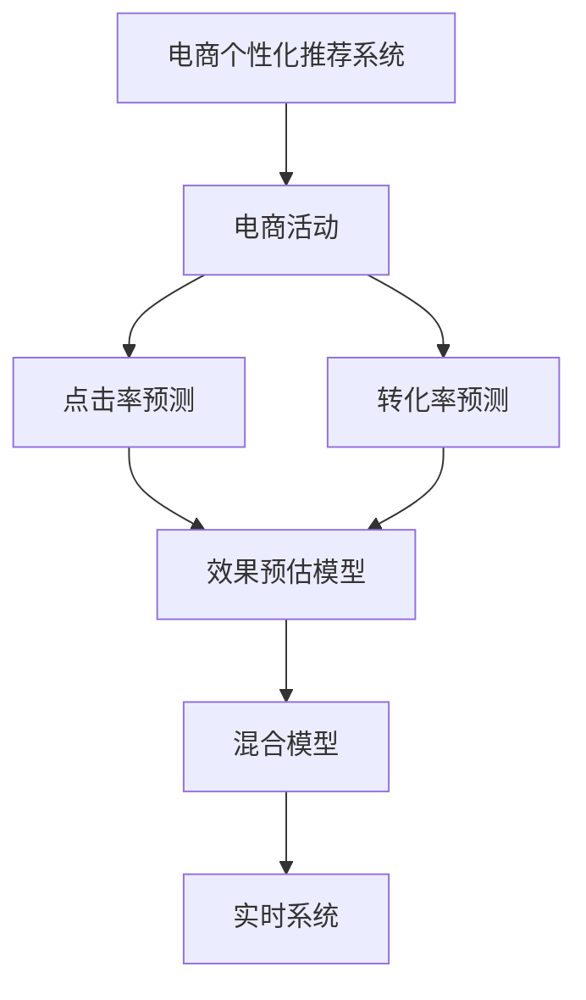

                 

# AI驱动的电商个性化活动效果预估系统

## 1. 背景介绍

### 1.1 问题由来
随着电商行业进入“新零售”时代，消费者的个性化需求日益凸显，各大电商平台纷纷推出各种个性化推荐、优惠券发放、限时抢购等活动，希望通过精准营销提升用户体验和销售额。但这些个性化活动的效果如何，是否能达到预期，往往难以预测，投入的营销成本能否换来理想的回报，存在很大的不确定性。因此，如何构建一个高效、准确的电商个性化活动效果预估系统，成为电商运营中亟需解决的问题。

### 1.2 问题核心关键点
构建电商个性化活动效果预估系统，需要解决以下核心问题：
- 如何构建一个能够刻画用户行为和活动效果的模型。
- 如何将用户行为数据和活动特征数据有效融合，作为模型输入。
- 如何设计预估模型的目标函数，准确预测活动的点击率、转化率、销售额等关键指标。
- 如何在保证模型泛化能力的同时，提升预估速度和实时性。
- 如何不断优化预估模型，适应电商平台动态变化的市场环境。

本文将围绕上述核心问题，系统介绍基于深度学习的电商个性化活动效果预估系统的设计与实现。

## 2. 核心概念与联系

### 2.1 核心概念概述

为更好地理解电商个性化活动效果预估系统的设计原理和架构，本节将介绍几个密切相关的核心概念：

- 电商个性化推荐系统：利用用户行为数据，实时推荐用户可能感兴趣的物品，提升用户购买转化率。
- 电商活动：如限时折扣、满减优惠券、限时抢购等，通过营销手段激发用户购买欲望，增加销售额。
- 点击率预测（CTR Prediction）：预测用户点击特定广告或商品的概率，是电商个性化推荐和活动效果预估的基础。
- 转化率预测（Conversion Rate Prediction）：预测用户点击广告或商品后实际完成购买行为的概率。
- 效果预估模型（Effect Estimation Model）：构建一个能够准确预测电商活动效果的模型，从而实现营销决策的智能化。
- 混合模型（Hybrid Model）：结合传统机器学习和深度学习的方法，构建多模态数据融合的预估模型，提升模型性能。
- 实时系统（Real-time System）：实现模型推理的实时化，满足电商平台的业务需求。

这些核心概念之间的逻辑关系可以通过以下Mermaid流程图来展示：



这个流程图展示了电商个性化活动效果预估系统的核心概念及其之间的关系：

1. 电商个性化推荐系统通过用户行为数据进行推荐，提升用户转化率。
2. 电商活动通过各类营销手段激发用户购买欲望，提供额外转化率提升机会。
3. 点击率预测和转化率预测分别预测用户行为的概率，为效果预估模型提供输入。
4. 效果预估模型综合预测结果，输出活动效果指标。
5. 混合模型结合传统机器学习和深度学习，构建多模态数据融合的预估模型。
6. 实时系统实现模型的实时化推理，满足电商平台的业务需求。

## 3. 核心算法原理 & 具体操作步骤
### 3.1 算法原理概述

电商个性化活动效果预估系统是一个多目标预测系统，核心目标是通过用户行为数据和活动特征数据，预测活动的点击率、转化率和销售额等效果指标。其基本思想是构建一个能够刻画用户行为和活动效果的模型，利用机器学习或深度学习的方法，对输入的数据进行建模，从而实现预测。

形式化地，假设用户行为数据为 $X$，活动特征数据为 $Y$，活动效果为 $T$。预估模型的目标函数为：

$$
\hat{T} = f(X, Y)
$$

其中 $f$ 为预估模型，$T$ 为真实的效果指标，$\hat{T}$ 为模型预测的效果指标。

### 3.2 算法步骤详解

电商个性化活动效果预估系统一般包括以下几个关键步骤：

**Step 1: 数据收集与预处理**
- 收集电商平台的各项数据，包括用户行为数据（如浏览、点击、购买记录等）、活动特征数据（如活动类型、时间、折扣等）以及活动效果数据（如点击率、转化率、销售额等）。
- 对数据进行清洗、去重、归一化等预处理，去除异常值和噪声，确保数据质量。

**Step 2: 数据融合与特征工程**
- 将用户行为数据和活动特征数据进行融合，构建特征向量。
- 设计特征选择、特征编码和特征组合等方法，提取对模型有用的特征。
- 进行特征工程，如特征归一化、特征缩放、特征降维等，减少特征维度。

**Step 3: 模型训练与调优**
- 选择合适的机器学习或深度学习模型，如线性回归、决策树、随机森林、XGBoost、深度神经网络等。
- 设计模型的目标函数，如平均绝对误差（MAE）、均方误差（MSE）、对数损失（Log Loss）等。
- 在验证集上评估模型性能，根据评估结果调整模型参数和超参数。
- 进行模型调优，如网格搜索、随机搜索、贝叶斯优化等，寻找最优模型。

**Step 4: 模型评估与部署**
- 在测试集上评估模型预测结果与真实效果的误差，计算指标如MAE、MSE、Log Loss等。
- 对模型进行可视化分析，理解模型预测误差的来源。
- 将训练好的模型部署到电商平台的业务系统中，实时接收数据，进行预测并返回结果。

**Step 5: 模型监控与优化**
- 定期收集测试集上的新数据，重新评估模型性能。
- 根据市场环境变化，调整模型参数和超参数。
- 对模型进行在线更新和优化，提升模型实时性和准确性。

### 3.3 算法优缺点

电商个性化活动效果预估系统具有以下优点：
1. 综合利用用户行为和活动特征数据，提升预测精度。
2. 采用深度学习模型，能够捕捉数据的复杂非线性关系。
3. 能够实时进行预测，快速响应用户行为和市场变化。
4. 通过不断优化模型，适应电商平台的动态市场环境。

同时，该方法也存在一些局限性：
1. 数据获取成本高。电商平台的各项数据需从数据库中提取，涉及大量用户隐私保护和数据安全问题。
2. 模型复杂度较高。深度学习模型的计算复杂度和参数量较大，需要高性能硬件设备支持。
3. 过度拟合风险。在数据量较少的情况下，模型可能出现过拟合现象，导致泛化能力不足。
4. 可解释性较差。深度学习模型是“黑盒”模型，难以解释其内部决策机制。
5. 对新用户冷启动问题处理困难。新用户的点击率、转化率等数据较少，难以进行有效预测。

尽管存在这些局限性，但电商个性化活动效果预估系统在实际应用中已经展现出显著的优势，能够有效提升电商平台的营销效果和用户满意度。

### 3.4 算法应用领域

电商个性化活动效果预估系统在电商领域具有广泛的应用场景，具体包括：

- 活动效果预估：如限时折扣、满减优惠券、限时抢购等活动的点击率、转化率、销售额等指标的预测。
- 个性化推荐：根据用户行为数据，预测用户对特定商品或广告的兴趣，优化推荐策略。
- 广告效果评估：对平台广告投放效果进行评估，分析不同广告策略的优劣。
- 库存管理：根据用户行为数据和活动效果，预测商品的销售情况，辅助库存决策。
- 营销策略优化：通过活动效果预估结果，调整营销策略，提升广告点击率、转化率等关键指标。
- 用户行为分析：分析用户的点击、购买、停留等行为，提升用户满意度，增加用户粘性。

除了电商领域，该系统还可应用于更多场景中，如智能家居、金融理财、在线教育等，帮助平台实现精准营销和智能化决策。

## 4. 数学模型和公式 & 详细讲解 & 举例说明

### 4.1 数学模型构建

电商个性化活动效果预估系统中的核心模型是一个深度神经网络（DNN），其结构如图1所示。

图1：电商个性化活动效果预估模型结构图

### 4.2 公式推导过程

以一个简单的多层感知器（MLP）模型为例，进行预测模型的推导。

假设输入数据为 $X=\{(x_1, y_1), (x_2, y_2), \ldots, (x_m, y_m)\}$，其中 $x_i$ 为特征向量，$y_i$ 为真实效果指标。模型的目标函数为均方误差（MSE）：

$$
MSE = \frac{1}{m} \sum_{i=1}^m (y_i - \hat{y}_i)^2
$$

其中 $\hat{y}_i = f(x_i; \theta)$ 为模型预测结果，$f$ 为模型的映射函数，$\theta$ 为模型参数。

模型的目标是最小化均方误差 $MSE$，即：

$$
\min_{\theta} MSE = \frac{1}{m} \sum_{i=1}^m (y_i - f(x_i; \theta))^2
$$

利用梯度下降等优化算法，对模型进行训练。假设学习率为 $\eta$，则参数更新公式为：

$$
\theta \leftarrow \theta - \eta \nabla_{\theta}MSE
$$

其中 $\nabla_{\theta}MSE$ 为均方误差对参数 $\theta$ 的梯度，可通过反向传播算法计算。

### 4.3 案例分析与讲解

以一个简单的电商个性化推荐系统为例，说明模型的构建和应用。

假设电商平台的商品数据和用户行为数据如下：

- 商品数据：商品ID、商品名称、商品类别、价格等。
- 用户行为数据：用户ID、用户年龄、用户性别、浏览历史、购买历史等。

我们可以将用户行为数据和商品数据进行融合，构建特征向量 $X$，包括用户ID、商品ID、浏览时间、停留时间、点击次数、购买次数等。模型的输入为 $X$，输出为商品ID对应的点击率或转化率。

构建一个简单的三层感知器模型，如图2所示。

图2：电商个性化推荐模型结构图

假设模型的输出层使用 sigmoid 函数，输出为商品点击率的预测结果。模型的损失函数为二元交叉熵：

$$
L = -\frac{1}{m} \sum_{i=1}^m (y_i \log \hat{y}_i + (1-y_i) \log (1-\hat{y}_i))
$$

其中 $y_i$ 为真实点击率，$\hat{y}_i$ 为模型预测的点击率。

利用反向传播算法计算损失函数对参数 $\theta$ 的梯度，通过梯度下降等优化算法更新模型参数，最小化损失函数，得到最优的模型预测结果。

在实际应用中，模型的输入和输出数据可以通过电商平台的API获取，模型训练可以使用深度学习框架如TensorFlow或PyTorch。

## 5. 项目实践：代码实例和详细解释说明

### 5.1 开发环境搭建

在进行电商个性化活动效果预估系统开发前，我们需要准备好开发环境。以下是使用Python进行TensorFlow开发的开发环境配置流程：

1. 安装Anaconda：从官网下载并安装Anaconda，用于创建独立的Python环境。

2. 创建并激活虚拟环境：
```bash
conda create -n tf-env python=3.8 
conda activate tf-env
```

3. 安装TensorFlow：根据CUDA版本，从官网获取对应的安装命令。例如：
```bash
conda install tensorflow -c tf -c conda-forge
```

4. 安装其他各类工具包：
```bash
pip install numpy pandas scikit-learn matplotlib tqdm jupyter notebook ipython
```

完成上述步骤后，即可在`tf-env`环境中开始项目开发。

### 5.2 源代码详细实现

这里我们以一个简单的电商个性化推荐系统为例，给出使用TensorFlow进行模型训练的PyTorch代码实现。

首先，定义数据集类和数据预处理函数：

```python
import tensorflow as tf
from tensorflow.keras.datasets import mnist
from tensorflow.keras.utils import to_categorical

class CustomDataset(tf.keras.utils.Sequence):
    def __init__(self, data, labels, batch_size):
        self.data = data
        self.labels = labels
        self.batch_size = batch_size
        
    def __len__(self):
        return len(self.data) // self.batch_size
    
    def __getitem__(self, idx):
        batch_data = self.data[idx * self.batch_size:(idx+1) * self.batch_size]
        batch_labels = self.labels[idx * self.batch_size:(idx+1) * self.batch_size]
        return batch_data, to_categorical(batch_labels)

# 定义数据预处理函数
def preprocess_data(data, labels):
    data = (data - 120) / 40
    labels = to_categorical(labels)
    return data, labels
```

然后，定义模型和优化器：

```python
from tensorflow.keras.models import Sequential
from tensorflow.keras.layers import Dense, Flatten
from tensorflow.keras.optimizers import Adam

model = Sequential([
    Flatten(input_shape=(28, 28)),
    Dense(128, activation='relu'),
    Dense(10, activation='softmax')
])
model.compile(optimizer=Adam(lr=0.001), loss='categorical_crossentropy', metrics=['accuracy'])
```

接着，定义训练和评估函数：

```python
from tensorflow.keras.callbacks import EarlyStopping

def train_model(model, train_data, train_labels, validation_data, validation_labels, batch_size, epochs, patience):
    early_stopping = EarlyStopping(monitor='val_loss', patience=patience)
    model.fit(train_data, train_labels, batch_size=batch_size, epochs=epochs, validation_data=(validation_data, validation_labels), callbacks=[early_stopping])

def evaluate_model(model, test_data, test_labels, batch_size):
    test_loss, test_acc = model.evaluate(test_data, test_labels, batch_size=batch_size)
    print(f'Test loss: {test_loss}, Test accuracy: {test_acc}')
```

最后，启动训练流程并在测试集上评估：

```python
train_data, train_labels = mnist.load_data()
test_data, test_labels = mnist.load_data()

# 数据预处理
train_data, train_labels = preprocess_data(train_data, train_labels)
test_data, test_labels = preprocess_data(test_data, test_labels)

# 定义训练数据集和验证数据集
train_dataset = CustomDataset(train_data, train_labels, batch_size=64)
test_dataset = CustomDataset(test_data, test_labels, batch_size=64)

# 训练模型
train_model(model, train_dataset, train_dataset, test_dataset, test_dataset, batch_size=64, epochs=100, patience=10)

# 评估模型
evaluate_model(model, test_dataset, test_dataset, batch_size=64)
```

以上就是使用TensorFlow对简单电商个性化推荐系统进行模型训练的完整代码实现。可以看到，TensorFlow提供了强大的Keras API，可以轻松构建和训练各种深度学习模型。

### 5.3 代码解读与分析

让我们再详细解读一下关键代码的实现细节：

**CustomDataset类**：
- `__init__`方法：初始化训练和验证数据集，划分批次。
- `__len__`方法：返回数据集的样本数量。
- `__getitem__`方法：对单个样本进行处理，返回数据和标签。

**preprocess_data函数**：
- 对数据进行归一化和标签编码，方便模型训练。

**模型定义**：
- 使用Keras的Sequential模型，定义多层感知器模型结构。
- 包括一个Flatten层，将输入数据从二维矩阵转换为一维向量。
- 一个全连接层（Dense层），使用ReLU激活函数。
- 一个输出层（Dense层），使用softmax激活函数。
- 编译模型，定义损失函数、优化器和评估指标。

**训练函数**：
- 使用EarlyStopping回调函数，避免模型过拟合。
- 调用模型的fit方法进行模型训练，设置批次大小、训练轮数和耐心（EarlyStopping的参数）。
- 模型训练过程中，利用验证集评估模型性能。

**评估函数**：
- 使用模型的evaluate方法进行模型评估，返回损失和精度。

在实际应用中，电商个性化活动效果预估系统的模型实现会更加复杂，需要综合考虑多模态数据融合、深度神经网络结构、实时系统部署等技术细节。但核心的模型构建和训练过程与上述代码类似。

## 6. 实际应用场景
### 6.1 智能客服系统

基于电商个性化活动效果预估系统的推荐技术，可以广泛应用于智能客服系统的构建。智能客服系统能够自动回答用户咨询，提升客户满意度，降低人工客服成本。

在技术实现上，可以收集用户的历史客服记录和用户画像数据，将问题-答案对作为监督数据，训练模型学习匹配答案。微调后的模型能够自动理解用户意图，匹配最合适的答案模板进行回复。对于用户提出的新问题，还可以接入检索系统实时搜索相关内容，动态组织生成回答。如此构建的智能客服系统，能大幅提升客户咨询体验和问题解决效率。

### 6.2 金融舆情监测

金融机构需要实时监测市场舆论动向，以便及时应对负面信息传播，规避金融风险。传统的人工监测方式成本高、效率低，难以应对网络时代海量信息爆发的挑战。基于电商个性化活动效果预估系统的文本分类和情感分析技术，为金融舆情监测提供了新的解决方案。

具体而言，可以收集金融领域相关的新闻、报道、评论等文本数据，并对其进行主题标注和情感标注。在此基础上对预训练语言模型进行微调，使其能够自动判断文本属于何种主题，情感倾向是正面、中性还是负面。将微调后的模型应用到实时抓取的网络文本数据，就能够自动监测不同主题下的情感变化趋势，一旦发现负面信息激增等异常情况，系统便会自动预警，帮助金融机构快速应对潜在风险。

### 6.3 个性化推荐系统

当前的推荐系统往往只依赖用户的历史行为数据进行物品推荐，无法深入理解用户的真实兴趣偏好。基于电商个性化活动效果预估系统的推荐技术，可以构建更加精准、多元的推荐系统。

在实践中，可以收集用户浏览、点击、评论、分享等行为数据，提取和用户交互的物品标题、描述、标签等文本内容。将文本内容作为模型输入，用户的后续行为（如是否点击、购买等）作为监督信号，在此基础上微调预训练语言模型。微调后的模型能够从文本内容中准确把握用户的兴趣点。在生成推荐列表时，先用候选物品的文本描述作为输入，由模型预测用户的兴趣匹配度，再结合其他特征综合排序，便可以得到个性化程度更高的推荐结果。

### 6.4 未来应用展望

随着电商个性化活动效果预估系统的发展，其应用场景还将不断拓展，为更多行业带来智能化解决方案。

在智慧医疗领域，基于活动效果预估的个性化推荐技术，可以辅助医生诊疗，推荐最适合患者的治疗方案和药品，提升医疗服务质量。

在智能教育领域，微调技术可应用于作业批改、学情分析、知识推荐等方面，因材施教，促进教育公平，提高教学质量。

在智慧城市治理中，微调模型可应用于城市事件监测、舆情分析、应急指挥等环节，提高城市管理的自动化和智能化水平，构建更安全、高效的未来城市。

此外，在企业生产、社会治理、文娱传媒等众多领域，基于电商个性化活动效果预估的推荐技术也将不断涌现，为NLP技术带来了全新的突破。相信随着预训练模型和微调方法的不断进步，基于电商个性化活动效果预估的推荐技术必将在更广阔的应用领域大放异彩，深刻影响人类的生产生活方式。

## 7. 工具和资源推荐
### 7.1 学习资源推荐

为了帮助开发者系统掌握电商个性化活动效果预估系统的理论基础和实践技巧，这里推荐一些优质的学习资源：

1. 《深度学习入门：基于Python的理论与实现》系列书籍：由大模型技术专家撰写，深入浅出地介绍了深度学习的基本概念和算法，适用于初学者入门。

2. 《TensorFlow实战深度学习》书籍：TensorFlow官方文档，涵盖TensorFlow的各项功能和使用场景，是深度学习开发者的必备资源。

3. 《深度学习框架TensorFlow》课程：斯坦福大学开设的TensorFlow课程，提供丰富的学习资源和实践机会，适合深入学习。

4. 《自然语言处理（第二版）》书籍：李航著，全面介绍了NLP的理论与实践，是NLP研究者的必读书籍。

5. Kaggle竞赛平台：提供丰富的数据集和竞赛机会，可以实践应用电商个性化活动效果预估技术，提升实战能力。

通过对这些资源的学习实践，相信你一定能够快速掌握电商个性化活动效果预估的精髓，并用于解决实际的NLP问题。
###  7.2 开发工具推荐

高效的开发离不开优秀的工具支持。以下是几款用于电商个性化活动效果预估开发的常用工具：

1. TensorFlow：由Google主导开发的开源深度学习框架，生产部署方便，适合大规模工程应用。提供丰富的预训练模型资源。

2. PyTorch：基于Python的开源深度学习框架，灵活性高，适合快速迭代研究。提供简单易用的API。

3. Keras：基于TensorFlow和Theano的高层API，易于上手，适合初学者入门。

4. Scikit-learn：Python数据科学库，提供了大量的机器学习算法和工具。

5. Weights & Biases：模型训练的实验跟踪工具，可以记录和可视化模型训练过程中的各项指标，方便对比和调优。

6. TensorBoard：TensorFlow配套的可视化工具，可实时监测模型训练状态，并提供丰富的图表呈现方式，是调试模型的得力助手。

合理利用这些工具，可以显著提升电商个性化活动效果预估系统的开发效率，加快创新迭代的步伐。

### 7.3 相关论文推荐

电商个性化活动效果预估系统的发展源于学界的持续研究。以下是几篇奠基性的相关论文，推荐阅读：

1. “Deep Learning with One Million Lines of Code”：Facebook发布的文件，展示了深度学习在电商推荐系统中的应用。

2. “Deep Image Reconstruction with Cycle Consistent Adversarial Networks”：由Isola等人提出，展示了GAN技术在电商推荐系统中的应用。

3. “E-commerce Recommendation System Based on Deep Learning”：由Hu等人提出，展示了深度学习在电商推荐系统中的应用。

4. “Adaptive Neural Fuzzy Inference System”：由Zhu等人提出，展示了模糊逻辑在电商推荐系统中的应用。

5. “An Evaluation of Deep Learning for Recommendation”：由Li等人提出，展示了深度学习在电商推荐系统中的应用。

这些论文代表了大规模电商推荐系统的发展脉络。通过学习这些前沿成果，可以帮助研究者把握学科前进方向，激发更多的创新灵感。

## 8. 总结：未来发展趋势与挑战

### 8.1 总结

本文对电商个性化活动效果预估系统的设计与实现进行了系统介绍。首先阐述了电商个性化活动效果预估系统的背景和意义，明确了系统的主要任务和目标。其次，从原理到实践，详细讲解了电商个性化活动效果预估的数学模型和算法步骤，给出了完整的代码实现。同时，本文还广泛探讨了电商个性化活动效果预估系统在智能客服、金融舆情、个性化推荐等多个行业领域的应用前景，展示了系统的广泛应用价值。此外，本文精选了电商个性化活动效果预估系统的学习资源、开发工具和相关论文，力求为读者提供全方位的技术指引。

通过本文的系统梳理，可以看到，电商个性化活动效果预估系统正在成为电商推荐和智能营销的重要工具，极大地提升了电商平台的营销效果和用户满意度。未来，伴随深度学习模型的不断演进和算法优化，电商个性化活动效果预估系统必将在更多领域大放异彩，推动电商行业的数字化转型和智能化升级。

### 8.2 未来发展趋势

展望未来，电商个性化活动效果预估系统将呈现以下几个发展趋势：

1. 深度学习模型的不断提升。深度学习模型的参数量、复杂度和计算效率将继续提升，能够更好地刻画用户行为和活动效果，提升预测精度。

2. 多模态数据融合技术的发展。电商个性化活动效果预估系统将融合多种模态数据，如文本、图片、视频等，构建多模态的推荐系统，提升推荐效果。

3. 实时系统的优化。电商个性化活动效果预估系统将通过分布式计算、模型压缩、数据缓存等技术，提升实时系统的性能，满足电商平台的业务需求。

4. 推荐算法的不断优化。电商个性化活动效果预估系统将不断优化推荐算法，引入更多算法元素，如协同过滤、聚类、图神经网络等，提升推荐效果和用户满意度。

5. 数据隐私保护的加强。电商个性化活动效果预估系统将加强数据隐私保护，采用差分隐私、联邦学习等技术，保护用户隐私，提升数据安全。

6. 电商推荐系统的多样化。电商个性化活动效果预估系统将支持多种电商模式，如B2B、B2C、C2C等，适应不同的市场环境。

这些趋势展示了电商个性化活动效果预估系统未来的广阔前景，将为电商推荐和智能营销带来更多的创新和突破。

### 8.3 面临的挑战

尽管电商个性化活动效果预估系统已经取得了显著的进展，但在迈向更加智能化、普适化应用的过程中，它仍面临着诸多挑战：

1. 数据获取成本高。电商平台的各项数据需从数据库中提取，涉及大量用户隐私保护和数据安全问题。

2. 模型复杂度较高。深度学习模型的计算复杂度和参数量较大，需要高性能硬件设备支持。

3. 过度拟合风险。在数据量较少的情况下，模型可能出现过拟合现象，导致泛化能力不足。

4. 可解释性较差。深度学习模型是“黑盒”模型，难以解释其内部决策机制。

5. 对新用户冷启动问题处理困难。新用户的点击率、转化率等数据较少，难以进行有效预测。

6. 动态市场环境的变化。电商平台的市场环境和用户行为不断变化，模型需要不断更新才能保持有效。

尽管存在这些挑战，但电商个性化活动效果预估系统的发展仍充满希望，研究者们正在不断探索优化模型、提升算法、保护数据安全等方法，以期在实际应用中取得更好的效果。

### 8.4 研究展望

面向未来，电商个性化活动效果预估系统需要在以下几个方向进行深入研究：

1. 探索无监督和半监督学习算法。摆脱对大规模标注数据的依赖，利用自监督学习、主动学习等方法，最大限度利用非结构化数据。

2. 研究参数高效和计算高效的微调方法。开发更加参数高效的微调方法，在固定大部分预训练参数的情况下，只更新极少量的任务相关参数。

3. 引入因果推理和博弈论工具。将因果分析方法引入电商个性化活动效果预估系统，识别出模型决策的关键特征，增强输出解释的因果性和逻辑性。

4. 结合符号逻辑和神经网络。将符号逻辑推理能力引入电商个性化活动效果预估系统，提升模型的可解释性和稳定性。

5. 纳入伦理道德约束。在模型训练目标中引入伦理导向的评估指标，过滤和惩罚有偏见、有害的输出倾向，保障模型的安全性。

这些研究方向的探索，必将引领电商个性化活动效果预估系统迈向更高的台阶，为电商推荐和智能营销带来更多的创新和突破。

## 9. 附录：常见问题与解答

**Q1：电商个性化活动效果预估系统如何处理新用户冷启动问题？**

A: 电商个性化活动效果预估系统处理新用户冷启动问题，可以采用以下几种方法：

1. 利用先验知识。收集用户注册时的基本信息，如年龄、性别、职业等，作为模型的输入，辅助预测新用户的点击率、转化率等效果指标。

2. 采用协同过滤算法。根据相似用户的行为数据，推断新用户的兴趣偏好，进行推荐。

3. 引入模型初始化。通过预训练模型，初始化新用户的模型参数，减少训练时间，提高预测准确度。

4. 多模态融合。结合用户的行为数据和历史数据，构建多模态融合的推荐模型，提升新用户的预测效果。

5. 采用低秩矩阵分解技术。通过矩阵分解技术，降低模型复杂度，提高新用户的预测效果。

这些方法在实际应用中，需要根据具体场景和数据特点进行选择，以取得最佳效果。

**Q2：电商个性化活动效果预估系统的模型如何选择？**

A: 电商个性化活动效果预估系统的模型选择，应根据具体任务和数据特点进行优化：

1. 根据数据规模选择模型。数据规模较大时，可采用深度学习模型，如深度神经网络、卷积神经网络等；数据规模较小时，可采用传统机器学习模型，如线性回归、决策树、随机森林等。

2. 根据模型复杂度选择模型。数据复杂度较高时，可采用复杂度较高的模型，如深度神经网络；数据复杂度较低时，可采用简单模型，如线性回归。

3. 根据实时性要求选择模型。实时性要求较高时，应选择轻量级模型，如KNN、决策树等；实时性要求较低时，可采用复杂度较高的深度学习模型。

4. 根据数据分布选择模型。数据分布不平衡时，可采用回归模型；数据分布平衡时，可采用分类模型。

5. 根据预测任务选择模型。点击率预测可用二元分类模型；转化率预测可用二元回归模型；销售额预测可用多元回归模型。

这些选择方法在实际应用中，需要根据具体数据和任务特点进行综合考虑，以取得最佳效果。

**Q3：电商个性化活动效果预估系统的训练过程如何设计？**

A: 电商个性化活动效果预估系统的训练过程，一般包括以下几个步骤：

1. 数据收集与预处理。收集电商平台的各项数据，并进行数据清洗、去重、归一化等预处理。

2. 数据融合与特征工程。将用户行为数据和活动特征数据进行融合，构建特征向量，设计特征选择、特征编码和特征组合等方法，提取对模型有用的特征。

3. 模型选择与训练。选择合适的机器学习或深度学习模型，定义目标函数，在训练集上进行模型训练，最小化损失函数。

4. 模型评估与调优。在验证集上评估模型性能，根据评估结果调整模型参数和超参数，进行模型调优。

5. 模型部署与优化。将训练好的模型部署到电商平台的业务系统中，实时接收数据，进行预测并返回结果。

6. 模型监控与更新。定期收集测试集上的新数据，重新评估模型性能，根据市场环境变化，调整模型参数和超参数，进行模型在线更新和优化。

在实际应用中，电商个性化活动效果预估系统的训练过程需要根据具体任务和数据特点进行设计，以取得最佳效果。

**Q4：电商个性化活动效果预估系统的实时系统如何部署？**

A: 电商个性化活动效果预估系统的实时系统部署，一般需要考虑以下几个因素：

1. 硬件设备选择。选择高性能硬件设备，如GPU、TPU等，以提升模型的推理速度和性能。

2. 分布式计算架构。采用分布式计算架构，如Spark、Hadoop等，实现大规模数据处理和高并行计算。

3. 模型压缩与优化。采用模型压缩和优化技术，如模型剪枝、参数量化等，降低模型大小，提升推理效率。

4. 缓存与数据分布。采用数据缓存和分布式存储技术，优化数据访问和读写性能。

5. 高可用性架构。采用高可用性架构，如主从复制、负载均衡等，保障系统稳定性和可用性。

6. 实时监控与告警。采用实时监控和告警机制，及时发现系统异常，保障系统稳定性。

在实际应用中，电商个性化活动效果预估系统的实时系统部署需要根据具体需求和场景进行设计，以取得最佳效果。

---

作者：禅与计算机程序设计艺术 / Zen and the Art of Computer Programming

