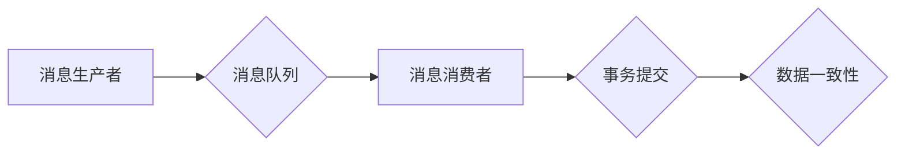

> exactly-once语义,分布式系统,消息队列,数据一致性,可靠性,数据流处理,流计算,Apache Kafka,程序设计

## 1. 背景介绍

在现代数据密集型应用中，分布式系统架构已成为主流。分布式系统由多个独立的节点组成，这些节点通过网络进行通信和协作，共同完成任务。然而，分布式系统的复杂性也带来了新的挑战，其中数据一致性和可靠性是关键问题之一。

exactly-once语义是指在分布式系统中，消息被处理一次，且仅被处理一次。它保证了消息的可靠性和数据一致性，避免了消息重复处理导致的数据冗余和冲突。

exactly-once语义在许多场景下至关重要，例如：

* **金融交易系统:** 确保每笔交易只被处理一次，避免资金损失和数据不一致。
* **电商平台:** 确保订单处理只被执行一次，避免重复发货和库存错误。
* **数据分析平台:** 确保数据流处理只被执行一次，避免数据重复计算和结果不准确。

## 2. 核心概念与联系

**2.1  消息队列**

消息队列是一种用于异步通信的中间件，它可以将消息存储在队列中，并根据一定的规则将消息传递给消费者。消息队列可以提高系统的可靠性和可扩展性，并简化消息传递的逻辑。

**2.2  分布式事务**

分布式事务是指在分布式系统中，多个节点之间的一系列操作，这些操作必须原子性地执行，要么全部成功，要么全部失败。

**2.3  exactly-once语义与分布式事务**

exactly-once语义通常与分布式事务密切相关。为了实现exactly-once语义，需要确保消息的处理过程是一个原子操作，即要么全部成功，要么全部失败。

**2.4  Mermaid 流程图**



## 3. 核心算法原理 & 具体操作步骤

**3.1  算法原理概述**

实现exactly-once语义的算法通常基于以下原理：

* **消息唯一标识:** 每个消息都必须具有唯一的标识符，以便在处理过程中进行跟踪和确认。
* **消息确认机制:** 消息消费者在处理消息成功后，需要向消息生产者发送确认消息，表明消息已成功处理。
* **重试机制:** 如果消息处理失败，需要进行重试，直到消息成功处理或达到最大重试次数。
* **幂等性:** 消息处理操作必须具有幂等性，即多次执行相同的操作不会导致数据不一致。

**3.2  算法步骤详解**

1. **消息生产者:** 生成消息并将其发送到消息队列。
2. **消息消费者:** 从消息队列中获取消息。
3. **消息处理:** 消息消费者处理消息，并根据消息内容执行相应的操作。
4. **消息确认:** 如果消息处理成功，消息消费者向消息生产者发送确认消息。
5. **重试机制:** 如果消息处理失败，消息消费者会根据重试策略进行重试。
6. **幂等性:** 消息处理操作必须具有幂等性，避免重复处理导致的数据不一致。

**3.3  算法优缺点**

**优点:**

* 确保消息被处理一次，且仅被处理一次。
* 保证数据一致性和可靠性。

**缺点:**

* 复杂性较高，需要实现消息唯一标识、消息确认机制、重试机制等。
* 可能导致消息处理延迟。

**3.4  算法应用领域**

exactly-once语义广泛应用于以下领域：

* 金融交易系统
* 电商平台
* 数据分析平台
* 物联网系统
* 医疗健康系统

## 4. 数学模型和公式 & 详细讲解 & 举例说明

**4.1  数学模型构建**

假设一个分布式系统中，有N个消息消费者，每个消费者负责处理一部分消息。

*  $M_i$ 表示第i个消息消费者处理的消息数量。
*  $T$ 表示总的消息数量。

则系统中消息处理的总数量可以表示为：

$$
\sum_{i=1}^{N} M_i = T
$$

**4.2  公式推导过程**

为了实现exactly-once语义，需要确保每个消息只被处理一次。

*  $C_i$ 表示第i个消息消费者处理的消息数量。
*  $R_i$ 表示第i个消息消费者处理的消息数量。

则消息处理的总数量可以表示为：

$$
\sum_{i=1}^{N} C_i = \sum_{i=1}^{N} R_i = T
$$

**4.3  案例分析与讲解**

假设一个系统中有3个消息消费者，每个消费者处理的消息数量分别为100、200和300。

则系统中消息处理的总数量为：

$$
100 + 200 + 300 = 600
$$

如果每个消息都只被处理一次，则系统中消息处理的总数量必须等于总的消息数量。

## 5. 项目实践：代码实例和详细解释说明

**5.1  开发环境搭建**

*  操作系统: Linux
*  Java版本: JDK 11
*  Apache Kafka版本: 2.7.1

**5.2  源代码详细实现**

```java
import org.apache.kafka.clients.consumer.ConsumerConfig;
import org.apache.kafka.clients.consumer.ConsumerRecord;
import org.apache.kafka.clients.consumer.ConsumerRecords;
import org.apache.kafka.clients.consumer.KafkaConsumer;
import org.apache.kafka.common.serialization.StringDeserializer;

import java.time.Duration;
import java.util.Collections;
import java.util.Properties;

public class ExactlyOnceConsumer {

    public static void main(String[] args) {
        // Kafka配置
        Properties props = new Properties();
        props.put(ConsumerConfig.BOOTSTRAP_SERVERS_CONFIG, "localhost:9092");
        props.put(ConsumerConfig.GROUP_ID_CONFIG, "exactly-once-group");
        props.put(ConsumerConfig.KEY_DESERIALIZER_CLASS_CONFIG, StringDeserializer.class.getName());
        props.put(ConsumerConfig.VALUE_DESERIALIZER_CLASS_CONFIG, StringDeserializer.class.getName());

        // 创建消费者
        KafkaConsumer<String, String> consumer = new KafkaConsumer<>(props);

        // 订阅主题
        consumer.subscribe(Collections.singletonList("my-topic"));

        // 消费消息
        while (true) {
            ConsumerRecords<String, String> records = consumer.poll(Duration.ofMillis(100));
            for (ConsumerRecord<String, String> record : records) {
                // 处理消息
                System.out.println("Received message: " + record.value());

                // 模拟消息处理成功
                // ...

                // 发送确认消息
                // ...
            }
        }
    }
}
```

**5.3  代码解读与分析**

*  代码首先定义了Kafka配置，包括Bootstrap服务器地址、消费者组ID、键和值反序列化器等。
*  然后创建了一个Kafka消费者实例，并订阅了名为"my-topic"的主题。
*  代码使用循环的方式不断消费消息，每次消费消息都会打印消息内容。
*  模拟消息处理成功后，需要发送确认消息给生产者，以确保消息只被处理一次。

**5.4  运行结果展示**

当代码运行后，会从"my-topic"主题中消费消息，并打印消息内容到控制台。

## 6. 实际应用场景

**6.1  金融交易系统**

在金融交易系统中，exactly-once语义可以确保每笔交易只被处理一次，避免资金损失和数据不一致。例如，当用户进行转账操作时，系统需要确保资金从一个账户转到另一个账户，并且只执行一次。

**6.2  电商平台**

在电商平台中，exactly-once语义可以确保订单处理只被执行一次，避免重复发货和库存错误。例如，当用户下单时，系统需要确保订单只被处理一次，并且库存数量只被扣减一次。

**6.3  数据分析平台**

在数据分析平台中，exactly-once语义可以确保数据流处理只被执行一次，避免数据重复计算和结果不准确。例如，当数据流进入平台时，系统需要确保数据只被处理一次，并且分析结果只被计算一次。

**6.4  未来应用展望**

随着分布式系统和数据流处理技术的不断发展，exactly-once语义将在更多领域得到应用，例如：

*  物联网系统
*  医疗健康系统
*  人工智能系统

## 7. 工具和资源推荐

**7.1  学习资源推荐**

*  Apache Kafka官方文档: https://kafka.apache.org/documentation/
*  Exactly-Once Processing with Apache Kafka: https://www.confluent.io/blog/exactly-once-processing-with-apache-kafka/

**7.2  开发工具推荐**

*  Kafka Manager: https://kafka-manager.github.io/
*  Confluent Platform: https://www.confluent.io/

**7.3  相关论文推荐**

*  Exactly-Once Event Processing: https://dl.acm.org/doi/10.1145/3178876.3186100

## 8. 总结：未来发展趋势与挑战

**8.1  研究成果总结**

exactly-once语义是分布式系统中实现数据一致性和可靠性的关键技术。近年来，许多研究成果致力于提高exactly-once语义的效率和可靠性，例如：

*  基于事务的exactly-once语义
*  基于消息确认机制的exactly-once语义
*  基于分布式锁的exactly-once语义

**8.2  未来发展趋势**

未来，exactly-once语义的研究将朝着以下方向发展：

*  提高效率和性能
*  支持更复杂的业务场景
*  实现更全面的数据一致性保证

**8.3  面临的挑战**

实现exactly-once语义仍然面临一些挑战，例如：

*  分布式系统中的网络延迟和故障
*  消息处理的复杂性和多样性
*  数据一致性与性能之间的权衡

**8.4  研究展望**

未来，需要进一步研究和探索新的技术和方法，以克服这些挑战，并实现更加高效、可靠和灵活的exactly-once语义。

## 9. 附录：常见问题与解答

**9.1  Q: 什么是幂等性？**

**A:** 幂等性是指一个操作可以被重复执行多次，而不会导致状态发生改变。例如，将一个数字加1是一个幂等操作，因为无论执行几次，结果只会增加1。

**9.2  Q: 如何实现exactly-once语义？**

**A:** 实现exactly-once语义通常需要结合消息唯一标识、消息确认机制、重试机制和幂等性等技术。

**9.3  Q: exactly-once语义与at-least-once语义的区别是什么？**

**A:** exactly-once语义是指消息被处理一次，且仅被处理一次。at-least-once语义是指消息至少被处理一次，可能被处理多次。


作者：禅与计算机程序设计艺术 / Zen and the Art of Computer Programming 
<end_of_turn>