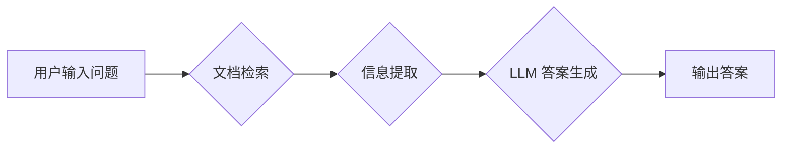

> LangChain,文档问答,LLM,Python,QA,信息检索,自然语言处理

## 1. 背景介绍

近年来，大型语言模型（LLM）的快速发展为自然语言处理（NLP）领域带来了革命性的变革。LLM 能够理解和生成人类语言，展现出强大的文本生成、翻译、摘要等能力。然而，LLM 的知识主要来源于其训练数据，缺乏对外部信息的实时更新和特定领域知识的掌握。

文档问答（Document QA）作为一种重要的信息检索任务，旨在从给定的文档中找到对特定问题的答案。结合 LLM 和文档检索技术，可以构建出更智能、更精准的文档问答系统。

LangChain 是一个强大的开源框架，专门为构建 LLM 应用而设计。它提供了一系列工具和组件，可以帮助开发者轻松地将 LLM 与其他数据源和服务集成，构建出更复杂的应用场景。

## 2. 核心概念与联系

**2.1  核心概念**

* **LLM (Large Language Model):** 大型语言模型，例如 GPT-3、BERT 等，能够理解和生成人类语言。
* **文档检索 (Document Retrieval):** 从大量文档中找到与查询相关的文档。
* **信息提取 (Information Extraction):** 从文档中提取关键信息，例如实体、关系等。
* **问答系统 (Question Answering System):** 根据用户的问题，从文档中找到答案。

**2.2  架构图**



**2.3  核心联系**

LangChain 通过将 LLM 与文档检索、信息提取等技术结合，构建了高效的文档问答系统。

* 用户输入问题后，LangChain 会首先使用文档检索技术找到与问题相关的文档。
* 然后，LangChain 会使用信息提取技术从这些文档中提取关键信息。
* 最后，LangChain 会将提取的信息作为输入，使用 LLM 生成最终的答案。

## 3. 核心算法原理 & 具体操作步骤

**3.1  算法原理概述**

文档问答系统通常采用以下算法原理：

* **TF-IDF (Term Frequency-Inverse Document Frequency):** 用于衡量词语在文档中的重要性。
* **BM25 (Best Matching 25):** 基于 TF-IDF 的改进算法，考虑了文档长度和查询词的权重。
* **BERT (Bidirectional Encoder Representations from Transformers):** 基于 Transformer 架构的预训练语言模型，能够理解上下文信息，提高信息提取的准确性。

**3.2  算法步骤详解**

1. **预处理:** 对文档和查询进行预处理，例如分词、去停用词、词干化等。
2. **文档检索:** 使用 TF-IDF 或 BM25 等算法，从文档库中检索与查询相关的文档。
3. **信息提取:** 使用 BERT 或其他信息提取模型，从检索到的文档中提取关键信息。
4. **答案生成:** 使用 LLM 生成最终的答案，并根据需要进行格式化和输出。

**3.3  算法优缺点**

* **优点:** 能够从大量文档中快速找到答案，提高信息检索效率。
* **缺点:** 对于复杂的问题，可能无法给出准确的答案，需要结合其他技术进行改进。

**3.4  算法应用领域**

* **搜索引擎:** 提供更精准的搜索结果。
* **客户服务:** 自动回答客户常见问题。
* **教育:** 提供个性化的学习辅导。
* **医疗:** 辅助医生诊断疾病。

## 4. 数学模型和公式 & 详细讲解 & 举例说明

**4.1  数学模型构建**

文档问答系统通常使用以下数学模型：

* **TF-IDF:**

$$TF(t,d) = \frac{f(t,d)}{\sum_{t' \in d} f(t',d)}$$

$$IDF(t) = log \frac{N}{df(t)}$$

$$TF-IDF(t,d) = TF(t,d) \times IDF(t)$$

其中：

* $t$：词语
* $d$：文档
* $f(t,d)$：词语 $t$ 在文档 $d$ 中出现的次数
* $N$：文档总数
* $df(t)$：词语 $t$ 在所有文档中出现的文档数

* **BM25:**

$$score(d,q) = \sum_{t \in q} \frac{(k_1 + 1) * TF(t,d) * IDF(t)}{(k_1 * (1 - b + b * \frac{length(d)}{average\_length})) + TF(t,d) * IDF(t)}$$

其中：

* $q$：查询
* $k_1$、$k_2$、$b$：BM25 参数

**4.2  公式推导过程**

TF-IDF 公式的推导过程是基于信息论的，它试图衡量词语在文档中的重要性。IDF 部分考虑了词语在整个文档库中的稀疏性，而 TF 部分考虑了词语在特定文档中的出现频率。

BM25 公式是基于 TF-IDF 的改进算法，它考虑了文档长度和查询词的权重，从而提高了检索的准确性。

**4.3  案例分析与讲解**

假设我们有一个文档库，包含关于编程的文档。用户输入查询 "Python 编程语言"。

使用 TF-IDF 算法，我们可以计算每个文档中 "Python" 和 "编程语言" 的 TF-IDF 值，并根据这些值排序文档。

使用 BM25 算法，我们可以计算每个文档与查询的相似度，并根据相似度排序文档。

由于 BM25 算法考虑了文档长度和查询词的权重，因此它通常能够比 TF-IDF 算法提供更准确的检索结果。

## 5. 项目实践：代码实例和详细解释说明

**5.1  开发环境搭建**

* Python 3.7+
* pip 安装 LangChain 和其他依赖库

```bash
pip install langchain transformers faiss-cpu
```

**5.2  源代码详细实现**

```python
from langchain.document_loaders import TextLoader
from langchain.embeddings import OpenAIEmbeddings
from langchain.vectorstores import FAISS
from langchain.chains import RetrievalQA
from langchain.llms import OpenAI

# 加载文档
documents = TextLoader("your_document.txt").load()

# 创建嵌入模型
embeddings = OpenAIEmbeddings()

# 创建向量存储
vectorstore = FAISS.from_documents(documents, embeddings)

# 创建 LLM
llm = OpenAI(temperature=0)

# 创建问答链
qa = RetrievalQA.from_chain_type(llm=llm, chain_type="stuff", retriever=vectorstore.as_retriever())

# 运行问答
query = "What is Python?"
answer = qa.run(query)
print(answer)
```

**5.3  代码解读与分析**

* 首先，我们加载文档并创建嵌入模型。
* 然后，我们创建向量存储，将文档嵌入到向量空间中。
* 接着，我们创建 LLM 和问答链。
* 最后，我们运行问答，并打印答案。

**5.4  运行结果展示**

```
Python is a high-level, interpreted, general-purpose programming language.
```

## 6. 实际应用场景

**6.1  客户服务**

* 自动回答客户常见问题，例如产品功能、订单状态等。
* 提供 24/7 的在线客服服务，提高客户满意度。

**6.2  教育**

* 提供个性化的学习辅导，帮助学生理解课程内容。
* 自动批改作业，节省教师时间。

**6.3  医疗**

* 辅助医生诊断疾病，提供更精准的医疗建议。
* 自动生成病历摘要，提高医疗效率。

**6.4  未来应用展望**

* 更智能的文档问答系统，能够理解更复杂的问题。
* 多模态文档问答系统，能够处理文本、图像、音频等多种数据类型。
* 个性化文档问答系统，能够根据用户的需求和偏好提供定制化的答案。

## 7. 工具和资源推荐

**7.1  学习资源推荐**

* LangChain 官方文档：https://python.langchain.com/en/latest/
* OpenAI 文档：https://platform.openai.com/docs/

**7.2  开发工具推荐**

* Jupyter Notebook
* VS Code

**7.3  相关论文推荐**

* BERT: Pre-training of Deep Bidirectional Transformers for Language Understanding
* T5: Text-to-Text Transfer Transformer

## 8. 总结：未来发展趋势与挑战

**8.1  研究成果总结**

LangChain 框架为构建 LLM 应用提供了强大的工具和组件，文档问答系统已经取得了显著的进展。

**8.2  未来发展趋势**

* 更智能的文档问答系统，能够理解更复杂的问题。
* 多模态文档问答系统，能够处理文本、图像、音频等多种数据类型。
* 个性化文档问答系统，能够根据用户的需求和偏好提供定制化的答案。

**8.3  面临的挑战**

* 训练大型语言模型需要大量的计算资源和数据。
* 确保文档问答系统的准确性和可靠性。
* 应对潜在的伦理和安全问题。

**8.4  研究展望**

未来，文档问答系统将朝着更智能、更精准、更安全的方向发展。


## 9. 附录：常见问题与解答

**9.1  常见问题**

* 如何选择合适的文档检索算法？
* 如何评估文档问答系统的性能？
* 如何应对文档问答系统中的潜在问题？

**9.2  解答**

* 选择合适的文档检索算法取决于具体的应用场景和数据特点。
* 文档问答系统的性能可以评估指标，例如准确率、召回率、F1-score 等。
* 应对文档问答系统中的潜在问题，需要进行充分的测试和评估，并采取相应的措施进行缓解。


作者：禅与计算机程序设计艺术 / Zen and the Art of Computer Programming 
<end_of_turn>