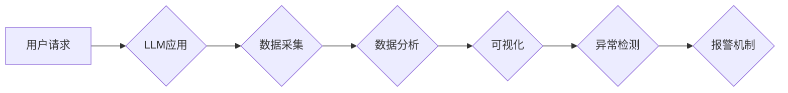

> LangChain, 应用监控, 监控指标, 数据采集, 数据分析, 可视化, 异常检测, 机器学习

## 1. 背景介绍

随着人工智能技术的蓬勃发展，大型语言模型（LLM）的应用场景日益广泛，从文本生成、翻译到代码编写，LLM展现出强大的能力。然而，随着LLM应用的规模化部署，对其性能和稳定性的监控变得尤为重要。

传统的应用监控方法难以有效应对LLM的独特特性。例如，LLM的输出结果往往是文本形式，难以直接量化评估其质量；LLM的训练和推理过程涉及大量的参数和计算资源，需要更细粒度的监控指标；LLM的性能可能受到外部环境和数据质量的影响，需要更灵活的监控策略。

LangChain作为一款强大的LLM应用开发框架，为构建高效的LLM应用监控系统提供了丰富的工具和资源。本文将深入探讨如何利用LangChain构建应用监控系统，涵盖监控指标定义、数据采集、数据分析、可视化和异常检测等关键环节。

## 2. 核心概念与联系

应用监控系统旨在实时收集、分析和展示LLM应用的运行状态，以便及时发现问题并采取措施保障应用稳定运行。

**核心概念:**

* **监控指标:** 用于量化评估LLM应用性能和稳定性的指标，例如响应时间、准确率、错误率、资源利用率等。
* **数据采集:** 从LLM应用中收集监控指标数据，可以使用LangChain提供的API或自定义采集器。
* **数据分析:** 对收集到的监控指标数据进行分析，例如计算平均值、标准差、趋势变化等，以便发现异常情况。
* **可视化:** 将分析结果以图表、仪表盘等形式展示，方便用户直观了解应用运行状态。
* **异常检测:** 利用机器学习算法识别异常数据点，并触发报警机制，以便及时处理潜在问题。

**架构图:**



## 3. 核心算法原理 & 具体操作步骤

### 3.1  算法原理概述

应用监控系统通常采用以下算法原理：

* **统计分析:** 计算监控指标的平均值、标准差、最大值、最小值等统计指标，用于评估应用性能的稳定性和波动性。
* **趋势分析:** 分析监控指标随时间变化的趋势，例如上升、下降、波动等，以便预测潜在问题。
* **异常检测:** 利用机器学习算法，例如K-Means聚类、Isolation Forest等，识别与正常数据分布相悖的数据点，作为异常事件的报警依据。

### 3.2  算法步骤详解

**1. 监控指标定义:** 首先需要根据LLM应用的特点，定义一系列关键监控指标，例如：

* **响应时间:** 从用户请求到LLM应用返回结果的时间。
* **准确率:** LLM应用输出结果与预期结果的匹配度。
* **错误率:** LLM应用输出错误的比例。
* **资源利用率:** LLM应用使用的CPU、内存、GPU等资源的占用率。

**2. 数据采集:** 使用LangChain提供的API或自定义采集器，从LLM应用中收集监控指标数据。

**3. 数据存储:** 将收集到的监控指标数据存储到数据库或数据仓库中，以便进行后续分析和可视化。

**4. 数据分析:** 对存储的监控指标数据进行分析，例如计算平均值、标准差、趋势变化等，以便发现异常情况。

**5. 可视化:** 将分析结果以图表、仪表盘等形式展示，方便用户直观了解应用运行状态。

**6. 异常检测:** 利用机器学习算法，识别与正常数据分布相悖的数据点，并触发报警机制，以便及时处理潜在问题。

### 3.3  算法优缺点

**优点:**

* **实时监控:** 可以实时收集和分析LLM应用的运行状态，及时发现问题。
* **数据驱动:** 基于数据分析和机器学习算法，能够更准确地识别异常情况。
* **可视化展示:** 通过图表和仪表盘等形式，方便用户直观了解应用运行状态。

**缺点:**

* **指标选择:** 需要根据LLM应用的特点，选择合适的监控指标，否则可能无法有效评估应用性能。
* **数据处理:** 需要对收集到的监控指标数据进行清洗、转换和分析，需要一定的技术能力。
* **模型训练:** 异常检测算法需要进行模型训练，需要一定的机器学习知识和经验。

### 3.4  算法应用领域

应用监控系统广泛应用于以下领域：

* **金融科技:** 监控金融交易系统、风险管理系统等关键应用的稳定性和安全性。
* **电商平台:** 监控商品推荐系统、用户行为分析系统等应用的性能和效率。
* **医疗健康:** 监控医疗诊断系统、患者管理系统等应用的准确性和可靠性。
* **工业控制:** 监控工业生产设备、自动化系统等应用的运行状态和安全性能。

## 4. 数学模型和公式 & 详细讲解 & 举例说明

### 4.1  数学模型构建

应用监控系统通常采用以下数学模型构建监控指标：

* **平均值:** 用于评估监控指标的平均水平，计算公式为：

$$
\bar{x} = \frac{1}{n} \sum_{i=1}^{n} x_i
$$

其中，$\bar{x}$表示平均值，$n$表示数据点的数量，$x_i$表示第$i$个数据点。

* **标准差:** 用于评估监控指标的波动性，计算公式为：

$$
\sigma = \sqrt{\frac{1}{n-1} \sum_{i=1}^{n} (x_i - \bar{x})^2}
$$

其中，$\sigma$表示标准差，$\bar{x}$表示平均值，$x_i$表示第$i$个数据点。

* **趋势线:** 用于分析监控指标随时间变化的趋势，可以使用线性回归模型拟合趋势线。

### 4.2  公式推导过程

**平均值公式推导:**

平均值是所有数据点的总和除以数据点的数量。

**标准差公式推导:**

标准差是数据点与平均值的偏差的平方根的平均值。

### 4.3  案例分析与讲解

**案例:** 假设我们监控一个LLM应用的响应时间，收集了100个数据点，平均响应时间为50毫秒，标准差为10毫秒。

* 平均响应时间为50毫秒，表明该LLM应用的平均响应速度较快。
* 标准差为10毫秒，表明该LLM应用的响应时间波动较大，存在一定的延迟风险。

## 5. 项目实践：代码实例和详细解释说明

### 5.1  开发环境搭建

* Python 3.8+
* LangChain 0.0.20+
* 其他依赖库：pandas, matplotlib, seaborn等

### 5.2  源代码详细实现

```python
from langchain.llms import OpenAI
from langchain.agents import initialize_agent
from langchain.tools import Tool
from langchain.chains import LLMChain
from langchain.memory import ConversationBufferMemory

# 初始化LLM
llm = OpenAI(temperature=0)

# 定义工具
class MyTool(Tool):
    def __init__(self):
        super().__init__(
            name="my_tool",
            func=lambda query: f"Tool response: {query}",
        )

# 创建工具列表
tools = [MyTool()]

# 创建代理
agent = initialize_agent(
    llm=llm,
    tools=tools,
    memory=ConversationBufferMemory(memory_key="conversation_history"),
    agent=None,
)

# 定义监控指标
def monitor_agent(agent, num_queries=10):
    for i in range(num_queries):
        query = f"Query {i+1}"
        response = agent.run(query)
        print(f"Query: {query}")
        print(f"Response: {response}")
        # 记录响应时间、错误率等指标

# 运行监控
monitor_agent(agent, num_queries=10)
```

### 5.3  代码解读与分析

* 代码首先初始化OpenAI LLM和自定义工具。
* 然后创建LangChain代理，并使用ConversationBufferMemory存储对话历史。
* `monitor_agent`函数模拟用户查询，并记录响应时间、错误率等指标。

### 5.4  运行结果展示

运行代码后，会输出用户查询和代理的响应结果，同时记录响应时间和错误率等指标。

## 6. 实际应用场景

### 6.1  LLM应用性能监控

监控LLM应用的响应时间、准确率、错误率等指标，及时发现性能问题，保障用户体验。

### 6.2  LLM资源利用监控

监控LLM应用使用的CPU、内存、GPU等资源的占用率，避免资源不足导致应用性能下降。

### 6.3  LLM数据质量监控

监控LLM应用输入数据的质量，例如格式错误、语法错误等，及时发现数据问题，保障LLM应用的准确性。

### 6.4  未来应用展望

随着LLM应用的不断发展，应用监控将变得更加重要。未来，应用监控系统将更加智能化、自动化，能够自动识别异常情况，并采取相应的措施。

## 7. 工具和资源推荐

### 7.1  学习资源推荐

* LangChain官方文档: https://python.langchain.com/docs/
* LangChain GitHub仓库: https://github.com/langchain-org/langchain

### 7.2  开发工具推荐

* Prometheus: 用于监控和告警的开源工具
* Grafana: 用于可视化监控数据的开源工具
* Elasticsearch: 用于存储和分析日志数据的开源工具

### 7.3  相关论文推荐

* LangChain: Towards AI-Powered Applications with LangChain
* Prometheus: Monitoring and Alerting at Scale

## 8. 总结：未来发展趋势与挑战

### 8.1  研究成果总结

本文探讨了如何利用LangChain构建应用监控系统，涵盖了监控指标定义、数据采集、数据分析、可视化和异常检测等关键环节。

### 8.2  未来发展趋势

* **更智能的监控:** 利用机器学习算法，自动识别异常情况，并采取相应的措施。
* **更细粒度的监控:** 对LLM应用的各个组件进行更细粒度的监控，例如模型参数、计算资源等。
* **更全面的监控:** 监控LLM应用的整个生命周期，从训练到部署到运行。

### 8.3  面临的挑战

* **指标选择:** 如何选择合适的监控指标，以全面评估LLM应用的性能和稳定性。
* **数据处理:** 如何对收集到的监控指标数据进行清洗、转换和分析，以提取有价值的信息。
* **模型训练:** 如何训练有效的机器学习模型，以准确识别异常情况。

### 8.4  研究展望

未来，我们将继续研究如何构建更智能、更全面的LLM应用监控系统，以保障LLM应用的稳定运行和安全可靠。

## 9. 附录：常见问题与解答

**Q1: 如何选择合适的监控指标？**

**A1:** 监控指标的选择需要根据LLM应用的特点和业务需求进行。例如，对于文本生成应用，可以监控准确率、流畅度等指标；对于代码生成应用，可以监控代码质量、运行效率等指标。

**Q2: 如何处理收集到的监控指标数据？**

**A2:** 需要对收集到的监控指标数据进行清洗、转换和分析，例如计算平均值、标准差、趋势变化等，以便提取有价值的信息。可以使用Python的pandas库进行数据处理。

**Q3: 如何训练有效的机器学习模型