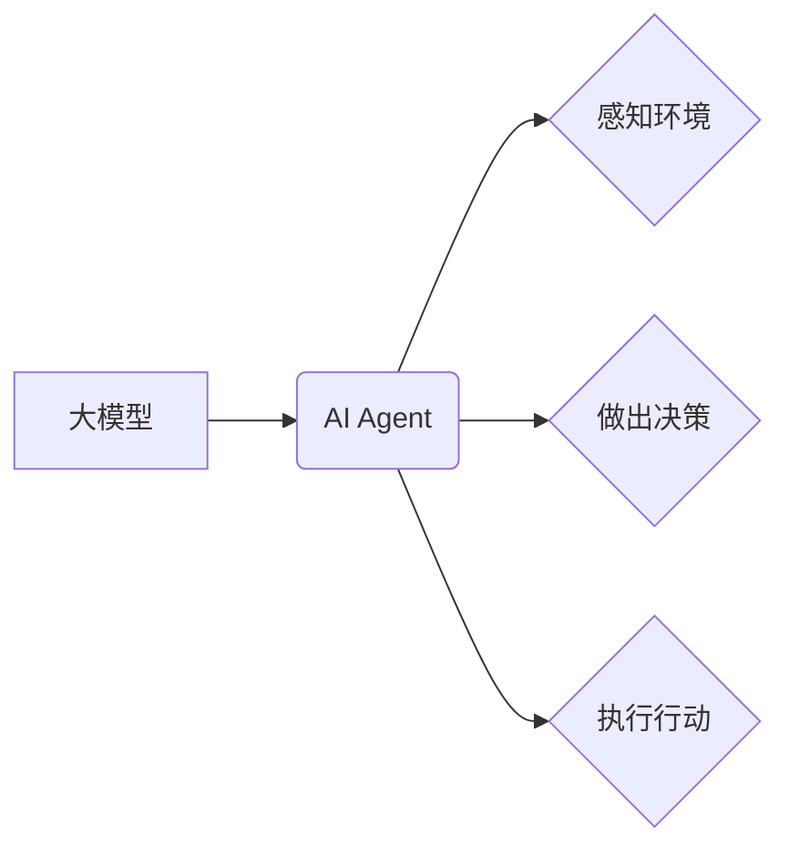

> 大模型、AI Agent、Gartner预测、应用开发、自然语言处理、计算机视觉、机器学习、深度学习、数据分析

## 1. 背景介绍

近年来，人工智能（AI）技术取得了飞速发展，特别是大模型的出现，为AI应用带来了革命性的变革。大模型是指参数规模庞大、训练数据海量的人工智能模型，具备强大的泛化能力和学习能力，能够在自然语言处理、计算机视觉、机器翻译等多个领域取得突破性进展。

Gartner，全球领先的IT研究和咨询公司，在2023年发布了关于大模型应用开发的8项重要预测，指出大模型将深刻改变企业运营模式和用户体验。这些预测涵盖了大模型的应用场景、技术发展趋势、安全风险以及伦理挑战等方面，为企业和开发者提供了重要的参考和指导。

## 2. 核心概念与联系

### 2.1 大模型

大模型是指参数规模庞大、训练数据海量的人工智能模型，通常拥有数十亿甚至数千亿个参数。其强大的学习能力和泛化能力使其能够在各种复杂任务中表现出色，例如：

* **自然语言处理 (NLP)：** 文本生成、机器翻译、问答系统、情感分析等。
* **计算机视觉 (CV)：** 图像识别、物体检测、图像分割、视频分析等。
* **语音识别和合成：** 语音转文本、文本转语音、语音助手等。

### 2.2 AI Agent

AI Agent是指能够感知环境、做出决策并执行行动的智能体。它可以是软件程序、机器人或其他智能系统。AI Agent通常基于机器学习算法，能够通过学习数据并不断优化策略来完成任务。

大模型为AI Agent的开发提供了强大的工具和基础。大模型可以提供丰富的知识和理解能力，帮助AI Agent更好地感知环境和理解用户需求。同时，大模型的强大的推理和决策能力，可以使AI Agent做出更智能和高效的行动。

### 2.3 核心概念关系

大模型和AI Agent之间存在着密切的联系。大模型为AI Agent提供了强大的能力，而AI Agent则将大模型的知识和能力应用于实际场景中。



## 3. 核心算法原理 & 具体操作步骤

### 3.1 算法原理概述

大模型的训练主要基于深度学习算法，特别是Transformer模型架构。Transformer模型通过自注意力机制，能够捕捉文本序列中的长距离依赖关系，从而实现更准确的理解和生成文本。

### 3.2 算法步骤详解

1. **数据预处理:** 将原始文本数据进行清洗、分词、标记等预处理操作，使其能够被模型理解和学习。
2. **模型构建:** 根据预定的任务目标，选择合适的Transformer模型架构，并设置模型参数。
3. **模型训练:** 使用预处理后的数据训练模型，通过反向传播算法不断优化模型参数，使其能够准确地完成预定的任务。
4. **模型评估:** 使用测试数据评估模型的性能，并根据评估结果进行模型调优。
5. **模型部署:** 将训练好的模型部署到实际应用场景中，例如聊天机器人、文本生成工具等。

### 3.3 算法优缺点

**优点:**

* 强大的泛化能力：大模型能够在未见过的文本数据上表现出色。
* 丰富的知识表示：大模型能够学习和理解大量的文本知识。
* 高效的文本处理能力：大模型能够快速地完成文本生成、翻译、摘要等任务。

**缺点:**

* 训练成本高：大模型的训练需要大量的计算资源和时间。
* 参数量大：大模型的参数量庞大，需要大量的存储空间。
* 缺乏可解释性：大模型的决策过程难以理解，缺乏透明度。

### 3.4 算法应用领域

大模型的应用领域非常广泛，包括：

* **自然语言处理:** 文本生成、机器翻译、问答系统、情感分析、文本摘要等。
* **计算机视觉:** 图像识别、物体检测、图像分割、视频分析等。
* **语音识别和合成:** 语音转文本、文本转语音、语音助手等。
* **代码生成:** 自动生成代码、代码修复、代码注释等。
* **科学研究:** 药物研发、材料科学、天文学等。

## 4. 数学模型和公式 & 详细讲解 & 举例说明

### 4.1 数学模型构建

大模型的训练基于深度学习算法，其核心是构建复杂的数学模型来模拟人类大脑的学习过程。

Transformer模型的数学模型主要包括以下几个部分：

* **嵌入层:** 将文本单词映射到低维向量空间，以便模型能够理解单词的语义信息。
* **自注意力层:** 捕捉文本序列中的长距离依赖关系，使模型能够理解单词之间的上下文关系。
* **前馈神经网络层:** 对每个单词的嵌入向量进行非线性变换，提取更深层次的语义特征。
* **多头注意力层:** 使用多个自注意力层，并行处理文本序列，提高模型的表达能力。
* **输出层:** 将模型的输出向量映射到目标任务的输出空间，例如预测下一个单词、分类文本等。

### 4.2 公式推导过程

Transformer模型的数学公式推导过程非常复杂，涉及到线性变换、激活函数、softmax函数等多种数学运算。

例如，自注意力机制的核心公式是：

$$
Attention(Q, K, V) = \frac{exp(Q \cdot K^T / \sqrt{d_k})}{exp(Q \cdot K^T / \sqrt{d_k})} \cdot V
$$

其中，Q、K、V分别代表查询矩阵、键矩阵和值矩阵，$d_k$代表键向量的维度。

### 4.3 案例分析与讲解

我们可以通过一个简单的例子来理解自注意力机制的工作原理。

假设我们有一个文本序列：“我爱学习编程”。

* 查询矩阵Q：表示当前单词需要关注的上下文信息。
* 键矩阵K：表示每个单词的语义特征。
* 值矩阵V：表示每个单词的语义信息。

通过自注意力机制，模型可以计算出每个单词与其他单词之间的注意力权重，并根据这些权重加权求和，得到每个单词的上下文表示。

例如，对于单词“学习”，模型会计算出它与“我”、“爱”和“编程”之间的注意力权重，并根据这些权重加权求和，得到“学习”的上下文表示。

## 5. 项目实践：代码实例和详细解释说明

### 5.1 开发环境搭建

为了开发大模型应用，我们需要搭建一个合适的开发环境。

* **操作系统:** Linux或macOS
* **编程语言:** Python
* **深度学习框架:** TensorFlow或PyTorch
* **硬件环境:** GPU加速器

### 5.2 源代码详细实现

以下是一个使用PyTorch框架实现文本生成任务的大模型代码示例：

```python
import torch
import torch.nn as nn

class TextGenerator(nn.Module):
    def __init__(self, vocab_size, embedding_dim, hidden_dim):
        super(TextGenerator, self).__init__()
        self.embedding = nn.Embedding(vocab_size, embedding_dim)
        self.lstm = nn.LSTM(embedding_dim, hidden_dim)
        self.fc = nn.Linear(hidden_dim, vocab_size)

    def forward(self, x):
        embedded = self.embedding(x)
        output, (hidden, cell) = self.lstm(embedded)
        output = self.fc(output[:, -1, :])
        return output

# 实例化模型
model = TextGenerator(vocab_size=10000, embedding_dim=128, hidden_dim=256)

# 定义损失函数和优化器
criterion = nn.CrossEntropyLoss()
optimizer = torch.optim.Adam(model.parameters())

# 训练模型
for epoch in range(num_epochs):
    for batch in train_data:
        # 前向传播
        output = model(batch)
        loss = criterion(output, batch_labels)

        # 反向传播
        optimizer.zero_grad()
        loss.backward()

        # 更新参数
        optimizer.step()

# 保存模型
torch.save(model.state_dict(), 'text_generator.pth')
```

### 5.3 代码解读与分析

这段代码实现了文本生成任务的大模型。

* **模型结构:** 使用了嵌入层、LSTM层和全连接层组成。
* **训练过程:** 使用交叉熵损失函数和Adam优化器进行训练。
* **模型保存:** 使用`torch.save()`函数保存训练好的模型参数。

### 5.4 运行结果展示

训练好的模型可以用于生成新的文本。

```python
# 加载模型
model.load_state_dict(torch.load('text_generator.pth'))

# 生成文本
input_text = "我爱"
generated_text = model.generate_text(input_text)
print(generated_text)
```

## 6. 实际应用场景

### 6.1 聊天机器人

大模型可以用于构建更智能、更自然的聊天机器人，能够理解用户的意图，并提供更准确、更相关的回复。

### 6.2 文本生成

大模型可以用于生成各种类型的文本，例如文章、故事、诗歌、代码等。

### 6.3 机器翻译

大模型可以用于实现更准确、更流畅的机器翻译，能够跨越语言障碍，促进全球交流。

### 6.4 数据分析

大模型可以用于分析海量文本数据，提取关键信息，发现隐藏的模式和趋势。

### 6.5 个性化推荐

大模型可以根据用户的兴趣和偏好，提供个性化的商品、服务和内容推荐。

### 6.4 未来应用展望

大模型的应用前景广阔，未来将应用于更多领域，例如：

* **医疗保健:** 辅助医生诊断疾病、预测患者风险、研发新药。
* **教育:** 个性化学习、智能辅导、自动批改作业。
* **金融:** 风险评估、欺诈检测、投资决策。
* **法律:** 法律文本分析、合同审查、法律意见。

## 7. 工具和资源推荐

### 7.1 学习资源推荐

* **书籍:**
    * 《深度学习》
    * 《自然语言处理》
    * 《Transformer模型》
* **在线课程:**
    * Coursera
    * edX
    * Udacity
* **博客和论坛:**
    * TensorFlow博客
    * PyTorch博客
    * Kaggle论坛

### 7.2 开发工具推荐

* **深度学习框架:** TensorFlow、PyTorch
* **文本处理工具:** NLTK、spaCy
* **数据可视化工具:** Matplotlib、Seaborn

### 7.3 相关论文推荐

* 《Attention Is All You Need》
* 《BERT: Pre-training of Deep Bidirectional Transformers for Language Understanding》
* 《GPT-3: Language Models are Few-Shot Learners》

## 8. 总结：未来发展趋势与挑战

### 8.1 研究成果总结

近年来，大模型在自然语言处理、计算机视觉等领域取得了显著进展，为人工智能的应用带来了新的机遇。

### 8.2 未来发展趋势

* **模型规模继续扩大:** 大模型的规模将继续扩大，参数量将达到数万亿甚至数千亿级别。
* **多模态学习:** 大模型将融合文本、图像、音频等多模态数据，实现更全面的理解和生成。
* **可解释性增强:** 研究人员将致力于提高大模型的可解释性，使其决策过程更加透明和可理解。
* **边缘计算:** 大模型将部署到边缘设备上，实现更低延迟、更高效率的应用。

### 8.3 面临