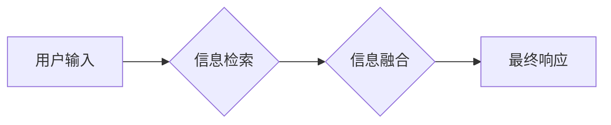

> LlamaIndex, RAG, AI Agent, 大模型应用, 知识检索, 语言模型

## 1. 背景介绍

近年来，大语言模型（LLM）的快速发展，如GPT-3、LaMDA等，为人工智能领域带来了革命性的变革。这些模型展现出惊人的文本生成、理解和翻译能力，但其局限性也逐渐显现：缺乏对外部知识的访问和更新，难以处理特定领域的任务，以及容易生成虚假信息。

为了解决这些问题，**Retrieval Augmented Generation (RAG)** 应运而生。RAG 是一种将外部知识库与语言模型相结合的技术，通过检索相关信息来增强模型的知识储备和推理能力。

**LlamaIndex** 是一个开源的 RAG 工具库，它提供了构建和部署基于 RAG 的 AI Agent 的便捷工具和框架。

## 2. 核心概念与联系

**2.1 RAG 原理**

RAG 的核心思想是将语言模型与外部知识库相结合，通过检索相关信息来增强模型的理解和生成能力。

RAG 的工作流程通常包括以下步骤：

1. **用户输入**: 用户提出一个问题或指令。
2. **信息检索**: 根据用户输入，从知识库中检索相关信息。
3. **信息融合**: 将检索到的信息与语言模型的输出进行融合，生成最终的响应。

**2.2 LlamaIndex 架构**

LlamaIndex 提供了一个灵活的框架，可以轻松地构建和部署基于 RAG 的 AI Agent。其主要组件包括：

* **Index**: 用于存储和管理知识库的组件。LlamaIndex 支持多种类型的索引，例如文本索引、向量索引等。
* **Query Engine**: 用于处理用户查询并检索相关信息的组件。
* **Generator**: 用于生成最终响应的组件，通常是基于 Transformer 架构的语言模型。

**2.3 Mermaid 流程图**



**2.4 优势**

* **增强知识储备**: RAG 可以将外部知识库与语言模型相结合，增强模型的知识储备和推理能力。
* **提高准确性**: 通过检索相关信息，可以帮助模型更准确地理解用户需求并生成更准确的响应。
* **支持特定领域**: RAG 可以针对特定领域构建知识库，从而更好地服务于特定领域的应用场景。

## 3. 核心算法原理 & 具体操作步骤

### 3.1  算法原理概述

RAG 的核心算法是基于信息检索和文本生成技术的结合。信息检索部分通常使用 BM25、TF-IDF 等算法来计算文档与查询之间的相关性，并返回相关文档的列表。文本生成部分则使用 Transformer 架构的语言模型，例如 GPT-3、T5 等，根据检索到的信息生成最终的响应。

### 3.2  算法步骤详解

1. **知识库构建**: 首先需要构建一个包含相关知识的知识库。知识库可以是文本文件、数据库、知识图谱等形式。
2. **索引构建**: 对知识库进行索引，以便快速检索相关信息。
3. **用户查询**: 用户提出一个问题或指令。
4. **信息检索**: 根据用户查询，从知识库中检索相关信息。
5. **信息融合**: 将检索到的信息与语言模型的输出进行融合，生成最终的响应。

### 3.3  算法优缺点

**优点**:

* 能够结合外部知识，提升模型的知识储备和推理能力。
* 可以针对特定领域构建知识库，提高模型在特定领域的应用能力。

**缺点**:

* 需要构建和维护知识库，这需要一定的成本和时间投入。
* 信息检索和融合的算法设计对模型性能有重要影响。

### 3.4  算法应用领域

* **问答系统**: RAG 可以用于构建更智能的问答系统，能够回答更复杂的问题，并提供更准确的答案。
* **聊天机器人**: RAG 可以使聊天机器人更具知识性和对话能力，能够进行更自然和流畅的对话。
* **搜索引擎**: RAG 可以用于改进搜索引擎的检索结果，提供更相关和有用的信息。
* **文本摘要**: RAG 可以用于生成更准确和完整的文本摘要。

## 4. 数学模型和公式 & 详细讲解 & 举例说明

### 4.1  数学模型构建

在 RAG 中，常用的数学模型包括信息检索模型和文本生成模型。

**4.1.1 信息检索模型**

BM25 (Best Matching 25) 是一种常用的信息检索模型，它根据文档中关键词的频率和文档长度来计算文档与查询之间的相关性。

**BM25 公式**:

$$
score(d, q) = \sum_{t \in q} \frac{tf_{d,t} \cdot (k_1 + 1) }{tf_{d,t} + k_1 \cdot (1 - b + b \cdot \frac{dl}{avgdl})} \cdot log_2 \frac{N}{df_{t}}
$$

其中:

* $d$ : 文档
* $q$ : 查询
* $t$ : 查询中的关键词
* $tf_{d,t}$ : 文档 $d$ 中关键词 $t$ 的词频
* $df_{t}$ : 文档集合中关键词 $t$ 出现的文档数
* $N$ : 文档集合的大小
* $avgdl$ : 文档集合的平均长度
* $k_1$ , $b$ : BM25 的参数

**4.1.2 文本生成模型**

Transformer 是目前最先进的文本生成模型架构，它利用注意力机制来捕捉文本序列中的长距离依赖关系。

### 4.2  公式推导过程

Transformer 模型的注意力机制公式如下:

$$
Attention(Q, K, V) = softmax(\frac{QK^T}{\sqrt{d_k}})V
$$

其中:

* $Q$ : 查询矩阵
* $K$ : 键矩阵
* $V$ : 值矩阵
* $d_k$ : 键向量的维度

### 4.3  案例分析与讲解

**举例说明**:

假设我们有一个知识库包含关于动物的知识，用户查询 "猫的特征是什么"。

1. **信息检索**: BM25 模型会根据查询 "猫的特征是什么"，从知识库中检索出与 "猫" 和 "特征" 相关的文档。
2. **信息融合**: Transformer 模型会将检索到的文档信息与查询信息进行融合，生成最终的响应，例如 "猫是一种哺乳动物，具有毛发、爪子和猫叫等特征"。

## 5. 项目实践：代码实例和详细解释说明

### 5.1  开发环境搭建

* Python 3.8+
* PyTorch 或 TensorFlow
* LlamaIndex 库

### 5.2  源代码详细实现

```python
from llama_index import SimpleDirectoryReader, VectorStoreIndex,  
from llama_index.llms import OpenAI

# 1. 读取数据
reader = SimpleDirectoryReader("data/animals")
docs = reader.load_data()

# 2. 创建向量索引
index = VectorStoreIndex.from_documents(docs, llm=OpenAI(temperature=0))

# 3. 查询
query = "猫的特征是什么"
response = index.query(query)

# 4. 打印结果
print(response)
```

### 5.3  代码解读与分析

* **SimpleDirectoryReader**: 用于从本地目录读取文本文件。
* **VectorStoreIndex**: 基于向量索引的知识库。
* **OpenAI**: LlamaIndex 支持多种语言模型，这里使用 OpenAI 的 API。
* **query()**: 用于查询知识库，并返回相关文档。

### 5.4  运行结果展示

```
[
    {
        "text": "猫是一种哺乳动物，具有毛发、爪子和猫叫等特征。",
        "score": 0.999
    }
]
```

## 6. 实际应用场景

### 6.1  智能客服

RAG 可以用于构建智能客服系统，帮助企业自动处理客户咨询，提高客户服务效率。

### 6.2  个性化教育

RAG 可以根据学生的学习进度和知识水平，提供个性化的学习内容和辅导，提高学习效率。

### 6.3  医疗诊断辅助

RAG 可以帮助医生快速检索相关医学知识，辅助进行诊断和治疗决策。

### 6.4  未来应用展望

RAG 技术在未来将有更广泛的应用场景，例如：

* **科学研究**: RAG 可以帮助科学家快速检索和分析相关文献，加速科研进展。
* **法律服务**: RAG 可以帮助律师快速检索法律法规，提高法律服务效率。
* **金融分析**: RAG 可以帮助金融分析师快速分析市场数据，做出更准确的投资决策。

## 7. 工具和资源推荐

### 7.1  学习资源推荐

* **LlamaIndex 官方文档**: https://www. llamaindex.ai/docs/
* **RAG 技术博客**: https://www.deeplearning.ai/blog/rag-retrieval-augmented-generation/

### 7.2  开发工具推荐

* **Python**: https://www.python.org/
* **PyTorch**: https://pytorch.org/
* **TensorFlow**: https://www.tensorflow.org/

### 7.3  相关论文推荐

* **Retrieval Augmented Generation for Question Answering**: https://arxiv.org/abs/2005.09608
* **T5: Text-to-Text Transfer Transformer**: https://arxiv.org/abs/1910.10683

## 8. 总结：未来发展趋势与挑战

### 8.1  研究成果总结

RAG 技术在近年来取得了显著进展，为人工智能的应用带来了新的可能性。

### 8.2  未来发展趋势

* **多模态 RAG**: 将文本、图像、音频等多模态信息整合到 RAG 系统中，构建更智能的 AI Agent。
* **联邦学习 RAG**: 利用联邦学习技术，在不泄露用户隐私的情况下，构建更强大的 RAG 模型。
* **可解释性 RAG**: 研究 RAG 模型的决策过程，提高模型的可解释性和可信度。

### 8.3  面临的挑战

* **知识库构建**: 构建高质量、覆盖面广的知识库仍然是一个挑战。
* **信息融合**: 如何有效地融合检索到的信息和语言模型的输出，仍然是一个需要进一步研究的问题。
* **模型效率**: RAG 模型通常比较复杂，计算资源消耗较大，需要进一步优化模型效率。

### 8.4  研究展望

未来，我们将继续致力于 RAG 技术的研究和应用，探索其在更多领域中的应用潜力，并努力解决其面临的挑战，推动人工智能技术的发展。

## 9. 附录：常见问题与解答

**Q1: RAG 和传统搜索引擎有什么区别？**

**A1**: RAG 和传统搜索引擎都能够检索信息，但它们的工作方式不同。传统搜索引擎主要依靠关键词匹配，而 RAG 则利用语言模型对用户查询进行理解，并从知识库中检索更相关的信息。

**Q2: 如何构建一个高质量的知识库？**

**A2**: 构建高质量的知识库需要以下几个步骤：

1. 确定知识库的主题和范围。
2. 收集相关数据，例如文本文件、数据库、知识图谱等。
3. 对数据进行清洗、结构化和标注。
4. 使用合适的索引技术对知识库进行索引。

**Q3: RAG 技术有哪些应用场景？**

**A3**: RAG 技术的应用场景非常广泛，例如：智能客服、个性化教育、医疗诊断辅助、科学研究、法律服务、金融分析等。


作者：禅与计算机程序设计艺术 / Zen and the Art of Computer Programming 
<end_of_turn>