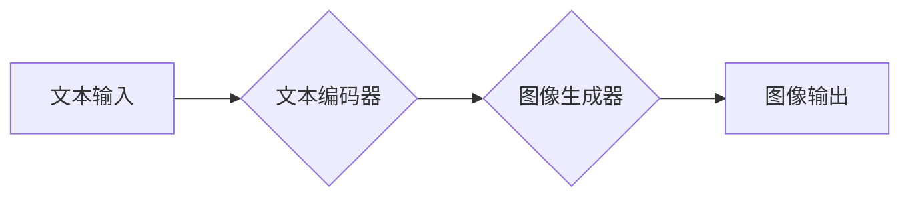

> 大模型、OpenAI API、图片生成、AI Agent、DALL-E 2、文本到图像、机器学习、深度学习

## 1. 背景介绍

近年来，人工智能（AI）技术取得了飞速发展，特别是深度学习的突破，使得大模型在图像生成领域展现出强大的潜力。OpenAI推出的DALL-E 2模型就是一个里程碑式的成就，它能够根据文本描述生成逼真的图像，为创意工作、设计和娱乐等领域带来了革命性的改变。

传统的图像生成方法主要依赖于规则和模板，难以生成多样化、高质量的图像。而大模型通过学习海量图像数据和文本数据，能够捕捉图像和文本之间的复杂关系，从而实现文本到图像的生成。DALL-E 2正是基于Transformer架构的大模型，它利用强大的编码解码机制，将文本描述编码成向量表示，然后解码生成相应的图像。

## 2. 核心概念与联系

### 2.1  大模型

大模型是指参数量巨大、训练数据量庞大的深度学习模型。它们通常拥有数十亿甚至数千亿个参数，能够学习到更复杂的知识和模式。大模型在自然语言处理、计算机视觉、语音识别等领域取得了突破性的进展。

### 2.2  OpenAI API

OpenAI API是OpenAI公司提供的开放式接口，允许开发者访问其强大的AI模型，包括DALL-E 2、GPT-3等。通过API，开发者可以轻松地将这些模型集成到自己的应用程序中，无需自己训练和部署模型。

### 2.3  文本到图像生成

文本到图像生成是指根据文本描述生成图像的技术。它需要模型能够理解文本语义，并将其映射到相应的图像内容。DALL-E 2是目前最先进的文本到图像生成模型之一，它能够生成高质量、逼真的图像，并支持多种文本描述风格。

**Mermaid 流程图**



## 3. 核心算法原理 & 具体操作步骤

### 3.1  算法原理概述

DALL-E 2基于Transformer架构，它利用编码器-解码器结构来实现文本到图像的生成。

* **编码器:** 将文本描述编码成一个向量表示，捕捉文本语义和结构信息。
* **解码器:** 根据编码后的文本向量，生成图像像素信息。

DALL-E 2还引入了 CLIP 模型，它能够将图像和文本进行关联，帮助模型更好地理解文本描述和图像内容之间的关系。

### 3.2  算法步骤详解

1. **文本预处理:** 将输入的文本描述进行预处理，例如分词、词干提取等，以便模型更好地理解文本内容。
2. **文本编码:** 使用编码器将预处理后的文本描述编码成一个向量表示，该向量包含文本语义和结构信息。
3. **图像生成:** 使用解码器根据编码后的文本向量生成图像像素信息。解码器会根据文本向量生成一系列的图像像素，并逐步生成完整的图像。
4. **图像后处理:** 对生成的图像进行后处理，例如去噪、锐化等，以提高图像质量。

### 3.3  算法优缺点

**优点:**

* 生成高质量、逼真的图像。
* 支持多种文本描述风格。
* 可以生成多种图像视角和角度。

**缺点:**

* 计算资源消耗较大。
* 训练数据量庞大。
* 可能存在生成偏见或不准确的图像。

### 3.4  算法应用领域

* **创意设计:** 生成创意插画、海报、logo等。
* **游戏开发:** 生成游戏场景、角色、道具等。
* **影视制作:** 生成电影特效、场景背景等。
* **教育培训:** 生成教学素材、演示动画等。

## 4. 数学模型和公式 & 详细讲解 & 举例说明

### 4.1  数学模型构建

DALL-E 2的数学模型主要基于Transformer架构，它包含编码器和解码器两个部分。

* **编码器:** 使用多层Transformer模块，将文本描述编码成一个向量表示。每个Transformer模块包含自注意力机制和前馈神经网络。
* **解码器:** 使用多层Transformer模块，根据编码后的文本向量生成图像像素信息。解码器还包含一个图像生成头，用于将向量表示映射到图像像素。

### 4.2  公式推导过程

Transformer模块的核心是自注意力机制，它能够捕捉文本序列中不同词之间的关系。自注意力机制的计算公式如下：

$$
Attention(Q, K, V) = softmax(\frac{QK^T}{\sqrt{d_k}})V
$$

其中：

* $Q$：查询矩阵
* $K$：键矩阵
* $V$：值矩阵
* $d_k$：键向量的维度

### 4.3  案例分析与讲解

假设我们输入文本描述“一只可爱的猫在草地上玩耍”，DALL-E 2的编码器会将这个文本描述编码成一个向量表示，该向量包含了“猫”、“可爱”、“草地”、“玩耍”等关键词的信息以及它们之间的关系。然后，解码器会根据这个向量表示生成相应的图像像素信息，最终生成一张一只可爱的猫在草地上玩耍的图像。

## 5. 项目实践：代码实例和详细解释说明

### 5.1  开发环境搭建

* Python 3.7+
* PyTorch 1.7+
* OpenAI API密钥

### 5.2  源代码详细实现

```python
import openai

# 设置OpenAI API密钥
openai.api_key = "YOUR_API_KEY"

# 定义文本描述
prompt = "一只可爱的猫在草地上玩耍"

# 使用OpenAI API生成图像
response = openai.Image.create(
    prompt=prompt,
    n=1,
    size="1024x1024",
)

# 获取生成的图像链接
image_url = response["data"][0]["url"]

# 打印图像链接
print(image_url)
```

### 5.3  代码解读与分析

* `openai.api_key = "YOUR_API_KEY"`: 设置OpenAI API密钥，用于访问OpenAI API。
* `prompt = "一只可爱的猫在草地上玩耍"`: 定义文本描述，用于生成图像。
* `openai.Image.create(...)`: 使用OpenAI API的`Image.create()`方法生成图像。
* `n=1`: 生成一张图像。
* `size="1024x1024"`: 设置图像尺寸为1024x1024像素。
* `response["data"][0]["url"]`: 获取生成的图像链接。

### 5.4  运行结果展示

运行代码后，将会打印出生成的图像链接。您可以点击链接查看生成的图像。

## 6. 实际应用场景

### 6.1  创意设计

DALL-E 2可以帮助设计师快速生成创意插画、海报、logo等，节省设计时间和成本。

### 6.2  游戏开发

DALL-E 2可以帮助游戏开发者生成游戏场景、角色、道具等，丰富游戏内容和视觉效果。

### 6.3  影视制作

DALL-E 2可以帮助影视制作人员生成电影特效、场景背景等，提升影片制作质量。

### 6.4  未来应用展望

随着大模型技术的不断发展，DALL-E 2等文本到图像生成模型将有更广泛的应用场景，例如：

* **个性化定制:** 根据用户的需求生成个性化的图像，例如定制服装、家居装饰等。
* **虚拟现实和增强现实:** 生成虚拟场景和增强现实内容，为用户提供沉浸式的体验。
* **教育和培训:** 生成互动式教学素材，提高学习效率。

## 7. 工具和资源推荐

### 7.1  学习资源推荐

* **OpenAI官方文档:** https://platform.openai.com/docs/api-reference/images
* **DALL-E 2研究论文:** https://arxiv.org/abs/2204.06125

### 7.2  开发工具推荐

* **Python:** https://www.python.org/
* **PyTorch:** https://pytorch.org/

### 7.3  相关论文推荐

* **Attention Is All You Need:** https://arxiv.org/abs/1706.03762
* **BERT: Pre-training of Deep Bidirectional Transformers for Language Understanding:** https://arxiv.org/abs/1810.04805

## 8. 总结：未来发展趋势与挑战

### 8.1  研究成果总结

DALL-E 2等文本到图像生成模型取得了显著的进展，能够生成高质量、逼真的图像，并支持多种文本描述风格。这些模型的应用场景也越来越广泛，为创意设计、游戏开发、影视制作等领域带来了新的可能性。

### 8.2  未来发展趋势

* **模型规模和性能提升:** 未来大模型的规模和性能将会进一步提升，能够生成更加逼真、多样化的图像。
* **多模态生成:** 将文本、图像、音频等多种模态信息融合，实现多模态生成。
* **个性化定制:** 根据用户的需求生成个性化的图像，例如定制服装、家居装饰等。

### 8.3  面临的挑战

* **数据偏见和公平性:** 大模型的训练数据可能存在偏见，导致生成的图像也存在偏见。
* **伦理和安全问题:** 文本到图像生成模型可能被用于生成虚假信息或恶意内容，需要加强伦理和安全方面的研究。
* **计算资源消耗:** 大模型的训练和部署需要大量的计算资源，成本较高。

### 8.4  研究展望

未来，我们需要继续研究大模型的算法原理、训练方法和应用场景，并解决模型的伦理和安全问题，使其更好地服务于人类社会。

## 9. 附录：常见问题与解答

**Q1: 如何获取OpenAI API密钥？**

A1: 您可以访问OpenAI官网注册账号，然后申请API密钥。

**Q2: DALL-E 2的图像分辨率是多少？**

A2: DALL-E 2支持多种图像分辨率，您可以通过`size`参数指定图像尺寸。

**Q3: DALL-E 2可以生成视频吗？**

A3: 目前DALL-E 2只能生成静态图像，无法生成视频。

**Q4: DALL-E 2的训练数据是什么？**

A4: DALL-E 2的训练数据包括大量的图像和文本数据，具体内容OpenAI没有公开。

**Q5: DALL-E 2的开源吗？**

A5: 目前DALL-E 2不是开源的，只能通过OpenAI API访问。


作者：禅与计算机程序设计艺术 / Zen and the Art of Computer Programming 
<end_of_turn>