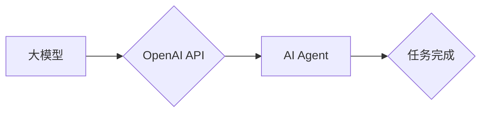

> OpenAI API, 大模型, AI Agent, 自然语言处理, 机器学习, 应用开发

## 1. 背景介绍

近年来，人工智能（AI）技术取得了飞速发展，特别是大模型的涌现，为我们带来了前所未有的机遇。大模型，是指参数量庞大、训练数据海量的人工智能模型，其强大的学习能力和泛化能力使其能够在各种任务中表现出色，例如文本生成、图像识别、机器翻译等。

OpenAI API 是由 OpenAI 公司开发的一套用于访问其大模型的接口，它为开发者提供了便捷的方式来利用大模型的强大能力，构建各种智能应用。

## 2. 核心概念与联系

### 2.1  大模型

大模型是指参数量庞大、训练数据海量的人工智能模型。其核心特点是：

* **参数量巨大:** 大模型通常拥有数十亿甚至数千亿个参数，这使得它们能够学习到更复杂的模式和关系。
* **海量训练数据:** 大模型的训练需要大量的文本、图像、音频等数据，这些数据用于训练模型，使其能够理解和生成人类语言和内容。
* **强大的泛化能力:** 由于训练数据量大，大模型能够更好地泛化到新的数据和任务，表现出更强的适应性和鲁棒性。

### 2.2  OpenAI API

OpenAI API 是 OpenAI 公司为开发者提供的接口，用于访问其训练好的大模型。通过 API，开发者可以将文本输入到模型中，获取模型的输出，例如文本生成、翻译、问答等。

### 2.3  AI Agent

AI Agent 是一个能够感知环境、做出决策并与环境交互的智能体。它可以利用 OpenAI API 的大模型能力，例如自然语言理解和生成，来完成各种任务，例如：

* **聊天机器人:** 利用大模型的文本生成能力，构建能够与用户进行自然对话的聊天机器人。
* **内容创作:** 利用大模型的文本生成能力，辅助用户创作文章、故事、诗歌等内容。
* **代码生成:** 利用大模型的代码理解和生成能力，辅助开发者编写代码。

**核心概念与联系流程图:**



## 3. 核心算法原理 & 具体操作步骤

### 3.1  算法原理概述

OpenAI API 基于 Transformer 架构的深度学习模型，其核心原理是利用注意力机制来学习文本之间的关系。

注意力机制允许模型关注输入序列中与当前任务最相关的部分，从而提高模型的理解和生成能力。

### 3.2  算法步骤详解

1. **输入处理:** 将用户输入的文本转换为模型可以理解的格式，例如词嵌入。
2. **编码:** 利用 Transformer 的编码器部分，将输入文本编码成一个表示向量，该向量包含了文本的语义信息。
3. **解码:** 利用 Transformer 的解码器部分，根据编码后的向量生成输出文本。
4. **输出处理:** 将模型生成的输出文本转换为人类可读的格式。

### 3.3  算法优缺点

**优点:**

* **强大的文本理解和生成能力:** Transformer 架构和注意力机制使得模型能够更好地理解和生成文本。
* **可扩展性强:** 模型参数量可以根据需要进行调整，从而适应不同的任务和数据规模。
* **开源社区活跃:** OpenAI API 基于开源的 Transformer 模型，拥有活跃的开发社区和丰富的资源。

**缺点:**

* **训练成本高:** 训练大模型需要大量的计算资源和时间。
* **数据依赖性强:** 模型的性能取决于训练数据的质量和数量。
* **可解释性差:** Transformer 模型的内部机制比较复杂，难以解释模型的决策过程。

### 3.4  算法应用领域

OpenAI API 的应用领域非常广泛，例如：

* **自然语言处理:** 文本生成、机器翻译、问答系统、文本摘要等。
* **对话系统:** 聊天机器人、虚拟助手等。
* **代码生成:** 代码补全、代码生成等。
* **创意写作:** 诗歌、故事、剧本等创作。

## 4. 数学模型和公式 & 详细讲解 & 举例说明

### 4.1  数学模型构建

Transformer 模型的核心是注意力机制，其数学模型可以表示为：

$$
Attention(Q, K, V) = softmax(\frac{QK^T}{\sqrt{d_k}})V
$$

其中：

* $Q$：查询矩阵
* $K$：键矩阵
* $V$：值矩阵
* $d_k$：键向量的维度
* $softmax$：softmax 函数

### 4.2  公式推导过程

注意力机制的目的是计算查询向量 $Q$ 与键向量 $K$ 之间的相似度，然后根据相似度加权求和值向量 $V$，得到最终的注意力输出。

* $QK^T$：计算查询向量与键向量的点积，得到一个得分矩阵。
* $\frac{QK^T}{\sqrt{d_k}}$：对得分矩阵进行缩放，以防止梯度爆炸。
* $softmax$：对缩放后的得分矩阵进行 softmax 操作，得到每个键向量的权重。
* $softmax(\frac{QK^T}{\sqrt{d_k}})V$：将权重与值向量 $V$ 进行加权求和，得到最终的注意力输出。

### 4.3  案例分析与讲解

例如，在机器翻译任务中，查询向量 $Q$ 表示源语言的词向量，键向量 $K$ 表示目标语言的词向量，值向量 $V$ 表示目标语言的词嵌入。

注意力机制可以帮助模型关注源语言中与目标语言词语最相关的部分，从而提高翻译的准确性。

## 5. 项目实践：代码实例和详细解释说明

### 5.1  开发环境搭建

* Python 3.7+
* OpenAI API 账号
* pip 安装依赖库：

```bash
pip install openai
```

### 5.2  源代码详细实现

```python
import openai

# 设置 OpenAI API 密钥
openai.api_key = "YOUR_API_KEY"

# 定义文本生成函数
def generate_text(prompt):
    response = openai.Completion.create(
        engine="text-davinci-003",
        prompt=prompt,
        max_tokens=100,
        temperature=0.7,
    )
    return response.choices[0].text.strip()

# 示例使用
prompt = "写一首关于春天的诗"
generated_text = generate_text(prompt)
print(generated_text)
```

### 5.3  代码解读与分析

* `openai.api_key = "YOUR_API_KEY"`：设置 OpenAI API 密钥，用于访问 OpenAI API。
* `openai.Completion.create()`：调用 OpenAI API 的文本生成接口。
* `engine="text-davinci-003"`：指定使用的模型，这里使用的是 text-davinci-003 模型。
* `prompt=prompt`：设置输入的文本提示。
* `max_tokens=100`：设置生成的文本长度上限。
* `temperature=0.7`：设置文本生成的随机性，值越大，生成的文本越随机。
* `response.choices[0].text.strip()`：获取生成的文本内容。

### 5.4  运行结果展示

运行代码后，会输出一首关于春天的诗。

## 6. 实际应用场景

### 6.1  聊天机器人

OpenAI API 可以用于构建能够与用户进行自然对话的聊天机器人。例如，可以利用 OpenAI API 的文本生成能力，让聊天机器人能够回答用户的问题、进行闲聊、提供信息等。

### 6.2  内容创作

OpenAI API 可以辅助用户创作各种内容，例如文章、故事、诗歌等。例如，用户可以提供一些关键词或主题，让 OpenAI API 生成相关的文本内容。

### 6.3  代码生成

OpenAI API 可以帮助开发者编写代码。例如，用户可以描述想要实现的功能，OpenAI API 可以生成相应的代码片段。

### 6.4  未来应用展望

OpenAI API 的应用场景还在不断扩展，未来可能会应用于更多领域，例如：

* **教育:** 个性化学习、智能辅导等。
* **医疗:** 辅助诊断、生成医疗报告等。
* **金融:** 风险评估、欺诈检测等。

## 7. 工具和资源推荐

### 7.1  学习资源推荐

* OpenAI 官方文档：https://platform.openai.com/docs/
* Transformer 模型论文：https://arxiv.org/abs/1706.03762

### 7.2  开发工具推荐

* Python：https://www.python.org/
* Jupyter Notebook：https://jupyter.org/

### 7.3  相关论文推荐

* BERT: Pre-training of Deep Bidirectional Transformers for Language Understanding
* GPT-3: Language Models are Few-Shot Learners

## 8. 总结：未来发展趋势与挑战

### 8.1  研究成果总结

OpenAI API 的出现，为开发者提供了便捷的方式来利用大模型的强大能力，推动了 AI 应用的快速发展。

### 8.2  未来发展趋势

未来，OpenAI API 会继续朝着以下方向发展：

* **模型能力提升:** OpenAI 会不断开发更强大的大模型，提升模型的文本理解和生成能力。
* **应用场景拓展:** OpenAI API 的应用场景会不断拓展，应用于更多领域。
* **开源程度提高:** OpenAI 会继续开源其模型和代码，促进 AI 技术的普及和发展。

### 8.3  面临的挑战

OpenAI API 也面临一些挑战，例如：

* **数据安全和隐私:** 大模型的训练需要大量数据，如何保证数据的安全和隐私是一个重要问题。
* **模型偏见:** 大模型的训练数据可能存在偏见，导致模型输出结果存在偏见。
* **可解释性:** 大模型的内部机制比较复杂，难以解释模型的决策过程。

### 8.4  研究展望

未来，需要进一步研究如何解决大模型的挑战，例如：

* 开发更安全、更私密的模型训练方法。
* 减少模型偏见，提高模型的公平性。
* 提高模型的可解释性，让模型的决策过程更加透明。

## 9. 附录：常见问题与解答

### 9.1  如何获取 OpenAI API 密钥？

您可以访问 OpenAI 官网，注册账号并申请 API 密钥。

### 9.2  OpenAI API 的收费标准？

OpenAI API 的收费标准根据使用量和模型类型而有所不同，您可以参考 OpenAI 官网的收费页面获取详细信息。

### 9.3  OpenAI API 支持哪些编程语言？

OpenAI API 支持 Python、JavaScript、Go 等多种编程语言。

### 9.4  OpenAI API 的文档在哪里？

OpenAI API 的官方文档地址为：https://platform.openai.com/docs/


作者：禅与计算机程序设计艺术 / Zen and the Art of Computer Programming 
<end_of_turn>