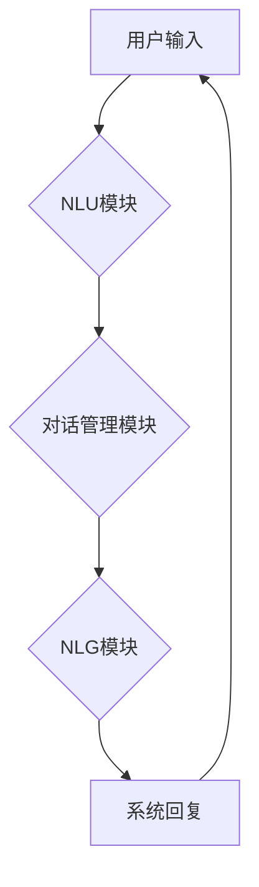

> 深度强化学习，DQN，智能对话系统，自然语言处理，聊天机器人，强化学习，模型训练，实战应用

## 1. 背景介绍

智能对话系统作为人工智能领域的重要分支，近年来发展迅速，已广泛应用于客服、教育、娱乐等领域。传统的对话系统主要依赖于规则和模板匹配，难以应对复杂多变的对话场景。而深度强化学习（Deep Reinforcement Learning，DRL）作为一种新兴的机器学习方法，为智能对话系统的开发提供了新的思路和方法。

深度强化学习的核心思想是通过训练智能体与环境交互，学习最优的策略，以最大化奖励。在智能对话系统中，智能体可以看作是对话系统，环境可以看作是用户，奖励可以看作是用户满意度。通过训练，智能体可以学习到与用户进行自然流畅对话的策略。

DQN（Deep Q-Network）作为一种经典的深度强化学习算法，在游戏领域取得了显著的成功。其核心思想是利用深度神经网络来估计状态价值函数，并通过经验回放和目标网络来稳定训练过程。

## 2. 核心概念与联系

**2.1 智能对话系统**

智能对话系统是指能够与人类进行自然、流畅、意义上的对话的计算机系统。它通常包含以下几个关键模块：

* **自然语言理解（NLU）模块：**负责将用户输入的自然语言文本转换为机器可理解的语义表示。
* **对话管理模块：**负责管理对话流程，根据用户输入和对话历史，选择合适的回复并进行对话引导。
* **自然语言生成（NLG）模块：**负责将机器生成的语义表示转换为自然语言文本，并生成自然流畅的回复。

**2.2 深度强化学习**

深度强化学习是一种机器学习方法，它结合了深度神经网络和强化学习算法。其核心思想是通过训练智能体与环境交互，学习最优的策略，以最大化奖励。

* **智能体（Agent）：**与环境交互的决策者。
* **环境（Environment）：**智能体所处的外部世界。
* **状态（State）：**环境的当前状态。
* **动作（Action）：**智能体可以采取的行动。
* **奖励（Reward）：**环境对智能体动作的反馈。
* **策略（Policy）：**智能体根据当前状态选择动作的策略。

**2.3 DQN算法**

DQN算法是一种经典的深度强化学习算法，它利用深度神经网络来估计状态价值函数，并通过经验回放和目标网络来稳定训练过程。

* **状态价值函数（Q-function）：**估计在给定状态下采取特定动作的期望累积奖励。
* **经验回放（Experience Replay）：**将训练过程中收集到的经验存储在经验池中，并随机采样经验进行训练，以缓解训练过程中的样本相关性问题。
* **目标网络（Target Network）：**与主网络共享相同的结构，但参数更新频率较低，用于估计目标Q值，以稳定训练过程。

**2.4 DQN在智能对话系统中的应用**

DQN算法可以应用于智能对话系统的多个模块，例如对话管理模块和自然语言生成模块。

* **对话管理模块：**DQN可以学习最优的对话策略，引导对话流程，并选择最合适的回复。
* **自然语言生成模块：**DQN可以学习生成更自然流畅的回复，并根据对话上下文进行个性化生成。

**2.5 Mermaid 流程图**



## 3. 核心算法原理 & 具体操作步骤

### 3.1 算法原理概述

DQN算法的核心思想是利用深度神经网络来估计状态价值函数，并通过经验回放和目标网络来稳定训练过程。

* **状态价值函数（Q-function）：**

$$
Q(s, a) = E[\sum_{t=0}^{\infty} \gamma^t r_{t+1} | s_t = s, a_t = a]
$$

其中：

* $s$ 表示当前状态。
* $a$ 表示当前动作。
* $r_{t+1}$ 表示在时间步 $t+1$ 获得的奖励。
* $\gamma$ 表示折扣因子，控制未来奖励的权重。

* **目标网络（Target Network）：**

目标网络与主网络共享相同的结构，但参数更新频率较低，用于估计目标Q值，以稳定训练过程。

* **经验回放（Experience Replay）：**

将训练过程中收集到的经验存储在经验池中，并随机采样经验进行训练，以缓解训练过程中的样本相关性问题。

### 3.2 算法步骤详解

1. 初始化深度神经网络，并设置学习率、折扣因子等超参数。
2. 与环境交互，收集经验数据，包括状态、动作、奖励和下一个状态。
3. 将收集到的经验数据存储在经验池中。
4. 从经验池中随机采样经验数据进行训练。
5. 计算主网络估计的Q值，并与目标网络估计的Q值进行比较，计算损失函数。
6. 使用梯度下降算法更新主网络的参数。
7. 定期更新目标网络的参数，以保持其与主网络的参数差距。
8. 重复步骤4-7，直到达到预设的训练目标。

### 3.3 算法优缺点

**优点：**

* 可以学习复杂的策略。
* 能够处理高维状态空间。
* 经验回放机制可以稳定训练过程。

**缺点：**

* 训练过程可能比较慢。
* 需要大量的训练数据。
* 容易陷入局部最优解。

### 3.4 算法应用领域

DQN算法在多个领域都有应用，例如：

* 游戏领域：AlphaGo、DQN等算法在围棋、Go等游戏中取得了突破性的成就。
* 机器人控制领域：DQN可以用于训练机器人进行复杂的任务，例如导航、抓取等。
* 智能对话系统领域：DQN可以用于训练智能对话系统，使其能够进行更自然、更流畅的对话。

## 4. 数学模型和公式 & 详细讲解 & 举例说明

### 4.1 数学模型构建

DQN算法的核心是状态价值函数（Q-function），它估计在给定状态下采取特定动作的期望累积奖励。

$$
Q(s, a) = E[\sum_{t=0}^{\infty} \gamma^t r_{t+1} | s_t = s, a_t = a]
$$

其中：

* $s$ 表示当前状态。
* $a$ 表示当前动作。
* $r_{t+1}$ 表示在时间步 $t+1$ 获得的奖励。
* $\gamma$ 表示折扣因子，控制未来奖励的权重。

### 4.2 公式推导过程

DQN算法的目标是学习最优的策略，即在每个状态下选择能够最大化期望累积奖励的动作。

$$
\pi^*(s) = \arg\max_a Q(s, a)
$$

其中：

* $\pi^*(s)$ 表示最优策略在状态 $s$ 下的动作选择。

DQN算法使用深度神经网络来估计状态价值函数，并通过梯度下降算法进行训练。

### 4.3 案例分析与讲解

假设我们有一个简单的游戏，玩家可以选择向上、向下、向左、向右四个动作。

* 状态 $s$ 可以表示玩家当前的位置。
* 动作 $a$ 可以表示玩家选择的移动方向。
* 奖励 $r_{t+1}$ 可以表示玩家在移动到下一个位置后获得的奖励，例如获得金币或躲避障碍物。

DQN算法可以学习到在每个状态下选择哪个动作能够获得最大的奖励，从而帮助玩家完成游戏目标。

## 5. 项目实践：代码实例和详细解释说明

### 5.1 开发环境搭建

* Python 3.x
* TensorFlow 或 PyTorch
* 其他必要的库，例如 NumPy、Pandas 等

### 5.2 源代码详细实现

```python
import tensorflow as tf

# 定义DQN网络结构
class DQN(tf.keras.Model):
    def __init__(self, state_size, action_size):
        super(DQN, self).__init__()
        self.dense1 = tf.keras.layers.Dense(64, activation='relu')
        self.dense2 = tf.keras.layers.Dense(32, activation='relu')
        self.output = tf.keras.layers.Dense(action_size)

    def call(self, state):
        x = self.dense1(state)
        x = self.dense2(x)
        return self.output(x)

# 定义DQN训练函数
def train_dqn(dqn, experience_replay, optimizer, gamma, batch_size):
    # 从经验回放中采样数据
    states, actions, rewards, next_states, dones = experience_replay.sample(batch_size)

    # 计算目标Q值
    with tf.GradientTape() as tape:
        # 使用主网络预测Q值
        q_values = dqn(states)
        # 使用目标网络预测下一个状态的Q值
        next_q_values = target_dqn(next_states)
        # 计算目标Q值
        target_q_values = rewards + gamma * tf.reduce_max(next_q_values, axis=1) * (1 - dones)

        # 计算损失函数
        loss = tf.keras.losses.mean_squared_error(target_q_values, q_values[tf.range(batch_size), actions])

    # 更新主网络参数
    gradients = tape.gradient(loss, dqn.trainable_variables)
    optimizer.apply_gradients(zip(gradients, dqn.trainable_variables))

# ... 其他代码 ...
```

### 5.3 代码解读与分析

* **DQN网络结构：**代码中定义了一个DQN网络结构，它包含两层全连接层和一层输出层。
* **训练函数：**`train_dqn`函数负责训练DQN模型。它从经验回放中采样数据，计算目标Q值，并使用梯度下降算法更新模型参数。
* **经验回放：**经验回放是一个重要的技术，它可以缓解训练过程中的样本相关性问题。

### 5.4 运行结果展示

训练完成后，可以将DQN模型应用于智能对话系统中，并评估其性能。

## 6. 实际应用场景

### 6.1 智能客服

DQN可以训练智能客服系统，使其能够更自然地与用户进行对话，并提供更准确的解答。

### 6.2 教育机器人

DQN可以训练教育机器人，使其能够根据学生的学习情况提供个性化的辅导和指导。

### 6.3 游戏助手

DQN可以训练游戏助手，使其能够帮助玩家完成游戏任务，并提供游戏策略建议。

### 6.4 未来应用展望

DQN算法在智能对话系统领域的应用前景广阔，未来可能在以下方面得到进一步发展：

* **多模态对话：**DQN可以扩展到处理多模态输入，例如文本、语音、图像等，从而实现更丰富的对话体验。
* **个性化对话：**DQN可以学习用户的个性化偏好，并根据用户的历史对话记录进行个性化回复。
* **跨语言对话：**DQN可以训练跨语言对话系统，实现不同语言之间的对话交流。

## 7. 工具和资源推荐

### 7.1 学习资源推荐

* **书籍：**
    * Deep Reinforcement Learning Hands-On
    * Reinforcement Learning: An Introduction
* **在线课程：**
    * Deep Reinforcement Learning Specialization (Coursera)
    * Reinforcement Learning (Udacity)

### 7.2 开发工具推荐

* **TensorFlow:** https://www.tensorflow.org/
* **PyTorch:** https://pytorch.org/

### 7.3 相关论文推荐