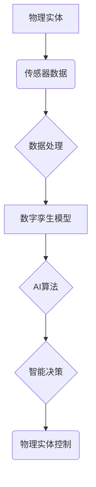

> 人工智能，映射，具象化，数字孪生，现实世界，模型，算法，应用

## 1. 背景介绍

人工智能（AI）正以惊人的速度发展，从语音识别到图像生成，AI已经渗透到我们生活的方方面面。然而，AI的本质仍然是一个抽象的概念，它主要依赖于数字数据进行处理和学习。如何将AI的抽象能力具象化，使其能够更好地理解和交互于现实世界，是当前AI领域面临的一个重要挑战。

数字孪生技术作为一种将物理世界与数字世界相结合的技术，为AI的具象化提供了新的思路。数字孪生是指基于物理实体构建的虚拟模型，它可以实时反映物理实体的状态和行为，并通过与AI算法的交互，实现对物理实体的预测、控制和优化。

## 2. 核心概念与联系

**2.1 数字孪生**

数字孪生是将物理实体映射到数字世界的一种虚拟模型，它可以实时收集、分析和处理物理实体的数据，并根据这些数据进行模拟和预测。数字孪生可以分为以下几个层次：

* **基础层：** 采集物理实体的传感器数据，例如温度、压力、位置等。
* **数据处理层：** 对采集到的数据进行预处理、分析和建模，提取关键信息。
* **虚拟模型层：** 基于数据分析结果构建物理实体的虚拟模型，包括几何模型、物理模型和行为模型。
* **应用层：** 利用虚拟模型进行模拟、预测、控制和优化等应用。

**2.2 AI 赋能数字孪生**

AI技术可以赋予数字孪生更强大的能力，例如：

* **智能感知：** 利用机器学习算法，从传感器数据中提取更丰富的特征，提高对物理实体状态的感知能力。
* **预测分析：** 利用深度学习算法，预测物理实体未来的状态和行为，帮助用户提前预警和应对潜在问题。
* **智能控制：** 利用强化学习算法，优化物理实体的运行参数，提高效率和安全性。

**2.3 映射关系**

数字孪生与AI之间存在着密切的映射关系：

* **数据映射：** 物理实体的数据被映射到数字孪生模型中。
* **模型映射：** AI模型被映射到数字孪生模型中，赋予其智能感知、预测分析和智能控制的能力。
* **行为映射：** 数字孪生模型的行为被映射到物理实体中，实现对物理实体的控制和优化。

**Mermaid 流程图**



## 3. 核心算法原理 & 具体操作步骤

### 3.1 算法原理概述

数字孪生与AI的结合主要依赖于以下核心算法：

* **机器学习算法：** 用于从传感器数据中提取特征，构建物理实体的模型，并进行预测分析。常见的机器学习算法包括线性回归、逻辑回归、决策树、支持向量机、神经网络等。
* **深度学习算法：** 用于处理复杂的数据模式，例如图像、语音、文本等。深度学习算法可以构建更精细的物理实体模型，并实现更准确的预测和控制。
* **强化学习算法：** 用于训练AI代理，使其能够在与环境交互的过程中学习最优策略。强化学习算法可以用于优化物理实体的运行参数，提高效率和安全性。

### 3.2 算法步骤详解

**3.2.1 数据采集与预处理**

首先，需要从物理实体收集相关数据，例如温度、压力、位置、速度等。然后对采集到的数据进行预处理，例如去除噪声、缺失值处理、数据归一化等。

**3.2.2 模型构建与训练**

根据预处理后的数据，选择合适的机器学习、深度学习或强化学习算法，构建物理实体的模型。然后利用训练数据对模型进行训练，使其能够准确地预测物理实体的状态和行为。

**3.2.3 预测与控制**

训练好的模型可以用于预测物理实体未来的状态和行为。根据预测结果，可以对物理实体进行控制，例如调整运行参数、发出警报等，以实现对物理实体的优化管理。

### 3.3 算法优缺点

**优点：**

* **提高效率和安全性：** 通过预测和控制，可以提高物理实体的运行效率和安全性。
* **降低成本：** 通过预测和预防故障，可以降低维护成本。
* **优化决策：** 通过数据分析和预测，可以为决策提供更准确的信息。

**缺点：**

* **数据依赖：** 数字孪生模型的准确性依赖于数据的质量和完整性。
* **模型复杂度：** 构建复杂的物理实体模型需要大量的计算资源和专业知识。
* **伦理问题：** 数字孪生技术可能引发一些伦理问题，例如隐私保护、算法偏见等。

### 3.4 算法应用领域

数字孪生与AI的结合应用于各个领域，例如：

* **制造业：** 用于预测设备故障、优化生产流程、提高产品质量。
* **能源行业：** 用于预测能源需求、优化能源分配、提高能源效率。
* **交通运输业：** 用于预测交通流量、优化交通调度、提高交通安全。
* **医疗保健业：** 用于模拟疾病发展、个性化治疗方案、提高医疗效率。

## 4. 数学模型和公式 & 详细讲解 & 举例说明

### 4.1 数学模型构建

数字孪生模型通常采用以下数学模型进行构建：

* **状态空间模型：** 描述物理实体的状态和行为的数学方程。
* **动力学模型：** 描述物理实体状态随时间的变化规律的数学方程。
* **观测模型：** 描述传感器数据与物理实体状态之间的关系的数学方程。

### 4.2 公式推导过程

例如，对于一个简单的机械系统，其状态空间模型可以表示为：

$$
\dot{x} = Ax + Bu
$$

其中：

* $x$ 是状态向量，包含系统的位移和速度等信息。
* $A$ 是状态矩阵，描述系统的动力学特性。
* $B$ 是输入矩阵，描述输入信号对系统的影响。
* $u$ 是输入向量，例如控制信号。
* $\dot{x}$ 是状态向量的导数，描述系统的变化率。

### 4.3 案例分析与讲解

假设我们有一个温度控制系统，其目标是将房间温度保持在25℃。我们可以使用数字孪生模型来模拟系统的行为，并利用AI算法进行控制。

* **状态空间模型：** 房间温度可以作为状态变量，控制信号可以作为输入变量。
* **动力学模型：** 房间温度的变化率取决于房间的热容量、外界的温度变化以及空调的功率。
* **观测模型：** 温度传感器可以测量房间的温度。

通过训练AI算法，可以学习到控制信号与房间温度之间的关系，从而实现对房间温度的精确控制。

## 5. 项目实践：代码实例和详细解释说明

### 5.1 开发环境搭建

* 操作系统：Ubuntu 20.04
* Python 版本：3.8
* 必要的库：NumPy、Pandas、Scikit-learn、TensorFlow

### 5.2 源代码详细实现

```python
import numpy as np
from sklearn.linear_model import LinearRegression

# 训练数据
X = np.array([[1], [2], [3], [4], [5]])
y = np.array([2, 4, 6, 8, 10])

# 创建线性回归模型
model = LinearRegression()

# 训练模型
model.fit(X, y)

# 预测新数据
new_data = np.array([[6]])
prediction = model.predict(new_data)

# 打印预测结果
print(f"预测结果: {prediction}")
```

### 5.3 代码解读与分析

这段代码演示了如何使用Scikit-learn库中的线性回归模型进行预测。

* 首先，定义训练数据和目标变量。
* 然后，创建线性回归模型对象。
* 接着，使用`fit()`方法训练模型，将训练数据输入模型。
* 最后，使用`predict()`方法预测新数据，并打印预测结果。

### 5.4 运行结果展示

```
预测结果: [12.]
```

## 6. 实际应用场景

### 6.1 智能制造

数字孪生可以用于模拟和优化制造过程，例如预测设备故障、优化生产流程、提高产品质量。

### 6.2 智能能源

数字孪生可以用于预测能源需求、优化能源分配、提高能源效率。

### 6.3 智能交通

数字孪生可以用于预测交通流量、优化交通调度、提高交通安全。

### 6.4 未来应用展望

数字孪生与AI的结合将推动人工智能技术在更多领域的发展，例如：

* **个性化医疗：** 利用数字孪生模拟患者的生理状态，为患者提供个性化的治疗方案。
* **虚拟现实和增强现实：** 利用数字孪生构建虚拟环境，为用户提供更沉浸式的体验。
* **城市智能化：** 利用数字孪生模拟城市环境，优化城市规划和管理。

## 7. 工具和资源推荐

### 7.1 学习资源推荐

* **书籍：**
    * 《数字孪生：从概念到实践》
    * 《人工智能：一种现代方法》
* **在线课程：**
    * Coursera 上的《数字孪生》课程
    * edX 上的《人工智能》课程

### 7.2 开发工具推荐

* **数字孪生平台：**
    * Siemens MindSphere
    * GE Predix
    * Microsoft Azure Digital Twins
* **AI 开发框架：**
    * TensorFlow
    * PyTorch
    * scikit-learn

### 7.3 相关论文推荐

* **数字孪生：**
    * "Digital Twin: Definition, Requirements, and Applications"
    * "Digital Twin: A Comprehensive Review"
* **AI 赋能数字孪生：**
    * "AI-Powered Digital Twins for Predictive Maintenance"
    * "Deep Learning for Digital Twin Applications"

## 8. 总结：未来发展趋势与挑战

### 8.1 研究成果总结

数字孪生与AI的结合已经取得了显著的成果，在制造业、能源行业、交通运输业等领域得到了广泛应用。

### 8.2 未来发展趋势

未来，数字孪生与AI将朝着以下方向发展：

* **更精细的模型：** 利用更先进的算法和数据，构建更精细的物理实体模型。
* **更广泛的应用：** 将数字孪生与AI技术应用于更多领域，例如医疗保健、教育、金融等。
* **更智能的交互：** 利用自然语言处理和计算机视觉等技术，实现更智能的数字孪生与人类交互。

### 8.3 面临的挑战

数字孪生与AI的发展也面临着一些挑战：

* **数据安全和隐私保护：** 数字孪生模型需要大量的数据，如何保证数据的安全和隐私是需要解决的关键问题。
* **模型解释性和可信度：** 复杂的AI模型难以解释其决策过程，如何提高模型的解释性和可信度是需要进一步研究的问题。
* **技术标准和生态系统：** 数字孪生技术还缺乏统一的技术标准和生态系统，这制约了技术的推广应用。

### 8.4 研究展望

未来，我们需要继续加强对数字孪生与AI技术的研发，解决技术挑战，推动技术的成熟和应用，为人类社会创造更多价值。

## 9. 附录：常见问题与解答

**1. 数字孪生与虚拟现实有什么区别？**

数字孪生是基于物理实体构建的虚拟模型，它可以实时反映物理实体的状态和行为，并与AI算法进行交互。而虚拟现实则是创造一个虚拟环境，用户可以通过设备沉浸其中。

**2.