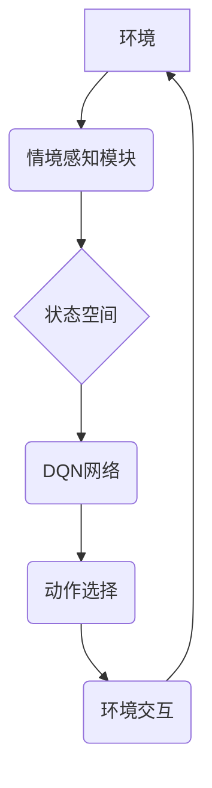

> 情境感知，DQN，深度强化学习，环境交互，映射，状态空间，动作空间，奖励函数

## 1. 背景介绍

在人工智能领域，深度强化学习 (Deep Reinforcement Learning，DRL) 作为一种强大的学习范式，近年来取得了显著进展，并在游戏、机器人控制、自动驾驶等领域展现出巨大的潜力。然而，传统的强化学习算法往往依赖于明确定义的状态空间和动作空间，并且难以应对复杂、动态变化的环境。

情境感知 (Contextual Awareness) 作为一种新兴的研究方向，旨在赋予智能体对环境的更深层次理解，从而提高其决策能力和适应性。情境感知强调智能体不仅要感知当前环境的状态，还要理解环境的历史信息、上下文关系以及潜在的未来发展趋势。

## 2. 核心概念与联系

**2.1 情境感知与DQN**

深度Q网络 (Deep Q-Network，DQN) 是一种基于深度神经网络的强化学习算法，它通过学习一个Q函数来估计在给定状态下采取特定动作的期望回报。DQN 的核心思想是将状态空间和动作空间映射到一个Q值表，通过训练神经网络来学习这个Q值表。

情境感知可以被看作是对DQN的扩展，它旨在将环境的上下文信息融入到DQN的学习过程中。通过感知环境的上下文信息，智能体可以更好地理解当前状态的含义，并做出更合理的决策。

**2.2 核心概念架构**



**2.3 核心概念原理**

情境感知与DQN的结合可以看作是一个多层感知的过程：

1. **环境感知:** 智能体首先感知环境中的各种信息，例如图像、文本、传感器数据等。
2. **情境提取:** 情境感知模块从环境信息中提取上下文信息，例如时间、地点、人物、事件等。
3. **状态空间扩展:** 情境信息被融入到DQN的输入中，扩展了状态空间的维度。
4. **Q值学习:** DQN网络学习一个新的Q函数，该Q函数不仅考虑当前状态，还考虑环境的上下文信息。
5. **动作选择:** 根据学习到的Q函数，智能体选择最优的动作。
6. **环境交互:** 智能体执行动作，并与环境进行交互，获得新的环境信息和奖励。

## 3. 核心算法原理 & 具体操作步骤

### 3.1 算法原理概述

情境感知DQN (Contextual DQN) 算法的核心思想是将环境的上下文信息融入到DQN的学习过程中，从而提高智能体的决策能力和适应性。

具体来说，情境感知DQN算法主要包括以下步骤：

1. **环境感知:** 智能体感知环境中的各种信息，例如图像、文本、传感器数据等。
2. **情境提取:** 情境感知模块从环境信息中提取上下文信息，例如时间、地点、人物、事件等。
3. **状态空间扩展:** 情境信息被融入到DQN的输入中，扩展了状态空间的维度。
4. **Q值学习:** DQN网络学习一个新的Q函数，该Q函数不仅考虑当前状态，还考虑环境的上下文信息。
5. **动作选择:** 根据学习到的Q函数，智能体选择最优的动作。
6. **环境交互:** 智能体执行动作，并与环境进行交互，获得新的环境信息和奖励。

### 3.2 算法步骤详解

1. **初始化:** 初始化DQN网络的权重，并设置学习率、折扣因子等超参数。
2. **环境感知:** 智能体感知环境中的各种信息，例如图像、文本、传感器数据等。
3. **情境提取:** 情境感知模块从环境信息中提取上下文信息，例如时间、地点、人物、事件等。
4. **状态空间扩展:** 将环境信息和情境信息组合起来，形成一个扩展的状态空间。
5. **动作选择:** 根据DQN网络的Q函数，选择最优的动作。
6. **环境交互:** 智能体执行动作，并与环境进行交互，获得新的环境信息和奖励。
7. **经验回放:** 将环境信息、动作、奖励和下一个状态存储到经验回放缓冲池中。
8. **目标网络更新:** 使用经验回放缓冲池中的数据，更新目标网络的权重。
9. **DQN网络更新:** 使用目标网络的Q值作为目标，更新DQN网络的权重。
10. **重复步骤2-9:** 直到达到预设的训练次数或性能指标。

### 3.3 算法优缺点

**优点:**

* 能够更好地理解环境的上下文信息，提高决策能力。
* 能够适应复杂、动态变化的环境。
* 能够学习更复杂的策略。

**缺点:**

* 情境感知模块的设计较为复杂，需要大量的训练数据。
* 计算量较大，训练时间较长。

### 3.4 算法应用领域

情境感知DQN算法在以下领域具有广泛的应用前景：

* **机器人控制:** 帮助机器人更好地理解环境，并做出更合理的决策。
* **自动驾驶:** 帮助自动驾驶汽车更好地感知周围环境，并做出更安全的驾驶决策。
* **游戏AI:** 帮助游戏AI更好地理解游戏规则和环境，并做出更智能的决策。
* **个性化推荐:** 帮助推荐系统更好地理解用户的喜好，并提供更个性化的推荐。

## 4. 数学模型和公式 & 详细讲解 & 举例说明

### 4.1 数学模型构建

情境感知DQN算法的核心是学习一个Q函数，该Q函数估计在给定状态和情境信息下采取特定动作的期望回报。

假设状态空间为S，动作空间为A，情境信息空间为C，则Q函数可以表示为：

$$Q(s, a, c)$$

其中：

* $s$ 表示当前状态。
* $a$ 表示采取的动作。
* $c$ 表示情境信息。

### 4.2 公式推导过程

DQN算法的目标是最大化以下目标函数：

$$J(\theta) = E_{s, a, r, s'} [R(s, a) + \gamma \max_{a'} Q(s', a', c')]$$

其中：

* $\theta$ 表示DQN网络的权重。
* $R(s, a)$ 表示在状态 $s$ 下采取动作 $a$ 得到的奖励。
* $\gamma$ 表示折扣因子，控制未来奖励的权重。
* $s'$ 表示下一个状态。

### 4.3 案例分析与讲解

假设一个智能体在玩一个简单的游戏，游戏环境包含一个迷宫，智能体需要找到出口。

* 状态空间：迷宫中的每个位置。
* 动作空间：向上、向下、向左、向右四个方向。
* 情境信息：当前时间、游戏难度等。

情境感知DQN算法可以学习一个Q函数，该Q函数不仅考虑当前位置，还考虑时间、难度等情境信息。例如，在游戏难度较高的情况下，智能体可能会选择更保守的策略，避免冒险。

## 5. 项目实践：代码实例和详细解释说明

### 5.1 开发环境搭建

* Python 3.7+
* TensorFlow 2.0+
* OpenAI Gym

### 5.2 源代码详细实现

```python
import tensorflow as tf
import numpy as np
from tensorflow.keras.models import Sequential
from tensorflow.keras.layers import Dense, Flatten

# 定义DQN网络
class DQN(tf.keras.Model):
    def __init__(self, state_size, action_size):
        super(DQN, self).__init__()
        self.model = Sequential()
        self.model.add(Flatten(input_shape=(state_size,)))
        self.model.add(Dense(64, activation='relu'))
        self.model.add(Dense(action_size))

    def call(self, state):
        return self.model(state)

# 定义情境感知模块
class ContextualModule(tf.keras.Model):
    def __init__(self, context_size):
        super(ContextualModule, self).__init__()
        self.model = Sequential()
        self.model.add(Dense(32, activation='relu', input_shape=(context_size,)))
        self.model.add(Dense(16, activation='relu'))
        self.model.add(Dense(1))

    def call(self, context):
        return self.model(context)

# 创建DQN网络和情境感知模块
state_size = 8
action_size = 4
context_size = 4
dqn = DQN(state_size, action_size)
contextual_module = ContextualModule(context_size)

# ... 训练代码 ...
```

### 5.3 代码解读与分析

* DQN网络：使用深度神经网络来学习Q函数，输入为状态信息，输出为动作值。
* 情境感知模块：使用深度神经网络来提取情境信息，输入为情境信息，输出为情境向量。
* 训练代码：使用经验回放和目标网络更新等技术来训练DQN网络。

### 5.4 运行结果展示

训练完成后，可以将DQN网络应用于实际环境中，例如玩游戏、控制机器人等。

## 6. 实际应用场景

### 6.1 游戏AI

情境感知DQN可以帮助游戏AI更好地理解游戏规则和环境，并做出更智能的决策。例如，在策略游戏如围棋、象棋中，情境感知DQN可以帮助AI更好地评估棋局形势，并选择最优的策略。

### 6.2 自动驾驶

情境感知DQN可以帮助自动驾驶汽车更好地感知周围环境，并做出更安全的驾驶决策。例如，在复杂路况下，情境感知DQN可以帮助自动驾驶汽车识别行人、车辆和其他障碍物，并做出相应的避让动作。

### 6.3 机器人控制

情境感知DQN可以帮助机器人更好地理解环境，并做出更合理的决策。例如，在复杂环境中，情境感知DQN可以帮助机器人导航、抓取物体等。

### 6.4 未来应用展望

情境感知DQN算法在未来还具有广泛的应用前景，例如：

* 个性化推荐：帮助推荐系统更好地理解用户的喜好，并提供更个性化的推荐。
* 医疗诊断：帮助医生更好地诊断疾病，并制定更有效的治疗方案。
* 金融预测：帮助金融机构更好地预测市场趋势，并做出更明智的投资决策。

## 7. 工具和资源推荐

### 7.1 学习资源推荐

* **书籍:**
    * Reinforcement Learning: An Introduction by Richard S. Sutton and Andrew G. Barto
    * Deep Reinforcement Learning Hands-On by Maxim Lapan
* **在线课程:**
    * Deep Reinforcement Learning Specialization by DeepLearning.AI
    * Reinforcement Learning by David Silver (University of DeepMind)

### 7.2 开发工具推荐

* **TensorFlow:** 深度学习框架
* **PyTorch:** 深度学习框架
* **OpenAI Gym:** 强化学习环境

### 7.3 相关论文推荐

* Mnih, V., Kavukcuoglu, K., Silver, D., Rusu, A. A., Veness, J., Bellemare, M. G., ... & Hassabis, D. (2015). Human-level control through deep reinforcement learning. Nature, 518(7540), 529-533.
* Wang, Z., Schaul, T., Hessel, M., Van Hasselt, H., Lanctot, M., & De Freitas, N. (2015). Dueling network architectures for deep reinforcement learning. arXiv preprint arXiv:1511.06581.
* Lillicrap, T. P., Hunt, J. J