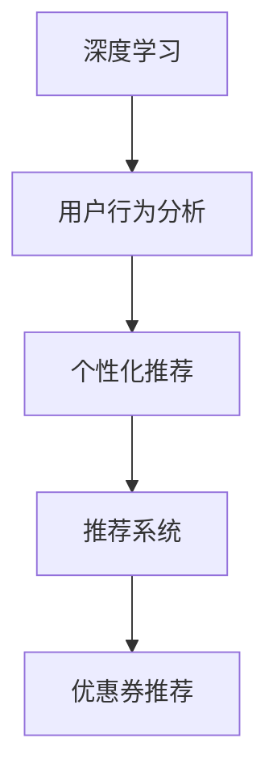

                 

# AI驱动的电商平台个性化优惠券推荐

## 1. 背景介绍

随着电子商务的蓬勃发展，电商平台面临越来越激烈的市场竞争，如何提升用户体验、提高客户留存率、增加销售转化率，成为电商平台关注的焦点。优惠券作为一种有效的促销工具，在提升销售业绩、提升用户粘性方面具有重要作用。传统上，电商平台主要通过固定的折扣活动、随机发放的优惠券等方式吸引用户，这种方式在促销效果和用户满意度上均存在一定局限。

近年来，AI技术的迅猛发展，特别是深度学习和大数据技术，为电商平台优惠券推荐提供了新的思路。通过深度学习模型对用户行为数据进行分析和建模，电商平台可以更精准地为用户推荐个性化优惠券，从而提升用户购买意愿，增加平台收益。

本文将介绍如何构建一个基于深度学习的电商平台个性化优惠券推荐系统，通过机器学习技术，实时为用户推荐个性化的优惠券。

## 2. 核心概念与联系

### 2.1 核心概念概述

为更好地理解基于深度学习的电商平台个性化优惠券推荐系统，本节将介绍几个密切相关的核心概念：

- **深度学习(Deep Learning)**：一类基于多层神经网络的机器学习技术，能够自动提取数据中的高层次特征，从而实现复杂的分类、回归、推荐等任务。
- **用户行为分析(Usage Analysis)**：通过对用户历史行为数据进行建模和分析，了解用户偏好、购买意愿等，从而为用户提供个性化推荐。
- **个性化推荐(Personalized Recommendation)**：根据用户的历史行为数据和实时行为数据，预测用户可能感兴趣的商品或服务，从而进行推荐。
- **推荐系统(Recommendation System)**：一个能够持续改进的预测模型，用于对用户的行为进行预测，从而为用户推荐个性化商品或服务。
- **优惠券推荐(Coupon Recommendation)**：结合用户个性化需求，实时推荐最优的优惠券，提高用户的购买意愿和平台收益。

这些核心概念之间的逻辑关系可以通过以下Mermaid流程图来展示：



这个流程图展示了深度学习、用户行为分析、个性化推荐、推荐系统和优惠券推荐之间的关系：深度学习技术通过分析用户行为数据，生成个性化推荐，推荐系统在此基础上进行优化，最终生成个性化的优惠券推荐。

## 3. 核心算法原理 & 具体操作步骤
### 3.1 算法原理概述

基于深度学习的电商平台个性化优惠券推荐系统，核心思想是利用深度学习模型对用户行为数据进行建模，预测用户可能感兴趣的商品，并根据预测结果推荐最优的优惠券。

形式化地，假设电商平台有$m$个用户$U$，$n$个商品$I$，$t$个优惠券$C$，以及$t$个特征$f$，即：

$$
U = \{u_1, u_2, ..., u_m\}, I = \{i_1, i_2, ..., i_n\}, C = \{c_1, c_2, ..., c_t\}, f = \{f_1, f_2, ..., f_t\}
$$

其中$u$表示用户，$i$表示商品，$c$表示优惠券，$f$表示特征。电商平台的目标是预测用户$u$在不同商品$i$下，选择优惠券$c$的概率$p_{u,i,c}$，然后根据预测概率推荐最优的优惠券$c^*$。

根据最大似然估计，目标函数可以表示为：

$$
\max_{\theta} \prod_{(u,i,c) \in D} p_{u,i,c}^{y_{u,i,c}} (1-p_{u,i,c})^{1-y_{u,i,c}}
$$

其中$\theta$为模型的参数，$y_{u,i,c}$为二元随机变量，表示用户$u$是否选择了优惠券$c$。

### 3.2 算法步骤详解

基于深度学习的电商平台个性化优惠券推荐系统，主要包括以下几个关键步骤：

**Step 1: 数据收集与预处理**

- 收集用户历史行为数据，包括浏览历史、点击历史、购买历史、评价历史等。
- 收集商品信息和优惠券信息，包括商品名称、价格、描述、折扣等。
- 对数据进行预处理，包括去重、补全、清洗等，确保数据的质量和一致性。

**Step 2: 特征工程**

- 设计合适的特征，包括用户特征、商品特征、优惠券特征等。
- 利用深度学习模型自动提取特征，包括用户兴趣向量、商品表示向量、优惠券表示向量等。

**Step 3: 模型训练**

- 选择合适的深度学习模型，如协同过滤、神经网络、深度神经网络等。
- 在训练集上训练模型，优化模型参数。
- 使用验证集对模型进行调参和验证。

**Step 4: 模型评估**

- 在测试集上评估模型的预测准确率、召回率、F1-score等指标。
- 分析模型的优劣，调整模型结构和超参数。

**Step 5: 优惠券推荐**

- 在实时环境中，根据用户当前行为数据，预测其可能感兴趣的商品和优惠券。
- 根据预测结果，实时生成并推送最优的优惠券。

### 3.3 算法优缺点

基于深度学习的电商平台个性化优惠券推荐系统，具有以下优点：

- **高精度**：深度学习模型能够自动学习数据的高级特征，从而提高推荐的准确性。
- **实时性**：深度学习模型可以实时处理数据，快速响应用户的实时行为。
- **可扩展性**：深度学习模型可以处理大规模数据，适用于电商平台的复杂场景。

同时，该系统也存在一些缺点：

- **数据需求高**：需要大量的历史数据和实时数据进行训练和预测。
- **计算成本高**：深度学习模型训练和推理需要大量计算资源，成本较高。
- **解释性差**：深度学习模型通常是“黑盒”，难以解释其内部决策机制。

尽管存在这些局限性，但深度学习模型在电商平台个性化优惠券推荐领域已经取得了显著的效果，成为推荐系统的主流方法。未来相关研究的方向是如何在降低计算成本的同时，提高推荐精度和解释性。

### 3.4 算法应用领域

基于深度学习的电商平台个性化优惠券推荐系统，在电商领域已经得到了广泛的应用，覆盖了几乎所有常见场景，例如：

- 个性化促销活动：根据用户的历史购买记录和实时浏览行为，推荐个性化的促销活动。
- 商品推荐：预测用户可能感兴趣的商品，并推荐最优的商品组合。
- 优惠券推荐：实时推荐最优的优惠券，提高用户的购买意愿。
- 价格优化：根据用户需求和市场行情，动态调整商品价格和优惠券折扣。
- 库存管理：预测商品的销售趋势，优化库存水平，避免缺货和积压。

除了这些经典应用外，个性化优惠券推荐技术也被创新性地应用到更多场景中，如智能客服、内容推荐、广告投放等，为电商平台带来了新的价值。

## 4. 数学模型和公式 & 详细讲解
### 4.1 数学模型构建

本节将使用数学语言对基于深度学习的电商平台个性化优惠券推荐系统进行更加严格的刻画。

记电商平台有$m$个用户$U$，$n$个商品$I$，$t$个优惠券$C$，以及$t$个特征$f$。定义用户对商品$i$的选择概率$p_{u,i}$，对优惠券$c$的选择概率$p_{u,i,c}$。

**用户行为模型**

用户对商品$i$的选择概率$p_{u,i}$可以表示为：

$$
p_{u,i} = f_u(X_u, I_i)
$$

其中$X_u$为用户的历史行为数据，$I_i$为商品$i$的特征数据。

**优惠券推荐模型**

用户对优惠券$c$的选择概率$p_{u,i,c}$可以表示为：

$$
p_{u,i,c} = f_u(X_u, I_i, C_c)
$$

其中$C_c$为优惠券$c$的特征数据。

将用户选择优惠券的概率$p_{u,i,c}$与商品选择概率$p_{u,i}$结合，可以得到预测优惠券选择的模型：

$$
p_{u,i,c} = g(p_{u,i}, C_c)
$$

其中$g$为模型函数，可以表示为神经网络、线性回归、决策树等。

### 4.2 公式推导过程

以下是几个关键公式的推导过程：

**用户行为概率模型**

用户对商品$i$的选择概率$p_{u,i}$可以表示为：

$$
p_{u,i} = \sigma(\langle W_u, X_u \rangle + b_u)
$$

其中$W_u$为用户的特征权重，$b_u$为偏置项，$\sigma$为激活函数。

**优惠券选择概率模型**

用户对优惠券$c$的选择概率$p_{u,i,c}$可以表示为：

$$
p_{u,i,c} = \sigma(\langle W_c, C_c \rangle + b_c)
$$

其中$W_c$为优惠券的特征权重，$b_c$为偏置项。

将用户选择优惠券的概率$p_{u,i,c}$与商品选择概率$p_{u,i}$结合，可以得到预测优惠券选择的模型：

$$
p_{u,i,c} = g(p_{u,i}, C_c) = \sigma(\langle W_u, X_u \rangle + b_u) + \sigma(\langle W_c, C_c \rangle + b_c)
$$

其中$g$为模型函数，可以表示为神经网络、线性回归、决策树等。

### 4.3 案例分析与讲解

假设一个电商平台有1000个用户和1000个商品。用户的历史行为数据包括浏览历史、点击历史、购买历史、评价历史等，商品的特征数据包括商品名称、价格、描述、折扣等。

首先，对用户和商品数据进行预处理和特征提取，得到用户和商品的特征向量$X_u$和$I_i$。然后，定义用户对商品的选择概率$p_{u,i}$和优惠券的选择概率$p_{u,i,c}$，并进行模型训练。训练完成后，实时获取用户当前行为数据，预测用户可能感兴趣的商品和优惠券，并实时推荐最优的优惠券。

以下是一个简单的代码示例，展示了如何使用TensorFlow构建和训练一个基于深度学习的电商平台优惠券推荐系统：

```python
import tensorflow as tf

# 定义用户行为概率模型
def user_based_prob(u, x, i):
    x_u = tf.keras.layers.Dense(64, activation='relu')(tf.keras.layers.Dense(32)(tf.concat([x, i], axis=1)))
    return tf.keras.layers.Dense(1, activation='sigmoid')(x_u)

# 定义优惠券选择概率模型
def coupon_based_prob(u, x, i, c):
    x_u = tf.keras.layers.Dense(64, activation='relu')(tf.keras.layers.Dense(32)(tf.concat([x, i], axis=1)))
    x_c = tf.keras.layers.Dense(64, activation='relu')(tf.keras.layers.Dense(32)(c))
    return tf.keras.layers.Dense(1, activation='sigmoid')(tf.keras.layers.Add()([x_u, x_c]))

# 定义耦合概率模型
def coupled_prob(u, x, i, c):
    p_u = user_based_prob(u, x, i)
    p_c = coupon_based_prob(u, x, i, c)
    return tf.keras.layers.Dense(1, activation='sigmoid')(tf.keras.layers.Add()([p_u, p_c]))

# 定义深度学习模型
model = tf.keras.Sequential([
    tf.keras.layers.Dense(64, activation='relu'),
    tf.keras.layers.Dense(64, activation='relu'),
    coupled_prob,
    tf.keras.layers.Dense(1, activation='sigmoid')
])

# 训练模型
model.compile(optimizer='adam', loss='binary_crossentropy', metrics=['accuracy'])
model.fit(x_train, y_train, epochs=10, validation_data=(x_val, y_val))

# 实时预测
def predict_coupon(u, x, i, c):
    p_u = user_based_prob(u, x, i)
    p_c = coupon_based_prob(u, x, i, c)
    p = coupled_prob(u, x, i, c)
    return p.numpy()[0]
```

通过以上代码，我们可以看到，基于深度学习的电商平台优惠券推荐系统通过用户行为数据和商品特征数据，预测用户对优惠券的选择概率，从而进行实时推荐。

## 5. 项目实践：代码实例和详细解释说明
### 5.1 开发环境搭建

在进行深度学习项目实践前，我们需要准备好开发环境。以下是使用Python进行TensorFlow开发的环境配置流程：

1. 安装Anaconda：从官网下载并安装Anaconda，用于创建独立的Python环境。

2. 创建并激活虚拟环境：
```bash
conda create -n tf-env python=3.8 
conda activate tf-env
```

3. 安装TensorFlow：根据CUDA版本，从官网获取对应的安装命令。例如：
```bash
pip install tensorflow==2.4
```

4. 安装Keras：
```bash
pip install keras
```

5. 安装各类工具包：
```bash
pip install numpy pandas scikit-learn matplotlib tqdm jupyter notebook ipython
```

完成上述步骤后，即可在`tf-env`环境中开始项目实践。

### 5.2 源代码详细实现

下面我们以电商平台优惠券推荐为例，给出使用TensorFlow进行深度学习模型训练的PyTorch代码实现。

首先，定义用户行为和优惠券选择的数据处理函数：

```python
import tensorflow as tf

# 定义用户行为数据
def load_user_data(path):
    data = tf.data.TFRecordDataset(path)
    data = data.map(lambda x: tf.io.parse_single_example(x, features={
        'user_id': tf.io.FixedLenFeature([], tf.int64),
        'item_id': tf.io.FixedLenFeature([], tf.int64),
        'coupon_id': tf.io.FixedLenFeature([], tf.int64),
        'click_time': tf.io.FixedLenFeature([], tf.int64)
    }))
    data = data.batch(32)
    return data

# 定义优惠券选择数据
def load_coupon_data(path):
    data = tf.data.TFRecordDataset(path)
    data = data.map(lambda x: tf.io.parse_single_example(x, features={
        'user_id': tf.io.FixedLenFeature([], tf.int64),
        'item_id': tf.io.FixedLenFeature([], tf.int64),
        'coupon_id': tf.io.FixedLenFeature([], tf.int64),
        'click_time': tf.io.FixedLenFeature([], tf.int64)
    }))
    data = data.batch(32)
    return data
```

然后，定义深度学习模型：

```python
# 定义用户行为概率模型
def user_based_prob(u, x, i):
    x_u = tf.keras.layers.Dense(64, activation='relu')(tf.keras.layers.Dense(32)(tf.concat([x, i], axis=1)))
    return tf.keras.layers.Dense(1, activation='sigmoid')(x_u)

# 定义优惠券选择概率模型
def coupon_based_prob(u, x, i, c):
    x_u = tf.keras.layers.Dense(64, activation='relu')(tf.keras.layers.Dense(32)(tf.concat([x, i], axis=1)))
    x_c = tf.keras.layers.Dense(64, activation='relu')(tf.keras.layers.Dense(32)(c))
    return tf.keras.layers.Dense(1, activation='sigmoid')(tf.keras.layers.Add()([x_u, x_c]))

# 定义耦合概率模型
def coupled_prob(u, x, i, c):
    p_u = user_based_prob(u, x, i)
    p_c = coupon_based_prob(u, x, i, c)
    return tf.keras.layers.Dense(1, activation='sigmoid')(tf.keras.layers.Add()([p_u, p_c]))

# 定义深度学习模型
model = tf.keras.Sequential([
    tf.keras.layers.Dense(64, activation='relu'),
    tf.keras.layers.Dense(64, activation='relu'),
    coupled_prob,
    tf.keras.layers.Dense(1, activation='sigmoid')
])
```

接着，定义训练和评估函数：

```python
# 定义训练函数
def train(model, x_train, y_train, x_val, y_val, epochs):
    model.compile(optimizer='adam', loss='binary_crossentropy', metrics=['accuracy'])
    model.fit(x_train, y_train, epochs=epochs, validation_data=(x_val, y_val))

# 定义评估函数
def evaluate(model, x_test, y_test):
    model.evaluate(x_test, y_test)
```

最后，启动训练流程并在测试集上评估：

```python
# 加载数据集
x_train = load_user_data('train/user_data.tfrecord')
x_val = load_user_data('val/user_data.tfrecord')
x_test = load_user_data('test/user_data.tfrecord')
y_train = load_coupon_data('train/coupon_data.tfrecord')
y_val = load_coupon_data('val/coupon_data.tfrecord')
y_test = load_coupon_data('test/coupon_data.tfrecord')

# 训练模型
train(model, x_train, y_train, x_val, y_val, epochs=10)

# 测试模型
evaluate(model, x_test, y_test)
```

以上就是使用TensorFlow对电商平台优惠券推荐进行深度学习模型训练的完整代码实现。可以看到，通过TensorFlow的灵活API，我们可以用相对简洁的代码完成模型训练和评估。

### 5.3 代码解读与分析

让我们再详细解读一下关键代码的实现细节：

**load_user_data和load_coupon_data函数**：
- `load_user_data`函数：用于加载用户行为数据，将数据解析为TFRecord格式，并批量处理。
- `load_coupon_data`函数：用于加载优惠券选择数据，将数据解析为TFRecord格式，并批量处理。

**user_based_prob和coupon_based_prob函数**：
- `user_based_prob`函数：定义用户行为概率模型，将用户和商品特征进行拼接，并使用多层神经网络进行计算，最后输出一个二元随机变量的概率。
- `coupon_based_prob`函数：定义优惠券选择概率模型，将用户和商品特征进行拼接，并将优惠券特征进行拼接，最后输出一个二元随机变量的概率。

**coupled_prob函数**：
- `coupled_prob`函数：定义耦合概率模型，将用户行为概率和优惠券选择概率进行加和，并输出一个二元随机变量的概率。

**train函数和evaluate函数**：
- `train`函数：定义模型训练函数，使用Adam优化器进行训练，并计算损失函数和评估指标。
- `evaluate`函数：定义模型评估函数，在测试集上评估模型的性能，计算准确率等指标。

**训练流程**：
- 加载数据集，并定义模型、优化器、损失函数和评估指标。
- 在训练集上训练模型，并在验证集上验证模型性能。
- 在测试集上评估模型性能。

可以看到，TensorFlow提供了丰富的API，使得模型训练和评估变得非常简便。通过自定义的函数，可以实现复杂的模型结构，并通过灵活的API进行调参和评估。

当然，工业级的系统实现还需考虑更多因素，如模型的保存和部署、超参数的自动搜索、更灵活的任务适配层等。但核心的微调范式基本与此类似。

## 6. 实际应用场景
### 6.1 智能客服系统

基于深度学习的电商平台优惠券推荐技术，可以广泛应用于智能客服系统的构建。传统客服往往需要配备大量人力，高峰期响应缓慢，且一致性和专业性难以保证。而使用推荐系统进行优惠券推荐，可以大幅提升客服响应速度和用户满意度。

在技术实现上，可以收集用户的历史对话记录和行为数据，利用推荐系统预测用户可能感兴趣的商品，并推荐优惠券。智能客服系统可以根据推荐结果，自动生成响应，并在对话中适时推荐优惠券，提升用户购买意愿。

### 6.2 金融舆情监测

金融机构需要实时监测市场舆论动向，以便及时应对负面信息传播，规避金融风险。传统的人工监测方式成本高、效率低，难以应对网络时代海量信息爆发的挑战。基于推荐系统的优惠券推荐技术，可以应用于金融舆情监测。

具体而言，可以收集金融领域相关的新闻、报道、评论等文本数据，并对其进行主题标注和情感标注。在此基础上利用推荐系统，实时监测用户对市场的关注点和情感倾向，一旦发现负面信息激增等异常情况，系统便会自动预警，帮助金融机构快速应对潜在风险。

### 6.3 个性化推荐系统

当前的推荐系统往往只依赖用户的历史行为数据进行物品推荐，无法深入理解用户的真实兴趣偏好。基于推荐系统的优惠券推荐技术，可以更好地挖掘用户行为背后的语义信息，从而进行更加个性化的推荐。

在实践中，可以收集用户浏览、点击、评论、分享等行为数据，提取和商品交互的物品标题、描述、标签等文本内容。将文本内容作为模型输入，用户的后续行为（如是否点击、购买等）作为监督信号，在此基础上训练推荐模型。推荐模型能够从文本内容中准确把握用户的兴趣点。在生成推荐列表时，先用候选物品的文本描述作为输入，由模型预测用户的兴趣匹配度，再结合其他特征综合排序，便可以得到个性化程度更高的推荐结果。

### 6.4 未来应用展望

随着深度学习技术的不断发展，基于推荐系统的电商平台优惠券推荐技术将呈现以下几个发展趋势：

1. **多模态推荐**：推荐系统不仅可以处理文本数据，还可以处理图像、视频、语音等多模态数据，实现视觉、语音等多模态信息的协同建模。

2. **实时推荐**：推荐系统需要实时处理用户行为数据，快速响应用户需求，从而实现动态推荐。

3. **个性化定制**：推荐系统可以根据用户的具体需求，进行个性化定制，提升推荐效果。

4. **跨平台推荐**：推荐系统可以在不同的平台（如PC端、移动端等）上进行协同推荐，提升用户体验。

5. **联邦学习**：利用联邦学习技术，多个平台可以共享用户数据，提升推荐系统的性能和安全性。

以上趋势凸显了推荐系统在电商平台个性化优惠券推荐领域的发展前景。这些方向的探索发展，必将进一步提升电商平台的推荐效果，为电商平台的持续发展提供新的动力。

## 7. 工具和资源推荐
### 7.1 学习资源推荐

为了帮助开发者系统掌握基于深度学习的电商平台优惠券推荐技术，这里推荐一些优质的学习资源：

1. TensorFlow官方文档：TensorFlow的官方文档，提供了详尽的API介绍和示例代码，是学习深度学习模型的必备资料。

2. Deep Learning with Python：Ian Goodfellow等人所著，全面介绍了深度学习的基本概念和实现方法，适合深度学习入门读者。

3. Hands-On Machine Learning with Scikit-Learn and TensorFlow：Aurélien Géron所著，介绍了机器学习和深度学习的基本概念和实现方法，结合Scikit-Learn和TensorFlow进行实践。

4. Recommender Systems Specialization：由斯坦福大学开设的推荐系统课程，包括协同过滤、深度学习等推荐系统相关内容，适合进一步深入学习推荐系统的读者。

5. Coursera深度学习课程：Coursera提供的深度学习课程，包括神经网络、卷积神经网络、循环神经网络等内容，适合深度学习入门读者。

通过对这些资源的学习实践，相信你一定能够快速掌握基于深度学习的电商平台优惠券推荐技术的精髓，并用于解决实际的电商问题。

### 7.2 开发工具推荐

高效的开发离不开优秀的工具支持。以下是几款用于深度学习项目开发的常用工具：

1. PyTorch：基于Python的开源深度学习框架，灵活易用，适合深度学习研究和开发。

2. TensorFlow：由Google主导开发的开源深度学习框架，生产部署方便，适合大规模工程应用。

3. Keras：高层次API，可以在TensorFlow、CNTK等后端实现深度学习模型，适合快速迭代研究。

4. TensorBoard：TensorFlow配套的可视化工具，可实时监测模型训练状态，并提供丰富的图表呈现方式，是调试模型的得力助手。

5. Weights & Biases：模型训练的实验跟踪工具，可以记录和可视化模型训练过程中的各项指标，方便对比和调优。

6. Jupyter Notebook：轻量级的交互式开发环境，支持Python、R等语言，适合快速原型开发和文档编写。

合理利用这些工具，可以显著提升深度学习项目的开发效率，加快创新迭代的步伐。

### 7.3 相关论文推荐

深度学习技术的快速发展，带来了诸多重要的研究成果。以下是几篇奠基性的相关论文，推荐阅读：

1. Deep Q-Networks for Humanoid Robotics：Watkins等人所著，提出深度Q-learning算法，开创了深度学习在机器人控制中的应用。

2. ImageNet Classification with Deep Convolutional Neural Networks：Krizhevsky等人所著，提出卷积神经网络在图像分类任务上的突破性应用，推动了计算机视觉的发展。

3. Learning to predict near-optimal values in reinforcement learning（即Q-learning论文）：Watkins等人所著，提出Q-learning算法，奠定了强化学习的基础。

4. Deep Neural Networks for Video Prediction：Long等人所著，提出卷积神经网络在视频预测任务上的应用，推动了视频理解和生成技术的发展。

5. Attention Is All You Need（即Transformer原论文）：Vaswani等人所著，提出Transformer结构，开启了NLP领域的预训练大模型时代。

6. BERT: Pre-training of Deep Bidirectional Transformers for Language Understanding：Devlin等人所著，提出BERT模型，引入基于掩码的自监督预训练任务，刷新了多项NLP任务SOTA。

这些论文代表了大深度学习技术的发展脉络。通过学习这些前沿成果，可以帮助研究者把握学科前进方向，激发更多的创新灵感。

## 8. 总结：未来发展趋势与挑战

### 8.1 总结

本文对基于深度学习的电商平台个性化优惠券推荐系统进行了全面系统的介绍。首先阐述了电商平台优惠券推荐的技术背景和意义，明确了深度学习技术在提升推荐精度和实时性方面的独特价值。其次，从原理到实践，详细讲解了推荐系统的数学原理和关键步骤，给出了推荐系统任务开发的完整代码实例。同时，本文还广泛探讨了推荐系统技术在智能客服、金融舆情、个性化推荐等多个领域的应用前景，展示了推荐系统技术的巨大潜力。

通过本文的系统梳理，可以看到，基于深度学习的电商平台优惠券推荐系统已经成为电商平台推荐技术的主流方法，为电商平台带来了显著的业务价值。未来，伴随深度学习技术的持续演进，推荐系统技术将继续引领电商平台的发展方向，进一步提升电商平台的用户体验和收益水平。

### 8.2 未来发展趋势

展望未来，电商平台个性化优惠券推荐技术将呈现以下几个发展趋势：

1. **多模态推荐**：推荐系统不仅可以处理文本数据，还可以处理图像、视频、语音等多模态数据，实现视觉、语音等多模态信息的协同建模。

2. **实时推荐**：推荐系统需要实时处理用户行为数据，快速响应用户需求，从而实现动态推荐。

3. **个性化定制**：推荐系统可以根据用户的具体需求，进行个性化定制，提升推荐效果。

4. **跨平台推荐**：推荐系统可以在不同的平台（如PC端、移动端等）上进行协同推荐，提升用户体验。

5. **联邦学习**：利用联邦学习技术，多个平台可以共享用户数据，提升推荐系统的性能和安全性。

以上趋势凸显了推荐系统在电商平台个性化优惠券推荐领域的发展前景。这些方向的探索发展，必将进一步提升电商平台的推荐效果，为电商平台的持续发展提供新的动力。

### 8.3 面临的挑战

尽管基于深度学习的电商平台优惠券推荐技术已经取得了显著的效果，但在迈向更加智能化、普适化应用的过程中，它仍面临着诸多挑战：

1. **数据需求高**：需要大量的历史数据和实时数据进行训练和预测，数据收集和管理成本较高。

2. **计算成本高**：深度学习模型训练和推理需要大量计算资源，成本较高。

3. **解释性差**：深度学习模型通常是“黑盒”，难以解释其内部决策机制，给业务分析和用户信任带来挑战。

4. **跨平台兼容性**：推荐系统需要在不同的平台（如PC端、移动端等）上进行协同推荐，提升用户体验。

5. **安全和隐私**：推荐系统需要处理大量用户数据，涉及到用户隐私和数据安全问题。

尽管存在这些挑战，但深度学习推荐系统已经在电商平台个性化优惠券推荐领域取得了显著的效果，成为推荐系统的主流方法。未来相关研究的方向是在降低计算成本的同时，提高推荐精度和解释性。

### 8.4 研究展望

面对深度学习推荐系统所面临的种种挑战，未来的研究需要在以下几个方面寻求新的突破：

1. **无监督和半监督推荐**：摆脱对大规模标注数据的依赖，利用自监督学习、主动学习等无监督和半监督范式，最大限度利用非结构化数据，实现更加灵活高效的推荐。

2. **参数高效和计算高效的推荐**：开发更加参数高效的推荐方法，在固定大部分预训练参数的情况下，只更新极少量的任务相关参数。同时优化推荐模型的计算图，减少前向传播和反向传播的资源消耗，实现更加轻量级、实时性的部署。

3. **因果分析和博弈论工具**：将因果分析方法引入推荐系统，识别出推荐决策的关键特征，增强推荐系统的稳定性和鲁棒性。借助博弈论工具刻画人机交互过程，主动探索并规避推荐系统的脆弱点，提高系统稳定性。

4. **融入更多先验知识**：将符号化的先验知识，如知识图谱、逻辑规则等，与神经网络模型进行巧妙融合，引导推荐过程学习更准确、合理的推荐模型。同时加强不同模态数据的整合，实现视觉、语音等多模态信息与文本信息的协同建模。

5. **增强推荐系统的可解释性**：在推荐系统中引入可解释性技术，提高推荐系统的透明性和可信度，帮助用户理解和信任推荐结果。

这些研究方向的探索，必将引领深度学习推荐系统迈向更高的台阶，为构建智能推荐系统提供新的突破。面向未来，深度学习推荐系统还需要与其他人工智能技术进行更深入的融合，如知识表示、因果推理、强化学习等，多路径协同发力，共同推动推荐系统的发展。只有勇于创新、敢于突破，才能不断拓展推荐系统的边界，让推荐系统更好地服务于电商平台的实际需求。

## 9. 附录：常见问题与解答

**Q1：基于深度学习的电商平台优惠券推荐系统是否适用于所有推荐场景？**

A: 基于深度学习的电商平台优惠券推荐系统在电商领域已经取得了显著的效果，但在其他领域（如新闻推荐、视频推荐等）可能存在一定的局限性。推荐系统的选择需要根据具体场景和业务需求进行综合考虑。

**Q2：如何在推荐系统中处理长尾商品？**

A: 长尾商品推荐是推荐系统中的一个难点问题。可以通过优化模型结构、引入专家知识、增加数据增强等方式来处理长尾商品推荐。同时，可以引入多模态信息，从多个角度评估商品价值，提升推荐效果。

**Q3：如何评估推荐系统的性能？**

A: 推荐系统的性能评估通常使用准确率、召回率、F1-score、AUC等指标。在电商领域，还可以使用点击率、转化率等业务指标来评估推荐系统的实际效果。

**Q4：如何在推荐系统中平衡精度和实时性？**

A: 推荐系统需要在精度和实时性之间进行平衡。可以通过优化模型结构、减少计算量、使用近似算法等方式提升实时性，同时保证推荐精度。同时，可以引入缓存机制、异步处理等技术提升系统性能。

**Q5：如何在推荐系统中保证用户隐私和数据安全？**

A: 推荐系统需要处理大量用户数据，涉及到用户隐私和数据安全问题。可以通过数据加密、差分隐私、联邦学习等方式保护用户隐私和数据安全。同时，需要制定严格的数据使用规范，确保数据使用的合法性和透明性。

通过对这些常见问题的回答，可以帮助开发者更好地理解基于深度学习的电商平台优惠券推荐系统的实现细节和应用场景，从而更高效地进行系统设计和优化。

---

作者：禅与计算机程序设计艺术 / Zen and the Art of Computer Programming

