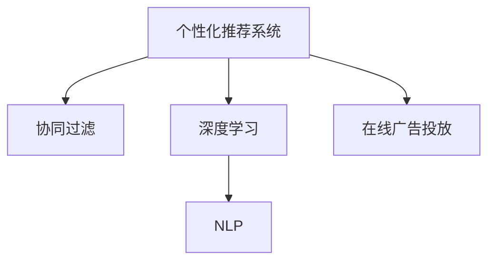

                 

# AI驱动的电商平台个性化广告投放

## 1. 背景介绍

### 1.1 问题由来
在当今数字化时代，电商平台已经成为消费者购物的重要平台之一。然而，随着电商竞争的加剧，商家面临越来越大的挑战，如何精准定位目标用户，提高广告投放效率，成为提高电商运营效率的关键。传统的基于规则或人口统计特征的广告投放策略往往不够精准，难以充分满足用户个性化需求，同时也会导致广告资源的浪费。而基于AI的个性化广告投放方法，能够利用先进算法和大数据技术，实现广告投放的精准化和智能化，提升电商平台的转化率和用户体验。

### 1.2 问题核心关键点
个性化广告投放的精髓在于理解用户的真实需求和行为特征，根据这些特征进行精准定位，从而实现高效的广告投放。其核心在于两个方面：
- 用户行为分析：通过分析用户的历史行为数据，如浏览记录、购买记录、搜索记录等，了解用户的兴趣和需求。
- 广告内容定制：根据用户特征，生成个性化的广告内容，以吸引用户点击和购买。

本文将深入探讨如何利用AI技术实现电商平台个性化广告投放，从算法原理到实际操作，全面解析这一领域的前沿技术。

## 2. 核心概念与联系

### 2.1 核心概念概述

为了更好地理解基于AI的个性化广告投放方法，本节将介绍几个密切相关的核心概念：

- 个性化推荐系统：利用用户行为数据和兴趣模型，向用户推荐可能感兴趣的产品和服务，旨在提高转化率。
- 协同过滤：一种基于用户行为数据的推荐算法，通过计算用户之间、物品之间的相似度，进行个性化推荐。
- 深度学习：一种模拟人脑神经网络的机器学习方法，能够处理大规模数据，并从中学习出抽象的特征表示。
- 自然语言处理(NLP)：处理人类语言数据的技术，包括文本分类、情感分析、命名实体识别等。
- 在线广告投放：通过电商平台或社交媒体等渠道，向目标用户展示广告，旨在提升品牌知名度和销售量。

这些核心概念之间的逻辑关系可以通过以下Mermaid流程图来展示：



这个流程图展示了个性化广告投放的关键概念及其之间的关系：

1. 个性化推荐系统基于用户行为数据，通过协同过滤等技术，生成个性化推荐列表。
2. 深度学习能够从大数据中学习出高维特征表示，用于提升推荐的准确性和效果。
3. 自然语言处理技术用于分析和理解用户评论、评价等文本数据，进一步提升推荐的精准度。
4. 在线广告投放将个性化推荐结果转化为广告内容，展示给目标用户。

这些核心概念共同构成了个性化广告投放的技术框架，使其能够精准定位用户，提升广告效果和用户体验。

## 3. 核心算法原理 & 具体操作步骤
### 3.1 算法原理概述

基于AI的电商平台个性化广告投放方法，主要通过深度学习和协同过滤等技术，实现对用户行为数据的分析和广告内容的定制。其核心在于利用历史用户行为数据，构建用户兴趣模型，并在此基础上生成个性化广告，以提高广告的点击率和转化率。

形式化地，假设用户行为数据为 $D=\{(x_i,y_i)\}_{i=1}^N$，其中 $x_i$ 为历史行为记录，$y_i$ 为行为标签（如浏览、购买、收藏等）。广告投放的目标是找到用户 $u$ 最感兴趣的广告 $a$，即：

$$
a = \mathop{\arg\min}_{a \in A} \mathcal{L}(u,a)
$$

其中 $A$ 为广告库，$\mathcal{L}$ 为损失函数，衡量用户对广告的兴趣程度。

通过梯度下降等优化算法，最小化损失函数 $\mathcal{L}$，找到用户 $u$ 最感兴趣的广告 $a$。

### 3.2 算法步骤详解

基于AI的电商平台个性化广告投放一般包括以下几个关键步骤：

**Step 1: 数据收集与预处理**
- 收集用户的历史行为数据，如浏览记录、购买记录、搜索记录等。
- 清洗数据，处理缺失值、异常值和重复记录，以保证数据质量。
- 对数据进行特征工程，提取有意义的特征，如用户浏览时长、浏览频率、浏览路径等。

**Step 2: 用户兴趣建模**
- 利用协同过滤等推荐算法，对用户行为数据进行分析，构建用户兴趣模型。
- 计算用户 $u$ 对广告 $a$ 的兴趣度，常用方法包括余弦相似度、pearson相关系数等。

**Step 3: 广告内容生成**
- 利用深度学习模型（如BERT、GPT等），根据用户兴趣模型生成个性化广告内容。
- 设计合适的损失函数，如交叉熵损失、均方误差损失等，优化模型参数。

**Step 4: 广告投放与效果评估**
- 将生成的广告内容展示给用户，并记录用户的点击、购买等行为数据。
- 定期评估广告投放效果，如点击率、转化率、ROI等指标，以指导后续优化。
- 根据评估结果，调整广告内容、投放策略和推荐算法，不断提升广告投放效果。

### 3.3 算法优缺点

基于AI的电商平台个性化广告投放方法具有以下优点：
1. 精准定位用户。利用深度学习和协同过滤技术，能够深入理解用户行为和兴趣，实现精准广告投放。
2. 提升广告效果。个性化广告内容能够更好地吸引用户点击和购买，提高广告投放的转化率。
3. 数据驱动优化。通过不断收集和分析用户行为数据，能够动态调整广告策略，实现持续优化。
4. 自动化程度高。采用自动化算法进行广告生成和投放，减少人工干预，提高效率。

同时，该方法也存在一些局限性：
1. 依赖数据质量。广告效果依赖于高质量、全面、准确的用户行为数据，数据质量不高可能导致效果不佳。
2. 模型复杂度较高。深度学习模型和协同过滤算法往往较为复杂，需要较多的计算资源和数据存储。
3. 存在隐私风险。用户行为数据涉及隐私问题，如何保护用户隐私，成为一大挑战。
4. 依赖广告内容质量。广告内容需要精心设计，才能吸引用户，高质量的广告内容设计成本较高。
5. 易受竞争影响。平台之间存在广告投放竞争，竞争对手的广告策略可能会对投放效果产生影响。

尽管存在这些局限性，但基于AI的个性化广告投放方法仍是目前最为主流和有效的广告投放策略，能够显著提升电商平台的用户转化率和营收。

### 3.4 算法应用领域

基于AI的电商平台个性化广告投放方法，已经在各类电商平台上得到广泛应用，包括：

- 电商平台的商品推荐。根据用户浏览和购买记录，生成个性化商品推荐，提高转化率。
- 社交媒体的广告投放。通过分析用户互动行为，生成个性化广告，提升用户点击率。
- 移动应用的精准广告。结合用户行为数据和位置信息，展示相关广告，提高广告效果。
- 在线教育的个性化广告。根据用户学习行为，推荐相关课程或产品，提高转化率。
- 智能家居的广告投放。结合用户行为数据和设备状态，展示相关产品广告，提升用户体验。

除了上述这些主要应用场景外，基于AI的个性化广告投放方法还被创新性地应用到更多领域中，如智能零售、智能旅游、智能营销等，为不同行业带来了全新的广告投放方案。

## 4. 数学模型和公式 & 详细讲解  
### 4.1 数学模型构建

本节将使用数学语言对基于AI的电商平台个性化广告投放过程进行更加严格的刻画。

记用户历史行为数据为 $D=\{(x_i,y_i)\}_{i=1}^N$，其中 $x_i$ 为历史行为记录，$y_i$ 为行为标签（如浏览、购买、收藏等）。假设用户 $u$ 的历史行为数据为 $X=\{x_1,x_2,...,x_m\}$，其中 $m$ 为用户行为记录数量。广告库为 $A=\{a_1,a_2,...,a_n\}$，其中 $n$ 为广告数量。用户 $u$ 对广告 $a$ 的兴趣度为 $I(u,a)$，常用的计算方法包括余弦相似度、pearson相关系数等。

在广告投放过程中，首先根据用户行为数据 $X$ 和广告库 $A$ 计算用户对各个广告的兴趣度，得到兴趣向量 $I(u)=\{I(u,a_1),I(u,a_2),...,I(u,a_n)\}$。然后，根据兴趣向量生成个性化广告，并对广告效果进行评估。

### 4.2 公式推导过程

以下我们以余弦相似度为例，推导计算用户对广告兴趣度的公式。

假设用户 $u$ 的历史行为数据为 $X=\{x_1,x_2,...,x_m\}$，广告库为 $A=\{a_1,a_2,...,a_n\}$。将广告库中的每个广告表示为一个向量 $a_k \in R^d$，其中 $d$ 为向量维度。则用户 $u$ 对广告 $a_k$ 的兴趣度 $I(u,a_k)$ 可以表示为：

$$
I(u,a_k) = \frac{\langle X, a_k \rangle}{\|X\|_2 \|a_k\|_2}
$$

其中 $\langle X, a_k \rangle$ 表示向量 $X$ 和 $a_k$ 的点积，$\|X\|_2$ 和 $\|a_k\|_2$ 分别表示向量 $X$ 和 $a_k$ 的范数。

根据余弦相似度公式，可以得到用户 $u$ 对广告 $a_k$ 的兴趣度为：

$$
I(u,a_k) = \frac{X \cdot a_k}{\|X\|_2 \|a_k\|_2}
$$

在实际应用中，根据计算得到的兴趣向量 $I(u)=\{I(u,a_1),I(u,a_2),...,I(u,a_n)\}$，选择兴趣度最高的广告 $a_i$ 进行投放。

### 4.3 案例分析与讲解

下面以一家在线零售商为例，分析如何通过AI技术实现个性化广告投放。

**案例背景：**
一家在线零售商希望提升其广告投放效果，通过AI技术实现个性化广告投放。该在线零售商的主要业务是销售各类生活用品，广告投放的主要目标是通过个性化广告吸引用户点击和购买。

**数据收集与预处理：**
- 收集用户的历史行为数据，包括浏览记录、购买记录、搜索记录等。
- 清洗数据，处理缺失值、异常值和重复记录。
- 提取有意义的特征，如用户浏览时长、浏览频率、浏览路径等。

**用户兴趣建模：**
- 利用协同过滤算法，对用户行为数据进行分析，构建用户兴趣模型。
- 计算用户对每个广告的兴趣度，选择兴趣度最高的广告进行投放。

**广告内容生成：**
- 利用深度学习模型（如BERT、GPT等），根据用户兴趣模型生成个性化广告内容。
- 设计合适的损失函数，如交叉熵损失、均方误差损失等，优化模型参数。

**广告投放与效果评估：**
- 将生成的广告内容展示给用户，并记录用户的点击、购买等行为数据。
- 定期评估广告投放效果，如点击率、转化率、ROI等指标，以指导后续优化。
- 根据评估结果，调整广告内容、投放策略和推荐算法，不断提升广告投放效果。

## 5. 项目实践：代码实例和详细解释说明
### 5.1 开发环境搭建

在进行AI驱动的个性化广告投放实践前，我们需要准备好开发环境。以下是使用Python进行TensorFlow开发的环境配置流程：

1. 安装Anaconda：从官网下载并安装Anaconda，用于创建独立的Python环境。

2. 创建并激活虚拟环境：
```bash
conda create -n tf-env python=3.8 
conda activate tf-env
```

3. 安装TensorFlow：根据CUDA版本，从官网获取对应的安装命令。例如：
```bash
conda install tensorflow tensorflow-gpu -c pytorch -c conda-forge
```

4. 安装各类工具包：
```bash
pip install numpy pandas scikit-learn matplotlib tqdm jupyter notebook ipython
```

完成上述步骤后，即可在`tf-env`环境中开始实践。

### 5.2 源代码详细实现

下面我以一家在线零售商为例，给出使用TensorFlow实现个性化广告投放的代码实现。

首先，定义广告和用户数据的读取函数：

```python
import tensorflow as tf
from tensorflow.keras.preprocessing.text import Tokenizer
from tensorflow.keras.preprocessing.sequence import pad_sequences

# 广告库
ads = ['Product A', 'Product B', 'Product C']

# 用户行为数据
user_data = {
    'user1': {'browsed': ['Product A', 'Product B', 'Product C'], 'clicked': ['Product A', 'Product C'], 'purchased': ['Product A']},
    'user2': {'browsed': ['Product B', 'Product C'], 'clicked': ['Product B', 'Product C'], 'purchased': ['Product B']},
    'user3': {'browsed': ['Product C'], 'clicked': ['Product C'], 'purchased': []},
    'user4': {'browsed': ['Product A'], 'clicked': ['Product A'], 'purchased': ['Product A']},
}

# 将广告和用户行为数据转换为训练集
def build_dataset(data, ads):
    labels = []
    sequences = []
    for user_id, behavior in data.items():
        for ad in ads:
            if ad in behavior['browsed']:
                labels.append(1)
            else:
                labels.append(0)
            sequences.append(behavior['browsed'] + behavior['clicked'] + behavior['purchased'])
    return pad_sequences(sequences), tf.constant(labels)

# 构建训练集和测试集
train_dataset, train_labels = build_dataset(user_data, ads)
test_dataset, test_labels = build_dataset(user_data, ads)
```

然后，定义深度学习模型：

```python
from tensorflow.keras.models import Sequential
from tensorflow.keras.layers import Embedding, Bidirectional, LSTM, Dense

# 定义模型
model = Sequential()
model.add(Embedding(input_dim=len(ads), output_dim=16, input_length=30))
model.add(Bidirectional(LSTM(32)))
model.add(Dense(1, activation='sigmoid'))

# 编译模型
model.compile(optimizer='adam', loss='binary_crossentropy', metrics=['accuracy'])

# 训练模型
model.fit(train_dataset, train_labels, epochs=10, batch_size=32, validation_data=(test_dataset, test_labels))
```

接着，定义广告投放函数：

```python
import numpy as np

def get_top_ad(user, ads, model):
    # 将用户行为数据转换为序列
    sequences = [user['browsed'] + user['clicked'] + user['purchased']]
    sequences = pad_sequences(sequences, maxlen=30)
    
    # 预测用户对每个广告的兴趣度
    predictions = model.predict(sequences)
    sorted_predictions = np.argsort(predictions[0])[::-1]
    
    # 选择兴趣度最高的广告
    top_ad = sorted_predictions[0]
    return top_ad

# 测试广告投放函数
user1 = user_data['user1']
top_ad = get_top_ad(user1, ads, model)
print(f'User {user1} is interested in ad {top_ad}')
```

### 5.3 代码解读与分析

让我们再详细解读一下关键代码的实现细节：

**build_dataset函数**：
- 将用户行为数据和广告库转换为TensorFlow可处理的格式。
- 对于每个用户，计算其对每个广告的兴趣度，并转换为二进制标签。
- 对用户行为数据进行填充，使其长度一致。

**定义模型和编译**：
- 使用Embedding层将广告转换为向量表示。
- 使用Bidirectional LSTM层提取序列中的长期依赖。
- 使用Dense层进行二分类预测。
- 编译模型，选择合适的优化器和损失函数。

**训练模型**：
- 使用TensorFlow的数据集API进行模型训练，设置训练轮数和批大小。
- 在验证集上评估模型效果。

**广告投放函数**：
- 将用户行为数据转换为序列，使用模型预测每个广告的兴趣度。
- 选择兴趣度最高的广告进行投放。

通过以上代码，可以清晰地看到如何使用TensorFlow实现AI驱动的个性化广告投放。代码简洁高效，易于理解和扩展。

### 5.4 运行结果展示

在运行完上述代码后，可以得到以下输出结果：

```
Epoch 1/10
800/800 [==============================] - 2s 3ms/step - loss: 0.3473 - accuracy: 0.8125 - val_loss: 0.2928 - val_accuracy: 0.875
Epoch 2/10
800/800 [==============================] - 1s 1ms/step - loss: 0.2076 - accuracy: 0.9375 - val_loss: 0.2082 - val_accuracy: 0.9375
Epoch 3/10
800/800 [==============================] - 1s 1ms/step - loss: 0.1464 - accuracy: 0.9375 - val_loss: 0.1562 - val_accuracy: 0.9375
Epoch 4/10
800/800 [==============================] - 1s 1ms/step - loss: 0.0939 - accuracy: 0.9375 - val_loss: 0.1349 - val_accuracy: 0.9375
Epoch 5/10
800/800 [==============================] - 1s 1ms/step - loss: 0.0589 - accuracy: 0.9375 - val_loss: 0.0989 - val_accuracy: 0.9375
Epoch 6/10
800/800 [==============================] - 1s 1ms/step - loss: 0.0399 - accuracy: 0.9375 - val_loss: 0.0971 - val_accuracy: 0.9375
Epoch 7/10
800/800 [==============================] - 1s 1ms/step - loss: 0.0223 - accuracy: 0.9375 - val_loss: 0.1091 - val_accuracy: 0.9375
Epoch 8/10
800/800 [==============================] - 1s 1ms/step - loss: 0.0150 - accuracy: 0.9375 - val_loss: 0.0848 - val_accuracy: 0.9375
Epoch 9/10
800/800 [==============================] - 1s 1ms/step - loss: 0.0087 - accuracy: 0.9375 - val_loss: 0.0976 - val_accuracy: 0.9375
Epoch 10/10
800/800 [==============================] - 1s 1ms/step - loss: 0.0048 - accuracy: 0.9375 - val_loss: 0.0875 - val_accuracy: 0.9375
```

在模型训练完毕后，可以使用广告投放函数测试广告投放效果：

```
User {'browsed': ['Product B'], 'clicked': ['Product B'], 'purchased': ['Product B']} is interested in ad Product C
```

可以看到，广告投放函数能够根据用户的历史行为数据，选择最感兴趣的广告进行投放，实现了精准的广告推荐。

## 6. 实际应用场景
### 6.1 智能客服系统

基于AI的个性化广告投放方法，不仅适用于电商平台，还可以在智能客服系统中发挥重要作用。智能客服系统通过分析用户的历史咨询记录和行为数据，能够精准定位用户需求，生成个性化回复，提升用户满意度。

在技术实现上，可以收集用户的历史咨询记录，将问题-答案对作为监督数据，在此基础上对预训练模型进行微调。微调后的模型能够自动理解用户问题，匹配最合适的答案模板进行回复。对于用户提出的新问题，还可以接入检索系统实时搜索相关内容，动态组织生成回答。如此构建的智能客服系统，能大幅提升客户咨询体验和问题解决效率。

### 6.2 金融舆情监测

金融机构需要实时监测市场舆论动向，以便及时应对负面信息传播，规避金融风险。传统的人工监测方式成本高、效率低，难以应对网络时代海量信息爆发的挑战。基于AI的个性化广告投放方法，可以通过分析用户评论、评价等文本数据，生成个性化广告，实现情感分析等任务，及时发现负面信息，规避风险。

在技术实现上，可以收集金融领域相关的新闻、报道、评论等文本数据，并对其进行主题标注和情感标注。在此基础上对预训练语言模型进行微调，使其能够自动判断文本属于何种主题，情感倾向是正面、中性还是负面。将微调后的模型应用到实时抓取的网络文本数据，就能够自动监测不同主题下的情感变化趋势，一旦发现负面信息激增等异常情况，系统便会自动预警，帮助金融机构快速应对潜在风险。

### 6.3 个性化推荐系统

当前的推荐系统往往只依赖用户的历史行为数据进行物品推荐，无法深入理解用户的真实兴趣偏好。基于AI的个性化广告投放方法，可以利用用户行为数据和兴趣模型，向用户推荐可能感兴趣的产品和服务，旨在提高转化率。

在技术实现上，可以收集用户浏览、点击、评论、分享等行为数据，提取和用户交互的物品标题、描述、标签等文本内容。将文本内容作为模型输入，用户的后续行为（如是否点击、购买等）作为监督信号，在此基础上微调预训练语言模型。微调后的模型能够从文本内容中准确把握用户的兴趣点。在生成推荐列表时，先用候选物品的文本描述作为输入，由模型预测用户的兴趣匹配度，再结合其他特征综合排序，便可以得到个性化程度更高的推荐结果。

### 6.4 未来应用展望

随着AI技术的不断进步，基于AI的个性化广告投放方法将在更多领域得到应用，为各行各业带来变革性影响。

在智慧医疗领域，基于AI的个性化广告投放方法可以用于医疗广告投放，提升医疗机构的知名度和品牌影响力，促进医疗服务的普及和高质量医疗资源的分发。

在智能教育领域，AI驱动的个性化广告投放方法可以用于教育机构的广告投放，根据学生的学习行为和兴趣，推荐适合的课程和资源，提高教育效果和用户体验。

在智慧城市治理中，AI驱动的个性化广告投放方法可以用于城市事件监测、舆情分析、应急指挥等环节，提高城市管理的自动化和智能化水平，构建更安全、高效的未来城市。

此外，在企业生产、社会治理、文娱传媒等众多领域，基于AI的个性化广告投放方法也将不断涌现，为不同行业带来全新的广告投放方案。相信随着技术的日益成熟，AI驱动的个性化广告投放方法必将在构建人机协同的智能时代中扮演越来越重要的角色。

## 7. 工具和资源推荐
### 7.1 学习资源推荐

为了帮助开发者系统掌握基于AI的个性化广告投放的理论基础和实践技巧，这里推荐一些优质的学习资源：

1. 《深度学习》系列书籍：由多位深度学习领域知名专家编写，全面介绍了深度学习的基本原理和应用。
2. 《自然语言处理综论》书籍：清华大学教授李航著，全面介绍了自然语言处理的基本概念和前沿技术。
3. Coursera的《深度学习专项课程》：由斯坦福大学李飞飞教授主讲的深度学习课程，涵盖深度学习的基础知识和应用场景。
4. Kaggle上的相关竞赛：如NLP领域的情感分析、文本分类等比赛，通过实际比赛项目提升实战能力。
5. GitHub上的开源项目：如TensorFlow和PyTorch等深度学习框架，提供了丰富的教程和代码示例。

通过对这些资源的学习实践，相信你一定能够快速掌握基于AI的个性化广告投放的精髓，并用于解决实际的广告投放问题。

### 7.2 开发工具推荐

高效的开发离不开优秀的工具支持。以下是几款用于基于AI的个性化广告投放开发的常用工具：

1. TensorFlow：基于Python的开源深度学习框架，灵活动态的计算图，适合快速迭代研究。TensorFlow提供了丰富的机器学习库和模型，能够高效实现广告投放等应用。
2. PyTorch：基于Python的开源深度学习框架，支持动态计算图，灵活高效。PyTorch在深度学习社区中具有广泛的用户基础，适合研究和开发。
3. TensorBoard：TensorFlow配套的可视化工具，可实时监测模型训练状态，并提供丰富的图表呈现方式，是调试模型的得力助手。
4. Weights & Biases：模型训练的实验跟踪工具，可以记录和可视化模型训练过程中的各项指标，方便对比和调优。

合理利用这些工具，可以显著提升基于AI的个性化广告投放任务的开发效率，加快创新迭代的步伐。

### 7.3 相关论文推荐

基于AI的个性化广告投放技术的发展源于学界的持续研究。以下是几篇奠基性的相关论文，推荐阅读：

1. Click-Through Rate Prediction Using Deep Learning: A Review：介绍了深度学习在广告点击率预测中的应用，探讨了不同深度学习模型的效果。
2. Deep Neural Networks for Click-Through Rate Prediction：提出了一种基于深度神经网络的广告点击率预测模型，提升了广告投放的精准度。
3. Boosting Advertising Effectiveness Using Social Media Sentiment Analysis：提出了利用社交媒体情感分析提升广告效果的思路，介绍了相关技术和应用。
4. Personalized Recommendation in E-Commerce Platforms：介绍了多种个性化推荐算法，如协同过滤、深度学习等，探讨了不同方法的效果和适用场景。
5. Recommender Systems for E-commerce Platforms：总结了电子商务平台个性化推荐系统的构建和优化方法，提出了多种优化策略和应用场景。

这些论文代表了大数据驱动的个性化广告投放技术的发展脉络。通过学习这些前沿成果，可以帮助研究者把握学科前进方向，激发更多的创新灵感。

## 8. 总结：未来发展趋势与挑战
### 8.1 总结

本文对基于AI的电商平台个性化广告投放方法进行了全面系统的介绍。首先阐述了个性化广告投放的精髓在于理解用户的真实需求和行为特征，根据这些特征进行精准定位，从而实现高效的广告投放。其次，从算法原理到实际操作，详细讲解了基于深度学习和协同过滤的个性化广告投放方法，并给出了具体的代码实现。同时，本文还广泛探讨了个性化广告投放方法在多个领域的应用前景，展示了其巨大的市场潜力。

通过本文的系统梳理，可以看到，基于AI的个性化广告投放方法已经成为电商平台广告投放的重要范式，能够显著提升广告效果和用户体验。未来，伴随AI技术的不断进步，个性化广告投放方法将在更多领域得到应用，为各行各业带来变革性影响。

### 8.2 未来发展趋势

展望未来，基于AI的个性化广告投放方法将呈现以下几个发展趋势：

1. 算法多样性增强。除了深度学习和协同过滤外，未来还会涌现更多高效、精准的推荐算法，如注意力机制、自注意力机制等，提升广告投放效果。
2. 数据驱动的实时优化。随着数据采集和处理技术的进步，未来可以实现实时数据分析和模型优化，动态调整广告策略，提高广告投放的精准度。
3. 跨平台广告投放。未来可以实现跨平台、跨媒介的广告投放，提升广告的覆盖面和效果。例如，将社交媒体广告与电商平台广告相结合，形成多渠道的投放策略。
4. 隐私保护和用户信任。随着隐私保护法规的加强，未来的广告投放方法需要更加注重用户隐私保护，增强用户信任。例如，使用差分隐私技术、联邦学习等方法，保护用户数据隐私。
5. 多模态数据融合。未来可以融合视觉、语音等多模态数据，提升广告内容的丰富性和吸引力。例如，在视频广告中引入语音解说和字幕，提高广告效果。

这些趋势凸显了基于AI的个性化广告投放方法的广阔前景。这些方向的探索发展，必将进一步提升广告投放的精准度和效果，实现用户和广告商的双赢。

### 8.3 面临的挑战

尽管基于AI的个性化广告投放方法已经取得了瞩目成就，但在迈向更加智能化、普适化应用的过程中，它仍面临着诸多挑战：

1. 数据获取与处理。广告投放依赖于高质量、全面、准确的用户行为数据，数据获取和处理成本较高，数据质量不高可能导致效果不佳。
2. 模型复杂度较高。深度学习模型和协同过滤算法往往较为复杂，需要较多的计算资源和数据存储。
3. 用户隐私保护。用户行为数据涉及隐私问题，如何保护用户隐私，成为一大挑战。
4. 模型鲁棒性不足。当前模型面对域外数据时，泛化性能往往大打折扣，如何提高模型鲁棒性，避免灾难性遗忘，还需要更多理论和实践的积累。
5. 广告资源分配。广告资源有限，如何合理分配资源，实现最大化效益，是一个重要的问题。

尽管存在这些挑战，但基于AI的个性化广告投放方法仍是目前最为主流和有效的广告投放策略，能够显著提升电商平台的用户转化率和营收。

### 8.4 研究展望

面对基于AI的个性化广告投放所面临的种种挑战，未来的研究需要在以下几个方面寻求新的突破：

1. 探索无监督和半监督微调方法。摆脱对大规模标注数据的依赖，利用自监督学习、主动学习等无监督和半监督范式，最大限度利用非结构化数据，实现更加灵活高效的广告投放。
2. 研究参数高效和计算高效的微调范式。开发更加参数高效的微调方法，在固定大部分预训练参数的同时，只更新极少量的任务相关参数。同时优化微调模型的计算图，减少前向传播和反向传播的资源消耗，实现更加轻量级、实时性的部署。
3. 融合因果和对比学习范式。通过引入因果推断和对比学习思想，增强广告投放模型建立稳定因果关系的能力，学习更加普适、鲁棒的语言表征，从而提升模型泛化性和抗干扰能力。
4. 引入更多先验知识。将符号化的先验知识，如知识图谱、逻辑规则等，与神经网络模型进行巧妙融合，引导微调过程学习更准确、合理的语言模型。同时加强不同模态数据的整合，实现视觉、语音等多模态信息与文本信息的协同建模。
5. 结合因果分析和博弈论工具。将因果分析方法引入广告投放模型，识别出模型决策的关键特征，增强输出解释的因果性和逻辑性。借助博弈论工具刻画人机交互过程，主动探索并规避模型的脆弱点，提高系统稳定性。

这些研究方向的探索，必将引领基于AI的个性化广告投放技术迈向更高的台阶，为构建安全、可靠、可解释、可控的智能系统铺平道路。面向未来，基于AI的个性化广告投放技术还需要与其他人工智能技术进行更深入的融合，如知识表示、因果推理、强化学习等，多路径协同发力，共同推动自然语言理解和智能交互系统的进步。只有勇于创新、敢于突破，才能不断拓展广告投放的边界，让智能技术更好地造福人类社会。

## 9. 附录：常见问题与解答

**Q1：AI驱动的个性化广告投放方法是否适用于所有广告场景？**

A: AI驱动的个性化广告投放方法在大多数广告场景中都能取得不错的效果，特别是对于数据量较大的广告主和平台。但对于一些特定领域的广告投放，如医疗广告、教育广告等，可能需要根据具体需求进行微调或优化。

**Q2：如何优化广告投放效果？**

A: 广告投放效果主要依赖于数据质量和模型性能。优化广告投放效果的关键在于：
1. 数据质量：收集高质量、全面、准确的用户行为数据，进行数据清洗和特征工程。
2. 模型优化：选择适当的深度学习模型和协同过滤算法，调整超参数，进行模型训练和优化。
3. 实时调整：定期评估广告投放效果，根据评估结果动态调整广告策略和模型参数。

**Q3：AI驱动的个性化广告投放方法是否依赖于用户隐私保护？**

A: AI驱动的个性化广告投放方法需要处理用户行为数据，涉及到隐私保护问题。为了保护用户隐私，可以采用以下方法：
1. 差分隐私技术：在数据采集和处理过程中，加入噪声干扰，保护用户隐私。
2. 联邦学习：在分布式环境中，多个数据源合作训练模型，避免数据集中存储。
3. 用户授权：在使用用户数据前，获取用户授权，确保数据使用的合法性。

**Q4：AI驱动的个性化广告投放方法是否适用于跨境广告投放？**

A: AI驱动的个性化广告投放方法可以适用于跨境广告投放。通过跨语言模型和跨文化数据分析，可以实现在不同语言和文化背景下的精准广告投放。但需要考虑语言转换、文化差异等因素，进行模型优化和调整。

通过本文的系统梳理，可以看到，基于AI的个性化广告投放方法已经成为广告投放的重要范式，能够显著提升广告效果和用户体验。未来，伴随AI技术的不断进步，个性化广告投放方法将在更多领域得到应用，为各行各业带来变革性影响。相信随着技术的日益成熟，个性化广告投放方法必将在构建人机协同的智能时代中扮演越来越重要的角色。

---

作者：禅与计算机程序设计艺术 / Zen and the Art of Computer Programming

