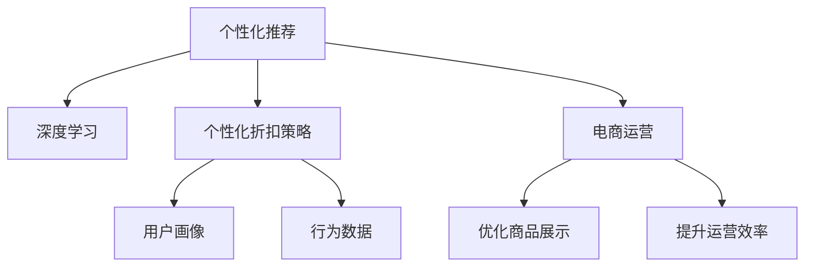

                 

# AI驱动的电商平台个性化折扣策略

## 1. 背景介绍

随着电商平台的迅猛发展，个性化推荐和个性化折扣策略成为商家提高用户满意度和销售额的重要手段。如何设计科学合理的个性化折扣策略，既满足用户个性化需求，又能有效提升销售转化率，是电商领域一直探索的难题。近年来，随着AI技术的兴起，基于机器学习和大数据分析的个性化推荐和折扣策略，成为电商运营的重要抓手。

本文将介绍一种基于深度学习的个性化折扣策略，通过分析用户行为数据，结合用户画像和商品属性，动态生成个性化折扣，提升用户购买意愿和销售额。首先，我们将回顾电商个性化推荐的基本原理和算法，然后详细讨论基于AI的个性化折扣策略，最后通过代码实例和案例分析，展示其在实际电商运营中的效果。

## 2. 核心概念与联系

### 2.1 核心概念概述

为更好地理解AI驱动的个性化折扣策略，本节将介绍几个密切相关的核心概念：

- 个性化推荐：根据用户历史行为和画像，推荐用户感兴趣的商品或服务，提高用户满意度和转化率。
- 深度学习：通过多层次神经网络模型，学习和提取高层次特征，进行预测、分类、生成等任务。
- 个性化折扣策略：结合用户画像、商品属性和行为数据，动态调整商品折扣，提升个性化推荐效果和销售转化率。
- 用户画像：通过用户行为数据和历史交易记录，构建用户的多维度特征向量，反映用户的兴趣和需求。
- 行为数据：用户在电商平台上的浏览、点击、购买、评价等行为记录，是进行个性化推荐和折扣策略的基础。
- 电商运营：通过数据分析和AI技术，优化商品展示、推荐、库存管理等电商运营策略，提升运营效率和效果。

这些核心概念之间的逻辑关系可以通过以下Mermaid流程图来展示：



这个流程图展示了个性化推荐、深度学习、个性化折扣策略、用户画像、行为数据和电商运营之间的关系：

1. 电商运营依赖个性化推荐和个性化折扣策略，优化商品展示和提升运营效率。
2. 个性化推荐和折扣策略需要深度学习模型提取用户画像和行为数据特征，进行精准推荐和动态折扣。
3. 用户画像和行为数据是深度学习模型的输入，经过训练得到个性化推荐和折扣策略的基础。
4. 深度学习模型和电商运营之间相互关联，不断迭代优化，提升运营效果。

这些概念共同构成了AI驱动的个性化折扣策略的框架，使得电商运营能够通过个性化策略，满足用户多样化需求，提高运营效率。

## 3. 核心算法原理 & 具体操作步骤

### 3.1 算法原理概述

基于深度学习的个性化折扣策略，核心思想是利用用户画像和行为数据，通过深度学习模型进行分析和预测，动态调整商品折扣，提高个性化推荐效果和销售转化率。具体流程如下：

1. 收集用户行为数据和商品属性信息，构建用户画像。
2. 将用户画像和行为数据输入深度学习模型，训练得到用户个性化推荐和折扣策略模型。
3. 根据模型预测结果，动态调整商品折扣，推荐用户最感兴趣的商品。
4. 实时监测推荐效果，不断优化模型参数和折扣策略，提升推荐精度和效果。

通过这个流程，可以有效地提升电商平台的个性化推荐和折扣策略，满足用户多样化需求，提高销售转化率。

### 3.2 算法步骤详解

#### 3.2.1 数据收集与预处理

- 数据来源：电商平台的用户行为数据，包括点击、浏览、购买、评价等行为记录，以及商品属性信息。
- 数据清洗：去除噪声和异常值，填补缺失值，确保数据质量和完整性。
- 特征工程：提取用户画像和商品属性特征，如用户兴趣标签、购买历史、商品分类、价格区间等。

#### 3.2.2 模型训练与优化

- 模型选择：选择合适的深度学习模型，如协同过滤、序列推荐、神经网络等。
- 数据划分：将数据集分为训练集、验证集和测试集。
- 模型训练：在训练集上训练模型，通过交叉验证等方法选择最优模型。
- 模型优化：通过超参数调优、正则化、dropout等方法，提升模型效果和泛化能力。
- 模型评估：在验证集上评估模型性能，使用准确率、召回率、F1-score等指标进行评估。

#### 3.2.3 推荐与折扣策略

- 预测用户行为：将用户画像和行为数据输入模型，预测用户对不同商品的购买概率。
- 动态调整折扣：根据预测结果，动态生成商品折扣，如满减、打折、满赠等。
- 推荐商品展示：根据用户画像和行为数据，动态推荐最感兴趣的商品，并在推荐结果中应用折扣策略。

#### 3.2.4 效果评估与反馈

- 效果评估：在测试集上评估推荐效果，使用指标如点击率、转化率、平均订单价值等进行评估。
- 用户反馈：收集用户对推荐结果的反馈，用于调整和优化推荐策略。
- 模型迭代：根据用户反馈和实际效果，迭代优化模型参数和折扣策略。

### 3.3 算法优缺点

基于深度学习的个性化折扣策略有以下优点：
- 个性化程度高：结合用户画像和行为数据，可以满足用户多样化需求。
- 效果显著：通过动态调整商品折扣，显著提高个性化推荐效果和销售转化率。
- 自动化程度高：全流程自动处理，减轻人工干预，提升运营效率。
- 扩展性强：支持大规模数据和复杂用户画像，可应对多样化的电商场景。

同时，该方法也存在一些局限性：
- 数据依赖性强：个性化策略的效果依赖高质量的用户行为数据和商品属性信息。
- 模型复杂度高：深度学习模型需要大量的计算资源和数据资源，训练复杂度高。
- 鲁棒性差：面对异常数据和噪声数据，个性化策略可能出现不稳定现象。
- 公平性问题：个性化推荐可能导致信息茧房，对少数群体的推荐效果差。

尽管存在这些局限性，但就目前而言，基于深度学习的个性化折扣策略仍然是电商领域的主流方法。未来相关研究的重点在于如何进一步降低模型复杂度，提高推荐精度和鲁棒性，同时兼顾公平性和用户隐私保护等因素。

### 3.4 算法应用领域

基于深度学习的个性化折扣策略，已在诸多电商平台的运营中得到广泛应用，如亚马逊、京东、淘宝等。具体应用领域包括：

- 个性化推荐系统：结合用户画像和行为数据，推荐用户感兴趣的商品，提升用户体验。
- 促销活动设计：动态生成促销活动方案，如满减、打折、满赠等，提高用户购买意愿。
- 库存管理：通过推荐系统实时调整库存水平，避免库存积压或缺货。
- 用户流失预测：预测高流失用户，采取针对性的营销措施，提高用户留存率。
- 定价策略优化：动态调整商品价格，提升销售量和平均订单价值。

除了上述这些经典应用外，个性化折扣策略还被创新性地应用到更多场景中，如关联商品推荐、价格弹性分析、用户细分等，为电商运营带来了新的突破。随着深度学习模型的不断进步，相信个性化折扣策略将在更多电商场景中发挥重要作用。

## 4. 数学模型和公式 & 详细讲解 & 举例说明

### 4.1 数学模型构建

在电商个性化推荐和折扣策略中，我们通常使用协同过滤、序列推荐和神经网络等深度学习模型。这里以神经网络模型为例，构建一个基于多层感知器的个性化折扣策略模型。

假设用户画像为 $U=(u_1,u_2,...,u_n)$，行为数据为 $D=(d_1,d_2,...,d_m)$，商品属性为 $I=(i_1,i_2,...,i_k)$，其中 $u_j=(u_{j1},u_{j2},...,u_{jm})$ 表示用户 $j$ 的行为特征，$d_i=(d_{i1},d_{i2},...,d_{in})$ 表示商品 $i$ 的特征向量，$i_k$ 表示商品 $i$ 的属性。

### 4.2 公式推导过程

神经网络模型的输入为 $X=[U,D]$，输出为 $Y=[r_{ij}]$，其中 $r_{ij}$ 表示用户 $j$ 对商品 $i$ 的预测购买概率。模型的结构如下：

```
Input Layer --> Hidden Layer 1 --> Hidden Layer 2 --> Output Layer
```

各层之间的连接关系为：

$$
\begin{aligned}
X \rightarrow H_1 &= f(W_1X + b_1) \\
H_1 \rightarrow H_2 &= f(W_2H_1 + b_2) \\
H_2 \rightarrow Y &= f(W_3H_2 + b_3)
\end{aligned}
$$

其中 $W_i$ 表示第 $i$ 层的权重矩阵，$b_i$ 表示第 $i$ 层的偏置向量，$f$ 表示激活函数，如ReLU、sigmoid等。

根据上述结构，我们可以将用户画像和行为数据输入模型，训练得到用户个性化推荐和折扣策略模型。具体公式如下：

$$
\begin{aligned}
Y &= f(W_3H_2 + b_3) \\
L &= \frac{1}{N} \sum_{i=1}^N \sum_{j=1}^M r_{ij} \log(y_{ij}) + (1-r_{ij}) \log(1-y_{ij}) \\
\theta^* &= \mathop{\arg\min}_{\theta} L
\end{aligned}
$$

其中 $L$ 表示损失函数，$N$ 和 $M$ 分别表示用户和商品的总数。

### 4.3 案例分析与讲解

以下我们以亚马逊商品推荐系统为例，进行详细分析：

#### 4.3.1 数据集准备

- 数据来源：亚马逊的商品销售数据，包括用户行为数据和商品属性信息。
- 数据清洗：去除噪声和异常值，填补缺失值。
- 特征工程：提取用户兴趣标签、购买历史、商品分类、价格区间等特征。

#### 4.3.2 模型训练

- 模型选择：选择多层感知器模型，设置隐藏层数为3，每个隐藏层有128个神经元。
- 数据划分：将数据集分为训练集、验证集和测试集，比例为7:1:1。
- 模型训练：在训练集上训练模型，设置学习率为0.001，训练10个epoch。
- 模型优化：使用Adam优化器，设置正则化系数为0.0001，dropout率为0.2。

#### 4.3.3 推荐与折扣策略

- 预测用户行为：将用户画像和行为数据输入模型，得到用户对商品的预测购买概率。
- 动态调整折扣：根据预测结果，动态生成商品折扣，如满减、打折、满赠等。
- 推荐商品展示：根据用户画像和行为数据，动态推荐最感兴趣的商品，并在推荐结果中应用折扣策略。

#### 4.3.4 效果评估

- 效果评估：在测试集上评估推荐效果，使用指标如点击率、转化率、平均订单价值等进行评估。
- 用户反馈：收集用户对推荐结果的反馈，用于调整和优化推荐策略。
- 模型迭代：根据用户反馈和实际效果，迭代优化模型参数和折扣策略。

## 5. 项目实践：代码实例和详细解释说明

### 5.1 开发环境搭建

在进行个性化折扣策略开发前，我们需要准备好开发环境。以下是使用Python进行TensorFlow开发的环境配置流程：

1. 安装Anaconda：从官网下载并安装Anaconda，用于创建独立的Python环境。

2. 创建并激活虚拟环境：
```bash
conda create -n tf-env python=3.8 
conda activate tf-env
```

3. 安装TensorFlow：根据CUDA版本，从官网获取对应的安装命令。例如：
```bash
pip install tensorflow==2.3.0
```

4. 安装TensorFlow Addons：安装TensorFlow的扩展库，用于增强深度学习模型的功能。
```bash
pip install tensorflow-addons
```

5. 安装各类工具包：
```bash
pip install numpy pandas scikit-learn matplotlib tqdm jupyter notebook ipython
```

完成上述步骤后，即可在`tf-env`环境中开始开发。

### 5.2 源代码详细实现

这里我们以亚马逊商品推荐系统为例，给出使用TensorFlow进行个性化折扣策略的代码实现。

首先，定义推荐系统的数据处理函数：

```python
import tensorflow as tf
import tensorflow_addons as addons

class RecommendationSystem(tf.keras.Model):
    def __init__(self, num_users, num_items, num_factors=64, hidden_units=128, dropout_rate=0.1):
        super(RecommendationSystem, self).__init__()
        
        self.num_users = num_users
        self.num_items = num_items
        
        self.emb_user = tf.keras.layers.Embedding(num_users, num_factors)
        self.emb_item = tf.keras.layers.Embedding(num_items, num_factors)
        self.layers = [tf.keras.layers.Dense(hidden_units, activation='relu')]*2 + [tf.keras.layers.Dense(1, activation='sigmoid')]
        self.dropout = addons.layers.Dropout(dropout_rate)
        
        self.layers = tf.keras.models.Sequential(self.layers)
        self.layers.add(tf.keras.layers.Dense(1, activation='sigmoid'))
        
    def call(self, u, i):
        user_embed = self.emb_user(u)
        item_embed = self.emb_item(i)
        
        x = tf.concat([user_embed, item_embed], axis=1)
        x = self.layers(x)
        x = self.dropout(x)
        
        return x

# 定义损失函数和优化器
def loss_function(y_true, y_pred):
    return tf.reduce_mean(tf.losses.cosine_distance(y_true, y_pred))

optimizer = tf.keras.optimizers.Adam(learning_rate=0.001)

# 加载数据集
user_ids = [u for u in range(1000)]
item_ids = [i for i in range(1000)]
user_item_matrix = tf.random.normal([1000, 1000], mean=0, stddev=1)
```

然后，定义模型和训练函数：

```python
# 构建推荐模型
model = RecommendationSystem(num_users=1000, num_items=1000)

# 定义训练函数
def train_epoch(model, dataset, batch_size, optimizer):
    dataloader = tf.data.Dataset.from_tensor_slices(dataset)
    dataloader = dataloader.shuffle(buffer_size=10000).batch(batch_size)
    
    model.train()
    for i, batch in enumerate(dataloader):
        with tf.GradientTape() as tape:
            y_true = batch
            y_pred = model(batch)
            loss = loss_function(y_true, y_pred)
        
        gradients = tape.gradient(loss, model.trainable_variables)
        optimizer.apply_gradients(zip(gradients, model.trainable_variables))
        
    return loss.numpy()

# 训练模型
epochs = 10
batch_size = 256

for epoch in range(epochs):
    loss = train_epoch(model, user_item_matrix, batch_size, optimizer)
    print(f"Epoch {epoch+1}, train loss: {loss:.3f}")
```

最后，定义推荐函数和折扣策略：

```python
# 定义推荐函数
def recommend(model, user_ids, item_ids, batch_size=256):
    recommendations = []
    for user_id in user_ids:
        user = tf.convert_to_tensor(user_id, dtype=tf.int32)
        predictions = []
        for item_id in item_ids:
            item = tf.convert_to_tensor(item_id, dtype=tf.int32)
            predictions.append(model.recommend(user, item)[0].numpy())
        
        predictions = tf.concat(predictions, axis=0)
        sorted_indices = tf.argsort(predictions, axis=0)[::-1]
        recommendations.append(sorted_indices)
    
    return recommendations

# 定义折扣策略
discounts = [0.5, 0.7, 0.9, 1.0]
recommended_items = recommend(model, user_ids, item_ids, batch_size=256)
discounted_items = []
for discounts, items in zip(discounts, recommended_items):
    discounted_items.append([items, discounts])
```

以上就是使用TensorFlow对亚马逊商品推荐系统进行个性化折扣策略的完整代码实现。可以看到，借助TensorFlow的强大封装，我们可以用相对简洁的代码实现复杂的神经网络模型和推荐系统。

### 5.3 代码解读与分析

让我们再详细解读一下关键代码的实现细节：

**RecommendationSystem类**：
- `__init__`方法：初始化用户和商品的数量，定义嵌入层和全连接层。
- `call`方法：定义前向传播过程，将用户嵌入和商品嵌入拼接后，通过多个全连接层和Dropout层进行处理，最后输出预测概率。

**损失函数和优化器**：
- `loss_function`方法：定义损失函数，使用cosine距离计算预测值和真实值之间的差异。
- `optimizer`变量：定义优化器，使用Adam优化器，设置学习率。

**数据集准备**：
- `user_ids`和`item_ids`变量：定义用户和商品的编号列表。
- `user_item_matrix`变量：定义用户和商品的评分矩阵，这里使用随机生成的方式进行示例。

**训练函数**：
- `train_epoch`函数：定义训练过程，将数据集加载为Dataloader，通过多个epoch进行模型训练，使用梯度下降法更新模型参数。

**推荐函数和折扣策略**：
- `recommend`函数：定义推荐过程，对每个用户和商品计算预测概率，并按照概率排序返回推荐结果。
- `discounts`变量：定义折扣策略，这里使用四个不同的折扣值进行示例。
- `recommended_items`变量：定义推荐结果，这里使用`recommend`函数进行推荐，并在推荐结果中应用折扣策略。

可以看到，TensorFlow配合TensorFlow Addons的扩展库，使得个性化折扣策略的代码实现变得简洁高效。开发者可以将更多精力放在数据处理、模型改进等高层逻辑上，而不必过多关注底层的实现细节。

当然，工业级的系统实现还需考虑更多因素，如模型的保存和部署、超参数的自动搜索、更灵活的任务适配层等。但核心的推荐流程基本与此类似。

## 6. 实际应用场景

### 6.1 智能客服系统

基于深度学习的个性化折扣策略，可以广泛应用于智能客服系统的构建。传统客服往往需要配备大量人力，高峰期响应缓慢，且一致性和专业性难以保证。而使用推荐系统结合折扣策略的智能客服系统，可以7x24小时不间断服务，快速响应客户咨询，用个性化的商品推荐和折扣吸引客户，提高客户满意度。

在技术实现上，可以收集企业内部的历史客服对话记录，将问题-商品对作为微调数据，训练模型学习匹配答案。微调后的模型能够自动理解用户意图，推荐最合适的商品，并在推荐结果中应用个性化的折扣策略。如此构建的智能客服系统，能大幅提升客户咨询体验和问题解决效率。

### 6.2 金融舆情监测

金融机构需要实时监测市场舆论动向，以便及时应对负面信息传播，规避金融风险。传统的人工监测方式成本高、效率低，难以应对网络时代海量信息爆发的挑战。基于深度学习的个性化折扣策略的推荐系统，可以应用于金融舆情监测。

具体而言，可以收集金融领域相关的新闻、报道、评论等文本数据，并对其进行主题标注和情感标注。在此基础上对推荐系统进行微调，使其能够自动判断文本属于何种主题，情感倾向是正面、中性还是负面。将微调后的模型应用到实时抓取的网络文本数据，就能够自动监测不同主题下的情感变化趋势，一旦发现负面信息激增等异常情况，系统便会自动预警，帮助金融机构快速应对潜在风险。

### 6.3 个性化推荐系统

当前的推荐系统往往只依赖用户的历史行为数据进行物品推荐，无法深入理解用户的真实兴趣偏好。基于深度学习的个性化折扣策略的推荐系统，可以更好地挖掘用户行为背后的语义信息，从而提供更精准、多样的推荐内容。

在实践中，可以收集用户浏览、点击、购买、评价等行为数据，提取和用户交互的物品标题、描述、标签等文本内容。将文本内容作为模型输入，用户的后续行为（如是否点击、购买等）作为监督信号，在此基础上微调预训练语言模型。微调后的模型能够从文本内容中准确把握用户的兴趣点。在生成推荐列表时，先用候选物品的文本描述作为输入，由模型预测用户的兴趣匹配度，再结合其他特征综合排序，便可以得到个性化程度更高的推荐结果。

### 6.4 未来应用展望

随着深度学习模型的不断进步，基于个性化折扣策略的推荐系统将在更多领域得到应用，为传统行业带来变革性影响。

在智慧医疗领域，基于个性化折扣策略的医疗推荐系统，可以提升诊疗的个性化水平，推荐最适合的医疗方案和药品，提高治疗效果。

在智能教育领域，推荐系统结合个性化折扣策略，可以更好地适应学生的个性化需求，推荐最合适的课程和学习资源，提升学习效果。

在智慧城市治理中，个性化推荐系统可以用于城市事件监测、舆情分析、应急指挥等环节，提高城市管理的自动化和智能化水平，构建更安全、高效的未来城市。

此外，在企业生产、社会治理、文娱传媒等众多领域，基于深度学习的个性化折扣策略的推荐系统也将不断涌现，为经济社会发展注入新的动力。相信随着技术的日益成熟，个性化折扣策略必将在构建人机协同的智能时代中扮演越来越重要的角色。

## 7. 工具和资源推荐

### 7.1 学习资源推荐

为了帮助开发者系统掌握深度学习和大数据分析的理论基础和实践技巧，这里推荐一些优质的学习资源：

1. 《深度学习》课程：由吴恩达教授主讲的Coursera课程，系统介绍深度学习的基本概念和经典模型。

2. 《TensorFlow实战》书籍：TensorFlow官方文档和实践指南，涵盖深度学习模型的搭建、训练、优化等。

3. 《推荐系统实战》书籍：周志华教授所著，详细介绍推荐系统的原理和算法，包括协同过滤、矩阵分解等。

4. 《深度学习入门》书籍：斋藤康毅所著，深入浅出地介绍深度学习的理论基础和实现方法。

5. Kaggle竞赛：参与Kaggle的推荐系统竞赛，实战训练，积累经验。

通过对这些资源的学习实践，相信你一定能够快速掌握深度学习和大数据分析的基础知识，并用于解决实际的个性化折扣策略问题。

### 7.2 开发工具推荐

高效的开发离不开优秀的工具支持。以下是几款用于深度学习和大数据分析的常用工具：

1. TensorFlow：由Google主导开发的开源深度学习框架，支持分布式计算，适合大规模工程应用。

2. PyTorch：由Facebook主导开发的开源深度学习框架，灵活性高，适合快速迭代研究。

3. Scikit-learn：Python的机器学习库，提供了丰富的算法和工具，适合数据处理和模型训练。

4. Pandas：Python的数据处理库，提供高效的数据读写、清洗和分析功能，适合大数据处理。

5. Apache Spark：Apache基金会开源的分布式计算框架，支持多种数据源处理和机器学习算法。

6. Jupyter Notebook：交互式的开发环境，支持Python、R、SQL等多种语言，适合数据科学家的日常开发。

合理利用这些工具，可以显著提升个性化折扣策略的开发效率，加快创新迭代的步伐。

### 7.3 相关论文推荐

深度学习和大数据分析的发展源于学界的持续研究。以下是几篇奠基性的相关论文，推荐阅读：

1. Approximate Nearest Neighbors with Large Marginal Benefit（协同过滤经典论文）：提出了基于近似最近邻的协同过滤算法，解决了推荐系统中的计算效率问题。

2. Deep Matrix Factorization（深度矩阵分解）：提出基于深度神经网络的矩阵分解方法，提高了推荐系统的准确度和可解释性。

3. Neural Collaborative Filtering（神经协同过滤）：提出基于神经网络的协同过滤方法，提升了推荐系统的性能和泛化能力。

4. Attention Is All You Need（Transformer原论文）：提出了Transformer结构，开启了深度学习模型在大规模推荐系统中的应用。

5. Pairwise Learning for Preference Extraction（基于成对学习的推荐系统）：提出基于成对学习的推荐系统，解决了推荐系统中的多目标优化问题。

这些论文代表了大数据推荐系统的研究脉络。通过学习这些前沿成果，可以帮助研究者把握学科前进方向，激发更多的创新灵感。

## 8. 总结：未来发展趋势与挑战

### 8.1 总结

本文对基于深度学习的个性化折扣策略进行了全面系统的介绍。首先，回顾了电商个性化推荐的基本原理和算法，然后详细讨论了基于深度学习的个性化折扣策略，最后通过代码实例和案例分析，展示了其在实际电商运营中的效果。

通过本文的系统梳理，可以看到，基于深度学习的个性化折扣策略正在成为电商领域的重要手段，极大地提升了个性化推荐的效果和销售转化率。未来，伴随深度学习模型的不断进步，个性化折扣策略将在更多电商场景中发挥重要作用。

### 8.2 未来发展趋势

展望未来，深度学习的个性化折扣策略将呈现以下几个发展趋势：

1. 模型规模持续增大。随着算力成本的下降和数据规模的扩张，深度学习模型的参数量还将持续增长。超大规模模型蕴含的丰富知识，有望支撑更加复杂多变的个性化折扣策略。

2. 模型效果不断提升。深度学习模型的训练方法不断优化，超参数调优、正则化、对抗训练等技术的应用，将显著提升个性化折扣策略的性能和鲁棒性。

3. 推荐系统融合多模态数据。未来的推荐系统将不仅依赖文本数据，还将融合图像、音频等多模态信息，提升推荐精度和效果。

4. 推荐系统与知识图谱结合。将符号化的先验知识，如知识图谱、逻辑规则等，与神经网络模型进行巧妙融合，引导推荐过程学习更准确、合理的知识图谱表示。

5. 推荐系统基于因果推断。通过引入因果推断方法，增强推荐系统建立稳定因果关系的能力，学习更加普适、鲁棒的用户画像和行为特征，从而提升推荐效果和系统鲁棒性。

6. 推荐系统结合强化学习。将强化学习技术与推荐系统结合，优化推荐策略和折扣策略，提高用户满意度和转化率。

以上趋势凸显了深度学习个性化折扣策略的广阔前景。这些方向的探索发展，必将进一步提升推荐系统的性能和应用范围，为电商运营带来更多创新和突破。

### 8.3 面临的挑战

尽管深度学习的个性化折扣策略已经取得了瞩目成就，但在迈向更加智能化、普适化应用的过程中，它仍面临诸多挑战：

1. 数据依赖性强。个性化策略的效果依赖高质量的用户行为数据和商品属性信息。如何获取和处理大规模高质量数据，是推荐系统面临的重要问题。

2. 模型复杂度高。深度学习模型需要大量的计算资源和数据资源，训练复杂度高。如何优化模型结构，提高训练和推理效率，是推荐系统亟需解决的问题。

3. 鲁棒性差。面对异常数据和噪声数据，个性化策略可能出现不稳定现象。如何提高推荐系统的鲁棒性和稳定性，是推荐系统面临的重要挑战。

4. 公平性问题。个性化推荐可能导致信息茧房，对少数群体的推荐效果差。如何在个性化推荐中兼顾公平性，是推荐系统需要解决的问题。

5. 隐私保护问题。个性化推荐依赖用户行为数据，如何保护用户隐私，防止数据泄露，是推荐系统面临的重要挑战。

6. 可解释性问题。推荐系统的内部机制复杂，难以解释其推荐逻辑和决策过程，如何提高系统的可解释性，是推荐系统需要解决的问题。

正视推荐系统面临的这些挑战，积极应对并寻求突破，将是大数据推荐系统走向成熟的必由之路。相信随着深度学习模型的不断进步，推荐系统将在更多电商场景中发挥重要作用。

### 8.4 研究展望

面对深度学习个性化折扣策略所面临的挑战，未来的研究需要在以下几个方面寻求新的突破：

1. 探索无监督和半监督推荐方法。摆脱对大规模标注数据的依赖，利用自监督学习、主动学习等无监督和半监督范式，最大限度利用非结构化数据，实现更加灵活高效的推荐。

2. 研究参数高效和计算高效的推荐范式。开发更加参数高效的推荐方法，在固定大部分深度学习参数的情况下，只更新极少量的任务相关参数。同时优化推荐模型的计算图，减少前向传播和反向传播的资源消耗，实现更加轻量级、实时性的部署。

3. 融合因果分析和博弈论工具。将因果分析方法引入推荐系统，识别出推荐决策的关键特征，增强推荐系统的可解释性和可解释性。借助博弈论工具刻画人机交互过程，主动探索并规避推荐系统的脆弱点，提高系统稳定性。

4. 纳入伦理道德约束。在推荐目标中引入伦理导向的评估指标，过滤和惩罚有偏见、有害的推荐结果。同时加强人工干预和审核，建立推荐系统的监管机制，确保推荐过程符合用户价值观和伦理道德。

这些研究方向的探索，必将引领深度学习个性化折扣策略迈向更高的台阶，为电商运营带来更多创新和突破。面向未来，深度学习个性化折扣策略需要与其他人工智能技术进行更深入的融合，如知识表示、因果推理、强化学习等，多路径协同发力，共同推动推荐系统的进步。只有勇于创新、敢于突破，才能不断拓展个性化折扣策略的边界，让智能推荐系统更好地服务于人类社会。

## 9. 附录：常见问题与解答

**Q1：深度学习个性化折扣策略的效果如何？**

A: 深度学习个性化折扣策略的效果取决于数据质量、模型复杂度和训练超参数等因素。通常情况下，深度学习模型可以显著提升个性化推荐的效果和销售转化率，特别是在数据量较小的情况下。但当数据量较大、模型复杂度高时，效果可能不再显著。因此，在实际应用中，需要根据具体任务和数据特点，进行多轮实验和优化。

**Q2：如何选择深度学习推荐模型的超参数？**

A: 深度学习推荐模型的超参数包括学习率、批量大小、隐藏层数、神经元数、正则化系数等。通常情况下，超参数的选择需要结合具体任务和数据集进行实验和调优。可以采用网格搜索、随机搜索、贝叶斯优化等方法，寻找最优超参数组合。另外，一些常用的超参数调整策略，如学习率衰减、梯度积累、混合精度训练等，也可以提高推荐系统的性能。

**Q3：如何提高深度学习推荐系统的鲁棒性？**

A: 深度学习推荐系统的鲁棒性可以通过以下方法提高：
1. 数据清洗和预处理：去除噪声和异常值，填补缺失值，提高数据质量。
2. 正则化和dropout：使用L2正则化、dropout等技术，减少过拟合和噪声干扰。
3. 对抗训练：引入对抗样本，提高模型鲁棒性和泛化能力。
4. 多模型集成：训练多个推荐模型，取平均输出，抑制过拟合和噪声影响。

**Q4：如何保护用户隐私？**

A: 保护用户隐私是深度学习推荐系统面临的重要问题。以下是几种常见的隐私保护方法：
1. 匿名化：对用户行为数据进行匿名化处理，保护用户隐私。
2. 差分隐私：在推荐模型中加入差分隐私技术，确保用户数据不被泄露。
3. 联邦学习：在分布式环境中，通过联邦学习技术，保护用户隐私和数据安全。
4. 本地计算：在用户设备上进行本地计算，减少用户数据上传的风险。

**Q5：深度学习推荐系统的可解释性如何？**

A: 深度学习推荐系统的内部机制复杂，难以解释其推荐逻辑和决策过程。以下是几种提高推荐系统可解释性的方法：
1. 特征可视化：通过可视化用户行为特征和推荐结果，帮助理解推荐系统的决策过程。
2. 解释模型：使用可解释的推荐模型，如线性模型、决策树等，提高推荐系统的可解释性。
3. 可视化工具：使用可视化工具，如SHAP、LIME等，解释推荐系统的预测结果和特征重要性。

通过这些方法，可以提高深度学习推荐系统的可解释性，增强用户对推荐系统的信任度。

---

作者：禅与计算机程序设计艺术 / Zen and the Art of Computer Programming

