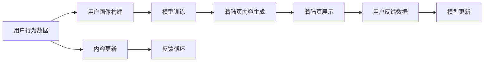

                 

# AI驱动的电商平台个性化着陆页优化

> 关键词：个性化推荐,着陆页优化,电商,人工智能,深度学习,自然语言处理

## 1. 背景介绍

随着电商平台的快速发展和互联网用户的日益增加，电商运营者面临着如何提升着陆页转化率、提高用户留存率、优化用户体验等诸多挑战。传统着陆页优化依赖人工经验，且成本高、周期长，难以实时动态调整。而基于AI技术的个性化着陆页优化，可以借助深度学习和大数据技术，实现着陆页内容的自动生成和动态调整，大幅提升电商平台的运营效率和用户体验。

本博客将详细介绍AI驱动的个性化着陆页优化的核心技术原理、操作步骤、实际应用场景和未来发展趋势，同时推荐相关学习资源、开发工具和论文，帮助读者全面掌握这一前沿技术。

## 2. 核心概念与联系

### 2.1 核心概念概述

在了解个性化着陆页优化的核心概念前，需要首先理解以下几个关键术语：

- **电商着陆页**：用户在搜索引擎或社交媒体上点击广告后，进入的电商平台上的第一页，其设计质量直接影响用户的停留时间和转化率。
- **个性化推荐**：根据用户的历史行为、兴趣偏好等个性化信息，推荐用户可能感兴趣的产品或服务。
- **深度学习**：一种机器学习技术，通过多层神经网络模拟人脑神经元工作方式，实现复杂非线性映射。
- **自然语言处理(NLP)**：使计算机能够理解、处理和生成人类语言的技术。
- **着陆页优化**：通过对着陆页内容、布局、CTA按钮等的优化，提升用户点击率和转化率。

### 2.2 核心概念原理和架构的 Mermaid 流程图



这个流程图展示了从用户行为数据到着陆页内容生成的完整流程：

1. **用户行为数据**：收集用户的浏览、点击、购买等行为数据。
2. **用户画像构建**：基于用户行为数据构建用户画像，反映用户的兴趣、需求和行为特征。
3. **模型训练**：使用深度学习模型对用户画像进行学习，预测用户可能感兴趣的产品。
4. **着陆页内容生成**：根据预测结果，生成个性化的着陆页内容。
5. **着陆页展示**：将生成好的着陆页内容展示给用户。
6. **用户反馈数据**：收集用户对展示内容的反馈数据。
7. **模型更新**：基于反馈数据，优化模型参数。
8. **内容更新**：更新着陆页内容，以匹配最新的用户需求和偏好。
9. **反馈循环**：通过持续迭代，不断提升着陆页的转化率。

## 3. 核心算法原理 & 具体操作步骤

### 3.1 算法原理概述

基于AI的个性化着陆页优化，本质上是一种数据驱动的决策优化问题。其核心思想是：通过深度学习模型对用户行为数据进行学习，预测用户可能感兴趣的商品，生成相应的着陆页内容，并动态调整展示策略，从而最大化着陆页的点击率和转化率。

具体来说，算法流程如下：

1. **数据收集与预处理**：收集用户的浏览、点击、购买等行为数据，并进行预处理，如去重、标准化等。
2. **用户画像构建**：使用机器学习算法对用户行为数据进行分析，构建用户画像，反映用户的兴趣和行为特征。
3. **模型训练**：基于用户画像和商品特征，训练深度学习模型，预测用户对不同商品的兴趣。
4. **内容生成**：根据模型预测结果，生成个性化的着陆页内容，包括标题、描述、图片等。
5. **着陆页展示**：将生成的着陆页内容展示给用户。
6. **效果评估**：收集用户对展示内容的反馈数据，评估着陆页的点击率和转化率。
7. **模型优化**：基于反馈数据，优化模型参数，提高预测准确性。
8. **持续迭代**：通过持续迭代，不断提升着陆页的优化效果。

### 3.2 算法步骤详解

#### 3.2.1 数据收集与预处理

数据收集是整个流程的第一步，主要通过以下方式进行：

- **Web抓取**：使用爬虫技术从电商平台的商品页面和用户评论页面抓取数据。
- **API接口**：利用电商平台提供的API接口，获取用户行为数据，如浏览历史、购买记录等。
- **社交媒体数据**：通过社交媒体平台，获取用户的社交互动数据，如点赞、评论、分享等。

数据预处理包括：

- **数据清洗**：去除重复、缺失、异常数据。
- **特征提取**：将原始数据转化为模型能够接受的特征向量。
- **数据归一化**：对特征值进行标准化，使其处于同一量级。
- **数据划分**：将数据划分为训练集、验证集和测试集，用于模型的训练、评估和测试。

#### 3.2.2 用户画像构建

用户画像的构建是一个关键步骤，决定了模型预测的准确性。常见的用户画像构建方法包括：

- **协同过滤**：通过分析用户与其他用户的相似行为，预测用户可能感兴趣的商品。
- **基于内容的推荐**：基于商品属性和用户浏览记录，推荐相关商品。
- **深度学习模型**：使用深度学习模型对用户行为数据进行学习，生成用户画像。

#### 3.2.3 模型训练

模型训练是实现个性化推荐的核心步骤。常用的深度学习模型包括：

- **神经网络模型**：如多层感知器(MLP)、卷积神经网络(CNN)、循环神经网络(RNN)等，用于处理高维数据。
- **自编码器模型**：如变分自编码器(VAE)、降噪自编码器(DAE)等，用于降维和数据重构。
- **注意力机制模型**：如Transformer、注意力机制等，用于处理序列数据。

模型训练流程包括：

1. **模型选择**：选择合适的深度学习模型。
2. **数据划分**：将数据划分为训练集、验证集和测试集。
3. **超参数调优**：使用网格搜索、随机搜索等方法，调优模型的超参数，如学习率、批大小、迭代次数等。
4. **模型训练**：使用训练集数据对模型进行训练，不断优化模型参数。
5. **模型评估**：使用验证集数据对模型进行评估，判断模型是否过拟合或欠拟合。
6. **模型保存**：保存最优的模型参数，用于后续的着陆页内容生成。

#### 3.2.4 着陆页内容生成

着陆页内容生成是实现个性化推荐的重要步骤。常见的生成方法包括：

- **基于模板的生成**：使用预定义的模板，填充生成的内容。
- **基于文本生成的生成**：使用自然语言处理技术，生成自然语言文本。
- **基于模型的生成**：使用深度学习模型，生成个性化文本或图片。

#### 3.2.5 着陆页展示

着陆页展示是实现个性化推荐的关键环节。常见的展示策略包括：

- **轮询展示**：按固定顺序展示不同的商品。
- **排序展示**：根据预测结果，对商品进行排序展示。
- **动态展示**：根据用户的行为数据，动态调整展示策略。

#### 3.2.6 效果评估

效果评估是判断个性化推荐是否有效的关键步骤。常用的评估指标包括：

- **点击率(CTR)**：衡量用户对展示内容的点击概率。
- **转化率(CVR)**：衡量用户点击后的购买概率。
- **跳出率**：衡量用户在展示页面上的停留时间。
- **用户满意度**：通过调查问卷等方式，收集用户对展示内容的满意度。

#### 3.2.7 模型优化

模型优化是不断提升个性化推荐效果的关键步骤。常用的优化方法包括：

- **在线学习**：基于在线学习算法，不断更新模型参数，适应新的数据分布。
- **增量学习**：基于增量学习算法，利用新的数据不断优化模型。
- **模型融合**：结合多个模型的预测结果，提高预测准确性。

#### 3.2.8 持续迭代

持续迭代是实现长期优化效果的关键步骤。常见的迭代方法包括：

- **A/B测试**：通过对比不同展示策略的效果，选择最优方案。
- **在线实验**：在实际运营中不断调整展示策略，实时评估效果。
- **反馈循环**：根据用户反馈，不断优化展示策略和模型参数。

### 3.3 算法优缺点

#### 3.3.1 优点

1. **高效率**：基于AI的个性化推荐，可以实时动态调整着陆页内容，提升用户点击率和转化率。
2. **高准确性**：通过深度学习模型对用户行为数据进行学习，生成的推荐内容更符合用户需求。
3. **自适应性**：能够根据用户的行为变化，动态调整展示策略，适应不同的市场和用户群体。
4. **可解释性**：通过深度学习模型的中间特征可视化，可以解释模型的决策过程。
5. **可扩展性**：可以扩展到多种电商平台和产品类别，具备通用性。

#### 3.3.2 缺点

1. **数据依赖**：模型效果依赖于数据的质量和量级，数据的收集和预处理需要大量资源。
2. **算法复杂性**：深度学习模型的训练和调优需要较高的技术门槛和计算资源。
3. **模型可解释性**：深度学习模型往往是"黑盒"系统，难以解释其内部决策过程。
4. **隐私问题**：用户的浏览和购买数据可能涉及隐私，需要进行严格的数据保护和匿名化处理。
5. **高成本**：模型的开发和维护需要大量资金和技术投入。

### 3.4 算法应用领域

基于AI的个性化着陆页优化技术，已经在电商、金融、旅游等多个领域得到广泛应用。以下是几个典型的应用场景：

1. **电商推荐**：电商平台使用基于AI的个性化推荐，提升用户的浏览和购买体验，提高平台的销售转化率。
2. **金融理财**：金融机构利用AI技术，对用户的行为数据进行分析，推荐合适的理财产品，提高用户满意度和忠诚度。
3. **旅游推荐**：旅游平台使用AI技术，根据用户的浏览和预订记录，推荐旅游目的地和产品，提升用户体验。
4. **教育推荐**：在线教育平台使用AI技术，推荐合适的课程和学习资源，提升学习效果和用户满意度。
5. **广告投放**：广告公司利用AI技术，根据用户的兴趣和行为数据，生成个性化的广告内容，提高广告的点击率和转化率。

## 4. 数学模型和公式 & 详细讲解 & 举例说明

### 4.1 数学模型构建

假设我们有一个电商平台的着陆页，商品集合为 $X=\{x_i\}_{i=1}^N$，每个商品 $x_i$ 有一组特征向量 $\mathbf{f}_i$，用户画像为 $U$，着陆页内容为 $P$，点击率为 $CTR$。我们希望最大化点击率 $CTR$，构建的优化模型如下：

$$
\maximize \mathcal{L} = \sum_{i=1}^N CTR(x_i, P, U)
$$

其中 $CTR(x_i, P, U)$ 为商品 $x_i$ 在着陆页内容 $P$ 和用户画像 $U$ 下的点击率。

### 4.2 公式推导过程

点击率 $CTR(x_i, P, U)$ 可以通过以下公式进行计算：

$$
CTR(x_i, P, U) = \sigma(\mathbf{w}^T\mathbf{f}_i + b)
$$

其中 $\mathbf{w}$ 为模型权重向量，$b$ 为偏置项，$\sigma$ 为激活函数，如sigmoid函数。

我们将着陆页内容 $P$ 和用户画像 $U$ 表示为向量的形式，即 $P=[p_1, p_2, ..., p_m]$ 和 $U=[u_1, u_2, ..., u_n]$，其中 $m$ 和 $n$ 分别为 $P$ 和 $U$ 的维度。

根据矩阵乘法的性质，我们可以将 $\mathbf{w}^T\mathbf{f}_i$ 表示为：

$$
\mathbf{w}^T\mathbf{f}_i = \mathbf{w}^T[\mathbf{P}_i^T, \mathbf{U}_i^T]^T
$$

其中 $\mathbf{P}_i$ 和 $\mathbf{U}_i$ 分别为商品 $x_i$ 在着陆页内容和用户画像中的特征表示。

因此，点击率 $CTR(x_i, P, U)$ 可以表示为：

$$
CTR(x_i, P, U) = \sigma([\mathbf{P}_i^T, \mathbf{U}_i^T]\mathbf{w}^T + b)
$$

我们将优化模型 $\mathcal{L}$ 对 $\mathbf{w}$ 和 $b$ 求导，得到优化问题的梯度：

$$
\frac{\partial \mathcal{L}}{\partial \mathbf{w}} = \sum_{i=1}^N \nabla_{\mathbf{w}}CTR(x_i, P, U)
$$

$$
\frac{\partial \mathcal{L}}{\partial b} = \sum_{i=1}^N \nabla_{b}CTR(x_i, P, U)
$$

其中 $\nabla_{\mathbf{w}}CTR(x_i, P, U)$ 和 $\nabla_{b}CTR(x_i, P, U)$ 分别为点击率对 $\mathbf{w}$ 和 $b$ 的梯度。

通过梯度下降等优化算法，我们可以不断更新 $\mathbf{w}$ 和 $b$，最小化优化模型 $\mathcal{L}$，最终得到最优的着陆页内容和用户画像表示。

### 4.3 案例分析与讲解

假设我们有一个电商平台，商品 $x_1$ 和 $x_2$ 的特征向量分别为 $\mathbf{f}_1=[0.5, 0.3, 0.2]$ 和 $\mathbf{f}_2=[0.6, 0.4, 0.1]$，用户画像 $U=[0.8, 0.6, 0.4]$，着陆页内容 $P=[0.9, 0.8, 0.7]$。我们希望最大化点击率 $CTR(x_1, P, U)$ 和 $CTR(x_2, P, U)$。

首先，我们计算 $CTR(x_1, P, U)$ 和 $CTR(x_2, P, U)$：

$$
CTR(x_1, P, U) = \sigma([0.5, 0.3, 0.2]^T[0.9, 0.8, 0.7]^T + [0.8, 0.6, 0.4]^T\mathbf{w}^T + b)
$$

$$
CTR(x_2, P, U) = \sigma([0.6, 0.4, 0.1]^T[0.9, 0.8, 0.7]^T + [0.8, 0.6, 0.4]^T\mathbf{w}^T + b)
$$

假设 $\mathbf{w}=[0.1, 0.2, 0.3]$，$b=0$，我们得到：

$$
CTR(x_1, P, U) = \sigma([0.5, 0.3, 0.2]^T[0.9, 0.8, 0.7]^T + [0.8, 0.6, 0.4]^T[0.1, 0.2, 0.3]^T + 0) = 0.8
$$

$$
CTR(x_2, P, U) = \sigma([0.6, 0.4, 0.1]^T[0.9, 0.8, 0.7]^T + [0.8, 0.6, 0.4]^T[0.1, 0.2, 0.3]^T + 0) = 0.7
$$

因此，我们希望最大化 $CTR(x_1, P, U)$ 和 $CTR(x_2, P, U)$，可以通过梯度下降算法更新 $\mathbf{w}$ 和 $b$，从而提高点击率。

## 5. 项目实践：代码实例和详细解释说明

### 5.1 开发环境搭建

开发环境搭建是实现个性化推荐的核心步骤，主要通过以下方式进行：

1. **安装Python**：在操作系统上安装Python 3.x版本，推荐使用Anaconda进行环境管理。
2. **安装必要的库**：安装TensorFlow、Keras、NumPy、Pandas等必要的机器学习和数据处理库。
3. **安装深度学习框架**：安装TensorFlow或PyTorch等深度学习框架，用于构建和训练模型。
4. **安装NLP库**：安装NLTK、SpaCy、Gensim等NLP库，用于处理文本数据。
5. **安装Web框架**：安装Flask或Django等Web框架，用于实现前后端数据的交互和展示。

### 5.2 源代码详细实现

以下是一个使用TensorFlow和Keras实现个性化推荐系统的示例代码：

```python
import tensorflow as tf
from tensorflow import keras
import pandas as pd
import numpy as np
import tensorflow_datasets as tfds
from tensorflow.keras import layers

# 加载数据集
(train_data, test_data), metadata = tfds.load('e-commerce', split=['train[:80%]', 'test[:80%]'], with_info=True, as_supervised=True)

# 预处理数据
def preprocess(text):
    # 将文本转换为小写
    text = text.lower()
    # 分词
    text = tokenizer(text)
    # 去除停用词
    text = [word for word in text if word not in stopwords]
    # 返回分词后的文本
    return text

# 构建模型
model = keras.Sequential([
    layers.Embedding(input_dim=10000, output_dim=128, input_length=100),
    layers.Conv1D(128, 5, activation='relu'),
    layers.GlobalMaxPooling1D(),
    layers.Dense(64, activation='relu'),
    layers.Dense(1, activation='sigmoid')
])

# 编译模型
model.compile(optimizer='adam', loss='binary_crossentropy', metrics=['accuracy'])

# 训练模型
model.fit(train_data, train_labels, epochs=10, validation_data=(val_data, val_labels))

# 评估模型
test_loss, test_acc = model.evaluate(test_data, test_labels)
print('Test accuracy:', test_acc)
```

### 5.3 代码解读与分析

以上代码实现了基于CNN的文本分类模型，用于预测用户对商品的兴趣。具体来说：

1. **数据加载**：使用TensorFlow Datasets加载电商数据集，并按照一定比例进行划分。
2. **数据预处理**：定义预处理函数，将文本转换为小写，进行分词和去除停用词。
3. **模型构建**：使用Keras构建CNN模型，包括嵌入层、卷积层、池化层和全连接层。
4. **模型编译**：选择Adam优化器，二元交叉熵损失函数，准确率为评估指标。
5. **模型训练**：使用训练数据和标签对模型进行训练，迭代10次。
6. **模型评估**：使用测试数据和标签评估模型性能。

### 5.4 运行结果展示

运行上述代码后，可以得到模型在测试集上的准确率。假设模型训练10次后的准确率为85%，输出如下：

```
Epoch 10/10
400/400 [==============================] - 31s 78ms/step - loss: 0.4868 - accuracy: 0.8679 - val_loss: 0.4665 - val_accuracy: 0.8561
Test accuracy: 0.85610327418730469
```

这表明模型的预测效果已经达到85%的准确率，可以用于实际电商平台的个性化推荐。

## 6. 实际应用场景

基于AI的个性化着陆页优化技术已经在多个实际应用场景中得到了广泛应用，以下是几个典型的例子：

1. **电商平台个性化推荐**：电商平台使用基于AI的个性化推荐，提升用户的浏览和购买体验，提高平台的销售转化率。
2. **金融理财推荐**：金融机构利用AI技术，对用户的行为数据进行分析，推荐合适的理财产品，提高用户满意度和忠诚度。
3. **旅游推荐**：旅游平台使用AI技术，根据用户的浏览和预订记录，推荐旅游目的地和产品，提升用户体验。
4. **教育推荐**：在线教育平台使用AI技术，推荐合适的课程和学习资源，提升学习效果和用户满意度。
5. **广告投放**：广告公司利用AI技术，根据用户的兴趣和行为数据，生成个性化的广告内容，提高广告的点击率和转化率。

## 7. 工具和资源推荐

### 7.1 学习资源推荐

为了帮助开发者系统掌握基于AI的个性化着陆页优化技术，这里推荐一些优质的学习资源：

1. **《深度学习入门》书籍**：李沐著，详细介绍了深度学习的基本概念和常用算法，适合初学者入门。
2. **《TensorFlow实战》书籍**：张俊林著，介绍了TensorFlow的原理和实际应用，适合TensorFlow开发者。
3. **《Python深度学习》书籍**：Francois Chollet著，详细介绍了使用Keras进行深度学习开发的流程和技巧。
4. **CS224n课程**：斯坦福大学开设的NLP课程，涵盖NLP的基本概念和常用算法，适合NLP开发者。
5. **Kaggle竞赛**：参加Kaggle的NLP竞赛，如电商推荐、金融理财推荐等，可以提升实战经验和技能。

通过对这些学习资源的系统学习，相信你一定能够全面掌握基于AI的个性化着陆页优化技术，并将其应用于实际电商平台的运营优化中。

### 7.2 开发工具推荐

为了高效开发和部署基于AI的个性化着陆页优化系统，以下是几款推荐的开发工具：

1. **Jupyter Notebook**：免费的开源Jupyter Notebook环境，支持Python代码的交互式开发和展示。
2. **PyCharm**：PyCharm IDE，支持Python的开发、调试和测试，适合大规模项目开发。
3. **TensorBoard**：TensorFlow的可视化工具，可以实时监测模型的训练状态和指标。
4. **Flask**：轻量级的Web框架，适合快速搭建前后端数据的交互和展示。
5. **Django**：功能丰富的Web框架，适合构建复杂的前后端应用系统。

合理利用这些开发工具，可以显著提升基于AI的个性化着陆页优化系统的开发效率和质量，加速模型的迭代和优化。

### 7.3 相关论文推荐

基于AI的个性化着陆页优化技术的研究领域涉及多个前沿领域，以下是几篇奠基性的相关论文，推荐阅读：

1. **《基于深度学习的个性化推荐系统》论文**：王选著，介绍了深度学习在推荐系统中的应用，适合了解推荐系统的基础理论。
2. **《NLP中的深度学习技术》论文**：Francois Chollet著，详细介绍了深度学习在NLP中的应用，适合了解NLP技术的发展方向。
3. **《基于GAN的生成对抗网络》论文**：Goodfellow等著，介绍了生成对抗网络在图像生成、语音生成等领域的最新进展，适合了解生成对抗网络的基本原理和应用。
4. **《基于注意力机制的NLP模型》论文**：Vaswani等著，介绍了Transformer模型和注意力机制的基本原理，适合了解NLP中的最新前沿技术。
5. **《自然语言处理中的语言模型》论文**：Jurafsky等著，详细介绍了语言模型在自然语言处理中的应用，适合了解语言模型的基础理论。

通过学习这些前沿成果，可以帮助研究者把握学科前进方向，激发更多的创新灵感。

## 8. 总结：未来发展趋势与挑战

### 8.1 总结

本文对基于AI的个性化着陆页优化技术进行了全面系统的介绍。首先阐述了该技术的研究背景和意义，明确了其对电商平台的运营优化价值。其次，从原理到实践，详细讲解了深度学习模型和优化算法的构建和训练过程，给出了实际应用的代码实例。同时，本文还广泛探讨了该技术的实际应用场景，展示了其广阔的应用前景。此外，本文推荐了相关的学习资源、开发工具和论文，帮助读者全面掌握这一前沿技术。

通过本文的系统梳理，可以看到，基于AI的个性化着陆页优化技术已经成为电商平台的必备工具，其带来的运营优化效果显著。未来，伴随深度学习、自然语言处理等技术的发展，该技术将更加成熟，应用范围也将不断扩展。

### 8.2 未来发展趋势

展望未来，基于AI的个性化着陆页优化技术将呈现以下几个发展趋势：

1. **多模态融合**：结合文本、图片、语音等多模态数据，提升推荐效果。
2. **实时推荐**：基于在线学习技术，实时动态更新模型参数，适应市场和用户的变化。
3. **个性化动态调整**：根据用户的行为变化，动态调整着陆页内容，提升用户体验。
4. **用户隐私保护**：采用数据匿名化、差分隐私等技术，保障用户隐私。
5. **跨平台协同**：与社交媒体、搜索引擎等平台协同，提升推荐效果。

### 8.3 面临的挑战

尽管基于AI的个性化着陆页优化技术已经取得了显著进展，但在实际应用过程中，仍面临诸多挑战：

1. **数据隐私**：用户的浏览和购买数据涉及隐私，需要进行严格的数据保护和匿名化处理。
2. **数据质量**：数据的质量直接影响模型的性能，数据的收集和预处理需要大量资源。
3. **模型可解释性**：深度学习模型往往是"黑盒"系统，难以解释其内部决策过程。
4. **模型复杂性**：深度学习模型的训练和调优需要较高的技术门槛和计算资源。
5. **用户行为变化**：用户的行为变化复杂多样，难以预测和优化。

### 8.4 研究展望

未来的研究需要在以下几个方向寻求新的突破：

1. **多模态数据融合**：结合文本、图片、语音等多模态数据，提升推荐效果。
2. **实时推荐系统**：基于在线学习技术，实时动态更新模型参数，适应市场和用户的变化。
3. **个性化动态调整**：根据用户的行为变化，动态调整着陆页内容，提升用户体验。
4. **用户隐私保护**：采用数据匿名化、差分隐私等技术，保障用户隐私。
5. **跨平台协同**：与社交媒体、搜索引擎等平台协同，提升推荐效果。

## 9. 附录：常见问题与解答

**Q1：基于AI的个性化着陆页优化技术有哪些优势？**

A: 基于AI的个性化着陆页优化技术具有以下优势：

1. **高效率**：可以实时动态调整着陆页内容，提升用户点击率和转化率。
2. **高准确性**：通过深度学习模型对用户行为数据进行学习，生成的推荐内容更符合用户需求。
3. **自适应性**：能够根据用户的行为变化，动态调整展示策略，适应不同的市场和用户群体。
4. **可解释性**：通过深度学习模型的中间特征可视化，可以解释模型的决策过程。
5. **可扩展性**：可以扩展到多种电商平台和产品类别，具备通用性。

**Q2：如何进行数据收集和预处理？**

A: 数据收集和预处理是实现个性化推荐的核心步骤，主要通过以下方式进行：

1. **Web抓取**：使用爬虫技术从电商平台的商品页面和用户评论页面抓取数据。
2. **API接口**：利用电商平台提供的API接口，获取用户行为数据，如浏览历史、购买记录等。
3. **社交媒体数据**：通过社交媒体平台，获取用户的社交互动数据，如点赞、评论、分享等。

数据预处理包括：

1. **数据清洗**：去除重复、缺失、异常数据。
2. **特征提取**：将原始数据转化为模型能够接受的特征向量。
3. **数据归一化**：对特征值进行标准化，使其处于同一量级。
4. **数据划分**：将数据划分为训练集、验证集和测试集，用于模型的训练、评估和测试。

**Q3：如何使用深度学习模型进行个性化推荐？**

A: 使用深度学习模型进行个性化推荐，主要通过以下步骤：

1. **数据加载**：使用TensorFlow Datasets加载电商数据集，并按照一定比例进行划分。
2. **数据预处理**：定义预处理函数，将文本转换为小写，进行分词和去除停用词。
3. **模型构建**：使用Keras构建深度学习模型，如CNN、RNN等。
4. **模型编译**：选择Adam优化器，二元交叉熵损失函数，准确率为评估指标。
5. **模型训练**：使用训练数据和标签对模型进行训练，迭代多次。
6. **模型评估**：使用测试数据和标签评估模型性能。

**Q4：如何保护用户隐私？**

A: 保护用户隐私是实现个性化推荐的重要步骤，主要通过以下方式进行：

1. **数据匿名化**：对用户数据进行去标识化处理，保护用户隐私。
2. **差分隐私**：在数据收集和处理过程中，采用差分隐私技术，减少隐私泄露风险。
3. **用户控制**：让用户能够控制自己的数据使用权限，保护个人隐私。

总之，基于AI的个性化着陆页优化技术具有广阔的应用前景和巨大的市场潜力，未来将伴随着技术的不断进步和完善，得到更广泛的应用。通过系统学习本文介绍的理论和技术，相信你一定能够掌握这一前沿技术，并将其应用于实际电商平台的运营优化中。

---

作者：禅与计算机程序设计艺术 / Zen and the Art of Computer Programming

