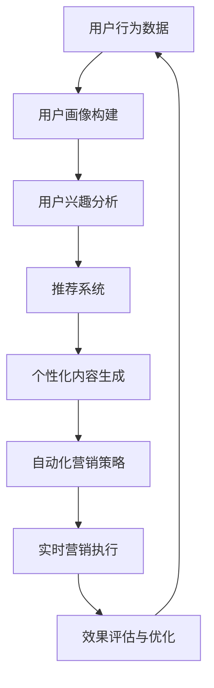

                 

# AI驱动的电商平台个性化营销自动化

> 关键词：AI驱动, 个性化营销, 自动化, 电商平台, 用户行为分析, 推荐系统, 自然语言处理(NLP)

## 1. 背景介绍

在当今数字化时代，电子商务平台如亚马逊、阿里巴巴、京东等，以其便捷、高效的购物体验吸引了大量用户。然而，电商平台的高竞争环境要求它们不断地提升用户体验，以维持用户粘性并增加销售额。因此，个性化营销成为了电商运营的重要手段。

个性化营销不仅能够提升用户的购物体验，还能增加用户回购率、提升转化率，最终增加平台的盈利能力。传统上，个性化营销的实现依赖于人工运营，比如基于规则的推荐系统、手动编写的营销策略等。然而，随着人工智能技术的快速发展，基于AI的个性化营销自动化技术正在逐步取代传统的运营方式。

本文将详细探讨如何利用AI技术实现电商平台的个性化营销自动化，包括用户行为分析、推荐系统构建、内容生成和自动化营销策略制定等方面的内容。

## 2. 核心概念与联系

### 2.1 核心概念概述

在深入探讨AI驱动的个性化营销自动化之前，我们需要了解以下几个核心概念：

- **AI驱动**：利用人工智能技术（如机器学习、深度学习等）实现自动化决策和推荐。
- **个性化营销**：根据用户的个性化特征，定制化地向用户展示商品或营销信息。
- **推荐系统**：根据用户的历史行为和兴趣，推荐相关商品或内容。
- **自动化营销**：利用AI技术自动生成和部署营销策略，减少人工干预，提升营销效率。
- **用户行为分析**：通过数据分析技术，了解用户的行为模式和偏好。
- **自然语言处理(NLP)**：利用NLP技术处理和理解自然语言，提高内容生成和智能客服的精准度。

这些概念之间的联系可以简要概括为：AI驱动的个性化营销自动化是利用AI技术对用户行为进行分析，构建推荐系统，生成个性化内容，并自动化地制定和部署营销策略的过程。

### 2.2 核心概念原理和架构的 Mermaid 流程图



上述流程图展示了AI驱动的个性化营销自动化的核心流程：从用户行为数据开始，通过用户画像构建和兴趣分析，构建推荐系统和个性化内容生成，然后自动化制定营销策略并实时执行，最后通过效果评估与优化，不断循环提升营销效果。

## 3. 核心算法原理 & 具体操作步骤

### 3.1 算法原理概述

AI驱动的个性化营销自动化涉及多种AI算法和技术，包括但不限于：

- **用户行为分析**：利用机器学习算法对用户行为数据进行分析，构建用户画像，理解用户兴趣和行为模式。
- **推荐系统**：基于协同过滤、内容推荐、基于矩阵分解的推荐算法等，为每位用户推荐最相关的商品或内容。
- **自然语言处理(NLP)**：使用语言模型、文本分类、情感分析等NLP技术，生成个性化的营销内容，并提升智能客服的交互体验。
- **自动化营销策略**：利用强化学习、策略优化等技术，自动化地制定和调整营销策略，实现营销效果的最优化。

### 3.2 算法步骤详解

#### 3.2.1 用户行为分析

用户行为分析是AI驱动个性化营销自动化的第一步。通过收集用户的浏览、购买、评价等行为数据，利用机器学习算法对数据进行建模，构建用户画像，了解用户的兴趣和行为模式。

**步骤1：数据收集与预处理**  
收集用户的各项行为数据，包括但不限于：浏览记录、购买历史、评价信息、点击次数等。数据预处理包括去重、清洗、特征工程等步骤，确保数据的完整性和准确性。

**步骤2：用户画像构建**  
利用聚类算法（如K-Means、层次聚类等）将用户分为不同的群体，并对每个群体的特征进行描述。常用的特征包括：用户兴趣、购买行为、地理信息、时间行为等。

**步骤3：兴趣分析**  
通过分析用户的行为数据，利用协同过滤、基于内容的推荐算法等方法，了解用户的兴趣偏好。协同过滤算法基于用户的相似度，推荐相似用户喜欢的商品。基于内容的推荐算法根据商品的特征与用户兴趣的匹配度进行推荐。

#### 3.2.2 推荐系统构建

推荐系统是AI驱动个性化营销自动化的核心技术之一。通过构建推荐系统，为每位用户推荐最相关的商品或内容。

**步骤1：数据构建与预处理**  
构建用户-商品矩阵、用户-内容矩阵等，用于推荐算法计算。矩阵中的每个元素表示用户对商品或内容的兴趣程度。

**步骤2：算法选择与训练**  
选择合适的推荐算法，如协同过滤、矩阵分解、深度学习推荐系统等，利用历史数据对算法进行训练和调优。

**步骤3：推荐生成**  
根据用户画像和推荐算法，生成个性化的推荐结果。推荐的商品或内容应覆盖用户的兴趣范围，同时考虑多样性和新鲜度。

#### 3.2.3 个性化内容生成

个性化内容生成是AI驱动个性化营销自动化的重要环节，通过自然语言处理(NLP)技术，生成个性化的营销内容，提升用户体验。

**步骤1：内容模板设计**  
根据不同的营销场景，设计合适的营销内容模板，如欢迎邮件、商品推荐信、优惠活动通知等。

**步骤2：语言模型训练**  
利用预训练的语言模型（如BERT、GPT等），对内容模板进行训练，学习语言的生成规则和语义关系。

**步骤3：内容生成**  
根据用户画像和推荐结果，利用语言模型生成个性化的营销内容。生成的内容应符合用户的语言习惯和兴趣偏好。

#### 3.2.4 自动化营销策略制定

自动化营销策略制定是将AI驱动的个性化营销自动化的成果转化为实际行动的重要步骤。

**步骤1：策略定义与规则编写**  
定义营销策略的基本框架，包括策略的触发条件、执行方式、评估指标等。编写具体的规则，如价格调整、优惠券发放等。

**步骤2：策略优化与调参**  
利用强化学习、策略优化等技术，不断优化营销策略，提升效果。通过A/B测试等方法，评估不同策略的效果，选择最优策略。

**步骤3：策略执行与监控**  
将优化的策略部署到实际应用中，并实时监控执行效果。通过数据分析和机器学习模型，不断优化和调整策略。

### 3.3 算法优缺点

#### 优点：

1. **高效性**：AI驱动的个性化营销自动化能够快速响应用户行为变化，实现实时推荐和策略调整。
2. **精准性**：通过AI技术，推荐系统能够分析用户行为和兴趣，生成更加精准的个性化内容。
3. **可扩展性**：AI驱动的营销自动化系统能够快速扩展到更多用户和商品，支持大规模的个性化营销需求。
4. **自动化程度高**：减少了人工干预，降低了运营成本，提升了营销效率。

#### 缺点：

1. **数据依赖性高**：推荐系统和个性化营销的准确性高度依赖于高质量的数据。数据质量不高可能导致推荐结果不准确。
2. **算法复杂性高**：构建和优化推荐系统、内容生成和策略制定等算法需要较高的技术门槛。
3. **隐私风险**：在收集和处理用户数据时，需要特别注意用户的隐私保护。
4. **成本高**：构建和维护AI驱动的营销自动化系统需要较高的硬件和人力资源投入。

### 3.4 算法应用领域

AI驱动的个性化营销自动化技术可以广泛应用于多个领域，包括但不限于：

- **电商领域**：个性化推荐、营销活动策划、智能客服等。
- **金融领域**：个性化理财推荐、欺诈检测、风险评估等。
- **旅游领域**：个性化旅游路线推荐、旅游活动策划等。
- **媒体领域**：个性化内容推荐、广告投放等。

## 4. 数学模型和公式 & 详细讲解 & 举例说明

### 4.1 数学模型构建

AI驱动的个性化营销自动化涉及多个数学模型，包括但不限于：

- **用户行为分析**：基于用户行为数据，构建用户画像的聚类模型，如K-Means聚类。
- **推荐系统**：基于协同过滤、矩阵分解等算法的推荐模型，如ALS算法。
- **个性化内容生成**：基于语言模型的生成模型，如Seq2Seq模型。
- **自动化营销策略**：基于强化学习的策略优化模型，如Q-learning算法。

### 4.2 公式推导过程

#### 4.2.1 用户画像构建

K-Means聚类的公式推导如下：

设用户行为数据为 $X=\{x_1, x_2, ..., x_n\}$，其中 $x_i=(x_{i1}, x_{i2}, ..., x_{im})$ 表示用户 $i$ 的 $m$ 个行为特征。令 $K$ 为聚类数目，$C_k$ 为第 $k$ 个聚类。

K-Means聚类的目标是最小化聚类内平方和：

$$
\min \sum_{k=1}^K \sum_{x_i \in C_k} \| x_i - \mu_k \|^2
$$

其中 $\mu_k$ 表示第 $k$ 个聚类的中心点。

通过迭代优化，不断更新中心点 $\mu_k$，直至收敛。

#### 4.2.2 推荐系统构建

ALS（Alternating Least Squares）算法的公式推导如下：

设用户行为数据为 $X=\{x_1, x_2, ..., x_n\}$，其中 $x_i=(x_{i1}, x_{i2}, ..., x_{im})$ 表示用户 $i$ 对 $m$ 个商品的行为评分。令 $K$ 为商品和用户的数量，$P$ 为用户的兴趣矩阵，$Q$ 为商品的特征矩阵。

ALS算法的目标是最小化预测误差：

$$
\min \| P \times Q - X \|_F^2
$$

其中 $\| \cdot \|_F$ 表示矩阵的 Frobenius 范数。

通过交替优化 $P$ 和 $Q$，不断逼近最优解。

#### 4.2.3 个性化内容生成

Seq2Seq模型的公式推导如下：

设输入序列为 $x=\{x_1, x_2, ..., x_t\}$，输出序列为 $y=\{y_1, y_2, ..., y_s\}$。令 $x_i$ 表示第 $i$ 个输入特征，$y_j$ 表示第 $j$ 个输出特征，$e(x_i, y_j)$ 表示输入和输出特征的相似度。

Seq2Seq模型的目标是最小化输出序列的预测误差：

$$
\min \sum_{i=1}^t \sum_{j=1}^s e(x_i, y_j)
$$

通过编码器将输入序列映射为隐状态，再通过解码器生成输出序列。常用的模型包括LSTM、GRU等。

#### 4.2.4 自动化营销策略制定

Q-learning算法的公式推导如下：

设策略 $\pi$ 和状态 $s$，Q值函数 $Q(s, \pi)$ 表示在策略 $\pi$ 下，从状态 $s$ 开始执行策略 $\pi$ 的期望收益。

Q-learning算法的目标是最小化策略的Q值误差：

$$
\min \sum_{t=1}^T (r_t + \gamma \max_a Q(s_{t+1}, a) - Q(s_t, a_t))
$$

其中 $r_t$ 表示在状态 $s_t$ 下的即时奖励，$\gamma$ 表示折扣因子，$a_t$ 表示在状态 $s_t$ 下的动作。

通过不断更新Q值函数，不断优化策略 $\pi$。

### 4.3 案例分析与讲解

#### 4.3.1 电商领域

在电商领域，AI驱动的个性化营销自动化可以通过以下案例进行展示：

**案例1：亚马逊的推荐系统**

亚马逊利用协同过滤和基于内容的推荐算法，对用户的行为数据进行分析，构建推荐系统。通过用户画像和推荐结果，生成个性化的商品推荐。

**案例2：阿里巴巴的个性化营销**

阿里巴巴利用AI技术，对用户的行为数据进行深度分析，构建用户画像和推荐系统。通过智能客服和自动化营销策略，提升用户体验和销售转化率。

#### 4.3.2 金融领域

在金融领域，AI驱动的个性化营销自动化可以通过以下案例进行展示：

**案例1：银行的个性化理财推荐**

银行利用协同过滤和矩阵分解推荐算法，对用户的理财行为数据进行分析，生成个性化的理财推荐。通过自动化策略优化，提升理财产品的销售转化率。

**案例2：保险公司的欺诈检测**

保险公司利用强化学习算法，对用户的理赔行为数据进行分析，构建欺诈检测模型。通过自动化策略调整，提升欺诈检测的准确率和及时性。

## 5. 项目实践：代码实例和详细解释说明

### 5.1 开发环境搭建

在项目实践之前，需要准备相应的开发环境。以下是使用Python进行项目开发的环境配置流程：

1. 安装Anaconda：从官网下载并安装Anaconda，用于创建独立的Python环境。

2. 创建并激活虚拟环境：
```bash
conda create -n pytorch-env python=3.8 
conda activate pytorch-env
```

3. 安装PyTorch：根据CUDA版本，从官网获取对应的安装命令。例如：
```bash
conda install pytorch torchvision torchaudio cudatoolkit=11.1 -c pytorch -c conda-forge
```

4. 安装TensorFlow：从官网下载并安装TensorFlow，或使用Anaconda安装。例如：
```bash
conda install tensorflow -c conda-forge
```

5. 安装Scikit-learn、Pandas、NumPy等常用库：
```bash
pip install scikit-learn pandas numpy
```

6. 安装相关的AI库，如TensorBoard、Weights & Biases等：
```bash
pip install tensorboard weights-and-biases
```

完成上述步骤后，即可在`pytorch-env`环境中开始项目实践。

### 5.2 源代码详细实现

我们以推荐系统为例，展示如何使用TensorFlow实现基于ALS算法的推荐模型。

首先，导入必要的库和数据集：

```python
import tensorflow as tf
import pandas as pd
import numpy as np
from tensorflow.keras.layers import Input, Embedding, Dot, Add, Concatenate
from tensorflow.keras.models import Model

# 读取用户行为数据
data = pd.read_csv('user_behavior.csv')
```

然后，定义模型结构：

```python
# 定义用户和商品的特征维度
user_dim = 10
item_dim = 10

# 定义用户兴趣矩阵
P = tf.keras.layers.Input(shape=(user_dim, 1), name='user')
Q = tf.keras.layers.Input(shape=(item_dim, 1), name='item')

# 定义编码器
encoder = tf.keras.layers.Dense(16, activation='relu')(P)
item_encoder = tf.keras.layers.Dense(16, activation='relu')(Q)

# 定义解码器
decoder = tf.keras.layers.Dense(16, activation='relu')(encoder)
item_decoder = tf.keras.layers.Dense(16, activation='relu')(item_encoder)

# 定义预测层
prediction = Dot(axes=(2, 1))([decoder, item_decoder])
output = tf.keras.layers.Reshape((user_dim, item_dim))(prediction)

# 定义模型
model = Model(inputs=[P, Q], outputs=output)
```

接着，定义损失函数和优化器：

```python
# 定义损失函数
loss = tf.keras.losses.mean_squared_error(data['rating'], output)

# 定义优化器
optimizer = tf.keras.optimizers.Adam(lr=0.01)
```

最后，训练模型并生成推荐结果：

```python
# 定义训练过程
@tf.function
def train_step(inputs, labels):
    with tf.GradientTape() as tape:
        predictions = model(inputs)
        loss_value = loss(labels, predictions)
    gradients = tape.gradient(loss_value, model.trainable_variables)
    optimizer.apply_gradients(zip(gradients, model.trainable_variables))
    return loss_value

# 训练模型
model.compile(optimizer=optimizer, loss=loss)
model.fit(x=[data['user'].to_numpy(), data['item'].to_numpy()], y=data['rating'].to_numpy(), epochs=10, batch_size=32)

# 生成推荐结果
user_id = 1
user_input = np.array([data['user'].index.get_loc(user_id)])
item_input = np.array([data['item'].index.get_loc(item) for item in data['item']])
predictions = model.predict([user_input, item_input])
recommendation = data['item'].index[(predictions >= 0.5).astype(bool)].tolist()
```

以上代码展示了使用TensorFlow实现基于ALS算法的推荐模型的基本流程。通过输入用户和商品的ID，训练模型并生成推荐结果。

### 5.3 代码解读与分析

让我们详细解读一下关键代码的实现细节：

**user_behavior.csv数据集**：
- 用户ID：user
- 商品ID：item
- 评分：rating

**P和Q模型输入**：
- 用户特征向量：user
- 商品特征向量：item

**编码器和解码器**：
- 全连接层：Dense
- 激活函数：relu

**预测层**：
- 点积层：Dot
- 重塑层：Reshape

**模型定义**：
- 模型输入：P和Q
- 模型输出：预测评分

**损失函数**：
- 均方误差损失：mean_squared_error

**优化器**：
- Adam优化器

**训练过程**：
- 定义训练过程函数train_step，使用GradientTape自动计算梯度，并使用Adam优化器更新模型参数
- 使用model.fit训练模型，并指定训练轮数和批次大小

**推荐结果生成**：
- 输入用户ID和商品ID，使用模型预测评分
- 根据预测评分阈值，生成推荐商品列表

## 6. 实际应用场景

### 6.1 智能客服系统

智能客服系统通过AI技术，能够自动解答用户咨询，提升服务效率。在智能客服系统中，AI驱动的个性化营销自动化可以通过以下方式实现：

- **用户画像构建**：通过分析用户的历史咨询记录，构建用户画像，了解用户的兴趣和需求。
- **个性化回复生成**：利用自然语言处理(NLP)技术，生成个性化的回复内容，提升用户体验。
- **自动化策略制定**：根据用户的咨询行为和历史互动记录，自动化地制定和调整营销策略，如优惠活动推送、知识库推荐等。

### 6.2 个性化推荐系统

个性化推荐系统通过AI技术，能够根据用户的历史行为和兴趣，推荐最相关的商品或内容。在个性化推荐系统中，AI驱动的个性化营销自动化可以通过以下方式实现：

- **用户行为分析**：通过分析用户的浏览、购买、评价等行为数据，构建用户画像，了解用户的兴趣和行为模式。
- **推荐系统构建**：利用协同过滤、基于内容的推荐算法等方法，为每位用户推荐最相关的商品或内容。
- **自动化营销策略制定**：根据用户的推荐行为和反馈，自动化地调整推荐算法和营销策略，提升推荐效果。

### 6.3 自动化广告投放

自动化广告投放通过AI技术，能够根据用户的兴趣和行为，自动投放最相关的广告。在自动化广告投放中，AI驱动的个性化营销自动化可以通过以下方式实现：

- **用户行为分析**：通过分析用户的浏览、点击等行为数据，构建用户画像，了解用户的兴趣和行为模式。
- **广告推荐系统**：利用协同过滤、基于内容的推荐算法等方法，为每位用户推荐最相关的广告。
- **自动化营销策略制定**：根据用户的广告点击行为和反馈，自动化地调整广告投放策略和预算，提升广告效果。

### 6.4 未来应用展望

随着AI技术的不断发展，AI驱动的个性化营销自动化将在更多领域得到应用，为各行各业带来变革性影响。

在智慧医疗领域，AI驱动的个性化营销自动化可以通过以下方式实现：

- **患者画像构建**：通过分析患者的病历、诊疗记录等数据，构建患者画像，了解患者的疾病需求和健康习惯。
- **个性化治疗方案推荐**：利用AI技术，生成个性化的治疗方案和药品推荐，提升治疗效果。
- **自动化营销策略制定**：根据患者对治疗方案的反馈，自动化地调整营销策略，如健康宣教、药品推广等。

在智能教育领域，AI驱动的个性化营销自动化可以通过以下方式实现：

- **学生画像构建**：通过分析学生的学习记录、作业提交等数据，构建学生画像，了解学生的学习兴趣和习惯。
- **个性化学习内容推荐**：利用AI技术，生成个性化的学习内容和作业推荐，提升学习效果。
- **自动化营销策略制定**：根据学生对学习内容的反馈，自动化地调整营销策略，如考试题库推送、学习资源推荐等。

在智慧城市治理中，AI驱动的个性化营销自动化可以通过以下方式实现：

- **市民画像构建**：通过分析市民的出行记录、消费行为等数据，构建市民画像，了解市民的需求和行为模式。
- **智慧公共服务推荐**：利用AI技术，生成个性化的公共服务推荐，如智慧出行、智能支付等。
- **自动化营销策略制定**：根据市民对公共服务的反馈，自动化地调整营销策略，如智慧城市推广、服务优化等。

## 7. 工具和资源推荐

### 7.1 学习资源推荐

为了帮助开发者系统掌握AI驱动的个性化营销自动化的理论基础和实践技巧，这里推荐一些优质的学习资源：

1. **TensorFlow官方文档**：深入了解TensorFlow的使用方法和深度学习技术。

2. **PyTorch官方文档**：学习PyTorch的深度学习框架和算法实现。

3. **Scikit-learn官方文档**：了解机器学习算法的实现和应用。

4. **NLP相关课程**：如斯坦福大学《深度学习与自然语言处理》课程，提高自然语言处理技能。

5. **推荐系统相关书籍**：如《推荐系统实战》等，系统学习推荐系统的构建和优化。

6. **深度学习相关书籍**：如《深度学习》等，全面掌握深度学习理论和算法。

7. **AI相关博客和社区**：如Kaggle、GitHub等，学习最新的AI技术和项目实践。

通过对这些资源的学习实践，相信你一定能够快速掌握AI驱动的个性化营销自动化的精髓，并用于解决实际的NLP问题。

### 7.2 开发工具推荐

高效的开发离不开优秀的工具支持。以下是几款用于AI驱动的个性化营销自动化开发的常用工具：

1. **TensorFlow**：基于Python的开源深度学习框架，灵活动态的计算图，适合快速迭代研究。

2. **PyTorch**：基于Python的开源深度学习框架，动态计算图，适合动态模型构建。

3. **Scikit-learn**：简单易用的机器学习库，支持多种经典算法。

4. **TensorBoard**：TensorFlow配套的可视化工具，实时监测模型训练状态。

5. **Weights & Biases**：模型训练的实验跟踪工具，记录和可视化模型训练过程。

6. **Jupyter Notebook**：开源的交互式编程环境，支持多语言编写和交互式调试。

合理利用这些工具，可以显著提升AI驱动的个性化营销自动化的开发效率，加快创新迭代的步伐。

### 7.3 相关论文推荐

AI驱动的个性化营销自动化的发展源于学界的持续研究。以下是几篇奠基性的相关论文，推荐阅读：

1. **User画像构建算法**：Chen et al. 《A survey of user profiling in e-commerce》，综述了用户画像的构建方法和应用。

2. **推荐系统算法**：Rendle et al. 《BPR: Bayesian personalized ranking from implicit feedback》，介绍了一种基于贝叶斯网络的推荐算法。

3. **自然语言处理技术**：Devlin et al. 《BERT: Pre-training of Deep Bidirectional Transformers for Language Understanding》，介绍了BERT语言模型的原理和应用。

4. **强化学习算法**：Sutton et al. 《Introduction to reinforcement learning》，介绍了强化学习的基本理论和算法。

5. **个性化营销策略制定**：Jakou et al. 《A review of strategies for recommender systems》，综述了个性化营销策略的制定方法和效果评估。

这些论文代表了大语言模型微调技术的发展脉络。通过学习这些前沿成果，可以帮助研究者把握学科前进方向，激发更多的创新灵感。

## 8. 总结：未来发展趋势与挑战

### 8.1 研究成果总结

本文详细探讨了AI驱动的个性化营销自动化的原理、步骤和应用场景，帮助读者理解这一技术的基本概念和实现方法。通过分析用户行为数据、构建推荐系统、生成个性化内容、制定营销策略等步骤，展示了AI驱动的个性化营销自动化的全流程。同时，本文还介绍了多种开发工具和学习资源，助力读者深入掌握该技术。

### 8.2 未来发展趋势

展望未来，AI驱动的个性化营销自动化技术将呈现以下几个发展趋势：

1. **用户画像构建的智能化**：利用深度学习技术，更加准确地理解用户的行为和兴趣，构建更加精细的用户画像。

2. **推荐系统的多样化**：结合协同过滤、内容推荐、基于矩阵分解等多种推荐算法，提供更加多样化的推荐内容。

3. **内容生成的自动化**：利用自然语言处理技术，实现自动化的内容生成和内容优化，提升用户体验。

4. **策略制定的智能化**：利用强化学习、策略优化等技术，自动化地制定和调整营销策略，提升营销效果。

5. **跨领域应用的扩展**：将AI驱动的个性化营销自动化技术应用于更多领域，如智慧医疗、智能教育、智慧城市等。

### 8.3 面临的挑战

尽管AI驱动的个性化营销自动化技术已经取得了不少进展，但在实现过程中仍面临以下挑战：

1. **数据隐私和安全**：在收集和处理用户数据时，需要特别注意用户的隐私保护，避免数据泄露和安全问题。

2. **算法的复杂性**：构建和优化推荐系统、内容生成和策略制定等算法需要较高的技术门槛，需要深入理解相关理论和实践。

3. **模型的可解释性**：需要提高AI驱动的个性化营销自动化的可解释性，使其输出具有可追溯性和可理解性。

4. **模型的公平性**：需要避免模型中存在的偏见和歧视，确保推荐和营销策略的公平性和公正性。

5. **成本和资源消耗**：构建和维护AI驱动的个性化营销自动化系统需要较高的硬件和人力资源投入，需要权衡成本和收益。

### 8.4 研究展望

为了解决这些挑战，未来需要在以下几个方面进行深入研究：

1. **数据隐私保护**：开发更加安全、隐私保护的技术，确保用户数据的安全性。

2. **算法优化**：研究和开发更加高效、简单易懂的算法，提升算法的可解释性和可扩展性。

3. **模型可解释性**：利用因果分析和解释性AI技术，提高AI驱动的个性化营销自动化的可解释性和透明性。

4. **模型公平性**：通过公平性约束和多样性增强，确保AI驱动的个性化营销自动化的公平性和公正性。

5. **跨领域应用**：将AI驱动的个性化营销自动化技术应用于更多领域，提升各行业的智能化水平。

## 9. 附录：常见问题与解答

**Q1：如何构建高质量的用户画像？**

A: 构建高质量的用户画像需要收集大量的用户行为数据，并使用合适的算法对数据进行建模和分析。以下是一些具体步骤：

1. **数据收集**：收集用户的浏览记录、购买历史、评价信息、点击次数等行为数据。

2. **数据预处理**：对数据进行去重、清洗、特征工程等预处理，确保数据的完整性和准确性。

3. **聚类算法**：使用K-Means、层次聚类等算法对用户进行聚类，构建用户画像。

4. **特征工程**：提取用户的兴趣、行为、时间、地理位置等特征，用于描述用户画像。

**Q2：推荐系统的构建有哪些关键步骤？**

A: 推荐系统的构建包括以下几个关键步骤：

1. **数据构建**：构建用户-商品矩阵、用户-内容矩阵等，用于推荐算法计算。

2. **算法选择**：选择合适的推荐算法，如协同过滤、矩阵分解、深度学习推荐系统等，利用历史数据对算法进行训练和调优。

3. **模型训练**：使用训练数据对推荐模型进行训练，不断优化模型参数。

4. **推荐生成**：根据用户画像和推荐算法，生成个性化的推荐结果。推荐的商品或内容应覆盖用户的兴趣范围，同时考虑多样性和新鲜度。

**Q3：如何提高AI驱动的个性化营销自动化的可解释性？**

A: 提高AI驱动的个性化营销自动化的可解释性需要从多个方面进行努力：

1. **解释性AI技术**：利用可解释性AI技术，如LIME、SHAP等，解释AI模型的决策过程。

2. **因果分析方法**：使用因果分析方法，识别出模型决策的关键特征，增强输出解释的因果性和逻辑性。

3. **知识图谱融合**：将符号化的先验知识，如知识图谱、逻辑规则等，与神经网络模型进行融合，提升模型的可解释性。

4. **透明度和可控性**：建立模型行为的监管机制，确保输出符合人类价值观和伦理道德。

通过这些方法，可以提高AI驱动的个性化营销自动化的可解释性和可控性，增强系统的透明度和用户信任度。

**Q4：如何在AI驱动的个性化营销自动化中保护用户隐私？**

A: 在AI驱动的个性化营销自动化中保护用户隐私需要从以下几个方面进行努力：

1. **数据匿名化**：对用户数据进行匿名化处理，确保数据无法直接关联到具体个人。

2. **数据加密**：对用户数据进行加密处理，防止数据泄露和未授权访问。

3. **隐私保护算法**：开发和使用隐私保护算法，如差分隐私、联邦学习等，确保用户数据在保护隐私的前提下，仍能用于模型训练。

4. **用户控制**：给予用户更多的数据控制权，让用户了解和控制自己的数据使用情况。

通过这些方法，可以在保护用户隐私的前提下，构建高效、智能的AI驱动的个性化营销自动化系统。

---

作者：禅与计算机程序设计艺术 / Zen and the Art of Computer Programming

