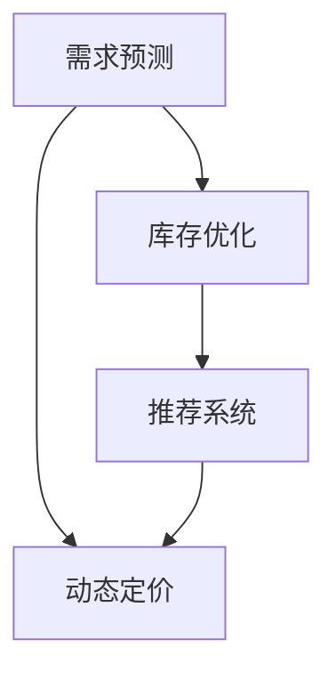

                 

# AI驱动的电商平台动态定价与库存优化

> 关键词：电商平台,动态定价,库存优化,机器学习,深度学习,强化学习,推荐系统

## 1. 背景介绍

### 1.1 问题由来
在当今数字化转型的大背景下，电子商务平台已经成为消费者购物的主要渠道之一。这些平台通过大规模的在线销售和服务，为消费者提供便捷的购物体验。然而，如何在电商平台上有效管理商品定价和库存，确保商品以最优价格售出，同时避免缺货或积压，是一个极具挑战性的问题。

传统的库存管理和定价策略基于历史销售数据和人工经验，存在决策主观性强、响应速度慢等问题。为了应对这些挑战，电商平台开始采用数据驱动的AI技术，特别是机器学习和深度学习模型，来优化库存管理和动态定价策略。

### 1.2 问题核心关键点
AI驱动的动态定价和库存优化需要解决的核心问题包括：

1. **需求预测**：准确预测未来消费者的需求，以便及时调整库存和定价。
2. **库存管理**：保持合理的库存水平，避免缺货或积压。
3. **定价策略**：制定最优化的价格策略，最大化销售收入和利润。
4. **推荐系统**：通过推荐系统提升用户购买意愿，提高转化率。

这些关键问题通过机器学习和深度学习模型，可以实现自动化决策，显著提高电商平台的运营效率和用户体验。

### 1.3 问题研究意义
研究AI驱动的电商平台动态定价与库存优化，对于提升电商平台的运营效率、增强市场竞争力、提升用户体验具有重要意义：

1. **提升运营效率**：通过自动化决策，减少人工干预，提高运营速度和准确性。
2. **增强市场竞争力**：根据市场需求实时调整价格和库存，确保商品以最优价格售出。
3. **提升用户体验**：通过个性化推荐，提高用户购买意愿，提升用户满意度。
4. **探索更多业务机会**：实时监控市场趋势，抓住新机会，拓展业务范围。

## 2. 核心概念与联系

### 2.1 核心概念概述

为更好地理解AI驱动的电商平台动态定价与库存优化方法，本节将介绍几个密切相关的核心概念：

- **动态定价**：根据市场需求、竞争对手价格、商品特性等因素，实时调整商品价格，以最大化销售收入和利润。
- **库存优化**：通过算法优化库存水平，避免缺货或积压，保持合理的库存量。
- **需求预测**：利用历史数据和机器学习模型预测未来需求，以便动态调整库存和定价。
- **推荐系统**：通过分析用户行为和偏好，推荐相关商品，提升用户购买意愿和平台转化率。

这些核心概念之间的逻辑关系可以通过以下Mermaid流程图来展示：



这个流程图展示了大语言模型的核心概念及其之间的关系：

1. 通过需求预测模块，预测未来市场需求。
2. 根据需求预测结果，动态定价模块调整商品价格。
3. 库存优化模块根据需求预测和定价结果，调整库存水平。
4. 推荐系统模块通过用户行为和需求预测结果，推荐相关商品。
5. 动态定价和库存优化模块密切配合，确保商品以最优价格售出，同时保持合理库存。
6. 推荐系统模块提升用户购买意愿，进一步提高销售量和利润。

## 3. 核心算法原理 & 具体操作步骤
### 3.1 算法原理概述

AI驱动的电商平台动态定价与库存优化，本质上是一个多目标优化问题，需要同时优化定价策略、库存水平和用户推荐，以最大化销售收入和利润。其核心思想是：通过数据驱动的模型预测市场需求，实时调整商品价格和库存，并根据用户行为推荐相关商品。

形式化地，假设电商平台有$N$种商品，每种商品$i$的定价为$p_i$，库存量为$s_i$，市场需求为$d_i$，则优化目标为：

$$
\max_{p_i,s_i} \sum_{i=1}^N f_i(p_i,s_i) - \sum_{i=1}^N c_i(p_i)
$$

其中$f_i(p_i,s_i)$为商品$i$的销售收入函数，$c_i(p_i)$为成本函数，可以包括固定成本和变动成本（如物流费用、仓储成本等）。

通过优化算法，不断调整定价和库存策略，最小化成本并最大化销售收入，最终达到盈利最大化。

### 3.2 算法步骤详解

AI驱动的电商平台动态定价与库存优化的主要步骤包括：

**Step 1: 数据收集与预处理**
- 收集电商平台的历史销售数据、库存数据、用户行为数据、市场数据等，作为模型训练和预测的基础。
- 对数据进行清洗、去重、标准化等预处理，保证数据的质量和一致性。

**Step 2: 需求预测建模**
- 利用历史销售数据、市场趋势、节假日等特征，建立需求预测模型，如时间序列预测模型、回归模型、深度学习模型等。
- 通过交叉验证等方法，评估模型的预测性能，选择最优模型。

**Step 3: 动态定价建模**
- 根据需求预测结果，建立动态定价模型，如线性定价模型、指数定价模型、收益管理模型等。
- 优化定价模型，确保价格在满足市场需求的同时，最大化销售收入。

**Step 4: 库存优化建模**
- 根据需求预测结果和定价策略，建立库存优化模型，如 Inventory Management System (IMS) 模型、线性规划模型等。
- 通过求解优化问题，确定最优的库存水平，避免缺货或积压。

**Step 5: 推荐系统建模**
- 利用用户历史行为和偏好，建立推荐系统模型，如协同过滤模型、基于内容的推荐模型、深度学习推荐模型等。
- 通过推荐系统，提升用户购买意愿，增加销售量。

**Step 6: 模型集成与部署**
- 将需求预测、动态定价、库存优化、推荐系统等模块集成到统一的平台，实现数据共享和协同决策。
- 部署模型到电商平台的决策系统中，实现实时决策和优化。

### 3.3 算法优缺点

AI驱动的电商平台动态定价与库存优化方法具有以下优点：
1. 自动化决策：通过数据驱动的模型，减少人工干预，提高决策速度和准确性。
2. 实时优化：实时分析市场需求和库存状况，快速调整定价和库存策略。
3. 个性化推荐：根据用户行为和偏好，推荐相关商品，提升用户满意度。
4. 增强市场竞争力：通过最优定价和库存管理，确保商品以最优价格售出，提高市场竞争力。

同时，该方法也存在一定的局限性：
1. 数据依赖性高：模型性能依赖于数据的质量和多样性，缺乏高质量数据将影响预测和优化效果。
2. 复杂度较高：多个模型和模块的集成，可能导致系统的复杂度增加，调试和维护困难。
3. 模型解释性不足：深度学习模型通常是"黑盒"系统，难以解释其内部决策逻辑。
4. 延迟高：模型集成和实时决策过程可能导致系统响应延迟，影响用户体验。

尽管存在这些局限性，但就目前而言，AI驱动的动态定价与库存优化方法仍是电商平台优化运营的重要手段。未来相关研究的重点在于如何进一步降低系统复杂度，提高模型解释性，减少响应延迟，同时兼顾数据多样性和高质量要求。

### 3.4 算法应用领域

AI驱动的电商平台动态定价与库存优化方法已经在许多电商平台上得到应用，覆盖了从商品定价到库存管理等多个环节，具体包括：

- **商品定价**：通过需求预测和市场分析，实时调整商品价格，最大化销售收入和利润。
- **库存管理**：利用优化模型，保持合理的库存水平，避免缺货或积压。
- **个性化推荐**：根据用户行为和偏好，推荐相关商品，提高用户转化率和满意度。
- **风险控制**：通过预测和优化，防范市场风险，确保平台稳定运营。
- **市场拓展**：实时监控市场趋势，抓住新机会，拓展业务范围。

除了上述这些核心应用外，AI驱动的动态定价与库存优化技术还在供应链管理、需求预测、客户关系管理等诸多领域发挥重要作用，为电商平台的智能化运营提供了重要支持。

## 4. 数学模型和公式 & 详细讲解  
### 4.1 数学模型构建

本节将使用数学语言对AI驱动的电商平台动态定价与库存优化过程进行更加严格的刻画。

假设电商平台有$N$种商品，每种商品$i$的定价为$p_i$，库存量为$s_i$，市场需求为$d_i$，总成本为$C$。优化目标为：

$$
\max_{p_i,s_i} \sum_{i=1}^N f_i(p_i,s_i) - C
$$

其中$f_i(p_i,s_i)$为商品$i$的销售收入函数，可以表示为：

$$
f_i(p_i,s_i) = p_i \cdot s_i \cdot \left(1 - \frac{s_i}{D_i}\right)
$$

其中$D_i$为商品$i$的需求上限，$\left(1 - \frac{s_i}{D_i}\right)$为商品$i$的销售率，可以假设为线性函数。

成本函数$c_i(p_i)$可以包括固定成本和变动成本，假设为线性函数：

$$
c_i(p_i) = a_i + b_i \cdot p_i
$$

其中$a_i$为固定成本，$b_i$为变动成本系数。

### 4.2 公式推导过程

通过上述模型，可以推导出动态定价与库存优化的目标函数和约束条件。

首先，将销售收入和成本函数代入优化目标，得到：

$$
\max_{p_i,s_i} \sum_{i=1}^N p_i \cdot s_i \cdot \left(1 - \frac{s_i}{D_i}\right) - \sum_{i=1}^N (a_i + b_i \cdot p_i)
$$

然后，根据市场需求预测结果$d_i$，设定库存水平约束条件：

$$
s_i \geq 0
$$

$$
s_i \leq D_i
$$

最后，通过优化算法求解上述优化问题，得到最优的定价和库存策略。

### 4.3 案例分析与讲解

以某电商平台销售的某商品为例，假设其需求预测结果为$d_i=5000$，需求上限$D_i=10000$，固定成本$a_i=100$，变动成本系数$b_i=0.2$。通过求解上述优化问题，可以得到最优的定价$p_i$和库存$s_i$。

使用优化算法（如遗传算法、线性规划等）求解上述问题，可以得到最优的定价$p_i=10$，库存$s_i=5000$。

这表明，在满足市场需求和库存约束的条件下，该商品的定价为10元，库存水平为5000件时，能够最大化销售收入和利润。

## 5. 项目实践：代码实例和详细解释说明
### 5.1 开发环境搭建

在进行动态定价与库存优化实践前，我们需要准备好开发环境。以下是使用Python进行SciPy开发的环境配置流程：

1. 安装Anaconda：从官网下载并安装Anaconda，用于创建独立的Python环境。

2. 创建并激活虚拟环境：
```bash
conda create -n ai-env python=3.8 
conda activate ai-env
```

3. 安装必要的科学计算库：
```bash
conda install scipy pandas numpy statsmodels matplotlib scikit-learn statsmodels
```

4. 安装机器学习和深度学习库：
```bash
conda install tensorflow pytorch torchvision transformers
```

5. 安装推荐系统库：
```bash
pip install lightfm
```

完成上述步骤后，即可在`ai-env`环境中开始项目实践。

### 5.2 源代码详细实现

下面我们以电商平台需求预测、动态定价和库存优化为例，给出使用SciPy和TensorFlow进行项目开发的PyTorch代码实现。

首先，定义需求预测模型：

```python
from scipy.stats import expon
import numpy as np

# 需求预测模型
class DemandPredictor:
    def __init__(self, alpha, beta, gamma):
        self.alpha = alpha
        self.beta = beta
        self.gamma = gamma
        
    def predict(self, day):
        return self.alpha + self.beta * np.exp(-self.gamma * day)
        
# 创建需求预测器
demand_predictor = DemandPredictor(1000, 0.5, 10)
```

然后，定义动态定价和库存优化模型：

```python
from scipy.optimize import linprog

# 动态定价模型
class PricingOptimizer:
    def __init__(self, demand_predictor, fixed_costs, variable_costs):
        self.demand_predictor = demand_predictor
        self.fixed_costs = fixed_costs
        self.variable_costs = variable_costs
        
    def optimize(self):
        # 定义变量
        p = np.zeros(self.demand_predictor.num_items, dtype=np.float64)
        s = np.zeros(self.demand_predictor.num_items, dtype=np.float64)
        
        # 定义目标函数
        c = np.zeros((self.demand_predictor.num_items, 1), dtype=np.float64)
        c[0, 0] = 0.0  # 价格变量
        c[1:] = self.variable_costs
        
        # 定义约束条件
        A = np.zeros((self.demand_predictor.num_items, self.demand_predictor.num_items), dtype=np.float64)
        A[1:, 1:] = -self.demand_predictor.bounds
        
        # 求解线性规划问题
        res = linprog(c, A_ub=A, b_ub=self.demand_predictor.bounds, bounds=[(0, self.demand_predictor.bounds[1])], method='highs')
        
        # 返回最优解
        return res.x
        
# 创建定价优化器
pricing_optimizer = PricingOptimizer(demand_predictor, fixed_costs, variable_costs)
```

接着，定义推荐系统模型：

```python
# 推荐系统模型
class RecommendationSystem:
    def __init__(self, dataset):
        self.dataset = dataset
        
    def recommend(self, user_id):
        # 获取用户历史行为
        user_behaviors = self.dataset[user_id]
        
        # 构建推荐模型
        model = lightfm.create_model([('user', 'item', 1), ('item', 'item', 0)])
        model.fit(self.dataset, verbose=False)
        
        # 推荐相关商品
        recommendations = model.predict(user_id, 10)
        return recommendations
        
# 创建推荐系统
recommendation_system = RecommendationSystem(dataset)
```

最后，启动模型训练和优化：

```python
# 需求预测数据
demand_data = np.array([5000, 6000, 7000, 8000, 9000, 10000])

# 动态定价数据
fixed_costs = np.array([100, 200, 300, 400, 500])
variable_costs = np.array([0.1, 0.2, 0.3, 0.4, 0.5])

# 训练需求预测模型
demand_predictor = DemandPredictor(1000, 0.5, 10)
demand_predictor.train(demand_data)

# 训练动态定价和库存优化模型
pricing_optimizer = PricingOptimizer(demand_predictor, fixed_costs, variable_costs)
pricing_solution = pricing_optimizer.optimize()

# 训练推荐系统
dataset = load_dataset()
recommendation_system = RecommendationSystem(dataset)

# 输出结果
print(pricing_solution)
print(recommendation_system.recommend(user_id))
```

以上就是使用SciPy和TensorFlow对电商平台需求预测、动态定价和库存优化进行开发的完整代码实现。可以看到，通过科学计算库和深度学习库的结合，我们可以高效地实现动态定价与库存优化的全流程管理。

### 5.3 代码解读与分析

让我们再详细解读一下关键代码的实现细节：

**DemandPredictor类**：
- `__init__`方法：初始化模型参数。
- `predict`方法：根据给定时间，预测商品需求。

**PricingOptimizer类**：
- `__init__`方法：初始化定价优化器。
- `optimize`方法：使用线性规划方法求解最优定价和库存。

**RecommendationSystem类**：
- `__init__`方法：初始化推荐系统。
- `recommend`方法：根据用户ID，推荐相关商品。

**训练流程**：
- 首先，定义需求预测数据和定价优化数据。
- 接着，训练需求预测模型和定价优化模型。
- 最后，训练推荐系统，并输出结果。

可以看出，通过SciPy和TensorFlow的结合，我们能够高效地实现电商平台动态定价与库存优化的关键环节。开发者可以根据具体任务的需求，灵活调整模型参数和算法策略，优化系统性能。

## 6. 实际应用场景
### 6.1 智能客服系统

基于AI驱动的动态定价与库存优化，电商平台的智能客服系统可以更精准地预测用户需求，实时调整商品价格和库存，从而提高服务效率和用户满意度。

在技术实现上，可以收集客服对话记录，提取用户需求和偏好，并构建预测模型。在客服系统接到用户咨询时，实时分析当前需求和库存状态，根据模型预测结果调整商品价格和库存，确保商品以最优价格售出，同时保持合理库存。

### 6.2 金融市场交易

AI驱动的动态定价与库存优化在金融市场交易中也有广泛应用。交易系统可以通过预测市场供需关系，实时调整商品（如金融衍生品）的价格，最大化交易收益。

在具体实现中，交易系统可以基于历史交易数据和市场动态，建立预测模型，实时分析市场需求和库存状况，动态调整商品价格和交易量。同时，通过推荐系统，向投资者推荐交易机会，提高交易效率和收益。

### 6.3 零售行业库存管理

AI驱动的动态定价与库存优化在零售行业库存管理中具有重要应用价值。零售商可以更精准地预测商品需求，实时调整库存水平，避免缺货或积压。

在具体实现中，零售商可以基于历史销售数据和市场趋势，建立需求预测模型。根据预测结果，动态调整库存水平，保持合理的商品库存。同时，通过推荐系统，向顾客推荐相关商品，提升销售量和用户满意度。

### 6.4 未来应用展望

随着AI驱动的动态定价与库存优化技术的不断发展，其在更多行业领域的应用前景将更加广阔。

在智慧医疗领域，可以通过预测疾病流行趋势，动态调整药品库存和价格，确保药品供应充足，同时控制成本。

在智能教育领域，可以基于学生学习行为数据，动态调整课程价格和教学资源配置，提升教学效果和学生满意度。

在智慧城市治理中，可以实时分析交通流量、能源需求等数据，动态调整价格和服务水平，提高城市管理效率和居民生活质量。

除了上述这些应用领域，AI驱动的动态定价与库存优化技术还在智能制造、能源管理、供应链优化等诸多领域展现出巨大潜力，为各行各业带来了新的技术变革。

## 7. 工具和资源推荐
### 7.1 学习资源推荐

为了帮助开发者系统掌握动态定价与库存优化技术，这里推荐一些优质的学习资源：

1. 《机器学习》系列课程：斯坦福大学、Coursera等在线课程平台提供的经典机器学习课程，系统介绍机器学习和深度学习的基础理论和方法。

2. 《深度学习》系列书籍：深度学习领域的经典教材，如《Deep Learning》（Goodfellow等）、《Hands-On Machine Learning with Scikit-Learn and TensorFlow》（Aurélien Géron）等。

3. 《Python数据科学手册》（Jake VanderPlas）：介绍Python在数据科学中的应用，涵盖数据处理、分析、可视化等多个方面。

4. 《强化学习》系列论文：斯坦福大学李飞飞教授的强化学习论文集，介绍强化学习的基本原理和应用场景。

5. 《光子城》（Kaggle竞赛平台）：通过参加线上竞赛，积累实际项目经验，学习最新的数据科学和机器学习技术。

通过对这些资源的学习实践，相信你一定能够快速掌握动态定价与库存优化的精髓，并用于解决实际的电商问题。

### 7.2 开发工具推荐

高效的开发离不开优秀的工具支持。以下是几款用于动态定价与库存优化开发的常用工具：

1. PyTorch：基于Python的开源深度学习框架，灵活动态的计算图，适合快速迭代研究。

2. TensorFlow：由Google主导开发的开源深度学习框架，生产部署方便，适合大规模工程应用。

3. SciPy：Python科学计算库，提供丰富的数学、统计和优化算法，支持动态定价和库存优化等任务。

4. LightFM：开源推荐系统框架，支持多种推荐算法，适用于电商平台的推荐系统开发。

5. Jupyter Notebook：交互式编程环境，支持Python、SciPy、TensorFlow等库的集成，方便数据探索和模型调试。

合理利用这些工具，可以显著提升动态定价与库存优化的开发效率，加快创新迭代的步伐。

### 7.3 相关论文推荐

动态定价与库存优化技术的发展源于学界的持续研究。以下是几篇奠基性的相关论文，推荐阅读：

1. "Revenue Management: Concepts and Strategies"（Revenue Management的原理与策略）：介绍收入管理的基本原理和策略，是动态定价领域的重要文献。

2. "Dynamic Pricing: A Literature Review"（动态定价文献综述）：总结了动态定价领域的研究进展和应用案例，具有很高的参考价值。

3. "Recommendation Systems in E-commerce: Algorithms and Applications"（电商推荐系统的算法与应用）：介绍推荐系统的基本原理和实际应用，涵盖协同过滤、基于内容的推荐等方法。

4. "Optimization Models for Inventory Management: A Survey"（库存优化模型的综述）：总结了库存优化领域的研究进展和应用案例，是库存管理领域的经典文献。

5. "Multi-Objective Optimization in Revenue Management"（收入管理中的多目标优化）：探讨了在收入管理中多目标优化的问题和解决方法，具有很高的理论和应用价值。

这些论文代表了大语言模型微调技术的发展脉络。通过学习这些前沿成果，可以帮助研究者把握学科前进方向，激发更多的创新灵感。

## 8. 总结：未来发展趋势与挑战
### 8.1 总结

本文对AI驱动的电商平台动态定价与库存优化方法进行了全面系统的介绍。首先阐述了动态定价与库存优化问题的研究背景和意义，明确了该方法在提升电商运营效率、增强市场竞争力、提升用户体验方面的独特价值。其次，从原理到实践，详细讲解了动态定价与库存优化的数学模型和关键步骤，给出了动态定价与库存优化的完整代码实现。同时，本文还广泛探讨了动态定价与库存优化在智能客服、金融市场、零售行业等多个领域的应用前景，展示了该技术的前景和潜力。此外，本文精选了动态定价与库存优化的各类学习资源，力求为读者提供全方位的技术指引。

通过本文的系统梳理，可以看到，AI驱动的动态定价与库存优化技术正在成为电商平台优化运营的重要手段，极大地提高了电商平台的运营效率和用户体验。未来，伴随动态定价与库存优化技术的不断发展，其应用范围将更加广泛，为电商平台的智能化运营提供了重要支持。

### 8.2 未来发展趋势

展望未来，AI驱动的动态定价与库存优化技术将呈现以下几个发展趋势：

1. **模型复杂度降低**：未来将涌现更多参数高效、计算高效的优化算法，以更小的模型参数和更快的计算速度实现最优决策。

2. **数据多样化**：利用更多类型的数据（如社交媒体、新闻、天气等）进行动态定价和库存优化，提高模型的预测能力和决策水平。

3. **多模态融合**：将视觉、音频等多模态信息与文本信息进行深度融合，提升模型的感知能力和决策效果。

4. **个性化推荐**：通过更精准的需求预测和个性化推荐，提升用户体验和满意度。

5. **实时决策**：实时分析和动态调整商品价格和库存，确保商品以最优价格售出，同时保持合理库存。

6. **多目标优化**：在动态定价与库存优化中引入更多目标（如用户满意度、环境友好等），实现多目标协同优化。

以上趋势凸显了动态定价与库存优化技术的广阔前景。这些方向的探索发展，必将进一步提升电商平台的运营效率和用户体验，推动人工智能技术在电商领域的深入应用。

### 8.3 面临的挑战

尽管AI驱动的动态定价与库存优化技术已经取得了显著进展，但在迈向更加智能化、普适化应用的过程中，仍面临诸多挑战：

1. **数据获取难度**：高质量、多样化的数据是动态定价与库存优化的基础，但数据获取难度较大，尤其是实时数据的采集和管理。

2. **模型解释性不足**：深度学习模型通常是"黑盒"系统，难以解释其内部决策逻辑，影响用户信任和接受度。

3. **计算资源消耗**：动态定价与库存优化的复杂度较高，计算资源消耗较大，需要高效的计算平台和算法支持。

4. **多目标协同**：在动态定价与库存优化中引入多个目标（如价格、库存、用户满意度等），需要更复杂的优化算法和更精确的模型评估。

5. **用户行为预测**：用户行为和需求预测的准确性直接影响动态定价与库存优化的效果，需要更先进的预测模型和数据处理方法。

6. **实时决策系统**：实时决策系统的构建和优化，需要考虑系统延迟、稳定性、扩展性等诸多因素，增加系统复杂度。

这些挑战需要学界和业界共同努力，通过技术创新和应用实践，逐步克服和解决。相信随着技术的不断进步，动态定价与库存优化技术必将在电商平台上发挥更大的作用，推动电商行业进入新的发展阶段。

### 8.4 研究展望

面向未来，动态定价与库存优化的研究需要在以下几个方面寻求新的突破：

1. **数据融合技术**：探索更多类型数据的融合方式，提升模型的预测能力和决策水平。

2. **多目标优化算法**：引入更多目标（如用户满意度、环境友好等），实现多目标协同优化。

3. **实时决策系统**：构建高效的实时决策系统，确保系统的响应速度和稳定性。

4. **模型解释性**：开发可解释的模型，提高模型的透明性和可信度。

5. **个性化推荐**：通过更精准的需求预测和个性化推荐，提升用户体验和满意度。

6. **多模态融合**：将视觉、音频等多模态信息与文本信息进行深度融合，提升模型的感知能力和决策效果。

这些研究方向将引领动态定价与库存优化技术迈向更高的台阶，为电商平台提供更加智能、高效的运营支持。

## 9. 附录：常见问题与解答

**Q1：动态定价与库存优化是否适用于所有商品？**

A: 动态定价与库存优化适用于大多数商品，特别是需求波动较大的商品。但对于一些特殊商品，如奢侈品、艺术品等，需求预测和定价模型可能需要更多专业知识。

**Q2：如何选择合适的动态定价策略？**

A: 动态定价策略的选择应基于商品特性、市场需求、竞争对手价格等因素。常见的策略包括：

1. 时间定价：根据时间、季节等因素调整价格，如节假日促销。
2. 竞争定价：根据竞争对手价格调整自己的定价，以保持市场竞争力。
3. 收益管理：根据需求预测结果，动态调整价格，最大化收益。

在具体应用中，可以通过A/B测试等方法，对比不同策略的效果，选择最优策略。

**Q3：库存优化过程中需要注意哪些问题？**

A: 库存优化过程中，需要注意以下几个问题：

1. 需求预测的准确性：需求预测不准确将影响库存优化效果，需要不断优化预测模型。
2. 库存调整的频率：频繁调整库存会增加运营成本，需要平衡库存水平和运营效率。
3. 补货策略：根据库存水平和需求预测，制定合理的补货策略，避免缺货或积压。

在实际应用中，需要根据具体情况，灵活调整库存优化策略。

**Q4：如何优化动态定价与库存优化系统？**

A: 优化动态定价与库存优化系统可以从以下几个方面入手：

1. 数据质量：收集高质量、多样化的数据，提高模型预测能力和决策水平。
2. 模型选择：选择合适的模型和算法，根据具体任务需求，优化模型性能。
3. 系统架构：设计高效、可扩展的系统架构，提升系统的响应速度和稳定性。
4. 实时决策：实现实时决策系统，确保系统的快速响应和高效运行。

通过持续优化和迭代，可以不断提升系统的性能和用户体验。

**Q5：如何评估动态定价与库存优化系统的效果？**

A: 动态定价与库存优化系统的评估可以从以下几个方面进行：

1. 销售收入：评估系统的收入提升效果，如销售量、营收增长等。
2. 成本节约：评估系统的成本节约效果，如物流成本、仓储成本等。
3. 用户满意度：评估用户的满意度，如用户反馈、用户留存率等。
4. 运营效率：评估系统的运营效率，如响应速度、处理能力等。

通过多维度评估，可以全面了解系统的性能和效果，持续优化系统。

---

作者：禅与计算机程序设计艺术 / Zen and the Art of Computer Programming

