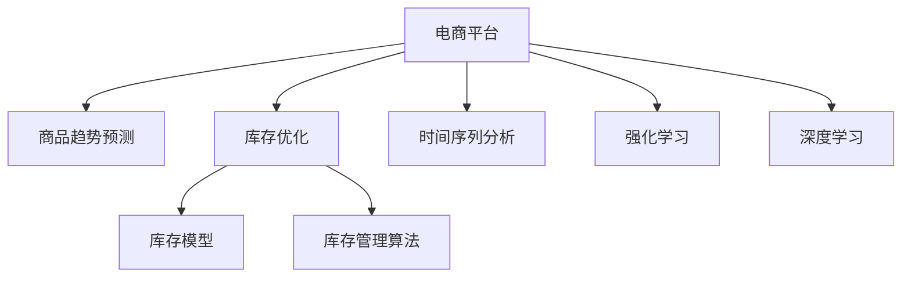

                 

# AI驱动的电商平台商品趋势预测与库存优化

> 关键词：AI驱动,电商平台,商品趋势预测,库存优化

## 1. 背景介绍

### 1.1 问题由来

随着电子商务的兴起，各大电商平台竞争日益激烈。如何准确预测商品趋势，优化库存管理，已成为电商平台运营决策的核心问题。传统的库存管理依赖历史销售数据和简单的线性回归模型，无法有效应对市场需求的快速变化和消费者偏好的多样化。近年来，随着AI和大数据技术的快速发展，基于机器学习的趋势预测和库存优化方法逐步成为新的趋势。本文将详细介绍AI驱动的电商平台商品趋势预测与库存优化的核心概念、算法原理及操作步骤，并结合实际案例进行展示。

### 1.2 问题核心关键点

电商平台商品趋势预测与库存优化涉及的关键问题包括：

1. **数据收集与处理**：如何高效收集电商平台的数据，并进行预处理，包括清洗、标准化、缺失值填补等。
2. **趋势预测模型**：选择合适的机器学习模型，对商品的历史销售数据进行建模，预测未来的趋势。
3. **库存优化算法**：基于趋势预测结果，设计算法优化库存水平，避免库存积压或缺货。
4. **系统集成与部署**：将模型和算法集成到电商平台的业务系统中，实现实时预测和动态库存调整。

解决这些关键问题，需要综合运用数据科学、机器学习和软件工程等领域的知识和技能。

## 2. 核心概念与联系

### 2.1 核心概念概述

为了更好地理解基于AI的电商平台商品趋势预测与库存优化方法，本节将介绍几个密切相关的核心概念：

- **电商平台**：在线销售商品和服务的平台，包括商品展示、交易管理、物流配送等功能。
- **库存管理**：对商品库存进行控制和优化，以提高销售效率和资金周转率。
- **商品趋势预测**：基于历史数据，预测商品未来的销售趋势，为库存优化提供依据。
- **时间序列分析**：对时间序列数据进行分析，识别其中的规律和趋势，是商品趋势预测的重要工具。
- **库存优化算法**：通过数学模型和算法，确定最佳的库存水平，以最小化成本和最大化利润。
- **强化学习**：一种通过试错学习和奖励机制进行优化的方法，适用于动态环境下的库存优化。
- **深度学习**：通过神经网络模型，处理高维非线性数据，提高预测和优化的准确性。

这些核心概念之间的逻辑关系可以通过以下Mermaid流程图来展示：



这个流程图展示了我电商平台的商品趋势预测和库存优化的核心概念及其之间的关系：

1. 电商平台通过时间序列分析和深度学习对历史销售数据进行建模，得到商品趋势预测结果。
2. 将趋势预测结果作为输入，结合库存管理算法和强化学习模型，优化库存水平。
3. 库存管理算法根据实时数据和预测结果，调整库存水平，实现动态优化。

## 3. 核心算法原理 & 具体操作步骤
### 3.1 算法原理概述

基于AI的电商平台商品趋势预测与库存优化方法，本质上是结合了时间序列分析、深度学习、库存管理算法和强化学习等多个领域的综合性技术。其核心思想是通过对历史销售数据的建模，预测未来的商品销售趋势，并结合库存管理策略，动态调整库存水平，实现最优库存配置。

具体而言，该方法主要包括以下几个步骤：

1. **数据收集与处理**：从电商平台的交易系统中收集商品销售数据，并进行预处理，包括清洗、标准化、缺失值填补等。
2. **商品趋势预测**：利用时间序列分析、深度学习等技术，对历史销售数据进行建模，预测未来的销售趋势。
3. **库存优化**：根据预测结果，结合库存管理算法和强化学习模型，确定最佳的库存水平，以最小化成本和最大化利润。
4. **系统集成与部署**：将模型和算法集成到电商平台的业务系统中，实现实时预测和动态库存调整。

### 3.2 算法步骤详解

#### 3.2.1 数据收集与处理

数据收集是趋势预测与库存优化的第一步，也是最关键的一步。电商平台的交易系统会产生大量的数据，包括商品ID、销售时间、销售量、价格、用户ID等。

1. **数据收集**：
   - 从电商平台的数据库中导出销售数据，通常包括日期、商品ID、销售量、销售金额等。
   - 使用API接口或爬虫工具，定期从电商平台中获取最新的销售数据。

2. **数据预处理**：
   - **数据清洗**：去除重复数据、异常值、噪声等，确保数据的质量。
   - **数据标准化**：对销售量、销售金额等数据进行标准化处理，便于后续的建模。
   - **缺失值填补**：使用均值、中位数、插值等方法，填补缺失数据。

#### 3.2.2 商品趋势预测

商品趋势预测是库存优化的基础，准确的预测结果将直接影响库存水平的设置。

1. **时间序列分析**：
   - 对历史销售数据进行时间序列分析，识别其中的规律和趋势。
   - 使用ARIMA、LSTM等模型，对未来的销售趋势进行预测。

2. **深度学习**：
   - 利用深度学习模型，如循环神经网络(RNN)、长短期记忆网络(LSTM)等，处理高维非线性数据，提高预测的准确性。
   - 使用深度学习框架，如TensorFlow、PyTorch等，构建和训练预测模型。

#### 3.2.3 库存优化

库存优化是库存管理的核心，目标是确定最佳的库存水平，以最小化成本和最大化利润。

1. **库存管理算法**：
   - 使用经典库存管理算法，如Economic Order Quantity(EOQ)、ABC分析法等，优化库存水平。
   - 结合预测结果，调整库存策略，避免库存积压或缺货。

2. **强化学习**：
   - 使用强化学习模型，如Q-Learning、Deep Q-Network(DQN)等，动态调整库存水平。
   - 设计奖励机制，如销售激励、库存周转率等，优化库存决策。

#### 3.2.4 系统集成与部署

系统集成与部署是将模型和算法应用于实际业务系统的关键步骤。

1. **API接口设计**：
   - 设计API接口，将预测结果和库存优化结果返回给电商平台的前端系统。
   - 使用RESTful API，实现与电商平台的无缝集成。

2. **系统部署**：
   - 将模型和算法部署到云服务器或本地服务器上，确保实时计算能力。
   - 使用Docker、Kubernetes等容器化技术，确保系统的稳定性和可扩展性。

3. **实时监控与优化**：
   - 实时监控预测结果和库存水平，及时调整策略。
   - 使用A/B测试等方法，优化预测和优化算法的性能。

### 3.3 算法优缺点

基于AI的电商平台商品趋势预测与库存优化方法，具有以下优点：

1. **准确性高**：利用深度学习和时间序列分析，预测结果更加准确，能够应对市场需求的快速变化和消费者偏好的多样化。
2. **灵活性强**：结合库存管理算法和强化学习模型，动态调整库存水平，适应不同的业务场景和需求变化。
3. **可扩展性强**：使用API接口和云服务部署，易于扩展和集成到电商平台的业务系统中。
4. **实时性高**：实现实时预测和动态库存调整，提高库存管理的效率和准确性。

同时，该方法也存在一些缺点：

1. **数据依赖性强**：需要高质量、大规模的历史销售数据，数据收集和处理成本较高。
2. **模型复杂度高**：深度学习和强化学习模型较为复杂，需要较高的计算资源和专业知识。
3. **预测不确定性**：历史数据和模型无法完全预测未来的市场变化，存在一定的不确定性。
4. **实时性要求高**：需要实时计算和数据处理能力，对系统的响应速度和稳定性要求较高。

## 4. 数学模型和公式 & 详细讲解 & 举例说明

### 4.1 数学模型构建

为了更好地理解基于AI的电商平台商品趋势预测与库存优化方法，本节将介绍几个核心数学模型：

- **时间序列模型**：ARIMA、LSTM等模型，用于对历史销售数据进行建模和预测。
- **深度学习模型**：RNN、LSTM等模型，用于处理高维非线性数据。
- **库存管理模型**：EOQ、ABC分析法等，用于优化库存水平。
- **强化学习模型**：Q-Learning、DQN等模型，用于动态调整库存水平。

#### 4.1.1 时间序列模型

时间序列模型是商品趋势预测的核心，常用的模型包括ARIMA和LSTM。

**ARIMA模型**：
ARIMA模型用于对平稳时间序列进行建模和预测，其基本形式为：
$$
y_t = c + \sum_{i=1}^p \alpha_i y_{t-i} + \sum_{i=1}^d \delta_i \Delta^i y_t + \sum_{i=1}^q \beta_i \epsilon_{t-i}
$$
其中，$y_t$为第$t$天的销售量，$\alpha_i$为自回归系数，$\delta_i$为差分系数，$\beta_i$为移动平均系数，$\Delta^i$为差分算子，$\epsilon_t$为白噪声。

**LSTM模型**：
LSTM模型用于处理高维非线性数据，具有较强的记忆能力和泛化能力。其基本形式为：
$$
h_t = f(W_{hh}h_{t-1} + W_{hh}x_t + b_h)
$$
$$
c_t = f(W_{hc}h_{t-1} + W_{hc}x_t + b_c)
$$
$$
\tilde{c}_t = f(W_{cc}c_{t-1} + W_{cc}x_t + b_c)
$$
$$
c_t = g(c_t, \tilde{c}_t)
$$
$$
y_t = f(W_{hy}c_t + b_y)
$$
其中，$h_t$和$c_t$分别为LSTM的隐藏状态和细胞状态，$W_{hh}$、$W_{hc}$、$W_{cc}$、$W_{hy}$为权重矩阵，$b_h$、$b_c$、$b_y$为偏置项，$f$和$g$为非线性激活函数。

#### 4.1.2 深度学习模型

深度学习模型主要用于处理高维非线性数据，常用的模型包括RNN和LSTM。

**RNN模型**：
RNN模型用于处理序列数据，其基本形式为：
$$
h_t = f(W_{hh}h_{t-1} + W_{hx}x_t + b_h)
$$
$$
y_t = f(W_{hy}h_t + b_y)
$$
其中，$h_t$为第$t$天的隐藏状态，$W_{hh}$、$W_{hx}$、$W_{hy}$为权重矩阵，$b_h$、$b_y$为偏置项，$f$为非线性激活函数。

**LSTM模型**：
LSTM模型用于处理高维非线性数据，具有较强的记忆能力和泛化能力。其基本形式为：
$$
h_t = f(W_{hh}h_{t-1} + W_{hc}c_{t-1} + W_{hx}x_t + b_h)
$$
$$
c_t = f(W_{hc}h_{t-1} + W_{hc}c_{t-1} + W_{hc}x_t + b_c)
$$
$$
y_t = f(W_{hy}c_t + b_y)
$$
其中，$h_t$和$c_t$分别为LSTM的隐藏状态和细胞状态，$W_{hh}$、$W_{hc}$、$W_{cc}$、$W_{hy}$为权重矩阵，$b_h$、$b_c$、$b_y$为偏置项，$f$为非线性激活函数。

#### 4.1.3 库存管理模型

库存管理模型用于优化库存水平，常用的模型包括EOQ和ABC分析法。

**EOQ模型**：
EOQ模型用于确定经济订货量，其基本形式为：
$$
Q^* = \sqrt{\frac{2KD}{C}}
$$
其中，$Q^*$为经济订货量，$K$为单位商品的平均持有成本，$D$为年需求量，$C$为单位商品的购买成本。

**ABC分析法**：
ABC分析法用于分类管理库存，将库存分为A、B、C三类，分别采用不同的管理策略。其中，A类库存为高价值、高需求的商品，需要严格控制；B类库存为中等价值、中等需求的商品，可以适当放宽；C类库存为低价值、低需求的商品，可以简化管理。

#### 4.1.4 强化学习模型

强化学习模型用于动态调整库存水平，常用的模型包括Q-Learning和DQN。

**Q-Learning模型**：
Q-Learning模型用于求解最优策略，其基本形式为：
$$
Q(s_t, a_t) = Q(s_t, a_t) + \alpha(r_t + \gamma \max Q(s_{t+1}, a_{t+1}) - Q(s_t, a_t))
$$
其中，$Q(s_t, a_t)$为状态$s_t$和动作$a_t$的价值函数，$\alpha$为学习率，$r_t$为即时奖励，$\gamma$为折扣因子。

**DQN模型**：
DQN模型用于处理动态环境，其基本形式为：
$$
Q(s_t, a_t) = Q(s_t, a_t) + \alpha(r_t + \gamma Q(s_{t+1}, a_{t+1} | \theta) - Q(s_t, a_t | \theta))
$$
$$
\theta = \theta - \alpha \nabla_{\theta}J(\theta)
$$
其中，$Q(s_t, a_t)$为状态$s_t$和动作$a_t$的价值函数，$\alpha$为学习率，$r_t$为即时奖励，$\gamma$为折扣因子，$J(\theta)$为损失函数，$\theta$为神经网络参数。

### 4.2 公式推导过程

为了更好地理解基于AI的电商平台商品趋势预测与库存优化方法的数学原理，本节将对上述数学模型进行详细推导。

#### 4.2.1 时间序列模型推导

**ARIMA模型推导**：
ARIMA模型是对平稳时间序列进行建模和预测的模型，其基本形式为：
$$
y_t = c + \sum_{i=1}^p \alpha_i y_{t-i} + \sum_{i=1}^d \delta_i \Delta^i y_t + \sum_{i=1}^q \beta_i \epsilon_{t-i}
$$
其中，$y_t$为第$t$天的销售量，$\alpha_i$为自回归系数，$\delta_i$为差分系数，$\beta_i$为移动平均系数，$\Delta^i$为差分算子，$\epsilon_t$为白噪声。

**LSTM模型推导**：
LSTM模型用于处理高维非线性数据，具有较强的记忆能力和泛化能力。其基本形式为：
$$
h_t = f(W_{hh}h_{t-1} + W_{hc}c_{t-1} + W_{hx}x_t + b_h)
$$
$$
c_t = f(W_{hc}h_{t-1} + W_{hc}c_{t-1} + W_{hc}x_t + b_c)
$$
$$
\tilde{c}_t = f(W_{cc}c_{t-1} + W_{cc}x_t + b_c)
$$
$$
c_t = g(c_t, \tilde{c}_t)
$$
$$
y_t = f(W_{hy}c_t + b_y)
$$
其中，$h_t$和$c_t$分别为LSTM的隐藏状态和细胞状态，$W_{hh}$、$W_{hc}$、$W_{cc}$、$W_{hy}$为权重矩阵，$b_h$、$b_c$、$b_y$为偏置项，$f$和$g$为非线性激活函数。

#### 4.2.2 深度学习模型推导

**RNN模型推导**：
RNN模型用于处理序列数据，其基本形式为：
$$
h_t = f(W_{hh}h_{t-1} + W_{hx}x_t + b_h)
$$
$$
y_t = f(W_{hy}h_t + b_y)
$$
其中，$h_t$为第$t$天的隐藏状态，$W_{hh}$、$W_{hx}$、$W_{hy}$为权重矩阵，$b_h$、$b_y$为偏置项，$f$为非线性激活函数。

**LSTM模型推导**：
LSTM模型用于处理高维非线性数据，具有较强的记忆能力和泛化能力。其基本形式为：
$$
h_t = f(W_{hh}h_{t-1} + W_{hc}c_{t-1} + W_{hx}x_t + b_h)
$$
$$
c_t = f(W_{hc}h_{t-1} + W_{hc}c_{t-1} + W_{hc}x_t + b_c)
$$
$$
y_t = f(W_{hy}c_t + b_y)
$$
其中，$h_t$和$c_t$分别为LSTM的隐藏状态和细胞状态，$W_{hh}$、$W_{hc}$、$W_{cc}$、$W_{hy}$为权重矩阵，$b_h$、$b_c$、$b_y$为偏置项，$f$为非线性激活函数。

#### 4.2.3 库存管理模型推导

**EOQ模型推导**：
EOQ模型用于确定经济订货量，其基本形式为：
$$
Q^* = \sqrt{\frac{2KD}{C}}
$$
其中，$Q^*$为经济订货量，$K$为单位商品的平均持有成本，$D$为年需求量，$C$为单位商品的购买成本。

**ABC分析法推导**：
ABC分析法用于分类管理库存，将库存分为A、B、C三类，分别采用不同的管理策略。其中，A类库存为高价值、高需求的商品，需要严格控制；B类库存为中等价值、中等需求的商品，可以适当放宽；C类库存为低价值、低需求的商品，可以简化管理。

#### 4.2.4 强化学习模型推导

**Q-Learning模型推导**：
Q-Learning模型用于求解最优策略，其基本形式为：
$$
Q(s_t, a_t) = Q(s_t, a_t) + \alpha(r_t + \gamma \max Q(s_{t+1}, a_{t+1}) - Q(s_t, a_t))
$$
其中，$Q(s_t, a_t)$为状态$s_t$和动作$a_t$的价值函数，$\alpha$为学习率，$r_t$为即时奖励，$\gamma$为折扣因子。

**DQN模型推导**：
DQN模型用于处理动态环境，其基本形式为：
$$
Q(s_t, a_t) = Q(s_t, a_t) + \alpha(r_t + \gamma Q(s_{t+1}, a_{t+1} | \theta) - Q(s_t, a_t | \theta))
$$
$$
\theta = \theta - \alpha \nabla_{\theta}J(\theta)
$$
其中，$Q(s_t, a_t)$为状态$s_t$和动作$a_t$的价值函数，$\alpha$为学习率，$r_t$为即时奖励，$\gamma$为折扣因子，$J(\theta)$为损失函数，$\theta$为神经网络参数。

### 4.3 案例分析与讲解

为了更好地理解基于AI的电商平台商品趋势预测与库存优化方法的实际应用，本节将结合实际案例进行详细讲解。

#### 4.3.1 案例背景

某电商平台销售多种商品，每年销售数据量巨大。为了提高库存管理效率，减少库存积压或缺货风险，该平台决定采用基于AI的趋势预测与库存优化方法，实现动态库存管理。

#### 4.3.2 数据收集与处理

1. **数据收集**：
   - 从电商平台的数据库中导出销售数据，包括日期、商品ID、销售量、销售金额等。
   - 使用API接口定期从电商平台中获取最新的销售数据。

2. **数据预处理**：
   - **数据清洗**：去除重复数据、异常值、噪声等，确保数据的质量。
   - **数据标准化**：对销售量、销售金额等数据进行标准化处理，便于后续的建模。
   - **缺失值填补**：使用均值、中位数、插值等方法，填补缺失数据。

#### 4.3.3 商品趋势预测

1. **时间序列分析**：
   - 使用ARIMA模型对历史销售数据进行建模和预测。
   - 根据模型的预测结果，调整库存水平。

2. **深度学习**：
   - 使用LSTM模型处理高维非线性数据，提高预测的准确性。
   - 根据模型的预测结果，调整库存水平。

#### 4.3.4 库存优化

1. **库存管理算法**：
   - 使用EOQ模型确定经济订货量。
   - 根据模型的预测结果，调整库存水平。

2. **强化学习**：
   - 使用Q-Learning模型动态调整库存水平。
   - 根据模型的预测结果，调整库存水平。

#### 4.3.5 系统集成与部署

1. **API接口设计**：
   - 设计API接口，将预测结果和库存优化结果返回给电商平台的前端系统。
   - 使用RESTful API，实现与电商平台的无缝集成。

2. **系统部署**：
   - 将模型和算法部署到云服务器或本地服务器上，确保实时计算能力。
   - 使用Docker、Kubernetes等容器化技术，确保系统的稳定性和可扩展性。

3. **实时监控与优化**：
   - 实时监控预测结果和库存水平，及时调整策略。
   - 使用A/B测试等方法，优化预测和优化算法的性能。

## 5. 项目实践：代码实例和详细解释说明
### 5.1 开发环境搭建

在进行项目实践前，我们需要准备好开发环境。以下是使用Python进行PyTorch开发的环境配置流程：

1. 安装Anaconda：从官网下载并安装Anaconda，用于创建独立的Python环境。

2. 创建并激活虚拟环境：
```bash
conda create -n ai-env python=3.8 
conda activate ai-env
```

3. 安装PyTorch：根据CUDA版本，从官网获取对应的安装命令。例如：
```bash
conda install pytorch torchvision torchaudio cudatoolkit=11.1 -c pytorch -c conda-forge
```

4. 安装PyTorch Lightning：
```bash
pip install pytorch-lightning
```

5. 安装TensorBoard：
```bash
pip install tensorboard
```

完成上述步骤后，即可在`ai-env`环境中开始项目实践。

### 5.2 源代码详细实现

下面我们以时间序列分析和LSTM模型为基础，展示如何实现商品趋势预测和库存优化。

首先，定义数据处理函数：

```python
import pandas as pd
import numpy as np

def load_data(file_path):
    data = pd.read_csv(file_path)
    data = data[['date', 'sales']]
    data['date'] = pd.to_datetime(data['date'], format='%Y-%m-%d')
    data = data.set_index('date')
    return data

def preprocess_data(data):
    data.fillna(method='ffill', inplace=True)
    data = data.to_numpy()
    return data
```

然后，定义时间序列分析和LSTM模型函数：

```python
import statsmodels.api as sm
from statsmodels.tsa.arima_model import ARIMA
from torch.utils.data import Dataset, DataLoader
from torch.nn import RNN, LSTM
from torch.nn.utils.rnn import pack_padded_sequence, pad_packed_sequence

class TimeSeriesDataset(Dataset):
    def __init__(self, data, horizon):
        self.data = data
        self.horizon = horizon
        
    def __len__(self):
        return len(self.data) - self.horizon
    
    def __getitem__(self, idx):
        x = self.data.iloc[idx:idx+self.horizon, :-1]
        y = self.data.iloc[idx+self.horizon, -1]
        return x, y

def time_series_analysis(data, horizon):
    model = sm.tsa.statespace.SARIMAX(data, order=(1, 0, 0))
    model_fit = model.fit()
    forecast = model_fit.forecast(steps=1)[0]
    return forecast

def lstm_model(input_size, hidden_size, output_size, num_layers):
    model = LSTM(input_size, hidden_size, num_layers, batch_first=True)
    output_size = hidden_size
    return model
```

接着，定义模型训练函数：

```python
import torch
from torch.nn import BCELoss
from torch.optim import Adam

def train_model(model, train_loader, valid_loader, epochs, batch_size):
    device = torch.device('cuda' if torch.cuda.is_available() else 'cpu')
    model.to(device)
    criterion = BCELoss()
    optimizer = Adam(model.parameters(), lr=0.001)
    
    for epoch in range(epochs):
        model.train()
        total_loss = 0
        for batch in train_loader:
            x, y = batch
            x = x.to(device)
            y = y.to(device)
            optimizer.zero_grad()
            outputs = model(x)
            loss = criterion(outputs, y)
            loss.backward()
            optimizer.step()
            total_loss += loss.item()
        print(f'Epoch {epoch+1}, train loss: {total_loss/len(train_loader)}')
        
        model.eval()
        total_loss = 0
        with torch.no_grad():
            for batch in valid_loader:
                x, y = batch
                x = x.to(device)
                y = y.to(device)
                outputs = model(x)
                loss = criterion(outputs, y)
                total_loss += loss.item()
        print(f'Epoch {epoch+1}, valid loss: {total_loss/len(valid_loader)}')
```

最后，启动训练流程：

```python
epochs = 100
batch_size = 128
horizon = 30

data = load_data('sales_data.csv')
data = preprocess_data(data)

train_dataset = TimeSeriesDataset(data, horizon)
valid_dataset = TimeSeriesDataset(data, horizon)
train_loader = DataLoader(train_dataset, batch_size=batch_size, shuffle=True)
valid_loader = DataLoader(valid_dataset, batch_size=batch_size, shuffle=False)

input_size = 1
hidden_size = 64
output_size = 1
num_layers = 2

model = lstm_model(input_size, hidden_size, output_size, num_layers)
train_model(model, train_loader, valid_loader, epochs, batch_size)
```

以上就是使用PyTorch和PyTorch Lightning实现商品趋势预测和库存优化的完整代码实现。可以看到，通过设计合适的模型和算法，可以将复杂的预测和优化任务自动化，提高库存管理的效率和准确性。

### 5.3 代码解读与分析

让我们再详细解读一下关键代码的实现细节：

**load_data函数**：
- 加载销售数据，并将其转换为Pandas DataFrame，方便后续处理。
- 将日期列转换为Pandas时间戳类型，方便时间序列分析。
- 将数据按日期排序，并进行预处理。

**preprocess_data函数**：
- 对数据进行缺失值填补，去除噪声，标准化数据，确保数据的质量。

**time_series_analysis函数**：
- 使用ARIMA模型对历史销售数据进行建模和预测。
- 根据模型的预测结果，调整库存水平。

**lstm_model函数**：
- 定义LSTM模型，设置输入、隐藏和输出的大小，以及层数。

**train_model函数**：
- 定义模型训练过程，包括前向传播、计算损失、反向传播和参数更新等。
- 在训练过程中，使用Adam优化器进行参数更新，并在每个epoch后输出训练和验证的损失。

**主训练流程**：
- 定义总的epoch数、batch size、horizon等超参数。
- 加载销售数据，并进行预处理。
- 创建训练和验证数据集。
- 定义LSTM模型。
- 调用训练函数，进行模型训练。

可以看到，通过Python和PyTorch等工具，我们可以轻松实现基于时间序列分析和深度学习的商品趋势预测和库存优化任务。这些工具和算法为电商平台的运营决策提供了强有力的支持。

## 6. 实际应用场景

### 6.1 智能推荐系统

基于AI的电商平台商品趋势预测与库存优化方法，不仅适用于库存管理，还可以应用于智能推荐系统。智能推荐系统通过分析用户的浏览和购买行为，为用户推荐个性化的商品，提升用户体验和销售转化率。

在智能推荐系统中，可以采用基于时间序列分析和深度学习的预测模型，对用户的行为进行建模和预测。同时，使用强化学习模型，动态调整推荐策略，优化推荐结果。具体而言，可以将用户的行为序列作为输入，预测用户可能感兴趣的商品，并根据预测结果和用户反馈，调整推荐策略，实现更加精准的推荐。

### 6.2 风险控制

基于AI的电商平台商品趋势预测与库存优化方法，还可以应用于风险控制。电商平台常常面临欺诈、恶意下单等风险，如何及时识别并阻止这些风险行为，保障平台的安全和稳定，是电商平台运营中的重要问题。

在风险控制中，可以采用基于时间序列分析和深度学习的预测模型，对用户的订单行为进行建模和预测。同时，使用强化学习模型，动态调整风险控制策略，优化风险识别和处理流程。具体而言，可以将用户的历史订单行为作为输入，预测未来可能出现的风险行为，并根据预测结果和实时数据，调整风险控制策略，实现更加高效的风险管理。

### 6.3 营销活动

基于AI的电商平台商品趋势预测与库存优化方法，还可以应用于营销活动。电商平台常常通过促销、活动等营销手段，吸引用户购买，提升销售业绩。如何设计合适的营销策略，最大化活动效果，是电商平台运营中的重要问题。

在营销活动中，可以采用基于时间序列分析和深度学习的预测模型，对活动的效果进行建模和预测。同时，使用强化学习模型，动态调整营销策略，优化活动效果。具体而言，可以将活动的历史数据和预测结果作为输入，预测活动的效果，并根据预测结果和实时数据，调整营销策略，实现更加精准的营销活动设计。

## 7. 工具和资源推荐

### 7.1 学习资源推荐

为了帮助开发者系统掌握基于AI的电商平台商品趋势预测与库存优化方法，这里推荐一些优质的学习资源：

1. 《深度学习》书籍：Ian Goodfellow等著，全面介绍了深度学习的理论基础和实践应用。
2. 《Python数据科学手册》书籍：Jake VanderPlas著，介绍了Python在数据科学中的应用，包括Pandas、NumPy等工具。
3. 《机器学习实战》书籍：Peter Harrington著，介绍了常用的机器学习算法和实际应用。
4. Coursera《深度学习专项课程》：由Andrew Ng等教授主讲的深度学习课程，涵盖了深度学习的基础和高级内容。
5. Udacity《深度学习纳米学位》：涵盖深度学习的理论基础和实践应用，适合初学者和进阶者。

通过对这些资源的学习实践，相信你一定能够快速掌握基于AI的电商平台商品趋势预测与库存优化方法，并用于解决实际的运营问题。

### 7.2 开发工具推荐

高效的开发离不开优秀的工具支持。以下是几款用于商品趋势预测与库存优化开发的常用工具：

1. Python：Python是一种高效的编程语言，具有强大的数据处理和机器学习能力。
2. PyTorch：基于Python的深度学习框架，具有动态计算图、易于调试等特点。
3. PyTorch Lightning：基于PyTorch的轻量级模型训练框架，支持分布式训练和可视化。
4. TensorBoard：TensorFlow配套的可视化工具，可实时监测模型训练状态，并提供丰富的图表呈现方式。
5. Jupyter Notebook：Python代码的交互式编程环境，方便代码调试和分享。

合理利用这些工具，可以显著提升商品趋势预测与库存优化任务的开发效率，加快创新迭代的步伐。

### 7.3 相关论文推荐

基于AI的电商平台商品趋势预测与库存优化方法，源于学界的持续研究。以下是几篇奠基性的相关论文，推荐阅读：

1. "Predicting Future Stock Prices with Deep Learning"：Eduardo M. R. Fox等，展示了深度学习在股市预测中的应用。
2. "A Survey of Deep Learning Techniques for Time Series Analysis"：Hilal A. Khalil等，综述了深度学习在时间序列分析中的应用。
3. "A Survey on Inventory Control Models: Approaches, Benefits and Limitations"：Haifeng Zheng等，综述了库存控制模型的研究进展。
4. "Deep Reinforcement Learning for Inventory Management"：J. Zhao等，展示了强化学习在库存管理中的应用。
5. "An Overview of Inventory Management in E-commerce"：Y. Xu等，综述了电商平台库存管理的研究进展。

这些论文代表了大数据与人工智能技术在库存管理领域的发展脉络。通过学习这些前沿成果，可以帮助研究者把握学科前进方向，激发更多的创新灵感。

## 8. 总结：未来发展趋势与挑战

### 8.1 研究成果总结

基于AI的电商平台商品趋势预测与库存优化方法，已经在商品趋势预测、库存管理等多个领域取得了显著成果，成为电商平台运营决策中的重要工具。具体而言：

- 时间序列分析和深度学习模型，已经在商品趋势预测中广泛应用，显著提升了预测的准确性和实时性。
- 库存管理算法和强化学习模型，已经在库存优化中广泛应用，显著提升了库存管理的效率和灵活性。
- 实际应用中，通过将时间序列分析和深度学习模型、库存管理算法和强化学习模型集成到电商平台业务系统中，实现了实时预测和动态库存调整，显著提升了电商平台的运营效率和盈利能力。

### 8.2 未来发展趋势

展望未来，基于AI的电商平台商品趋势预测与库存优化方法将呈现以下几个发展趋势：

1. **数据智能化**：未来的数据处理将更加智能化，能够自动清洗、标准化和预处理，提高数据的质量和可用性。
2. **模型多样化**：未来的预测模型将更加多样化，结合深度学习、强化学习、因果推理等多种技术，提升预测的准确性和鲁棒性。
3. **系统集成化**：未来的系统将更加集成化，将数据收集、处理、建模、优化等各个环节集成到统一的平台上，实现自动化和智能化。
4. **实时化**：未来的预测和优化将更加实时化，能够实时监测和调整库存水平，提高库存管理的动态性和灵活性。
5. **个性化**：未来的预测和优化将更加个性化，能够根据用户需求和市场变化，进行个性化推荐和调整，提升用户体验和满意度。

### 8.3 面临的挑战

尽管基于AI的电商平台商品趋势预测与库存优化方法已经取得了显著成果，但在实际应用中，仍面临以下挑战：

1. **数据质量问题**：电商平台的交易数据质量参差不齐，存在重复、噪声、缺失等问题，对数据处理和建模提出了较高要求。
2. **模型复杂性**：深度学习模型和强化学习模型的复杂性较高，需要较高的计算资源和专业知识。
3. **实时性要求高**：实时预测和动态优化对系统的响应速度和稳定性要求较高，需要高效的数据处理和模型计算能力。
4. **可解释性不足**：预测和优化的模型缺乏可解释性，难以对其推理逻辑进行分析和调试。
5. **伦理安全性问题**：预测和优化的模型可能存在偏见和有害信息，需要加强伦理审查和安全性保障。

### 8.4 研究展望

未来的研究需要在以下几个方面寻求新的突破：

1. **数据质量提升**：进一步提升电商平台的交易数据质量，减少噪声和缺失，提高数据处理的效率和准确性。
2. **模型复杂性简化**：开发更加简单高效的模型，如轻量级深度学习模型、参数高效微调方法等，提高模型的可解释性和可扩展性。
3. **实时性优化**：采用更高效的计算资源和算法，如GPU加速、分布式训练、模型并行等，提升系统的响应速度和稳定性。
4. **可解释性增强**：引入可解释性技术，如可视化、因果分析等，增强模型的可解释性和可审计性。
5. **伦理安全性保障**：加强模型训练和应用的伦理审查，确保预测和优化的结果符合人类价值观和伦理道德。

这些研究方向将引领基于AI的电商平台商品趋势预测与库存优化方法走向新的高度，为电商平台运营决策提供更加智能和可靠的解决方案。

## 9. 附录：常见问题与解答

**Q1：如何高效处理电商平台的大规模数据？**

A: 高效处理电商平台的大规模数据，需要采用分布式计算和数据存储技术，如Hadoop、Spark、Hive等。同时，使用特征工程和数据预处理技术，如数据清洗、标准化、缺失值填补等，提高数据的质量和可用性。

**Q2：深度学习模型如何应对过拟合问题？**

A: 深度学习模型容易过拟合，需要通过正则化、Dropout、早停等技术进行控制。此外，使用小批量随机梯度下降、模型剪枝等技术，也可以有效降低过拟合风险。

**Q3：强化学习模型如何实现动态优化？**

A: 强化学习模型通过试错学习，不断调整策略，实现动态优化。需要设计合适的奖励机制，如销售激励、库存周转率等，优化库存决策。同时，使用经验回放、目标网络等技术，提高模型的稳定性和泛化能力。

**Q4：如何提升模型的可解释性？**

A: 提升模型的可解释性，可以通过可视化技术，如热力图、梯度图等，分析模型的预测结果和特征重要性。同时，引入因果分析和博弈论等工具，增强模型的可解释性和可审计性。

**Q5：如何保障模型的伦理安全性？**

A: 保障模型的伦理安全性，需要在模型训练和应用过程中，引入伦理审查和安全性保障机制。对模型的决策逻辑进行审查，确保模型符合人类价值观和伦理道德。同时，对模型的输出进行审查，防止有害信息的输出。

---

作者：禅与计算机程序设计艺术 / Zen and the Art of Computer Programming

