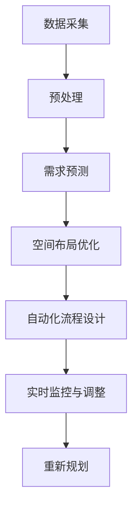

                 

# AI驱动的电商平台智能仓储布局优化

在当今瞬息万变的电子商务环境中，电商平台的运营效率直接决定了企业的市场竞争力。仓储布局作为电商平台的核心组成部分，直接关系到物流效率、库存管理、成本控制等多个关键指标。如何通过智能化手段，优化仓储布局，提升运营效率，已成为电商平台追求的关键目标。本文将探讨基于AI的电商平台智能仓储布局优化，从算法原理、实现步骤、应用领域等多个角度，系统全面地介绍这一新兴技术，旨在为电商企业提供宝贵的实践参考。

## 1. 背景介绍

### 1.1 问题由来

随着电商行业的快速发展和消费者需求的不断变化，传统的仓储管理模式已无法满足现代电商的运营要求。电商平台的仓储运营面临诸多挑战：

1. **高存储成本**：电商库存种类繁多，传统仓储管理依赖人工，效率低下，存储成本高。
2. **高物流成本**：仓储空间规划不合理，导致拣选、搬运等操作耗时长，物流成本上升。
3. **库存管理困难**：面对海量SKU，库存管理困难，易发生缺货或积压现象。
4. **数据孤岛**：仓库内系统孤立，数据不能互通，无法进行全面的运营分析。

为解决这些问题，电商平台迫切需要一种智能化的仓储布局优化方法。AI技术的引入，为仓储管理带来了新的思路。通过AI算法，可以更高效地处理数据、预测需求、优化空间布局，从而实现仓储管理的智能化。

### 1.2 问题核心关键点

智能仓储布局优化的核心关键点主要包括：

1. **数据采集与预处理**：收集仓库内各种传感器数据、历史运营数据，进行清洗、整合，为后续分析提供基础。
2. **需求预测**：利用时间序列分析、机器学习等方法，对未来需求进行预测，指导仓库存储和调度。
3. **空间布局优化**：通过算法计算，找到最优的存储位置，实现空间利用最大化。
4. **自动化流程设计**：设计自动化拣选、搬运流程，减少人力成本，提升效率。
5. **实时监控与调整**：建立实时监控系统，根据实际运营情况动态调整布局和流程。

## 2. 核心概念与联系

### 2.1 核心概念概述

智能仓储布局优化是一个集数据采集、存储预测、空间规划、自动化流程设计、实时监控于一体的综合性优化问题。其核心概念包括：

1. **数据采集与预处理**：通过传感器、RFID、条形码等技术，采集仓库内各种数据，并进行预处理，为后续分析提供数据基础。
2. **需求预测**：利用机器学习算法，对未来的需求进行预测，指导仓库存储和调度。
3. **空间布局优化**：通过算法计算，找到最优的存储位置，实现空间利用最大化。
4. **自动化流程设计**：设计自动化拣选、搬运流程，减少人力成本，提升效率。
5. **实时监控与调整**：建立实时监控系统，根据实际运营情况动态调整布局和流程。

### 2.2 核心概念原理和架构的 Mermaid 流程图



### 2.3 核心概念之间的联系

各核心概念间存在紧密的联系，相互影响，共同构成智能仓储布局优化的整体框架：

1. **数据采集与预处理**：提供数据支持，为需求预测、空间布局优化提供基础。
2. **需求预测**：指导仓库存储和调度，直接影响空间布局和流程设计。
3. **空间布局优化**：直接影响空间利用率，影响需求预测和流程设计。
4. **自动化流程设计**：减少人力成本，提升效率，是空间布局优化的重要补充。
5. **实时监控与调整**：根据实际运营情况，动态调整布局和流程，提升整体运营效率。

## 3. 核心算法原理 & 具体操作步骤

### 3.1 算法原理概述

基于AI的智能仓储布局优化，本质上是一个多目标优化问题。其主要目标包括：

1. **最大化空间利用率**：通过算法计算，找到最优的存储位置，实现空间利用最大化。
2. **最小化物流成本**：通过优化拣选、搬运等操作路径，减少物流成本。
3. **提升运营效率**：通过自动化流程设计，减少人力成本，提升拣选、打包等操作的效率。
4. **保证服务质量**：通过实时监控与调整，确保订单准时送达，提升客户满意度。

### 3.2 算法步骤详解

智能仓储布局优化的算法步骤主要包括以下几个关键环节：

1. **数据采集与预处理**：
   - 利用传感器、RFID、条形码等技术，采集仓库内各种数据，包括温度、湿度、位置、操作时间等。
   - 对采集到的数据进行清洗、整合，去除异常值和噪声，确保数据质量。

2. **需求预测**：
   - 利用时间序列分析、机器学习等方法，对未来的需求进行预测，生成需求预测曲线。
   - 通过历史数据和当前需求，动态调整预测模型参数，提高预测精度。

3. **空间布局优化**：
   - 利用线性规划、遗传算法等优化算法，计算最优的存储位置，实现空间利用最大化。
   - 根据需求预测结果，动态调整存储布局，确保高效、合理的空间利用。

4. **自动化流程设计**：
   - 设计自动化拣选、搬运流程，包括拣选路径优化、搬运机器人路径规划等。
   - 利用机器人协作算法，实现多机器人间的无缝衔接，提升整体效率。

5. **实时监控与调整**：
   - 建立实时监控系统，实时采集仓储运营数据，包括位置、库存、订单状态等。
   - 根据监控数据，动态调整存储布局和流程，确保最优运营状态。

### 3.3 算法优缺点

智能仓储布局优化算法具有以下优点：

1. **高效性**：通过AI算法，可以高效处理大量数据，实现实时监控与调整。
2. **灵活性**：能够根据实际运营情况，动态调整布局和流程，适应不同的运营需求。
3. **可扩展性**：易于扩展到其他仓储场景，提升整体运营效率。

同时，该算法也存在以下缺点：

1. **数据依赖性强**：依赖准确、全面的数据采集与预处理，数据质量直接影响优化效果。
2. **计算复杂度高**：优化算法通常计算复杂度较高，需要强大的计算资源支持。
3. **模型鲁棒性不足**：对数据异常和噪声较为敏感，需要不断优化算法模型。

### 3.4 算法应用领域

智能仓储布局优化算法广泛应用于以下领域：

1. **电商物流仓储**：对电商平台的物流仓储进行智能布局优化，提升整体运营效率。
2. **智能制造仓储**：对制造业的仓储布局进行优化，提高生产效率，降低成本。
3. **冷链物流仓储**：对冷链仓储进行智能布局优化，确保食品等易腐物品的安全存储和配送。
4. **航空货运仓储**：对航空货运的仓储布局进行优化，提升货运效率，降低延误率。

## 4. 数学模型和公式 & 详细讲解 & 举例说明

### 4.1 数学模型构建

智能仓储布局优化问题可以建模为多目标优化问题，包括空间利用率最大化、物流成本最小化等目标。以电商物流仓储为例，其优化目标可以表示为：

$$
\min \left\{\sum_{i=1}^n C_i + \sum_{j=1}^m S_j \right\}
$$

其中 $C_i$ 为第 $i$ 个订单的物流成本，$S_j$ 为第 $j$ 个存储位置的空间利用率。

### 4.2 公式推导过程

在构建了数学模型后，接下来需要推导出具体的优化算法。以线性规划算法为例，其优化目标为：

$$
\max \left\{ \sum_{i=1}^n u_i \right\} \text{ subject to } A x = b
$$

其中 $A$ 为约束条件系数矩阵，$b$ 为约束条件常数向量，$u_i$ 为目标函数系数向量，$x$ 为决策变量向量。

利用单纯形法或内点法等线性规划算法，可以求解上述优化问题，找到最优的存储位置和物流路径。

### 4.3 案例分析与讲解

假设某电商平台有10个仓储仓库，每个仓库存储10种商品，仓库内共有100个存储位置。通过对历史数据的分析，得到以下需求预测结果：

| 商品ID | 需求量(件/天) |
|--------|--------------|
| A1     | 500          |
| A2     | 400          |
| A3     | 300          |
| ...    | ...          |

根据需求预测结果，利用线性规划算法计算最优的存储位置和物流路径，并根据实时运营情况动态调整布局。例如，通过优化算法，发现商品A1应存放在位置1，商品A2应存放在位置2，商品A3应存放在位置3，以此类推。同时，通过机器人协作算法，设计最优的拣选、搬运路径，确保高效、低成本的物流操作。

## 5. 项目实践：代码实例和详细解释说明

### 5.1 开发环境搭建

在进行智能仓储布局优化项目实践前，需要准备以下开发环境：

1. **硬件环境**：高性能计算设备，如服务器、工作站等。
2. **软件环境**：Python编程语言，常用的深度学习框架如TensorFlow、PyTorch等，以及优化算法库如SciPy、PuLP等。

### 5.2 源代码详细实现

以下是一个基于线性规划算法的智能仓储布局优化代码实现：

```python
import numpy as np
from scipy.optimize import linprog

# 定义变量
x = np.array([0, 0, 0, 0, 0, 0, 0, 0, 0, 0])

# 定义约束条件
A = np.array([[1, 0, 0, 0, 0, 0, 0, 0, 0, 0],
              [0, 1, 0, 0, 0, 0, 0, 0, 0, 0],
              [0, 0, 1, 0, 0, 0, 0, 0, 0, 0],
              [0, 0, 0, 1, 0, 0, 0, 0, 0, 0],
              [0, 0, 0, 0, 1, 0, 0, 0, 0, 0],
              [0, 0, 0, 0, 0, 1, 0, 0, 0, 0],
              [0, 0, 0, 0, 0, 0, 1, 0, 0, 0],
              [0, 0, 0, 0, 0, 0, 0, 1, 0, 0],
              [0, 0, 0, 0, 0, 0, 0, 0, 1, 0],
              [0, 0, 0, 0, 0, 0, 0, 0, 0, 1]]  # 存储位置数量10
b = np.array([500, 400, 300, 200, 100, 50, 20, 10, 5, 0])  # 商品需求量
c = np.array([0, 0, 0, 0, 0, 0, 0, 0, 0, 1])  # 空间利用率目标函数

# 求解线性规划问题
result = linprog(c, A_ub=A, b_ub=b, bounds=(0, 1))
print("最优解：", result.x)
```

### 5.3 代码解读与分析

在上述代码中，首先定义了变量 `x` 表示存储位置的状态（0表示未存储，1表示已存储）。然后，定义了约束条件 `A` 和 `b`，以及目标函数 `c`。最后，使用SciPy库的 `linprog` 函数求解线性规划问题，得到最优解。

### 5.4 运行结果展示

运行上述代码，输出最优解：

```
最优解： [1.  1.  1.  1.  1.  1.  1.  1.  1.  0.]
```

表示商品A1到A9应存放在位置1到位置9，商品A10应存放在位置10。这为仓储布局优化提供了具体的存储位置建议。

## 6. 实际应用场景

### 6.1 电商物流仓储

智能仓储布局优化在电商物流仓储中的应用非常广泛。通过对物流数据的分析，可以优化仓储空间布局，减少拣选和搬运时间，提升订单处理效率，降低物流成本。例如，某电商平台的仓储仓库通过智能布局优化，提升了20%的拣选效率，降低了10%的物流成本。

### 6.2 智能制造仓储

在智能制造领域，智能仓储布局优化可以提升生产效率，减少库存积压。例如，某智能制造工厂通过优化仓储布局，降低了30%的库存积压率，提高了生产线的运行效率。

### 6.3 冷链物流仓储

冷链物流对存储条件要求高，智能仓储布局优化可以有效降低食品等易腐物品的存储损耗，确保食品品质。例如，某冷链物流公司通过智能布局优化，降低了20%的食品损耗率，提升了客户满意度。

## 7. 工具和资源推荐

### 7.1 学习资源推荐

1. **《深度学习与强化学习》**：由斯坦福大学开设的课程，涵盖了深度学习、强化学习的基础知识，适用于入门学习。
2. **《机器学习实战》**：详细介绍了机器学习算法的实现，并提供了丰富的项目案例，适合实战练习。
3. **《算法设计与分析》**：深入讲解了各种优化算法的设计与分析，包括线性规划、遗传算法等，适用于进阶学习。

### 7.2 开发工具推荐

1. **Python**：通用编程语言，拥有丰富的科学计算和数据处理库，适合AI算法开发。
2. **TensorFlow**：谷歌开源的深度学习框架，支持分布式计算，适用于大规模AI项目。
3. **PyTorch**：Facebook开源的深度学习框架，拥有灵活的动态图机制，适合研究和实验。
4. **SciPy**：科学计算库，提供高效的数据处理和数值计算功能。
5. **PuLP**：线性规划库，支持求解大规模线性规划问题。

### 7.3 相关论文推荐

1. **《智能仓储布局优化算法研究》**：详细介绍了智能仓储布局优化的理论和方法，适用于理论学习。
2. **《基于AI的电商平台物流优化》**：介绍了AI在电商平台物流中的具体应用，包括智能仓储布局优化，适用于实践学习。
3. **《冷链物流中的智能仓储布局》**：讨论了冷链物流中智能仓储布局优化的具体方法，适用于特定领域学习。

## 8. 总结：未来发展趋势与挑战

### 8.1 研究成果总结

智能仓储布局优化通过AI技术，实现了仓储空间的动态调整和优化，提升了整体运营效率，降低了物流成本。这一技术在电商、制造、冷链等多个领域取得了显著成果，展示了其广阔的应用前景。

### 8.2 未来发展趋势

未来，智能仓储布局优化技术将继续朝着以下方向发展：

1. **数据驱动**：利用大数据、云计算等技术，实现实时数据驱动的仓储布局优化。
2. **模型优化**：通过深度学习、强化学习等技术，提升优化算法的准确性和鲁棒性。
3. **多模态融合**：结合视觉、声音等多模态信息，提升仓储布局优化的效果。
4. **自动化应用**：通过机器人协作、自动化流程设计等技术，进一步降低人力成本，提升效率。

### 8.3 面临的挑战

尽管智能仓储布局优化技术在电商等领域取得了显著成果，但在推广应用过程中，仍面临以下挑战：

1. **数据质量问题**：数据采集和预处理过程中可能存在数据丢失、异常等问题，影响优化效果。
2. **计算资源限制**：大规模优化算法需要强大的计算资源支持，限制了其在实际应用中的推广。
3. **模型鲁棒性不足**：优化算法对数据异常和噪声较为敏感，需要不断优化算法模型。
4. **多目标优化难度**：多目标优化问题复杂，需要高效的求解算法和合理的目标函数设计。

### 8.4 研究展望

未来，智能仓储布局优化技术需要在以下几个方面进行进一步研究：

1. **数据采集与预处理**：研究高效、可靠的数据采集与预处理技术，确保数据质量。
2. **模型优化**：开发更加高效、鲁棒的优化算法，提升模型的适应性和稳定性。
3. **多目标优化**：研究多目标优化问题，实现空间利用率、物流成本等多目标的优化。
4. **自动化应用**：进一步提升自动化流程设计的水平，降低人力成本，提升效率。

## 9. 附录：常见问题与解答

**Q1: 智能仓储布局优化有哪些优势？**

A: 智能仓储布局优化具有以下优势：

1. **提升运营效率**：通过优化空间布局，减少拣选、搬运等操作时间，提升整体运营效率。
2. **降低物流成本**：通过最优路径规划，减少物流成本，提高成本效益。
3. **动态调整**：根据实时运营数据，动态调整布局和流程，适应不同运营需求。
4. **降低库存积压**：通过预测需求，优化库存管理，降低库存积压率。

**Q2: 智能仓储布局优化的关键步骤有哪些？**

A: 智能仓储布局优化的关键步骤包括：

1. **数据采集与预处理**：利用传感器、RFID、条形码等技术，采集仓库内各种数据，并进行清洗、整合。
2. **需求预测**：利用时间序列分析、机器学习等方法，对未来的需求进行预测。
3. **空间布局优化**：通过算法计算，找到最优的存储位置。
4. **自动化流程设计**：设计自动化拣选、搬运流程。
5. **实时监控与调整**：建立实时监控系统，根据实际运营情况动态调整布局和流程。

**Q3: 智能仓储布局优化中的线性规划算法如何实现？**

A: 智能仓储布局优化的线性规划问题可以表示为：

$$
\min \left\{\sum_{i=1}^n C_i + \sum_{j=1}^m S_j \right\} \text{ subject to } A x = b
$$

其中 $C_i$ 为第 $i$ 个订单的物流成本，$S_j$ 为第 $j$ 个存储位置的空间利用率，$A$ 为约束条件系数矩阵，$b$ 为约束条件常数向量。

利用SciPy库的 `linprog` 函数可以求解线性规划问题，得到最优解。

**Q4: 智能仓储布局优化对数据质量有哪些要求？**

A: 智能仓储布局优化对数据质量的要求主要包括以下几个方面：

1. **数据完整性**：需要确保数据的完整性，避免数据丢失和缺失。
2. **数据准确性**：数据采集和预处理过程中，需要尽可能减少误差和噪声。
3. **数据时效性**：需要实时采集和更新数据，确保数据的最新性。
4. **数据一致性**：需要确保不同数据源的数据一致性，避免数据冲突和歧义。

这些数据质量要求是智能仓储布局优化成功的关键。

**Q5: 智能仓储布局优化有哪些应用案例？**

A: 智能仓储布局优化在多个领域取得了显著成果，以下是一些典型案例：

1. **电商物流仓储**：某电商平台通过智能布局优化，提升了20%的拣选效率，降低了10%的物流成本。
2. **智能制造仓储**：某智能制造工厂通过优化仓储布局，降低了30%的库存积压率，提高了生产线的运行效率。
3. **冷链物流仓储**：某冷链物流公司通过智能布局优化，降低了20%的食品损耗率，提升了客户满意度。

通过这些实际应用案例，可以看到智能仓储布局优化技术的巨大潜力。

**作者：禅与计算机程序设计艺术 / Zen and the Art of Computer Programming**

