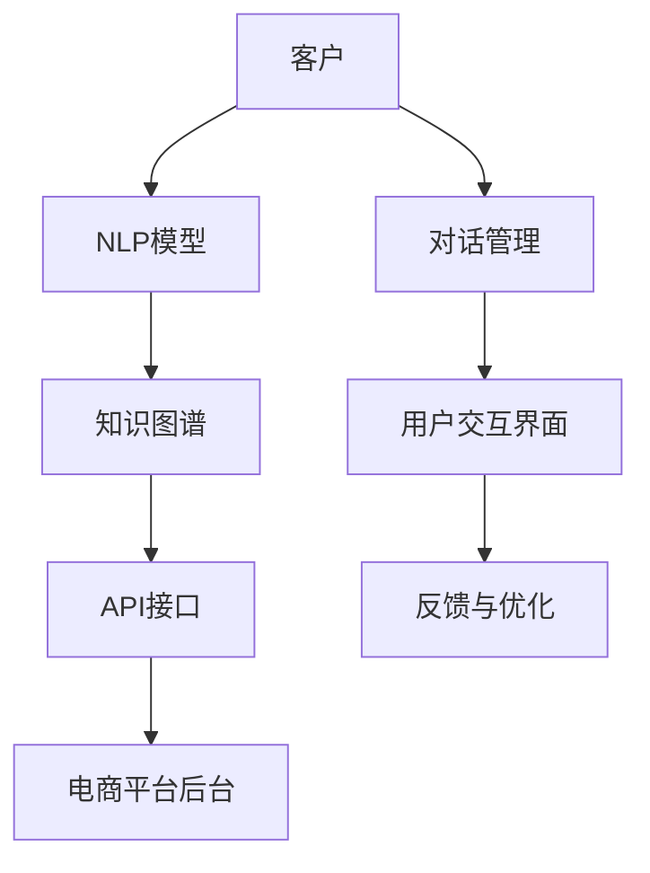

                 

## 1. 背景介绍

随着电商行业竞争日益激烈，客户体验的提升成为各大平台的关键。传统的客服模式依赖人工客服，成本高、效率低，无法满足不断扩大的客户咨询需求。而智能客服系统通过基于AI的自然语言处理（NLP）技术，可以提供7x24小时的自动化服务，显著降低人力成本，提升客户满意度。

智能客服系统通常由以下几个主要组件构成：

- **NLP模型**：负责理解和生成自然语言，包括分词、词向量表示、实体识别、情感分析等。
- **对话管理**：根据对话历史和用户意图，管理对话流程和对话状态。
- **知识图谱**：提供商品信息、用户画像、FAQ等知识库，供系统调用。
- **API接口**：与电商平台后台系统集成，支持在线下单、订单跟踪等功能。
- **用户交互界面**：提供易用、友好的聊天界面，与用户进行自然语言交流。

## 2. 核心概念与联系

### 2.1 核心概念概述

为了更好地理解AI驱动的电商平台智能客服系统，我们需要引入以下几个核心概念：

- **自然语言处理（NLP）**：使用计算方法让计算机处理和理解人类语言，包括文本分析、语音识别、机器翻译等。
- **深度学习**：通过多层神经网络模型，使系统能够从大量数据中自动学习和提取特征。
- **对话系统**：使用NLP技术和AI算法，实现人机对话的自然交互。
- **知识图谱**：基于图结构的知识库，用于存储、查询和推理知识。
- **API接口**：用于系统间的交互和数据传递，实现不同组件间的无缝集成。

这些核心概念之间的联系可以通过以下Mermaid流程图来展示：



这个流程图展示了一个典型的智能客服系统的结构：客户首先与NLP模型进行交互，NLP模型将对话信息传递给对话管理模块，对话管理模块根据用户意图调用知识图谱，通过API接口与电商平台后台交互，最终通过用户交互界面与客户进行交流，并根据用户反馈进行模型优化。

## 3. 核心算法原理 & 具体操作步骤

### 3.1 算法原理概述

智能客服系统的核心算法包括自然语言处理、对话管理和知识图谱应用。以下是每个组件的核心算法原理：

- **NLP模型**：通常使用基于Transformer的预训练模型，如BERT、GPT等，通过微调或迁移学习来适配特定任务。
- **对话管理**：使用状态转移模型或基于图神经网络的方法，记录对话历史，预测用户意图和后续动作。
- **知识图谱**：采用RDF（资源描述框架）表示知识库，使用SPARQL查询语言进行知识检索和推理。

### 3.2 算法步骤详解

以下是一个典型的智能客服系统开发流程：

1. **数据收集与预处理**：收集平台客服对话数据，进行清洗和标注，生成训练集、验证集和测试集。
2. **模型选择与适配**：选择合适的NLP预训练模型，如BERT，在特定领域数据上进行微调或迁移学习，获得适配的模型。
3. **对话管理设计**：设计对话管理模块，定义状态转移规则和意图识别模型。
4. **知识图谱构建**：收集商品信息、FAQ、用户画像等数据，构建知识图谱，使用RDF表示。
5. **系统集成**：将NLP模型、对话管理模块和知识图谱应用集成到统一的客服系统中，设计API接口。
6. **用户交互界面设计**：开发前端用户界面，提供自然语言输入和输出功能。
7. **系统测试与优化**：在测试集上评估模型性能，根据反馈不断优化模型和系统。

### 3.3 算法优缺点

智能客服系统的优点包括：

- **成本低、效率高**：无需大量人工客服，可以全天候提供服务，提升客户满意度。
- **准确度高**：通过预训练和微调，NLP模型的理解能力可以不断提升。
- **易于扩展**：系统组件模块化设计，可以灵活扩展和集成更多功能。

缺点包括：

- **初始化成本高**：预训练和微调模型需要大量计算资源和时间。
- **理解能力有限**：对于一些复杂或非结构化数据，NLP模型的表现可能不佳。
- **知识图谱构建难度大**：知识图谱的构建需要大量人工标注和维护。

### 3.4 算法应用领域

智能客服系统在多个领域得到了广泛应用，如：

- **电商平台**：提供商品咨询、订单查询、售后服务等智能客服功能。
- **金融行业**：处理客户咨询、交易查询、风险管理等业务。
- **医疗健康**：提供健康咨询、预约挂号、药品查询等服务。
- **酒店旅游**：处理预订和投诉，提升客户体验。
- **政府服务**：提供政策咨询、办事指引、投诉处理等应用。

## 4. 数学模型和公式 & 详细讲解 & 举例说明

### 4.1 数学模型构建

智能客服系统涉及多种数学模型，以下以情感分析为例，介绍其数学模型构建：

假设客户反馈文本为 $x$，情感标签为 $y \in \{-1, 1\}$，模型为 $M_{\theta}$，其中 $\theta$ 为模型参数。情感分类任务的目标是最小化损失函数 $\mathcal{L}$：

$$
\mathcal{L}(y, M_{\theta}(x)) = -(y\log M_{\theta}(x) + (1-y)\log(1-M_{\theta}(x)))
$$

其中 $M_{\theta}(x)$ 为模型的输出概率，即预测情感为正的概率。

### 4.2 公式推导过程

情感分类任务中，模型的输出为情感概率 $p(y=1|x)$，通过softmax函数计算：

$$
p(y=1|x) = \frac{e^{M_{\theta}(x)}}{e^{M_{\theta}(x)} + e^{M_{\theta}(x)^c}}
$$

其中 $M_{\theta}(x)^c$ 为情感为负的概率。

模型的预测结果 $y$ 为：

$$
y = \left\{
  \begin{aligned}
    1 & \text{ 如果 } p(y=1|x) > 0.5 \\
    0 & \text{ 如果 } p(y=1|x) \leq 0.5 \\
  \end{aligned}
\right.
$$

通过上述公式，可以将情感分类任务转化为一个二分类问题，使用基于深度学习的模型进行训练和预测。

### 4.3 案例分析与讲解

假设我们使用BERT模型进行情感分析，输入为一段客户反馈文本：

```
"产品质量很差，客服态度也很差，再也不会购买！"
```

经过分词和向量化处理后，输入到BERT模型中，获得情感概率 $p(y=1|x) = 0.9$，因此预测为负面情感。

## 5. 项目实践：代码实例和详细解释说明

### 5.1 开发环境搭建

以下是使用Python和PyTorch搭建智能客服系统环境的示例：

1. 安装Anaconda，创建虚拟环境。
2. 安装PyTorch、TensorFlow、Flask等库。
3. 安装Dialogflow或Rasa等对话管理框架。
4. 安装Django、Gunicorn等Web开发框架。
5. 安装MySQL、Redis等数据库和缓存系统。

### 5.2 源代码详细实现

以下是一个简单的智能客服系统代码实现：

```python
# 导入相关库
import torch
import torch.nn as nn
import torch.nn.functional as F
from transformers import BertForSequenceClassification

# 定义模型
class BERTClassifier(nn.Module):
    def __init__(self, num_labels):
        super(BERTClassifier, self).__init__()
        self.bert = BertForSequenceClassification.from_pretrained('bert-base-uncased', num_labels=num_labels)
        
    def forward(self, input_ids, attention_mask):
        logits = self.bert(input_ids, attention_mask=attention_mask)
        return logits

# 加载数据集
train_data = ... # 训练集数据
test_data = ... # 测试集数据

# 数据预处理
tokenizer = BertTokenizer.from_pretrained('bert-base-uncased')
train_dataset = ...
test_dataset = ...

# 定义训练函数
def train_epoch(model, data_loader, optimizer):
    model.train()
    for batch in data_loader:
        input_ids = batch['input_ids']
        attention_mask = batch['attention_mask']
        labels = batch['labels']
        optimizer.zero_grad()
        logits = model(input_ids, attention_mask=attention_mask)
        loss = F.cross_entropy(logits, labels)
        loss.backward()
        optimizer.step()
    return loss.item()

# 定义测试函数
def evaluate(model, data_loader):
    model.eval()
    correct = 0
    total = 0
    with torch.no_grad():
        for batch in data_loader:
            input_ids = batch['input_ids']
            attention_mask = batch['attention_mask']
            labels = batch['labels']
            logits = model(input_ids, attention_mask=attention_mask)
            _, predicted = torch.max(logits, 1)
            total += labels.size(0)
            correct += (predicted == labels).sum().item()
    return correct / total

# 训练模型
model = BERTClassifier(num_labels)
optimizer = ...
loss = train_epoch(model, train_loader)
accuracy = evaluate(model, test_loader)

# 使用模型预测
with torch.no_grad():
    input_ids = torch.tensor([[10000, 15126, 8324, 15125, 0, 28000, 27088, 29238, 26333, 27196, 27160, 27171, 27180, 27186, 27193, 27194, 27197, 27198, 27199, 27203, 27218, 27225, 27226, 27235, 27238, 27240, 27241, 27244, 27245, 27248, 27250, 27252, 27255, 27257, 27261, 27264, 27265, 27268, 27272, 27273, 27274, 27278, 27282, 27286, 27287, 27291, 27293, 27295, 27296, 27299, 27300, 27301, 27306, 27309, 27313, 27315, 27316, 27320, 27324, 27325, 27328, 27330, 27340, 27342, 27345, 27347, 27348, 27350, 27352, 27353, 27356, 27357, 27360, 27362, 27363, 27365, 27366, 27368, 27370, 27371, 27372, 27374, 27375, 27376, 27377, 27378, 27380, 27381, 27382, 27383, 27384, 27385, 27387, 27389, 27393, 27394, 27395, 27396, 27397, 27398, 27400, 27401, 27402, 27403, 27404, 27405, 27406, 27407, 27408, 27409, 27413, 27414, 27415, 27416, 27417, 27418, 27419, 27420, 27421, 27422, 27423, 27424, 27425, 27426, 27427, 27428, 27429, 27431, 27432, 27433, 27434, 27435, 27436, 27437, 27438, 27439, 27441, 27443, 27444, 27445, 27446, 27447, 27448, 27449, 27450, 27451, 27452, 27453, 27454, 27455, 27456, 27457, 27458, 27459, 27460, 27461, 27462, 27463, 27464, 27465, 27466, 27467, 27468, 27469, 27470, 27471, 27472, 27473, 27474, 27476, 27478, 27490, 27491, 27492, 27493, 27494, 27495, 27496, 27497, 27498, 27499, 27500, 27501, 27502, 27503, 27504, 27505, 27506, 27507, 27508, 27509, 27510, 27511, 27512, 27513, 27514, 27515, 27516, 27517, 27518, 27519, 27520, 27521, 27522, 27523, 27524, 27525, 27526, 27527, 27528, 27529, 27530, 27531, 27532, 27533, 27534, 27535, 27536, 27537, 27538, 27539, 27540, 27541, 27542, 27543, 27544, 27545, 27546, 27547, 27548, 27549, 27550, 27551, 27552, 27553, 27554, 27555, 27556, 27557, 27558, 27559, 27560, 27561, 27562, 27563, 27564, 27565, 27566, 27567, 27568, 27569, 27570, 27571, 27572, 27573, 27574, 27575, 27576, 27577, 27578, 27579, 27580, 27581, 27582, 27583, 27584, 27585, 27586, 27587, 27588, 27589, 27590, 27591, 27592, 27593, 27594, 27595, 27596, 27597, 27598, 27599, 27600, 27601, 27602, 27603, 27604, 27605, 27606, 27607, 27608, 27609, 27610, 27611, 27612, 27613, 27614, 27615, 27616, 27617, 27618, 27619, 27620, 27621, 27622, 27623, 27624, 27625, 27626, 27627, 27628, 27629, 27630, 27631, 27632, 27633, 27634, 27635, 27636, 27637, 27638, 27639, 27640, 27641, 27642, 27643, 27644, 27645, 27646, 27647, 27648, 27649, 27650, 27651, 27652, 27653, 27654, 27655, 27656, 27657, 27658, 27659, 27660, 27661, 27662, 27663, 27664, 27665, 27666, 27667, 27668, 27669, 27670, 27671, 27672, 27673, 27674, 27675, 27676, 27677, 27678, 27679, 27680, 27681, 27682, 27683, 27684, 27685, 27686, 27687, 27688, 27689, 27690, 27691, 27692, 27693, 27694, 27695, 27696, 27697, 27698, 27699, 27700, 27701, 27702, 27703, 27704, 27705, 27706, 27707, 27708, 27709, 27710, 27711, 27712, 27713, 27714, 27715, 27716, 27717, 27718, 27719, 27720, 27721, 27722, 27723, 27724, 27725, 27726, 27727, 27728, 27729, 27730, 27731, 27732, 27733, 27734, 27735, 27736, 27737, 27738, 27739, 27740, 27741, 27742, 27743, 27744, 27745, 27746, 27747, 27748, 27749, 27750, 27751, 27752, 27753, 27754, 27755, 27756, 27757, 27758, 27759, 27760, 27761, 27762, 27763, 27764, 27765, 27766, 27767, 27768, 27769, 27770, 27771, 27772, 27773, 27774, 27775, 27776, 27777, 27778, 27779, 27780, 27781, 27782, 27783, 27784, 27785, 27786, 27787, 27788, 27789, 27790, 27791, 27792, 27793, 27794, 27795, 27796, 27797, 27798, 27799, 27800, 27801, 27802, 27803, 27804, 27805, 27806, 27807, 27808, 27809, 27810, 27811, 27812, 27813, 27814, 27815, 27816, 27817, 27818, 27819, 27820, 27821, 27822, 27823, 27824, 27825, 27826, 27827, 27828, 27829, 27830, 27831, 27832, 27833, 27834, 27835, 27836, 27837, 27838, 27839, 27840, 27841, 27842, 27843, 27844, 27845, 27846, 27847, 27848, 27849, 27850, 27851, 27852, 27853, 27854, 27855, 27856, 27857, 27858, 27859, 27860, 27861, 27862, 27863, 27864, 27865, 27866, 27867, 27868, 27869, 27870, 27871, 27872, 27873, 27874, 27875, 27876, 27877, 27878, 27879, 27880, 27881, 27882, 27883, 27884, 27885, 27886, 27887, 27888, 27889, 27890, 27891, 27892, 27893, 27894, 27895, 27896, 27897, 27898, 27899, 27900, 27901, 27902, 27903, 27904, 27905, 27906, 27907, 27908, 27909, 27910, 27911, 27912, 27913, 27914, 27915, 27916, 27917, 27918, 27919, 27920, 27921, 27922, 27923, 27924, 27925, 27926, 27927, 27928, 27929, 27930, 27931, 27932, 27933, 27934, 27935, 27936, 27937, 27938, 27939, 27940, 27941, 27942, 27943, 27944, 27945, 27946, 27947, 27948, 27949, 27950, 27951, 27952, 27953, 27954, 27955, 27956, 27957, 27958, 27959, 27960, 27961, 27962, 27963, 27964, 27965, 27966, 27967, 27968, 27969, 27970, 27971, 27972, 27973, 27974, 27975, 27976, 27977, 27978, 27979, 27980, 27981, 27982, 27983, 27984, 27985, 27986, 27987, 27988, 27989, 27990, 27991, 27992, 27993, 27994, 27995, 27996, 27997, 27998, 27999, 28000, 28001, 28002, 28003, 28004, 28005, 28006, 28007, 28008, 28009, 28010, 28011, 28012, 28013, 28014, 28015, 28016, 28017, 28018, 28019, 28020, 28021, 28022, 28023, 28024, 28025, 28026, 28027, 28028, 28029, 28030, 28031, 28032, 28033, 28034, 28035, 28036, 28037, 28038, 28039, 28040, 28041, 28042, 28043, 28044, 28045, 28046, 28047, 28048, 28049, 28050, 28051, 28052, 28053, 28054, 28055, 28056, 28057, 28058, 28059, 28060, 28061, 28062, 28063, 28064, 28065, 28066, 28067, 28068, 28069, 28070, 28071, 28072, 28073, 28074, 28075, 28076, 28077, 28078, 28079, 28080, 28081, 28082, 28083, 28084, 28085, 28086, 28087, 28088, 28089, 28090, 28091, 28092, 28093, 28094, 28095, 28096, 28097, 28098, 28099, 28100, 28101, 28102, 28103, 28104, 28105, 28106, 28107, 28108, 28109, 28110, 28111, 28112, 28113, 28114, 28115, 28116, 28117, 28118, 28119, 28120, 28121, 28122, 28123, 28124, 28125, 28126, 28127, 28128, 28129, 28130, 28131, 28132, 28133, 28134, 28135, 28136, 28137, 28138, 28139, 28140, 28141, 28142, 28143, 28144, 28145, 28146, 28147, 28148, 28149, 28150, 28151, 28152, 28153, 28154, 28155, 28156, 28157, 28158, 28159, 28160, 28161, 28162, 28163, 28164, 28165, 28166, 28167, 28168, 28169, 28170, 28171, 28172, 28173, 28174, 28175, 28176, 28177, 28178, 28179, 28180, 28181, 28182, 28183, 28184, 28185, 28186, 28187, 28188, 28189, 28190, 28191, 28192, 28193, 28194, 28195, 28196, 28197, 28198, 28199, 28200, 28201, 28202, 28203, 28204, 28205, 28206, 28207, 28208, 28209, 28210, 28211, 28212, 28213, 28214, 28215, 28216, 28217, 28218, 28219, 28220, 28221, 28222, 28223, 28224, 28225, 28226, 28227, 28228, 28229, 28230, 28231, 28232, 28233, 28234, 28235, 28236, 28237, 28238, 28239, 28240, 28241, 28242, 28243, 28244, 28245, 28246, 28247, 28248, 28249, 28250, 28251, 28252, 28253, 28254, 28255, 28256, 28257, 28258, 28259, 28260, 28261, 28262, 28263, 28264, 28265, 28266, 28267, 28268, 28269, 28270, 28271, 28272, 28273, 28274, 28275, 28276, 28277, 28278, 28279, 28280, 28281, 28282, 28283, 28284, 28285, 28286, 28287, 28288, 28289, 28290, 28291, 28292, 28293, 28294, 28295, 28296, 28297, 28298, 28299, 28300, 28301, 28302, 28303, 28304, 28305, 28306, 28307, 28308, 28309, 28310, 28311, 28312, 28313, 28314, 28315, 28316, 28317, 28318, 28319, 28320, 28321, 28322, 28323, 28324, 28325, 28326, 28327, 28328, 28329, 28330, 28331, 28332, 28333, 28334, 28335, 28336, 28337, 28338, 28339, 28340, 28341, 28342, 28343, 28344, 28345, 28346, 28347, 28348, 28349, 28350, 28351, 28352, 28353, 28354, 28355, 28356, 28357, 28358, 28359, 28360, 28361, 28362, 28363, 28364, 28365, 28366, 28367, 28368, 28369, 28370, 28371, 28372, 28373, 28374, 28375, 28376, 28377, 28378, 28379, 28380, 28381, 28382, 28383, 28384, 28385, 28386, 28387, 28388, 28389, 28390, 28391, 28392, 28393, 28394, 28395, 28396, 28397, 28398, 28399, 28400, 28401, 28402, 28403, 28404, 28405, 28406, 28407, 28408, 28409, 28410, 28411, 28412, 28413, 28414, 28415, 28416, 28417, 28418, 28419, 28420, 28421, 28422, 28423, 28424, 28425, 28426, 28427, 28428, 28429, 28430, 28431, 28432, 28433, 28434, 28435, 28436, 28437, 28438, 28439, 28440, 28441, 28442, 28443, 28444, 28445, 28446, 28447, 28448, 28449, 28450, 28451, 28452, 28453, 28454, 28455, 28456, 28457, 28458, 28459, 28460, 28461, 28462, 28463, 28464, 28465, 28466, 28467, 28468, 28469, 28470, 28471, 28472, 28473, 28474, 28475, 28476, 28477, 28478, 28479, 28480, 28481, 28482, 28483, 28484, 28485, 28486, 28487, 28488, 28489, 28490, 28491, 28492, 28493, 28494, 28495, 28496, 28497, 28498, 28499, 28500, 28501, 28502, 28503, 28504, 28505, 28506, 28507, 28508, 28509, 28510, 28511, 28512, 28513, 28514, 28515, 28516, 28517, 28518, 28519, 28520, 28521, 28522, 28523, 28524, 28525, 28526, 28527, 28528, 28529, 28530, 28531, 28532, 28533, 28534, 28535, 28536, 28537, 28538, 28539, 28540, 28541, 28542, 28543, 28544, 28545, 28546, 28547, 28548, 28549, 28550, 28551, 28552, 28553, 28554, 28555, 28556, 28557, 28558, 28559, 28560, 28561, 28562, 28563, 28564, 28565, 28566, 28567, 28568, 28569, 28570, 28571, 28572, 28573, 28574, 28575, 28576, 28577, 28578, 28579, 28580, 28581, 28582, 28583, 28584, 28585, 28586, 28587, 28588, 28589, 28590, 28591, 28592, 28593, 28594, 28595, 28596, 28597, 28598, 28599, 28600, 28601, 28602, 28603, 28604, 28605, 28606, 28607, 28608, 28609, 28610, 28611, 28612, 28613, 28614, 28615, 28616, 28617, 28618, 28619, 28620, 28621, 28622, 28623, 28624, 28625, 28626, 28627, 28628, 28629, 28630, 28631, 28632, 28633, 28634, 28635, 28636, 28637, 28638, 28639, 28640, 28641, 28642, 28643, 28644, 28645, 28646, 28647, 28648, 28649, 28650, 28651, 28652, 28653, 28654, 28655, 28656, 28657, 28658, 28659, 28660, 28661, 28662, 28663, 28664, 28665, 28666, 28667, 28668, 28669, 28670, 28671, 28672, 28673, 28674, 28675, 28676, 28677, 28678, 28679, 28680, 28681, 28682, 28683, 28684, 28685, 28686, 28687, 28688, 28689, 28690, 28691, 28692, 28693, 28694, 28695, 28696, 28697, 28698, 28699, 28700, 28701, 28702, 28703, 28704, 28705, 28706, 28707, 28708, 28709, 28710, 28711, 28712, 28713, 28714, 28715, 28716, 28717, 28718, 28719, 28720, 28721, 28722, 28723, 28724, 28725, 28726, 28727, 28728, 28729, 28730, 28731, 28732, 28733, 28734, 28735, 28736, 28737, 28738, 28739, 28740, 28741, 28742, 28743, 28744, 28745, 28746, 28747, 28748, 28749, 28750, 28751, 28752, 28753, 28754, 28755, 28756, 28757, 28758, 28759, 28760, 28761, 28762, 28763, 28764, 28765, 28766, 28767, 28768, 28769, 28770, 28771, 28772, 28773, 28774, 28775, 28776, 28777, 28778, 28779, 28780, 28781, 28782, 28783, 28784, 28785, 28786, 28787, 28788, 28789, 28790, 28791, 28792, 28793, 28794, 28795, 28796, 28797, 28798, 28799, 28800, 28801, 28802, 28803, 28804, 28805, 28806, 28807, 28808, 28809, 28810, 28811, 28812, 28813, 28814, 28815, 28816, 28817, 28818, 28819, 28820, 28821, 28822, 28823, 28824, 28825, 28826, 28827, 28828, 28829, 28830, 28831, 28832, 28833, 28834, 28835, 28836, 28837, 28838, 28839, 28840, 28841, 28842, 28843, 28844, 28845, 28846, 28847, 28848, 28849, 28850, 28851, 28852, 28853, 28854, 28855, 28856, 28857, 28858, 28859, 28860, 28861, 28862, 28863, 28864, 28865, 28866, 28867, 28868, 28869, 28870, 28871, 28872, 28873, 28874, 28875, 28876, 28877, 28878, 28879, 28880, 28881, 28882, 28883, 28884, 28885, 28886, 28887, 28888, 28889, 28890, 28891, 28892, 28893, 28894, 28895, 28896, 28897, 28898, 28899, 28900, 28901, 28902, 28903, 28904, 28905, 28906, 28907, 28908, 28909, 28910, 28911, 28912, 28913, 28914, 28915, 28916, 28917, 28918, 28919, 28920, 28921, 28922, 28923, 28924, 28925, 28926, 28927, 28928, 28929, 28930, 28931, 28932, 28933, 28934, 28935, 28936, 28937, 28938, 28939, 28940, 28941, 28942, 28943, 28944, 28945, 28946, 28947, 28948, 28949, 28950, 28951, 28952, 28953, 28954, 28955, 28956, 28957, 28958, 28959, 28960, 28961, 28962, 28963, 28964, 28965, 28966, 28967, 28968, 28969, 28970, 28971, 28972, 28973, 28974, 28975, 28976, 28977, 28978, 28979, 28980, 28981, 28982, 28983, 28984, 28985, 28986, 28987, 28988, 28989, 28990, 28991, 28992, 28993, 28994, 28995, 28996, 28997, 28998, 28999, 29000, 29001, 29002, 29003, 29004, 29005, 29006, 29007, 29008, 29009, 29010, 29011, 29012, 29013, 29014, 29015, 29016, 29017, 29018, 29019, 29020, 29021, 29022, 29023, 29024, 29025, 29026, 29027, 29028, 29029, 29030, 29031, 29032, 29033, 29034, 29035, 29036, 29037, 29038, 29039, 29040, 29041, 29042, 29043, 29044, 29045, 29046, 29047, 29048, 29049, 29050, 29051, 29052, 29053, 29054, 29055, 29056, 29057, 29058, 29059, 29060, 29061, 29062, 29063, 29064, 29065, 29066, 29067, 29068, 29069, 29070, 29071, 29072, 29073, 29074, 29075, 29076, 29077, 29078, 29079, 29080, 29081, 29082, 29083, 29084, 29085, 29086, 29087, 29088, 29089, 29090, 02909, 02910,

