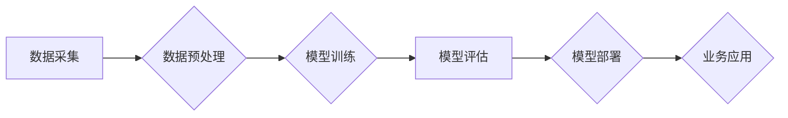

> 人工智能，深度学习，机器学习，自然语言处理，计算机视觉，数据分析，产业变革

## 1. 背景介绍

人工智能（AI）正以惊人的速度发展，从实验室的理论研究走向现实世界的广泛应用。它正在深刻地改变着各个行业，推动着产业的变革和升级。

近年来，深度学习技术的突破，为人工智能的发展注入了强劲动力。深度学习算法能够从海量数据中自动学习特征，从而实现对复杂问题的解决，例如图像识别、语音识别、自然语言处理等。

随着数据量的爆炸式增长和计算能力的提升，人工智能技术正在被广泛应用于各个领域，例如：

* **制造业:** 智能制造、预测性维护、质量控制
* **金融业:** 风险管理、欺诈检测、个性化服务
* **医疗保健:** 疾病诊断、药物研发、患者管理
* **零售业:** 个性化推荐、库存优化、客户服务
* **交通运输:** 自动驾驶、交通流量管理、物流优化

人工智能的应用正在改变着我们的生活方式，带来新的机遇和挑战。

## 2. 核心概念与联系

**2.1 人工智能 (AI)**

人工智能是指模拟人类智能行为的计算机系统。它涵盖了多个子领域，例如机器学习、深度学习、自然语言处理、计算机视觉等。

**2.2 机器学习 (ML)**

机器学习是人工智能的一个重要分支，它使计算机能够从数据中学习，无需明确编程。机器学习算法可以分为监督学习、无监督学习和强化学习三种类型。

**2.3 深度学习 (DL)**

深度学习是机器学习的一个子领域，它使用多层神经网络来模拟人类大脑的学习过程。深度学习算法能够从海量数据中自动学习特征，从而实现对复杂问题的解决。

**2.4 自然语言处理 (NLP)**

自然语言处理是指使计算机能够理解和处理人类语言的技术。NLP应用广泛，例如机器翻译、文本摘要、情感分析等。

**2.5 计算机视觉 (CV)**

计算机视觉是指使计算机能够“看”和理解图像的技术。CV应用广泛，例如图像识别、物体检测、图像分割等。

**2.6 产业变革**

人工智能正在推动着各个行业的变革和升级。它可以提高效率、降低成本、创造新的价值。

**Mermaid 流程图**



## 3. 核心算法原理 & 具体操作步骤

### 3.1 算法原理概述

深度学习算法的核心是多层神经网络。神经网络由多个层组成，每层包含多个神经元。神经元之间通过连接进行信息传递，每个连接都有一个权重。

深度学习算法通过训练神经网络，调整神经元之间的权重，使得网络能够从数据中学习特征。训练过程通常使用反向传播算法，它通过计算误差，反向传播到网络的每一层，调整权重，最终使得网络的输出与真实值尽可能接近。

### 3.2 算法步骤详解

1. **数据采集和预处理:** 收集相关数据，并进行清洗、转换、特征工程等预处理操作，使其适合深度学习算法的训练。
2. **模型选择:** 根据具体任务选择合适的深度学习模型，例如卷积神经网络（CNN）、循环神经网络（RNN）、Transformer等。
3. **模型训练:** 使用训练数据训练模型，调整神经网络的权重，使得模型能够学习到数据的特征。
4. **模型评估:** 使用测试数据评估模型的性能，例如准确率、召回率、F1-score等。
5. **模型部署:** 将训练好的模型部署到实际应用场景中，例如云平台、边缘设备等。

### 3.3 算法优缺点

**优点:**

* 能够从海量数据中自动学习特征，无需人工特征工程。
* 能够解决复杂问题，例如图像识别、语音识别、自然语言处理等。
* 性能优异，在许多任务上已经超越了人类水平。

**缺点:**

* 训练数据量大，需要大量的计算资源。
* 模型解释性差，难以理解模型的决策过程。
* 对数据质量要求高，数据噪声会影响模型性能。

### 3.4 算法应用领域

深度学习算法广泛应用于各个领域，例如：

* **图像识别:** 人脸识别、物体检测、图像分类
* **语音识别:** 语音转文本、语音助手
* **自然语言处理:** 机器翻译、文本摘要、情感分析
* **推荐系统:** 商品推荐、内容推荐
* **医疗诊断:** 疾病诊断、影像分析

## 4. 数学模型和公式 & 详细讲解 & 举例说明

### 4.1 数学模型构建

深度学习模型通常由多个层组成，每层包含多个神经元。每个神经元接收来自上一层的输入，并通过激活函数进行处理，输出到下一层。

**神经元模型:**

$$
y = f(w^T x + b)
$$

其中：

* $x$ 是输入向量
* $w$ 是权重向量
* $b$ 是偏置项
* $f$ 是激活函数
* $y$ 是输出值

**激活函数:**

常用的激活函数包括 sigmoid 函数、ReLU 函数、tanh 函数等。

**损失函数:**

损失函数用于衡量模型预测值与真实值的差距。常用的损失函数包括均方误差（MSE）、交叉熵损失等。

### 4.2 公式推导过程

反向传播算法用于训练深度学习模型。它通过计算误差，反向传播到网络的每一层，调整权重，使得模型的输出与真实值尽可能接近。

反向传播算法的核心思想是利用链式法则，将误差传播到网络的每一层，并计算每个权重的梯度。

**梯度计算:**

$$
\frac{\partial L}{\partial w} = \frac{\partial L}{\partial y} \cdot \frac{\partial y}{\partial w}
$$

其中：

* $L$ 是损失函数
* $y$ 是模型输出
* $w$ 是权重

### 4.3 案例分析与讲解

**图像分类:**

使用卷积神经网络（CNN）进行图像分类。

* 输入图像数据
* 通过卷积层提取图像特征
* 通过池化层降低特征维度
* 通过全连接层进行分类

**损失函数:**

交叉熵损失

**优化算法:**

Adam 优化器

## 5. 项目实践：代码实例和详细解释说明

### 5.1 开发环境搭建

使用 Python 语言和 TensorFlow 或 PyTorch 深度学习框架进行开发。

### 5.2 源代码详细实现

```python
import tensorflow as tf

# 定义模型
model = tf.keras.models.Sequential([
    tf.keras.layers.Conv2D(32, (3, 3), activation='relu', input_shape=(28, 28, 1)),
    tf.keras.layers.MaxPooling2D((2, 2)),
    tf.keras.layers.Conv2D(64, (3, 3), activation='relu'),
    tf.keras.layers.MaxPooling2D((2, 2)),
    tf.keras.layers.Flatten(),
    tf.keras.layers.Dense(10, activation='softmax')
])

# 编译模型
model.compile(optimizer='adam',
              loss='sparse_categorical_crossentropy',
              metrics=['accuracy'])

# 训练模型
model.fit(x_train, y_train, epochs=5)

# 评估模型
loss, accuracy = model.evaluate(x_test, y_test)
print('Test loss:', loss)
print('Test accuracy:', accuracy)
```

### 5.3 代码解读与分析

* 定义一个卷积神经网络模型，包含卷积层、池化层和全连接层。
* 使用 Adam 优化器、交叉熵损失函数和准确率作为评估指标。
* 使用训练数据训练模型，并使用测试数据评估模型性能。

### 5.4 运行结果展示

训练完成后，打印出测试集上的损失值和准确率。

## 6. 实际应用场景

### 6.1 智能客服

使用自然语言处理技术，构建智能客服系统，能够自动理解用户问题，并提供准确的回复。

### 6.2 医疗诊断辅助

使用深度学习算法，分析医学影像数据，辅助医生进行疾病诊断。

### 6.3 金融风险管理

使用机器学习算法，分析金融数据，识别潜在的风险，并进行风险控制。

### 6.4 未来应用展望

人工智能技术将继续发展，并应用于更多领域，例如：

* 自动驾驶
* 个性化教育
* 智慧城市
* 人机交互

## 7. 工具和资源推荐

### 7.1 学习资源推荐

* **书籍:**
    * 深度学习
    * 人工智能：一种现代方法
* **在线课程:**
    * Coursera 深度学习课程
    * Udacity 机器学习工程师 Nanodegree

### 7.2 开发工具推荐

* **Python:** 
* **TensorFlow:** 
* **PyTorch:** 
* **Keras:**

### 7.3 相关论文推荐

* **ImageNet Classification with Deep Convolutional Neural Networks**
* **Attention Is All You Need**

## 8. 总结：未来发展趋势与挑战

### 8.1 研究成果总结

人工智能技术取得了显著的进展，在各个领域都取得了突破性的应用。

### 8.2 未来发展趋势

* **模型更加强大:** 模型规模将继续扩大，性能将进一步提升。
* **应用更加广泛:** 人工智能将应用于更多领域，例如医疗、教育、金融等。
* **解释性更强:** 研究人员将致力于提高人工智能模型的解释性，使其决策过程更加透明。

### 8.3 面临的挑战

* **数据安全:** 人工智能模型依赖于大量数据，数据安全是一个重要的挑战。
* **算法偏见:** 人工智能模型可能存在算法偏见，需要进行公平性评估和改进。
* **伦理问题:** 人工智能的应用引发了一些伦理问题，需要进行深入探讨和规范。

### 8.4 研究展望

未来，人工智能研究将继续深入，探索更强大的模型、更广泛的应用场景和更完善的伦理规范。

## 9. 附录：常见问题与解答

**Q1: 如何选择合适的深度学习模型？**

**A1:** 选择合适的深度学习模型需要根据具体任务和数据特点进行选择。例如，图像识别任务可以使用卷积神经网络（CNN），自然语言处理任务可以使用循环神经网络（RNN）或 Transformer。

**Q2: 如何解决数据过拟合问题？**

**A2:** 数据过拟合是指模型在训练数据上表现很好，但在测试数据上表现较差。解决数据过拟合问题的方法包括：

* 增加训练数据量
* 使用正则化技术
* 使用 dropout 技术
* 使用交叉验证

**Q3: 如何评估深度学习模型的性能？**

**A3:** 深度学习模型的性能可以使用多种指标进行评估，例如准确率、召回率、F1-score、AUC等。

**Q4: 如何部署深度学习模型？**

**A4:** 深度学习模型可以部署到云平台、边缘设备等。部署方法取决于具体的应用场景和模型规模。


作者：禅与计算机程序设计艺术 / Zen and the Art of Computer Programming 
<end_of_turn>