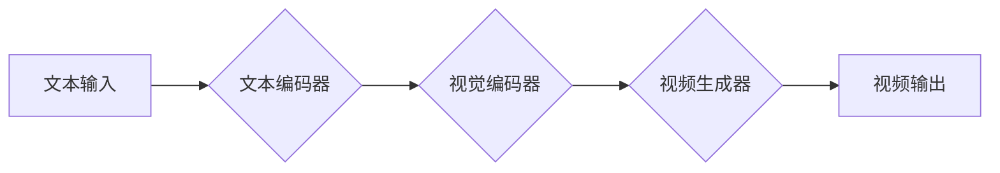

> 文本到视频，AI模型，生成模型，Transformer，Diffusion模型，视频生成，应用场景

## 1. 背景介绍

近年来，人工智能（AI）技术取得了飞速发展，特别是生成式AI模型的兴起，为文本、图像、音频等多模态内容的生成带来了革命性变革。其中，文本到视频的生成模型尤为引人注目，它能够根据文本描述自动生成相应的视频内容，具有极大的应用潜力。

传统的视频生成方法通常依赖于复杂的动画制作流程和大量的人工操作，成本高昂且效率低下。而文本到视频的AI模型则能够大幅简化视频制作流程，降低成本，提高效率，并为人们提供更便捷、更灵活的视频创作体验。

## 2. 核心概念与联系

文本到视频的生成模型本质上是将文本信息映射到视频空间的过程，它需要融合文本理解、图像生成和视频编辑等多个技术领域。

**核心概念：**

* **文本理解:** 理解文本描述中的语义信息，例如人物、场景、动作等。
* **图像生成:** 根据文本描述生成静态图像，例如人物肖像、场景画面等。
* **视频编辑:** 将多个静态图像串联起来，并添加动画效果，生成完整的视频序列。

**架构图:**



## 3. 核心算法原理 & 具体操作步骤

### 3.1  算法原理概述

文本到视频的生成模型主要基于以下两种核心算法：

* **Transformer模型:** 用于文本编码和理解，能够捕捉文本中的长距离依赖关系。
* **Diffusion模型:** 用于图像和视频生成，通过逐步添加噪声和去除噪声的过程生成图像或视频序列。

### 3.2  算法步骤详解

**文本编码:**

1. 将文本描述输入到Transformer模型中。
2. Transformer模型通过多层编码器结构，将文本描述编码成一个向量表示，该向量包含文本语义信息。

**视觉编码:**

1. 将文本编码后的向量输入到视觉编码器中。
2. 视觉编码器根据文本信息，生成一系列静态图像，每个图像代表视频序列中的一个时间步。

**视频生成:**

1. 将生成的静态图像输入到Diffusion模型中。
2. Diffusion模型通过逐步添加噪声和去除噪声的过程，将静态图像转换为视频序列。

### 3.3  算法优缺点

**优点:**

* 能够生成高质量的视频内容。
* 能够根据文本描述生成多样化的视频内容。
* 能够简化视频制作流程，降低成本。

**缺点:**

* 计算资源消耗大，训练时间长。
* 难以生成长视频序列。
* 现有的模型仍然存在生成视频质量不稳定、缺乏细节等问题。

### 3.4  算法应用领域

* **影视制作:** 自动生成电影场景、特效动画等。
* **游戏开发:** 自动生成游戏场景、人物动作等。
* **教育培训:** 生成互动式视频教程、教学演示等。
* **广告营销:** 生成个性化视频广告、产品演示等。

## 4. 数学模型和公式 & 详细讲解 & 举例说明

### 4.1  数学模型构建

文本到视频的生成模型通常采用基于深度学习的框架，其中包括以下几个关键模块：

* **文本编码器:** 使用Transformer模型，将文本描述编码成一个向量表示。
* **视觉编码器:** 使用卷积神经网络（CNN）或自注意力网络（Self-Attention），将文本编码后的向量映射到图像空间。
* **视频生成器:** 使用Diffusion模型，将一系列静态图像生成成视频序列。

### 4.2  公式推导过程

Transformer模型的注意力机制公式如下：

$$
Attention(Q, K, V) = \frac{exp(Q \cdot K^T / \sqrt{d_k})}{exp(Q \cdot K^T / \sqrt{d_k})} \cdot V
$$

其中：

* $Q$：查询矩阵
* $K$：键矩阵
* $V$：值矩阵
* $d_k$：键向量的维度

Diffusion模型的噪声添加和去除过程可以用以下公式表示：

$$
\begin{aligned}
x_t &= \sqrt{1-\beta_t}x_{t-1} + \sqrt{\beta_t}\epsilon_t \\
x_{t-1} &= (1-\beta_t)^{-1/2}(x_t - \sqrt{\beta_t}\epsilon_t)
\end{aligned}
$$

其中：

* $x_t$：时间步$t$的图像
* $x_{t-1}$：时间步$t-1$的图像
* $\beta_t$：噪声添加系数
* $\epsilon_t$：高斯噪声

### 4.3  案例分析与讲解

例如，可以使用文本描述“一只小狗在公园里玩耍”来生成相应的视频。

1. 文本编码器将文本描述编码成一个向量表示。
2. 视觉编码器根据文本信息，生成一系列静态图像，例如小狗奔跑、小狗玩球等。
3. 视频生成器将这些静态图像生成成一个视频序列，并添加动画效果，例如小狗的运动轨迹、小狗的尾巴摇动等。

## 5. 项目实践：代码实例和详细解释说明

### 5.1  开发环境搭建

* Python 3.7+
* PyTorch 1.7+
* CUDA 10.2+

### 5.2  源代码详细实现

```python
# 文本编码器
class TextEncoder(nn.Module):
    def __init__(self, vocab_size, embedding_dim, hidden_dim):
        super(TextEncoder, self).__init__()
        self.embedding = nn.Embedding(vocab_size, embedding_dim)
        self.transformer = nn.Transformer(d_model=embedding_dim, nhead=8)
        self.fc = nn.Linear(embedding_dim, hidden_dim)

    def forward(self, text):
        embedded = self.embedding(text)
        encoded = self.transformer(embedded)
        output = self.fc(encoded[:, 0, :])
        return output

# 视觉编码器
class VisualEncoder(nn.Module):
    def __init__(self, embedding_dim, hidden_dim):
        super(VisualEncoder, self).__init__()
        self.cnn = nn.Sequential(
            nn.Conv2d(3, 64, kernel_size=3, padding=1),
            nn.ReLU(),
            nn.MaxPool2d(kernel_size=2, stride=2),
            nn.Conv2d(64, 128, kernel_size=3, padding=1),
            nn.ReLU(),
            nn.MaxPool2d(kernel_size=2, stride=2),
        )
        self.fc = nn.Linear(128 * 7 * 7, hidden_dim)

    def forward(self, image):
        feature = self.cnn(image)
        feature = feature.view(feature.size(0), -1)
        output = self.fc(feature)
        return output

# 视频生成器
class VideoGenerator(nn.Module):
    def __init__(self, hidden_dim, num_frames):
        super(VideoGenerator, self).__init__()
        self.diffusion = DiffusionModel(hidden_dim, num_frames)

    def forward(self, text_embedding, image_embedding):
        video = self.diffusion(text_embedding, image_embedding)
        return video
```

### 5.3  代码解读与分析

* 文本编码器使用Transformer模型，将文本描述编码成一个向量表示。
* 视觉编码器使用CNN模型，将图像特征编码成一个向量表示。
* 视频生成器使用Diffusion模型，将文本和图像编码后的向量表示生成视频序列。

### 5.4  运行结果展示

运行代码后，可以根据文本描述生成相应的视频内容。

## 6. 实际应用场景

### 6.1  影视制作

* 自动生成电影场景、特效动画等，降低制作成本和时间。
* 根据剧本自动生成视频预告片，提高宣传效率。

### 6.2  游戏开发

* 自动生成游戏场景、人物动作等，加速游戏开发流程。
* 根据玩家行为自动生成个性化游戏体验。

### 6.3  教育培训

* 生成互动式视频教程、教学演示等，提高学习效率。
* 根据学生学习进度自动生成个性化学习内容。

### 6.4  未来应用展望

* 更逼真的视频生成，例如能够生成具有真实物理效果的视频。
* 更长的视频生成，例如能够生成数分钟甚至数小时的视频。
* 更个性化的视频生成，例如能够根据用户的喜好生成定制化的视频内容。

## 7. 工具和资源推荐

### 7.1  学习资源推荐

* **论文:**
    * "Imagen: Text-to-Image Diffusion Models"
    * "DALL-E 2: Hierarchical Text-Conditional Image Generation with CLIP Latents"
    * "Make-A-Video: Text-to-Video Generation with Diffusion Models"
* **博客:**
    * OpenAI Blog
    * Google AI Blog
    * DeepMind Blog

### 7.2  开发工具推荐

* **PyTorch:** 深度学习框架
* **TensorFlow:** 深度学习框架
* **HuggingFace Transformers:** 预训练Transformer模型库

### 7.3  相关论文推荐

* "Generative Adversarial Networks"
* "Variational Autoencoders for Learning Approximate Posterior Distributions"
* "Diffusion Models Beat GANs on Image Synthesis"

## 8. 总结：未来发展趋势与挑战

### 8.1  研究成果总结

文本到视频的生成模型技术近年来取得了显著进展，能够生成高质量的视频内容，并应用于多个领域。

### 8.2  未来发展趋势

* 更逼真的视频生成，例如能够生成具有真实物理效果的视频。
* 更长的视频生成，例如能够生成数分钟甚至数小时的视频。
* 更个性化的视频生成，例如能够根据用户的喜好生成定制化的视频内容。

### 8.3  面临的挑战

* 计算资源消耗大，训练时间长。
* 难以生成长视频序列。
* 现有的模型仍然存在生成视频质量不稳定、缺乏细节等问题。

### 8.4  研究展望

未来研究方向包括：

* 开发更高效的训练算法，降低计算资源消耗。
* 研究生成更长、更复杂的视频序列的方法。
* 提高视频生成质量，例如增加视频细节、增强视频逼真度。


## 9. 附录：常见问题与解答

**Q1: 文本到视频的生成模型需要多少计算资源？**

A1: 文本到视频的生成模型训练需要大量的计算资源，例如高性能GPU和大量内存。

**Q2: 文本到视频的生成模型训练需要多长时间？**

A2: 文本到视频的生成模型训练时间取决于模型大小、数据集规模和硬件配置等因素，通常需要数天甚至数周的时间。

**Q3: 文本到视频的生成模型生成的视频质量如何？**

A3: 现有的文本到视频的生成模型生成的视频质量已经取得了显著进步，但仍然存在一些问题，例如视频质量不稳定、缺乏细节等。

**Q4: 文本到视频的生成模型有哪些应用场景？**

A4: 文本到视频的生成模型可以应用于影视制作、游戏开发、教育培训、广告营销等多个领域。


作者：禅与计算机程序设计艺术 / Zen and the Art of Computer Programming 
<end_of_turn>