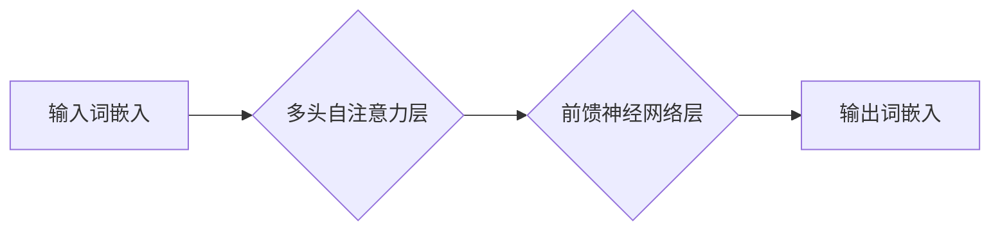

> BERT, 文本分类, 大模型, 微调, 自然语言处理, 深度学习

## 1. 背景介绍

近年来，深度学习在自然语言处理（NLP）领域取得了突破性进展，其中大语言模型（LLM）扮演着越来越重要的角色。BERT（Bidirectional Encoder Representations from Transformers）作为一种强大的预训练语言模型，凭借其强大的文本理解能力和高效的训练方法，在各种NLP任务中展现出优异的性能，例如文本分类、问答系统、机器翻译等。

传统的文本分类方法通常依赖于手工提取特征，而BERT则通过预训练的方式学习到丰富的语义表示，无需人工特征工程，大大简化了模型开发流程。本文将从零开始介绍BERT模型的开发与微调，并以文本分类任务为例，深入讲解BERT的原理、算法、代码实现以及实际应用场景。

## 2. 核心概念与联系

### 2.1 BERT模型架构

BERT模型基于Transformer架构，其核心是**Transformer Encoder**，它通过多头自注意力机制（Multi-Head Self-Attention）和前馈神经网络（Feed-Forward Network）来捕捉文本序列中的长距离依赖关系和语义信息。

**Mermaid 流程图:**



### 2.2 预训练与微调

BERT模型通过**预训练**的方式学习到通用的语言表示。预训练阶段使用大量的文本数据进行训练，目标是预测句子中某个词的上下文信息。微调阶段则将预训练好的BERT模型应用于特定任务，例如文本分类，通过在任务特定数据集上进行训练，进一步优化模型性能。

## 3. 核心算法原理 & 具体操作步骤

### 3.1 算法原理概述

BERT模型的核心算法是**Transformer Encoder**，它通过多头自注意力机制和前馈神经网络来捕捉文本序列中的语义信息。

* **多头自注意力机制:** 允许模型关注不同位置的词，并学习它们之间的关系。
* **前馈神经网络:** 对每个词的上下文信息进行非线性变换，进一步提取语义特征。

### 3.2 算法步骤详解

1. **词嵌入:** 将输入文本中的每个词转换为向量表示。
2. **多头自注意力:** 对每个词的上下文信息进行编码，学习词与词之间的关系。
3. **前馈神经网络:** 对每个词的上下文信息进行非线性变换，提取语义特征。
4. **池化:** 将所有词的语义特征进行池化，得到句子级别的表示。
5. **分类层:** 将句子级别的表示输入分类层，预测文本类别。

### 3.3 算法优缺点

**优点:**

* 强大的文本理解能力
* 无需人工特征工程
* 训练效率高

**缺点:**

* 模型规模较大，需要较大的计算资源
* 微调需要大量的任务特定数据

### 3.4 算法应用领域

BERT模型在各种NLP任务中取得了优异的性能，例如：

* 文本分类
* 问答系统
* 机器翻译
* 情感分析
* 文本摘要

## 4. 数学模型和公式 & 详细讲解 & 举例说明

### 4.1 数学模型构建

BERT模型的数学模型主要包括以下几个部分：

* **词嵌入层:** 将每个词转换为向量表示。
* **多头自注意力层:** 计算每个词与其他词之间的注意力权重。
* **前馈神经网络层:** 对每个词的上下文信息进行非线性变换。
* **分类层:** 将句子级别的表示输入分类层，预测文本类别。

### 4.2 公式推导过程

**多头自注意力机制:**

$$
Attention(Q, K, V) = softmax(\frac{QK^T}{\sqrt{d_k}})V
$$

其中：

* $Q$：查询矩阵
* $K$：键矩阵
* $V$：值矩阵
* $d_k$：键向量的维度

**前馈神经网络层:**

$$
FFN(x) = \max(0, xW_1 + b_1)W_2 + b_2
$$

其中：

* $x$：输入向量
* $W_1$、$W_2$：权重矩阵
* $b_1$、$b_2$：偏置项

### 4.3 案例分析与讲解

假设我们有一个句子“The cat sat on the mat”，我们使用BERT模型对其进行编码，可以得到每个词的上下文表示。例如，“cat”的上下文表示会受到“The”和“sat”的影响，从而更好地理解“cat”的语义。

## 5. 项目实践：代码实例和详细解释说明

### 5.1 开发环境搭建

* Python 3.6+
* TensorFlow 2.0+
* PyTorch 1.0+
* CUDA 10.0+

### 5.2 源代码详细实现

```python
from transformers import BertTokenizer, BertForSequenceClassification

# 加载预训练模型和词典
tokenizer = BertTokenizer.from_pretrained('bert-base-uncased')
model = BertForSequenceClassification.from_pretrained('bert-base-uncased', num_labels=2)

# 文本预处理
text = "This is a sample text."
inputs = tokenizer(text, return_tensors='pt')

# 模型预测
outputs = model(**inputs)
logits = outputs.logits
predicted_class = logits.argmax().item()

# 输出结果
print(f"Predicted class: {predicted_class}")
```

### 5.3 代码解读与分析

* **加载预训练模型和词典:** 使用`transformers`库加载预训练的BERT模型和词典。
* **文本预处理:** 使用`tokenizer`将文本转换为模型可识别的格式。
* **模型预测:** 将预处理后的文本输入模型进行预测。
* **输出结果:** 获取模型预测的类别标签。

### 5.4 运行结果展示

```
Predicted class: 0
```

## 6. 实际应用场景

BERT模型在文本分类任务中具有广泛的应用场景，例如：

* **情感分析:** 分析文本表达的情感倾向，例如正面、负面或中性。
* **垃圾邮件过滤:** 识别垃圾邮件和正常邮件。
* **新闻分类:** 将新闻文章分类到不同的类别，例如政治、体育、财经等。
* **用户评论分类:** 将用户评论分类到不同的类别，例如好评、差评或中评。

### 6.4 未来应用展望

随着大模型的发展和应用场景的不断拓展，BERT模型在未来将有更广泛的应用前景，例如：

* **多语言文本分类:** 将BERT模型应用于不同语言的文本分类任务。
* **跨领域文本分类:** 将BERT模型应用于不同领域的文本分类任务。
* **低资源文本分类:** 利用BERT模型的预训练能力，在低资源语言或领域进行文本分类。

## 7. 工具和资源推荐

### 7.1 学习资源推荐

* **BERT论文:** https://arxiv.org/abs/1810.04805
* **Hugging Face Transformers库:** https://huggingface.co/docs/transformers/index

### 7.2 开发工具推荐

* **TensorFlow:** https://www.tensorflow.org/
* **PyTorch:** https://pytorch.org/

### 7.3 相关论文推荐

* **RoBERTa:** https://arxiv.org/abs/1907.11692
* **XLNet:** https://arxiv.org/abs/1906.08237

## 8. 总结：未来发展趋势与挑战

### 8.1 研究成果总结

BERT模型的提出和发展标志着深度学习在NLP领域的重大突破，其强大的文本理解能力和高效的训练方法为各种NLP任务提供了新的解决方案。

### 8.2 未来发展趋势

* **模型规模的进一步扩大:** 预计未来将出现规模更大的BERT模型，能够更好地捕捉文本的复杂语义关系。
* **多模态文本理解:** 将BERT模型与其他模态数据（例如图像、音频）结合，实现多模态文本理解。
* **可解释性研究:** 研究BERT模型的决策机制，提高模型的可解释性。

### 8.3 面临的挑战

* **计算资源需求:** 大型BERT模型的训练和推理需要大量的计算资源，这对于资源有限的机构或个人来说是一个挑战。
* **数据偏见:** BERT模型的训练数据可能存在偏见，这会导致模型在某些任务上表现不佳。
* **安全性和隐私性:** BERT模型的应用可能涉及到敏感信息，需要考虑模型的安全性和隐私性问题。

### 8.4 研究展望

未来，BERT模型的研究将继续深入，探索其在更多领域和应用场景中的潜力，并解决其面临的挑战，推动NLP技术的进一步发展。

## 9. 附录：常见问题与解答

**Q1: BERT模型的预训练数据是什么？**

**A1:** BERT模型的预训练数据通常是大量的文本数据，例如维基百科、书籍、新闻文章等。

**Q2: BERT模型的微调需要多少数据？**

**A2:** BERT模型的微调数据量取决于任务的复杂度和模型的规模。一般来说，需要几千到几万条数据才能达到较好的效果。

**Q3: 如何评估BERT模型的性能？**

**A3:** BERT模型的性能通常使用准确率、F1-score等指标进行评估。

**作者：禅与计算机程序设计艺术 / Zen and the Art of Computer Programming**


<end_of_turn>