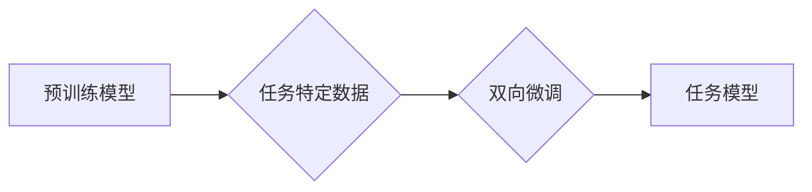

> 大模型开发, 微调, 双向训练, 语言模型, 深度学习, Transformer

## 1. 背景介绍

近年来，深度学习技术取得了飞速发展，尤其是Transformer模型的出现，彻底改变了自然语言处理（NLP）领域的面貌。大型语言模型（LLM）凭借其强大的文本生成、理解和翻译能力，在各个领域展现出巨大的应用潜力。然而，训练一个大型语言模型需要海量数据和强大的计算资源，对于普通开发者来说，直接训练一个LLM往往是不可行的。

微调技术应运而生，它允许开发者利用预训练的LLM，在特定任务上进行针对性的训练，从而降低训练成本和时间，并获得更好的性能。传统的微调方法通常是单向的，即只在模型的输出层进行调整，而忽略了模型内部的结构和参数。

## 2. 核心概念与联系

双向微调是一种更先进的微调方法，它不仅调整模型的输出层，还对模型内部的各个层进行调整，从而更好地适应特定任务。

**双向微调的原理：**

1. **预训练模型：**首先，使用大量的文本数据训练一个预训练的LLM，例如BERT、GPT-3等。预训练模型已经学习了语言的语法和语义知识。
2. **任务特定数据：**收集与目标任务相关的少量数据，例如文本分类、问答、机器翻译等。
3. **双向微调：**将预训练模型加载到训练框架中，并使用任务特定数据进行双向微调。双向微调是指同时调整模型的输入层和输出层，以及模型内部的各个层。

**双向微调的优势：**

* **更好的性能：**双向微调可以更好地利用预训练模型的知识，从而获得更高的任务性能。
* **更快的收敛速度：**由于模型内部的各个层都参与训练，因此双向微调的收敛速度更快。
* **更小的训练数据需求：**由于模型已经具备一定的语言理解能力，因此双向微调只需要少量任务特定数据即可达到较好的效果。

**Mermaid 流程图：**



## 3. 核心算法原理 & 具体操作步骤

### 3.1  算法原理概述

双向微调的核心算法是基于梯度下降的优化算法，它通过不断调整模型参数，使得模型在目标任务上的损失函数最小化。

### 3.2  算法步骤详解

1. **初始化模型参数：**将预训练模型的权重作为初始参数。
2. **数据预处理：**将任务特定数据进行预处理，例如分词、词向量化等。
3. **正向传播：**将预处理后的数据输入模型，计算模型的输出。
4. **损失函数计算：**计算模型输出与真实标签之间的差异，即损失函数值。
5. **反向传播：**根据损失函数值，计算模型参数的梯度。
6. **参数更新：**使用梯度下降算法更新模型参数，使得损失函数值减小。
7. **重复步骤3-6：**重复上述步骤，直到模型达到预定的性能指标。

### 3.3  算法优缺点

**优点：**

* **性能提升：**双向微调可以更好地利用预训练模型的知识，从而获得更高的任务性能。
* **收敛速度快：**由于模型内部的各个层都参与训练，因此双向微调的收敛速度更快。
* **数据需求低：**由于模型已经具备一定的语言理解能力，因此双向微调只需要少量任务特定数据即可达到较好的效果。

**缺点：**

* **计算资源消耗大：**双向微调需要训练模型的各个层，因此计算资源消耗较大。
* **训练时间长：**由于模型参数较多，因此双向微调的训练时间较长。

### 3.4  算法应用领域

双向微调在各个NLP任务中都有广泛的应用，例如：

* **文本分类：**例如情感分析、主题分类等。
* **问答系统：**例如问答机器人、知识问答等。
* **机器翻译：**例如中英翻译、日韩翻译等。
* **文本生成：**例如故事生成、诗歌生成等。

## 4. 数学模型和公式 & 详细讲解 & 举例说明

### 4.1  数学模型构建

双向微调的数学模型可以看作是一个多层神经网络，其中每一层都包含多个神经元。每个神经元接收来自上一层的输出作为输入，并通过激活函数进行处理，输出到下一层。

### 4.2  公式推导过程

损失函数通常是交叉熵损失函数，用于衡量模型输出与真实标签之间的差异。

$$
Loss = -\sum_{i=1}^{N} y_i \log(p_i)
$$

其中：

* $N$ 是样本数量。
* $y_i$ 是真实标签。
* $p_i$ 是模型输出的概率。

梯度下降算法用于更新模型参数，其更新公式如下：

$$
\theta = \theta - \alpha \nabla Loss
$$

其中：

* $\theta$ 是模型参数。
* $\alpha$ 是学习率。
* $\nabla Loss$ 是损失函数的梯度。

### 4.3  案例分析与讲解

假设我们有一个文本分类任务，目标是将文本分类为正类或负类。我们可以使用双向微调方法，将预训练的BERT模型微调到这个任务上。

在训练过程中，我们将BERT模型的输出层调整为两个神经元，分别对应正类和负类。然后，我们将文本数据进行预处理，并将其输入BERT模型进行训练。

通过训练，BERT模型将学习到文本分类的特征，并能够准确地将文本分类为正类或负类。

## 5. 项目实践：代码实例和详细解释说明

### 5.1  开发环境搭建

* Python 3.7+
* PyTorch 1.7+
* Transformers 4.0+

### 5.2  源代码详细实现

```python
from transformers import AutoModelForSequenceClassification, AutoTokenizer

# 加载预训练模型和词典
model_name = "bert-base-uncased"
tokenizer = AutoTokenizer.from_pretrained(model_name)
model = AutoModelForSequenceClassification.from_pretrained(model_name, num_labels=2)

# 数据加载和预处理
# ...

# 训练模型
optimizer = torch.optim.AdamW(model.parameters(), lr=2e-5)
for epoch in range(3):
    for batch in dataloader:
        input_ids = batch["input_ids"]
        attention_mask = batch["attention_mask"]
        labels = batch["labels"]

        outputs = model(input_ids=input_ids, attention_mask=attention_mask, labels=labels)
        loss = outputs.loss
        loss.backward()
        optimizer.step()
        optimizer.zero_grad()

# 保存模型
model.save_pretrained("my_model")

```

### 5.3  代码解读与分析

* 代码首先加载预训练的BERT模型和词典。
* 然后，代码加载数据并进行预处理。
* 接着，代码定义优化器和训练循环。
* 在训练循环中，代码将输入数据输入模型，计算损失函数，并使用梯度下降算法更新模型参数。
* 最后，代码保存训练好的模型。

### 5.4  运行结果展示

训练完成后，我们可以使用训练好的模型进行预测。

```python
# 加载训练好的模型
model = AutoModelForSequenceClassification.from_pretrained("my_model")

# 进行预测
text = "这是一个正面的句子。"
inputs = tokenizer(text, return_tensors="pt")
outputs = model(**inputs)
predicted_class = torch.argmax(outputs.logits).item()

# 输出预测结果
if predicted_class == 0:
    print("负类")
else:
    print("正类")
```

## 6. 实际应用场景

双向微调在各个领域都有广泛的应用，例如：

### 6.1  医疗领域

* **疾病诊断：**利用双向微调技术，可以训练模型识别患者的病症，辅助医生进行诊断。
* **药物研发：**双向微调可以用于分析药物的副作用和疗效，加速药物研发过程。

### 6.2  金融领域

* **欺诈检测：**双向微调可以用于识别金融交易中的欺诈行为。
* **风险评估：**双向微调可以用于评估客户的信用风险，帮助金融机构做出更明智的决策。

### 6.3  教育领域

* **个性化学习：**双向微调可以根据学生的学习情况，提供个性化的学习内容和建议。
* **智能批改：**双向微调可以用于自动批改学生的作业，提高教学效率。

### 6.4  未来应用展望

随着深度学习技术的不断发展，双向微调技术将会在更多领域得到应用，例如：

* **自动驾驶：**双向微调可以用于训练自动驾驶汽车的感知和决策模型。
* **机器人技术：**双向微调可以用于训练机器人的语言理解和交互能力。
* **人机交互：**双向微调可以用于开发更自然、更智能的人机交互系统。

## 7. 工具和资源推荐

### 7.1  学习资源推荐

* **Hugging Face Transformers:** https://huggingface.co/docs/transformers/index
* **BERT Paper:** https://arxiv.org/abs/1810.04805
* **GPT-3 Paper:** https://arxiv.org/abs/2005.14165

### 7.2  开发工具推荐

* **PyTorch:** https://pytorch.org/
* **TensorFlow:** https://www.tensorflow.org/

### 7.3  相关论文推荐

* **BERT: Pre-training of Deep Bidirectional Transformers for Language Understanding**
* **GPT-3: Language Models are Few-Shot Learners**
* **XLNet: Generalized Autoregressive Pretraining for Language Understanding**

## 8. 总结：未来发展趋势与挑战

### 8.1  研究成果总结

双向微调技术在NLP领域取得了显著的成果，能够有效地利用预训练模型的知识，提高任务性能。

### 8.2  未来发展趋势

* **更强大的预训练模型：**未来将会出现更强大的预训练模型，例如千亿参数甚至万亿参数的模型，这将进一步提升双向微调的效果。
* **更有效的微调方法：**研究者们将继续探索更有效的微调方法，例如动态微调、知识蒸馏等，以提高微调效率和性能。
* **跨模态微调：**未来将会有更多跨模态微调的研究，例如将文本和图像等多种模态数据结合起来进行微调，这将开拓新的应用场景。

### 8.3  面临的挑战

* **计算资源限制：**训练大型语言模型和进行双向微调需要大量的计算资源，这对于普通开发者来说是一个挑战。
* **数据标注成本：**高质量的数据标注是训练模型的关键，但数据标注成本较高，也是一个挑战。
* **模型可解释性：**大型语言模型的决策过程往往难以理解，这对于模型的信任度和应用场景的拓展是一个挑战。

### 8.4  研究展望

未来，双向微调技术将会继续发展，并应用于更多领域，为人类社会带来更多便利和价值。


## 9. 附录：常见问题与解答

**Q1：双向微调和单向微调有什么区别？**

**A1：**单向微调只调整模型的输出层，而双向微调则调整模型的输入层、输出层以及中间层，从而更好地利用预