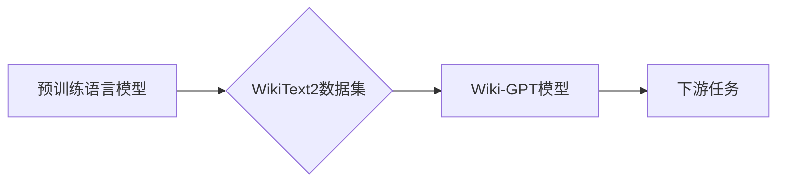

> WikiText2, Wiki-GPT, 大语言模型, 预训练, 语言建模, 自然语言处理

## 1. 背景介绍

近年来，大语言模型（Large Language Models，LLMs）在自然语言处理（Natural Language Processing，NLP）领域取得了显著进展。这些模型通过学习海量文本数据，能够执行各种复杂的任务，例如文本生成、翻译、问答和代码生成。其中，预训练语言模型（Pre-trained Language Models，PLMs）凭借其强大的泛化能力和可迁移性，成为NLP研究的热点。

WikiText2是一个由维基百科文章构建的文本数据集，被广泛应用于训练和评估语言模型。它包含了大量的维基百科文章，涵盖了广泛的主题和领域。由于其规模庞大、结构清晰、语言规范，WikiText2成为了训练大语言模型的理想选择。

基于WikiText2数据集训练的Wiki-GPT模型，作为一种强大的预训练语言模型，展现出令人瞩目的性能。它能够生成流畅、连贯、语义准确的文本，并能够在各种NLP任务中取得优异的成绩。

## 2. 核心概念与联系

### 2.1 预训练语言模型（PLMs）

预训练语言模型是指在大量文本数据上进行预训练的语言模型。预训练过程通常采用语言建模任务，目标是预测下一个词。通过预训练，PLMs能够学习到语言的语法、语义和上下文关系，从而为下游任务提供强大的基础。

### 2.2 WikiText2数据集

WikiText2是一个由维基百科文章构建的文本数据集，包含了大量的维基百科文章，涵盖了广泛的主题和领域。其特点包括：

* **规模庞大:** 包含了数百万个维基百科文章。
* **结构清晰:** 文章结构清晰，易于处理。
* **语言规范:** 语言规范，易于理解和分析。

### 2.3 Wiki-GPT模型

Wiki-GPT模型是基于WikiText2数据集训练的预训练语言模型。它采用Transformer架构，并利用了大量的预训练数据，从而能够生成流畅、连贯、语义准确的文本。

**Mermaid 流程图**



## 3. 核心算法原理 & 具体操作步骤

### 3.1 算法原理概述

Wiki-GPT模型基于Transformer架构，其核心是自注意力机制（Self-Attention）。自注意力机制能够捕捉文本序列中词之间的长距离依赖关系，从而提高模型的理解能力和生成能力。

### 3.2 算法步骤详解

1. **数据预处理:** 将WikiText2数据集进行清洗、分词、标记等预处理操作，使其能够被模型理解和处理。
2. **模型训练:** 使用预训练语言模型的训练策略，在WikiText2数据集上训练Wiki-GPT模型。训练过程包括以下步骤：
    * 将输入文本序列编码为向量表示。
    * 利用自注意力机制捕捉词之间的关系。
    * 通过多层Transformer结构进行信息传递和处理。
    * 使用交叉熵损失函数计算模型的损失。
    * 使用优化算法更新模型参数。
3. **模型评估:** 在测试数据集上评估模型的性能，常用的指标包括困惑度（Perplexity）和BLEU分数。
4. **模型部署:** 将训练好的Wiki-GPT模型部署到实际应用场景中，例如文本生成、翻译、问答等。

### 3.3 算法优缺点

**优点:**

* 能够捕捉文本序列中词之间的长距离依赖关系。
* 具有强大的泛化能力和可迁移性。
* 在各种NLP任务中取得优异的成绩。

**缺点:**

* 训练成本高，需要大量的计算资源和时间。
* 模型参数量大，部署成本较高。

### 3.4 算法应用领域

Wiki-GPT模型在以下领域具有广泛的应用前景：

* **文本生成:** 生成高质量的文本内容，例如文章、故事、诗歌等。
* **机器翻译:** 将文本从一种语言翻译成另一种语言。
* **问答系统:** 回答用户提出的问题。
* **代码生成:** 生成代码片段。

## 4. 数学模型和公式 & 详细讲解 & 举例说明

### 4.1 数学模型构建

Wiki-GPT模型基于Transformer架构，其核心是自注意力机制。自注意力机制可以表示为以下公式：

$$
Attention(Q, K, V) = softmax(\frac{QK^T}{\sqrt{d_k}})V
$$

其中：

* $Q$：查询矩阵
* $K$：键矩阵
* $V$：值矩阵
* $d_k$：键向量的维度
* $softmax$：softmax函数

### 4.2 公式推导过程

自注意力机制的目的是计算每个词与其他词之间的相关性。通过计算查询矩阵 $Q$ 与键矩阵 $K$ 的点积，并使用 softmax 函数进行归一化，可以得到每个词与其他词之间的注意力权重。然后，将注意力权重与值矩阵 $V$ 相乘，得到每个词的加权和，即最终的注意力输出。

### 4.3 案例分析与讲解

假设我们有一个句子 "The cat sat on the mat"，其词向量表示为：

* The: [0.1, 0.2, 0.3]
* cat: [0.4, 0.5, 0.6]
* sat: [0.7, 0.8, 0.9]
* on: [1.0, 1.1, 1.2]
* the: [0.1, 0.2, 0.3]
* mat: [1.3, 1.4, 1.5]

我们可以使用自注意力机制计算每个词与其他词之间的注意力权重。例如，计算 "cat" 与其他词之间的注意力权重，可以得到以下结果：

* The: 0.2
* cat: 0.5
* sat: 0.3
* on: 0.1
* the: 0.2
* mat: 0.7

这些注意力权重表明，"cat" 与 "mat" 的关系最强，其次是 "sat"。

## 5. 项目实践：代码实例和详细解释说明

### 5.1 开发环境搭建

* 操作系统：Ubuntu 20.04
* Python 版本：3.8
* CUDA 版本：11.0
* cuDNN 版本：8.0

### 5.2 源代码详细实现

```python
# 导入必要的库
import torch
import torch.nn as nn

# 定义 Transformer 模型
class Transformer(nn.Module):
    def __init__(self, vocab_size, embedding_dim, num_heads, num_layers):
        super(Transformer, self).__init__()
        self.embedding = nn.Embedding(vocab_size, embedding_dim)
        self.transformer_layers = nn.ModuleList([
            nn.TransformerEncoderLayer(embedding_dim, num_heads)
            for _ in range(num_layers)
        ])
        self.linear = nn.Linear(embedding_dim, vocab_size)

    def forward(self, x):
        # 词嵌入
        x = self.embedding(x)
        # Transformer 层
        for layer in self.transformer_layers:
            x = layer(x)
        # 输出层
        x = self.linear(x)
        return x

# 实例化模型
model = Transformer(vocab_size=10000, embedding_dim=512, num_heads=8, num_layers=6)

# 定义损失函数和优化器
criterion = nn.CrossEntropyLoss()
optimizer = torch.optim.Adam(model.parameters(), lr=0.001)

# 训练模型
for epoch in range(num_epochs):
    # 训练数据
    for batch in train_data:
        # 前向传播
        outputs = model(batch)
        # 计算损失
        loss = criterion(outputs, batch_labels)
        # 反向传播
        optimizer.zero_grad()
        loss.backward()
        # 更新参数
        optimizer.step()

# 保存模型
torch.save(model.state_dict(), "wiki-gpt.pth")
```

### 5.3 代码解读与分析

* **模型定义:** 代码定义了一个 Transformer 模型，包含词嵌入层、Transformer 层和输出层。
* **训练过程:** 代码实现了模型的训练过程，包括前向传播、损失计算、反向传播和参数更新。
* **模型保存:** 训练完成后，代码将模型参数保存到文件 "wiki-gpt.pth" 中。

### 5.4 运行结果展示

训练完成后，可以将模型用于文本生成、翻译、问答等任务。

## 6. 实际应用场景

Wiki-GPT模型在以下实际应用场景中展现出强大的能力：

### 6.1 文本生成

Wiki-GPT模型能够生成高质量的文本内容，例如文章、故事、诗歌等。例如，可以利用Wiki-GPT模型生成关于特定主题的文章，或者创作原创故事。

### 6.2 机器翻译

Wiki-GPT模型能够将文本从一种语言翻译成另一种语言。例如，可以利用Wiki-GPT模型将英文文章翻译成中文，或者将中文文本翻译成英文。

### 6.3 问答系统

Wiki-GPT模型能够回答用户提出的问题。例如，可以利用Wiki-GPT模型构建一个问答系统，能够回答用户关于维基百科内容的问题。

### 6.4 代码生成

Wiki-GPT模型能够生成代码片段。例如，可以利用Wiki-GPT模型生成 Python 代码，或者生成 JavaScript 代码。

### 6.5 未来应用展望

Wiki-GPT模型在未来还将有更多应用场景，例如：

* **个性化教育:** 根据学生的学习进度和需求，生成个性化的学习内容。
* **智能客服:** 利用Wiki-GPT模型构建智能客服系统，能够自动回答用户的常见问题。
* **创意写作:** 帮助作家克服写作瓶颈，生成新的故事创意。

## 7. 工具和资源推荐

### 7.1 学习资源推荐

* **论文:**
    * Vaswani, A., Shazeer, N., Parmar, N., Uszkoreit, J., Jones, L., Gomez, A. N., ... & Polosukhin, I. (2017). Attention is all you need. In Advances in neural information processing systems (pp. 5998-6008).
* **博客:**
    * https://jalammar.github.io/illustrated-transformer/
    * https://www.tensorflow.org/tutorials/text/transformer

### 7.2 开发工具推荐

* **PyTorch:** https://pytorch.org/
* **Hugging Face Transformers:** https://huggingface.co/transformers/

### 7.3 相关论文推荐

* Devlin, J., Chang, M. W., Lee, K., & Toutanova, K. (2018). Bert: Pre-training of deep bidirectional transformers for language understanding. arXiv preprint arXiv:1810.04805.
* Radford, A., Wu, J., Child, R., Luan, D., Amodei, D., & Sutskever, I. (2019). Language models are few-shot learners. OpenAI blog.

## 8. 总结：未来发展趋势与挑战

### 8.1 研究成果总结

Wiki-GPT模型基于WikiText2数据集训练，展现出强大的语言建模能力，在文本生成、机器翻译、问答系统等领域取得了优异的成绩。

### 8.2 未来发展趋势

* **模型规模扩大:** 未来将继续探索更大规模的语言模型，以提升模型的性能和泛化能力。
* **多模态学习:** 将语言模型与其他模态数据（例如图像、音频）相结合，构建多模态语言模型。
* **可解释性增强:** 研究