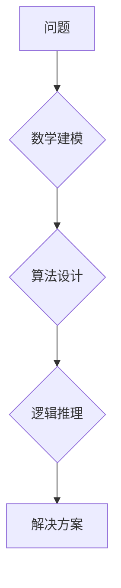

>  人工智能、一般化原则、数学建模、算法设计、逻辑推理、编程思维、抽象思维、代码优化

## 1. 背景介绍

在当今数据爆炸和人工智能飞速发展的时代，我们面临着越来越复杂的挑战。如何有效地处理海量数据，如何构建能够学习和适应环境的智能系统，这些问题迫切需要解决。而“像数学家一样思考”的思维方式，为我们提供了强大的工具和方法。

数学家以其对抽象概念的深刻理解和逻辑推理能力著称。他们能够将复杂问题抽象化，构建数学模型，并通过严谨的逻辑推导得出结论。这种思维方式，同样适用于人工智能领域。

## 2. 核心概念与联系

**2.1 一般化原则**

一般化原则的核心在于从特定案例中提取普遍规律，并将其应用于更广泛的场景。例如，我们学习了加法规则，就可以应用于任何两个数字的加法运算。

**2.2 数学建模**

数学建模是指用数学语言和符号来描述现实世界中的问题和现象。通过构建数学模型，我们可以将复杂问题简化，并用数学工具进行分析和解决。

**2.3 算法设计**

算法设计是指设计一种步骤明确、逻辑清晰的方案，用于解决特定问题。算法的设计需要遵循一定的原则，例如效率、正确性、可读性等。

**2.4 逻辑推理**

逻辑推理是根据已知事实和规则，推导出新的结论的过程。逻辑推理是数学和人工智能的核心组成部分，它帮助我们进行严谨的思考和决策。

**Mermaid 流程图**



## 3. 核心算法原理 & 具体操作步骤

**3.1 算法原理概述**

我们以深度学习算法为例，介绍其核心原理。深度学习算法是一种基于人工神经网络的机器学习算法。它通过多层神经网络，学习数据中的复杂特征，并进行预测或分类。

**3.2 算法步骤详解**

1. **数据预处理:** 将原始数据进行清洗、转换和特征工程，使其适合深度学习算法的训练。
2. **网络结构设计:** 根据具体任务，设计神经网络的层数、节点数和激活函数等参数。
3. **参数初始化:** 为神经网络中的参数赋予初始值。
4. **前向传播:** 将输入数据通过神经网络层层传递，最终得到输出结果。
5. **反向传播:** 计算输出结果与真实值的误差，并根据误差反向调整神经网络的参数。
6. **优化算法:** 使用优化算法，例如梯度下降，不断更新神经网络的参数，使其逼近最优解。
7. **模型评估:** 使用测试数据评估模型的性能，并根据评估结果进行模型调优。

**3.3 算法优缺点**

**优点:**

* 表现力强：能够学习数据中的复杂特征，解决复杂问题。
* 自动特征提取：无需人工特征工程，能够自动提取数据特征。
* 可扩展性强：可以根据数据规模和任务需求，灵活调整网络结构。

**缺点:**

* 训练时间长：训练深度学习模型需要大量的计算资源和时间。
* 数据依赖性强：深度学习算法对数据质量和数量有很高的要求。
* 可解释性差：深度学习模型的决策过程难以解释。

**3.4 算法应用领域**

深度学习算法广泛应用于图像识别、自然语言处理、语音识别、机器翻译等领域。

## 4. 数学模型和公式 & 详细讲解 & 举例说明

**4.1 数学模型构建**

深度学习算法的核心是人工神经网络模型。神经网络模型可以看作是一个由多个节点（神经元）组成的图结构。每个节点都连接着其他节点，并通过权重来控制信息传递。

**4.2 公式推导过程**

深度学习算法的训练过程本质上是一个优化问题。目标是找到最优的网络参数，使得模型的预测结果与真实值之间的误差最小化。常用的优化算法是梯度下降法。

梯度下降法的核心思想是沿着误差梯度的反方向更新网络参数。

**公式:**

$$
\theta = \theta - \alpha \nabla L(\theta)
$$

其中：

* $\theta$ 是网络参数
* $\alpha$ 是学习率
* $L(\theta)$ 是损失函数，表示模型预测结果与真实值之间的误差

**4.3 案例分析与讲解**

以图像分类为例，假设我们有一个包含猫和狗的图像数据集。

1. 我们使用深度学习算法训练一个神经网络模型，使其能够识别猫和狗。
2. 在训练过程中，模型会不断调整参数，使得其能够将猫和狗的图像区分开来。
3. 训练完成后，我们可以使用这个模型对新的图像进行分类。

## 5. 项目实践：代码实例和详细解释说明

**5.1 开发环境搭建**

我们使用Python语言和TensorFlow框架进行项目实践。

**5.2 源代码详细实现**

```python
import tensorflow as tf

# 定义神经网络模型
model = tf.keras.models.Sequential([
    tf.keras.layers.Conv2D(32, (3, 3), activation='relu', input_shape=(28, 28, 1)),
    tf.keras.layers.MaxPooling2D((2, 2)),
    tf.keras.layers.Conv2D(64, (3, 3), activation='relu'),
    tf.keras.layers.MaxPooling2D((2, 2)),
    tf.keras.layers.Flatten(),
    tf.keras.layers.Dense(10, activation='softmax')
])

# 编译模型
model.compile(optimizer='adam',
              loss='sparse_categorical_crossentropy',
              metrics=['accuracy'])

# 训练模型
model.fit(x_train, y_train, epochs=5)

# 评估模型
loss, accuracy = model.evaluate(x_test, y_test)
print('Test loss:', loss)
print('Test accuracy:', accuracy)
```

**5.3 代码解读与分析**

这段代码定义了一个简单的卷积神经网络模型，用于图像分类任务。

* `tf.keras.models.Sequential` 创建了一个顺序模型，即层级结构。
* `tf.keras.layers.Conv2D` 定义了一个卷积层，用于提取图像特征。
* `tf.keras.layers.MaxPooling2D` 定义了一个最大池化层，用于降维和提高模型鲁棒性。
* `tf.keras.layers.Flatten` 将多维特征转换为一维向量。
* `tf.keras.layers.Dense` 定义了一个全连接层，用于分类。
* `model.compile` 编译模型，指定优化器、损失函数和评价指标。
* `model.fit` 训练模型，使用训练数据进行训练。
* `model.evaluate` 评估模型，使用测试数据评估模型性能。

**5.4 运行结果展示**

训练完成后，我们可以使用测试数据评估模型的性能。

## 6. 实际应用场景

深度学习算法在各个领域都有广泛的应用，例如：

* **图像识别:** 人脸识别、物体检测、图像分类
* **自然语言处理:** 机器翻译、文本摘要、情感分析
* **语音识别:** 语音助手、语音搜索
* **推荐系统:** 商品推荐、内容推荐

**6.4 未来应用展望**

随着人工智能技术的不断发展，深度学习算法将在更多领域得到应用，例如：

* **医疗诊断:** 辅助医生进行疾病诊断和治疗
* **自动驾驶:** 构建自动驾驶汽车
* **个性化教育:** 提供个性化的学习方案

## 7. 工具和资源推荐

**7.1 学习资源推荐**

* **书籍:**
    * 深度学习
    * 构建深度学习模型
* **在线课程:**
    * Coursera 深度学习课程
    * Udacity 深度学习工程师 Nanodegree

**7.2 开发工具推荐**

* **TensorFlow:** 开源深度学习框架
* **PyTorch:** 开源深度学习框架
* **Keras:** 高级深度学习API

**7.3 相关论文推荐**

* **AlexNet:** ImageNet Classification with Deep Convolutional Neural Networks
* **VGGNet:** Very Deep Convolutional Networks for Large-Scale Image Recognition
* **ResNet:** Deep Residual Learning for Image Recognition

## 8. 总结：未来发展趋势与挑战

**8.1 研究成果总结**

近年来，深度学习算法取得了显著的成果，在图像识别、自然语言处理等领域取得了突破性进展。

**8.2 未来发展趋势**

* **模型更深更广:** 研究更深层次、更广阔结构的神经网络模型。
* **数据更丰富更有效:** 探索新的数据来源和数据增强技术，提高模型训练效率。
* **解释性更强:** 研究更具解释性的深度学习模型，提高模型可理解性。

**8.3 面临的挑战**

* **数据隐私和安全:** 深度学习算法对大量数据依赖，如何保护数据隐私和安全是一个重要挑战。
* **模型可解释性:** 深度学习模型的决策过程难以解释，如何提高模型可解释性是一个关键问题。
* **算法公平性:** 深度学习算法可能存在偏见，如何确保算法公平性是一个重要的研究方向。

**8.4 研究展望**

未来，深度学习算法将继续发展，并在更多领域发挥重要作用。我们需要不断探索新的算法、新的数据和新的应用场景，推动深度学习技术向更安全、更可靠、更可解释的方向发展。

## 9. 附录：常见问题与解答

**9.1 什么是深度学习？**

深度学习是一种机器学习算法，它使用多层神经网络来学习数据中的复杂特征。

**9.2 深度学习算法有哪些？**

常见的深度学习算法包括卷积神经网络（CNN）、循环神经网络（RNN）、生成对抗网络（GAN）等。

**9.3 如何训练深度学习模型？**

训练深度学习模型需要使用训练数据，并使用优化算法调整模型参数，使得模型的预测结果与真实值之间的误差最小化。


作者：禅与计算机程序设计艺术 / Zen and the Art of Computer Programming 
<end_of_turn>