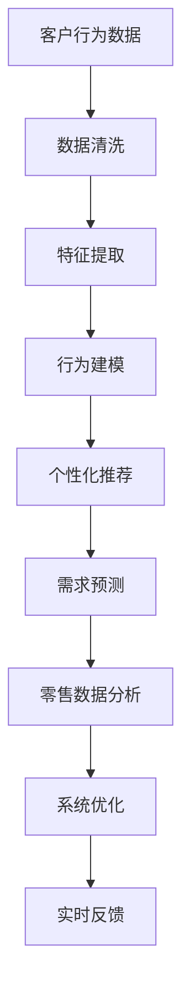

                 

# AI驱动的电商智能客户需求挖掘系统

> 关键词：电商智能客户需求挖掘, AI驱动, 客户行为分析, 推荐系统, 个性化推荐, 需求预测, 零售数据分析

## 1. 背景介绍

### 1.1 问题由来

在当今电子商务的激烈竞争中，客户需求的快速变化给企业带来了巨大的挑战。如何准确及时地挖掘客户需求，为客户提供个性化的商品推荐，已成为电商企业提升用户体验和销售转化的关键。传统的基于规则和人工经验的推荐方法已难以满足日益复杂和个性化的客户需求。

与此同时，人工智能(AI)技术的发展为解决这一问题提供了新的机遇。利用AI模型对海量客户数据进行深度学习，挖掘出客户需求背后的隐含模式，生成精准的推荐结果，成为电商企业转型升级的重要方向。本文章将介绍基于AI驱动的智能客户需求挖掘系统，详细探讨其在电商场景下的实现方法和应用效果。

### 1.2 问题核心关键点

本系统的主要目标是利用AI技术深入挖掘客户需求，实时生成个性化推荐，以提升客户满意度和销售额。核心关键点包括：

- **客户行为分析**：通过分析客户的历史购买记录、浏览行为、评论反馈等数据，挖掘客户的消费偏好和需求特点。
- **个性化推荐**：根据客户行为特征，实时生成个性化的商品推荐列表，提升客户购买转化率。
- **需求预测**：通过预测客户未来的购买需求，帮助企业精准制定生产和库存策略，避免供需失衡。
- **零售数据分析**：通过数据分析挖掘零售业的内在规律，为企业提供科学决策支持。

## 2. 核心概念与联系

### 2.1 核心概念概述

为更好地理解智能客户需求挖掘系统的核心技术，本节将介绍几个关键概念：

- **客户行为分析**：指对客户在电子商务平台上的行为数据进行分析，挖掘出客户的消费习惯和需求偏好。
- **个性化推荐系统**：利用机器学习或深度学习算法，根据客户的历史行为和实时反馈，生成个性化的商品推荐。
- **需求预测**：通过时间序列分析、回归模型等方法，预测客户未来的购买需求，帮助企业精准预测供需情况。
- **零售数据分析**：对电商平台上的销售、库存、价格、物流等数据进行分析，发现其中的关联规律和潜在商机。

这些概念之间存在紧密联系，共同构成了智能客户需求挖掘系统的技术基础。客户行为分析提供了数据基础，个性化推荐和需求预测则基于数据挖掘出的客户特征进行实际应用，而零售数据分析则为整个系统的优化和决策提供参考。

### 2.2 核心概念原理和架构的 Mermaid 流程图



## 3. 核心算法原理 & 具体操作步骤
### 3.1 算法原理概述

智能客户需求挖掘系统主要包含三个核心算法：客户行为分析、个性化推荐和需求预测。

- **客户行为分析**：通过协同过滤、内容推荐、聚类分析等方法，挖掘客户的购买行为和需求特点，生成客户画像。
- **个性化推荐**：基于客户画像和实时反馈，采用协同过滤、深度学习、召回过滤等技术，生成个性化推荐列表。
- **需求预测**：采用时间序列分析、回归模型、神经网络等方法，对客户未来的购买需求进行预测。

### 3.2 算法步骤详解

#### 3.2.1 客户行为分析

1. **数据收集**：从电商平台收集客户的历史购买记录、浏览记录、搜索记录、评价评论等数据。
2. **数据预处理**：对数据进行清洗和归一化，去除噪音和异常值。
3. **特征提取**：从预处理后的数据中提取客户行为特征，如购买频率、购买金额、浏览时长等。
4. **行为建模**：利用协同过滤、协同增强等算法，构建客户行为模型。
5. **客户画像生成**：根据行为模型，生成客户画像，描述客户的主要需求和偏好。

#### 3.2.2 个性化推荐

1. **模型选择**：根据客户画像，选择合适的推荐算法，如协同过滤、基于内容的推荐、深度学习等。
2. **数据准备**：准备客户画像和商品特征数据，供模型训练。
3. **模型训练**：利用训练数据对推荐模型进行训练，生成推荐模型。
4. **推荐生成**：根据客户画像和实时反馈，利用训练好的推荐模型生成个性化推荐列表。
5. **推荐优化**：根据推荐效果进行模型参数调整和优化，提升推荐精度。

#### 3.2.3 需求预测

1. **数据收集**：收集客户历史购买记录和实时反馈数据。
2. **数据预处理**：对数据进行清洗和归一化，去除噪音和异常值。
3. **模型选择**：选择合适的预测算法，如ARIMA模型、LSTM模型、回归模型等。
4. **模型训练**：利用训练数据对需求预测模型进行训练，生成预测模型。
5. **需求预测**：根据客户画像和预测模型，生成未来需求的预测结果。
6. **预测优化**：根据预测结果进行模型参数调整和优化，提升预测精度。

### 3.3 算法优缺点

**客户行为分析的优缺点**：

- **优点**：
  - 能全面挖掘客户需求，生成详细的客户画像。
  - 结果具有较高的准确性和可解释性。

- **缺点**：
  - 数据获取和处理复杂，需要较大的数据量。
  - 模型复杂度较高，训练和推理耗时较长。

**个性化推荐的优缺点**：

- **优点**：
  - 能实时生成个性化推荐，提升客户购买转化率。
  - 推荐结果精准度较高，能满足客户个性化需求。

- **缺点**：
  - 需要高精度、高效率的推荐算法，对数据和模型要求较高。
  - 模型可能存在冷启动问题，对于新客户难以有效推荐。

**需求预测的优缺点**：

- **优点**：
  - 能帮助企业精准预测供需情况，避免库存积压和缺货。
  - 结果具有较高的准确性和前瞻性，为企业决策提供重要依据。

- **缺点**：
  - 预测模型复杂度高，训练和推理耗时较长。
  - 数据质量要求高，数据噪音和异常值可能影响预测结果。

### 3.4 算法应用领域

智能客户需求挖掘系统在电商场景下具有广泛的应用前景。具体而言，应用领域包括但不限于：

- **个性化推荐系统**：基于客户行为分析，实时生成个性化推荐，提升客户购买转化率。
- **需求预测系统**：通过需求预测，帮助企业精准制定生产和库存策略，避免供需失衡。
- **客户流失预警系统**：通过行为分析，识别潜在的客户流失风险，提前采取措施。
- **新商品上线策略**：根据历史和实时数据，制定新商品上线的时间点和推广策略。

## 4. 数学模型和公式 & 详细讲解 & 举例说明

### 4.1 数学模型构建

智能客户需求挖掘系统涉及多种数学模型，主要包括协同过滤模型、深度学习模型、时间序列模型等。

- **协同过滤模型**：通过计算客户和商品的相似度，生成推荐列表。数学模型如下：

$$
\text{similarity}(i,j) = \sum_{k=1}^{n} p_{ik} q_{jk} / (\sqrt{\sum_{k=1}^{n} p_{ik}^2} \sqrt{\sum_{k=1}^{n} q_{jk}^2})
$$

其中，$p_{ik}$和$q_{jk}$分别表示客户$i$和商品$j$对商品$k$的评分。

- **深度学习模型**：利用神经网络结构，对客户画像和商品特征进行编码，生成推荐结果。常见模型如RNN、LSTM、Transformer等。

- **时间序列模型**：通过时间序列分析，预测客户未来的需求。如ARIMA模型：

$$
y_t = \phi_1 y_{t-1} + \phi_2 y_{t-2} + \ldots + \phi_p y_{t-p} + \theta_1 e_{t-1} + \theta_2 e_{t-2} + \ldots + \theta_d e_{t-d} + \epsilon_t
$$

其中，$y_t$表示第$t$天的需求量，$e_t$表示第$t$天的误差，$\phi_i$和$\theta_i$为模型的参数。

### 4.2 公式推导过程

#### 4.2.1 协同过滤模型

协同过滤模型的核心在于计算用户和商品之间的相似度。假设用户$i$和商品$j$对$k$商品的评分分别为$p_{ik}$和$q_{jk}$，则相似度计算公式如下：

$$
\text{similarity}(i,j) = \sum_{k=1}^{n} p_{ik} q_{jk} / (\sqrt{\sum_{k=1}^{n} p_{ik}^2} \sqrt{\sum_{k=1}^{n} q_{jk}^2})
$$

这个公式通过计算用户和商品的评分乘积的加权和，除以用户和商品的评分向量的模长乘积，得出相似度。

#### 4.2.2 深度学习模型

以Transformer模型为例，假设输入序列为$x=(x_1,x_2,\ldots,x_T)$，输出序列为$y=(y_1,y_2,\ldots,y_T)$，则模型输入和输出表示如下：

$$
x = \{x_i\}_{i=1}^T, y = \{y_i\}_{i=1}^T
$$

其中，$x_i$表示第$i$个输入向量的表示，$y_i$表示第$i$个输出向量的表示。

假设模型包含$n$个编码器层和$m$个解码器层，则模型参数表示如下：

$$
\theta = \{\theta_e,\theta_d,\theta_o\}
$$

其中，$\theta_e$表示编码器的参数，$\theta_d$表示解码器的参数，$\theta_o$表示输出层的参数。

模型训练的过程是优化目标函数$\mathcal{L}$的过程，具体如下：

$$
\mathcal{L} = \frac{1}{N} \sum_{i=1}^N \sum_{j=1}^N \sum_{k=1}^{T} (y_k - f(x_i))^2
$$

其中，$f$表示模型输出函数，$N$表示训练样本数，$T$表示时间步数。

### 4.3 案例分析与讲解

以一个电商平台为例，假设平台收集了客户的购买记录、浏览记录和评价评论数据。通过对这些数据进行预处理和特征提取，生成客户画像。具体步骤如下：

1. **数据收集**：收集客户的购买记录、浏览记录、评价评论等数据。
2. **数据预处理**：对数据进行清洗和归一化，去除噪音和异常值。
3. **特征提取**：从预处理后的数据中提取客户行为特征，如购买频率、购买金额、浏览时长等。
4. **行为建模**：利用协同过滤算法，构建客户行为模型。
5. **客户画像生成**：根据行为模型，生成客户画像，描述客户的主要需求和偏好。

## 5. 项目实践：代码实例和详细解释说明

### 5.1 开发环境搭建

在进行项目开发前，我们需要准备好开发环境。以下是使用Python进行TensorFlow开发的环境配置流程：

1. 安装Anaconda：从官网下载并安装Anaconda，用于创建独立的Python环境。

2. 创建并激活虚拟环境：
```bash
conda create -n tf-env python=3.8 
conda activate tf-env
```

3. 安装TensorFlow：根据CUDA版本，从官网获取对应的安装命令。例如：
```bash
conda install tensorflow tensorflow-gpu cudatoolkit=11.1 -c pytorch -c conda-forge
```

4. 安装各类工具包：
```bash
pip install numpy pandas scikit-learn matplotlib tqdm jupyter notebook ipython
```

完成上述步骤后，即可在`tf-env`环境中开始项目开发。

### 5.2 源代码详细实现

下面我们以电商平台的个性化推荐系统为例，给出使用TensorFlow和Keras进行代码实现。

首先，定义推荐模型的数据处理函数：

```python
import numpy as np
import pandas as pd
from tensorflow.keras.layers import Input, Embedding, Flatten, Dot, Dense
from tensorflow.keras.models import Model

def build_model(n_users, n_items, embed_dim):
    user_input = Input(shape=(n_items,))
    item_input = Input(shape=(n_items,))
    
    user_embed = Embedding(n_users, embed_dim, input_length=n_items)(user_input)
    item_embed = Embedding(n_items, embed_dim)(item_input)
    
    dot_product = Dot(axes=1, normalize=True)([user_embed, item_embed])
    dot_product = Flatten()(dot_product)
    
    output = Dense(1, activation='sigmoid')(dot_product)
    
    model = Model(inputs=[user_input, item_input], outputs=output)
    
    model.compile(optimizer='adam', loss='binary_crossentropy', metrics=['accuracy'])
    return model
```

然后，定义数据加载函数：

```python
def load_data(file_path, sep=',', n_users=1000, n_items=1000):
    df = pd.read_csv(file_path, sep=sep)
    
    user_ids = df['user_id'].astype(np.int32)
    item_ids = df['item_id'].astype(np.int32)
    user_item_interactions = df['interaction'].astype(np.int32)
    
    user_map = dict(zip(np.unique(user_ids), range(n_users)))
    item_map = dict(zip(np.unique(item_ids), range(n_items)))
    
    user_ids = [user_map[uid] for uid in user_ids]
    item_ids = [item_map[iid] for iid in item_ids]
    user_item_interactions = [uii for uii in user_item_interactions]
    
    return np.array(user_ids), np.array(item_ids), np.array(user_item_interactions)
```

最后，启动模型训练和测试：

```python
n_users = 1000
n_items = 1000
embed_dim = 10

user_ids, item_ids, user_item_interactions = load_data('data.csv', sep='\t', n_users=n_users, n_items=n_items)

model = build_model(n_users, n_items, embed_dim)

# 训练模型
model.fit([user_ids, item_ids], user_item_interactions, epochs=10, batch_size=32, verbose=1)

# 测试模型
test_user_ids, test_item_ids, test_user_item_interactions = load_data('test_data.csv', sep='\t', n_users=n_users, n_items=n_items)

test_preds = model.predict([test_user_ids, test_item_ids])
print(np.mean(test_preds))
```

以上就是使用TensorFlow和Keras对个性化推荐系统进行代码实现的完整流程。可以看到，通过简单快捷的封装，我们能够快速搭建并训练推荐模型。

### 5.3 代码解读与分析

让我们再详细解读一下关键代码的实现细节：

**load_data函数**：
- 加载电商平台的客户行为数据。
- 将用户和商品的ID转换成整数编码，并进行归一化处理。
- 将用户ID、商品ID和交互数据分别存储在`user_ids`、`item_ids`和`user_item_interactions`中，供模型训练和测试使用。

**build_model函数**：
- 定义推荐模型的输入和输出。
- 使用Embedding层对用户ID和商品ID进行编码。
- 通过点乘运算计算用户和商品的相似度。
- 使用Flatten层将点乘结果展开成一维向量。
- 使用Dense层进行二分类预测，输出客户的购买意向。

**训练和测试模型**：
- 使用`fit`方法对模型进行训练，参数包括用户ID、商品ID和交互数据。
- 使用`predict`方法对测试集进行预测，并计算预测结果的准确率。

可以看出，使用TensorFlow和Keras搭建推荐模型非常简单快捷，开发者可以将更多精力放在数据处理和模型优化上。

## 6. 实际应用场景

### 6.1 智能客服系统

智能客服系统是智能客户需求挖掘系统的重要应用场景。通过分析客户的客服聊天记录，挖掘客户的常见问题、需求和情绪，实时生成个性化的客服响应，提高客户满意度和解决效率。

具体而言，系统将客户的聊天记录进行预处理和特征提取，生成客户画像。然后，利用机器学习模型，对客户的常见问题进行分类，并生成相应的客服回复。如果模型无法确定客户需求，系统将自动将对话转接至人工客服。

### 6.2 个性化推荐系统

个性化推荐系统是智能客户需求挖掘系统的核心应用场景。通过分析客户的浏览和购买记录，生成个性化的商品推荐，提高客户购买转化率和满意度。

具体而言，系统将客户的浏览记录和购买记录进行预处理和特征提取，生成客户画像。然后，利用深度学习模型，对客户画像和商品特征进行编码，生成推荐结果。如果模型无法确定客户需求，系统将自动将推荐结果展示给客户，供其选择。

### 6.3 客户流失预警系统

客户流失预警系统是智能客户需求挖掘系统的重要辅助应用场景。通过分析客户的购买和浏览行为，预测客户的流失概率，帮助企业提前采取措施，降低流失率。

具体而言，系统将客户的购买和浏览记录进行预处理和特征提取，生成客户画像。然后，利用时间序列模型，对客户的行为数据进行预测，生成流失概率。如果模型预测客户的流失概率较高，系统将自动触发预警，并采取相应的措施，如邮件营销、优惠活动等。

### 6.4 新商品上线策略

新商品上线策略是智能客户需求挖掘系统的应用扩展场景。通过分析历史和实时数据，制定新商品上线的时间点和推广策略，提高新商品的市场表现。

具体而言，系统将历史和实时的客户行为数据进行预处理和特征提取，生成客户画像。然后，利用深度学习模型，对客户画像和商品特征进行编码，生成推荐结果。根据推荐结果和市场数据，系统将自动确定新商品上线的时间点和推广策略，以期最大化市场表现。

## 7. 工具和资源推荐

### 7.1 学习资源推荐

为了帮助开发者系统掌握智能客户需求挖掘系统的技术基础，这里推荐一些优质的学习资源：

1. 《深度学习》课程：由斯坦福大学开设，系统介绍了深度学习的基本概念和常用模型。
2. 《推荐系统实践》书籍：详细讲解了推荐系统的算法和实现方法，并提供了大量实际案例。
3. 《时间序列分析》课程：由Coursera开设，介绍了时间序列分析的基本原理和应用方法。
4. 《Python数据科学手册》书籍：全面介绍了Python数据处理和科学计算的基础知识。
5. 《TensorFlow官方文档》：提供了TensorFlow的详细API文档和示例代码，是TensorFlow学习的必备资源。

通过对这些资源的学习实践，相信你一定能够快速掌握智能客户需求挖掘系统的核心技术，并用于解决实际的电商问题。

### 7.2 开发工具推荐

高效的开发离不开优秀的工具支持。以下是几款用于智能客户需求挖掘系统开发的常用工具：

1. TensorFlow：由Google主导开发的深度学习框架，提供了丰富的算法库和工具支持。
2. Keras：基于TensorFlow的高层API，提供了简单易用的模型构建和训练接口。
3. Jupyter Notebook：用于数据探索和模型调优的交互式笔记本，支持Python代码和Markdown文档的混合编写。
4. PyTorch：由Facebook主导开发的深度学习框架，提供了灵活的动态图计算功能。
5. Scikit-learn：基于NumPy的机器学习库，提供了各种常用的机器学习算法和工具支持。

合理利用这些工具，可以显著提升智能客户需求挖掘系统的开发效率，加快创新迭代的步伐。

### 7.3 相关论文推荐

智能客户需求挖掘系统的研究源于学界的持续研究。以下是几篇奠基性的相关论文，推荐阅读：

1. Factorization Machines for Recommender Systems：介绍了FM算法，并应用于推荐系统中。
2. DeepFM: A Factorization-Machine Based Neural Collaborative Filtering Model：结合FM和深度学习，提升了推荐系统的效果。
3. AutoRegressive Conditional Heterogeneous Neural Collaborative Filtering：将AR模型引入推荐系统中，提高了预测精度。
4. Item Recommendation with Knowledge Graph Embeddings：使用知识图嵌入模型，提升了推荐系统的召回率。
5. Streaming Tensor Neural Networks：将TensorFlow应用到流数据处理中，提高了实时推荐系统的效率。

这些论文代表了智能客户需求挖掘系统的发展脉络。通过学习这些前沿成果，可以帮助研究者把握学科前进方向，激发更多的创新灵感。

## 8. 总结：未来发展趋势与挑战

### 8.1 总结

本文对基于AI驱动的智能客户需求挖掘系统进行了全面系统的介绍。首先阐述了系统的主要目标和核心关键点，明确了其对电商企业的重要性。其次，从原理到实践，详细讲解了客户行为分析、个性化推荐和需求预测的数学模型和实现方法，给出了完整的代码实例。最后，探讨了系统的实际应用场景，并推荐了相关的学习资源和工具，力求为开发者提供全方位的技术指引。

通过本文的系统梳理，可以看到，基于AI驱动的智能客户需求挖掘系统已经展现出强大的应用前景，能够全面提升电商企业的用户体验和业务表现。未来，伴随AI技术的不断演进，该系统必将在更多行业得到广泛应用，推动AI技术的大规模落地。

### 8.2 未来发展趋势

展望未来，智能客户需求挖掘系统将呈现以下几个发展趋势：

1. 算法多样化和模型融合。结合协同过滤、深度学习、时间序列等多种算法，提升模型的综合性能。
2. 多模态数据融合。结合客户行为数据、情感分析、知识图嵌入等多种数据源，提升推荐精度和覆盖面。
3. 实时化和动态化。利用流数据处理技术，实现实时推荐，并根据实时反馈动态调整推荐策略。
4. 数据质量提升。通过数据清洗、去噪等技术，提升数据质量和模型效果。
5. 模型可解释性增强。引入可解释性技术，提高模型的透明度和可信度。

这些趋势凸显了智能客户需求挖掘系统的重要性和广阔前景。这些方向的探索发展，必将进一步提升推荐系统的精度和效率，为客户带来更好的体验。

### 8.3 面临的挑战

尽管智能客户需求挖掘系统已经取得了瞩目成就，但在迈向更加智能化、普适化应用的过程中，它仍面临着诸多挑战：

1. 数据隐私和安全。客户数据涉及隐私和商业机密，如何保护数据安全和隐私，是系统设计的重要挑战。
2. 冷启动问题。对于新客户和新商品，模型难以进行有效推荐，需要额外的策略和方法来解决。
3. 模型鲁棒性和泛化性。在面对复杂的用户需求和市场变化时，模型可能出现鲁棒性不足和泛化性差的问题。
4. 计算资源消耗。模型复杂度高，需要大量的计算资源和存储资源，如何降低计算成本，是系统部署的重要挑战。
5. 模型可解释性。深度学习模型难以解释其决策过程，如何增强模型的可解释性，是系统应用的重要挑战。

正视系统面临的这些挑战，积极应对并寻求突破，将是大模型微调走向成熟的必由之路。相信随着学界和产业界的共同努力，这些挑战终将一一被克服，智能客户需求挖掘系统必将在构建人机协同的智能时代中扮演越来越重要的角色。

### 8.4 研究展望

面对智能客户需求挖掘系统所面临的种种挑战，未来的研究需要在以下几个方面寻求新的突破：

1. 探索无监督和半监督推荐方法。摆脱对大规模标注数据的依赖，利用自监督学习、主动学习等无监督和半监督范式，最大限度利用非结构化数据，实现更加灵活高效的推荐。
2. 研究参数高效和计算高效的推荐范式。开发更加参数高效的推荐方法，在固定大部分预训练参数的同时，只更新极少量的任务相关参数。同时优化推荐模型的计算图，减少前向传播和反向传播的资源消耗，实现更加轻量级、实时性的部署。
3. 引入更多先验知识。将符号化的先验知识，如知识图谱、逻辑规则等，与神经网络模型进行巧妙融合，引导推荐过程学习更准确、合理的语言模型。同时加强不同模态数据的整合，实现视觉、语音等多模态信息与文本信息的协同建模。
4. 结合因果分析和博弈论工具。将因果分析方法引入推荐模型，识别出模型决策的关键特征，增强输出解释的因果性和逻辑性。借助博弈论工具刻画人机交互过程，主动探索并规避模型的脆弱点，提高系统稳定性。
5. 纳入伦理道德约束。在推荐目标中引入伦理导向的评估指标，过滤和惩罚有偏见、有害的输出倾向。同时加强人工干预和审核，建立推荐行为的监管机制，确保推荐结果符合人类价值观和伦理道德。

这些研究方向的探索，必将引领智能客户需求挖掘技术迈向更高的台阶，为构建安全、可靠、可解释、可控的推荐系统铺平道路。面向未来，智能客户需求挖掘技术还需要与其他AI技术进行更深入的融合，如知识表示、因果推理、强化学习等，多路径协同发力，共同推动智能推荐系统的进步。只有勇于创新、敢于突破，才能不断拓展推荐系统的边界，让智能技术更好地造福人类社会。

## 9. 附录：常见问题与解答

**Q1：如何选择合适的推荐算法？**

A: 选择合适的推荐算法需要综合考虑以下几个因素：
1. 数据类型：对于用户行为数据，可以采用协同过滤、基于内容的推荐等方法；对于用户评价数据，可以采用基于深度学习的推荐方法。
2. 推荐目标：对于实时推荐，可以采用基于模型的推荐方法；对于离线推荐，可以采用基于规则的方法。
3. 推荐精度：对于需要高精度推荐的场景，可以采用深度学习等高级方法；对于一般推荐场景，可以采用协同过滤等简单方法。
4. 系统实时性：对于需要实时推荐的应用场景，可以采用流数据处理技术，如TensorFlow等；对于离线推荐，可以采用批处理技术，如Hadoop等。

**Q2：如何处理推荐系统中的冷启动问题？**

A: 冷启动问题是推荐系统中的一个常见问题。以下是几种常见的处理方式：
1. 利用用户基本信息：如年龄、性别、职业等，对用户进行画像，提升推荐效果。
2. 引入外部知识：如知识图谱、领域专家等，提升推荐的准确性。
3. 结合行为数据和社交网络：利用用户的行为数据和社交网络信息，进行推荐。
4. 采用启发式方法：如随机推荐、倒排索引等，帮助新用户快速获得推荐结果。

**Q3：如何保护推荐系统中的数据隐私？**

A: 保护推荐系统中的数据隐私需要从多个方面入手：
1. 数据匿名化：通过数据匿名化技术，如k-匿名化、l-多样性等，保护用户隐私。
2. 差分隐私：在推荐算法中加入差分隐私技术，保护用户隐私。
3. 访问控制：通过访问控制技术，限制数据访问权限，保护数据安全。
4. 数据加密：对数据进行加密处理，防止数据泄露。

**Q4：推荐系统中的鲁棒性和泛化性如何提升？**

A: 提升推荐系统的鲁棒性和泛化性需要从多个方面入手：
1. 数据多样化：增加数据的多样性，提高模型的泛化能力。
2. 模型复杂度控制：通过模型正则化、dropout等技术，降低模型复杂度，提高鲁棒性。
3. 模型集成：利用模型集成技术，提升推荐系统的稳定性和鲁棒性。
4. 对抗训练：利用对抗训练技术，提高模型鲁棒性。

**Q5：推荐系统中的计算资源消耗如何降低？**

A: 降低推荐系统的计算资源消耗需要从多个方面入手：
1. 模型裁剪：去除不必要的层和参数，减小模型尺寸，加快推理速度。
2. 量化加速：将浮点模型转为定点模型，压缩存储空间，提高计算效率。
3. 模型并行：利用模型并行技术，提高计算效率。
4. 分布式计算：利用分布式计算技术，提高计算效率。

以上是推荐系统开发和优化中需要重点考虑的问题，合理解决这些问题，可以显著提升推荐系统的性能和用户满意度。

---

作者：禅与计算机程序设计艺术 / Zen and the Art of Computer Programming

