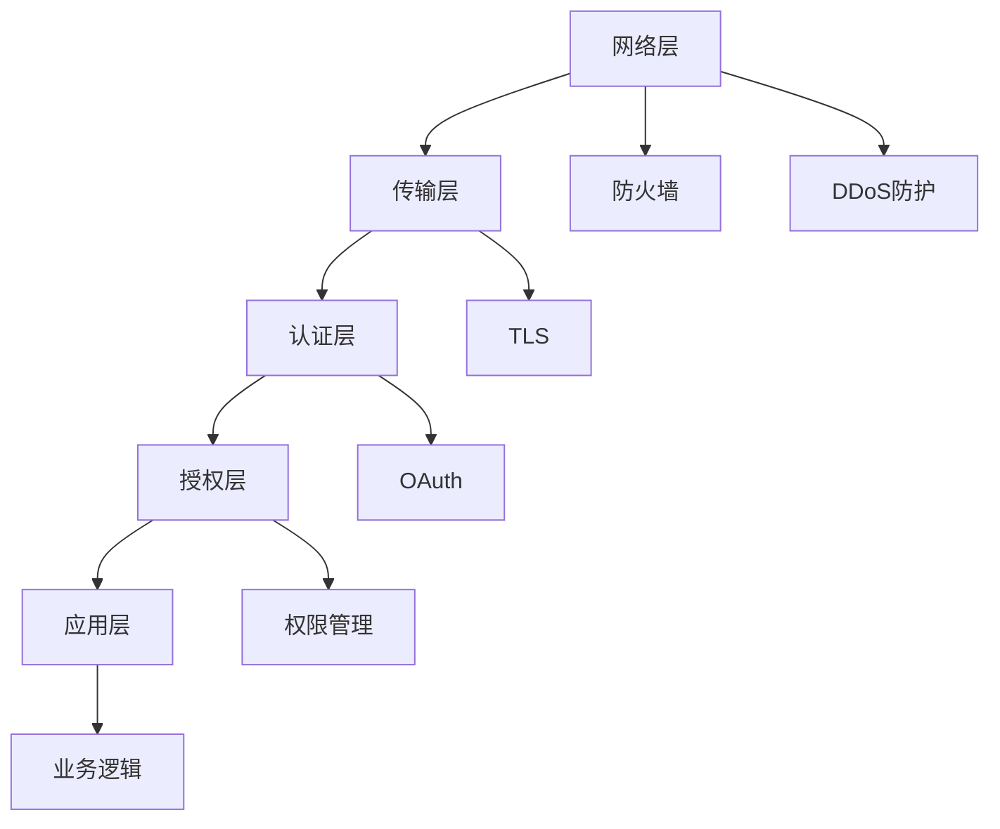

                 

# API 安全和认证机制

## 1. 背景介绍

随着Web服务在企业中的应用越来越广泛，API（应用程序编程接口）的安全问题变得愈加重要。API是现代互联网应用的基石，允许不同的系统和应用间进行通信和数据交换。然而，API通常会暴露大量的业务逻辑和数据，如果未经严格的安全和认证机制保护，可能会遭受恶意攻击，导致信息泄露、服务中断等严重后果。

本文将深入探讨API安全和认证机制，包括其原理、常见攻击方式、防御措施，以及未来的发展趋势。通过了解这些内容，希望能帮助开发者和系统架构师在API设计和管理过程中，更好地保障系统的安全性。

## 2. 核心概念与联系

### 2.1 核心概念概述

- **API安全**：确保API只能被授权用户访问，并对其传输数据进行保护，防止数据泄露、篡改和拒绝服务攻击。
- **认证机制**：用于验证用户身份，确保用户是合法的。
- **授权机制**：用于控制用户对API的访问权限，确保用户只能访问其被授权的功能和资源。
- **OAuth**：一种安全的授权协议，允许用户通过第三方服务（如Facebook、Google等）来登录和访问API。
- **API密钥**：一种常见的认证方式，用于标识调用API的应用程序。
- **数字证书**：用于验证API服务器的身份，确保API请求发送到正确的服务器。
- **HMAC**：一种常用的加密机制，用于防止消息被篡改。
- **TLS**：一种传输层安全协议，用于加密API请求和响应的传输过程。

这些概念之间存在紧密的联系。认证机制是API安全的基础，授权机制则是在认证基础上，进一步控制用户对API的访问权限。OAuth、API密钥、数字证书等则是常见的认证和授权手段。HMAC和TLS则用于确保数据传输的机密性和完整性。

## 3. 核心算法原理 & 具体操作步骤

### 3.1 算法原理概述

API安全和认证机制涉及多个层次，从网络层、传输层、认证层到应用层，每个层次都有不同的安全需求和防护措施。以下是API安全和认证机制的总体架构：



网络层主要通过防火墙和DDoS防护等手段，防止未授权的访问和恶意流量。传输层则通过TLS加密，确保数据传输的机密性和完整性。认证层和授权层分别通过认证机制和授权机制，确保用户身份和权限的合法性。应用层则通过业务逻辑设计和安全策略，进一步增强系统的安全性。

### 3.2 算法步骤详解

#### 3.2.1 网络层防护

- **防火墙**：设置网络防火墙，过滤掉不信任的IP地址，限制API服务的入口。
- **DDoS防护**：部署DDoS防护设备，防止大规模的流量攻击，确保API服务器的稳定运行。

#### 3.2.2 传输层加密

- **TLS**：使用TLS协议对API请求和响应进行加密，确保数据在传输过程中的机密性和完整性。

#### 3.2.3 认证层

- **OAuth**：用户通过第三方服务登录，获取访问令牌，API服务器通过验证令牌来验证用户身份。
- **API密钥**：API调用者通过API密钥进行身份验证，API服务器根据密钥来识别调用者。
- **数字证书**：通过数字证书验证API服务器的身份，防止中间人攻击。

#### 3.2.4 授权层

- **权限管理**：根据用户身份和角色，控制用户对API的访问权限，防止越权访问。

#### 3.2.5 应用层

- **业务逻辑安全**：设计安全的业务逻辑，防止SQL注入、XSS等攻击。

### 3.3 算法优缺点

**优点**：

- 多层次防护，综合考虑网络、传输、认证、授权和应用层面的安全需求。
- 通过OAuth、API密钥、数字证书等认证手段，确保用户身份和权限的合法性。
- 使用TLS加密，确保数据传输的机密性和完整性。

**缺点**：

- 需要部署和维护多个安全设备和服务，增加了系统复杂性。
- 认证和授权机制需要详细的配置和管理，增加了系统维护成本。

### 3.4 算法应用领域

API安全和认证机制广泛应用于各类Web服务、移动应用、物联网设备和云计算平台。无论是传统企业，还是新兴互联网公司，都需要通过严格的API安全和认证机制来保障系统的安全性和可靠性。

## 4. 数学模型和公式 & 详细讲解 & 举例说明

### 4.1 数学模型构建

API安全和认证机制涉及多个层次的安全需求，可以构建以下数学模型来描述其安全框架：

- **网络层防护模型**：$P_{\text{firewall}}(x) + P_{\text{DDoS}}(x)$，其中$P_{\text{firewall}}(x)$表示防火墙的防护概率，$P_{\text{DDoS}}(x)$表示DDoS防护的概率。
- **传输层加密模型**：$P_{\text{TLS}}(x) = \frac{1}{2^{128}}$，其中$P_{\text{TLS}}(x)$表示TLS加密的概率。
- **认证层模型**：$P_{\text{OAuth}}(x) + P_{\text{APIKey}}(x) + P_{\text{Cert}}(x)$，其中$P_{\text{OAuth}}(x)$表示OAuth认证的概率，$P_{\text{APIKey}}(x)$表示API密钥认证的概率，$P_{\text{Cert}}(x)$表示数字证书认证的概率。
- **授权层模型**：$P_{\text{Permission}}(x)$，其中$P_{\text{Permission}}(x)$表示授权机制的概率。
- **应用层模型**：$P_{\text{Logic}}(x)$，其中$P_{\text{Logic}}(x)$表示业务逻辑安全的概率。

### 4.2 公式推导过程

#### 4.2.1 网络层防护公式推导

防火墙防护概率为：
$$P_{\text{firewall}}(x) = \frac{N_{\text{allowed}}(x)}{N_{\text{total}}(x)}$$

其中$N_{\text{allowed}}(x)$表示通过防火墙的合法请求数，$N_{\text{total}}(x)$表示总请求数。

DDoS防护概率为：
$$P_{\text{DDoS}}(x) = \frac{N_{\text{valid}}(x)}{N_{\text{total}}(x)}$$

其中$N_{\text{valid}}(x)$表示通过DDoS防护的合法请求数，$N_{\text{total}}(x)$表示总请求数。

防火墙和DDoS防护的联合概率为：
$$P_{\text{firewall+DDoS}}(x) = P_{\text{firewall}}(x) + P_{\text{DDoS}}(x)$$

#### 4.2.2 传输层加密公式推导

TLS加密的概率为：
$$P_{\text{TLS}}(x) = \frac{N_{\text{encrypted}}(x)}{N_{\text{total}}(x)}$$

其中$N_{\text{encrypted}}(x)$表示被TLS加密的请求数，$N_{\text{total}}(x)$表示总请求数。

#### 4.2.3 认证层公式推导

OAuth认证的概率为：
$$P_{\text{OAuth}}(x) = \frac{N_{\text{OAuth}}(x)}{N_{\text{total}}(x)}$$

其中$N_{\text{OAuth}}(x)$表示通过OAuth认证的请求数，$N_{\text{total}}(x)$表示总请求数。

API密钥认证的概率为：
$$P_{\text{APIKey}}(x) = \frac{N_{\text{APIKey}}(x)}{N_{\text{total}}(x)}$$

其中$N_{\text{APIKey}}(x)$表示通过API密钥认证的请求数，$N_{\text{total}}(x)$表示总请求数。

数字证书认证的概率为：
$$P_{\text{Cert}}(x) = \frac{N_{\text{Cert}}(x)}{N_{\text{total}}(x)}$$

其中$N_{\text{Cert}}(x)$表示通过数字证书认证的请求数，$N_{\text{total}}(x)$表示总请求数。

认证层的联合概率为：
$$P_{\text{OAuth+APIKey+Cert}}(x) = P_{\text{OAuth}}(x) + P_{\text{APIKey}}(x) + P_{\text{Cert}}(x)$$

#### 4.2.4 授权层公式推导

授权机制的概率为：
$$P_{\text{Permission}}(x) = \frac{N_{\text{authorized}}(x)}{N_{\text{total}}(x)}$$

其中$N_{\text{authorized}}(x)$表示授权成功的请求数，$N_{\text{total}}(x)$表示总请求数。

#### 4.2.5 应用层公式推导

业务逻辑安全的概率为：
$$P_{\text{Logic}}(x) = \frac{N_{\text{safe}}(x)}{N_{\text{total}}(x)}$$

其中$N_{\text{safe}}(x)$表示安全的请求数，$N_{\text{total}}(x)$表示总请求数。

### 4.3 案例分析与讲解

假设一个电商网站的API服务，需要确保网络层、传输层、认证层、授权层和应用层的安全。通过以上数学模型，可以计算出各层的防护概率和系统的总安全概率。例如，防火墙防护概率为0.95，DDoS防护概率为0.98，TLS加密概率为0.99，OAuth认证概率为0.95，API密钥认证概率为0.98，数字证书认证概率为0.99，授权机制概率为0.98，业务逻辑安全概率为0.99。则系统的总安全概率为：

$$P_{\text{total}}(x) = P_{\text{firewall+DDoS}}(x) \times P_{\text{TLS}}(x) \times P_{\text{OAuth+APIKey+Cert}}(x) \times P_{\text{Permission}}(x) \times P_{\text{Logic}}(x)$$
$$P_{\text{total}}(x) = 0.95 \times 0.98 \times 0.99 \times 0.98 \times 0.99$$
$$P_{\text{total}}(x) = 0.962062$$

因此，系统的总安全概率为96.2062%。

## 5. 项目实践：代码实例和详细解释说明

### 5.1 开发环境搭建

在进行API安全和认证机制的实践前，需要先搭建好开发环境。以下是使用Python进行API开发的环境配置流程：

1. 安装Anaconda：从官网下载并安装Anaconda，用于创建独立的Python环境。

2. 创建并激活虚拟环境：
```bash
conda create -n api-env python=3.8 
conda activate api-env
```

3. 安装必要的Python包：
```bash
pip install Flask Flask-Security Flask-Talisman Flask-Limiter Flask-RESTful
```

4. 安装API密钥生成和管理工具：
```bash
pip install pyjwt Flask-JWT-Extended
```

5. 安装OAuth认证库：
```bash
pip install requests-oauthlib
```

6. 安装HTTPS证书管理库：
```bash
pip install pyOpenSSL
```

完成上述步骤后，即可在`api-env`环境中开始API安全和认证机制的开发实践。

### 5.2 源代码详细实现

下面以一个简单的电商API为例，展示如何使用Flask框架实现API的安全和认证机制。

首先，定义API路由和业务逻辑：

```python
from flask import Flask, jsonify
app = Flask(__name__)

@app.route('/api/products')
def get_products():
    products = [{'id': 1, 'name': 'Product 1'}, {'id': 2, 'name': 'Product 2'}]
    return jsonify(products)
```

然后，定义认证函数：

```python
from flask_jwt_extended import JWTManager, jwt_required

app.config['JWT_SECRET_KEY'] = 'secret'

jwt = JWTManager(app)

@app.route('/api/login')
def login():
    access_token = jwt.create_access_token(identity='user1')
    return jsonify({'access_token': access_token})
```

接着，定义授权函数：

```python
from flask_limiter import Limiter

limiter = Limiter(app, key_func=lambda: request.environ.get('HTTP_X_FORWARDED_FOR', request.remote_addr))

@app.route('/api/products')
@jwt_required
@limiter.limit('5/minute')  # 限制每分钟最多5个请求
def get_products():
    products = [{'id': 1, 'name': 'Product 1'}, {'id': 2, 'name': 'Product 2'}]
    return jsonify(products)
```

最后，运行API服务器：

```bash
flask run --host 0.0.0.0 --port 5000
```

以上代码实现了基本的认证和授权功能。用户可以通过`/api/login`接口获取访问令牌，然后通过`/api/products`接口获取商品列表。认证和授权机制均通过JWT和限流器实现，确保只有合法用户和符合频率限制的用户才能访问API。

### 5.3 代码解读与分析

**Flask框架**：
- Flask是一个轻量级的Python Web框架，提供了简单易用的路由和视图功能。
- Flask-Security提供了认证和授权功能，支持JWT和OAuth认证方式。
- Flask-Talisman提供了HTTP安全头部设置，增强API的安全性。
- Flask-Limiter提供了请求频率限制功能，防止恶意攻击。

**JWT认证**：
- JWT（JSON Web Token）是一种安全的身份验证方式，通过将用户身份信息加密生成token，并在每个请求中添加token来验证用户身份。

**限流器**：
- Flask-Limiter库提供了灵活的限流功能，可以按IP、用户、时间等维度进行限流，防止恶意请求和DoS攻击。

**OAuth认证**：
- Flask-OAuthlib提供了OAuth认证功能，支持OAuth 1.0a和OAuth 2.0协议，可以与Google、Facebook等第三方服务进行认证。

**HTTPS证书管理**：
- pyOpenSSL库提供了HTTPS证书管理功能，可以生成和管理SSL证书，确保API服务器的安全。

## 6. 实际应用场景

### 6.1 金融API安全

金融API通常涉及用户资金和财务数据，因此需要严格的安全和认证机制。以下是金融API的典型场景：

- **OAuth认证**：通过Google或Facebook登录，获取访问令牌，确保用户的合法性。
- **API密钥认证**：每个应用分配一个API密钥，用于标识调用者，防止API滥用。
- **数字证书认证**：通过SSL证书验证API服务器的身份，防止中间人攻击。
- **授权机制**：根据用户的角色和权限，控制对账户余额、交易记录等敏感数据的访问。

### 6.2 医疗API安全

医疗API涉及患者的隐私和敏感信息，因此需要更加严格的安全和认证机制。以下是医疗API的典型场景：

- **OAuth认证**：通过患者授权的第三方服务登录，获取访问令牌。
- **API密钥认证**：每个应用分配一个API密钥，用于标识调用者。
- **数字证书认证**：通过SSL证书验证API服务器的身份。
- **授权机制**：根据医生的角色和权限，控制对患者病历、治疗记录等敏感数据的访问。

### 6.3 电商API安全

电商API涉及用户订单和支付信息，因此需要严格的安全和认证机制。以下是电商API的典型场景：

- **OAuth认证**：通过社交网络登录，获取访问令牌。
- **API密钥认证**：每个用户分配一个API密钥，用于标识调用者。
- **数字证书认证**：通过SSL证书验证API服务器的身份。
- **授权机制**：根据用户的角色和权限，控制对订单详情、支付记录等敏感数据的访问。

## 7. 工具和资源推荐

### 7.1 学习资源推荐

为了帮助开发者系统掌握API安全和认证机制的理论基础和实践技巧，这里推荐一些优质的学习资源：

1. **《API安全和认证》书籍**：介绍了API安全的各个方面，包括网络层、传输层、认证层、授权层和应用层面的安全需求。
2. **CS50x课程《网络安全》**：哈佛大学的入门级网络安全课程，讲解了Web安全的基础知识和实际案例。
3. **OWASP网站**：提供了一系列关于Web安全的文章和指南，包括API安全的最佳实践和防范措施。
4. **Flask-Security官方文档**：Flask-Security的官方文档，提供了详细的认证和授权机制的实现方法。
5. **Flask-Talisman官方文档**：Flask-Talisman的官方文档，提供了HTTP安全头部的详细设置方法。
6. **Flask-Limiter官方文档**：Flask-Limiter的官方文档，提供了灵活的限流功能实现方法。

通过对这些资源的学习实践，相信你一定能够快速掌握API安全和认证机制的精髓，并用于解决实际的API安全问题。

### 7.2 开发工具推荐

高效的开发离不开优秀的工具支持。以下是几款用于API安全和认证机制开发的常用工具：

1. **Flask框架**：轻量级的Python Web框架，提供了简单易用的路由和视图功能。
2. **Flask-Security**：提供认证和授权功能，支持JWT和OAuth认证方式。
3. **Flask-Talisman**：提供HTTP安全头部设置，增强API的安全性。
4. **Flask-Limiter**：提供请求频率限制功能，防止恶意请求和DoS攻击。
5. **JWT认证库**：Flask-JWT-Extended，提供了JWT认证的实现方法。
6. **OAuth认证库**：Flask-OAuthlib，提供了OAuth认证的实现方法。
7. **HTTPS证书管理库**：pyOpenSSL，提供了HTTPS证书的管理功能。

合理利用这些工具，可以显著提升API安全和认证机制的开发效率，加快创新迭代的步伐。

### 7.3 相关论文推荐

API安全和认证机制的发展源于学界的持续研究。以下是几篇奠基性的相关论文，推荐阅读：

1. **《Web安全攻防》**：介绍Web安全的各个方面，包括网络层、传输层、认证层、授权层和应用层面的安全需求。
2. **《OAuth 2.0 for APIs》**：OAuth 2.0协议的详细介绍，提供了一套安全的授权机制。
3. **《TLS协议简介》**：介绍TLS协议的工作原理和应用场景，确保数据传输的机密性和完整性。
4. **《JWT认证机制》**：介绍JWT认证的实现方法和安全性分析。
5. **《OAuth 2.0安全最佳实践》**：提供OAuth 2.0协议在实际应用中的最佳实践和安全建议。

这些论文代表了大语言模型微调技术的发展脉络。通过学习这些前沿成果，可以帮助研究者把握学科前进方向，激发更多的创新灵感。

## 8. 总结：未来发展趋势与挑战

### 8.1 总结

本文对API安全和认证机制进行了全面系统的介绍。首先阐述了API安全和认证机制的研究背景和意义，明确了其在保障Web服务安全中的重要价值。其次，从原理到实践，详细讲解了认证和授权机制的数学模型和实现步骤，给出了API安全和认证机制的完整代码实例。同时，本文还广泛探讨了API安全和认证机制在金融、医疗、电商等多个行业领域的应用前景，展示了其在保障系统安全方面的巨大潜力。

通过本文的系统梳理，可以看到，API安全和认证机制正在成为Web服务开发的重要范式，极大地提升了系统的安全性和可靠性。未来，伴随网络攻防技术的不断演进，API安全和认证机制也将进一步发展，为Web服务提供更全面的安全保障。

### 8.2 未来发展趋势

展望未来，API安全和认证机制将呈现以下几个发展趋势：

1. **多层次安全防护**：随着Web应用的复杂性不断增加，网络层、传输层、认证层、授权层和应用层面的安全需求将更加多样化。未来将出现更多先进的防护技术，如自适应防火墙、机器学习防御、AI辅助安全等，提升整体安全水平。
2. **自动化安全测试**：安全测试将更加自动化，通过自动化工具进行漏洞扫描、渗透测试和安全评估，减少人工操作，提升测试效率。
3. **零信任架构**：零信任架构将成为Web服务的主流安全策略，采用最小权限原则，严格控制用户对系统和数据的访问权限。
4. **身份与访问管理**：基于身份与访问管理（IAM）系统的安全机制将更加成熟，提供更加灵活和细粒度的权限控制。
5. **区块链技术应用**：区块链技术将用于API安全认证，通过区块链的不可篡改性和分布式账本，提升API认证的安全性和可信度。

### 8.3 面临的挑战

尽管API安全和认证机制已经取得了一定的成果，但在迈向更加智能化、普适化应用的过程中，它仍面临着诸多挑战：

1. **复杂的攻击手段**：网络攻击手段不断演变，API安全防护需要不断更新和优化。
2. **资源消耗**：实现高级安全机制（如TLS、OAuth、JWT等）需要额外的资源消耗，需要在性能和安全之间找到平衡。
3. **用户隐私保护**：在实现安全机制的同时，需要确保用户隐私数据的保护，避免数据泄露。
4. **系统兼容性**：API安全和认证机制需要在不同系统和平台上实现，需要考虑兼容性问题。

### 8.4 研究展望

面对API安全和认证机制所面临的挑战，未来的研究需要在以下几个方面寻求新的突破：

1. **新型认证和授权机制**：开发更加高效和安全的认证和授权机制，减少系统复杂性和资源消耗。
2. **自动化安全管理**：引入自动化工具进行安全管理，减少人工操作，提升安全防护效率。
3. **多模态安全防护**：结合多种安全手段（如机器学习、区块链等），提升整体安全防护水平。
4. **隐私保护技术**：研究隐私保护技术，确保用户数据在传输和存储过程中的安全。
5. **跨平台兼容性**：开发跨平台兼容的API安全和认证机制，提高系统的可扩展性和可维护性。

这些研究方向的探索，必将引领API安全和认证机制技术迈向更高的台阶，为构建安全、可靠、可扩展的Web服务提供更坚实的技术保障。

## 9. 附录：常见问题与解答

**Q1：如何选择合适的认证方式？**

A: 选择认证方式需要考虑系统需求、性能要求和安全性需求。OAuth适用于第三方认证，API密钥适用于内部认证，数字证书适用于高安全需求的场景。

**Q2：如何设置合适的限流策略？**

A: 根据系统的访问量和负载情况，设置合适的限流策略。可以按IP、用户、时间等维度进行限流，确保系统不会因为恶意攻击而崩溃。

**Q3：如何保证API密钥的安全性？**

A: 定期更换API密钥，避免密钥泄露。可以在API密钥生成和管理工具中，设置过期时间和权限控制。

**Q4：如何防范DDoS攻击？**

A: 部署DDoS防护设备，配置防火墙规则，限制访问速率，避免恶意流量攻击。

**Q5：如何设置HTTPS证书？**

A: 使用pyOpenSSL库生成SSL证书，部署在Web服务器上，确保API请求和响应的加密传输。

总之，API安全和认证机制是保障Web服务安全的重要手段。通过选择合适的认证和授权方式，结合各种安全防护手段，可以有效提升系统的安全性，为用户的隐私和数据提供强有力的保护。希望本文的内容能够对开发者和系统架构师在API设计和开发过程中，提供有价值的参考和指导。

---

作者：禅与计算机程序设计艺术 / Zen and the Art of Computer Programming

