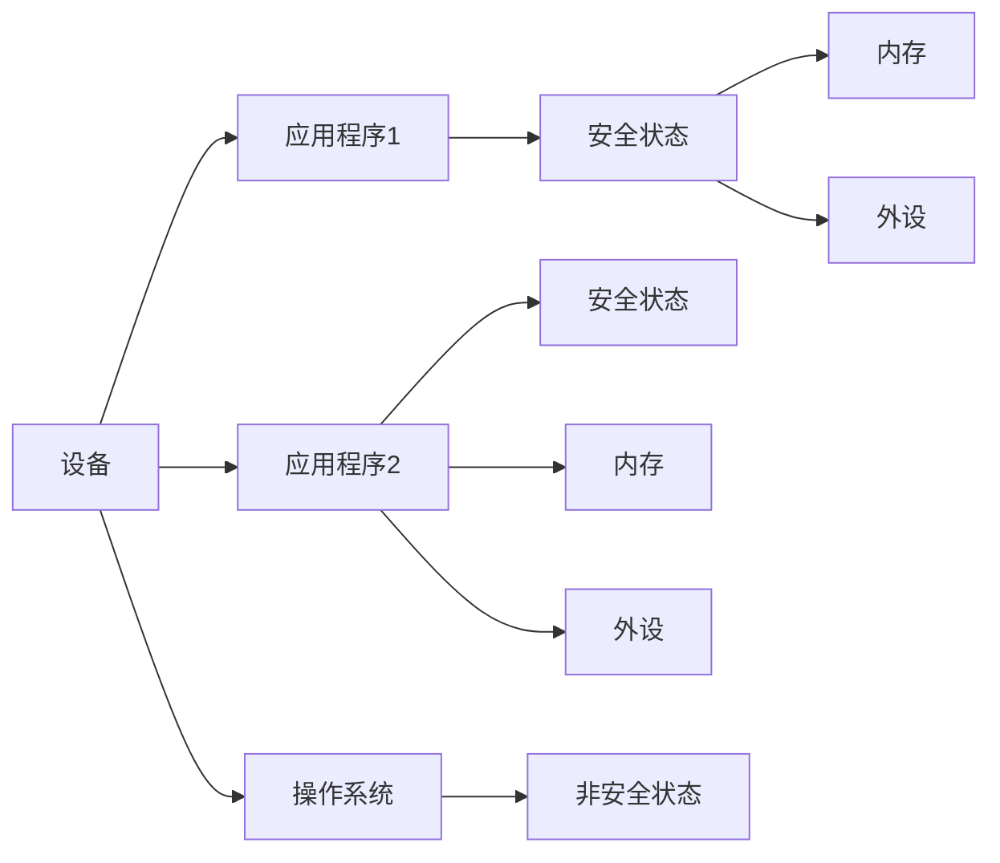

                 

# ARM TrustZone：移动设备安全的基石

在移动设备的迅猛发展下，信息安全成为了人们关注的核心问题。与传统电脑相比，移动设备面临着更复杂的威胁，如设备丢失、应用程序被恶意篡改等。而ARM TrustZone技术，作为一种高效安全机制，成为了移动设备安全的基石。本文将深入探讨ARM TrustZone的原理、架构、优势及其应用，为开发者和用户提供一个全面的了解。

## 1. 背景介绍

### 1.1 问题由来
移动设备的普及让信息安全问题日益严重。一方面，设备价值高，如果丢失或被窃取，将对个人隐私和公司机密造成严重影响；另一方面，应用程序被恶意篡改，可能导致用户数据泄露或恶意行为。面对这些问题，仅靠传统操作系统提供的安全机制已无法满足需求。ARM TrustZone技术应运而生，提供了一种在硬件层面上保障移动设备安全的新方法。

### 1.2 问题核心关键点
ARM TrustZone技术的主要目标是通过硬件隔离技术，为应用程序创建安全区域。应用程序可以在安全区域内运行，避免恶意软件的攻击，同时对用户数据提供强有力的保护。核心关键点包括：

- **硬件隔离**：使用ARM Cortex-M系列处理器中内置的安全技术，为应用程序创建安全区域。
- **非恶意代码隔离**：安全区域内运行的应用程序无法访问外部系统资源，从而隔离恶意代码对系统的攻击。
- **用户数据保护**：安全区域内处理敏感数据，避免了数据泄露的风险。

## 2. 核心概念与联系

### 2.1 核心概念概述

ARM TrustZone是一种硬件隔离技术，通过创建安全和非安全区域，保护敏感数据和应用程序免受恶意软件的攻击。其核心概念包括：

- **安全状态（Secure State）**：应用程序在安全区域内运行，可以访问部分系统资源，但无法修改系统配置。
- **非安全状态（Non-Secure State）**：应用程序在非安全区域运行，可以访问所有系统资源，包括修改系统配置。

通过在ARM Cortex-M处理器中内置的TrustZone架构，可以在设备上创建多个安全区域，为不同的应用程序提供独立的运行环境。

### 2.2 核心概念原理和架构的 Mermaid 流程图



在图中，设备通过TrustZone技术创建了两个应用程序的安全状态。应用程序1和应用程序2都在安全区域内运行，可以访问有限的系统资源。而操作系统在非安全区域运行，可以访问所有系统资源。内存和外设根据应用程序所在的状态被分配给相应的区域。

### 2.3 核心概念间的联系

TrustZone技术的核心概念间具有以下联系：

- 安全状态与非安全状态的区分：安全状态只允许有限的操作，而非安全状态则几乎可以执行任何操作。
- 硬件隔离：通过隔离不同的安全状态，保护应用程序免受其他状态下的攻击。
- 应用程序隔离：通过隔离不同的应用程序，保护其运行环境不受其他应用程序的干扰。

## 3. 核心算法原理 & 具体操作步骤

### 3.1 算法原理概述

TrustZone技术的核心算法原理在于利用硬件隔离，创建多个安全状态。安全状态和非安全状态通过硬件电路和指令集来区分，确保应用程序在安全状态下无法访问非安全状态下的系统资源。

### 3.2 算法步骤详解

TrustZone技术的具体操作步骤包括：

1. **创建安全区域**：利用硬件隔离技术，在ARM Cortex-M处理器中创建多个安全区域。
2. **设置应用程序状态**：应用程序根据需求选择运行在安全状态或非安全状态。
3. **配置系统资源**：根据应用程序所在状态，分配相应的系统资源，如内存、外设等。
4. **执行应用程序**：在选定的安全状态下，加载和执行应用程序。

### 3.3 算法优缺点

ARM TrustZone技术的主要优点包括：

- **硬件隔离**：提供了物理隔离的安全机制，可以有效防止恶意软件的攻击。
- **隔离灵活**：支持创建多个安全区域，为不同的应用程序提供独立的运行环境。
- **轻量级**：基于硬件实现，对软件性能影响较小。

缺点包括：

- **资源消耗**：硬件隔离需要额外的硬件资源，会增加成本。
- **开发复杂**：应用程序需要在不同状态下进行切换，增加了开发的复杂性。
- **兼容性问题**：不同供应商的硬件平台可能存在兼容性问题。

### 3.4 算法应用领域

TrustZone技术在移动设备、物联网设备、智能家居等领域都有广泛的应用，尤其是在移动设备上，其安全保障作用显著。

- **移动设备**：保护移动设备的安全，防止设备丢失或被窃取后造成的数据泄露。
- **物联网设备**：保护物联网设备上的应用程序，防止恶意代码对设备造成损害。
- **智能家居**：保护智能家居设备的运行环境，防止黑客攻击和数据窃取。

## 4. 数学模型和公式 & 详细讲解 & 举例说明

### 4.1 数学模型构建

TrustZone技术的数学模型主要围绕着硬件隔离和状态切换进行构建。假设系统中有两个状态S和N，硬件隔离机制可以表示为：

$$
f(S, N) = \begin{cases}
1, & \text{如果状态S和N可以相互访问} \\
0, & \text{如果状态S和N不可以相互访问}
\end{cases}
$$

其中，$S$ 表示安全状态，$N$ 表示非安全状态，$f$ 表示硬件隔离函数。

### 4.2 公式推导过程

以应用程序状态切换为例，假设应用程序需要从非安全状态切换到安全状态，其数学模型可以表示为：

$$
s = g(S, N) = 
\begin{cases}
S, & \text{如果满足状态切换条件} \\
N, & \text{如果不满足状态切换条件}
\end{cases}
$$

其中，$g$ 表示状态切换函数，$S$ 表示安全状态，$N$ 表示非安全状态，$s$ 表示当前状态。

### 4.3 案例分析与讲解

以移动设备为例，假设手机中有两个应用程序，一个是银行应用程序，另一个是社交媒体应用程序。银行应用程序需要在安全状态下运行，以保护用户的银行账户信息。社交媒体应用程序则需要运行在非安全状态下，以实现完整的社交功能。

在这种情况下，手机会根据应用程序的需求，将银行应用程序分配到安全状态，将社交媒体应用程序分配到非安全状态。当银行应用程序需要访问社交媒体应用程序的数据时，硬件隔离机制将阻止其访问。

## 5. 项目实践：代码实例和详细解释说明

### 5.1 开发环境搭建

要进行TrustZone技术的开发实践，需要以下环境：

1. **ARM Cortex-M处理器**：TrustZone技术内置在ARM Cortex-M处理器中，需要硬件平台支持。
2. **IDE**：如IAR Embedded Workbench、GNU ARM Embedded等，用于开发和调试应用程序。
3. **操作系统**：如FreeRTOS、μC/OS-II等，用于管理应用程序的运行。

### 5.2 源代码详细实现

以下是一个简单的示例代码，演示如何在ARM Cortex-M处理器中实现TrustZone技术：

```c
#include "arm_trustzone.h"

void initialize_security_state(void) {
    // 设置应用程序运行在安全状态
    ARM_SetSecureState(1);
}

void application_running_in_secure_state(void) {
    // 应用程序在安全状态下，可以访问部分系统资源
    // 在此处进行数据处理和加密等操作
}

void application_running_in_non_secure_state(void) {
    // 应用程序在非安全状态下，可以访问所有系统资源
    // 在此处进行网络通信、文件读写等操作
}
```

### 5.3 代码解读与分析

- `initialize_security_state`函数：将应用程序设置为安全状态，只有安全状态下的应用程序才能访问部分系统资源。
- `application_running_in_secure_state`函数：应用程序在安全状态下，进行数据处理和加密等操作，避免数据泄露。
- `application_running_in_non_secure_state`函数：应用程序在非安全状态下，进行网络通信、文件读写等操作。

需要注意的是，应用程序在安全状态和非安全状态下的操作需要严格遵守硬件隔离规则，避免跨状态访问。

### 5.4 运行结果展示

运行上述代码后，应用程序将按照设定的状态运行，确保敏感数据在安全状态下进行处理，非敏感数据在非安全状态下进行通信。

## 6. 实际应用场景

TrustZone技术在移动设备中有着广泛的应用，以下是几个典型的应用场景：

### 6.1 移动设备安全

移动设备中最重要的安全威胁之一是应用程序被恶意篡改。通过TrustZone技术，应用程序可以在安全状态下运行，即使被恶意篡改，也无法访问敏感数据，从而有效防止数据泄露。

### 6.2 物联网设备安全

物联网设备通常需要运行多种应用程序，每个应用程序都有不同的安全需求。TrustZone技术可以根据应用程序的需求，创建多个安全区域，保护设备免受恶意攻击。

### 6.3 智能家居安全

智能家居设备通常需要处理敏感数据，如用户行为数据、家居环境数据等。通过TrustZone技术，可以在设备上创建安全区域，保护这些敏感数据不被恶意软件获取。

### 6.4 未来应用展望

随着物联网、智能家居等设备的普及，TrustZone技术的应用前景将更加广阔。未来，TrustZone技术将结合人工智能、区块链等技术，进一步提升设备的智能安全和隐私保护能力。

## 7. 工具和资源推荐

### 7.1 学习资源推荐

为了更好地掌握TrustZone技术，以下是一些推荐的资源：

1. **ARM TrustZone官方文档**：提供了详细的硬件架构和API说明，是学习TrustZone技术的必备资料。
2. **ARM Cortex-M开发者手册**：介绍了Cortex-M处理器的工作原理和开发环境，对理解TrustZone技术有帮助。
3. **IAR Embedded Workbench官方文档**：提供了IDE的使用方法和开发工具，可以帮助开发者高效进行应用程序开发。

### 7.2 开发工具推荐

TrustZone技术的开发需要相应的硬件平台和开发工具，以下是推荐的工具：

1. **ARM Cortex-M处理器**：TrustZone技术内置在ARM Cortex-M处理器中，是TrustZone技术开发的基础。
2. **IAR Embedded Workbench**：提供丰富的开发环境，支持TrustZone技术的应用程序开发。
3. **GNU ARM Embedded**：提供免费的开发环境，支持TrustZone技术的应用程序开发。

### 7.3 相关论文推荐

TrustZone技术的核心论文如下：

1. **TrustZone: Secure Execution on ARM Cortex-M Processors**：介绍了TrustZone技术的原理和应用，是理解TrustZone技术的经典论文。
2. **Security Enhanced Linux with TrustZone**：介绍了TrustZone技术在Linux系统中的应用，提供了实际案例。
3. **Secure Storages in ARM Cortex-M Series**：介绍了TrustZone技术在存储设备中的应用，提供了详细实现。

## 8. 总结：未来发展趋势与挑战

### 8.1 研究成果总结

TrustZone技术自问世以来，在移动设备、物联网设备、智能家居等领域中发挥了重要作用，成为了安全技术的基石。通过硬件隔离和状态切换，TrustZone技术保障了敏感数据和应用程序的安全，提升了设备的安全性和隐私保护能力。

### 8.2 未来发展趋势

TrustZone技术未来的发展趋势包括：

- **硬件升级**：随着硬件技术的发展，TrustZone技术将更加高效、稳定。
- **多状态切换**：未来TrustZone技术将支持更多状态切换，提供更灵活的安全机制。
- **跨平台兼容性**：TrustZone技术将支持更多硬件平台，提高跨平台兼容性。

### 8.3 面临的挑战

TrustZone技术在发展过程中面临以下挑战：

- **成本问题**：硬件隔离需要额外的硬件资源，增加了成本。
- **开发复杂性**：应用程序需要在不同状态下进行切换，增加了开发复杂性。
- **兼容性问题**：不同供应商的硬件平台可能存在兼容性问题。

### 8.4 研究展望

TrustZone技术的研究展望包括：

- **跨平台开发工具**：开发跨平台的TrustZone技术开发工具，降低开发复杂性。
- **硬件加速**：利用硬件加速技术，提升TrustZone技术的性能和效率。
- **智能监控**：结合人工智能技术，实现智能化的安全监控和告警。

TrustZone技术作为移动设备安全的基石，将继续发挥重要作用。未来，通过技术创新和产品迭代，TrustZone技术将更好地保障设备的安全性和隐私保护能力。

## 9. 附录：常见问题与解答

**Q1：TrustZone技术如何与现有操作系统协同工作？**

A: TrustZone技术通过硬件隔离机制，与操作系统协同工作。操作系统可以在安全状态下运行关键服务，而应用程序在安全状态下运行，无法访问非安全状态下的资源。

**Q2：TrustZone技术可以保护所有数据吗？**

A: TrustZone技术可以保护敏感数据，如用户的银行账户信息、隐私数据等。但对于非敏感数据，如应用程序的日志、临时数据等，可能无法提供全面的保护。

**Q3：TrustZone技术在开发中的难度有多大？**

A: TrustZone技术的开发难度较大，需要具备一定的硬件和软件知识。但通过学习和实践，可以逐步掌握其开发技巧。

**Q4：TrustZone技术是否可以与其他安全机制结合使用？**

A: TrustZone技术可以与其他安全机制结合使用，如加密技术、签名验证等，提升整体的安全性。

---

作者：禅与计算机程序设计艺术 / Zen and the Art of Computer Programming

